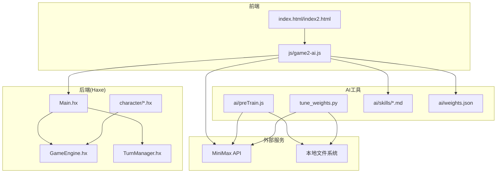
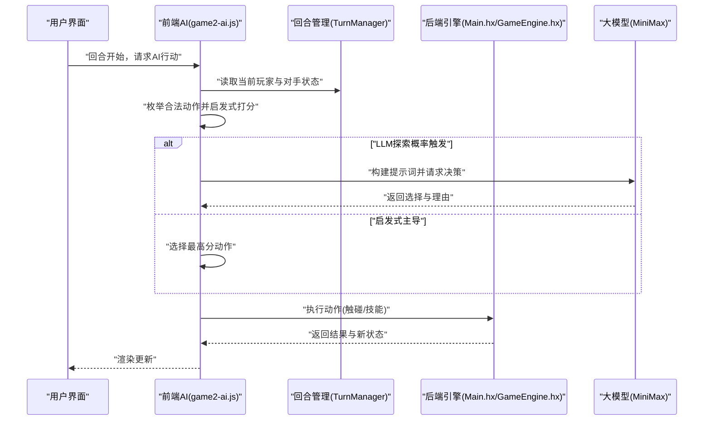
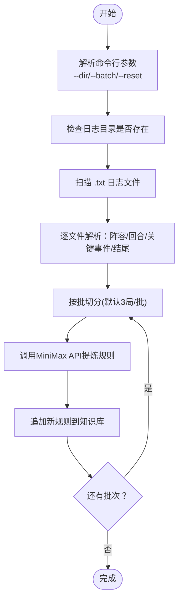
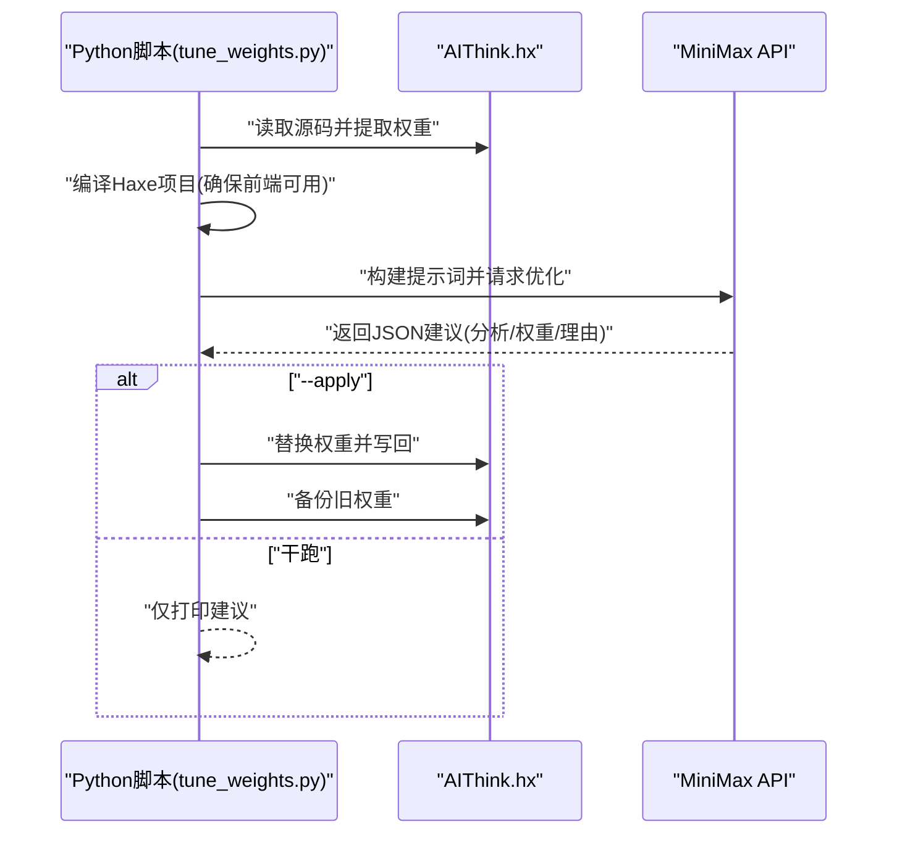
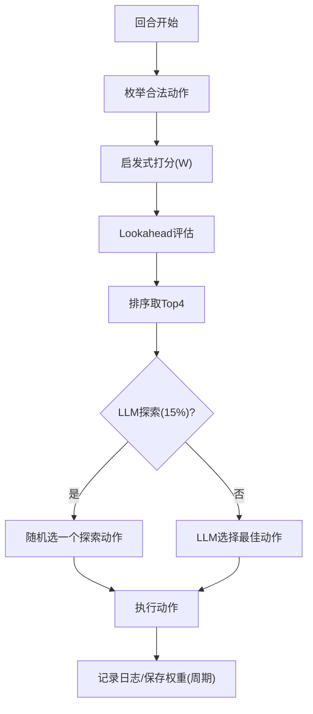
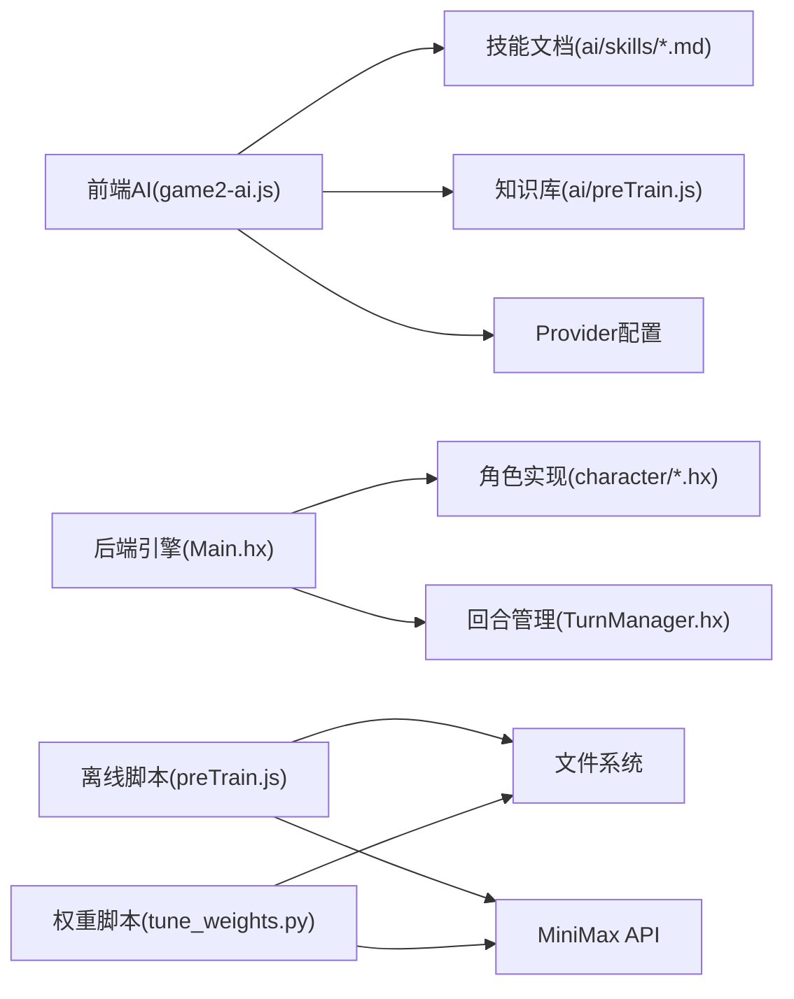

# AI学习系统

<cite>
**本文档引用的文件**
- [ai/preTrain.js](file://ai/preTrain.js)
- [tune_weights.py](file://tune_weights.py)
- [js/game2-ai.js](file://js/game2-ai.js)
- [ai/skills/小乔.md](file://ai/skills/小乔.md)
- [ai/skills/法师.md](file://ai/skills/法师.md)
- [ai/skills/张飞.md](file://ai/skills/张飞.md)
- [ai/skills/忍者.md](file://ai/skills/忍者.md)
- [ai/skills/大乔.md](file://ai/skills/大乔.md)
- [ai/skills/阴阳师.md](file://ai/skills/阴阳师.md)
- [ai/skills/鸦眼.md](file://ai/skills/鸦眼.md)
- [ai/weights.json](file://ai/weights.json)
- [Main.hx](file://Main.hx)
- [character/XiaoQiao.hx](file://character/XiaoQiao.hx)
- [character/ZhangFei.hx](file://character/ZhangFei.hx)
- [character/DaQiao.hx](file://character/DaQiao.hx)
- [character/YaYan.hx](file://character/YaYan.hx)
</cite>

## 目录
1. [简介](#简介)
2. [项目结构](#项目结构)
3. [核心组件](#核心组件)
4. [架构概览](#架构概览)
5. [详细组件分析](#详细组件分析)
6. [依赖分析](#依赖分析)
7. [性能考虑](#性能考虑)
8. [故障排查指南](#故障排查指南)
9. [结论](#结论)
10. [附录](#附录)

## 简介
本项目是一个结合离线知识提炼与在线权重优化的AI学习系统，面向“指尖博弈”类回合制战斗游戏。系统包含三层能力：
- 离线AI训练：通过解析历史对战日志，借助大模型提炼可操作的经验规则，形成可迭代的知识库。
- 在线权重优化：通过Python脚本读取当前权重，结合游戏规则与对局表现，请求大模型给出优化建议并回写权重。
- AI决策与训练：前端JavaScript实现启发式打分、LLM决策、角色技能与权重融合、自战训练与权重持久化。

## 项目结构
项目采用前后端分离与多语言混合架构：
- 前端：HTML/CSS/JS，负责渲染、交互与AI推理调用
- 后端：Haxe编译为JS运行，负责游戏引擎、回合管理、角色逻辑
- AI工具：Node.js与Python脚本，负责离线知识提炼与权重优化

**图表来源**
- [js/game2-ai.js:1-1057](file://js/game2-ai.js#L1-L1057)
- [Main.hx:1-411](file://Main.hx#L1-L411)
- [ai/preTrain.js:1-180](file://ai/preTrain.js#L1-L180)
- [tune_weights.py:1-292](file://tune_weights.py#L1-L292)

**章节来源**
- [js/game2-ai.js:1-1057](file://js/game2-ai.js#L1-L1057)
- [Main.hx:1-411](file://Main.hx#L1-L411)
- [ai/preTrain.js:1-180](file://ai/preTrain.js#L1-L180)
- [tune_weights.py:1-292](file://tune_weights.py#L1-L292)

## 核心组件
- 知识库与离线学习
  - 通过Node.js脚本扫描日志目录，解析对战记录，分批调用大模型提炼经验规则，追加到知识库文件。
  - 支持重置知识库为初始版本，便于基准对比。
- 权重系统与优化
  - JavaScript侧维护全局基础权重与角色专属权重，支持热更新与持久化。
  - Python脚本读取Haxe源码中的权重定义，请求大模型给出优化建议，支持干跑与应用更新两种模式。
- AI决策与训练
  - 前端AI模块负责回合决策：枚举合法动作、启发式打分、轻量Lookahead、LLM探索与最终执行。
  - 自战训练：随机挑选角色组成四人阵容，自动对战并周期性保存权重与知识库。

**章节来源**
- [ai/preTrain.js:1-180](file://ai/preTrain.js#L1-L180)
- [tune_weights.py:1-292](file://tune_weights.py#L1-L292)
- [js/game2-ai.js:1-1057](file://js/game2-ai.js#L1-L1057)

## 架构概览
系统采用“前端AI推理 + 后端游戏引擎 + AI工具链”的分层设计。前端AI模块在回合开始时调用启发式打分与LLM决策，后端Haxe负责严格的规则执行与状态管理。

**图表来源**
- [js/game2-ai.js:184-250](file://js/game2-ai.js#L184-L250)
- [Main.hx:252-261](file://Main.hx#L252-L261)

## 详细组件分析

### 离线AI训练流程（ai/preTrain.js）
- 输入：日志目录（默认./log），可指定目录、批大小、重置知识库。
- 处理：遍历日志，解析对战阵容、回合数、关键事件与结尾状态；按批构造提示词；调用MiniMax API；追加新规则至知识库。
- 输出：更新后的知识库文件，包含历史经验提炼结果。

**图表来源**
- [ai/preTrain.js:124-179](file://ai/preTrain.js#L124-L179)

**章节来源**
- [ai/preTrain.js:1-180](file://ai/preTrain.js#L1-L180)

### 权重优化机制（tune_weights.py）
- 权重提取：从Haxe源码中正则匹配权重常量，构建当前权重字典。
- 编译验证：调用Haxe编译器确保前端资源最新。
- 优化请求：构建游戏规则与权重上下文，请求大模型给出优化建议（JSON）。
- 应用更新：可干跑查看建议，或写回Haxe源码并备份旧版本。

**图表来源**
- [tune_weights.py:220-278](file://tune_weights.py#L220-L278)

**章节来源**
- [tune_weights.py:1-292](file://tune_weights.py#L1-L292)

### AI技能库与权重系统（js/game2-ai.js）
- 权重体系
  - 全局基础权重：兜底默认值，覆盖星值、零组合、六组合、击杀奖励、路径激励等。
  - 角色专属权重：从技能文档的“权重”代码块解析，与基础权重合并。
  - 热更新与持久化：支持运行时更新角色权重并通过API写回技能文档。
- 决策流程
  - 枚举合法动作：排除友方、死亡目标、无效触碰。
  - 启发式打分：基于权重表计算即时收益、组合潜力、风险评估、对手威胁、角色特例。
  - Lookahead：估算伤害、击杀奖励、对对手组合的抑制、两步路径激励。
  - LLM探索：15%概率随机探索Top-N动作，其余由LLM选择。
  - 执行动作：记录日志并调用后端执行。

**图表来源**
- [js/game2-ai.js:255-272](file://js/game2-ai.js#L255-L272)
- [js/game2-ai.js:279-434](file://js/game2-ai.js#L279-L434)
- [js/game2-ai.js:642-690](file://js/game2-ai.js#L642-L690)

**章节来源**
- [js/game2-ai.js:1-1057](file://js/game2-ai.js#L1-L1057)

### AI技能库设计（ai/skills/*.md）
系统内置11种角色的AI策略模板，每份文档包含：
- 权重块：角色专属权重集合，覆盖星值、零组合、六组合、击杀奖励、路径激励、角色特例等。
- 技能介绍：角色技能与机制说明。
- 核心定位与机制：角色定位、核心机制与优先级。
- 战术要点与克制关系：实战建议与相克关系。

示例角色与权重要点：
- 小乔：强调[0,6]/[6,6]回血与输出、护盾升级、从容布局。
- 法师：优先[0,1/5/8/9]组合、追加法伤与雷霆、雷霆回血。
- 张飞：怒气→狂暴、模态切换、免伤利用、模态选择。
- 忍者：毒层=减伤+回血双收益、[7,7]快速积累。
- 大乔：抢夺回血为核心、进化时机、复活甲策略。
- 阴阳师：模态切换型、护盾回血、阴阳直切代价。
- 鸦眼：乌鸦诅咒→灼燃箭→魔王剑循环。

**章节来源**
- [ai/skills/小乔.md:1-44](file://ai/skills/小乔.md#L1-L44)
- [ai/skills/法师.md:1-32](file://ai/skills/法师.md#L1-L32)
- [ai/skills/张飞.md:1-44](file://ai/skills/张飞.md#L1-L44)
- [ai/skills/忍者.md:1-32](file://ai/skills/忍者.md#L1-L32)
- [ai/skills/大乔.md:1-55](file://ai/skills/大乔.md#L1-L55)
- [ai/skills/阴阳师.md:1-50](file://ai/skills/阴阳师.md#L1-L50)
- [ai/skills/鸦眼.md:1-34](file://ai/skills/鸦眼.md#L1-L34)

### 权重调整机制与参数调优
- Python脚本使用方法
  - 干跑模式：python tune_weights.py 查看优化建议。
  - 应用模式：python tune_weights.py --apply 写回AIThink.hx并备份旧权重。
  - API密钥：支持环境变量或用户主目录下的密钥文件。
- 参数调优策略
  - 零风险与零组合平衡：评估WEIGHT_ZERO_RISK与WEIGHT_ZERO_COMBO的相对权重。
  - 双子星与零组合权衡：评估WEIGHT_DOUBLE_STAR与WEIGHT_ZERO_COMBO的性价比。
  - 回血权重与组合潜力：评估WEIGHT_HEAL与[x,6]组合的协同。
  - 对手零倒计时压力：评估WEIGHT_ZERO_COUNTDOWN的阈值。
  - 角色特例权重：评估角色专属bonus对整体评分的影响。
- 效果评估标准
  - 自战胜率：训练周期性统计不同Provider的胜率与对局数。
  - 权重稳定性：观察权重变化幅度与收敛情况。
  - 模型一致性：不同Provider的决策一致性与分歧度。

**章节来源**
- [tune_weights.py:282-292](file://tune_weights.py#L282-L292)
- [js/game2-ai.js:20-40](file://js/game2-ai.js#L20-L40)

### AI知识库结构与管理
- 结构
  - 知识库文件：由离线脚本追加规则，包含历史经验提炼段落。
  - 初始备份：首次运行时备份当前知识库为初始版本，支持重置。
  - 分批处理：按批调用大模型，避免速率限制。
- 管理
  - 重置：--reset选项将知识库重置为初始版本。
  - 备份：当前知识库会在存在时复制为初始备份文件。
  - 追加：新规则按批次追加到知识库末尾。

**章节来源**
- [ai/preTrain.js:124-179](file://ai/preTrain.js#L124-L179)

### AI训练最佳实践
- 训练样本质量要求
  - 日志完整性：包含对战开始、关键事件、结尾状态与最终胜负。
  - 样本多样性：涵盖不同角色组合、不同阵容与不同对局节奏。
  - 样本时效性：优先使用近期高质量日志，剔除异常或异常短对局。
- 收敛性判断标准
  - 胜率稳定：连续若干批次胜率波动小于阈值。
  - 权重收敛：权重变化幅度小于阈值且持续多批次。
  - 决策一致性：LLM与启发式决策的一致性提升。
- 过拟合预防措施
  - 数据增强：引入不同Provider与不同权重组合的混合训练。
  - 正则化：对权重进行适度惩罚，避免极端值。
  - 交叉验证：使用不同日志子集进行验证，评估泛化能力。

**章节来源**
- [ai/preTrain.js:109-121](file://ai/preTrain.js#L109-L121)
- [js/game2-ai.js:745-770](file://js/game2-ai.js#L745-L770)

### AI系统扩展指南
- 添加新角色AI策略
  - 创建技能文档：在ai/skills目录新增角色.md，包含权重块、技能介绍、核心定位与优先级。
  - 更新前端权重：在前端AI模块中确保角色名称映射与权重解析逻辑可用。
  - 验证与测试：通过自战训练验证新角色策略的有效性。
- 改进现有算法
  - 权重优化：使用Python脚本进行权重优化，结合大模型建议与自战反馈。
  - 决策逻辑：扩展启发式打分与Lookahead评估，增加新的组合与策略分支。
  - 知识库迭代：定期运行离线脚本，提炼新经验并更新知识库。

**章节来源**
- [js/game2-ai.js:715-722](file://js/game2-ai.js#L715-L722)
- [ai/skills/小乔.md:1-44](file://ai/skills/小乔.md#L1-L44)

## 依赖分析
- 前端AI模块依赖
  - 角色技能文档：用于角色特例权重与策略参考。
  - 知识库：用于LLM决策时的上下文提示。
  - Provider配置：支持不同大模型提供商的切换。
- 后端引擎依赖
  - 角色实现：角色特有逻辑（如小乔的回血反伤、张飞的模态切换、大乔的抢夺与进化、鸦眼的乌鸦循环）。
  - 回合管理：确保动作合法性与状态一致性。
- AI工具依赖
  - 文件系统：读取日志与技能文档，写入知识库与权重备份。
  - 大模型API：MiniMax API用于知识提炼与权重优化。

**图表来源**
- [js/game2-ai.js:130-179](file://js/game2-ai.js#L130-L179)
- [ai/preTrain.js:25-27](file://ai/preTrain.js#L25-L27)
- [tune_weights.py:23-26](file://tune_weights.py#L23-L26)

**章节来源**
- [js/game2-ai.js:1-1057](file://js/game2-ai.js#L1-L1057)
- [Main.hx:1-411](file://Main.hx#L1-L411)
- [ai/preTrain.js:1-180](file://ai/preTrain.js#L1-L180)
- [tune_weights.py:1-292](file://tune_weights.py#L1-L292)

## 性能考虑
- LLM调用节流：离线脚本与权重脚本均设置了速率限制与超时控制，避免API限流。
- 前端推理优化：启发式打分与Lookahead评估在合理范围内进行，避免深度搜索导致延迟。
- 权重持久化：周期性保存权重，减少频繁IO操作对性能的影响。
- 编译缓存：权重脚本在调用大模型前进行编译，确保前端资源最新。

[本节为通用指导，无需特定文件分析]

## 故障排查指南
- 离线学习失败
  - 检查日志目录是否存在与权限。
  - 确认MiniMax API密钥配置（环境变量或用户主目录文件）。
  - 查看批次处理日志，定位具体失败批次。
- 权重优化失败
  - 确认Haxe编译成功，前端资源可用。
  - 检查大模型响应格式，确保包含优化权重的JSON片段。
  - 若应用更新失败，检查备份文件与权限。
- AI决策异常
  - 检查角色权重是否正确解析与合并。
  - 确认Provider配置与网络连接。
  - 查看前端日志与后端trace输出，定位动作合法性问题。

**章节来源**
- [ai/preTrain.js:132-135](file://ai/preTrain.js#L132-L135)
- [tune_weights.py:74-78](file://tune_weights.py#L74-L78)
- [js/game2-ai.js:663-689](file://js/game2-ai.js#L663-L689)

## 结论
本AI学习系统通过离线知识提炼与在线权重优化相结合，实现了可迭代、可扩展的智能决策框架。前端AI模块以启发式打分为基础，辅以LLM探索与知识库提示，后端Haxe确保规则严谨执行。通过角色技能库与权重系统，系统能够针对不同角色制定差异化策略，并通过训练与优化持续提升性能。建议在实践中持续迭代知识库与权重，结合自战训练与专家反馈，逐步提升AI的实战水平。

[本节为总结性内容，无需特定文件分析]

## 附录
- 角色特例与实现要点
  - 小乔：回血反伤、打人补给、护盾升级、0停留回合增加。
  - 张飞：模态切换、怒气与狂暴、免伤利用、模态2对第二目标追加伤害。
  - 大乔：抢夺回血、进化为神大乔、复活甲机制。
  - 鸦眼：乌鸦诅咒、灼燃箭、魔王剑循环与触发注入。

**章节来源**
- [character/XiaoQiao.hx:17-96](file://character/XiaoQiao.hx#L17-L96)
- [character/ZhangFei.hx:22-273](file://character/ZhangFei.hx#L22-L273)
- [character/DaQiao.hx:20-281](file://character/DaQiao.hx#L20-L281)
- [character/YaYan.hx:25-174](file://character/YaYan.hx#L25-L174)