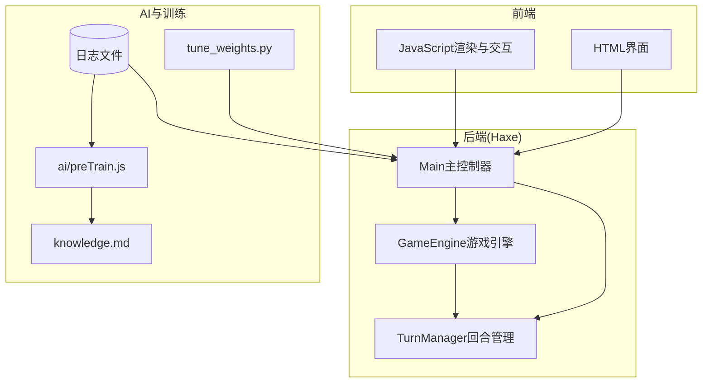
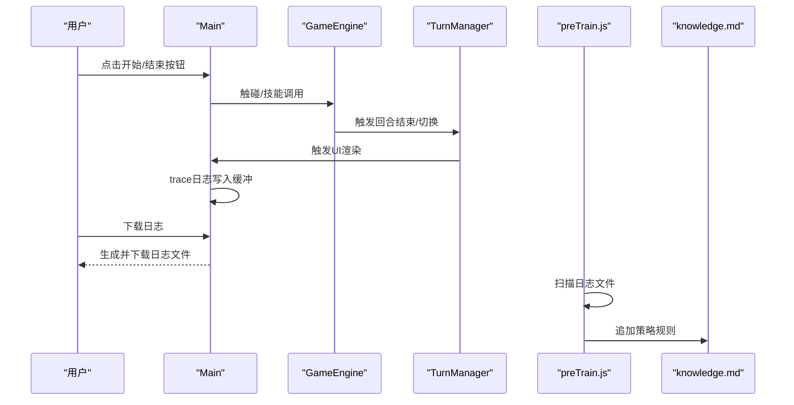
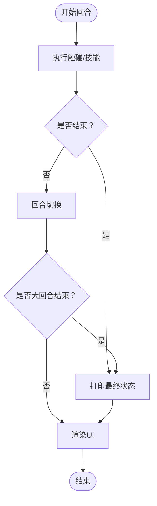
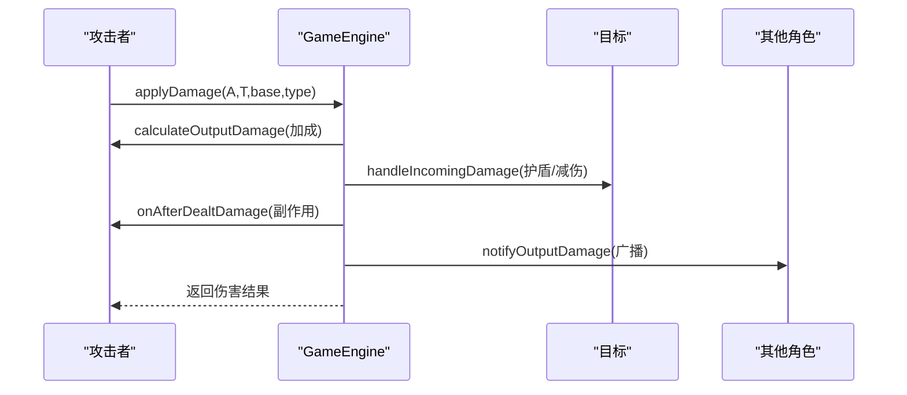
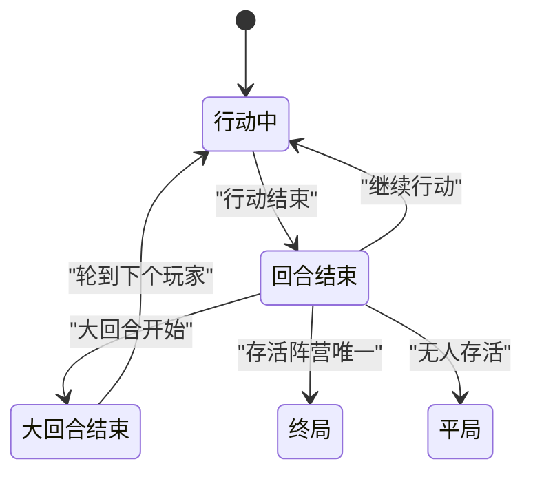
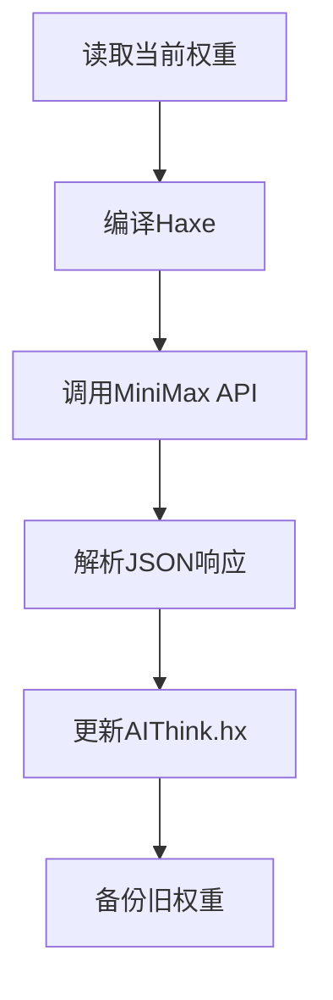
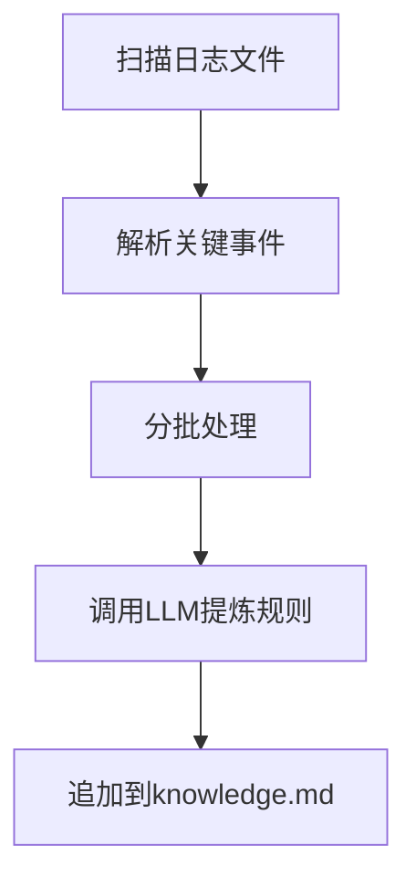
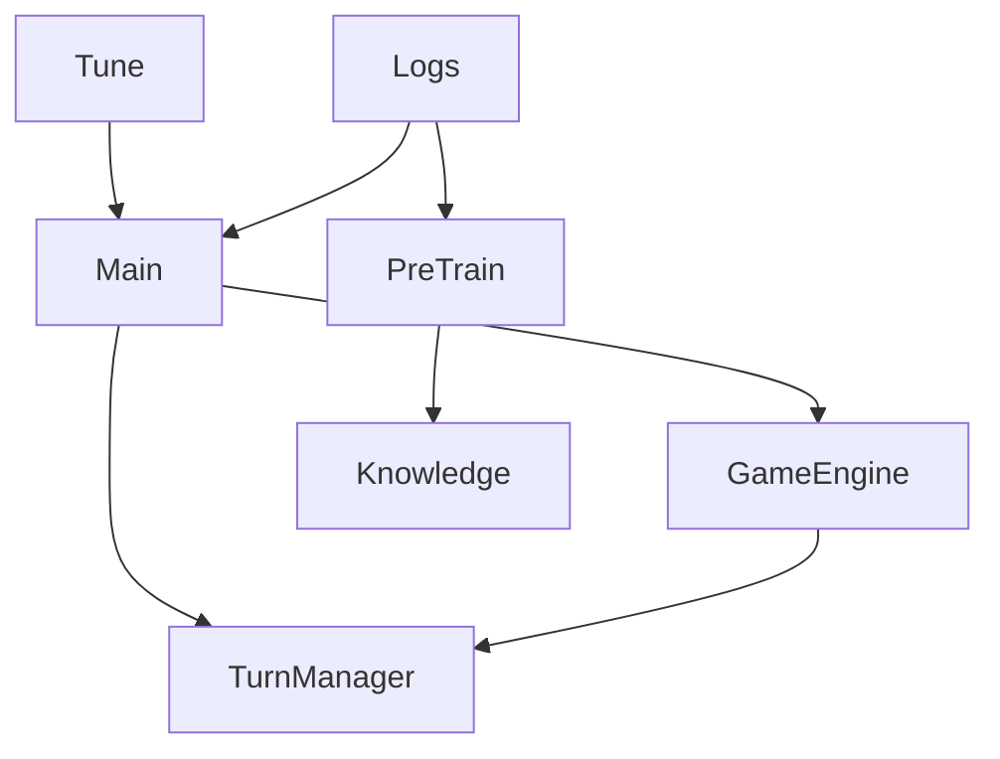

# AI性能监控

<cite>
**本文档引用的文件**
- [Main.hx](file://Main.hx)
- [GameEngine.hx](file://GameEngine.hx)
- [TurnManager.hx](file://TurnManager.hx)
- [tune_weights.py](file://tune_weights.py)
- [preTrain.js](file://ai/preTrain.js)
- [log_小乔_vs_忍者_vs_法师_vs_孙悟空_2026-06-06_11-49-30.txt](file://log/log_小乔_vs_忍者_vs_法师_vs_孙悟空_2026-06-06_11-49-30.txt)
- [log_藏师_vs_小乔_vs_法师_vs_大乔_2026-06-06_14-06-57.txt](file://log/log_藏师_vs_小乔_vs_法师_vs_大乔_2026-06-06_14-06-57.txt)
- [log_藏师_vs_小乔_vs_法师_vs_阴阳师_2026-06-06_13-26-23.txt](file://log/log_藏师_vs_小乔_vs_法师_vs_阴阳师_2026-06-06_13-26-23.txt)
- [train_0_REBEL_2026-06-12T07-11.txt](file://log/train_0_REBEL_2026-06-12T07-11.txt)
- [train_21_HERO_2026-06-11T14-48.txt](file://log/train_21_HERO_2026-06-11T14-48.txt)
- [knowledge.md](file://ai/knowledge.md)
- [小乔.md](file://ai/skills/小乔.md)
- [张飞.md](file://ai/skills/张飞.md)
- [大乔.md](file://ai/skills/大乔.md)
- [鸦眼.md](file://ai/skills/鸦眼.md)
</cite>

## 目录
1. [简介](#简介)
2. [项目结构](#项目结构)
3. [核心组件](#核心组件)
4. [架构概览](#架构概览)
5. [详细组件分析](#详细组件分析)
6. [依赖关系分析](#依赖关系分析)
7. [性能考量](#性能考量)
8. [故障排查指南](#故障排查指南)
9. [结论](#结论)
10. [附录](#附录)

## 简介
本文件为AI性能监控系统的综合文档，围绕训练日志的采集、分析与可视化展开，涵盖以下主题：
- 训练日志的分析方法：胜率统计、回合数分布、关键事件频率
- 不同角色AI的表现差异：技能使用效率、策略适应性、学习曲线
- 性能指标定义与计算：收敛速度、稳定性评估、泛化能力测试
- 监控工具使用：日志可视化、趋势分析、异常检测
- 性能优化指导：超参数调优、数据质量提升、算法改进策略

## 项目结构
该项目采用前后端分离的架构，前端负责用户交互与渲染，后端核心逻辑在Haxe中实现，训练与离线分析通过Python脚本完成。

**图表来源**
- [Main.hx:1-411](file://Main.hx#L1-L411)
- [GameEngine.hx:1-725](file://GameEngine.hx#L1-L725)
- [TurnManager.hx:1-232](file://TurnManager.hx#L1-L232)
- [tune_weights.py:1-292](file://tune_weights.py#L1-L292)
- [preTrain.js:1-180](file://ai/preTrain.js#L1-L180)

**章节来源**
- [Main.hx:1-411](file://Main.hx#L1-L411)
- [GameEngine.hx:1-725](file://GameEngine.hx#L1-L725)
- [TurnManager.hx:1-232](file://TurnManager.hx#L1-L232)
- [tune_weights.py:1-292](file://tune_weights.py#L1-L292)
- [preTrain.js:1-180](file://ai/preTrain.js#L1-L180)

## 核心组件
- 主控制器(Main)：负责页面交互、日志收集与下载、角色工厂与动作分发。
- 游戏引擎(GameEngine)：实现伤害/治疗/护盾流程、事件广播、组合技触发与“帮抗”机制。
- 回合管理(TurnManager)：管理回合推进、行动切换、终局判定、毒伤等回合结束效果。
- 权重调优(tune_weights.py)：读取当前权重、调用LLM生成优化建议、更新AI权重。
- 离线学习(preTrain.js)：扫描历史日志、抽取关键事件、调用LLM提炼策略规则、更新知识库。
- 日志系统：统一trace输出、UI滚动展示、回合快照、游戏结束汇总与下载。

**章节来源**
- [Main.hx:1-411](file://Main.hx#L1-L411)
- [GameEngine.hx:1-725](file://GameEngine.hx#L1-L725)
- [TurnManager.hx:1-232](file://TurnManager.hx#L1-L232)
- [tune_weights.py:1-292](file://tune_weights.py#L1-L292)
- [preTrain.js:1-180](file://ai/preTrain.js#L1-L180)

## 架构概览
系统通过Main桥接前端与后端逻辑，GameEngine集中处理战斗规则与事件，TurnManager控制回合节奏，日志贯穿全程用于监控与分析。训练阶段通过tune_weights.py与preTrain.js分别进行在线权重优化与离线知识提炼。

**图表来源**
- [Main.hx:1-411](file://Main.hx#L1-L411)
- [GameEngine.hx:1-725](file://GameEngine.hx#L1-L725)
- [TurnManager.hx:1-232](file://TurnManager.hx#L1-L232)
- [preTrain.js:1-180](file://ai/preTrain.js#L1-L180)

## 详细组件分析

### 日志系统与可视化
- trace输出：统一捕获trace输出，按回合添加时间戳，区分重要日志并滚动展示。
- 回合快照：每大回合结束打印全场状态快照，包含HP、双手、Buff、护盾、角色特有状态。
- 结束汇总：游戏结束时打印最终状态与获胜阵营。
- 日志下载：将缓冲内容拼接为文本，触发浏览器下载，便于离线分析。

**图表来源**
- [Main.hx:1-411](file://Main.hx#L1-L411)
- [TurnManager.hx:1-232](file://TurnManager.hx#L1-L232)

**章节来源**
- [Main.hx:1-411](file://Main.hx#L1-L411)
- [TurnManager.hx:1-232](file://TurnManager.hx#L1-L232)

### 战斗引擎与事件系统
- 伤害/治疗/护盾流程：标准化applyDamage/applyHeal/applyShield，支持角色加成、事件广播、VFX通知。
- 组合技触发：双子星、零组合、六组合等，按规则触发伤害、回血、护盾、中毒等效果。
- “帮抗”机制：记录伤害快照，允许抗伤位在特定条件下承受×1.5伤害并转移给辅助位。
- 场上事件广播：回血、护盾、输出、毒伤等事件通知所有角色，支撑角色技能联动。

**图表来源**
- [GameEngine.hx:1-725](file://GameEngine.hx#L1-L725)

**章节来源**
- [GameEngine.hx:1-725](file://GameEngine.hx#L1-L725)

### 回合管理与终局判定
- 回合开始：处理0手倒计时、强制手锁定提示、对手全0跳过判定。
- 回合结束：结算毒伤、回合结束Buff、护盾衰减；双八再动判定；怒气重置。
- 终局判定：阵营存活统计，单阵营获胜或平局。

**图表来源**
- [TurnManager.hx:1-232](file://TurnManager.hx#L1-L232)

**章节来源**
- [TurnManager.hx:1-232](file://TurnManager.hx#L1-L232)

### 权重调优与策略提炼

#### 在线权重调优(tune_weights.py)
- 读取当前权重：从AIThink.hx中提取权重参数。
- 编译Haxe：确保main.js最新。
- LLM优化：构建提示词，请求MiniMax给出优化建议。
- 更新权重：替换权重并备份旧版本。

**图表来源**
- [tune_weights.py:1-292](file://tune_weights.py#L1-L292)

**章节来源**
- [tune_weights.py:1-292](file://tune_weights.py#L1-L292)

#### 离线学习(preTrain.js)
- 扫描日志：遍历log目录下的txt文件。
- 解析关键事件：提取阵容、回合数、双子星、击杀、大招、帮抗等事件。
- 分批提交：将多局日志分批发送给LLM，提炼策略规则。
- 更新知识库：将新规则追加到knowledge.md。

**图表来源**
- [preTrain.js:1-180](file://ai/preTrain.js#L1-L180)

**章节来源**
- [preTrain.js:1-180](file://ai/preTrain.js#L1-L180)
- [knowledge.md:1-44](file://ai/knowledge.md#L1-L44)

### 角色技能与策略差异
- 小乔：物伤×1.5、回血×1.5、回血反伤、护盾全物法化、0手可持续3回合。适合攻防一体与补给循环。
- 张飞：模态切换、怒气→狂暴、双手差值免伤、模态二可双目标输出。适合高爆发与坦克位。
- 大乔：抢夺RECOVERY回血、打人回血、复活甲、进化为神大乔。适合团队续航与节奏控制。
- 鸦眼：乌鸦诅咒、灼燃箭、魔王剑，通过乌鸦加算与额外法伤形成高爆发循环。

**章节来源**
- [小乔.md:1-44](file://ai/skills/小乔.md#L1-L44)
- [张飞.md:1-44](file://ai/skills/张飞.md#L1-L44)
- [大乔.md:1-55](file://ai/skills/大乔.md#L1-L55)
- [鸦眼.md:1-34](file://ai/skills/鸦眼.md#L1-L34)

## 依赖关系分析

**图表来源**
- [Main.hx:1-411](file://Main.hx#L1-L411)
- [GameEngine.hx:1-725](file://GameEngine.hx#L1-L725)
- [TurnManager.hx:1-232](file://TurnManager.hx#L1-L232)
- [tune_weights.py:1-292](file://tune_weights.py#L1-L292)
- [preTrain.js:1-180](file://ai/preTrain.js#L1-L180)

**章节来源**
- [Main.hx:1-411](file://Main.hx#L1-L411)
- [GameEngine.hx:1-725](file://GameEngine.hx#L1-L725)
- [TurnManager.hx:1-232](file://TurnManager.hx#L1-L232)
- [tune_weights.py:1-292](file://tune_weights.py#L1-L292)
- [preTrain.js:1-180](file://ai/preTrain.js#L1-L180)

## 性能考量

### 训练日志分析方法
- 胜率统计：按日志文件中的结果字段统计阵营获胜次数，计算胜率与置信区间。
- 回合数分布：统计每局回合数，绘制直方图或箱线图，识别异常长/短对局。
- 关键事件频率：统计双子星、零组合、回血、护盾、中毒、帮抗等事件出现频次，分析策略偏好。

### 性能指标定义与计算
- 收敛速度：通过多轮训练中胜率与回合数的变化斜率评估收敛。
- 稳定性评估：计算胜率与回合数的标准差或变异系数，衡量波动程度。
- 泛化能力测试：在不同对手组合与随机种子下运行，比较指标差异。

### 监控工具使用
- 日志可视化：利用浏览器trace输出与回合快照，结合日志下载功能进行离线分析。
- 趋势分析：将多轮日志的关键事件与指标聚合，绘制时间序列图。
- 异常检测：设定阈值（如回合数异常、事件频率突变）触发告警。

### 性能优化指导
- 超参数调优：通过tune_weights.py定期请求LLM优化权重，结合知识库规则迭代。
- 数据质量提升：preTrain.js持续提炼策略规则，丰富知识库，提高AI决策质量。
- 算法改进策略：根据日志分析发现的薄弱环节（如特定角色克制、组合触发不足）调整权重与规则。

## 故障排查指南
- 日志未显示：检查trace重定向逻辑与UI面板是否存在。
- 回合卡顿：确认回合切换逻辑与事件广播是否正常，检查毒伤结算与护盾衰减。
- 权重未更新：确认tune_weights.py的编译步骤与文件写入权限。
- 知识库未更新：检查preTrain.js的API密钥与日志扫描路径。

**章节来源**
- [Main.hx:1-411](file://Main.hx#L1-L411)
- [GameEngine.hx:1-725](file://GameEngine.hx#L1-L725)
- [TurnManager.hx:1-232](file://TurnManager.hx#L1-L232)
- [tune_weights.py:1-292](file://tune_weights.py#L1-L292)
- [preTrain.js:1-180](file://ai/preTrain.js#L1-L180)

## 结论
本系统通过统一的日志采集、标准化的战斗引擎与回合管理、以及在线权重调优与离线知识提炼，实现了对AI性能的全链路监控与优化。结合角色技能差异与关键事件分析，能够有效评估不同策略的优劣，并指导持续改进。

## 附录

### 日志示例与分析要点
- 示例文件：参考多个训练日志，关注回合快照、关键事件与最终结果。
- 分析要点：双子星触发次数、零组合使用频率、回血/护盾覆盖率、帮抗使用情况、终局原因。

**章节来源**
- [log_小乔_vs_忍者_vs_法师_vs_孙悟空_2026-06-06_11-49-30.txt](file://log/log_小乔_vs_忍者_vs_法师_vs_孙悟空_2026-06-06_11-49-30.txt)
- [log_藏师_vs_小乔_vs_法师_vs_大乔_2026-06-06_14-06-57.txt](file://log/log_藏师_vs_小乔_vs_法师_vs_大乔_2026-06-06_14-06-57.txt)
- [log_藏师_vs_小乔_vs_法师_vs_阴阳师_2026-06-06_13-26-23.txt](file://log/log_藏师_vs_小乔_vs_法师_vs_阴阳师_2026-06-06_13-26-23.txt)
- [train_0_REBEL_2026-06-12T07-11.txt](file://log/train_0_REBEL_2026-06-12T07-11.txt)
- [train_21_HERO_2026-06-11T14-48.txt](file://log/train_21_HERO_2026-06-11T14-48.txt)