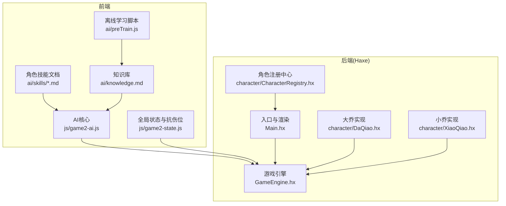
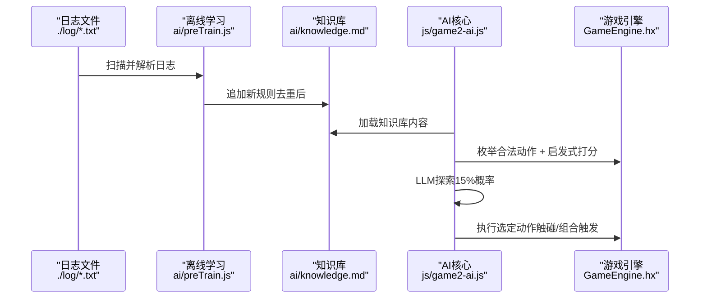
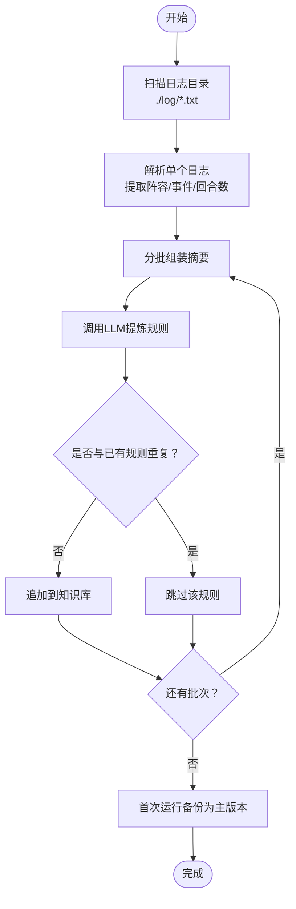
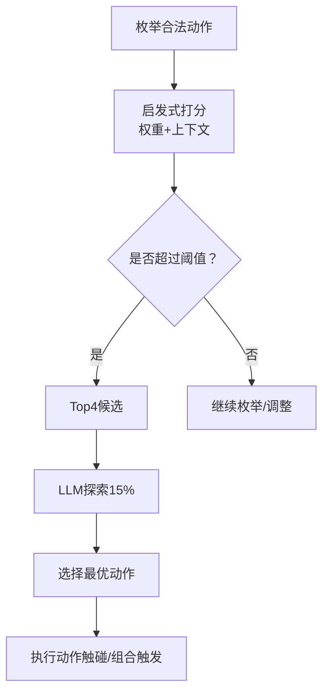
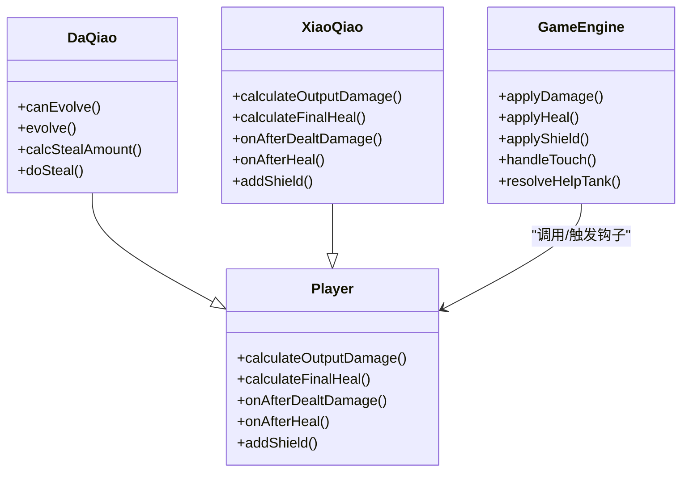
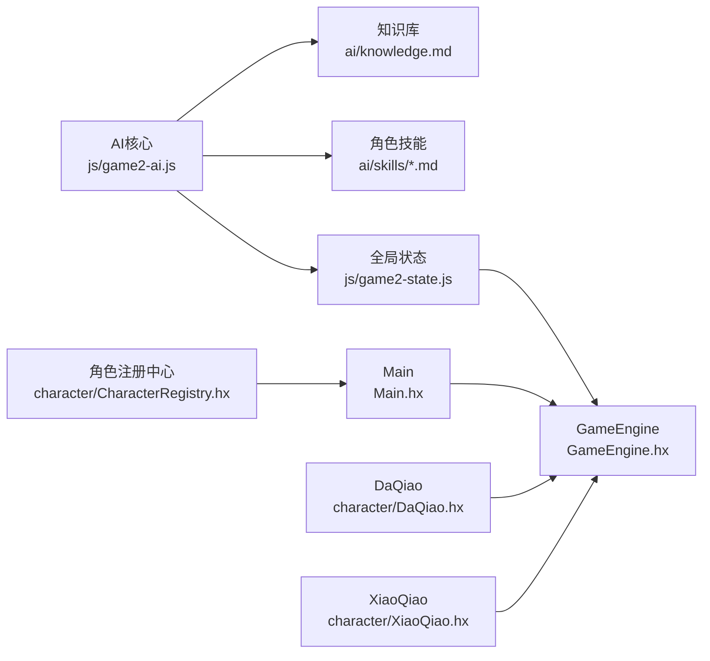

# AI知识库管理

<cite>
**本文档引用的文件**
- [ai/skills/大乔.md](file://ai/skills/大乔.md)
- [ai/skills/小乔.md](file://ai/skills/小乔.md)
- [ai/skills/张飞.md](file://ai/skills/张飞.md)
- [ai/skills/忍者.md](file://ai/skills/忍者.md)
- [ai/skills/法师.md](file://ai/skills/法师.md)
- [ai/skills/阴阳师.md](file://ai/skills/阴阳师.md)
- [ai/skills/鸦眼.md](file://ai/skills/鸦眼.md)
- [ai/preTrain.js](file://ai/preTrain.js)
- [ai/knowledge.md](file://ai/knowledge.md)
- [js/game2-ai.js](file://js/game2-ai.js)
- [js/game2-state.js](file://js/game2-state.js)
- [Main.hx](file://Main.hx)
- [GameEngine.hx](file://GameEngine.hx)
- [character/CharacterRegistry.hx](file://character/CharacterRegistry.hx)
- [character/DaQiao.hx](file://character/DaQiao.hx)
- [character/XiaoQiao.hx](file://character/XiaoQiao.hx)
</cite>

## 目录
1. [简介](#简介)
2. [项目结构](#项目结构)
3. [核心组件](#核心组件)
4. [架构总览](#架构总览)
5. [详细组件分析](#详细组件分析)
6. [依赖分析](#依赖分析)
7. [性能考量](#性能考量)
8. [故障排查指南](#故障排查指南)
9. [结论](#结论)
10. [附录](#附录)

## 简介
本文件为“AI知识库管理系统”的综合技术文档，围绕指尖博弈对战游戏中的AI决策体系展开，重点涵盖：
- 知识库结构设计：主知识库文件与初始化备份文件的职责与协作
- 11种角色的AI技能模板：技能描述格式、权重字段、优先级规则与组合效果策略
- 知识库动态更新机制：离线学习、规则提取算法、去重与版本管理
- 查询与匹配逻辑：规则优先级排序、条件匹配算法、决策树构建思路
- 维护最佳实践：规则质量评估、性能监控、扩展策略

## 项目结构
该项目采用前后端混合架构，AI核心逻辑位于前端JavaScript模块，Haxe负责后端游戏引擎与角色实现，知识库由Markdown文件与Node脚本共同维护。

图表来源
- [js/game2-ai.js:1-120](file://js/game2-ai.js#L1-L120)
- [js/game2-state.js:1-60](file://js/game2-state.js#L1-L60)
- [ai/preTrain.js:1-60](file://ai/preTrain.js#L1-L60)
- [Main.hx:1-60](file://Main.hx#L1-L60)
- [GameEngine.hx:1-60](file://GameEngine.hx#L1-L60)
- [character/CharacterRegistry.hx:1-40](file://character/CharacterRegistry.hx#L1-L40)
- [character/DaQiao.hx:1-40](file://character/DaQiao.hx#L1-L40)
- [character/XiaoQiao.hx:1-40](file://character/XiaoQiao.hx#L1-L40)

章节来源
- [js/game2-ai.js:1-120](file://js/game2-ai.js#L1-L120)
- [js/game2-state.js:1-60](file://js/game2-state.js#L1-L60)
- [ai/preTrain.js:1-60](file://ai/preTrain.js#L1-L60)
- [Main.hx:1-60](file://Main.hx#L1-L60)
- [GameEngine.hx:1-60](file://GameEngine.hx#L1-L60)
- [character/CharacterRegistry.hx:1-40](file://character/CharacterRegistry.hx#L1-L40)
- [character/DaQiao.hx:1-40](file://character/DaQiao.hx#L1-L40)
- [character/XiaoQiao.hx:1-40](file://character/XiaoQiao.hx#L1-L40)

## 核心组件
- AI核心模块（js/game2-ai.js）
  - 权重系统：全局兜底权重与角色专属权重合并
  - 启发式打分：基于权重与上下文的评分函数
  - LLM决策：在启发式基础上引入LLM进行探索与优化
  - 主动技能决策：针对特定角色的模态切换与技能使用
  - 帮抗决策：在AI控制双方时自动判定是否帮抗
- 全局状态与抗伤位（js/game2-state.js）
  - 阵容类型与抗伤位管理
  - 实际伤害目标解析（考虑阵容与抗伤位）
- 离线学习与知识库（ai/preTrain.js + ai/knowledge.md）
  - 历史日志解析与规则抽取
  - 知识库初始化备份与版本管理
- 游戏引擎与角色（Main.hx + GameEngine.hx + character/*）
  - 标准伤害/回血/护盾流程
  - 触碰与组合触发机制
  - 角色特有技能与钩子

章节来源
- [js/game2-ai.js:56-120](file://js/game2-ai.js#L56-L120)
- [js/game2-state.js:5-40](file://js/game2-state.js#L5-L40)
- [ai/preTrain.js:124-180](file://ai/preTrain.js#L124-L180)
- [ai/knowledge.md:1-44](file://ai/knowledge.md#L1-L44)
- [Main.hx:25-76](file://Main.hx#L25-L76)
- [GameEngine.hx:418-591](file://GameEngine.hx#L418-L591)

## 架构总览
AI决策流程分为三层：启发式打分（权重+上下文）、LLM增强（可选探索）、动作执行（触碰与组合触发）。知识库通过离线学习脚本从历史日志中提炼规则，并在运行时由AI模块加载使用。

图表来源
- [ai/preTrain.js:101-179](file://ai/preTrain.js#L101-L179)
- [ai/knowledge.md:1-44](file://ai/knowledge.md#L1-L44)
- [js/game2-ai.js:195-246](file://js/game2-ai.js#L195-L246)
- [GameEngine.hx:418-468](file://GameEngine.hx#L418-L468)

## 详细组件分析

### 知识库结构与动态更新机制
- 主知识库文件（ai/knowledge.md）
  - 通用原则、角色应对要点、2v2策略、0组合优先级等规则
  - 每条规则一行，按重要性排序，便于启发式匹配
- 初始化备份文件（ai/knowledge.init.md）
  - 首次运行时由离线学习脚本从主知识库复制生成，用于版本回退
- 离线学习脚本（ai/preTrain.js）
  - 解析日志：提取阵容、胜负、关键事件、回合数等
  - 分批调用LLM：基于现有知识库与对局摘要提炼新规则
  - 规则去重：保证新规则不在已有知识库中出现
  - 版本管理：首次运行备份主知识库为初始化版本；支持--reset重置为主版本

图表来源
- [ai/preTrain.js:61-121](file://ai/preTrain.js#L61-L121)
- [ai/preTrain.js:124-180](file://ai/preTrain.js#L124-L180)

章节来源
- [ai/knowledge.md:1-44](file://ai/knowledge.md#L1-L44)
- [ai/preTrain.js:124-180](file://ai/preTrain.js#L124-L180)

### 11种角色的AI技能模板与优先级
- 模板结构
  - 权重块：角色专属JSON权重，与全局兜底权重合并
  - 技能介绍：编号、名称、类型、效果
  - 核心定位与机制：玩法要点与机制说明
  - 优先级：基于组合价值与情境的行动优先级
  - 对局策略与禁忌：克制关系与风险提示
- 代表性角色模板（节选）
  - 大乔：抢夺回血、进化机制、复活甲
  - 小乔：物伤×1.5、回血×1.5、回血反伤、护盾升级
  - 张飞：怒气→狂暴、模态切换、免伤利用
  - 忍者：毒层=减伤+回血、法伤回血、解毒回血
  - 法师：0组合物伤翻倍、追加法伤、雷霆之怒
  - 阴阳师：三模态切换、灵护盾、阴阳直切代价
  - 鸦眼：乌鸦诅咒、灼燃箭、魔王剑
  - 藏师：2v2策略、蛋糕使用
  - 孙悟空：02冻结、输出优先
  - 赵云：双七高伤、抗伤位重定向
  - 杨大力：沙包单位（示例）

章节来源
- [ai/skills/大乔.md:1-55](file://ai/skills/大乔.md#L1-L55)
- [ai/skills/小乔.md:1-44](file://ai/skills/小乔.md#L1-L44)
- [ai/skills/张飞.md:1-44](file://ai/skills/张飞.md#L1-L44)
- [ai/skills/忍者.md:1-32](file://ai/skills/忍者.md#L1-L32)
- [ai/skills/法师.md:1-32](file://ai/skills/法师.md#L1-L32)
- [ai/skills/阴阳师.md:1-50](file://ai/skills/阴阳师.md#L1-L50)
- [ai/skills/鸦眼.md:1-34](file://ai/skills/鸦眼.md#L1-L34)

### AI决策与查询匹配逻辑
- 启发式打分（AI.score）
  - 基于权重的评分：双子星、凑0、0组合、路径激励、角色专属、上下文调节
  - 后视 lookahead：估算伤害、击杀奖励、帮助对方凑合的惩罚、路径激励
- LLM决策（AI.llm）
  - 从知识库与角色技能文档构建系统提示词
  - 从候选动作中选择最优动作，支持15%探索
- 主动技能决策（AI.decide）
  - 针对鸦眼、张飞、阴阳师、藏师、大乔等角色的模态切换与技能使用
- 抗伤位决策（AI.decide.tankPosition）
  - 双半肉阵容下，优先有盾者或血量更高者抗伤
- 实际伤害目标解析（getActualTarget）
  - 考虑阵容类型与抗伤位，确定实际伤害目标

图表来源
- [js/game2-ai.js:251-268](file://js/game2-ai.js#L251-L268)
- [js/game2-ai.js:294-406](file://js/game2-ai.js#L294-L406)
- [js/game2-ai.js:408-470](file://js/game2-ai.js#L408-L470)
- [js/game2-ai.js:678-726](file://js/game2-ai.js#L678-L726)
- [js/game2-state.js:118-162](file://js/game2-state.js#L118-L162)

章节来源
- [js/game2-ai.js:294-470](file://js/game2-ai.js#L294-L470)
- [js/game2-ai.js:678-726](file://js/game2-ai.js#L678-L726)
- [js/game2-state.js:118-162](file://js/game2-state.js#L118-L162)

### 角色实现与钩子联动
- 大乔（character/DaQiao.hx）
  - 抢夺回血监听、进化检测、复活甲机制
  - 与GameEngine事件广播联动，实现跨回合冷却与形态切换
- 小乔（character/XiaoQiao.hx）
  - 物伤×1.5、回血×1.5、回血反伤、护盾升级
  - 单手2/3触发护盾，与引擎护盾升级逻辑协同
- GameEngine（GameEngine.hx）
  - 标准伤害/回血/护盾流程，组合触发（双子星、0组合）
  - 帮抗快照与结算，抗伤位重定向解析

图表来源
- [character/DaQiao.hx:20-171](file://character/DaQiao.hx#L20-L171)
- [character/XiaoQiao.hx:17-95](file://character/XiaoQiao.hx#L17-L95)
- [GameEngine.hx:137-346](file://GameEngine.hx#L137-L346)

章节来源
- [character/DaQiao.hx:20-171](file://character/DaQiao.hx#L20-L171)
- [character/XiaoQiao.hx:17-95](file://character/XiaoQiao.hx#L17-L95)
- [GameEngine.hx:137-346](file://GameEngine.hx#L137-L346)

### 知识库维护最佳实践
- 规则质量评估
  - 重要性排序：规则按价值与适用范围排序，便于启发式优先匹配
  - 可操作性：规则需具体、可验证，避免模糊表述
  - 一致性：避免相互矛盾的规则，定期审查与合并
- 性能监控
  - 启发式打分复杂度：O(N)动作枚举 + O(1)权重查询，整体线性
  - LLM调用：限制频率与批大小，避免速率限制
  - 日志解析：按批处理，分段写入知识库，降低IO压力
- 扩展策略
  - 新角色：在角色注册中心注册，编写技能文档与权重块
  - 新规则：通过离线学习脚本自动化提炼，结合人工审核
  - 模型配置：支持多提供商切换，便于A/B测试与性能对比

章节来源
- [js/game2-ai.js:20-40](file://js/game2-ai.js#L20-L40)
- [ai/preTrain.js:101-179](file://ai/preTrain.js#L101-L179)
- [character/CharacterRegistry.hx:22-60](file://character/CharacterRegistry.hx#L22-L60)

## 依赖分析
- 前端依赖
  - AI核心依赖知识库与角色技能文档，运行时通过HTTP接口加载
  - 全局状态模块提供抗伤位与阵容解析，供引擎与AI共享
- 后端依赖
  - Main.hx负责角色工厂与动作分发，调用GameEngine执行规则
  - GameEngine提供标准伤害/回血/护盾流程，触发角色钩子
- 外部依赖
  - 离线学习脚本依赖MiniMax API，需配置API密钥或本地文件

图表来源
- [js/game2-ai.js:128-175](file://js/game2-ai.js#L128-L175)
- [js/game2-state.js:222-242](file://js/game2-state.js#L222-L242)
- [Main.hx:197-222](file://Main.hx#L197-L222)
- [GameEngine.hx:418-468](file://GameEngine.hx#L418-L468)
- [character/CharacterRegistry.hx:66-81](file://character/CharacterRegistry.hx#L66-L81)
- [character/DaQiao.hx:264-281](file://character/DaQiao.hx#L264-L281)
- [character/XiaoQiao.hx:77-95](file://character/XiaoQiao.hx#L77-L95)

章节来源
- [js/game2-ai.js:128-175](file://js/game2-ai.js#L128-L175)
- [js/game2-state.js:222-242](file://js/game2-state.js#L222-L242)
- [Main.hx:197-222](file://Main.hx#L197-L222)
- [GameEngine.hx:418-468](file://GameEngine.hx#L418-L468)
- [character/CharacterRegistry.hx:66-81](file://character/CharacterRegistry.hx#L66-L81)
- [character/DaQiao.hx:264-281](file://character/DaQiao.hx#L264-L281)
- [character/XiaoQiao.hx:77-95](file://character/XiaoQiao.hx#L77-L95)

## 性能考量
- 启发式打分
  - 动作枚举复杂度与玩家数量线性相关，建议在合法动作较少时使用
  - 权重查询为常数时间，整体开销可控
- LLM调用
  - 限制探索概率与批大小，避免频繁调用导致延迟
  - 通过缓存知识库与技能文档，减少网络请求
- 日志解析
  - 分批处理与节流，避免触发API速率限制
  - 文件系统写入采用追加方式，降低锁竞争

## 故障排查指南
- 知识库加载失败
  - 检查/ai/knowledge接口可用性与返回内容
  - 确认知识库文件存在且可读
- LLM调用异常
  - 检查MiniMax API密钥配置与网络连通性
  - 查看错误日志与超时设置
- 角色技能未生效
  - 确认角色技能文档中的权重块格式正确
  - 检查角色专属权重是否正确合并至全局权重
- 抗伤位解析异常
  - 确认全局状态模块已设置tankResolver
  - 检查阵容类型与抗伤位索引是否正确

章节来源
- [js/game2-ai.js:155-160](file://js/game2-ai.js#L155-L160)
- [ai/preTrain.js:29-59](file://ai/preTrain.js#L29-L59)
- [js/game2-state.js:222-242](file://js/game2-state.js#L222-L242)

## 结论
本AI知识库管理系统通过“权重驱动的启发式打分 + LLM探索 + 角色钩子联动”的方式，实现了对11种角色的高效决策与动态规则迭代。主知识库与初始化备份文件配合离线学习脚本，形成闭环的规则提炼与版本管理机制。通过合理的优先级规则、上下文调节与抗伤位解析，系统在保证性能的同时提升了对复杂对局的适应能力。

## 附录
- 角色注册中心（新增角色只需在注册中心添加一行）
- 大乔与小乔的角色实现细节（抢夺、进化、护盾升级等）
- 触碰与组合触发的完整流程（双子星、0组合、[x,6]等）

章节来源
- [character/CharacterRegistry.hx:22-60](file://character/CharacterRegistry.hx#L22-L60)
- [character/DaQiao.hx:20-171](file://character/DaQiao.hx#L20-L171)
- [character/XiaoQiao.hx:17-95](file://character/XiaoQiao.hx#L17-L95)
- [GameEngine.hx:418-591](file://GameEngine.hx#L418-L591)