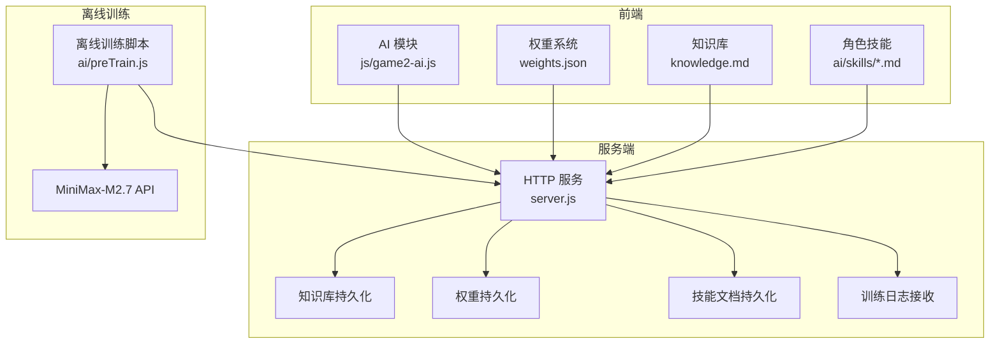
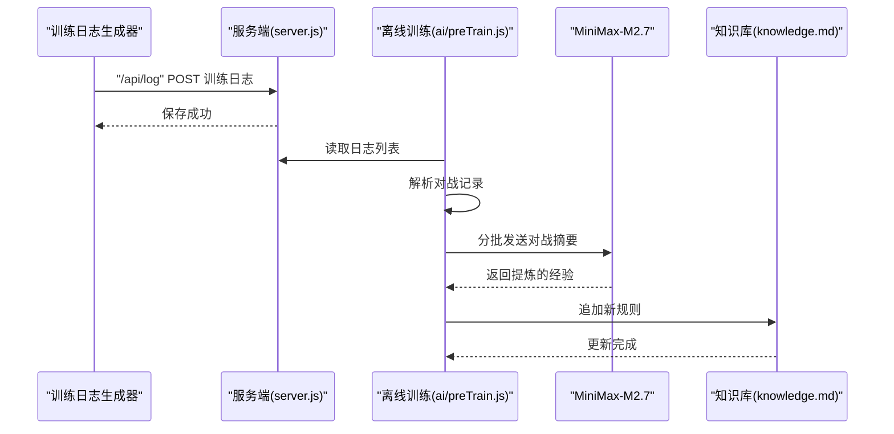
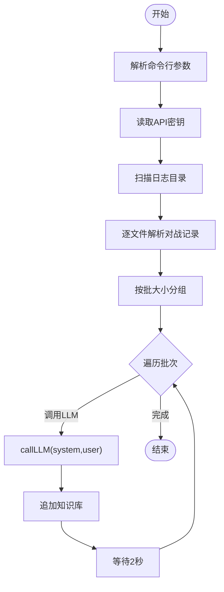
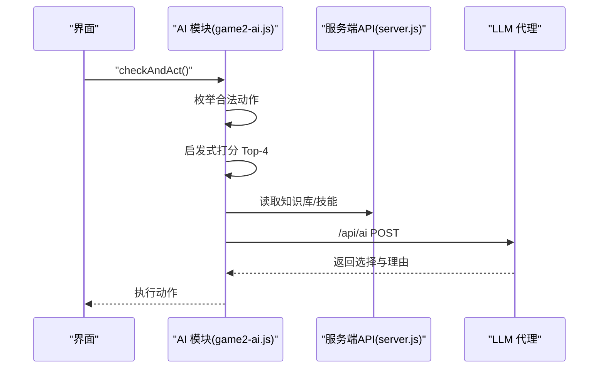
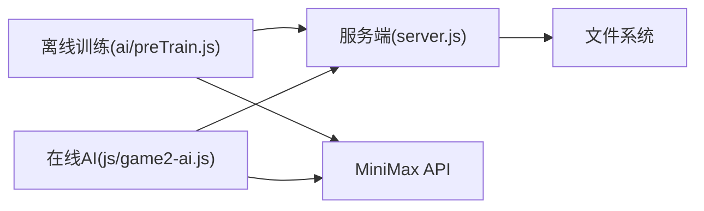

# AI训练流程

<cite>
**本文档引用的文件**
- [ai/preTrain.js](file://ai/preTrain.js)
- [js/game2-ai.js](file://js/game2-ai.js)
- [server.js](file://server.js)
- [tune_weights.py](file://tune_weights.py)
- [ai/knowledge.md](file://ai/knowledge.md)
- [ai/weights.json](file://ai/weights.json)
- [ai/skills/法师.md](file://ai/skills/法师.md)
- [ai/skills/小乔.md](file://ai/skills/小乔.md)
- [ai/skills/张飞.md](file://ai/skills/张飞.md)
- [log/train_0_REBEL_2026-06-12T07-11.txt](file://log/train_0_REBEL_2026-06-12T07-11.txt)
</cite>

## 目录
1. [简介](#简介)
2. [项目结构](#项目结构)
3. [核心组件](#核心组件)
4. [架构概览](#架构概览)
5. [详细组件分析](#详细组件分析)
6. [依赖分析](#依赖分析)
7. [性能考量](#性能考量)
8. [故障排查指南](#故障排查指南)
9. [结论](#结论)
10. [附录](#附录)

## 简介
本文件面向AI训练流程的技术文档，聚焦于离线AI训练的完整闭环：日志文件扫描与解析、对战记录抽取、批量处理与MiniMax-M2.7集成、训练数据预处理、权重微调与知识库沉淀。文档同时覆盖训练批次管理、速率限制处理、监控与调试方法，帮助读者快速理解并高效迭代AI训练体系。

## 项目结构
该项目采用前后端分离与AI训练脚本并存的组织方式：
- 前端AI模块：负责在线推理、权重加载、知识库读取、LLM调用与训练流程编排
- 服务端：提供HTTP API与WebSocket，承载知识库、权重、角色技能与训练日志的持久化与转发
- 训练脚本：离线扫描历史日志，批量喂给MiniMax-M2.7，提炼经验并追加到知识库
- 数据资产：知识库、权重文件、角色技能文档、训练日志

图表来源
- [js/game2-ai.js:75-102](file://js/game2-ai.js#L75-L102)
- [server.js:10-50](file://server.js#L10-L50)
- [ai/preTrain.js:16-28](file://ai/preTrain.js#L16-L28)

章节来源
- [js/game2-ai.js:1-120](file://js/game2-ai.js#L1-L120)
- [server.js:1-50](file://server.js#L1-L50)
- [ai/preTrain.js:1-30](file://ai/preTrain.js#L1-L30)

## 核心组件
- 离线训练脚本：扫描日志目录、解析对战记录、分批调用MiniMax-M2.7、追加知识库
- 在线AI推理：加载权重与知识库、构建候选动作、调用LLM进行决策
- 服务端API：提供知识库、权重、技能文档读写，以及训练日志上传与LLM代理
- 权重与知识库：权重文件与知识库作为AI决策的外部知识源
- 训练日志：对战过程的结构化文本，供离线训练与在线复盘使用

章节来源
- [ai/preTrain.js:101-121](file://ai/preTrain.js#L101-L121)
- [js/game2-ai.js:155-175](file://js/game2-ai.js#L155-L175)
- [server.js:24-50](file://server.js#L24-L50)

## 架构概览
离线训练与在线推理通过统一的知识库与权重系统耦合，形成“离线沉淀经验、在线指导决策”的闭环。

图表来源
- [server.js:160-172](file://server.js#L160-L172)
- [ai/preTrain.js:143-178](file://ai/preTrain.js#L143-L178)
- [ai/knowledge.md:1-44](file://ai/knowledge.md#L1-L44)

## 详细组件分析

### 离线训练流程（ai/preTrain.js）
- 参数与入口
  - 支持指定日志目录、批大小、重置知识库、重置为初始版本
  - 通过环境变量或用户主目录文件读取API密钥
- 日志扫描与解析
  - 递归读取日志目录下的文本文件，按批聚合
  - 解析关键信息：阵容、回合数、关键事件、胜负信息
- 批量处理与LLM集成
  - 将每批对战摘要拼接为提示词，调用MiniMax-M2.7
  - 以system/user提示词引导规则提炼，避免重复、强调可操作性
- 速率限制与稳定性
  - 每批处理后延迟2秒，避免触发速率限制
  - 错误捕获与批次级重试提示
- 结果沉淀
  - 将新规则追加到知识库文件，便于后续在线推理使用

图表来源
- [ai/preTrain.js:124-178](file://ai/preTrain.js#L124-L178)
- [ai/preTrain.js:39-59](file://ai/preTrain.js#L39-L59)
- [ai/preTrain.js:101-121](file://ai/preTrain.js#L101-L121)

章节来源
- [ai/preTrain.js:1-180](file://ai/preTrain.js#L1-L180)

### 训练数据预处理（日志解析与特征抽取）
- 日志格式标准化
  - 以换行符分割，提取关键行（对战开始、全场状态、最后存活方、回合统计）
  - 通过正则匹配阵容信息，确保英雄与反抗军阵容一致
- 关键事件提取
  - 过滤包含特定关键词的行（组合触发、击杀、帮抗等），限定数量防止噪声干扰
- 阵容与回合信息
  - 从对局摘要行提取英雄与反抗军阵容
  - 通过大回合结束标记统计回合数
- 最终结构
  - 输出包含文件名、英雄阵容、反抗军阵容、回合数、关键事件、尾部关键行的结构化对象

章节来源
- [ai/preTrain.js:62-99](file://ai/preTrain.js#L62-L99)

### MiniMax-M2.7集成（API调用与参数配置）
- 调用流程
  - 通过fetch向MiniMax API发起POST请求
  - 请求头包含Authorization与Content-Type
  - 请求体包含模型名称、消息数组、最大token与温度
- 参数配置
  - 模型：MiniMax-M2.7
  - 温度：0.4（偏向确定性）
  - 最大token：800（平衡长度与成本）
- 错误处理
  - 解析响应中的error字段，抛出异常以便上层捕获
  - 返回choices中的内容，trim后作为规则文本

章节来源
- [ai/preTrain.js:39-59](file://ai/preTrain.js#L39-L59)

### 在线AI推理与训练（js/game2-ai.js）
- 初始化与权重加载
  - 启动时预加载所有角色技能，解析权重块并合并基础权重
  - 从服务端API读取知识库与权重文件
- 决策流程
  - 枚举合法动作，启发式打分（含lookahead），取Top-4
  - 15%概率随机探索，其余概率调用LLM进行最终选择
  - LLM输入包含局面快照、候选动作与经验库片段
- 训练系统
  - 支持自战训练，自动挑选阵容、轮换角色、统计胜负
  - 通过服务端API写回权重与复盘文本

图表来源
- [js/game2-ai.js:180-246](file://js/game2-ai.js#L180-L246)
- [server.js:62-127](file://server.js#L62-L127)

章节来源
- [js/game2-ai.js:180-246](file://js/game2-ai.js#L180-L246)
- [server.js:62-127](file://server.js#L62-L127)

### 服务端API与数据持久化（server.js）
- 知识库与权重
  - /api/knowledge：GET读取、POST追加
  - /api/weights：GET读取、POST写入
- 角色技能
  - /api/skill：按角色名读取技能文档，安全路径校验
  - /api/skill-weight：更新技能文档中的权重块并可选追加复盘
- 训练日志
  - /api/log：接收训练日志并落盘到log目录
- LLM代理
  - /api/ai：根据provider路由到不同大模型，统一返回格式

章节来源
- [server.js:24-172](file://server.js#L24-L172)
- [server.js:62-127](file://server.js#L62-L127)

### 权重与知识库（ai/weights.json、ai/knowledge.md）
- 权重系统
  - 基础权重与角色专属权重合并，支持热更新
  - 通过服务端API写回技能文档中的权重块
- 知识库
  - 每条规则一行，按重要性排序
  - 离线训练脚本追加新经验，便于在线推理使用

章节来源
- [ai/weights.json:1-1](file://ai/weights.json#L1-L1)
- [ai/knowledge.md:1-44](file://ai/knowledge.md#L1-L44)

### 训练日志与复盘（log/train_*.txt）
- 训练日志包含对战过程、关键事件、回合统计与最终结果
- 用于离线训练脚本解析与知识库沉淀
- 示例日志展示了双半肉阵容与破军、双六、雷霆等关键事件

章节来源
- [log/train_0_REBEL_2026-06-12T07-11.txt:1-297](file://log/train_0_REBEL_2026-06-12T07-11.txt#L1-L297)

## 依赖分析
- 组件耦合
  - 离线训练脚本依赖服务端API进行日志上传与知识库读写
  - 在线AI模块依赖服务端API读取知识库与技能文档
  - 两者共享知识库与权重作为外部知识源
- 外部依赖
  - MiniMax API（离线训练与在线推理均可调用）
  - 文件系统（日志、知识库、权重、技能文档）

图表来源
- [ai/preTrain.js:16-28](file://ai/preTrain.js#L16-L28)
- [js/game2-ai.js:155-175](file://js/game2-ai.js#L155-L175)
- [server.js:10-13](file://server.js#L10-L13)

章节来源
- [ai/preTrain.js:16-28](file://ai/preTrain.js#L16-L28)
- [js/game2-ai.js:155-175](file://js/game2-ai.js#L155-L175)
- [server.js:10-13](file://server.js#L10-L13)

## 性能考量
- 批处理策略
  - 通过批大小控制每次LLM调用的对局数量，平衡吞吐与成本
  - 每批后2秒延迟，避免速率限制导致的失败
- 内存优化
  - 解析阶段仅保留必要字段，避免加载整篇日志
  - 在线推理中对候选动作进行Top-N裁剪，减少LLM输入规模
- 错误恢复
  - 批级异常捕获与跳过，保证整体流程连续性
  - LLM调用超时控制（在线推理中为5秒），避免阻塞

章节来源
- [ai/preTrain.js:149-175](file://ai/preTrain.js#L149-L175)
- [js/game2-ai.js:209-246](file://js/game2-ai.js#L209-L246)

## 故障排查指南
- API密钥问题
  - 离线训练脚本需要MINIMAX_API_KEY或~/.minimax_api_key文件
  - 在线推理通过服务端环境变量读取
- 速率限制
  - 离线训练脚本已内置2秒延迟；如仍被限流，可降低批大小或增加延迟
- 日志解析异常
  - 检查日志格式是否符合预期；关键事件过滤器可调整
- 知识库/权重读写
  - 确认服务端API路径与权限；检查文件是否存在与可读写
- LLM调用失败
  - 在线推理中设置合理超时；离线训练中捕获并记录错误信息

章节来源
- [ai/preTrain.js:29-36](file://ai/preTrain.js#L29-L36)
- [server.js:62-127](file://server.js#L62-L127)
- [js/game2-ai.js:702-728](file://js/game2-ai.js#L702-L728)

## 结论
本AI训练流程通过“离线日志扫描+MiniMax-M2.7经验提炼+在线推理决策”的闭环，实现了从历史对局到可操作规则的自动化沉淀，并通过权重与知识库的热更新，持续提升AI表现。离线脚本提供了稳健的批处理与速率限制处理，服务端API保障了数据一致性与可扩展性，前端AI模块则在在线场景中高效利用这些知识进行决策。

## 附录
- 术语
  - 对战记录：一次2v2对局的完整过程与结果
  - 关键事件：组合触发、击杀、帮抗等具有战术意义的时刻
  - 知识库：由LLM提炼的可操作规则集合
- 建议
  - 定期备份知识库与权重文件
  - 根据业务负载调整批大小与延迟
  - 在线推理中结合探索策略与经验库，逐步收敛到最优行为