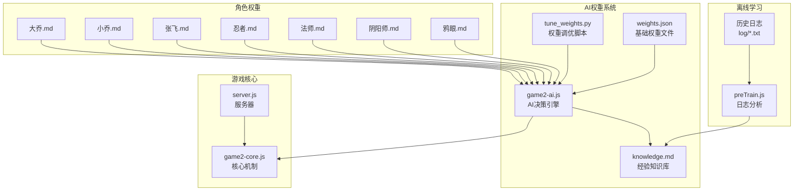
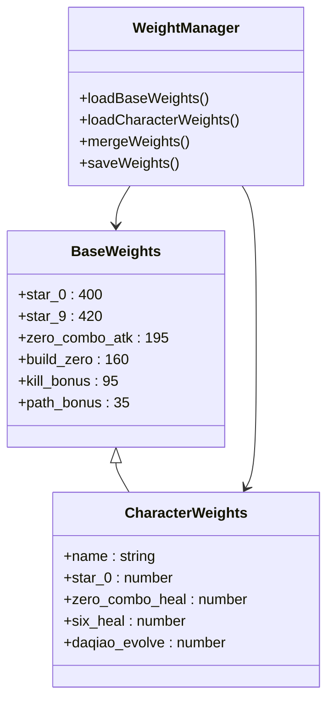
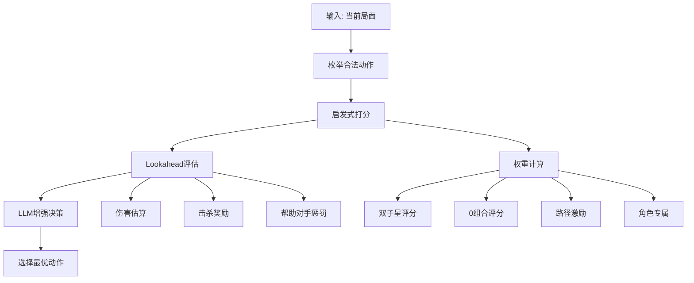
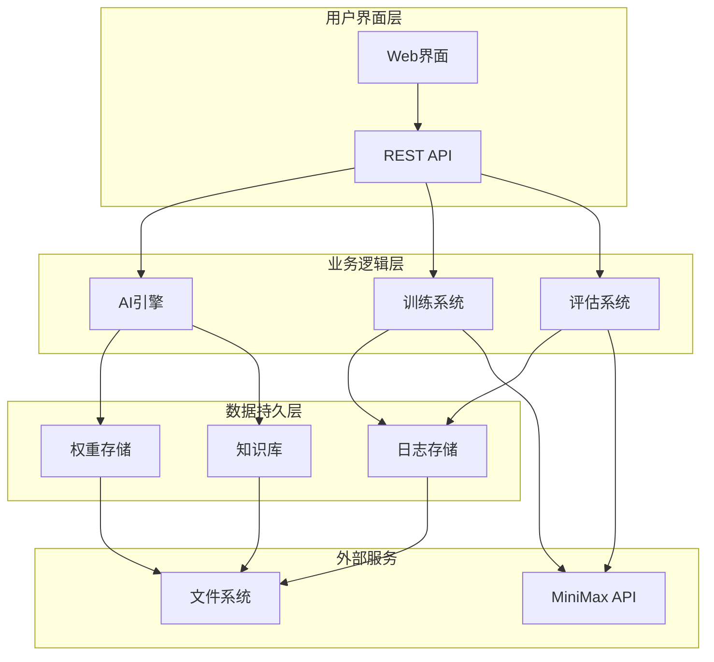
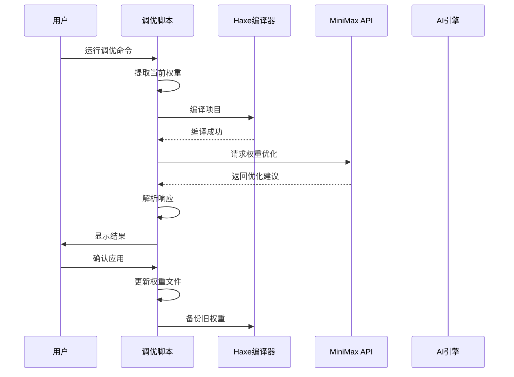
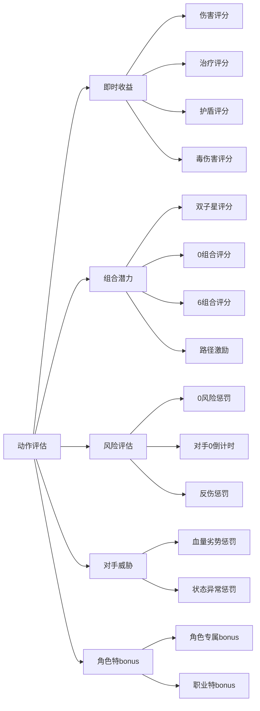
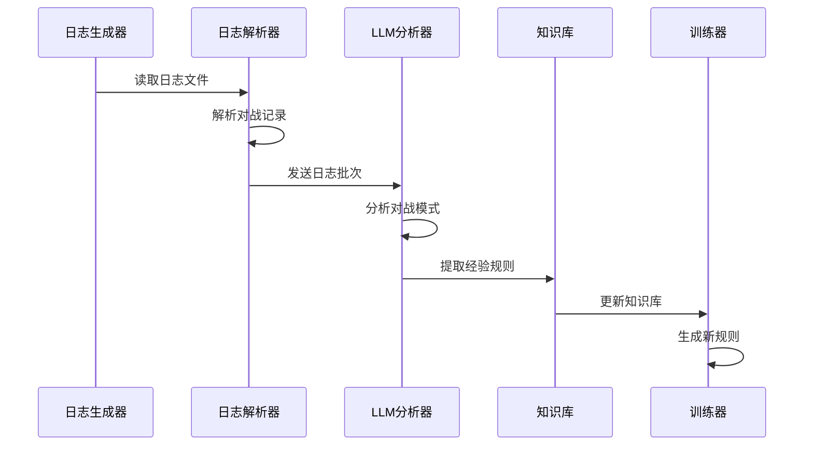
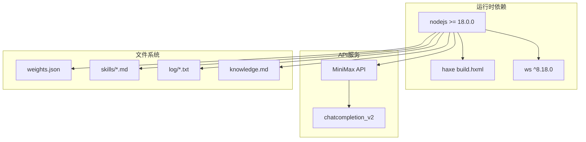
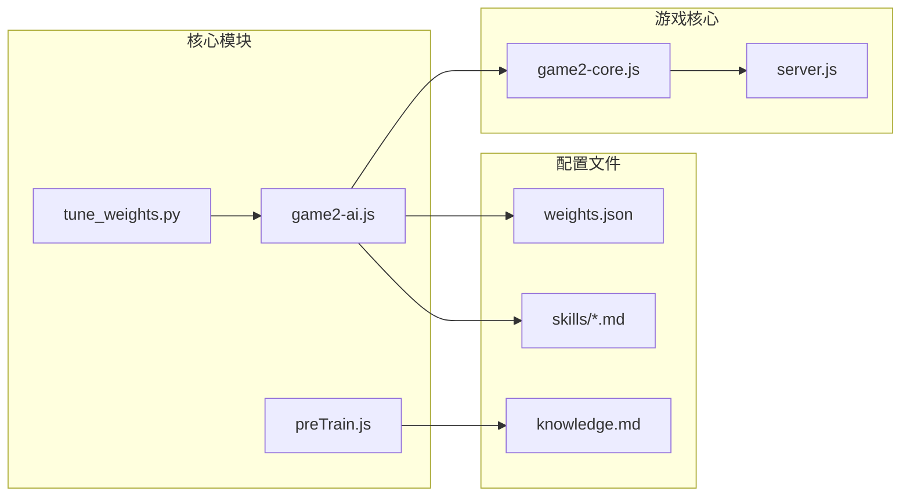
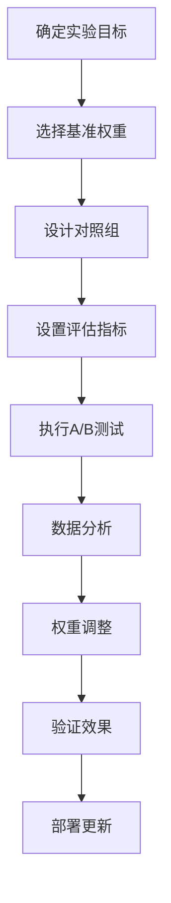

# 权重调整系统

<cite>
**本文档引用的文件**
- [tune_weights.py](file://tune_weights.py)
- [weights.json](file://ai/weights.json)
- [game2-ai.js](file://js/game2-ai.js)
- [game2-core.js](file://js/game2-core.js)
- [preTrain.js](file://ai/preTrain.js)
- [knowledge.md](file://ai/knowledge.md)
- [大乔.md](file://ai/skills/大乔.md)
- [小乔.md](file://ai/skills/小乔.md)
- [张飞.md](file://ai/skills/张飞.md)
- [忍者.md](file://ai/skills/忍者.md)
- [法师.md](file://ai/skills/法师.md)
- [阴阳师.md](file://ai/skills/阴阳师.md)
- [鸦眼.md](file://ai/skills/鸦眼.md)
- [package.json](file://package.json)
</cite>

## 目录
1. [简介](#简介)
2. [项目结构](#项目结构)
3. [核心组件](#核心组件)
4. [架构概览](#架构概览)
5. [详细组件分析](#详细组件分析)
6. [依赖关系分析](#依赖关系分析)
7. [性能考量](#性能考量)
8. [故障排除指南](#故障排除指南)
9. [结论](#结论)
10. [附录](#附录)

## 简介

这是一个基于数学手指博弈的AI权重调整系统，旨在通过数据驱动的方式优化AI决策算法。系统采用混合架构，结合传统启发式权重和现代LLM增强决策能力。

系统的核心功能包括：
- **权重文件管理**：维护角色专属权重配置
- **AI决策引擎**：基于权重进行启发式打分和决策
- **LLM集成**：通过MiniMax API进行智能权重优化
- **离线学习**：从历史对战日志中提取经验规则
- **自动化调优**：完整的权重优化工作流程

## 项目结构

**图表来源**
- [tune_weights.py:1-292](file://tune_weights.py#L1-L292)
- [game2-ai.js:1-800](file://js/game2-ai.js#L1-L800)
- [preTrain.js:1-180](file://ai/preTrain.js#L1-L180)

**章节来源**
- [tune_weights.py:1-292](file://tune_weights.py#L1-L292)
- [game2-ai.js:1-800](file://js/game2-ai.js#L1-L800)
- [preTrain.js:1-180](file://ai/preTrain.js#L1-L180)

## 核心组件

### 权重文件系统

系统采用分层权重架构，包含基础权重和角色专属权重：

**图表来源**
- [game2-ai.js:42-56](file://js/game2-ai.js#L42-L56)
- [game2-ai.js:136-153](file://js/game2-ai.js#L136-L153)

### AI决策引擎

AI引擎采用启发式评分系统，结合权重驱动的决策逻辑：

**图表来源**
- [game2-ai.js:294-470](file://js/game2-ai.js#L294-L470)

**章节来源**
- [game2-ai.js:42-56](file://js/game2-ai.js#L42-L56)
- [game2-ai.js:294-470](file://js/game2-ai.js#L294-L470)

## 架构概览

系统采用三层架构设计：

**图表来源**
- [tune_weights.py:22-30](file://tune_weights.py#L22-L30)
- [game2-ai.js:743-777](file://js/game2-ai.js#L743-L777)

## 详细组件分析

### Python权重调优脚本

#### 核心功能模块

**图表来源**
- [tune_weights.py:220-278](file://tune_weights.py#L220-L278)

#### 权重提取机制

脚本通过正则表达式从Haxe源码中提取权重值：

| 权重类别 | 参数名称 | 默认值 | 用途 |
|---------|----------|--------|------|
| 直接收益 | WEIGHT_DAMAGE | 3.0 | 即时伤害收益 |
| 直接收益 | WEIGHT_HEAL | 2.0 | 即时治疗收益 |
| 直接收益 | WEIGHT_SHIELD | 1.5 | 即时护盾收益 |
| 直接收益 | WEIGHT_POISON | 1.2 | 即时毒伤害收益 |
| 组合奖励 | WEIGHT_DOUBLE_STAR | 50.0 | 双子星组合奖励 |
| 组合奖励 | WEIGHT_ZERO_COMBO | 25.0 | 0组合潜在奖励 |
| 组合奖励 | WEIGHT_SIX_COMBO | 15.0 | 6组合潜在奖励 |
| 风险惩罚 | WEIGHT_ZERO_RISK | -40.0 | 创建0的风险惩罚 |
| 风险惩罚 | WEIGHT_ZERO_COUNTDOWN | -30.0 | 对手0倒计时惩罚 |
| 机会奖励 | WEIGHT_OPP_ZERO_GOOD | 20.0 | 对手0的机会奖励 |
| 状态奖励 | WEIGHT_HP_ADVANTAGE | 0.5 | 血量优势奖励 |
| 状态奖励 | WEIGHT_HAND_QUALITY | 2.0 | 手牌质量奖励 |

**章节来源**
- [tune_weights.py:32-62](file://tune_weights.py#L32-L62)
- [tune_weights.py:174-216](file://tune_weights.py#L174-L216)

### JavaScript AI引擎

#### 权重评分系统

AI引擎实现了一个复杂的启发式评分系统：

**图表来源**
- [game2-ai.js:294-470](file://js/game2-ai.js#L294-L470)

#### 角色权重配置

每个角色都有独特的权重配置，反映其特定的游戏机制：

| 角色 | 特殊权重 | 用途 | 价值系数 |
|------|----------|------|----------|
| 大乔 | daqiao_evolve: 55 | 进化时机 | 高价值 |
| 小乔 | star_9: 120 | 双子星价值 | 高价值 |
| 张飞 | zhangfei_diff: 2.5 | 双手差值 | 高价值 |
| 忍者 | ninja_7: 60 | 7组合价值 | 中等价值 |
| 法师 | zero_combo_atk: 130 | 0组合攻击 | 高价值 |
| 阴阳师 | star_9: 230 | 双子星价值 | 极高价值 |

**章节来源**
- [game2-ai.js:294-470](file://js/game2-ai.js#L294-L470)
- [大乔.md:4-5](file://ai/skills/大乔.md#L4-L5)
- [小乔.md:4-5](file://ai/skills/小乔.md#L4-L5)
- [张飞.md:4-5](file://ai/skills/张飞.md#L4-L5)
- [忍者.md:4-5](file://ai/skills/忍者.md#L4-L5)
- [法师.md:4-5](file://ai/skills/法师.md#L4-L5)
- [阴阳师.md:4-5](file://ai/skills/阴阳师.md#L4-L5)
- [鸦眼.md:4-5](file://ai/skills/鸦眼.md#L4-L5)

### 离线学习系统

#### 日志分析流程

**图表来源**
- [preTrain.js:124-179](file://ai/preTrain.js#L124-L179)

**章节来源**
- [preTrain.js:1-180](file://ai/preTrain.js#L1-L180)
- [knowledge.md:1-44](file://ai/knowledge.md#L1-L44)

## 依赖关系分析

### 外部依赖

系统依赖以下关键组件：

**图表来源**
- [package.json:9-15](file://package.json#L9-L15)
- [tune_weights.py:22-30](file://tune_weights.py#L22-L30)

### 内部模块依赖

**图表来源**
- [tune_weights.py:22-30](file://tune_weights.py#L22-L30)
- [game2-ai.js:1-800](file://js/game2-ai.js#L1-L800)
- [preTrain.js:1-180](file://ai/preTrain.js#L1-L180)

**章节来源**
- [package.json:1-16](file://package.json#L1-L16)
- [tune_weights.py:22-30](file://tune_weights.py#L22-L30)

## 性能考量

### 权重调优性能

系统在权重调优过程中考虑了以下性能因素：

1. **编译缓存**：避免不必要的Haxe编译
2. **API调用限制**：合理设置请求频率
3. **内存管理**：批量处理日志文件
4. **并发处理**：并行解析多个日志文件

### AI决策性能

AI引擎优化了以下性能指标：

1. **评分计算优化**：减少重复计算
2. **动作枚举剪枝**：过滤无效动作
3. **缓存机制**：缓存角色权重和知识库
4. **异步处理**：LLM调用使用异步模式

## 故障排除指南

### 常见问题诊断

| 问题类型 | 症状 | 可能原因 | 解决方案 |
|----------|------|----------|----------|
| 权重提取失败 | 无法解析权重值 | 正则表达式匹配失败 | 检查Haxe源码格式 |
| API调用错误 | MiniMax API返回错误 | 缺少API密钥 | 设置MINIMAX_API_KEY环境变量 |
| 编译失败 | Haxe编译错误 | 语法错误或依赖缺失 | 检查build.hxml配置 |
| 权重写入失败 | 文件权限问题 | 权限不足 | 检查文件系统权限 |
| LLM响应解析失败 | JSON解析错误 | API响应格式变化 | 更新解析逻辑 |

**章节来源**
- [tune_weights.py:82-115](file://tune_weights.py#L82-L115)
- [tune_weights.py:245-254](file://tune_weights.py#L245-L254)

### 调试技巧

1. **启用详细日志**：在调优脚本中添加调试输出
2. **权重验证**：定期检查权重范围合理性
3. **性能监控**：监控LLM API调用延迟
4. **错误处理**：实现完善的异常捕获机制

## 结论

权重调整系统提供了一个完整的AI优化解决方案，结合了传统的启发式方法和现代的LLM增强技术。系统的主要优势包括：

1. **模块化设计**：清晰的组件分离便于维护和扩展
2. **数据驱动**：基于实际对战数据进行权重优化
3. **自动化程度高**：从日志收集到权重应用的完整自动化流程
4. **可扩展性强**：支持新的角色和机制加入

未来改进方向：
- 增加更多的A/B测试框架
- 实现更精细的性能评估指标
- 添加权重调整的可视化界面
- 集成更多的外部API服务

## 附录

### 实验设计模板

### 数据分析指标

| 指标类型 | 描述 | 目标值 |
|----------|------|--------|
| 胜率 | AI获胜百分比 | >50% |
| 平均回合数 | 比赛持续时间 | 适中波动 |
| 杀伤效率 | 平均每回合伤害 | 合理范围 |
| 稳定性 | 方差系数 | <0.3 |
| 收敛性 | 连续改进率 | >90% |

### 迭代优化流程

1. **问题识别**：通过数据分析发现权重问题
2. **假设制定**：基于游戏理论提出优化假设
3. **实验验证**：设计A/B测试验证假设
4. **效果评估**：量化评估优化效果
5. **权重更新**：应用经过验证的权重
6. **持续监控**：跟踪长期效果