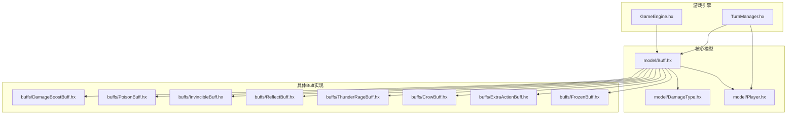
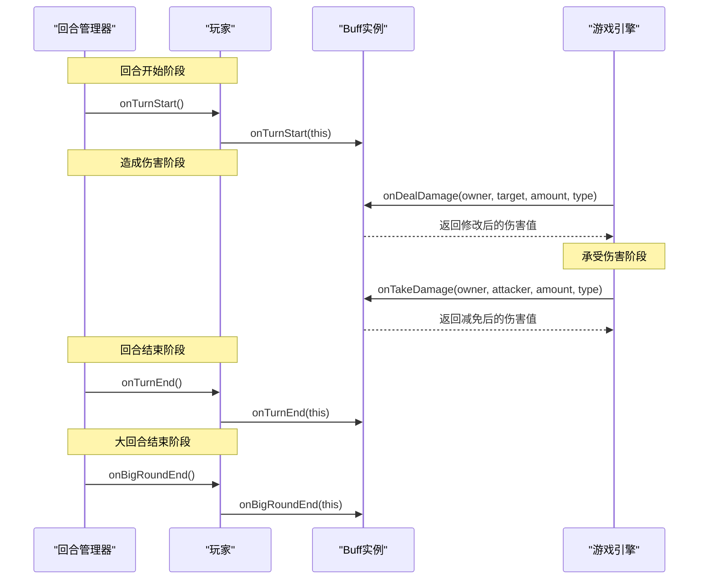
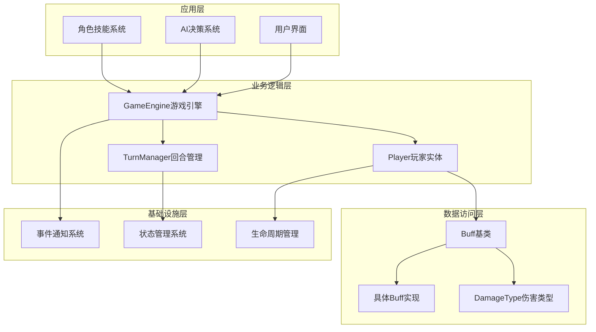
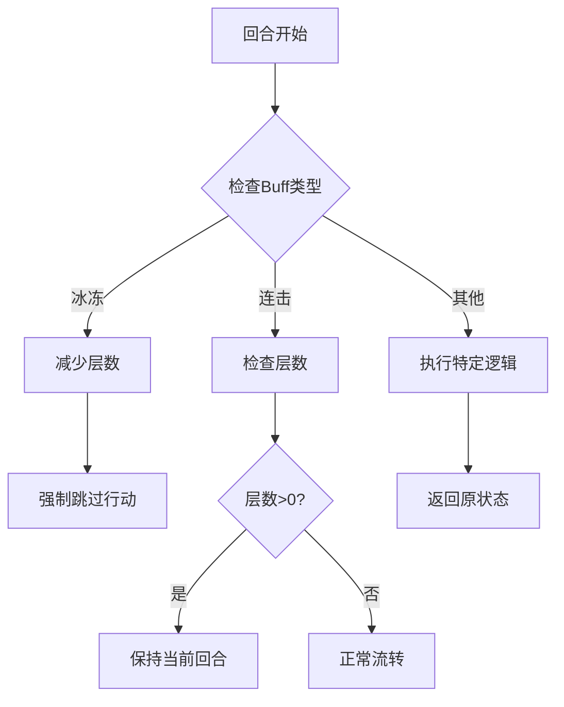
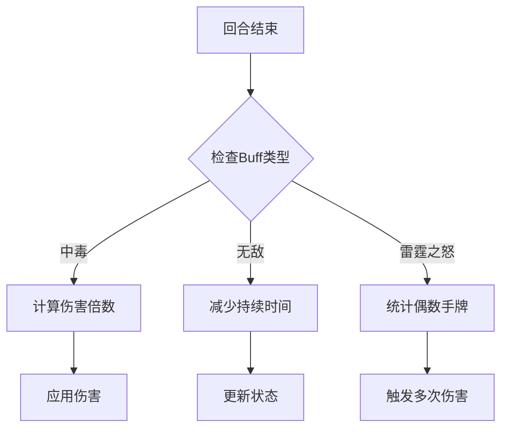
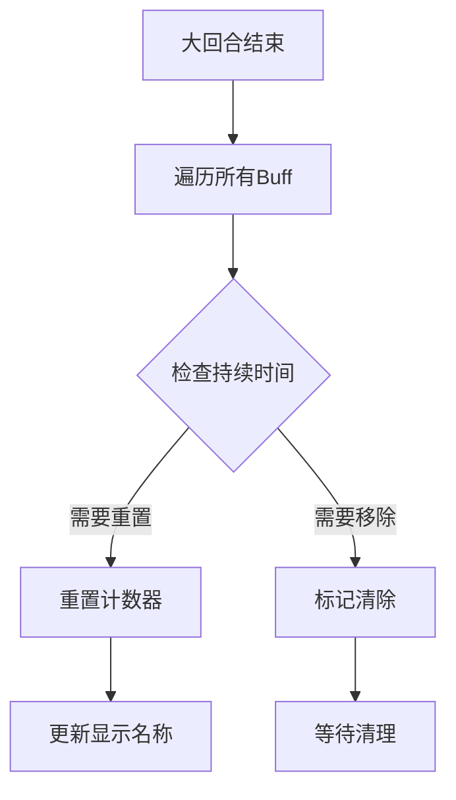
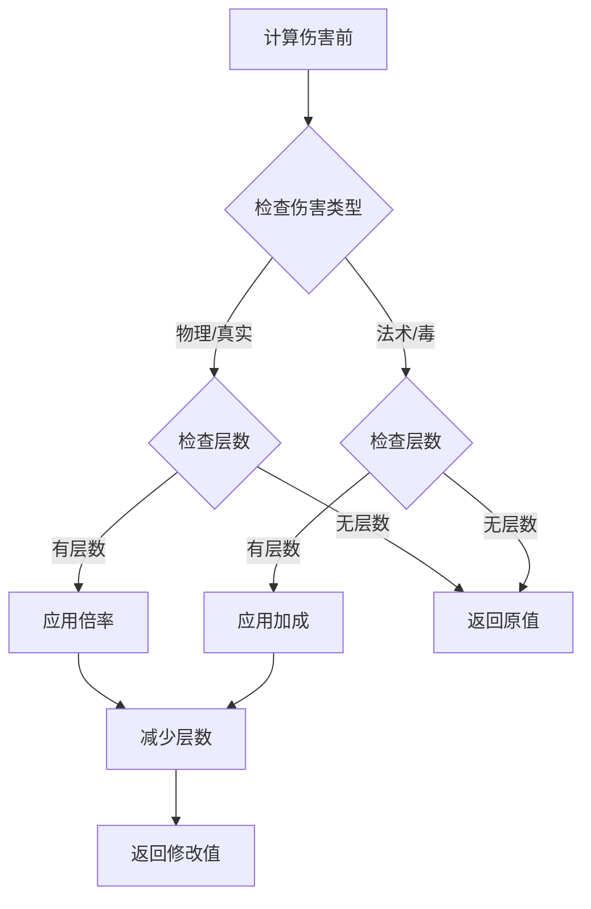
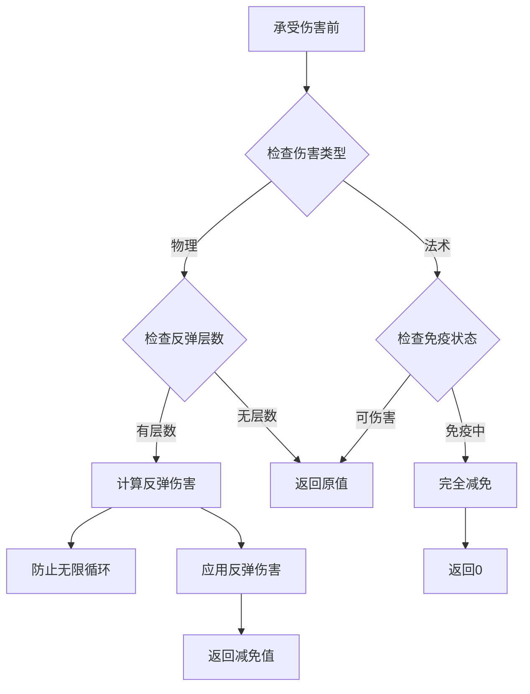
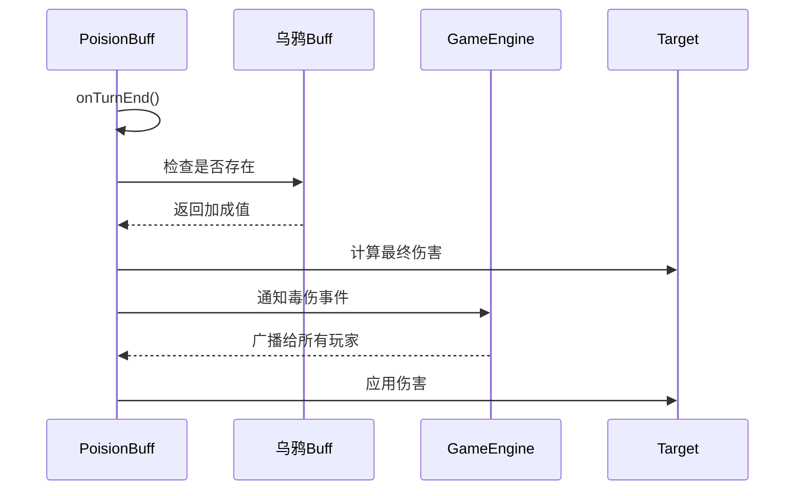
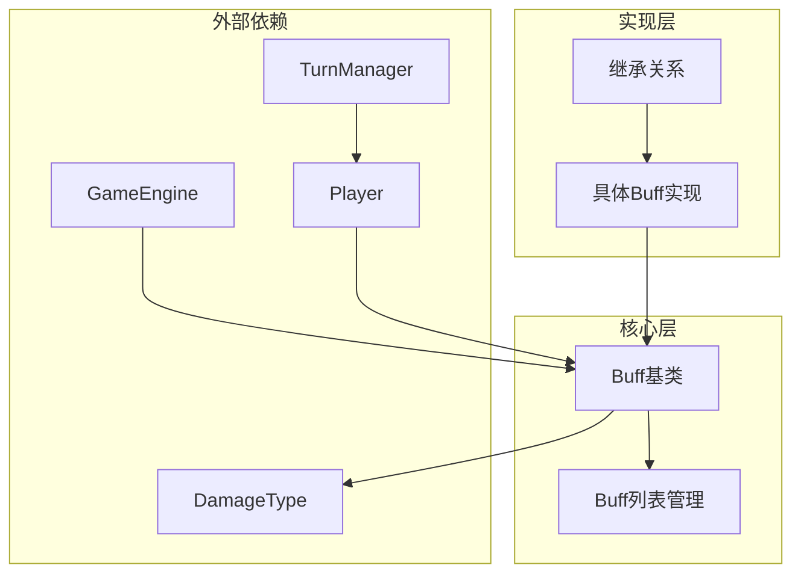

# Buff基类架构

<cite>
**本文档引用的文件**
- [model/Buff.hx](file://model/Buff.hx)
- [model/DamageType.hx](file://model/DamageType.hx)
- [model/Player.hx](file://model/Player.hx)
- [character/Player.hx](file://character/Player.hx)
- [GameEngine.hx](file://GameEngine.hx)
- [TurnManager.hx](file://TurnManager.hx)
- [buffs/DamageBoostBuff.hx](file://buffs/DamageBoostBuff.hx)
- [buffs/ExtraActionBuff.hx](file://buffs/ExtraActionBuff.hx)
- [buffs/FrozenBuff.hx](file://buffs/FrozenBuff.hx)
- [buffs/PoisonBuff.hx](file://buffs/PoisonBuff.hx)
- [buffs/CrowBuff.hx](file://buffs/CrowBuff.hx)
- [buffs/InvincibleBuff.hx](file://buffs/InvincibleBuff.hx)
- [buffs/ReflectBuff.hx](file://buffs/ReflectBuff.hx)
- [buffs/ThunderRageBuff.hx](file://buffs/ThunderRageBuff.hx)
</cite>

## 目录
1. [简介](#简介)
2. [项目结构](#项目结构)
3. [核心组件](#核心组件)
4. [架构概览](#架构概览)
5. [详细组件分析](#详细组件分析)
6. [依赖关系分析](#依赖关系分析)
7. [性能考虑](#性能考虑)
8. [故障排除指南](#故障排除指南)
9. [结论](#结论)

## 简介

Buff基类架构是游戏战斗系统的核心基础设施，负责管理各种状态效果的生命周期和事件响应机制。该架构采用钩子函数模式，通过精心设计的生命周期钩子为不同类型的Buff效果提供统一的管理接口。

Buff系统的核心设计理念基于以下原则：
- **统一标识符系统**：通过id标识符确保Buff的唯一性和可检索性
- **层次化管理**：layers属性支持叠加效果和计数管理
- **事件驱动架构**：通过钩子函数实现对游戏关键时刻的响应
- **类型安全**：DamageType枚举确保伤害类型的明确区分

## 项目结构

Buff系统采用模块化设计，主要包含以下核心目录：

**图表来源**
- [model/Buff.hx:1-30](file://model/Buff.hx#L1-L30)
- [GameEngine.hx:1-50](file://GameEngine.hx#L1-L50)
- [TurnManager.hx:1-50](file://TurnManager.hx#L1-L50)

**章节来源**
- [model/Buff.hx:1-30](file://model/Buff.hx#L1-L30)
- [GameEngine.hx:1-100](file://GameEngine.hx#L1-L100)
- [TurnManager.hx:1-100](file://TurnManager.hx#L1-L100)

## 核心组件

### Buff基类设计

Buff基类提供了完整的生命周期管理框架，包含以下核心属性：

| 属性 | 类型 | 描述 | 设计理念 |
|------|------|------|----------|
| id | String | Buff唯一标识符 | 确保Buff的可检索性和合并逻辑 |
| name | String | Buff显示名称 | 用户界面友好显示 |
| layers | Int | 层数/持续时间 | 支持叠加效果和计时管理 |

### 钩子函数体系

Buff系统定义了五个关键钩子函数，每个都有特定的游戏时机：

**图表来源**
- [TurnManager.hx:35-102](file://TurnManager.hx#L35-L102)
- [GameEngine.hx:137-200](file://GameEngine.hx#L137-L200)
- [model/Buff.hx:14-29](file://model/Buff.hx#L14-L29)

**章节来源**
- [model/Buff.hx:3-30](file://model/Buff.hx#L3-L30)
- [TurnManager.hx:35-102](file://TurnManager.hx#L35-L102)
- [GameEngine.hx:137-200](file://GameEngine.hx#L137-L200)

## 架构概览

Buff系统的整体架构采用分层设计，确保了高度的模块化和可扩展性：

**图表来源**
- [GameEngine.hx:16-43](file://GameEngine.hx#L16-L43)
- [TurnManager.hx:6-13](file://TurnManager.hx#L6-L13)
- [model/Player.hx:18-26](file://model/Player.hx#L18-L26)

### 设计模式分析

Buff系统采用了多种设计模式：

1. **模板方法模式**：基类定义骨架，子类实现具体逻辑
2. **观察者模式**：GameEngine通过通知系统广播事件
3. **策略模式**：不同Buff实现不同的钩子函数策略
4. **工厂模式**：通过构造函数创建不同类型的Buff实例

## 详细组件分析

### 钩子函数详解

#### onTurnStart - 回合开始触发

onTurnStart钩子在每个玩家回合开始时调用，主要用于处理需要立即生效的状态效果：

**图表来源**
- [TurnManager.hx:35-42](file://TurnManager.hx#L35-L42)
- [buffs/ExtraActionBuff.hx:9-12](file://buffs/ExtraActionBuff.hx#L9-L12)

#### onTurnEnd - 回合结束结算

onTurnEnd钩子处理回合结束时的结算逻辑，特别是持续伤害效果：

**图表来源**
- [buffs/PoisonBuff.hx:11-48](file://buffs/PoisonBuff.hx#L11-L48)
- [buffs/InvincibleBuff.hx:33-42](file://buffs/InvincibleBuff.hx#L33-L42)

#### onBigRoundEnd - 大回合结束处理

onBigRoundEnd钩子在每个大回合结束时调用，用于重置周期性效果：

**图表来源**
- [TurnManager.hx:143-152](file://TurnManager.hx#L143-L152)
- [buffs/CrowBuff.hx:57-62](file://buffs/CrowBuff.hx#L57-L62)

#### onDealDamage - 造成伤害前修改

onDealDamage钩子在计算伤害前调用，允许Buff修改伤害数值：

**图表来源**
- [buffs/DamageBoostBuff.hx:11-19](file://buffs/DamageBoostBuff.hx#L11-L19)
- [GameEngine.hx:164-180](file://GameEngine.hx#L164-L180)

#### onTakeDamage - 承受伤害前防护

onTakeDamage钩子在承受伤害前调用，提供伤害减免和反击能力：

**图表来源**
- [buffs/ReflectBuff.hx:22-41](file://buffs/ReflectBuff.hx#L22-L41)
- [buffs/InvincibleBuff.hx:19-28](file://buffs/InvincibleBuff.hx#L19-L28)

**章节来源**
- [model/Buff.hx:14-29](file://model/Buff.hx#L14-L29)
- [TurnManager.hx:35-102](file://TurnManager.hx#L35-L102)
- [GameEngine.hx:137-200](file://GameEngine.hx#L137-L200)

### 具体Buff实现分析

#### 伤害增益Buff (DamageBoostBuff)

DamageBoostBuff展示了典型的onDealDamage实现模式：

| 特性 | 实现细节 | 设计考量 |
|------|----------|----------|
| 触发条件 | 物理/真实伤害且层数>0 | 精确控制生效范围 |
| 效果实现 | 伤害翻倍并减少层数 | 确保效果有限制 |
| 类型过滤 | 仅对特定伤害类型生效 | 避免误伤其他效果 |

#### 中毒Buff (PoisonBuff)

PoisonBuff体现了复杂的回合结束结算逻辑：

**图表来源**
- [buffs/PoisonBuff.hx:11-48](file://buffs/PoisonBuff.hx#L11-L48)
- [buffs/CrowBuff.hx:45-55](file://buffs/CrowBuff.hx#L45-L55)

#### 无敌Buff (InvincibleBuff)

InvincibleBuff展示了onTakeDamage的完整实现：

| 机制 | 实现方式 | 效果说明 |
|------|----------|----------|
| 免疫判定 | 物理/法术伤害完全免疫 | 真实伤害可穿透 |
| 持续时间 | 层数作为剩余回合数 | 自动递减管理 |
| 状态反馈 | 控制台日志和动画 | 提供视觉反馈 |

**章节来源**
- [buffs/DamageBoostBuff.hx:1-20](file://buffs/DamageBoostBuff.hx#L1-L20)
- [buffs/PoisonBuff.hx:1-50](file://buffs/PoisonBuff.hx#L1-L50)
- [buffs/InvincibleBuff.hx:1-44](file://buffs/InvincibleBuff.hx#L1-L44)
- [buffs/ReflectBuff.hx:1-43](file://buffs/ReflectBuff.hx#L1-L43)
- [buffs/ThunderRageBuff.hx:1-104](file://buffs/ThunderRageBuff.hx#L1-L104)

## 依赖关系分析

Buff系统的依赖关系呈现清晰的层次结构：

**图表来源**
- [GameEngine.hx:16-43](file://GameEngine.hx#L16-L43)
- [TurnManager.hx:6-13](file://TurnManager.hx#L6-L13)
- [model/Player.hx:18-26](file://model/Player.hx#L18-L26)

### 关键依赖链

1. **GameEngine依赖**：提供全局事件通知和伤害计算
2. **TurnManager依赖**：管理回合生命周期和Buff触发时机
3. **Player依赖**：持有Buff列表并协调生命周期管理
4. **DamageType依赖**：确保伤害类型的类型安全

**章节来源**
- [GameEngine.hx:48-118](file://GameEngine.hx#L48-L118)
- [TurnManager.hx:143-152](file://TurnManager.hx#L143-L152)
- [model/Player.hx:212-235](file://model/Player.hx#L212-L235)

## 性能考虑

Buff系统的性能优化主要体现在以下几个方面：

### 时间复杂度分析

| 操作 | 复杂度 | 优化策略 |
|------|--------|----------|
| Buff添加 | O(n) | ID匹配后直接合并 |
| Buff查询 | O(n) | ID索引优化 |
| 生命周期遍历 | O(n*m) | n为玩家数量，m为平均Buff数量 |
| 伤害计算 | O(m) | m为当前玩家Buff数量 |

### 内存管理

1. **对象池模式**：重复使用的Buff实例复用
2. **延迟清理**：批量清理无效Buff
3. **弱引用**：避免循环引用导致的内存泄漏

### 并发安全

- **单线程模型**：游戏逻辑在单线程环境中执行
- **原子操作**：关键状态变更使用原子操作
- **状态一致性**：通过回合制确保状态一致性

## 故障排除指南

### 常见问题及解决方案

#### Buff未生效问题

**症状**：Buff创建后不产生预期效果

**排查步骤**：
1. 检查Buff ID是否正确
2. 验证钩子函数是否被正确重写
3. 确认伤害类型匹配
4. 检查层数是否大于0

#### 生命周期异常

**症状**：Buff持续时间异常或提前消失

**排查步骤**：
1. 检查onTurnEnd实现
2. 验证layers递减逻辑
3. 确认cleanEmptyBuffs调用
4. 检查大回合重置逻辑

#### 性能问题

**症状**：游戏运行缓慢，特别是在多人场景

**优化建议**：
1. 减少不必要的钩子调用
2. 优化Buff列表遍历
3. 实施缓存机制
4. 避免深度嵌套的Buff链

**章节来源**
- [model/Buff.hx:14-29](file://model/Buff.hx#L14-L29)
- [TurnManager.hx:124-132](file://TurnManager.hx#L124-L132)
- [GameEngine.hx:164-180](file://GameEngine.hx#L164-L180)

## 结论

Buff基类架构通过精心设计的钩子函数体系和生命周期管理机制，为游戏提供了强大而灵活的状态效果系统。该架构的主要优势包括：

### 设计优势

1. **高度模块化**：每个Buff独立实现，便于维护和扩展
2. **类型安全**：DamageType枚举确保伤害类型的正确处理
3. **事件驱动**：通过钩子函数实现松耦合的事件响应
4. **生命周期完整**：覆盖从创建到销毁的完整过程

### 扩展指导

开发者可以通过以下方式扩展Buff系统：

1. **继承Buff基类**：实现自定义的钩子函数
2. **遵循设计原则**：确保Buff的ID唯一性和层数管理
3. **注意性能影响**：避免复杂的计算逻辑
4. **测试完整性**：验证所有生命周期阶段的行为

该架构为游戏开发提供了坚实的基础，能够支持各种复杂的游戏机制和平衡性需求。