# Buff效果系统

<cite>
**本文档引用的文件**
- [model/Buff.hx](file://model/Buff.hx)
- [model/Player.hx](file://model/Player.hx)
- [model/DamageType.hx](file://model/DamageType.hx)
- [model/ShieldType.hx](file://model/ShieldType.hx)
- [model/HealType.hx](file://model/HealType.hx)
- [GameEngine.hx](file://GameEngine.hx)
- [TurnManager.hx](file://TurnManager.hx)
- [buffs/DamageBoostBuff.hx](file://buffs/DamageBoostBuff.hx)
- [buffs/ReflectBuff.hx](file://buffs/ReflectBuff.hx)
- [buffs/PoisonBuff.hx](file://buffs/PoisonBuff.hx)
- [buffs/ExtraActionBuff.hx](file://buffs/ExtraActionBuff.hx)
- [buffs/InvincibleBuff.hx](file://buffs/InvincibleBuff.hx)
- [buffs/FrozenBuff.hx](file://buffs/FrozenBuff.hx)
- [buffs/ThunderRageBuff.hx](file://buffs/ThunderRageBuff.hx)
- [buffs/CrowBuff.hx](file://buffs/CrowBuff.hx)
- [character/YaYan.hx](file://character/YaYan.hx)
</cite>

## 目录
1. [简介](#简介)
2. [项目结构](#项目结构)
3. [核心组件](#核心组件)
4. [架构总览](#架构总览)
5. [详细组件分析](#详细组件分析)
6. [依赖关系分析](#依赖关系分析)
7. [性能考量](#性能考量)
8. [故障排查指南](#故障排查指南)
9. [结论](#结论)
10. [附录：扩展指南](#附录扩展指南)

## 简介
本文件系统化梳理Buff效果系统的设计与实现，围绕Buff基类的生命周期钩子、效果类型、持续时间与层数管理、触发条件与叠加规则、效果移除机制展开，并结合具体Buff实现（伤害增益、反弹、中毒、额外行动、无敌、冰冻、雷怒、乌鸦）给出数据流与控制流图示，最后提供扩展新Buff类型的实践指南。

## 项目结构
- 核心模型与引擎
  - model：定义Buff基类、伤害类型、治疗类型、护盾类型、玩家实体
  - GameEngine：统一伤害/回血/护盾流程，事件广播，全局状态
  - TurnManager：回合与大回合调度，回合开始/结束、跳过逻辑
- Buff实现
  - buffs：各类具体Buff（伤害增益、反弹、中毒、额外行动、无敌、冰冻、雷怒、乌鸦）
- 角色与联动
  - character：角色实现与Buff联动（如鸦眼与乌鸦Buff）

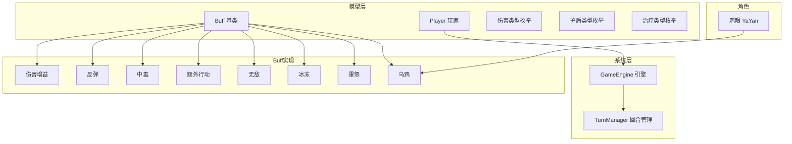

图表来源
- [model/Buff.hx:1-30](file://model/Buff.hx#L1-L30)
- [model/Player.hx:1-398](file://model/Player.hx#L1-L398)
- [GameEngine.hx:1-725](file://GameEngine.hx#L1-L725)
- [TurnManager.hx:1-232](file://TurnManager.hx#L1-L232)
- [buffs/DamageBoostBuff.hx:1-20](file://buffs/DamageBoostBuff.hx#L1-L20)
- [buffs/ReflectBuff.hx:1-43](file://buffs/ReflectBuff.hx#L1-L43)
- [buffs/PoisonBuff.hx:1-50](file://buffs/PoisonBuff.hx#L1-L50)
- [buffs/ExtraActionBuff.hx:1-12](file://buffs/ExtraActionBuff.hx#L1-L12)
- [buffs/InvincibleBuff.hx:1-44](file://buffs/InvincibleBuff.hx#L1-L44)
- [buffs/FrozenBuff.hx:1-17](file://buffs/FrozenBuff.hx#L1-L17)
- [buffs/ThunderRageBuff.hx:1-104](file://buffs/ThunderRageBuff.hx#L1-L104)
- [buffs/CrowBuff.hx:1-64](file://buffs/CrowBuff.hx#L1-L64)
- [character/YaYan.hx:1-174](file://character/YaYan.hx#L1-L174)

章节来源
- [model/Buff.hx:1-30](file://model/Buff.hx#L1-L30)
- [model/Player.hx:1-398](file://model/Player.hx#L1-L398)
- [GameEngine.hx:1-725](file://GameEngine.hx#L1-L725)
- [TurnManager.hx:1-232](file://TurnManager.hx#L1-L232)

## 核心组件
- Buff基类
  - 字段：id、name、layers（层数）
  - 生命周期钩子：回合开始、回合结束、大回合结束、造成伤害前、承受伤害前
- Player
  - Buff管理：addBuff（同id合并层数）、getBuff、onTurnEnd（遍历调用）、cleanEmptyBuffs
  - 抗伤主流程：handleIncomingDamage（攻击者Buff→自身拦截→护盾→落血）
- GameEngine
  - 标准伤害/回血/护盾流程，事件广播（中毒、雷霆、回血、护盾、输出）
  - 原始伤害/回血（applyRawDamage/applyRawHeal）用于钩子内防止套娃
- TurnManager
  - 回合开始/结束、大回合检测、额外行动（EXTRA_ACTION）优先判定、冰冻跳过

章节来源
- [model/Buff.hx:1-30](file://model/Buff.hx#L1-L30)
- [model/Player.hx:212-377](file://model/Player.hx#L212-L377)
- [GameEngine.hx:137-290](file://GameEngine.hx#L137-L290)
- [TurnManager.hx:35-190](file://TurnManager.hx#L35-L190)

## 架构总览
Buff系统采用“基类钩子 + 玩家拦截 + 引擎流程”的分层设计：
- 基类提供统一生命周期与伤害拦截点
- 玩家持有Buff列表，在关键节点调用对应钩子
- 引擎封装标准伤害/回血/护盾流程，确保一致性与可扩展性
- 回合管理负责触发条件（如EXTRA_ACTION、FROZEN）与大回合事件

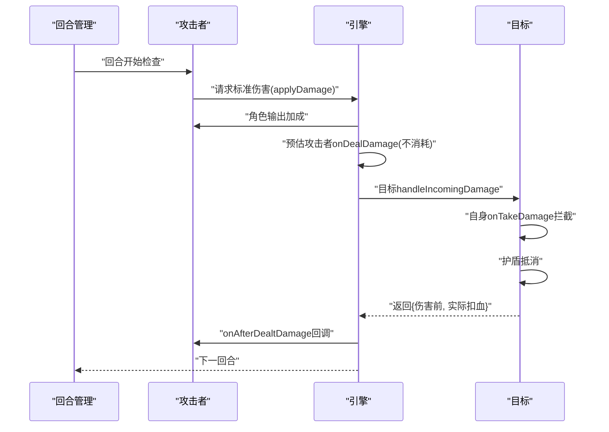

图表来源
- [GameEngine.hx:137-233](file://GameEngine.hx#L137-L233)
- [model/Player.hx:262-325](file://model/Player.hx#L262-L325)
- [TurnManager.hx:110-190](file://TurnManager.hx#L110-L190)

## 详细组件分析

### Buff基类与生命周期
- 设计要点
  - 通过id区分同类Buff，layers作为“可用次数/持续回合”统一语义
  - 提供多处钩子，便于在不同阶段插入效果
- 生命周期
  - 回合开始：onTurnStart
  - 回合结束：onTurnEnd（典型用于中毒结算）
  - 大回合结束：onBigRoundEnd（典型用于乌鸦持续回合递减）
  - 造成伤害前：onDealDamage（典型用于伤害翻倍）
  - 承受伤害前：onTakeDamage（典型用于反弹/无敌）

章节来源
- [model/Buff.hx:14-29](file://model/Buff.hx#L14-L29)

### 伤害增益Buff（伤害翻倍）
- 效果：对物理/真实伤害翻倍，仅使用1层
- 触发条件：伤害类型为物理或真实，且层数>0
- 持续时间：按层计，使用后层数-1
- 数据流

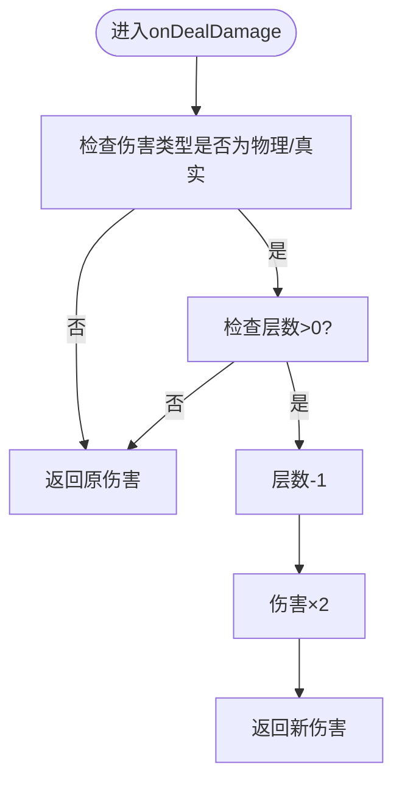

图表来源
- [buffs/DamageBoostBuff.hx:11-19](file://buffs/DamageBoostBuff.hx#L11-L19)

章节来源
- [buffs/DamageBoostBuff.hx:1-20](file://buffs/DamageBoostBuff.hx#L1-L20)

### 反弹Buff（反伤盾）
- 效果：承受物理伤害时反弹一半给攻击者，自身免疫本次伤害；上限200
- 触发条件：伤害类型为物理，层数>0
- 防环路：通过引擎isReflecting一次性标记防止A↔B无限互弹
- 数据流

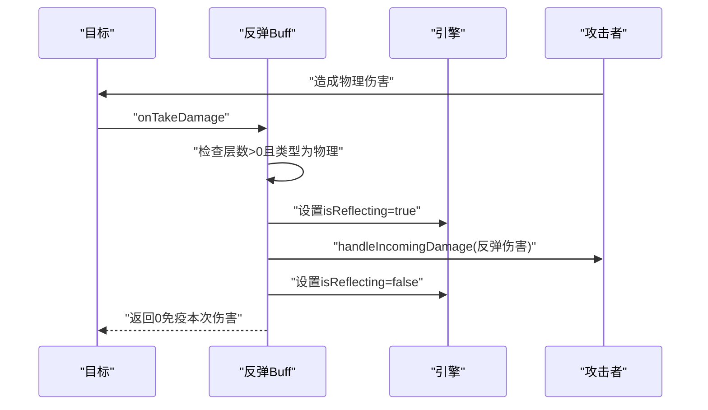

图表来源
- [buffs/ReflectBuff.hx:22-41](file://buffs/ReflectBuff.hx#L22-L41)
- [GameEngine.hx:18-20](file://GameEngine.hx#L18-L20)

章节来源
- [buffs/ReflectBuff.hx:1-43](file://buffs/ReflectBuff.hx#L1-L43)

### 中毒Buff（持续伤害）
- 效果：回合结束造成魔法伤害，每层10点
- 乌鸦联动：若目标带有乌鸦Buff，则额外+10
- 事件广播：通知全场中毒扣血，用于忍者被动
- 数据流

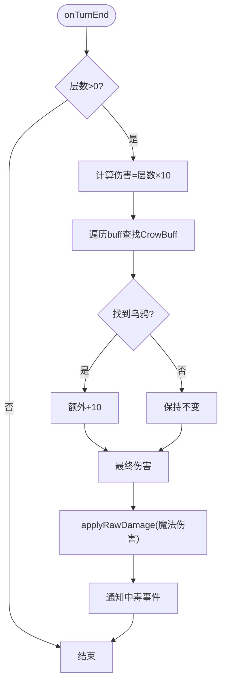

图表来源
- [buffs/PoisonBuff.hx:11-48](file://buffs/PoisonBuff.hx#L11-L48)
- [GameEngine.hx:87-118](file://GameEngine.hx#L87-L118)

章节来源
- [buffs/PoisonBuff.hx:1-50](file://buffs/PoisonBuff.hx#L1-L50)

### 额外行动Buff（连击）
- 效果：每大回合最多触发2次，每次触发消耗1层
- 触发时机：回合结束时，TurnManager在切换玩家前检查
- 行为：若层数>0则在同一回合再次行动，然后层数-1
- 数据流

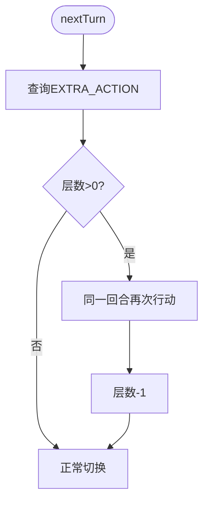

图表来源
- [buffs/ExtraActionBuff.hx:10-12](file://buffs/ExtraActionBuff.hx#L10-L12)
- [TurnManager.hx:115-122](file://TurnManager.hx#L115-L122)

章节来源
- [buffs/ExtraActionBuff.hx:1-12](file://buffs/ExtraActionBuff.hx#L1-L12)
- [TurnManager.hx:110-190](file://TurnManager.hx#L110-L190)

### 无敌Buff（免疫物理/法术伤害）
- 效果：物理/法术伤害完全免疫；真实伤害穿透
- 持续时间：以层数表示剩余有效回合，回合结束递减
- 数据流

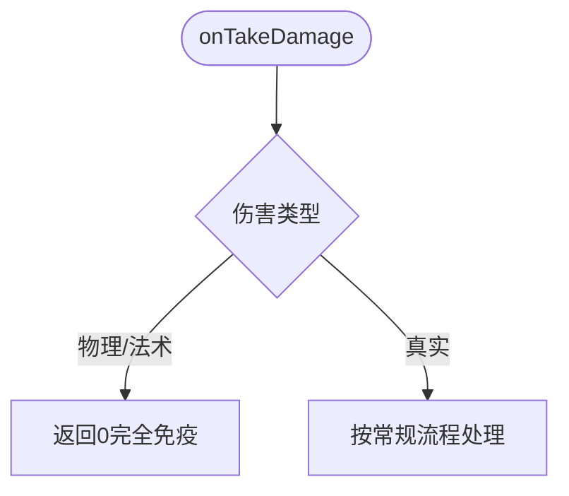

图表来源
- [buffs/InvincibleBuff.hx:19-28](file://buffs/InvincibleBuff.hx#L19-L28)

章节来源
- [buffs/InvincibleBuff.hx:1-44](file://buffs/InvincibleBuff.hx#L1-L44)

### 冰冻Buff（限制行动）
- 效果：持有者下一次“轮到自己”时直接跳过行动；跳过后层数-1
- 触发时机：回合开始时由TurnManager检查
- 数据流

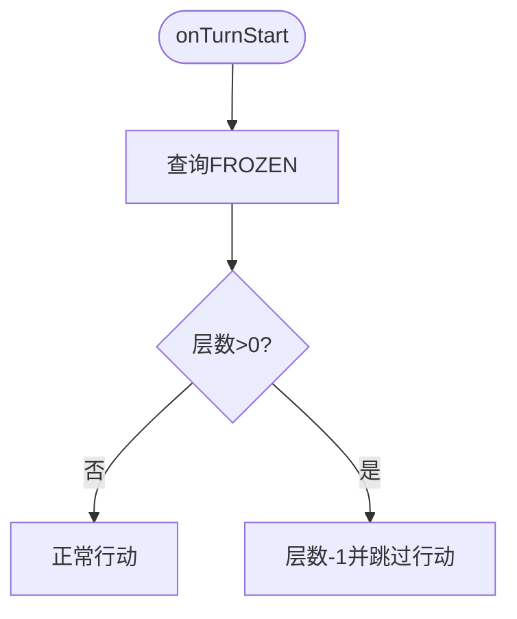

图表来源
- [TurnManager.hx:35-42](file://TurnManager.hx#L35-L42)
- [buffs/FrozenBuff.hx:12-16](file://buffs/FrozenBuff.hx#L12-L16)

章节来源
- [TurnManager.hx:35-102](file://TurnManager.hx#L35-L102)
- [buffs/FrozenBuff.hx:1-17](file://buffs/FrozenBuff.hx#L1-L17)

### 雷怒Buff（增强攻击威力）
- 效果：持续N回合，回合结束统计双手偶数(2,4,6,8)个数，按“计数器”触发等量物理伤害
- 计数器：隐藏Buff（id=THUNDER_COUNTER），初始40，每次触发+15
- 施法者回血：施法者获得实际扣血量的等量回血
- 数据流

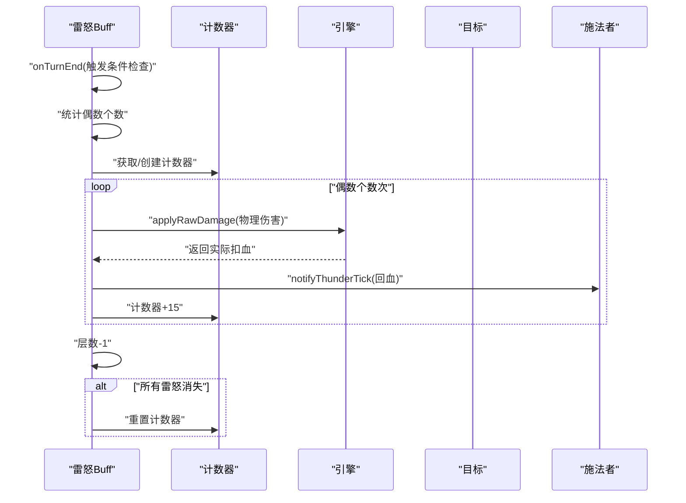

图表来源
- [buffs/ThunderRageBuff.hx:35-102](file://buffs/ThunderRageBuff.hx#L35-L102)
- [GameEngine.hx:110-118](file://GameEngine.hx#L110-L118)

章节来源
- [buffs/ThunderRageBuff.hx:1-104](file://buffs/ThunderRageBuff.hx#L1-L104)

### 乌鸦Buff（鸦眼特殊能力）
- 效果：在攻击者乘算前对基础伤害加算（物理/真实+20×触发次数，法/毒+10×触发次数）
- 回调：onTriggered触发鸦眼回血与获得乌鸦数量
- 持续时间：以层数表示剩余大回合，大回合结束递减
- 数据流

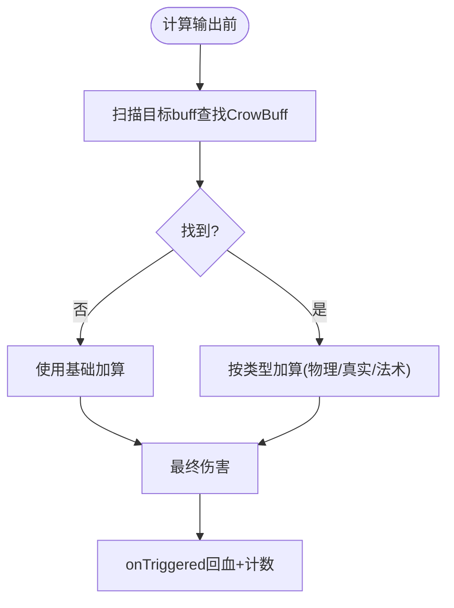

图表来源
- [buffs/CrowBuff.hx:34-55](file://buffs/CrowBuff.hx#L34-L55)
- [character/YaYan.hx:151-164](file://character/YaYan.hx#L151-L164)

章节来源
- [buffs/CrowBuff.hx:1-64](file://buffs/CrowBuff.hx#L1-L64)
- [character/YaYan.hx:1-174](file://character/YaYan.hx#L1-L174)

## 依赖关系分析
- 组件耦合
  - Buff与Player：通过Player.buffList持有，生命周期钩子在Player中统一调度
  - Buff与GameEngine：applyRawDamage/applyRawHeal用于避免钩子套娃；事件通知用于联动角色
  - TurnManager与Buff：EXTRA_ACTION、FROZEN在回合调度中生效
- 外部依赖
  - 伤害/治疗/护盾类型枚举统一约束效果范围
  - 角色实现（如YaYan）通过注入CrowBuff的extraTriggers影响伤害加算

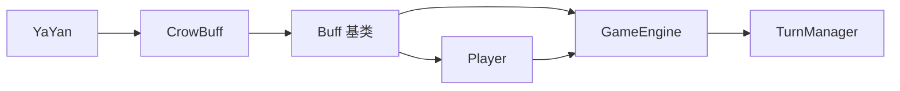

图表来源
- [model/Buff.hx:1-30](file://model/Buff.hx#L1-L30)
- [model/Player.hx:212-377](file://model/Player.hx#L212-L377)
- [GameEngine.hx:137-290](file://GameEngine.hx#L137-L290)
- [TurnManager.hx:110-190](file://TurnManager.hx#L110-L190)
- [character/YaYan.hx:151-164](file://character/YaYan.hx#L151-L164)

章节来源
- [model/DamageType.hx:1-7](file://model/DamageType.hx#L1-L7)
- [model/HealType.hx:1-6](file://model/HealType.hx#L1-L6)
- [model/ShieldType.hx:1-8](file://model/ShieldType.hx#L1-L8)

## 性能考量
- Buff遍历成本
  - 每次伤害/回合结束均需遍历buffList，建议控制单个单位Buff数量，避免过多叠加
- 层次管理
  - 使用layers统一表达“可用次数/持续回合”，减少分支判断复杂度
- 避免重复计算
  - applyDamage中对攻击者onDealDamage采用快照/还原策略，避免重复消耗
- 事件广播
  - 仅在必要时广播（如中毒、雷霆、回血、护盾、输出），降低全局监听开销

## 故障排查指南
- 反弹无限循环
  - 现象：A→B→A→B…
  - 排查：确认引擎isReflecting标记在反弹期间为true，反弹完成后立即复位
  - 参考：[buffs/ReflectBuff.hx:33-38](file://buffs/ReflectBuff.hx#L33-L38)、[GameEngine.hx:18-20](file://GameEngine.hx#L18-L20)
- 雷怒计数器异常
  - 现象：计数器不增长或不重置
  - 排查：确认onTurnEnd中计数器+15逻辑执行；所有雷怒消失时重置为0
  - 参考：[buffs/ThunderRageBuff.hx:71-100](file://buffs/ThunderRageBuff.hx#L71-L100)
- 中毒未触发
  - 现象：回合结束未扣血
  - 排查：确认PoisonBuff.onTurnEnd在Player.onTurnEnd中被调用；检查CrowBuff是否存在导致额外加成
  - 参考：[model/Player.hx:229-235](file://model/Player.hx#L229-L235)、[buffs/PoisonBuff.hx:11-48](file://buffs/PoisonBuff.hx#L11-L48)
- 无敌无效
  - 现象：真实伤害仍然被免疫
  - 排查：确认onTakeDamage中仅对PHYSICAL/MAGIC生效，TRUE类型应穿透
  - 参考：[buffs/InvincibleBuff.hx:19-28](file://buffs/InvincibleBuff.hx#L19-L28)
- 冰冻跳过失败
  - 现象：冰冻层数未减少或未跳过行动
  - 排查：确认TurnManager.onTurnStart中FROZEN检查逻辑
  - 参考：[TurnManager.hx:35-42](file://TurnManager.hx#L35-L42)

章节来源
- [buffs/ReflectBuff.hx:1-43](file://buffs/ReflectBuff.hx#L1-L43)
- [buffs/ThunderRageBuff.hx:1-104](file://buffs/ThunderRageBuff.hx#L1-L104)
- [model/Player.hx:229-235](file://model/Player.hx#L229-L235)
- [buffs/PoisonBuff.hx:1-50](file://buffs/PoisonBuff.hx#L1-L50)
- [buffs/InvincibleBuff.hx:1-44](file://buffs/InvincibleBuff.hx#L1-L44)
- [TurnManager.hx:35-42](file://TurnManager.hx#L35-L42)

## 结论
Buff系统通过统一的基类钩子与Player/Engine/TurnManager协作，实现了灵活、可扩展的效果框架。各Buff在明确的触发条件、叠加规则与持续时间管理下协同工作，既保证了玩法深度，也维持了逻辑清晰与性能可控。扩展新Buff时，遵循现有模式即可快速集成。

## 附录：扩展指南
- 新增Buff类型步骤
  - 定义枚举：在DamageType/HealType/ShieldType中新增类型（如适用）
  - 创建Buff类：继承Buff，重写所需钩子（如onDealDamage/onTakeDamage/onTurnEnd）
  - 注册与触发：在GameEngine或角色逻辑中按需施加与触发
  - 测试验证：覆盖触发条件、叠加规则、持续时间、移除机制
- 设计原则
  - 以layers统一表达“可用次数/持续回合”
  - 优先使用applyRawDamage/applyRawHeal避免钩子套娃
  - 通过事件广播实现跨角色联动（如中毒、雷霆、回血、护盾）
  - 在TurnManager中处理回合级触发（如EXTRA_ACTION、FROZEN）
- 示例参考
  - 伤害增益：[buffs/DamageBoostBuff.hx:11-19](file://buffs/DamageBoostBuff.hx#L11-L19)
  - 反弹：[buffs/ReflectBuff.hx:22-41](file://buffs/ReflectBuff.hx#L22-L41)
  - 中毒：[buffs/PoisonBuff.hx:11-48](file://buffs/PoisonBuff.hx#L11-L48)
  - 雷怒：[buffs/ThunderRageBuff.hx:35-102](file://buffs/ThunderRageBuff.hx#L35-L102)
  - 乌鸦：[buffs/CrowBuff.hx:34-55](file://buffs/CrowBuff.hx#L34-L55)