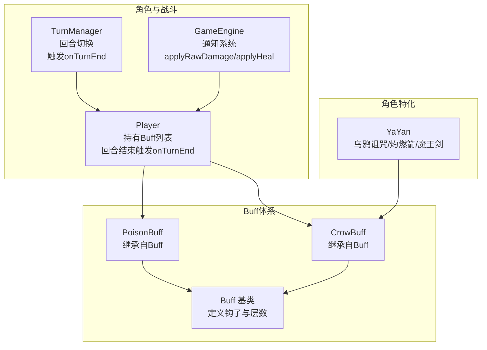
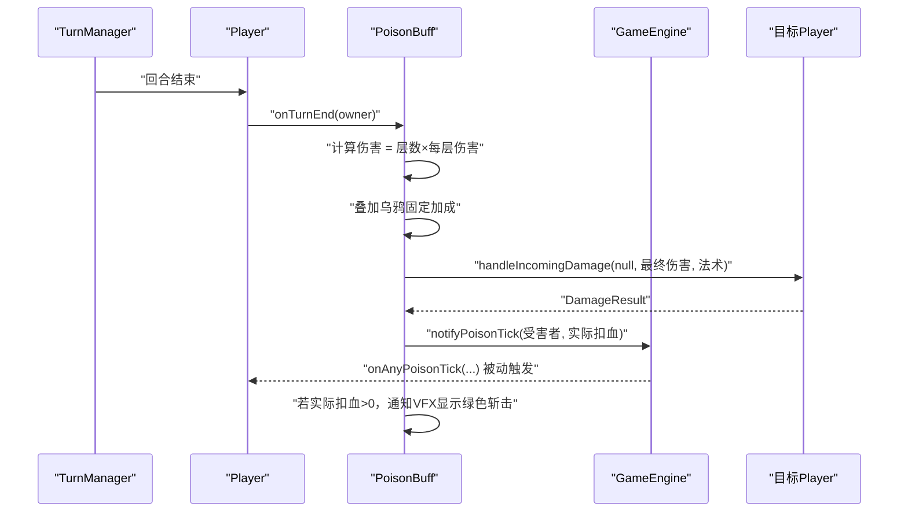
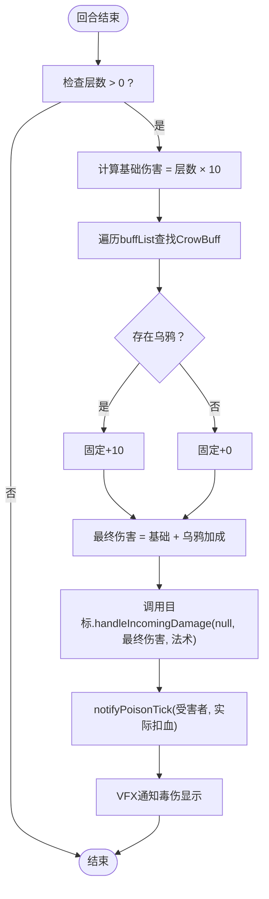
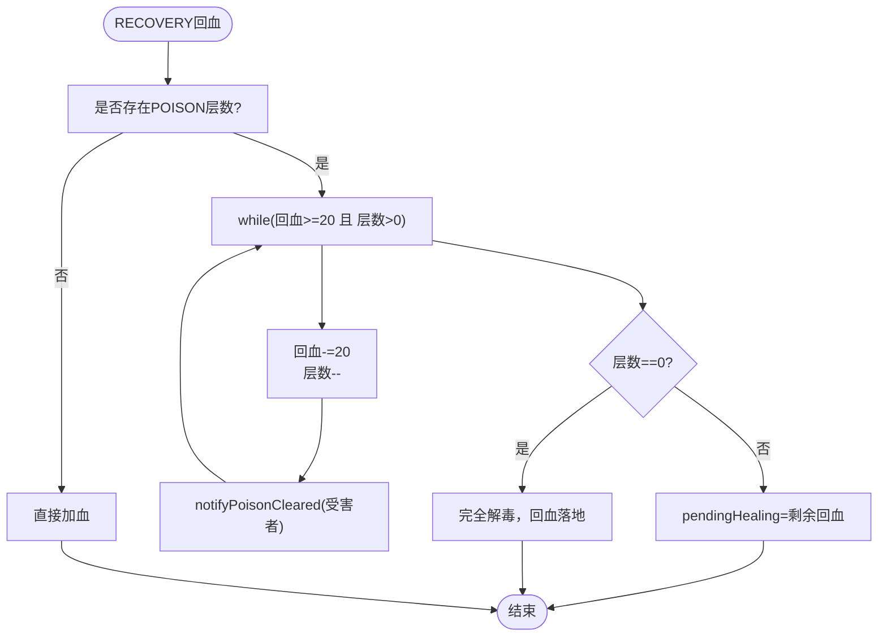
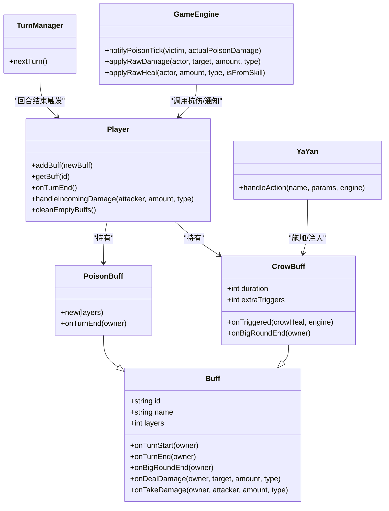

# 中毒Buff

<cite>
**本文引用的文件**
- [PoisonBuff.hx](file://buffs/PoisonBuff.hx)
- [Buff.hx](file://model/Buff.hx)
- [Player.hx](file://character/Player.hx)
- [GameEngine.hx](file://GameEngine.hx)
- [TurnManager.hx](file://TurnManager.hx)
- [CrowBuff.hx](file://buffs/CrowBuff.hx)
- [DamageType.hx](file://model/DamageType.hx)
- [HealType.hx](file://model/HealType.hx)
- [YaYan.hx](file://character/YaYan.hx)
</cite>

## 目录
1. [简介](#简介)
2. [项目结构](#项目结构)
3. [核心组件](#核心组件)
4. [架构总览](#架构总览)
5. [详细组件分析](#详细组件分析)
6. [依赖关系分析](#依赖关系分析)
7. [性能考虑](#性能考虑)
8. [故障排查指南](#故障排查指南)
9. [结论](#结论)

## 简介
本文档围绕“中毒Buff”展开，系统性阐述其持续伤害机制、伤害递增规则、层数叠加原理、回合结算时机，以及生命周期管理（初始伤害设定、层数增加机制、最大层数限制、持续时间控制）。同时提供代码实现示例的路径指引，展示持续伤害的计算过程、回合结束时的伤害结算、以及Buff效果的移除机制，并讨论该Buff在消耗战中的战术价值、对对手的压制效果、与其他控制效果的配合使用，以及在平衡性方面的设计考量。

## 项目结构
中毒Buff位于 buffs 目录，继承自基础 Buff 类；其伤害结算发生在回合结束阶段，由 Player 的回合结束钩子统一调度；GameEngine 提供通知系统，支持忍者等角色的被动联动；TurnManager 控制回合节奏并触发回合结束结算；CrowBuff 作为乌鸦诅咒Buff，与中毒存在协同关系；YaYan 的技能可为中毒提供额外的伤害加成与触发条件。

图表来源
- [PoisonBuff.hx:1-50](file://buffs/PoisonBuff.hx#L1-L50)
- [Buff.hx:1-30](file://model/Buff.hx#L1-L30)
- [Player.hx:195-218](file://character/Player.hx#L195-L218)
- [GameEngine.hx:87-107](file://GameEngine.hx#L87-L107)
- [TurnManager.hx:124-128](file://TurnManager.hx#L124-L128)
- [CrowBuff.hx:21-64](file://buffs/CrowBuff.hx#L21-L64)
- [YaYan.hx:25-174](file://character/YaYan.hx#L25-L174)

章节来源
- [PoisonBuff.hx:1-50](file://buffs/PoisonBuff.hx#L1-L50)
- [Buff.hx:1-30](file://model/Buff.hx#L1-L30)
- [Player.hx:195-218](file://character/Player.hx#L195-L218)
- [GameEngine.hx:87-107](file://GameEngine.hx#L87-L107)
- [TurnManager.hx:124-128](file://TurnManager.hx#L124-L128)
- [CrowBuff.hx:21-64](file://buffs/CrowBuff.hx#L21-L64)
- [YaYan.hx:25-174](file://character/YaYan.hx#L25-L174)

## 核心组件
- 毒性持续伤害的核心实现位于 PoisonBuff.onTurnEnd，按“层数×每层固定伤害”的方式计算，并结合乌鸦Buff的固定加成。
- Player.onTurnEnd 统一触发所有Buff的回合结束钩子，确保中毒在回合结束时结算。
- GameEngine 提供通知系统，支持忍者等角色监听“毒伤扣血”事件，实现被动联动。
- 回血与解毒机制由 GameEngine.doHealing 实现，RECOVERY类型回血可逐层抵消中毒层数。
- YaYan 的乌鸦诅咒可为中毒提供固定加成，且其技能可影响CrowBuff的触发次数，间接影响中毒伤害。

章节来源
- [PoisonBuff.hx:11-48](file://buffs/PoisonBuff.hx#L11-L48)
- [Player.hx:212-218](file://character/Player.hx#L212-L218)
- [GameEngine.hx:87-107](file://GameEngine.hx#L87-L107)
- [GameEngine.hx:364-409](file://GameEngine.hx#L364-L409)
- [YaYan.hx:104-167](file://character/YaYan.hx#L104-L167)

## 架构总览
中毒Buff的生命周期与结算流程如下：
- 施加：通过角色组合或技能在目标身上添加PoisonBuff，层数可叠加。
- 回合结束：TurnManager在每个玩家回合结束时调用其onTurnEnd，Player遍历buffList并调用各Buff的onTurnEnd。
- 毒伤结算：PoisonBuff.onTurnEnd计算伤害（层数×每层伤害），叠加乌鸦固定加成，调用目标的handleIncomingDamage进行抗伤与护盾抵消，最终扣血。
- 通知与联动：GameEngine.notifyPoisonTick广播毒伤事件，忍者等角色可据此触发被动。
- 解毒与移除：RECOVERY回血按每20点抵消一层，直至层数清零；空层数的Buff会被Player.cleanEmptyBuffs清理。

图表来源
- [TurnManager.hx:124-128](file://TurnManager.hx#L124-L128)
- [Player.hx:212-218](file://character/Player.hx#L212-L218)
- [PoisonBuff.hx:11-48](file://buffs/PoisonBuff.hx#L11-L48)
- [GameEngine.hx:87-107](file://GameEngine.hx#L87-L107)

## 详细组件分析

### 毒性持续伤害系统
- 伤害计算规则
  - 基础伤害 = 层数 × 每层固定伤害（每层10点法术伤害）。
  - 若目标身上存在乌鸦诅咒（CrowBuff），则额外固定加成（固定+10）。
  - 最终伤害 = 基础伤害 + 乌鸦加成。
- 伤害类型与抗伤
  - 伤害类型为法术（MAGIC），走目标的handleIncomingDamage流程，依次经过攻击者Buff加成、目标Buff拦截、护盾抵消、最终扣血。
- 回合结算时机
  - 由Player.onTurnEnd统一触发，确保在回合结束时结算，避免跨回合误判。
- 通知与视觉反馈
  - GameEngine.notifyPoisonTick广播毒伤事件，忍者等角色可据此触发被动。
  - VFX层通过窗口消息通知毒伤显示（绿色斩击）。

图表来源
- [PoisonBuff.hx:11-48](file://buffs/PoisonBuff.hx#L11-L48)
- [GameEngine.hx:87-107](file://GameEngine.hx#L87-L107)

章节来源
- [PoisonBuff.hx:11-48](file://buffs/PoisonBuff.hx#L11-L48)
- [Player.hx:245-302](file://character/Player.hx#L245-L302)
- [GameEngine.hx:87-107](file://GameEngine.hx#L87-L107)

### 层数叠加与最大层数限制
- 层数叠加
  - Player.addBuff在同id的Buff存在时进行层数累加，不同id则新增Buff实例。
  - 回合结束结算时，层数参与伤害计算，但不会自动减少；只有通过RECOVERY回血才能逐层抵消。
- 最大层数限制
  - 代码层面未设置上限；层数增长取决于施加来源（如组合技能、多次施加）。
  - 解毒机制按每20点回血抵消一层，直至层数清零。
- 解毒与移除
  - RECOVERY类型回血在doHealing中逐层抵消，若仍有剩余层数，则将剩余回血存入pendingHealing，等待下次回血时继续抵消。
  - 空层数的Buff由Player.cleanEmptyBuffs清理，避免无效占用。

图表来源
- [GameEngine.hx:364-409](file://GameEngine.hx#L364-L409)
- [Player.hx:338-344](file://character/Player.hx#L338-L344)

章节来源
- [Player.hx:195-203](file://character/Player.hx#L195-L203)
- [GameEngine.hx:364-409](file://GameEngine.hx#L364-L409)
- [Player.hx:338-344](file://character/Player.hx#L338-L344)

### 持续时间控制与生命周期
- 持续时间
  - PoisonBuff本身不包含持续回合字段；其生命周期由层数控制。
  - 回合结束结算时，层数参与伤害计算；若层数归零，PoisonBuff会在下一帧被Player.cleanEmptyBuffs清理。
- 回合节奏
  - TurnManager在每个玩家回合结束时调用其onTurnEnd，从而触发PoisonBuff的结算。
- 与CrowBuff的协同
  - 若目标身上存在CrowBuff，中毒结算时额外+10（固定加成），且CrowBuff的onTriggered回调可触发鸦眼回血与乌鸦计数。

章节来源
- [TurnManager.hx:124-128](file://TurnManager.hx#L124-L128)
- [Player.hx:212-218](file://character/Player.hx#L212-L218)
- [CrowBuff.hx:57-62](file://buffs/CrowBuff.hx#L57-L62)
- [PoisonBuff.hx:17-35](file://buffs/PoisonBuff.hx#L17-L35)

### 与乌鸦Buff的联动机制
- 乌鸦固定加成
  - 中毒结算时，若目标身上存在CrowBuff，则在最终伤害上追加固定+10。
- 乌鸦触发与回血
  - CrowBuff的onTriggered在攻击结算后回调，鸦眼获得基于“乘算后额外增量”的回血与乌鸦计数。
- YaYan技能影响
  - YaYan可通过技能为CrowBuff注入额外触发次数（extraTriggers），间接提升CrowBuff的加成幅度，从而提升中毒的最终伤害。

章节来源
- [PoisonBuff.hx:17-35](file://buffs/PoisonBuff.hx#L17-L35)
- [CrowBuff.hx:44-55](file://buffs/CrowBuff.hx#L44-L55)
- [YaYan.hx:151-164](file://character/YaYan.hx#L151-L164)

### 代码实现示例（路径指引）
- 毒伤结算主流程
  - [PoisonBuff.onTurnEnd:11-48](file://buffs/PoisonBuff.hx#L11-L48)
  - [Player.onTurnEnd:212-218](file://character/Player.hx#L212-L218)
  - [GameEngine.applyRawDamage:239-290](file://GameEngine.hx#L239-L290)
- 回血解毒与层数抵消
  - [GameEngine.doHealing:364-409](file://GameEngine.hx#L364-L409)
  - [Player.cleanEmptyBuffs:338-344](file://character/Player.hx#L338-L344)
- 通知与被动联动
  - [GameEngine.notifyPoisonTick:87-107](file://GameEngine.hx#L87-L107)
  - [Player.onAnyPoisonTick:88-98](file://character/Player.hx#L88-L98)
- 与乌鸦的协同
  - [CrowBuff.onTriggered:44-55](file://buffs/CrowBuff.hx#L44-L55)
  - [YaYan.handleAction 注入Crow触发:151-164](file://character/YaYan.hx#L151-L164)

章节来源
- [PoisonBuff.hx:11-48](file://buffs/PoisonBuff.hx#L11-L48)
- [Player.hx:212-218](file://character/Player.hx#L212-L218)
- [GameEngine.hx:239-290](file://GameEngine.hx#L239-L290)
- [GameEngine.hx:364-409](file://GameEngine.hx#L364-L409)
- [CrowBuff.hx:44-55](file://buffs/CrowBuff.hx#L44-L55)
- [YaYan.hx:151-164](file://character/YaYan.hx#L151-L164)

## 依赖关系分析
- PoisonBuff依赖
  - 继承自Buff，使用其id/name/layers字段。
  - 依赖Player的buffList遍历与handleIncomingDamage抗伤流程。
  - 依赖GameEngine的事件通知与VFX通知。
- Player与TurnManager
  - Player.onTurnEnd统一触发所有Buff的onTurnEnd。
  - TurnManager在回合结束时调用current.onTurnEnd。
- CrowBuff与YaYan
  - YaYan通过技能为CrowBuff注入extraTriggers，间接影响中毒伤害。
  - CrowBuff的onTriggered在攻击结算后回调，与中毒结算相互独立但可叠加。

图表来源
- [Buff.hx:3-30](file://model/Buff.hx#L3-L30)
- [PoisonBuff.hx:6-9](file://buffs/PoisonBuff.hx#L6-L9)
- [CrowBuff.hx:21-64](file://buffs/CrowBuff.hx#L21-L64)
- [Player.hx:195-218](file://character/Player.hx#L195-L218)
- [GameEngine.hx:87-107](file://GameEngine.hx#L87-L107)
- [TurnManager.hx:124-128](file://TurnManager.hx#L124-L128)
- [YaYan.hx:104-167](file://character/YaYan.hx#L104-L167)

章节来源
- [Buff.hx:3-30](file://model/Buff.hx#L3-L30)
- [PoisonBuff.hx:6-9](file://buffs/PoisonBuff.hx#L6-L9)
- [CrowBuff.hx:21-64](file://buffs/CrowBuff.hx#L21-L64)
- [Player.hx:195-218](file://character/Player.hx#L195-L218)
- [GameEngine.hx:87-107](file://GameEngine.hx#L87-L107)
- [TurnManager.hx:124-128](file://TurnManager.hx#L124-L128)
- [YaYan.hx:104-167](file://character/YaYan.hx#L104-L167)

## 性能考虑
- 计算复杂度
  - 毒伤结算为O(1)常数时间，仅涉及整数运算与一次遍历查找CrowBuff。
- 内存占用
  - 每个中毒Buff实例仅保存层数，内存开销极低；空层数的Buff会在下一帧被清理。
- 通知成本
  - notifyPoisonTick广播事件对所有存活玩家生效，但仅触发监听角色的被动逻辑，不会显著增加CPU负担。
- 护盾抵消
  - 抗伤流程按护盾类型排序抵消，最坏情况下为O(S)（S为有效护盾数量），通常S很小，影响有限。

## 故障排查指南
- 中毒未结算
  - 检查是否在回合结束时调用了Player.onTurnEnd（TurnManager.nextTurn会触发）。
  - 确认PoisonBuff.layers > 0，否则不会结算。
- 伤害异常
  - 检查CrowBuff是否存在且未被清理；确认CrowBuff的extraTriggers是否被YaYan正确注入。
  - 确认目标是否拥有护盾导致实际扣血减少。
- 解毒无效
  - 确认回血类型为RECOVERY；若为SUPPLY则不解毒。
  - 检查pendingHealing是否被正确累积与使用。
- VFX未显示
  - 确认GameEngine.notifyPoisonTick被调用，且VFX层已正确接收消息。

章节来源
- [TurnManager.hx:124-128](file://TurnManager.hx#L124-L128)
- [PoisonBuff.hx:11-48](file://buffs/PoisonBuff.hx#L11-L48)
- [CrowBuff.hx:44-55](file://buffs/CrowBuff.hx#L44-L55)
- [YaYan.hx:151-164](file://character/YaYan.hx#L151-L164)
- [GameEngine.hx:364-409](file://GameEngine.hx#L364-L409)

## 结论
中毒Buff通过“层数×固定伤害+乌鸦固定加成”的简单而稳定的机制，在回合结束时对目标施加持续压力。其设计强调可叠加性与解毒机制的平衡，既能在消耗战中形成持续压制，又不会造成不可逆的单体爆发。与CrowBuff及YaYan技能的联动进一步丰富了战术深度，使得中毒在团队配合中具备更强的协同价值。在平衡性方面，层数无上限但可通过回血逐步解毒，避免长期不可控；伤害类型为法术，与护盾体系自然融合，整体设计简洁高效。