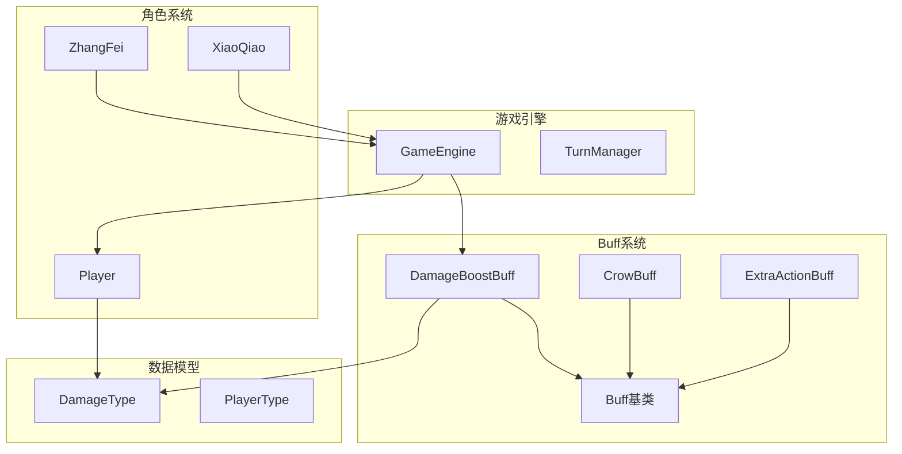
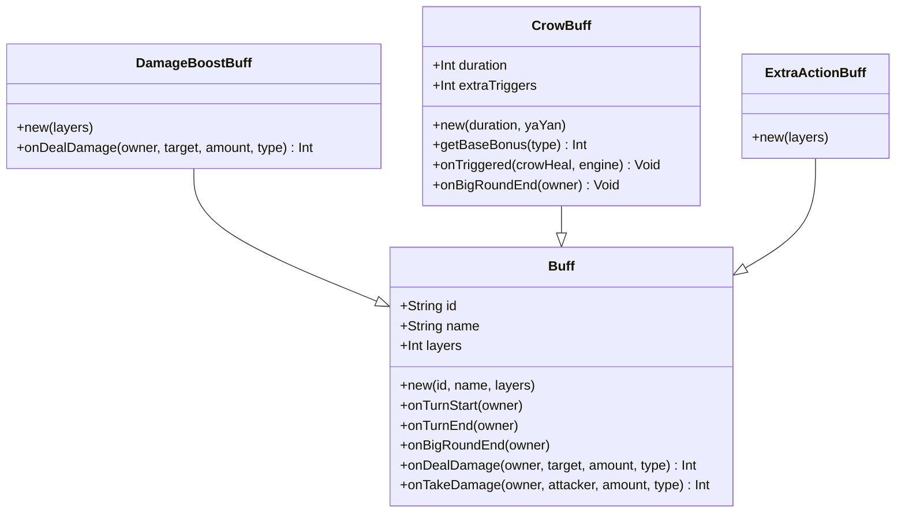
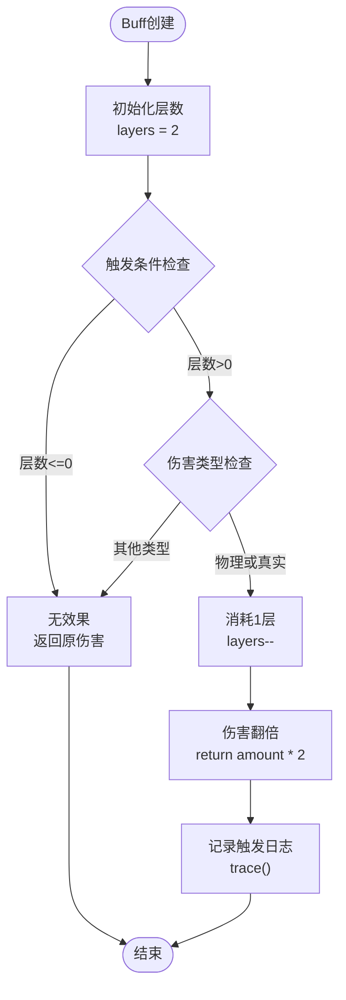
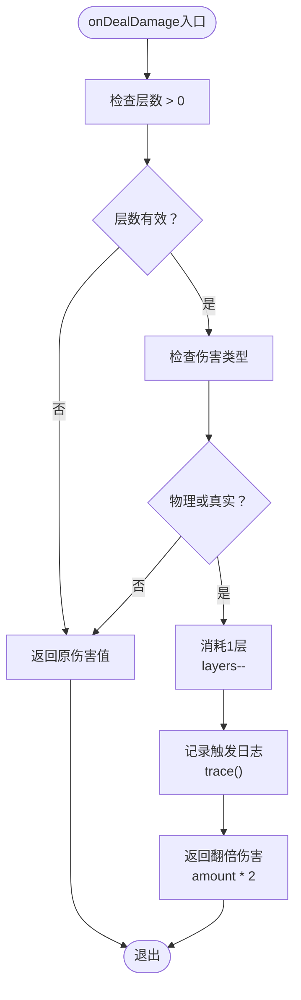
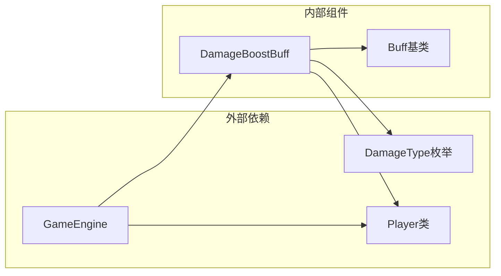
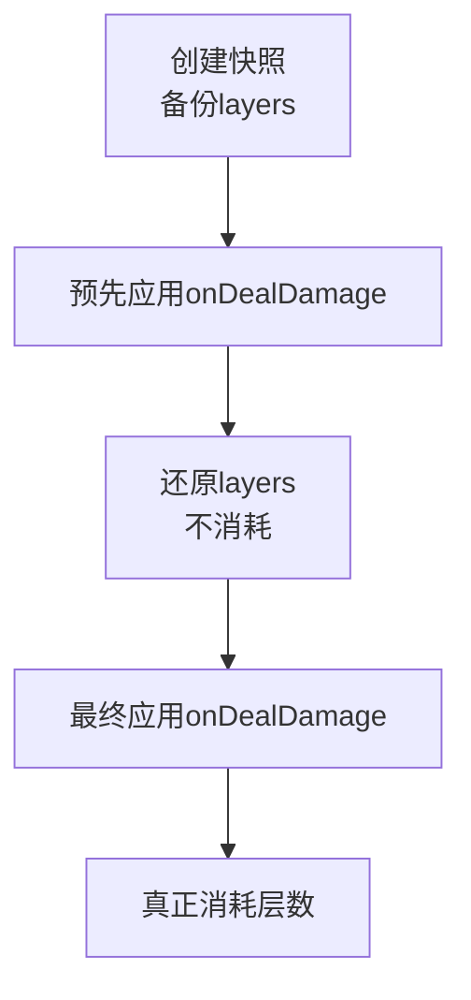

# 伤害增益Buff

<cite>
**本文档引用的文件**
- [DamageBoostBuff.hx](file://buffs/DamageBoostBuff.hx)
- [Buff.hx](file://model/Buff.hx)
- [DamageType.hx](file://model/DamageType.hx)
- [GameEngine.hx](file://GameEngine.hx)
- [Player.hx](file://character/Player.hx)
- [CrowBuff.hx](file://buffs/CrowBuff.hx)
- [ExtraActionBuff.hx](file://buffs/ExtraActionBuff.hx)
- [TurnManager.hx](file://TurnManager.hx)
</cite>

## 目录
1. [简介](#简介)
2. [项目结构](#项目结构)
3. [核心组件](#核心组件)
4. [架构概览](#架构概览)
5. [详细组件分析](#详细组件分析)
6. [依赖关系分析](#依赖关系分析)
7. [性能考虑](#性能考虑)
8. [故障排除指南](#故障排除指南)
9. [结论](#结论)

## 简介

伤害增益Buff（DamageBoostBuff）是游戏中一个重要的战斗机制组件，负责实现伤害翻倍效果。该Buff继承自通用的Buff基类，通过重写onDealDamage方法来实现特定的伤害处理逻辑。本文档将深入分析该Buff的设计架构、实现机制、使用场景以及与其他系统组件的交互关系。

## 项目结构

伤害增益Buff位于游戏的buffs目录中，采用模块化设计，与游戏的其他核心系统紧密集成：



**图表来源**
- [DamageBoostBuff.hx:1-20](file://buffs/DamageBoostBuff.hx#L1-L20)
- [Buff.hx:1-30](file://model/Buff.hx#L1-L30)
- [GameEngine.hx:124-183](file://GameEngine.hx#L124-L183)

**章节来源**
- [DamageBoostBuff.hx:1-20](file://buffs/DamageBoostBuff.hx#L1-L20)
- [Buff.hx:1-30](file://model/Buff.hx#L1-L30)
- [GameEngine.hx:124-183](file://GameEngine.hx#L124-L183)

## 核心组件

### DamageBoostBuff类结构

DamageBoostBuff是一个专门的Buff实现，具有以下核心特性：

- **继承关系**：继承自通用Buff基类
- **标识符**：DMG_BOOST
- **名称**：伤害翻倍
- **初始层数**：默认2层
- **作用范围**：物理伤害和真实伤害翻倍

### Buff基类架构

Buff基类提供了完整的生命周期管理和钩子机制：



**图表来源**
- [Buff.hx:3-30](file://model/Buff.hx#L3-L30)
- [DamageBoostBuff.hx:6-20](file://buffs/DamageBoostBuff.hx#L6-L20)
- [CrowBuff.hx:21-64](file://buffs/CrowBuff.hx#L21-L64)
- [ExtraActionBuff.hx:4-12](file://buffs/ExtraActionBuff.hx#L4-L12)

**章节来源**
- [Buff.hx:3-30](file://model/Buff.hx#L3-L30)
- [DamageBoostBuff.hx:6-20](file://buffs/DamageBoostBuff.hx#L6-L20)

## 架构概览

### 伤害处理流水线

DamageBoostBuff在整个伤害处理流程中扮演着关键角色，通过GameEngine协调各个组件：

```mermaid
sequenceDiagram
participant Actor as 攻击者
participant Engine as GameEngine
participant Target as 目标
participant Buff as DamageBoostBuff
Actor->>Engine : applyDamage(baseAmount, type)
Engine->>Actor : calculateOutputDamage()
Engine->>Engine : 预先应用onDealDamage快照/还原
Engine->>Buff : onDealDamage(finalAmount, type)
Buff->>Buff : 检查层数和伤害类型
alt 物理或真实伤害
Buff->>Buff : layers--
Buff->>Engine : return amount * 2
else 其他伤害类型
Buff->>Engine : return amount
end
Engine->>Target : handleIncomingDamage()
Target->>Target : onTakeDamage()
Engine->>Engine : 通知最终伤害
Engine->>Actor : onAfterDealtDamage()
```

**图表来源**
- [GameEngine.hx:137-183](file://GameEngine.hx#L137-L183)
- [DamageBoostBuff.hx:11-19](file://buffs/DamageBoostBuff.hx#L11-L19)
- [Player.hx:249-268](file://character/Player.hx#L249-L268)

### 层数管理系统

DamageBoostBuff实现了完整的层数管理机制：



**图表来源**
- [DamageBoostBuff.hx:7-19](file://buffs/DamageBoostBuff.hx#L7-L19)

**章节来源**
- [GameEngine.hx:166-180](file://GameEngine.hx#L166-L180)
- [DamageBoostBuff.hx:11-19](file://buffs/DamageBoostBuff.hx#L11-L19)

## 详细组件分析

### DamageBoostBuff实现详解

#### 类定义和构造函数

DamageBoostBuff通过简洁的构造函数实现了基本配置：

- **ID设置**："DMG_BOOST" - 唯一标识符
- **名称设置**："伤害翻倍" - 用户界面显示文本
- **层数参数**：支持自定义初始层数，默认为2层

#### onDealDamage方法实现

该方法是DamageBoostBuff的核心逻辑实现：



**图表来源**
- [DamageBoostBuff.hx:11-19](file://buffs/DamageBoostBuff.hx#L11-L19)

#### 伤害类型过滤机制

DamageBoostBuff实现了精确的伤害类型过滤规则：

| 伤害类型 | 是否生效 | 说明 |
|---------|---------|------|
| PHYSICAL | ✅ 是 | 物理伤害翻倍 |
| MAGIC | ❌ 否 | 法术伤害不翻倍 |
| TRUE | ✅ 是 | 真实伤害翻倍 |

这种设计确保了伤害翻倍效果的精确控制，避免了意外的伤害放大。

**章节来源**
- [DamageBoostBuff.hx:11-19](file://buffs/DamageBoostBuff.hx#L11-L19)
- [DamageType.hx:3-7](file://model/DamageType.hx#L3-L7)

### 层数管理机制

#### 初始层数设置

DamageBoostBuff支持灵活的层数配置：

- **默认层数**：2层
- **自定义层数**：可通过构造函数参数设置
- **持久化存储**：层数信息保存在Buff实例的layers属性中

#### 使用后层数递减

层数递减机制确保了伤害翻倍效果的有限性和策略性：

- **触发条件**：层数>0 且 伤害类型为PHYSICAL或TRUE
- **递减时机**：在满足条件时立即递减
- **不可逆性**：一旦消耗无法恢复

#### 触发条件判断

完整的触发条件检查流程：

1. **层数检查**：确保Buff仍有可用层数
2. **类型检查**：验证伤害类型是否在允许范围内
3. **执行翻倍**：满足条件时执行伤害翻倍操作

**章节来源**
- [DamageBoostBuff.hx:11-19](file://buffs/DamageBoostBuff.hx#L11-L19)

### 日志输出机制

DamageBoostBuff实现了详细的日志记录功能：

#### 触发日志格式

日志输出包含以下关键信息：
- 攻击者姓名
- 触发时间
- 效果确认信息

#### 日志记录时机

日志记录在以下情况下触发：
- 成功消耗层数时
- 执行伤害翻倍操作时

**章节来源**
- [DamageBoostBuff.hx:15](file://buffs/DamageBoostBuff.hx#L15)

## 依赖关系分析

### 组件耦合度分析

DamageBoostBuff与相关组件的依赖关系如下：



**图表来源**
- [DamageBoostBuff.hx:2-4](file://buffs/DamageBoostBuff.hx#L2-L4)
- [GameEngine.hx:137-183](file://GameEngine.hx#L137-L183)

### 关键依赖关系

#### 与GameEngine的集成

DamageBoostBuff通过GameEngine的伤害处理流程实现：

- **预应用机制**：使用快照/还原技术避免重复消耗
- **最终应用**：在伤害计算完成后真正消耗层数
- **状态同步**：通过_engine._skipAttackerDealBuffs标志避免重复处理

#### 与Player系统的交互

DamageBoostBuff与Player系统的交互体现在：

- **伤害计算**：参与最终伤害的计算过程
- **状态管理**：通过Player的buffList进行管理
- **生命周期**：遵循Player的回合结束清理机制

**章节来源**
- [GameEngine.hx:166-180](file://GameEngine.hx#L166-L180)
- [Player.hx:249-268](file://character/Player.hx#L249-L268)

## 性能考虑

### 时间复杂度分析

DamageBoostBuff的性能特征：

- **单次调用**：O(1)时间复杂度
- **内存占用**：固定大小的对象实例
- **触发频率**：取决于战斗中的伤害次数

### 优化策略

#### 快照机制优化

GameEngine使用快照/还原技术避免重复消耗：



**图表来源**
- [GameEngine.hx:166-180](file://GameEngine.hx#L166-L180)

#### 内存管理

- **对象池**：Buff对象的创建和销毁
- **引用管理**：避免循环引用问题
- **垃圾回收**：及时清理无效的Buff实例

## 故障排除指南

### 常见问题诊断

#### 问题1：伤害翻倍不生效

**可能原因**：
- Buff层数已耗尽
- 伤害类型不在允许范围内
- GameEngine处理流程异常

**解决方案**：
1. 检查Buff的layers属性
2. 验证伤害类型是否为PHYSICAL或TRUE
3. 查看GameEngine的日志输出

#### 问题2：层数异常消耗

**可能原因**：
- 多个DamageBoostBuff实例同时存在
- GameEngine的快照机制失效
- Player的buffList管理异常

**解决方案**：
1. 检查Player的addBuff方法调用
2. 验证GameEngine的预应用流程
3. 确认TurnManager的回合切换逻辑

**章节来源**
- [GameEngine.hx:166-180](file://GameEngine.hx#L166-L180)
- [TurnManager.hx:150-170](file://TurnManager.hx#L150-L170)

### 调试技巧

#### 日志分析

通过分析trace输出可以快速定位问题：

1. **触发日志**：确认DamageBoostBuff是否被调用
2. **层数变化**：跟踪layers属性的变化
3. **伤害类型**：验证伤害类型的正确传递

#### 单元测试建议

建议为DamageBoostBuff编写针对性的测试用例：

- 测试不同伤害类型的处理
- 验证层数消耗的正确性
- 检查边界条件的处理

## 结论

DamageBoostBuff作为一个精心设计的战斗机制组件，展现了优秀的软件工程实践：

### 设计优势

1. **清晰的职责分离**：专注于伤害翻倍功能
2. **精确的类型控制**：通过伤害类型过滤确保平衡性
3. **完善的生命周期管理**：支持层数管理和自动清理
4. **良好的集成性**：与GameEngine和Player系统无缝协作

### 应用场景

DamageBoostBuff适用于多种战斗场景：

- **高爆发输出**：提供短暂的强力伤害提升
- **战术配合**：与其他Buff形成组合效果
- **策略深度**：层数管理增加了战术选择的复杂性

### 数值平衡考虑

在实际应用中需要考虑：

- **层数上限**：平衡效果强度和持续时间
- **触发频率**：避免过度频繁的触发
- **与其他Buff的交互**：确保整体伤害曲线的合理性

通过深入理解DamageBoostBuff的设计理念和实现细节，开发者可以更好地利用这一机制来增强游戏的策略性和趣味性。