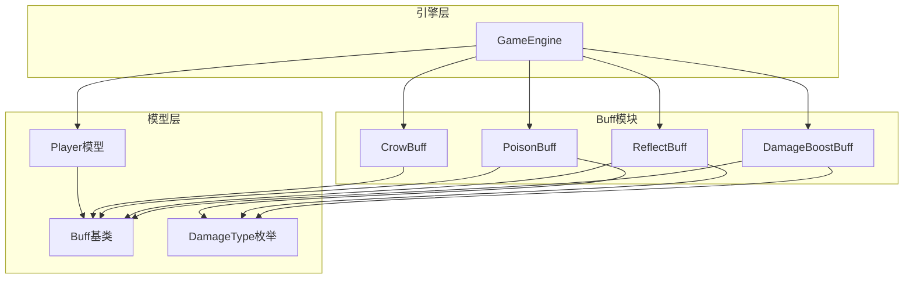
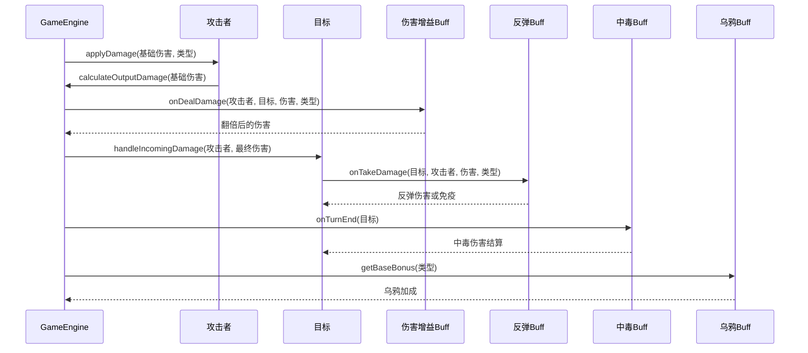
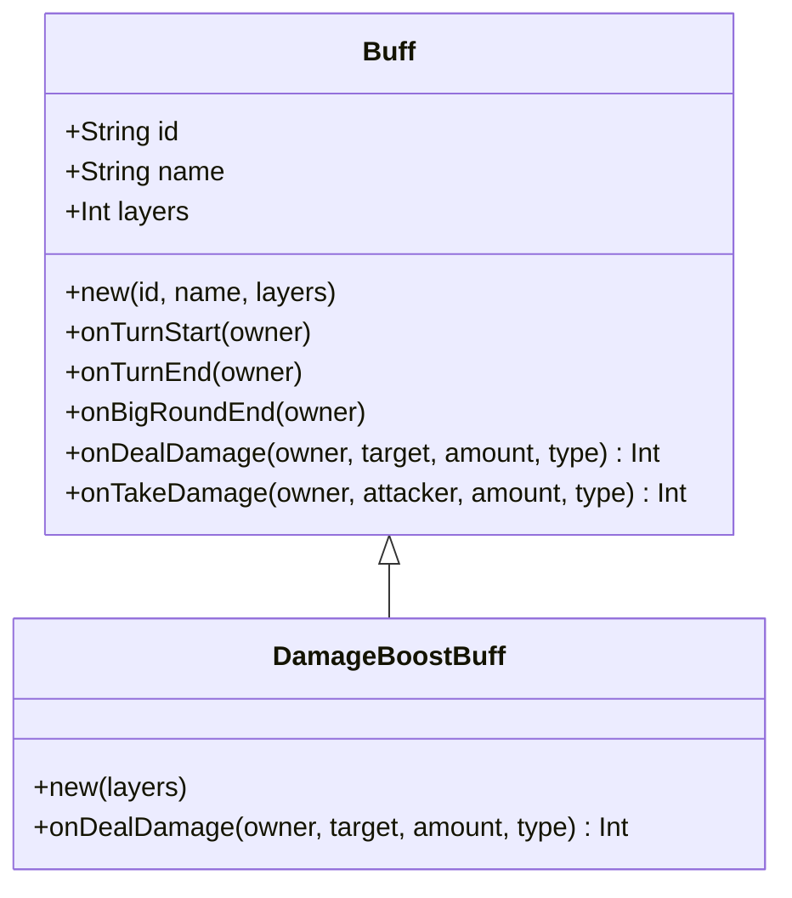
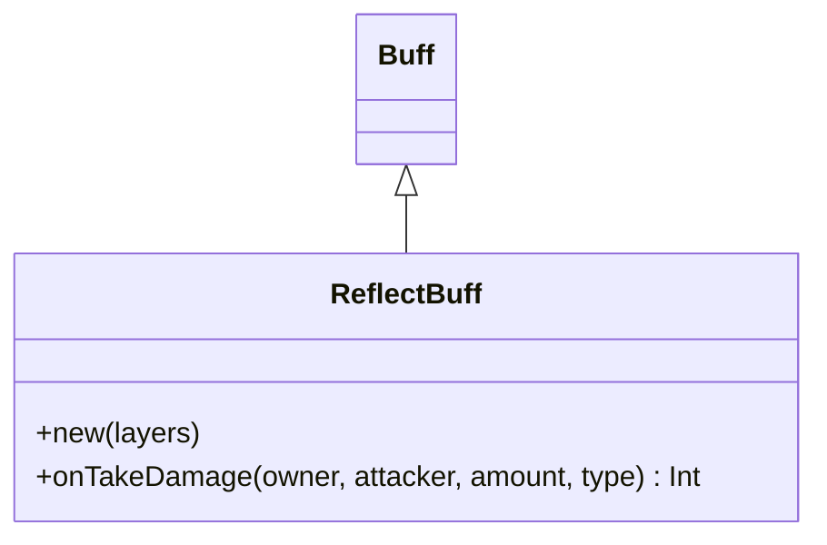
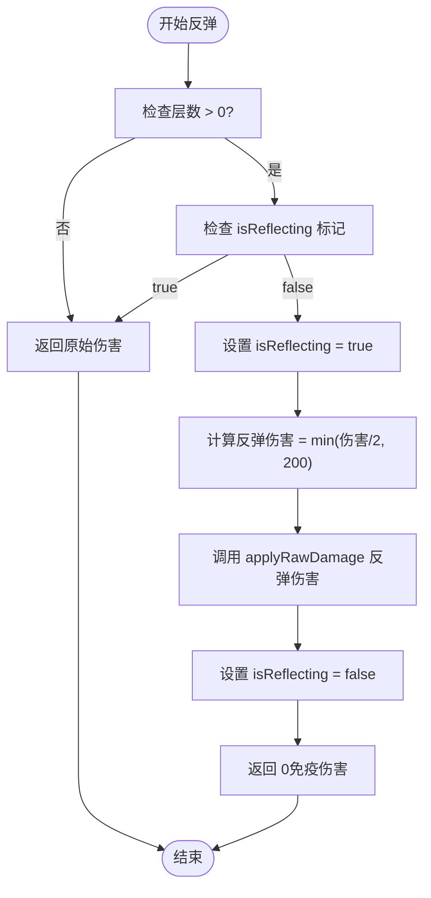
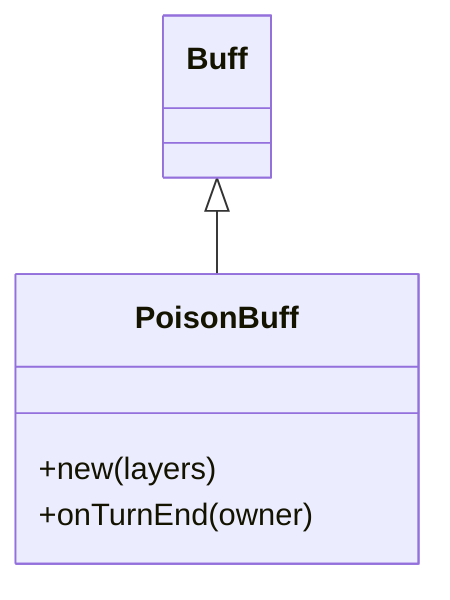
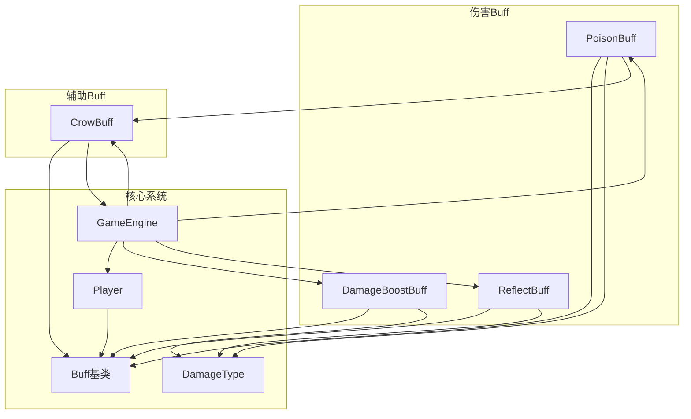

# 伤害相关Buff

<cite>
**本文档引用的文件**
- [DamageBoostBuff.hx](file://buffs/DamageBoostBuff.hx)
- [ReflectBuff.hx](file://buffs/ReflectBuff.hx)
- [PoisonBuff.hx](file://buffs/PoisonBuff.hx)
- [CrowBuff.hx](file://buffs/CrowBuff.hx)
- [Buff.hx](file://model/Buff.hx)
- [DamageType.hx](file://model/DamageType.hx)
- [Player.hx](file://model/Player.hx)
- [GameEngine.hx](file://GameEngine.hx)
</cite>

## 目录
1. [简介](#简介)
2. [项目结构](#项目结构)
3. [核心组件](#核心组件)
4. [架构概览](#架构概览)
5. [详细组件分析](#详细组件分析)
6. [依赖关系分析](#依赖关系分析)
7. [性能考量](#性能考量)
8. [故障排除指南](#故障排除指南)
9. [结论](#结论)

## 简介
本文档深入解析游戏中的三种伤害相关Buff：伤害增益Buff(DamageBoostBuff)、反弹Buff(ReflectBuff)和中毒Buff(PoisonBuff)。我们将详细说明它们的实现机制、计算公式、层数叠加规则、持续时间影响，以及与其他效果的交互关系。同时提供配置参数说明和数值平衡考虑，并通过序列图和流程图展示具体的工作流程。

## 项目结构
伤害相关Buff位于`buffs/`目录下，基础Buff类定义在`model/Buff.hx`中，伤害类型枚举在`model/DamageType.hx`中，核心伤害处理逻辑在`GameEngine.hx`和`model/Player.hx`中。

**图表来源**
- [DamageBoostBuff.hx:1-20](file://buffs/DamageBoostBuff.hx#L1-L20)
- [ReflectBuff.hx:1-43](file://buffs/ReflectBuff.hx#L1-L43)
- [PoisonBuff.hx:1-50](file://buffs/PoisonBuff.hx#L1-L50)
- [CrowBuff.hx:1-64](file://buffs/CrowBuff.hx#L1-L64)
- [Buff.hx:1-30](file://model/Buff.hx#L1-L30)
- [DamageType.hx:1-7](file://model/DamageType.hx#L1-L7)
- [Player.hx:240-398](file://model/Player.hx#L240-L398)
- [GameEngine.hx:16-200](file://GameEngine.hx#L16-L200)

## 核心组件
本节概述三种伤害相关Buff的核心功能和特性。

### 伤害增益Buff(DamageBoostBuff)
- **作用机制**：在造成伤害前对物理和真实伤害进行翻倍
- **层数管理**：每触发一次消耗一层，支持多层叠加
- **触发条件**：仅对物理和真实伤害生效
- **持续时间**：通过层数控制，非时间限制

### 反弹Buff(ReflectBuff)
- **作用机制**：承受物理伤害时反弹一半给攻击者
- **防护机制**：自身免疫本次物理伤害
- **防循环机制**：使用GameEngine级别的isReflecting标记防止无限反弹
- **上限保护**：反弹伤害不超过200点

### 中毒Buff(PoisonBuff)
- **作用机制**：回合结束时对持有者造成魔法伤害
- **伤害计算**：每层10点基础伤害，可叠加
- **乌鸦加成**：毒发时额外+10点（固定加成）
- **通知系统**：向全场玩家广播毒伤事件

**章节来源**
- [DamageBoostBuff.hx:6-20](file://buffs/DamageBoostBuff.hx#L6-L20)
- [ReflectBuff.hx:16-43](file://buffs/ReflectBuff.hx#L16-L43)
- [PoisonBuff.hx:6-50](file://buffs/PoisonBuff.hx#L6-L50)

## 架构概览
伤害相关Buff的实现遵循统一的钩子模式，通过GameEngine协调各个组件之间的交互。

**图表来源**
- [GameEngine.hx:137-180](file://GameEngine.hx#L137-L180)
- [Player.hx:262-325](file://model/Player.hx#L262-L325)
- [DamageBoostBuff.hx:11-19](file://buffs/DamageBoostBuff.hx#L11-L19)
- [ReflectBuff.hx:22-41](file://buffs/ReflectBuff.hx#L22-L41)
- [PoisonBuff.hx:11-48](file://buffs/PoisonBuff.hx#L11-L48)
- [CrowBuff.hx:34-42](file://buffs/CrowBuff.hx#L34-L42)

## 详细组件分析

### 伤害增益Buff(DamageBoostBuff)分析

#### 实现机制
DamageBoostBuff继承自Buff基类，重写onDealDamage钩子，在造成伤害前对符合条件的伤害进行翻倍处理。

**图表来源**
- [Buff.hx:3-30](file://model/Buff.hx#L3-L30)
- [DamageBoostBuff.hx:6-20](file://buffs/DamageBoostBuff.hx#L6-L20)

#### 计算公式
- **基础公式**：`最终伤害 = 原始伤害 × 2`
- **触发条件**：`layers > 0 AND (type == PHYSICAL OR type == TRUE)`
- **层数消耗**：每次触发后`layers--`

#### 层数叠加机制
- **初始层数**：构造函数参数，默认2层
- **叠加规则**：通过Player.addBuff方法合并同ID的Buff，层数相加
- **触发顺序**：按Buff列表顺序依次应用，每层只能触发一次

#### 持续时间影响
- **时间控制**：通过层数而非回合数控制
- **触发时机**：在伤害造成前的钩子阶段生效
- **清理机制**：触发后自动移除空层数的Buff

**章节来源**
- [DamageBoostBuff.hx:7-19](file://buffs/DamageBoostBuff.hx#L7-L19)
- [Player.hx:212-220](file://model/Player.hx#L212-L220)

### 反弹Buff(ReflectBuff)分析

#### 实现机制
ReflectBuff同样继承自Buff基类，重写onTakeDamage钩子，在承受伤害时进行反弹处理。

**图表来源**
- [ReflectBuff.hx:16-43](file://buffs/ReflectBuff.hx#L16-L43)
- [Buff.hx:3-30](file://model/Buff.hx#L3-L30)

#### 伤害返还机制
- **反弹比例**：`min(原始伤害/2, 200)`
- **触发条件**：`type == PHYSICAL AND layers > 0`
- **防护效果**：自身免疫本次物理伤害（返回0）

#### 触发条件
- **伤害类型**：仅物理伤害触发
- **层数检查**：必须有剩余层数
- **防循环保护**：GameEngine.isReflecting标记防止无限反弹

#### 对攻击者的反制效果
- **伤害类型**：反弹伤害为物理伤害
- **伤害传播**：通过GameEngine.applyRawDamage绕过倍率和钩子
- **视觉反馈**：通知VFX系统显示反弹效果

#### 防循环机制
使用GameEngine级别的isReflecting布尔标记，确保反弹过程中的安全性：

**图表来源**
- [ReflectBuff.hx:22-41](file://buffs/ReflectBuff.hx#L22-L41)
- [GameEngine.hx:239-290](file://GameEngine.hx#L239-L290)

**章节来源**
- [ReflectBuff.hx:16-43](file://buffs/ReflectBuff.hx#L16-L43)
- [GameEngine.hx:20-20](file://GameEngine.hx#L20-L20)

### 中毒Buff(PoisonBuff)分析

#### 实现机制
PoisonBuff继承自Buff基类，重写onTurnEnd钩子，在回合结束时进行持续伤害结算。

**图表来源**
- [PoisonBuff.hx:6-50](file://buffs/PoisonBuff.hx#L6-L50)
- [Buff.hx:3-30](file://model/Buff.hx#L3-L30)

#### 持续伤害系统
- **伤害计算**：`每层10点魔法伤害`
- **总伤害**：`总伤害 = 层数 × 10 + 乌鸦加成`
- **触发时机**：回合结束时自动结算
- **伤害类型**：魔法伤害

#### 伤害递增规则
- **线性递增**：每层固定+10点伤害
- **上限保护**：单次伤害不超过200点（通过反弹上限间接保护）
- **叠加原理**：层数直接决定伤害大小

#### 乌鸦加成机制
- **固定加成**：毒发时额外+10点（无论多少层）
- **触发条件**：持有乌鸦Buff时生效
- **回调处理**：通过CrowBuff.onTriggered回调鸦眼技能

#### 回合结算时机
- **结算位置**：Player.onTurnEnd中调用
- **通知系统**：向全场玩家广播毒伤事件
- **视觉反馈**：通知VFX系统显示绿色斩击效果

**章节来源**
- [PoisonBuff.hx:11-48](file://buffs/PoisonBuff.hx#L11-L48)
- [CrowBuff.hx:45-55](file://buffs/CrowBuff.hx#L45-L55)

## 依赖关系分析

### 组件耦合关系
伤害相关Buff之间存在复杂的相互依赖关系：

**图表来源**
- [DamageBoostBuff.hx:2-4](file://buffs/DamageBoostBuff.hx#L2-L4)
- [ReflectBuff.hx:2-4](file://buffs/ReflectBuff.hx#L2-L4)
- [PoisonBuff.hx:2-4](file://buffs/PoisonBuff.hx#L2-L4)
- [CrowBuff.hx:3-6](file://buffs/CrowBuff.hx#L3-L6)
- [GameEngine.hx:9-15](file://GameEngine.hx#L9-L15)

### 外部依赖
- **GameEngine依赖**：ReflectBuff需要访问GameEngine实例进行安全检查
- **Player依赖**：所有Buff都需要Player作为owner参数
- **DamageType依赖**：区分不同类型的伤害处理逻辑

### 循环依赖风险
- **CrowBuff与YaYan**：使用Dynamic类型避免循环依赖
- **GameEngine与Buff**：通过静态实例访问，避免编译时依赖

**章节来源**
- [ReflectBuff.hx:26-28](file://buffs/ReflectBuff.hx#L26-L28)
- [CrowBuff.hx:26-32](file://buffs/CrowBuff.hx#L26-L32)
- [GameEngine.hx:18-19](file://GameEngine.hx#L18-L19)

## 性能考量

### 计算复杂度
- **DamageBoostBuff**：O(n)遍历攻击者Buff列表，n为Buff数量
- **ReflectBuff**：O(1)常数时间操作，包含GameEngine访问
- **PoisonBuff**：O(m)遍历目标Buff列表查找CrowBuff，m为目标Buff数量

### 内存使用
- **层数存储**：每个Buff占用固定内存空间
- **列表操作**：Buff列表的插入、删除操作为O(n)
- **GameEngine缓存**：isReflecting标记为简单布尔值

### 优化建议
- **Buff查找优化**：可以考虑按类型分组存储减少遍历
- **批量处理**：在GameEngine中批量应用多个Buff效果
- **缓存机制**：对频繁访问的属性进行缓存

## 故障排除指南

### 常见问题及解决方案

#### 反弹循环问题
**症状**：两个角色互相反弹导致无限循环
**解决方案**：使用GameEngine.isReflecting全局标记防止重复反弹

#### 伤害计算异常
**症状**：伤害翻倍或反弹计算结果不符合预期
**排查步骤**：
1. 检查DamageType枚举值是否正确
2. 验证Buff层数是否正确消耗
3. 确认触发条件是否满足

#### 中毒伤害不生效
**症状**：中毒Buff存在但不造成伤害
**排查步骤**：
1. 检查onTurnEnd钩子是否正确调用
2. 验证CrowBuff是否存在且层数>0
3. 确认伤害类型为MAGIC

**章节来源**
- [ReflectBuff.hx:26-28](file://buffs/ReflectBuff.hx#L26-L28)
- [PoisonBuff.hx:11-15](file://buffs/PoisonBuff.hx#L11-L15)

## 结论
伤害相关Buff系统通过统一的钩子模式实现了灵活的伤害处理机制。DamageBoostBuff提供了强大的伤害增益能力，ReflectBuff实现了有效的反击机制，PoisonBuff创造了持续伤害的策略深度。三个Buff之间通过CrowBuff形成了完整的伤害链路，体现了游戏设计中的平衡性和策略性。

系统的关键优势在于：
- **模块化设计**：每个Buff独立实现，便于维护和扩展
- **统一接口**：通过Buff基类提供一致的生命周期管理
- **安全机制**：完善的防循环和安全检查
- **可视化反馈**：完整的事件通知和VFX集成

未来可以考虑的改进方向：
- 增加更多伤害类型的支持
- 优化Buff查找和应用性能
- 扩展伤害计算的数学模型
- 增强调试和日志记录功能