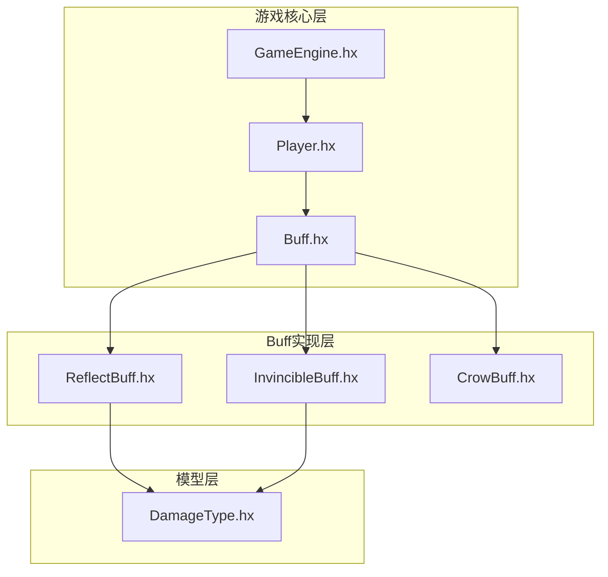
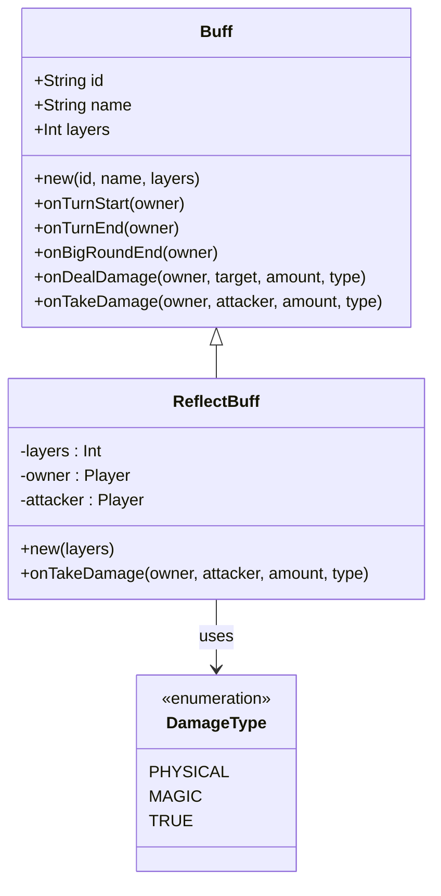
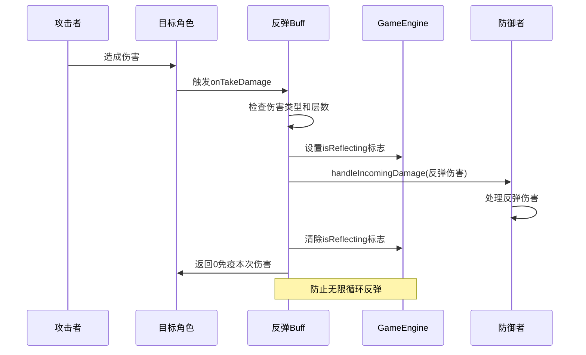
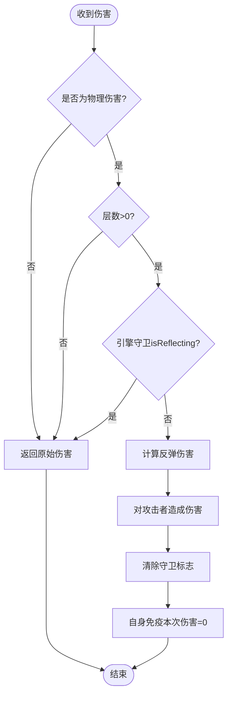
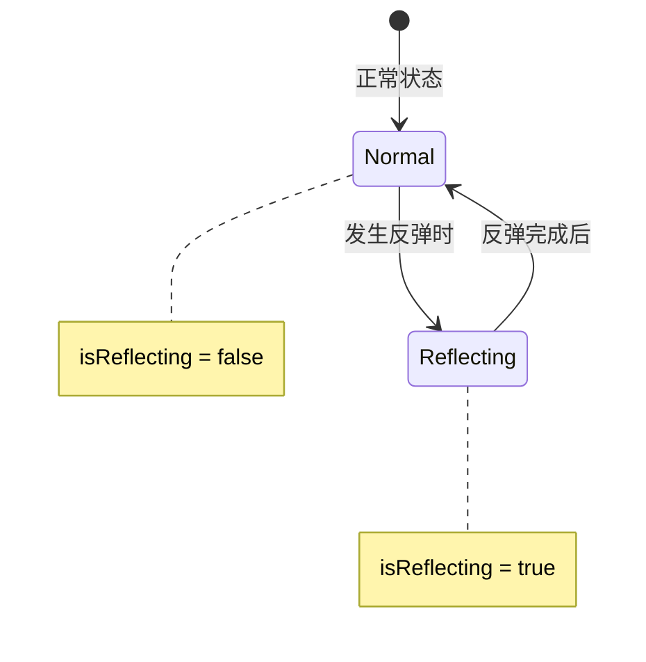
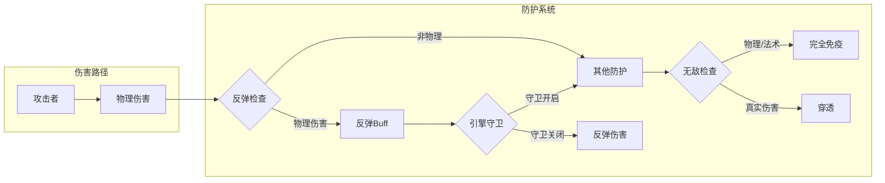
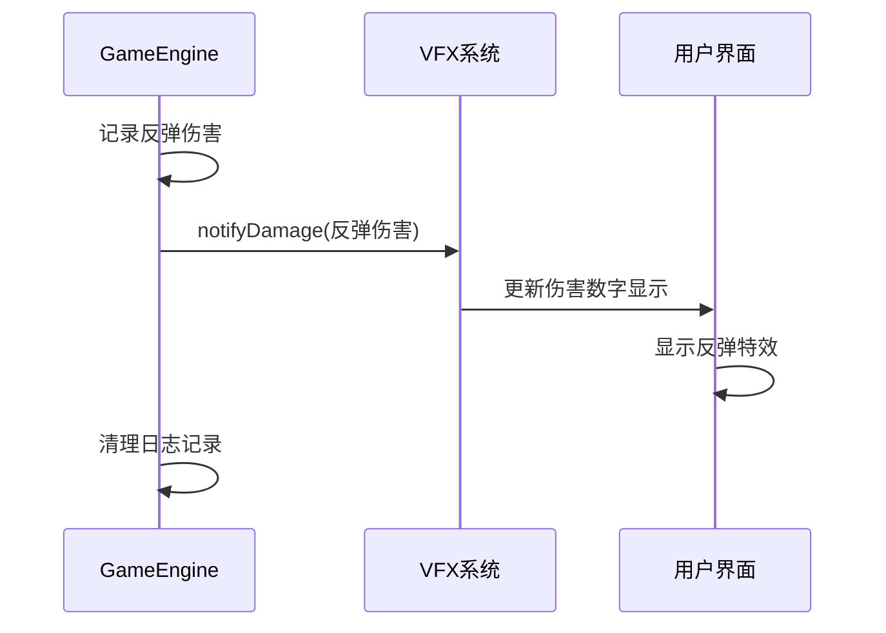
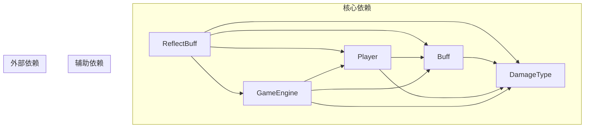

# 反弹Buff

<cite>
**本文档引用的文件**
- [ReflectBuff.hx](file://buffs/ReflectBuff.hx)
- [Buff.hx](file://model/Buff.hx)
- [DamageType.hx](file://model/DamageType.hx)
- [Player.hx](file://character/Player.hx)
- [GameEngine.hx](file://GameEngine.hx)
- [InvincibleBuff.hx](file://buffs/InvincibleBuff.hx)
- [CrowBuff.hx](file://buffs/CrowBuff.hx)
- [ZangShi.hx](file://character/ZangShi.hx)
- [main.js](file://main.js)
</cite>

## 目录
1. [简介](#简介)
2. [项目结构](#项目结构)
3. [核心组件](#核心组件)
4. [架构概览](#架构概览)
5. [详细组件分析](#详细组件分析)
6. [依赖关系分析](#依赖关系分析)
7. [性能考虑](#性能考虑)
8. [故障排除指南](#故障排除指南)
9. [结论](#结论)

## 简介

反弹Buff（ReflectBuff）是游戏战斗系统中的一个重要防护机制，它实现了伤害反弹的核心功能。该Buff能够在角色受到物理伤害时，将伤害的一半反弹给攻击者，同时自身免疫本次伤害。本文档将深入分析反弹Buff的实现原理，包括伤害反弹机制、触发时机、计算逻辑以及在整体防御体系中的作用。

## 项目结构

反弹Buff位于`buffs`目录下，作为游戏中的一个独立Buff模块存在。整个项目的结构体现了清晰的分层设计：



**图表来源**
- [GameEngine.hx:1-50](file://GameEngine.hx#L1-L50)
- [Player.hx:1-50](file://character/Player.hx#L1-L50)
- [ReflectBuff.hx:1-20](file://buffs/ReflectBuff.hx#L1-L20)

**章节来源**
- [ReflectBuff.hx:1-43](file://buffs/ReflectBuff.hx#L1-L43)
- [GameEngine.hx:1-100](file://GameEngine.hx#L1-L100)

## 核心组件

### 反弹Buff类结构

反弹Buff继承自基础Buff类，实现了特定的伤害反弹逻辑：



**图表来源**
- [Buff.hx:1-30](file://model/Buff.hx#L1-L30)
- [ReflectBuff.hx:16-42](file://buffs/ReflectBuff.hx#L16-L42)
- [DamageType.hx:1-7](file://model/DamageType.hx#L1-L7)

### 伤害类型系统

游戏中的伤害分为三种类型：
- **物理伤害（PHYSICAL）**：主要的反弹目标
- **法术伤害（MAGIC）**：不受反弹影响
- **真实伤害（TRUE）**：穿透所有防护

**章节来源**
- [DamageType.hx:1-7](file://model/DamageType.hx#L1-L7)
- [ReflectBuff.hx:22-41](file://buffs/ReflectBuff.hx#L22-L41)

## 架构概览

反弹Buff在整个游戏架构中的位置体现了其作为防护机制的重要作用：



**图表来源**
- [ReflectBuff.hx:22-41](file://buffs/ReflectBuff.hx#L22-L41)
- [GameEngine.hx:18-43](file://GameEngine.hx#L18-L43)
- [Player.hx:245-302](file://character/Player.hx#L245-L302)

## 详细组件分析

### 反弹机制实现原理

#### 触发条件分析

反弹Buff的触发具有严格的条件限制：

1. **伤害类型检查**：仅对物理伤害生效
2. **层数验证**：确保Buff仍有可用层数
3. **引擎守卫检查**：防止反弹伤害形成无限循环



**图表来源**
- [ReflectBuff.hx:22-41](file://buffs/ReflectBuff.hx#L22-L41)

#### 反弹伤害计算逻辑

反弹伤害的计算遵循以下规则：

1. **基础计算**：伤害的一半
2. **上限保护**：最大不超过200点
3. **整数处理**：使用向下取整确保数值稳定性

公式表示：`反弹伤害 = min(原始伤害/2, 200)`

#### 伤害类型限制机制

反弹Buff严格限制了适用的伤害类型：

- ✅ 物理伤害：完全反弹
- ❌ 法术伤害：不反弹
- ❌ 真实伤害：不反弹

这种设计确保了Buff不会被滥用，同时保持了游戏平衡性。

**章节来源**
- [ReflectBuff.hx:22-41](file://buffs/ReflectBuff.hx#L22-L41)
- [DamageType.hx:3-7](file://model/DamageType.hx#L3-L7)

### 无限循环防护机制

#### 引擎级守卫系统

为防止A↔B之间的无限互弹，系统采用了引擎级的守卫机制：



**图表来源**
- [GameEngine.hx:18-20](file://GameEngine.hx#L18-L20)
- [ReflectBuff.hx:26-38](file://buffs/ReflectBuff.hx#L26-L38)

#### 静态变量迁移

系统从早期的静态变量方案迁移到了引擎级守卫方案：

- **旧方案问题**：静态变量在多角色场景存在隐患
- **新方案优势**：每个GameEngine实例都有独立的守卫状态

**章节来源**
- [ReflectBuff.hx:6-15](file://buffs/ReflectBuff.hx#L6-L15)
- [GameEngine.hx:18-20](file://GameEngine.hx#L18-L20)

### 与其他防护效果的协同

#### 与无敌Buff的配合



**图表来源**
- [InvincibleBuff.hx:19-28](file://buffs/InvincibleBuff.hx#L19-L28)
- [ReflectBuff.hx:22-41](file://buffs/ReflectBuff.hx#L22-L41)

#### 与藏师减伤的对比

- **藏师**：对物理伤害减半（被动）
- **反弹Buff**：对物理伤害反弹（主动反击）

两者可以同时存在，提供不同的防护策略。

**章节来源**
- [InvincibleBuff.hx:1-44](file://buffs/InvincibleBuff.hx#L1-L44)
- [ZangShi.hx:34-47](file://character/ZangShi.hx#L34-L47)

### 可视化表现与日志记录

#### 前端视觉反馈

反弹触发时会在前端产生相应的视觉效果：



**图表来源**
- [GameEngine.hx:276-287](file://GameEngine.hx#L276-L287)

#### 日志追踪机制

系统提供了详细的日志追踪功能，便于调试和分析：

- **伤害类型标识**：区分物理、法术、真实伤害
- **反弹触发记录**：记录每次反弹的具体信息
- **层数变化跟踪**：监控Buff的使用情况

**章节来源**
- [ReflectBuff.hx:33-34](file://buffs/ReflectBuff.hx#L33-L34)
- [GameEngine.hx:276-287](file://GameEngine.hx#L276-L287)

## 依赖关系分析

### 组件间依赖关系



**图表来源**
- [ReflectBuff.hx:1-5](file://buffs/ReflectBuff.hx#L1-L5)
- [Player.hx:1-24](file://character/Player.hx#L1-L24)
- [GameEngine.hx:1-15](file://GameEngine.hx#L1-L15)

### 循环依赖规避

系统通过以下方式避免循环依赖：

1. **接口分离**：使用抽象接口而非具体实现
2. **单向依赖**：GameEngine依赖Player，但Player不依赖GameEngine
3. **延迟绑定**：通过字符串标识符进行运行时绑定

**章节来源**
- [ReflectBuff.hx:1-5](file://buffs/ReflectBuff.hx#L1-L5)
- [GameEngine.hx:1-15](file://GameEngine.hx#L1-L15)

## 性能考虑

### 时间复杂度分析

反弹Buff的计算过程具有以下时间复杂度特征：

- **触发检查**：O(1) - 基础类型比较和层数检查
- **伤害计算**：O(1) - 简单的数学运算
- **引擎守卫**：O(1) - 布尔值操作

整体算法复杂度为O(1)，确保了高效的运行性能。

### 内存使用优化

1. **对象池化**：Buff对象复用，减少垃圾回收压力
2. **按需分配**：只有在需要时才创建新的Buff实例
3. **轻量级设计**：最小化内存占用，提高缓存命中率

### 并发安全性

系统采用了以下并发安全措施：

- **原子操作**：引擎守卫标志的设置和清除是原子性的
- **线程隔离**：每个GameEngine实例都有独立的状态
- **不可变数据**：伤害类型枚举等数据结构不可变

## 故障排除指南

### 常见问题诊断

#### 反弹不生效

**可能原因**：
1. 伤害类型不是物理伤害
2. Buff层数已耗尽
3. 引擎守卫标志异常

**解决方案**：
1. 检查伤害类型是否为PHYSICAL
2. 确认Buff层数大于0
3. 验证GameEngine.isReflecting状态

#### 无限循环问题

**症状**：角色持续受到反弹伤害

**排查步骤**：
1. 检查引擎守卫标志是否正确设置
2. 验证反弹伤害是否通过applyRawDamage处理
3. 确认反弹伤害不会再次触发同一Buff

#### 性能问题

**表现**：游戏运行缓慢，特别是在多人场景

**优化建议**：
1. 减少不必要的Buff实例创建
2. 优化伤害计算逻辑
3. 实施适当的缓存策略

**章节来源**
- [ReflectBuff.hx:22-41](file://buffs/ReflectBuff.hx#L22-L41)
- [GameEngine.hx:18-20](file://GameEngine.hx#L18-L20)

### 调试技巧

#### 日志分析

系统提供了丰富的日志信息，有助于问题定位：

```javascript
// 示例日志格式
console.log(`${owner.name} 触发反伤！反弹 ${reflectDmg} 点物伤给 ${attacker.name}！`);
```

#### 断点调试

推荐的断点位置：
1. `onTakeDamage`方法入口
2. 引擎守卫标志设置处
3. 反弹伤害应用前后

## 结论

反弹Buff作为游戏防御体系中的重要组成部分，通过精心设计的机制实现了有效的伤害反击功能。其核心特点包括：

1. **精确的触发控制**：仅对物理伤害生效，确保了机制的平衡性
2. **智能的循环防护**：通过引擎级守卫防止无限反弹
3. **优雅的集成设计**：与现有系统无缝集成，扩展性强
4. **完善的性能保障**：高效的算法设计和内存管理

该Buff在不同战斗场景中都能发挥重要作用，既可以作为主要的防御手段，也可以与其他防护效果形成互补，为玩家提供多样化的战术选择。通过合理的使用策略和团队配合，反弹Buff能够显著提升角色的生存能力和战斗效率。