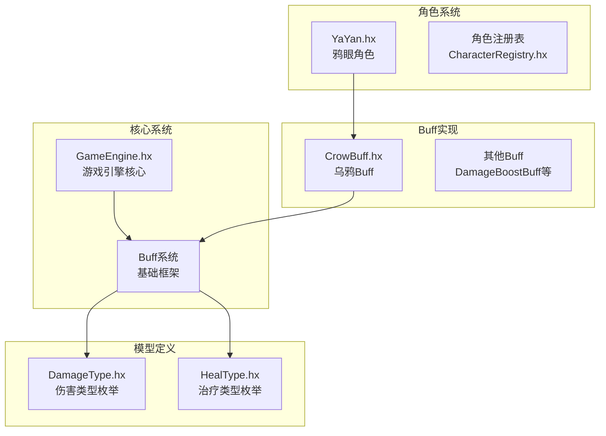
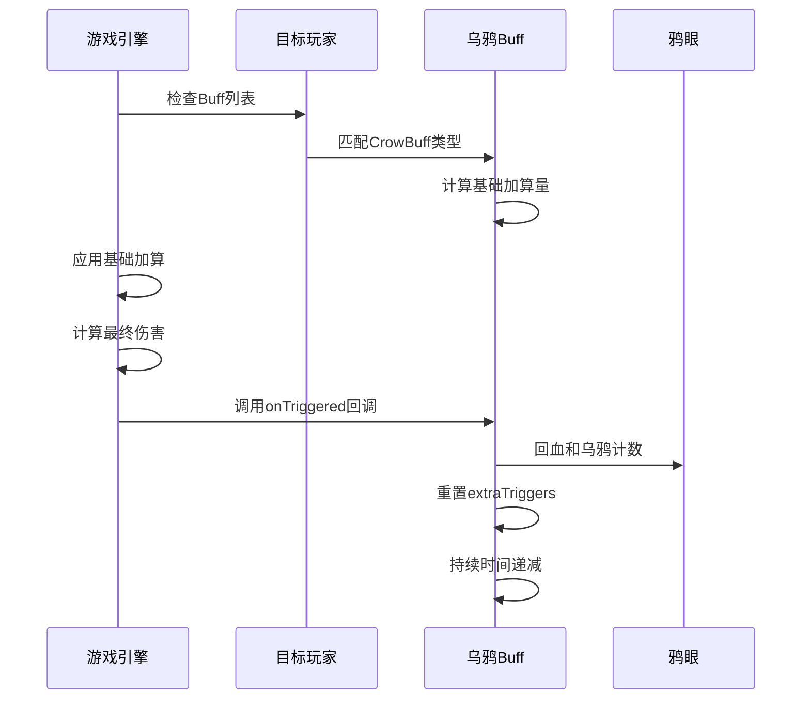
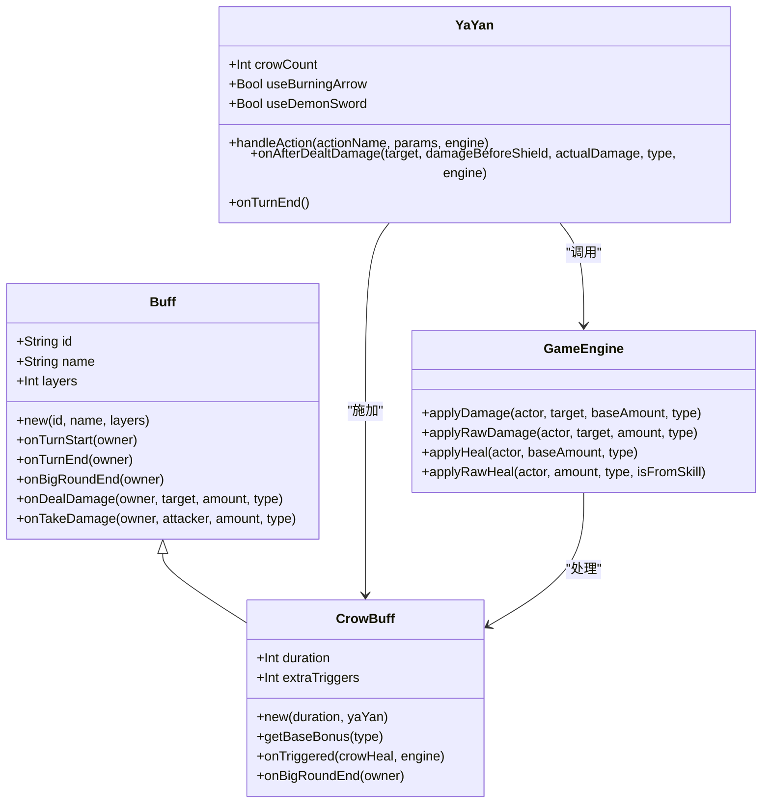
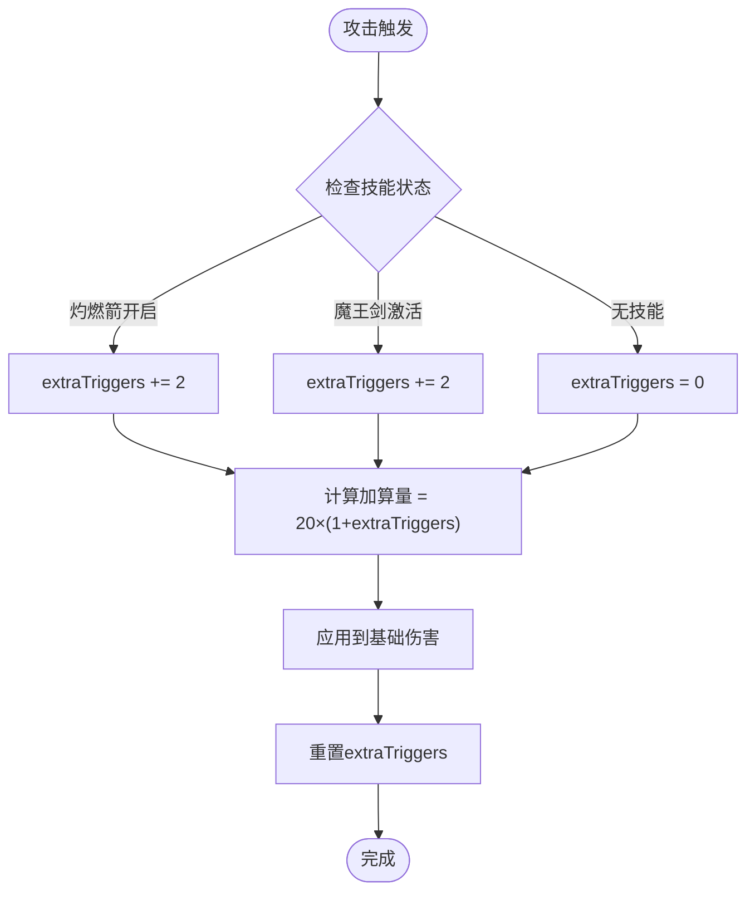
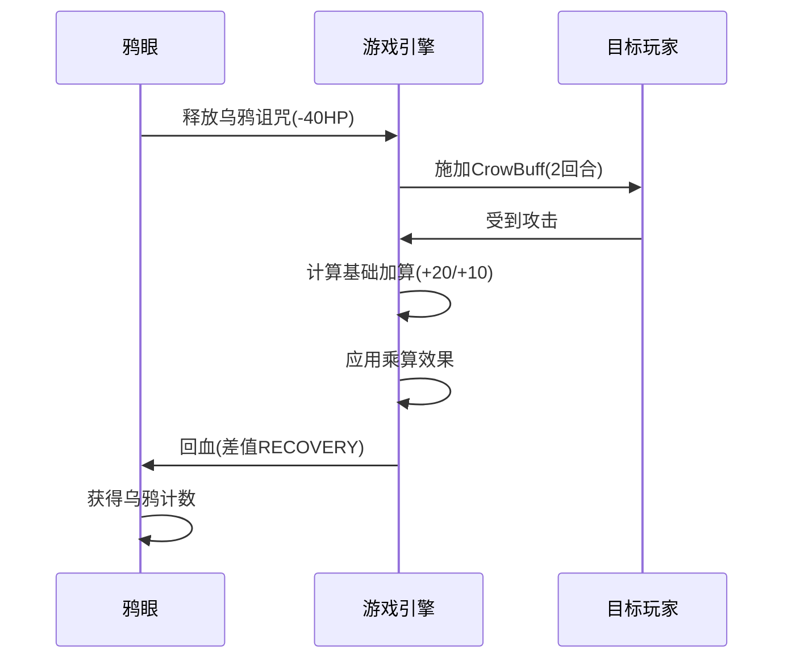
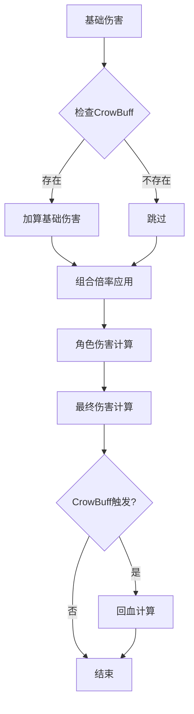

# 乌鸦Buff技术文档

<cite>
**本文档引用的文件**
- [CrowBuff.hx](file://buffs/CrowBuff.hx)
- [Buff.hx](file://model/Buff.hx)
- [YaYan.hx](file://character/YaYan.hx)
- [GameEngine.hx](file://GameEngine.hx)
- [DamageType.hx](file://model/DamageType.hx)
- [HealType.hx](file://model/HealType.hx)
- [DamageBoostBuff.hx](file://buffs/DamageBoostBuff.hx)
- [ExtraActionBuff.hx](file://buffs/ExtraActionBuff.hx)
- [鸦眼.md](file://ai/skills/鸦眼.md)
</cite>

## 目录
1. [简介](#简介)
2. [项目结构概览](#项目结构概览)
3. [核心组件分析](#核心组件分析)
4. [系统架构图](#系统架构图)
5. [详细组件分析](#详细组件分析)
6. [Buff系统交互机制](#buff系统交互机制)
7. [性能特性分析](#性能特性分析)
8. [战术应用指南](#战术应用指南)
9. [故障排除](#故障排除)
10. [结论](#结论)

## 简介

乌鸦Buff是《鸦眼》角色的核心被动能力，属于游戏中独特的"基础伤害加算"型Buff系统。该系统通过在攻击者乘算之前进行基础伤害加算的方式，实现了与其他增伤Buff的完美兼容，并为鸦眼提供了强大的持续输出能力。

本技术文档深入解析乌鸦Buff的特殊能力机制、能力类型分类、使用限制和效果范围，详细分析其在战斗中的作用和价值，提供战术应用指导和最佳实践建议。

## 项目结构概览

该项目采用模块化设计，主要包含以下关键目录结构：

**图表来源**
- [GameEngine.hx:1-50](file://GameEngine.hx#L1-L50)
- [CrowBuff.hx:1-30](file://buffs/CrowBuff.hx#L1-L30)
- [YaYan.hx:1-30](file://character/YaYan.hx#L1-L30)

**章节来源**
- [GameEngine.hx:1-200](file://GameEngine.hx#L1-L200)
- [CrowBuff.hx:1-64](file://buffs/CrowBuff.hx#L1-L64)
- [YaYan.hx:1-174](file://character/YaYan.hx#L1-L174)

## 核心组件分析

### 乌鸦Buff核心特性

乌鸦Buff作为基础伤害加算型Buff，具有以下核心特性：

- **触发时机**：在攻击者乘算之前进行基础伤害加算
- **伤害类型差异化**：物理/真实伤害+20，法术/毒伤害+10
- **触发次数机制**：基础1次，可通过技能增加至2次或4次
- **持续时间**：2回合，不叠加
- **回血机制**：基于乘算后的额外增量进行回血

### Buff生命周期管理

**图表来源**
- [GameEngine.hx:140-196](file://GameEngine.hx#L140-L196)
- [CrowBuff.hx:34-62](file://buffs/CrowBuff.hx#L34-L62)

**章节来源**
- [CrowBuff.hx:8-20](file://buffs/CrowBuff.hx#L8-L20)
- [GameEngine.hx:140-196](file://GameEngine.hx#L140-L196)

## 系统架构图

**图表来源**
- [Buff.hx:3-30](file://model/Buff.hx#L3-L30)
- [CrowBuff.hx:21-64](file://buffs/CrowBuff.hx#L21-L64)
- [YaYan.hx:25-174](file://character/YaYan.hx#L25-L174)
- [GameEngine.hx:16-339](file://GameEngine.hx#L16-L339)

## 详细组件分析

### 乌鸦Buff实现详解

#### 基础伤害加算机制

乌鸦Buff通过`getBaseBonus`方法实现基础伤害加算，支持三种伤害类型的不同加算值：

| 伤害类型 | 加算值 | 触发次数影响 |
|---------|--------|-------------|
| 物理伤害 | +20 | 1次基础，额外+20×触发次数 |
| 真实伤害 | +20 | 1次基础，额外+20×触发次数 |
| 法术伤害 | +10 | 1次基础，额外+10×触发次数 |
| 毒伤害 | +10 | 1次基础，额外+10×触发次数 |

#### 触发次数计算逻辑

**图表来源**
- [CrowBuff.hx:35-42](file://buffs/CrowBuff.hx#L35-L42)
- [YaYan.hx:151-164](file://character/YaYan.hx#L151-L164)

#### 回血机制实现

乌鸦Buff的回血机制基于乘算后的额外增量计算：

1. **差值计算**：`crowHeal = finalAmount - baseOnlyFinal`
2. **回血类型**：使用RECOVERY类型进行回血
3. **乌鸦计数**：获得触发次数对应的乌鸦数量
4. **回调时机**：在伤害计算完成后立即执行

**章节来源**
- [CrowBuff.hx:34-55](file://buffs/CrowBuff.hx#L34-L55)
- [GameEngine.hx:185-196](file://GameEngine.hx#L185-L196)

### 鸦眼角色集成

#### 技能系统与乌鸦Buff的交互

鸦眼通过三个技能与乌鸦Buff形成完整循环：

**图表来源**
- [YaYan.hx:107-129](file://character/YaYan.hx#L107-L129)
- [GameEngine.hx:140-196](file://GameEngine.hx#L140-L196)

#### 技能状态管理

| 技能 | 触发条件 | 效果 | 消耗 |
|------|----------|------|------|
| 乌鸦诅咒 | HP>40 | 对目标阵营施加CrowBuff(2回合) | -40HP |
| 灼燃箭 | toggle开启 | 攻击时CrowBuff触发+2 | -60HP/次 |
| 魔王剑 | 6只乌鸦+灼燃箭 | CrowBuff触发+4，伤害×2 | -6只乌鸦 |

**章节来源**
- [YaYan.hx:12-24](file://character/YaYan.hx#L12-L24)
- [YaYan.hx:104-167](file://character/YaYan.hx#L104-L167)

## Buff系统交互机制

### 伤害计算流水线

乌鸦Buff在整个伤害计算过程中扮演着特殊角色：

**图表来源**
- [GameEngine.hx:140-162](file://GameEngine.hx#L140-L162)
- [GameEngine.hx:185-196](file://GameEngine.hx#L185-L196)

### 与其他Buff的兼容性

乌鸦Buff的独特设计确保了与其他增伤Buff的完美兼容：

1. **位置优势**：在角色乘算之前进行加算，避免与其他Buff的重复计算
2. **类型区分**：针对不同伤害类型提供差异化加成
3. **触发控制**：通过extraTriggers精确控制触发次数
4. **回血独立**：回血机制独立于伤害计算，不影响其他Buff效果

**章节来源**
- [GameEngine.hx:140-180](file://GameEngine.hx#L140-L180)
- [CrowBuff.hx:34-42](file://buffs/CrowBuff.hx#L34-L42)

## 性能特性分析

### 时间复杂度

- **Buff查找**：O(B) - B为玩家Buff数量
- **伤害计算**：O(R) - R为角色Buff数量
- **整体复杂度**：O(B×R)

### 空间复杂度

- **Buff存储**：O(N) - N为场上玩家总数
- **临时变量**：O(1) - 固定数量的临时变量

### 性能优化策略

1. **早期退出**：当没有CrowBuff时跳过计算
2. **缓存机制**：复用计算结果避免重复计算
3. **批量处理**：同一回合内统一处理所有Buff

## 战术应用指南

### 最佳使用时机

#### 1. 对方拥有乌鸦Buff时
- **优先攻击**：任何攻击都会产生高额回血效果
- **配合策略**：利用回血效果进行持续消耗
- **时机选择**：在CrowBuff即将消失时进行致命打击

#### 2. 鸦眼技能组合
- **乌鸦诅咒**：HP>40时对敌方施加，2回合后重新施加
- **灼燃箭**：能攻击就开启，提供额外法术伤害
- **魔王剑**：6只乌鸦+灼燃箭激活，最大化伤害输出

#### 3. 场景应用实例

**实例1：对抗高血量敌人**
- 使用乌鸦诅咒对其全队施加CrowBuff
- 利用灼燃箭的额外伤害进行持续消耗
- 在CrowBuff效果期间进行多次攻击

**实例2：面对高防御敌人**
- 通过CrowBuff的基础加算提高伤害
- 配合其他增伤Buff实现爆发输出
- 利用回血效果维持持续作战能力

### 配合策略

#### 1. 与伤害翻倍Buff的配合
- **顺序**：CrowBuff加算 → 伤害翻倍 → 乘算效果
- **效果**：双重增益叠加，伤害呈指数增长

#### 2. 与连击Buff的配合
- **触发时机**：CrowBuff在每次攻击时触发
- **收益**：连击次数越多，回血和乌鸦收益越大

#### 3. 与辅助角色的配合
- **治疗配合**：利用回血效果减少治疗需求
- **保护配合**：通过乌鸦计数获得额外资源

**章节来源**
- [鸦眼.md:17-34](file://ai/skills/鸦眼.md#L17-L34)

## 故障排除

### 常见问题及解决方案

#### 1. 乌鸦Buff不生效
**症状**：攻击时没有看到基础加算效果
**排查步骤**：
1. 检查目标是否拥有CrowBuff
2. 确认伤害类型匹配加算规则
3. 验证CrowBuff持续时间是否正常

#### 2. 回血异常
**症状**：回血量与预期不符
**排查步骤**：
1. 检查finalAmount与baseOnlyFinal的计算差异
2. 确认CrowBuff的extraTriggers是否正确重置
3. 验证回血类型是否为RECOVERY

#### 3. 技能状态异常
**症状**：灼燃箭或魔王剑无法正常使用
**排查步骤**：
1. 检查HP消耗是否正确
2. 确认乌鸦计数是否准确
3. 验证技能前置条件是否满足

### 调试技巧

1. **日志追踪**：利用trace语句跟踪Buff状态变化
2. **状态检查**：定期检查Buff的layers和duration
3. **效果验证**：通过伤害对比验证Buff效果

**章节来源**
- [CrowBuff.hx:45-55](file://buffs/CrowBuff.hx#L45-L55)
- [YaYan.hx:131-167](file://character/YaYan.hx#L131-L167)

## 结论

乌鸦Buff作为游戏中独特的基础伤害加算型Buff，通过其创新的设计理念和精巧的实现机制，为游戏平衡性和策略深度做出了重要贡献。

### 核心价值总结

1. **机制创新**：在攻击者乘算之前进行基础加算，避免了传统Buff的重复计算问题
2. **类型差异化**：针对不同伤害类型提供差异化加成，增加了策略选择的多样性
3. **回血机制**：将Buff效果转化为可持续的资源收益，增强了角色的生存能力
4. **技能联动**：与鸦眼的三个技能形成完美的循环，创造了独特的玩法体验

### 设计亮点

- **兼容性强**：与其他增伤Buff无缝兼容，不会产生冲突
- **可控性好**：通过extraTriggers精确控制触发次数
- **反馈及时**：实时回血和乌鸦计数提供了良好的游戏反馈
- **平衡性佳**：通过HP消耗和持续时间限制，避免了过度强势

乌鸦Buff系统展现了优秀的游戏设计思维，既保持了机制的简洁明了，又为玩家提供了丰富的策略选择空间。其设计理念值得在其他类似系统中借鉴和推广。