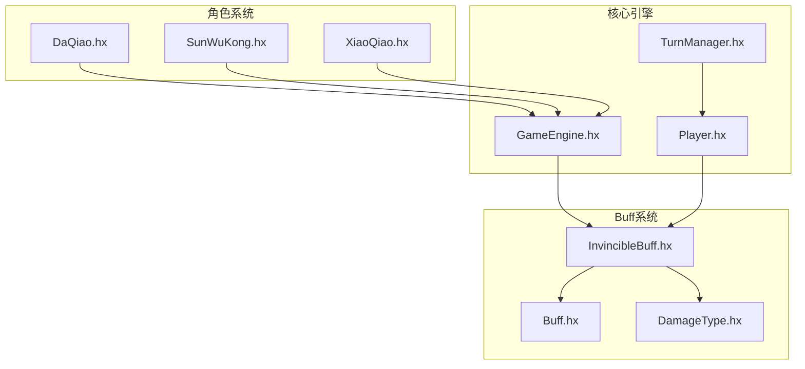
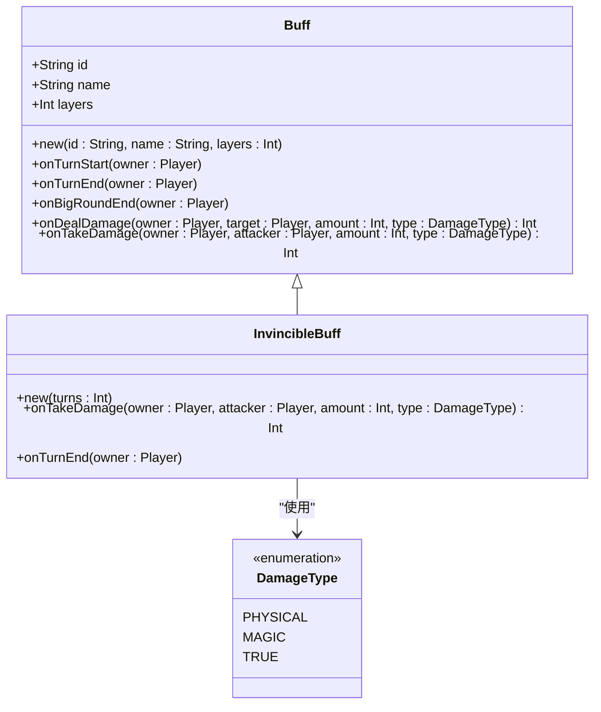
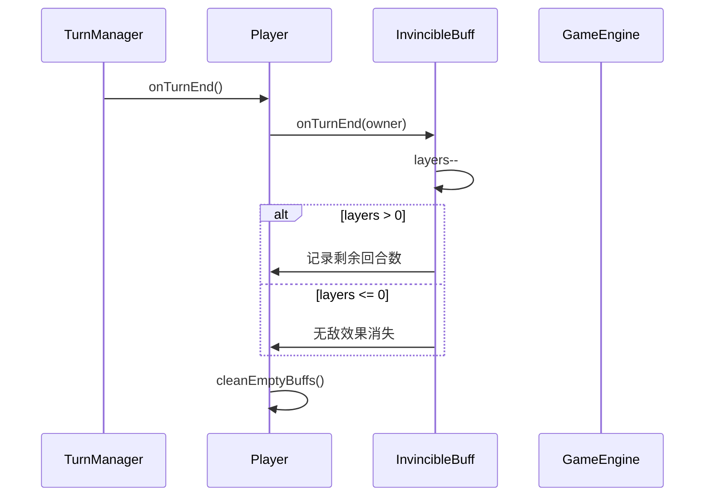
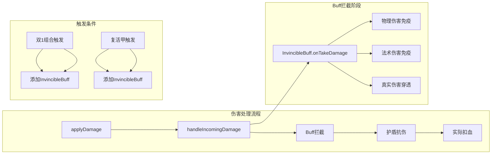
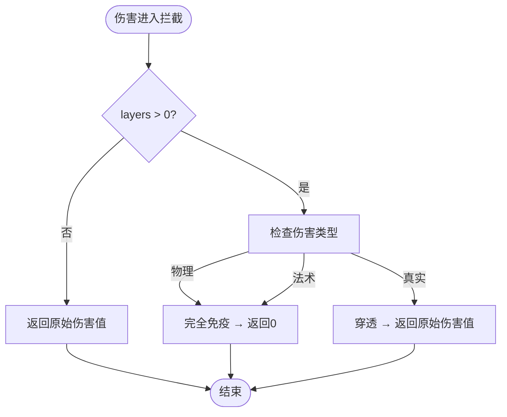
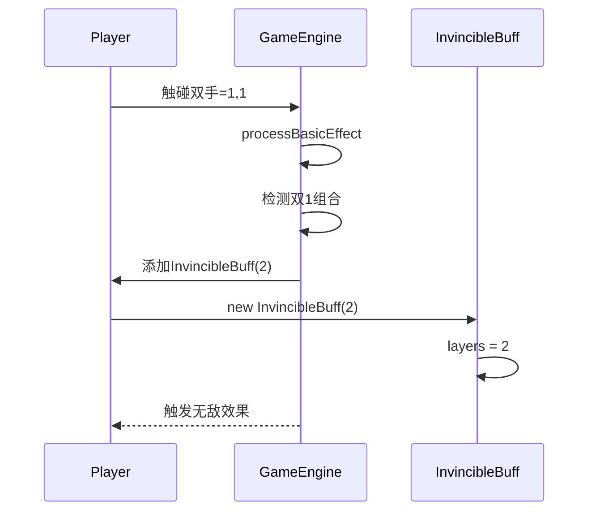
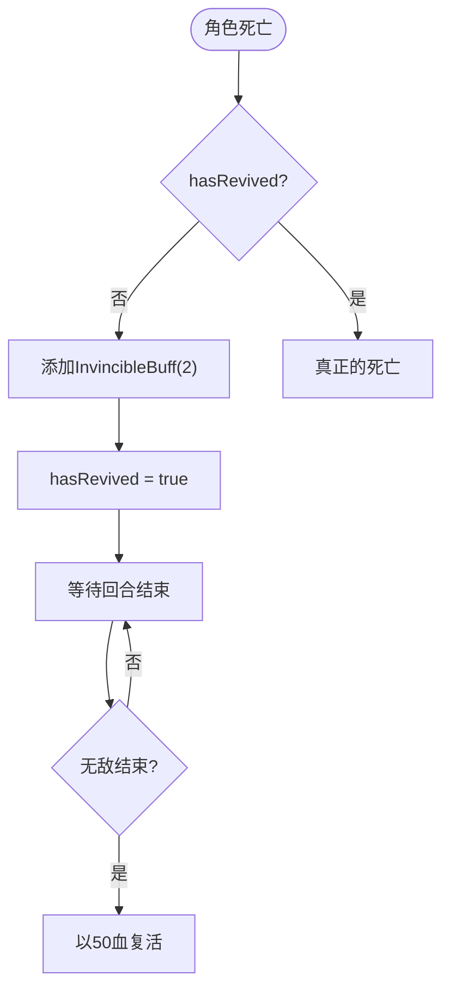
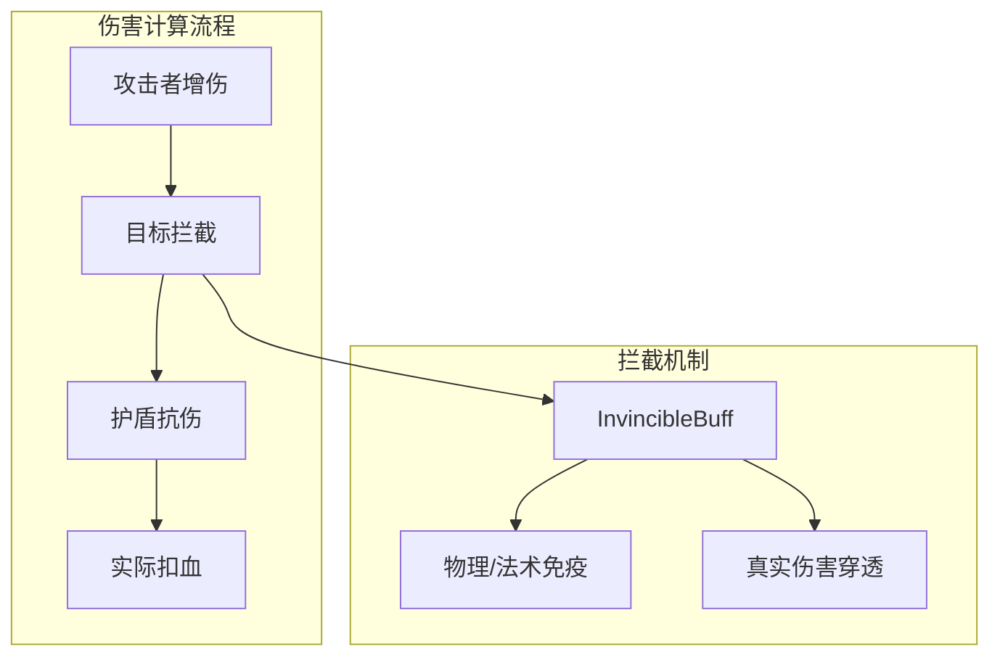
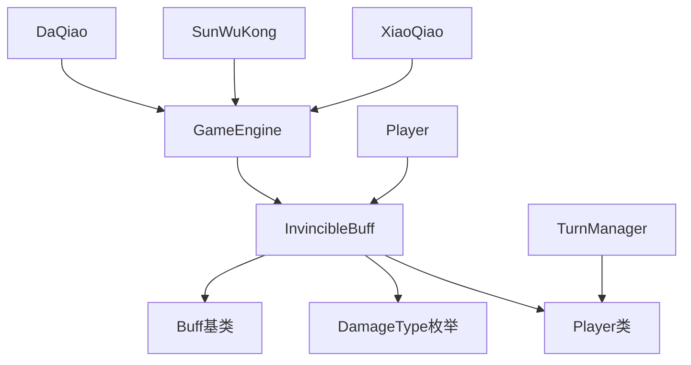

# 无敌Buff

<cite>
**本文档引用的文件**
- [InvincibleBuff.hx](file://buffs/InvincibleBuff.hx)
- [Buff.hx](file://model/Buff.hx)
- [DamageType.hx](file://model/DamageType.hx)
- [Player.hx](file://model/Player.hx)
- [GameEngine.hx](file://GameEngine.hx)
- [TurnManager.hx](file://TurnManager.hx)
- [DaQiao.hx](file://character/DaQiao.hx)
- [SunWuKong.hx](file://character/SunWuKong.hx)
- [XiaoQiao.hx](file://character/XiaoQiao.hx)
</cite>

## 目录
1. [简介](#简介)
2. [项目结构](#项目结构)
3. [核心组件](#核心组件)
4. [架构概览](#架构概览)
5. [详细组件分析](#详细组件分析)
6. [依赖关系分析](#依赖关系分析)
7. [性能考量](#性能考量)
8. [故障排除指南](#故障排除指南)
9. [结论](#结论)
10. [附录](#附录)

## 简介

无敌Buff是一个基于回合制战斗系统的完全防护机制，为角色提供对物理和法术伤害的完全免疫能力，同时保留对真实伤害的穿透特性。该Buff采用layers作为"剩余有效回合数"的实现方式，通过每回合结束时的自动减层机制来管理持续时间。

无敌Buff的核心设计理念是在保证游戏平衡性的前提下，为角色提供关键时刻的生存保障。其设计充分考虑了与其他Buff效果的兼容性和相互作用，确保在复杂的战斗环境中能够稳定运行。

## 项目结构

该项目采用模块化的架构设计，主要分为以下几个核心层次：

**图表来源**
- [InvincibleBuff.hx:1-44](file://buffs/InvincibleBuff.hx#L1-L44)
- [Buff.hx:1-30](file://model/Buff.hx#L1-L30)
- [GameEngine.hx:1-725](file://GameEngine.hx#L1-L725)

**章节来源**
- [InvincibleBuff.hx:1-44](file://buffs/InvincibleBuff.hx#L1-L44)
- [GameEngine.hx:1-725](file://GameEngine.hx#L1-L725)

## 核心组件

### 无敌Buff类结构

无敌Buff继承自基础Buff类，实现了完整的伤害拦截和持续时间管理功能：

**图表来源**
- [InvincibleBuff.hx:11-43](file://buffs/InvincibleBuff.hx#L11-L43)
- [Buff.hx:3-29](file://model/Buff.hx#L3-L29)
- [DamageType.hx:3-7](file://model/DamageType.hx#L3-L7)

### 持续时间管理系统

无敌Buff采用layers作为持续时间的量化表示，每回合结束时自动减层：

**图表来源**
- [TurnManager.hx:124-132](file://TurnManager.hx#L124-L132)
- [Player.hx:229-235](file://model/Player.hx#L229-L235)
- [InvincibleBuff.hx:33-42](file://buffs/InvincibleBuff.hx#L33-L42)

**章节来源**
- [InvincibleBuff.hx:11-43](file://buffs/InvincibleBuff.hx#L11-L43)
- [Player.hx:229-235](file://model/Player.hx#L229-L235)

## 架构概览

无敌Buff在整个游戏系统中的位置和作用：

**图表来源**
- [GameEngine.hx:137-233](file://GameEngine.hx#L137-L233)
- [Player.hx:262-325](file://model/Player.hx#L262-L325)
- [GameEngine.hx:542-543](file://GameEngine.hx#L542-L543)
- [DaQiao.hx:119-122](file://character/DaQiao.hx#L119-L122)

## 详细组件分析

### 无敌Buff实现原理

#### 完全防护机制

无敌Buff通过重写`onTakeDamage`方法实现对特定伤害类型的完全免疫：

**图表来源**
- [InvincibleBuff.hx:19-28](file://buffs/InvincibleBuff.hx#L19-L28)

#### 持续时间管理

无敌Buff的持续时间管理遵循严格的回合制逻辑：

| 触发条件 | 持续回合数 | 触发方式 |
|---------|-----------|---------|
| 双1组合触发 | 2回合 | GameEngine.processBasicEffect |
| 复活甲触发 | 2回合 | DaQiao.tryRevive |

**章节来源**
- [InvincibleBuff.hx:12-14](file://buffs/InvincibleBuff.hx#L12-L14)
- [GameEngine.hx:542-543](file://GameEngine.hx#L542-L543)
- [DaQiao.hx:119-122](file://character/DaQiao.hx#L119-L122)

### 触发条件分析

#### 双1组合触发

当玩家双手都为1时，触碰后会触发无敌Buff：

**图表来源**
- [GameEngine.hx:542-543](file://GameEngine.hx#L542-L543)

#### 复活甲触发

大乔的复活甲机制提供了另一种无敌Buff的触发途径：

**图表来源**
- [DaQiao.hx:112-135](file://character/DaQiao.hx#L112-L135)

**章节来源**
- [GameEngine.hx:542-543](file://GameEngine.hx#L542-L543)
- [DaQiao.hx:112-135](file://character/DaQiao.hx#L112-L135)

### 与其他Buff效果的兼容性

#### 与攻击者Buff的交互

无敌Buff不会影响攻击者的增伤效果，因为拦截发生在伤害计算的早期阶段：

**图表来源**
- [Player.hx:262-325](file://model/Player.hx#L262-L325)
- [GameEngine.hx:166-180](file://GameEngine.hx#L166-L180)

#### 与真实伤害的处理

真实伤害是唯一能够穿透无敌Buff的伤害类型，这一设计确保了游戏的平衡性：

| 伤害类型 | 无敌Buff响应 | 护盾抗伤 | 实际效果 |
|---------|-------------|---------|---------|
| 物理 | 完全免疫 | 无效 | 0伤害 |
| 法术 | 完全免疫 | 无效 | 0伤害 |
| 真实 | 穿透 | 无效 | 穿透真实伤害 |

**章节来源**
- [InvincibleBuff.hx:19-28](file://buffs/InvincibleBuff.hx#L19-L28)
- [Player.hx:278-288](file://model/Player.hx#L278-L288)

## 依赖关系分析

### 核心依赖关系

**图表来源**
- [InvincibleBuff.hx:2-4](file://buffs/InvincibleBuff.hx#L2-L4)
- [GameEngine.hx:9-14](file://GameEngine.hx#L9-L14)
- [TurnManager.hx:3-4](file://TurnManager.hx#L3-L4)

### 角色集成分析

不同角色对无敌Buff的不同使用场景：

| 角色 | 触发条件 | 使用策略 | 平衡性影响 |
|------|---------|---------|-----------|
| 大乔 | 复活甲 | 保命优先 | 高风险高回报 |
| 孙悟空 | [0,2]大招 | 进攻反击 | 增强生存能力 |
| 小乔 | 无直接触发 | 通过其他机制 | 间接增强 |
| 张飞 | 无直接触发 | 专注其他技能 | 互补性强 |

**章节来源**
- [DaQiao.hx:112-135](file://character/DaQiao.hx#L112-L135)
- [SunWuKong.hx:136-166](file://character/SunWuKong.hx#L136-L166)
- [XiaoQiao.hx:1-96](file://character/XiaoQiao.hx#L1-L96)

## 性能考量

### 时间复杂度分析

无敌Buff的性能特征：

- **伤害拦截**: O(n) - n为当前Buff数量，遍历所有Buff进行拦截检查
- **持续时间管理**: O(1) - 单纯的layers减层操作
- **内存占用**: O(1) - 固定大小的数据结构

### 优化建议

1. **Buff排序优化**: 按优先级排序Buff，先处理高优先级的拦截效果
2. **缓存机制**: 缓存伤害类型判断结果，避免重复计算
3. **批量处理**: 在回合结束时批量处理所有Buff的减层操作

## 故障排除指南

### 常见问题诊断

#### 无敌Buff不生效

**可能原因**:
1. Buff层数据异常（layers ≤ 0）
2. 伤害类型判断错误
3. Buff被意外移除

**解决方案**:
1. 检查Buff的layers值
2. 验证DamageType枚举的正确性
3. 确认Buff未被其他机制移除

#### 持续时间异常

**可能原因**:
1. 回合结束处理顺序错误
2. Buff清理逻辑异常
3. 多个Buff叠加导致层数据混乱

**解决方案**:
1. 检查TurnManager的回合结束处理流程
2. 验证cleanEmptyBuffs()方法的正确性
3. 审核Buff叠加逻辑

**章节来源**
- [Player.hx:361-367](file://model/Player.hx#L361-L367)
- [TurnManager.hx:124-132](file://TurnManager.hx#L124-L132)

## 结论

无敌Buff作为一个精心设计的防护机制，在保证游戏平衡性的同时提供了重要的战术价值。其基于layers的持续时间管理机制简洁高效，与其他Buff系统的兼容性良好。

该Buff的设计体现了以下核心原则：
1. **明确的边界**: 清晰区分物理、法术和真实伤害的处理方式
2. **回合制一致性**: 严格遵循回合结束的减层机制
3. **平衡性考虑**: 通过真实伤害穿透维持游戏平衡
4. **系统集成**: 与角色技能和游戏机制深度整合

无敌Buff的成功实施为游戏提供了重要的生存保障机制，同时也为其他类似效果的设计提供了有价值的参考。

## 附录

### 配置参数说明

| 参数名称 | 类型 | 默认值 | 描述 |
|---------|------|--------|------|
| turns | Int | 2 | 初始持续回合数 |
| id | String | "INVINCIBLE" | Buff唯一标识符 |
| name | String | "无敌" | Buff显示名称 |

### 触发条件清单

1. **双1组合触发**: 双手都为1时自动触发
2. **复活甲触发**: 大乔死亡时触发（仅限一次）

### 兼容性矩阵

| Buff类型 | 无敌Buff响应 | 说明 |
|---------|-------------|------|
| 物理增伤 | 无影响 | 无敌不影响攻击者增伤 |
| 法术增伤 | 无影响 | 无敌不影响攻击者增伤 |
| 反弹Buff | 无影响 | 无敌不影响反弹机制 |
| 护盾 | 正常抗伤 | 无敌不影响护盾效果 |
| 中毒 | 正常扣血 | 无敌不影响中毒效果 |