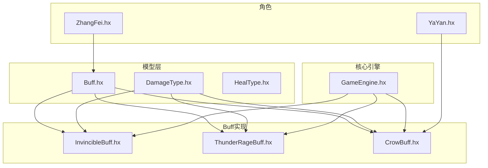
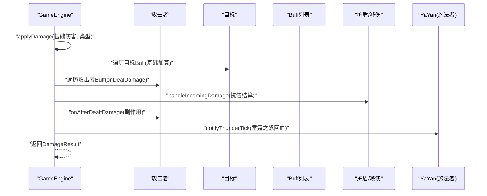
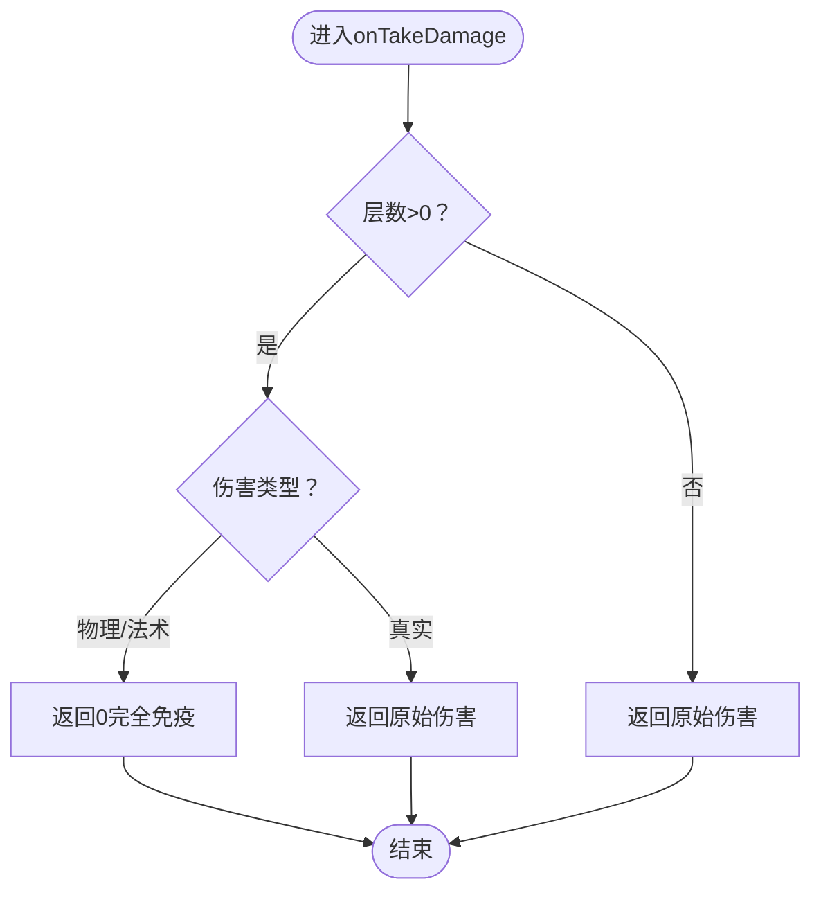
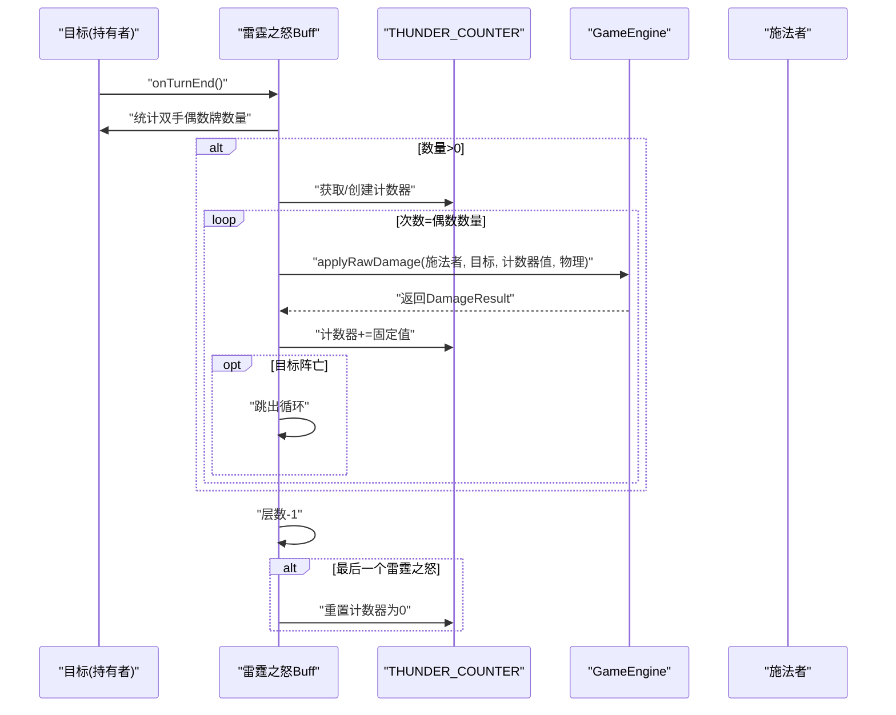
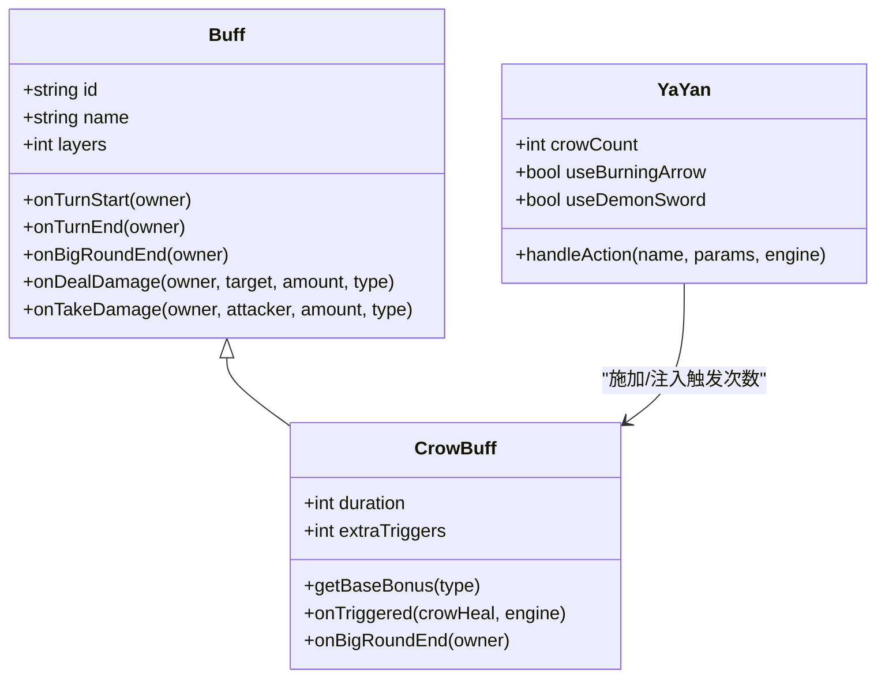
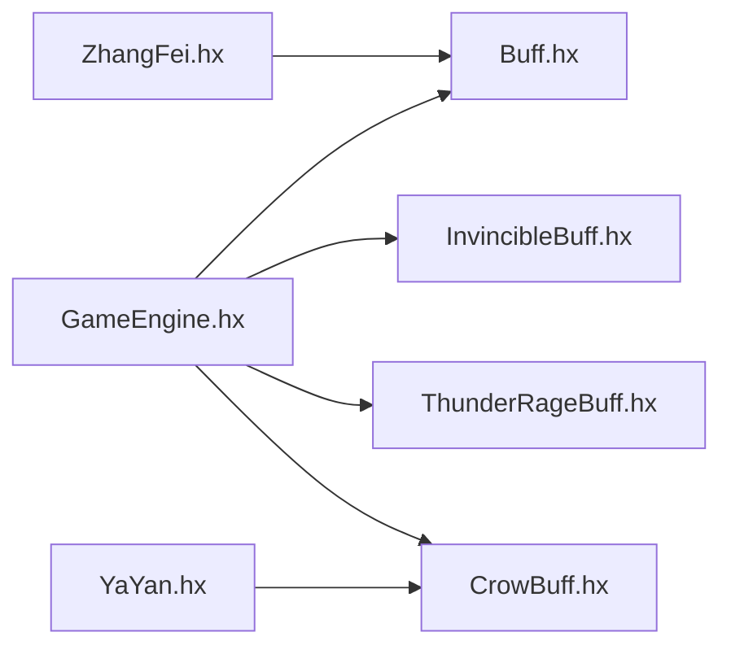

# 特殊效果Buff

<cite>
**本文档引用的文件**
- [InvincibleBuff.hx](file://buffs/InvincibleBuff.hx)
- [ThunderRageBuff.hx](file://buffs/ThunderRageBuff.hx)
- [CrowBuff.hx](file://buffs/CrowBuff.hx)
- [Buff.hx](file://model/Buff.hx)
- [DamageType.hx](file://model/DamageType.hx)
- [HealType.hx](file://model/HealType.hx)
- [GameEngine.hx](file://GameEngine.hx)
- [YaYan.hx](file://character/YaYan.hx)
- [ZhangFei.hx](file://character/ZhangFei.hx)
</cite>

## 目录
1. [简介](#简介)
2. [项目结构](#项目结构)
3. [核心组件](#核心组件)
4. [架构总览](#架构总览)
5. [详细组件分析](#详细组件分析)
6. [依赖关系分析](#依赖关系分析)
7. [性能考量](#性能考量)
8. [故障排除指南](#故障排除指南)
9. [结论](#结论)
10. [附录](#附录)

## 简介
本技术文档聚焦于游戏中的三种特殊效果Buff：无敌Buff（InvincibleBuff）、雷霆之怒Buff（ThunderRageBuff）与乌鸦Buff（CrowBuff）。文档深入解释每种Buff的完全防护机制、攻击增强效果与特殊能力系统，涵盖触发条件、与其他效果的兼容性、配置参数、平衡性考虑及与其他系统的交互影响，并提供实际应用场景与最佳实践指南。

## 项目结构
本项目采用模块化设计，Buff系统位于`buffs/`目录，通用模型定义在`model/`目录，核心战斗引擎在`GameEngine.hx`中实现，角色特化逻辑在`character/`目录中。Buff继承自通用的`Buff`基类，通过钩子函数参与伤害计算、回合管理与事件通知。

图表来源
- [Buff.hx:1-30](file://model/Buff.hx#L1-L30)
- [InvincibleBuff.hx:1-44](file://buffs/InvincibleBuff.hx#L1-L44)
- [ThunderRageBuff.hx:1-104](file://buffs/ThunderRageBuff.hx#L1-L104)
- [CrowBuff.hx:1-64](file://buffs/CrowBuff.hx#L1-L64)
- [GameEngine.hx:1-725](file://GameEngine.hx#L1-L725)
- [YaYan.hx:1-174](file://character/YaYan.hx#L1-L174)
- [ZhangFei.hx:1-273](file://character/ZhangFei.hx#L1-L273)

章节来源
- [GameEngine.hx:1-725](file://GameEngine.hx#L1-L725)
- [Buff.hx:1-30](file://model/Buff.hx#L1-L30)

## 核心组件
- 通用Buff基类：提供标准钩子（回合开始/结束、造成/承受伤害前、伤害计算等），作为所有Buff的抽象接口。
- 无敌Buff：提供对物理与法术伤害的完全免疫，真实伤害可穿透；以层数表示剩余有效回合。
- 雷霆之怒Buff：在持有者回合结束时，依据双手偶数牌数量触发雷霆伤害，伤害值由共享计数器驱动，施法者获得等量补给；多实例共享计数器并在最后移除时重置。
- 乌鸦Buff：在目标受到攻击时，按伤害类型在乘算前加算基础伤害，触发次数受外部技能影响；每次触发后回调施法者进行回血与计数。

章节来源
- [Buff.hx:1-30](file://model/Buff.hx#L1-L30)
- [InvincibleBuff.hx:1-44](file://buffs/InvincibleBuff.hx#L1-L44)
- [ThunderRageBuff.hx:1-104](file://buffs/ThunderRageBuff.hx#L1-L104)
- [CrowBuff.hx:1-64](file://buffs/CrowBuff.hx#L1-L64)

## 架构总览
Buff系统通过GameEngine统一调度，围绕伤害与回血两大流程展开。伤害流程中，Buff钩子在多个阶段参与：基础加算（如乌鸦）、角色乘算前的增减（如双4翻倍）、最终抗伤阶段（护盾、减伤、反弹等）。回血流程同样支持Buff钩子与事件广播。

图表来源
- [GameEngine.hx:137-233](file://GameEngine.hx#L137-L233)
- [GameEngine.hx:239-290](file://GameEngine.hx#L239-L290)

## 详细组件分析

### 无敌Buff（InvincibleBuff）
- 触发条件：当持有者处于无敌状态且受到伤害时生效。
- 免疫范围：物理与法术伤害完全免疫；真实伤害可穿透。
- 持续管理：以层数表示剩余有效回合，回合结束时递减。
- 与其他效果的兼容性：
  - 与真实伤害：真实伤害不受影响，可正常造成伤害。
  - 与护盾/减伤：在伤害拦截后，若仍有剩余伤害，将进入护盾/减伤流程。
  - 与回合结束事件：每回合结束时减少层数，直至清零。

图表来源
- [InvincibleBuff.hx:19-28](file://buffs/InvincibleBuff.hx#L19-L28)
- [InvincibleBuff.hx:33-42](file://buffs/InvincibleBuff.hx#L33-L42)

章节来源
- [InvincibleBuff.hx:1-44](file://buffs/InvincibleBuff.hx#L1-L44)

### 雷霆之怒Buff（ThunderRageBuff）
- 触发时机：持有者回合结束时。
- 触发条件：统计双手偶数牌数量（2、4、6、8），每有一个偶数触发一次雷霆伤害。
- 威力计算：每次伤害值等于共享计数器当前值；伤害后计数器增加固定数值。
- 计数器管理：计数器以隐藏Buff形式存在于目标身上，初始值为固定起步值；所有雷霆之怒Buff移除后重置。
- 施法者回血：施法者获得等量补给（基于实际扣除血量）。
- 与其他效果的兼容性：
  - 使用原始伤害流程，不享受某些增益（如特定物伤翻倍）。
  - 仍遵循护盾、减伤、反弹等通用抗伤机制。
  - 多个雷霆之怒Buff实例共享同一计数器，避免重复叠加。

图表来源
- [ThunderRageBuff.hx:35-102](file://buffs/ThunderRageBuff.hx#L35-L102)
- [GameEngine.hx:239-290](file://GameEngine.hx#L239-L290)

章节来源
- [ThunderRageBuff.hx:1-104](file://buffs/ThunderRageBuff.hx#L1-L104)
- [GameEngine.hx:110-118](file://GameEngine.hx#L110-L118)

### 乌鸦Buff（CrowBuff）
- 特殊能力系统：
  - 基础加算：在攻击者乘算前按伤害类型加算基础伤害。
  - 触发次数：默认1次，可通过外部技能注入额外触发次数。
  - 持续时间：以大回合为单位递减，不叠加。
- 能力类型与使用限制：
  - 类型：基础伤害加算（乘算前）。
  - 使用限制：持续2回合，不叠加；通过角色行为注入额外触发次数。
- 效果范围：仅影响目标受到的攻击，不改变自身伤害输出。
- 与施法者的交互：每次触发后回调施法者进行回血与计数。

图表来源
- [CrowBuff.hx:21-64](file://buffs/CrowBuff.hx#L21-L64)
- [YaYan.hx:25-174](file://character/YaYan.hx#L25-L174)
- [Buff.hx:3-30](file://model/Buff.hx#L3-L30)

章节来源
- [CrowBuff.hx:1-64](file://buffs/CrowBuff.hx#L1-L64)
- [YaYan.hx:104-167](file://character/YaYan.hx#L104-L167)

## 依赖关系分析
- 通用依赖：所有Buff均继承自通用Buff基类，遵循统一的钩子接口。
- GameEngine集成：伤害与回血流程中，Buff钩子在关键节点被调用，形成完整的伤害链。
- 角色特化：YaYan负责施加乌鸦Buff并注入额外触发次数；张飞等角色通过自身逻辑与Buff交互（如怒气、模态切换）。

图表来源
- [GameEngine.hx:1-725](file://GameEngine.hx#L1-L725)
- [Buff.hx:1-30](file://model/Buff.hx#L1-L30)
- [InvincibleBuff.hx:1-44](file://buffs/InvincibleBuff.hx#L1-L44)
- [ThunderRageBuff.hx:1-104](file://buffs/ThunderRageBuff.hx#L1-L104)
- [CrowBuff.hx:1-64](file://buffs/CrowBuff.hx#L1-L64)
- [YaYan.hx:1-174](file://character/YaYan.hx#L1-L174)
- [ZhangFei.hx:1-273](file://character/ZhangFei.hx#L1-L273)

章节来源
- [GameEngine.hx:1-725](file://GameEngine.hx#L1-L725)

## 性能考量
- Buff钩子调用频率：在伤害与回血流程中多次遍历Buff列表，应避免在钩子中执行复杂计算。
- 计数器共享：雷霆之怒计数器共享可减少内存占用，但需注意并发访问与重置逻辑。
- 事件广播：GameEngine对全局事件进行广播，监听器数量过多可能影响帧率，建议按需监听。

## 故障排除指南
- 无敌Buff无效：
  - 检查层数是否为0或负数。
  - 确认伤害类型为物理或法术。
- 雷霆之怒未触发：
  - 确认目标双手是否存在偶数牌（2、4、6、8）。
  - 检查计数器是否被重置（所有雷霆之怒移除后重置）。
- 乌鸦Buff未生效：
  - 确认目标是否拥有乌鸦Buff且未过期。
  - 检查施法者是否正确注入额外触发次数。
- 回血异常：
  - 确认回血类型（RECOVERY/SUPPLY）与解毒逻辑。
  - 检查是否有溢出累计导致延迟生效。

章节来源
- [InvincibleBuff.hx:19-42](file://buffs/InvincibleBuff.hx#L19-L42)
- [ThunderRageBuff.hx:35-102](file://buffs/ThunderRageBuff.hx#L35-L102)
- [CrowBuff.hx:34-62](file://buffs/CrowBuff.hx#L34-L62)
- [GameEngine.hx:364-409](file://GameEngine.hx#L364-L409)

## 结论
本系统通过通用的Buff基类与GameEngine的钩子机制，实现了灵活而强大的特殊效果Buff体系。无敌Buff提供稳定的完全防护，雷霆之怒Buff构建了基于手牌的动态伤害链，乌鸦Buff则通过基础加算与触发次数注入，形成了独特的“乘算后回血”闭环。合理配置参数与平衡性考量，可确保这些效果在策略深度与可玩性之间取得良好平衡。

## 附录

### Buff配置参数与平衡性考虑
- 无敌Buff
  - 持续回合：通过构造函数参数控制，默认回合数。
  - 平衡性：对物理与法术伤害的完全免疫可能改变战斗节奏，需结合角色定位与阵容搭配。
- 雷霆之怒Buff
  - 持续回合：默认3回合。
  - 计数器起步值与增长幅度：影响后期爆发强度与持续性。
  - 施法者回血：需与施法者生存能力匹配，避免过度依赖。
- 乌鸦Buff
  - 基础加算：按伤害类型区分（物理/真实较高，法术/毒较低）。
  - 触发次数：默认1次，外部技能可叠加，需控制上限以避免破坏平衡。
  - 持续时间：2回合且不叠加，限制其长期影响。

章节来源
- [InvincibleBuff.hx:12-14](file://buffs/InvincibleBuff.hx#L12-L14)
- [ThunderRageBuff.hx:27-33](file://buffs/ThunderRageBuff.hx#L27-L33)
- [CrowBuff.hx:28-32](file://buffs/CrowBuff.hx#L28-L32)

### 与其他系统的交互影响
- 与伤害计算流程：在乘算前的基础加算与乘算后的回血回调，确保Buff效果在正确阶段生效。
- 与回合管理：部分Buff通过回合结束钩子进行状态更新，需注意与其他回合事件的时序。
- 与角色特化：YaYan的技能可直接施加/强化乌鸦Buff，张飞的模态与怒气系统可间接影响Buff的生存与使用。

章节来源
- [GameEngine.hx:137-233](file://GameEngine.hx#L137-L233)
- [YaYan.hx:104-167](file://character/YaYan.hx#L104-L167)
- [ZhangFei.hx:95-159](file://character/ZhangFei.hx#L95-L159)