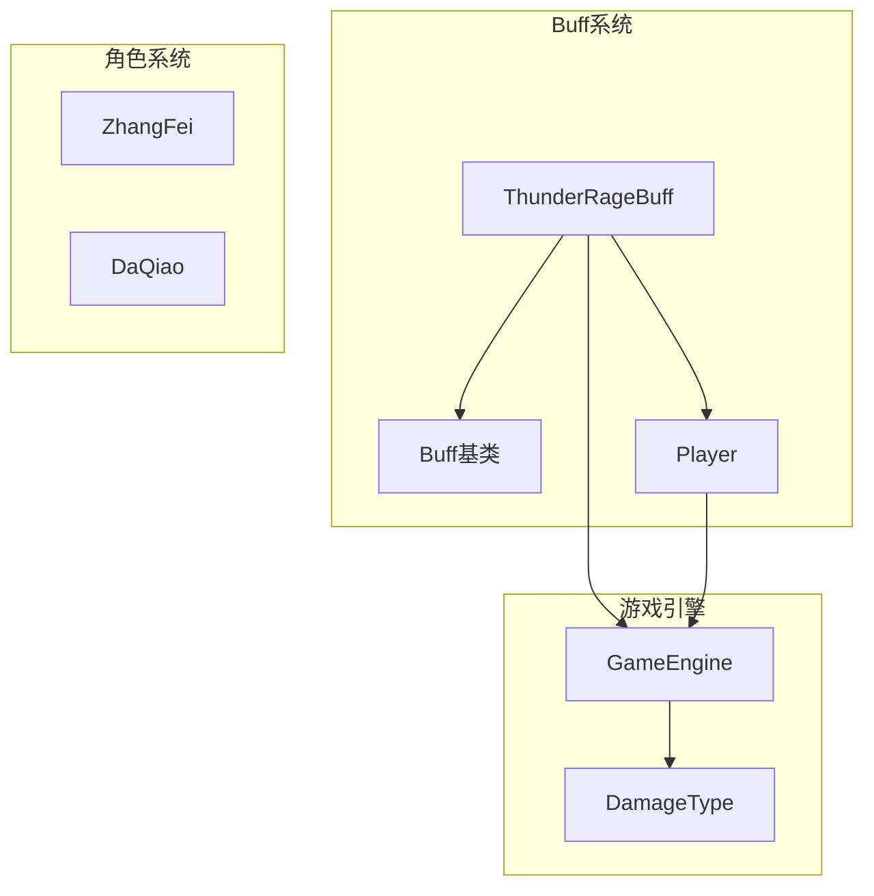
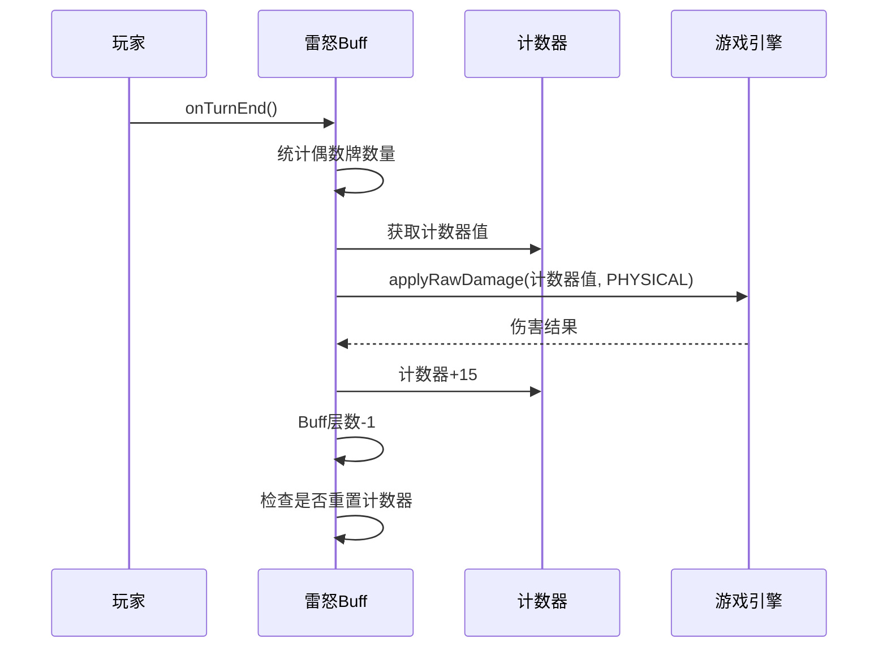
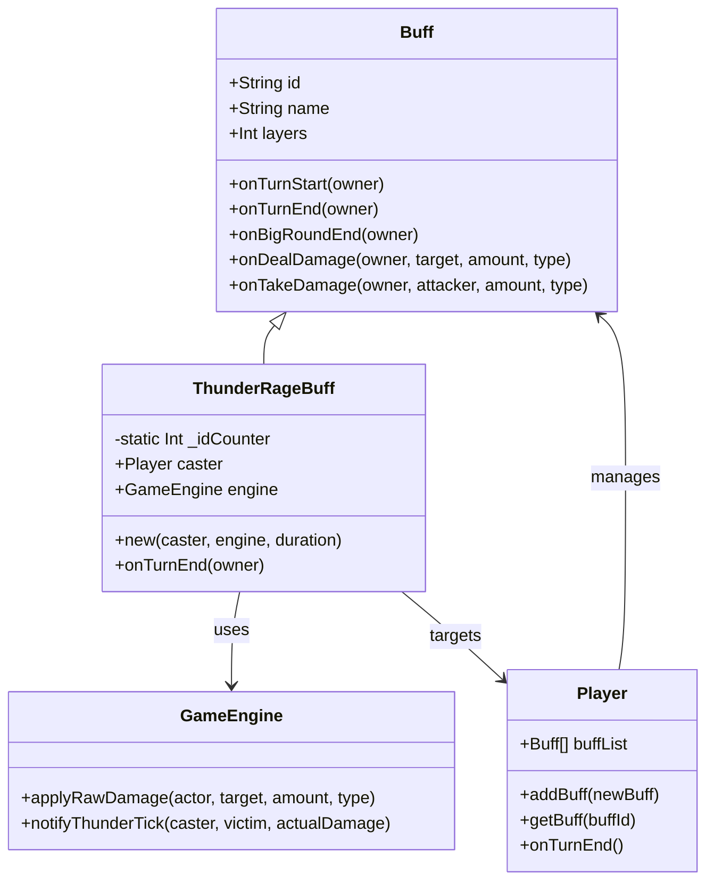
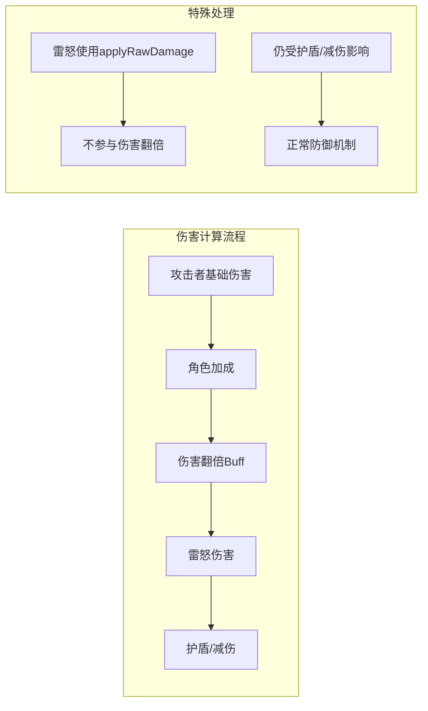
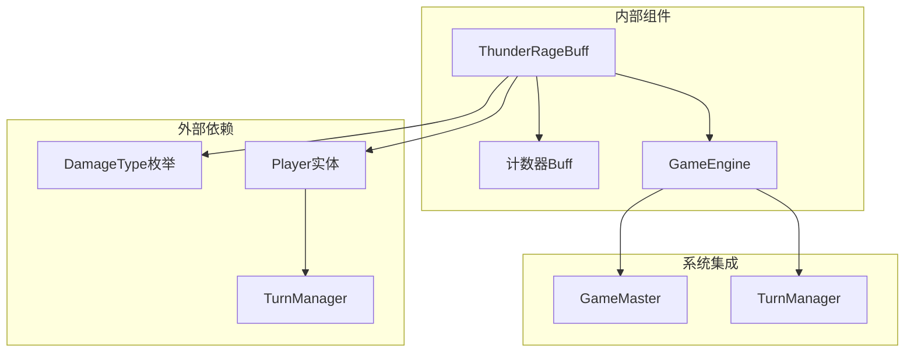

# 雷怒Buff技术文档

<cite>
**本文档引用的文件**
- [ThunderRageBuff.hx](file://buffs/ThunderRageBuff.hx)
- [Buff.hx](file://model/Buff.hx)
- [Player.hx](file://model/Player.hx)
- [GameEngine.hx](file://GameEngine.hx)
- [DamageType.hx](file://model/DamageType.hx)
- [main.js](file://main.js)
- [ZhangFei.hx](file://character/ZhangFei.hx)
- [DaQiao.hx](file://character/DaQiao.hx)
</cite>

## 目录
1. [简介](#简介)
2. [项目结构概览](#项目结构概览)
3. [核心组件分析](#核心组件分析)
4. [架构概览](#架构概览)
5. [详细组件分析](#详细组件分析)
6. [依赖关系分析](#依赖关系分析)
7. [性能考虑](#性能考虑)
8. [故障排除指南](#故障排除指南)
9. [结论](#结论)

## 简介

雷怒Buff是一个独特的战斗增益效果，专为法师设计，能够对敌方单位施加持续性的雷霆伤害。该Buff的核心机制基于"双手偶数牌"触发机制，通过一个共享的计数器系统产生递增的伤害效果。本文档将深入分析雷怒Buff的攻击增强效果机制，包括攻击力提升的计算公式、触发时机和持续时间管理，并详细说明其对角色战斗表现的影响。

## 项目结构概览

雷怒Buff位于游戏的buffs目录中，采用模块化设计，与游戏的核心战斗系统紧密集成：



**图表来源**
- [ThunderRageBuff.hx:1-104](file://buffs/ThunderRageBuff.hx#L1-L104)
- [Buff.hx:1-30](file://model/Buff.hx#L1-L30)
- [GameEngine.hx:1-378](file://GameEngine.hx#L1-L378)

**章节来源**
- [ThunderRageBuff.hx:1-104](file://buffs/ThunderRageBuff.hx#L1-L104)
- [GameEngine.hx:1-378](file://GameEngine.hx#L1-L378)

## 核心组件分析

### 雷怒Buff基础属性

雷怒Buff具有以下核心特性：

- **持续时间**：3回合
- **触发机制**：回合结束时触发
- **触发条件**：统计双手中偶数牌的数量（2、4、6、8）
- **伤害计算**：每次触发造成当前计数器值的物理伤害
- **计数器系统**：共享的隐藏计数器，起步值为40，每次触发增加15

### Buff生命周期管理



**图表来源**
- [ThunderRageBuff.hx:35-102](file://buffs/ThunderRageBuff.hx#L35-L102)
- [GameEngine.hx:236-290](file://GameEngine.hx#L236-L290)

**章节来源**
- [ThunderRageBuff.hx:16-33](file://buffs/ThunderRageBuff.hx#L16-L33)
- [ThunderRageBuff.hx:35-102](file://buffs/ThunderRageBuff.hx#L35-L102)

## 架构概览

雷怒Buff系统采用事件驱动的架构模式，与游戏的完整战斗系统无缝集成：



**图表来源**
- [Buff.hx:3-29](file://model/Buff.hx#L3-L29)
- [ThunderRageBuff.hx:16-33](file://buffs/ThunderRageBuff.hx#L16-L33)
- [GameEngine.hx:112-118](file://GameEngine.hx#L112-L118)

## 详细组件分析

### 雷怒Buff触发机制

#### 触发时机分析

雷怒Buff的触发时机经过精心设计，确保与游戏的回合制战斗系统完美契合：

```mermaid
flowchart TD
Start([回合结束]) --> CheckLayers{Buff层数>0?}
CheckLayers --> |否| End([结束])
CheckLayers --> |是| CountCards[统计双手偶数牌]
CountCards --> HasEven{偶数牌>0?}
HasEven --> |否| DecLayers[层数-1]
HasEven --> |是| GetCounter[获取计数器]
GetCounter --> CreateCounter{计数器存在?}
CreateCounter --> |否| CreateNew[创建新计数器(40)]
CreateCounter --> |是| LoopTriggers[按偶数牌数量循环触发]
CreateNew --> LoopTriggers
LoopTriggers --> ApplyDamage[应用原始伤害]
ApplyDamage --> NotifyHeal[通知回血]
NotifyHeal --> IncreaseCounter[计数器+15]
IncreaseCounter --> CheckDeath{目标死亡?}
CheckDeath --> |是| End
CheckDeath --> |否| NextTrigger[下一次触发]
NextTrigger --> LoopTriggers
DecLayers --> CheckReset{检查重置条件}
CheckReset --> ResetCounter[重置计数器]
CheckReset --> End
ResetCounter --> End
```

**图表来源**
- [ThunderRageBuff.hx:35-102](file://buffs/ThunderRageBuff.hx#L35-L102)

#### 伤害计算公式

雷怒Buff的伤害计算遵循以下公式：

```
每次触发伤害 = 当前计数器层数值
计数器增长 = 每次触发+15
初始计数器 = 40
```

伤害类型为物理伤害，使用原始伤害计算方式，这意味着：

1. **不享受攻击者增益**：雷怒伤害不参与攻击者的伤害翻倍计算
2. **仍受防御系统影响**：伤害仍需经过护盾、减伤等防御机制
3. **独立于常规伤害流程**：使用专门的`applyRawDamage`方法

#### 计数器管理系统

计数器系统是雷怒Buff的核心机制，具有以下特点：

- **共享性**：所有雷怒Buff实例共享同一个计数器
- **重置机制**：当最后一个雷怒Buff消失时重置为40
- **持久性**：即使Buff层数清零，计数器值仍会保留直到重置

**章节来源**
- [ThunderRageBuff.hx:42-76](file://buffs/ThunderRageBuff.hx#L42-L76)
- [ThunderRageBuff.hx:82-101](file://buffs/ThunderRageBuff.hx#L82-L101)

### 与其他增益效果的交互

#### 与伤害翻倍Buff的关系

雷怒Buff与伤害翻倍类Buff存在明确的优先级关系：



**图表来源**
- [ThunderRageBuff.hx:62-64](file://buffs/ThunderRageBuff.hx#L62-L64)
- [GameEngine.hx:160-183](file://GameEngine.hx#L160-L183)

#### 与角色特性的协同

不同角色的特性会影响雷怒Buff的效果：

**张飞（坦克）**：
- 免伤机制可能大幅降低雷怒伤害
- 狂暴状态下可能改变伤害吸收效果

**大乔（辅助）**：
- 抢夺机制不影响雷怒伤害
- 但可能影响伤害分配

**章节来源**
- [ZhangFei.hx:67-90](file://character/ZhangFei.hx#L67-L90)
- [DaQiao.hx:36-68](file://character/DaQiao.hx#L36-L68)

### 配置参数与平衡性考量

#### 核心参数配置

| 参数 | 默认值 | 作用 | 平衡性影响 |
|------|--------|------|------------|
| 持续时间 | 3回合 | 控制总伤害量 | 时间压力与资源管理 |
| 初始计数器 | 40 | 控制首次伤害强度 | 伤害曲线起点 |
| 计数器增长 | +15 | 控制伤害递增速度 | 长期伤害潜力 |
| 触发条件 | 偶数牌数量 | 控制触发频率 | 策略深度 |

#### 平衡性设计原理

1. **渐进式伤害**：通过计数器递增创造持续压力
2. **策略性限制**：需要特定的手牌组合才能触发
3. **资源管理**：3回合的持续时间限制了使用频率
4. **防护机制**：伤害仍受护盾和减伤影响

**章节来源**
- [ThunderRageBuff.hx:8-14](file://buffs/ThunderRageBuff.hx#L8-L14)

## 依赖关系分析

### 核心依赖关系



**图表来源**
- [ThunderRageBuff.hx:3-5](file://buffs/ThunderRageBuff.hx#L3-L5)
- [GameEngine.hx:112-118](file://GameEngine.hx#L112-L118)

### 循环依赖检测

系统设计避免了循环依赖：

- Buff类不依赖具体角色实现
- GameEngine不直接依赖Buff的具体实现
- Player类通过接口模式与Buff系统解耦

**章节来源**
- [Buff.hx:1-30](file://model/Buff.hx#L1-L30)
- [Player.hx:1-200](file://model/Player.hx#L1-L200)

## 性能考虑

### 计算复杂度分析

雷怒Buff的性能特征：

- **时间复杂度**：O(n)，其中n为偶数牌数量
- **空间复杂度**：O(1)，仅使用固定数量的变量
- **触发频率**：每回合一次，开销可控

### 优化策略

1. **早期退出优化**：当没有偶数牌时立即返回
2. **计数器缓存**：避免重复查询Buff状态
3. **批量处理**：按偶数牌数量一次性触发所有伤害

## 故障排除指南

### 常见问题诊断

#### 问题1：计数器未重置
**症状**：多个雷怒Buff同时存在时计数器异常
**解决方案**：检查`hasOtherRage`检测逻辑

#### 问题2：伤害未正确计算
**症状**：雷怒伤害不受护盾影响
**解决方案**：确认使用`applyRawDamage`而非`applyDamage`

#### 问题3：触发频率异常
**症状**：偶数牌数量与触发次数不符
**解决方案**：验证偶数牌统计逻辑

**章节来源**
- [ThunderRageBuff.hx:84-101](file://buffs/ThunderRageBuff.hx#L84-L101)

## 结论

雷怒Buff是一个设计精良的战斗增益效果，通过巧妙的计数器系统和触发机制实现了渐进式的伤害输出。其核心优势在于：

1. **策略深度**：需要特定的手牌组合才能最大化效果
2. **平衡性**：通过持续时间和计数器递增实现合理的伤害曲线
3. **系统集成**：与游戏的整体战斗系统无缝融合
4. **扩展性**：基于Buff基类设计，便于后续功能扩展

该Buff为游戏增加了重要的战术元素，要求玩家在手牌选择和时机把握上做出权衡，从而提升了整体的游戏体验。