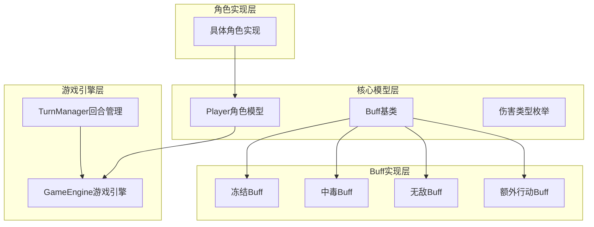
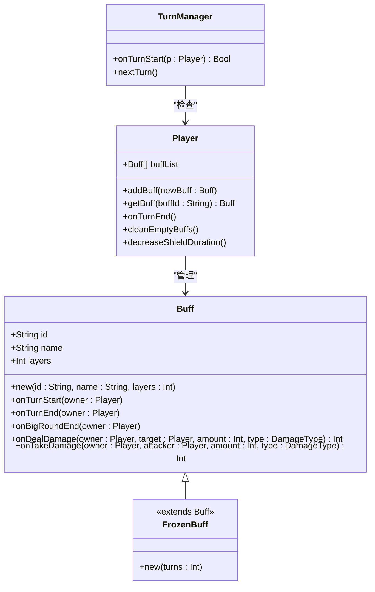
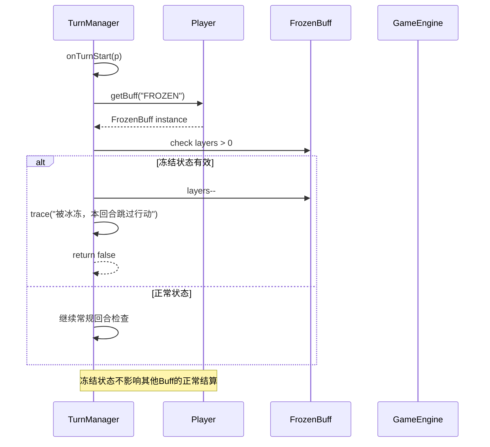
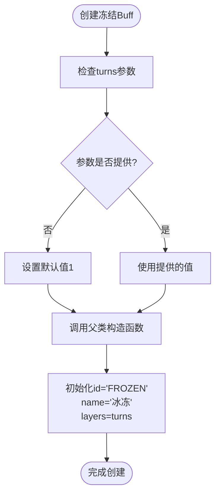
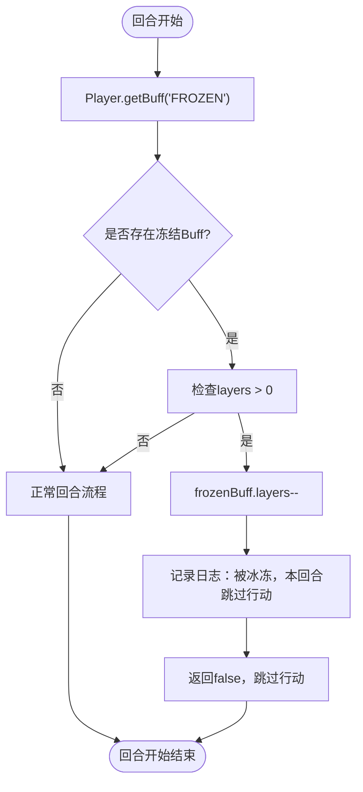
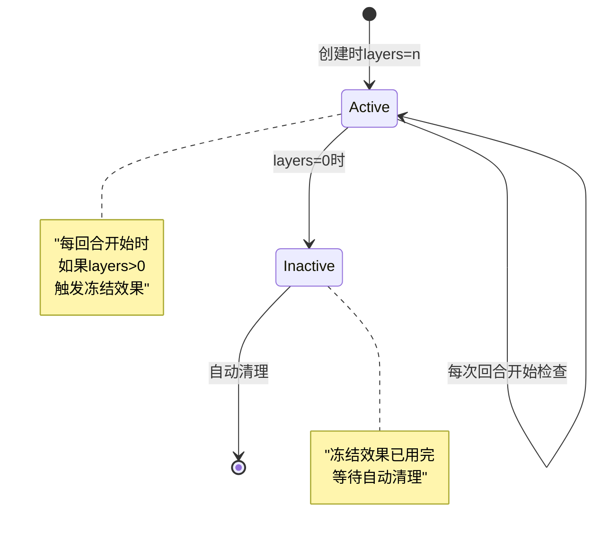
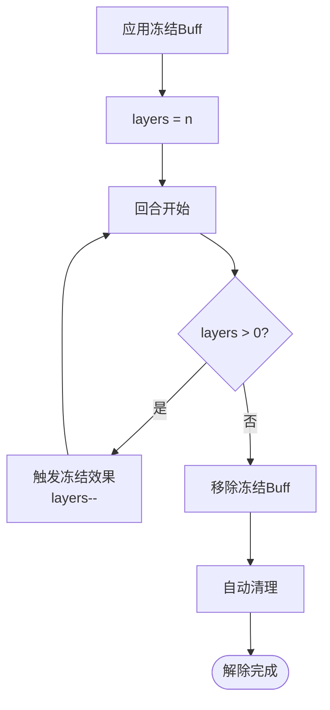
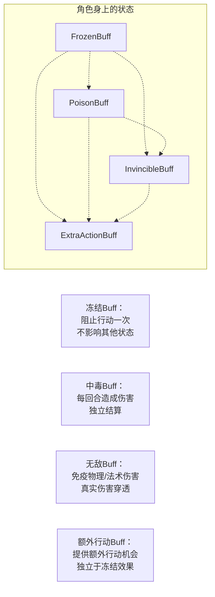

# 冻结Buff技术文档

<cite>
**本文档引用的文件**
- [FrozenBuff.hx](file://buffs/FrozenBuff.hx)
- [Buff.hx](file://model/Buff.hx)
- [Player.hx](file://character/Player.hx)
- [TurnManager.hx](file://TurnManager.hx)
- [GameEngine.hx](file://GameEngine.hx)
- [PoisonBuff.hx](file://buffs/PoisonBuff.hx)
- [InvincibleBuff.hx](file://buffs/InvincibleBuff.hx)
- [ExtraActionBuff.hx](file://buffs/ExtraActionBuff.hx)
</cite>

## 目录
1. [简介](#简介)
2. [项目结构概览](#项目结构概览)
3. [核心组件分析](#核心组件分析)
4. [架构总览](#架构总览)
5. [详细组件分析](#详细组件分析)
6. [依赖关系分析](#依赖关系分析)
7. [性能考虑](#性能考虑)
8. [故障排除指南](#故障排除指南)
9. [结论](#结论)

## 简介

冻结Buff是《指尖相碰》游戏中的一种重要控制类Buff，它能够暂时阻止角色的行动能力。本文档深入分析冻结Buff的实现原理，包括状态判定逻辑、持续时间管理、解除条件，以及其在战斗中的具体表现和与其他Buff的相互作用。

## 项目结构概览

该项目采用模块化架构设计，主要分为以下几个核心模块：

**图表来源**
- [Buff.hx:1-30](file://model/Buff.hx#L1-L30)
- [Player.hx:1-375](file://character/Player.hx#L1-L375)
- [GameEngine.hx:1-725](file://GameEngine.hx#L1-L725)
- [TurnManager.hx:1-232](file://TurnManager.hx#L1-L232)

**章节来源**
- [Buff.hx:1-30](file://model/Buff.hx#L1-L30)
- [Player.hx:1-375](file://character/Player.hx#L1-L375)
- [GameEngine.hx:1-725](file://GameEngine.hx#L1-L725)
- [TurnManager.hx:1-232](file://TurnManager.hx#L1-L232)

## 核心组件分析

### 冻结Buff类结构

冻结Buff继承自基础Buff类，具有简洁而高效的实现：

**图表来源**
- [Buff.hx:3-30](file://model/Buff.hx#L3-L30)
- [FrozenBuff.hx:12-16](file://buffs/FrozenBuff.hx#L12-L16)
- [Player.hx:195-218](file://character/Player.hx#L195-L218)
- [TurnManager.hx:35-102](file://TurnManager.hx#L35-L102)

### 冻结Buff的核心特性

冻结Buff具有以下关键特性：

1. **单次生效机制**：每个冻结Buff实例只能阻止一次行动
2. **自动衰减**：每次触发后层数减少1，归零时自动移除
3. **回合开始检查**：在每个玩家回合开始时进行状态检查
4. **不影响其他状态**：不会影响zeroTurns、中毒、雷霆等其他状态的正常结算

**章节来源**
- [FrozenBuff.hx:7-11](file://buffs/FrozenBuff.hx#L7-L11)
- [TurnManager.hx:36-42](file://TurnManager.hx#L36-L42)

## 架构总览

冻结Buff在整个游戏系统中的工作流程如下：

**图表来源**
- [TurnManager.hx:35-102](file://TurnManager.hx#L35-L102)
- [Player.hx:205-210](file://character/Player.hx#L205-L210)

## 详细组件分析

### 冻结Buff实现细节

#### 构造函数参数分析

冻结Buff的构造函数接受一个参数：
- `turns`: 指定冻结效果的持续回合数，默认为1回合

**图表来源**
- [FrozenBuff.hx:13-15](file://buffs/FrozenBuff.hx#L13-L15)

#### 状态检查方法

冻结Buff继承了基础Buff类的所有生命周期方法，但没有重写任何方法，这意味着：

1. **onTurnStart**: 默认空实现，不进行特殊处理
2. **onTurnEnd**: 默认空实现，不进行特殊处理  
3. **onDealDamage**: 默认返回原始伤害值，不进行加成
4. **onTakeDamage**: 默认返回原始伤害值，不进行减免

这种设计确保了冻结Buff专注于控制效果，而不干扰其他Buff的正常运作。

**章节来源**
- [Buff.hx:14-29](file://model/Buff.hx#L14-L29)
- [FrozenBuff.hx:12-16](file://buffs/FrozenBuff.hx#L12-L16)

### 冻结状态判定逻辑

#### 回合开始检查流程

冻结Buff的状态判定在每个回合开始时进行：

**图表来源**
- [TurnManager.hx:36-42](file://TurnManager.hx#L36-L42)
- [Player.hx:205-210](file://character/Player.hx#L205-L210)

#### 冻结效果的具体表现

当角色被冻结时，会出现以下情况：

1. **行动跳过**：该角色在被冻结的回合内无法进行任何行动
2. **状态正常结算**：zeroTurns、中毒、雷霆等其他状态仍然正常结算
3. **层数自动减少**：冻结效果触发后，层数减少1
4. **效果消失**：当层数降至0时，冻结Buff自动从角色身上移除

**章节来源**
- [FrozenBuff.hx:9-10](file://buffs/FrozenBuff.hx#L9-L10)
- [TurnManager.hx:39-41](file://TurnManager.hx#L39-L41)

### 持续时间管理

#### 层数管理机制

冻结Buff使用层数作为持续时间的表示方式：

**图表来源**
- [TurnManager.hx:38-42](file://TurnManager.hx#L38-L42)
- [Player.hx:338-344](file://character/Player.hx#L338-L344)

#### 自动清理机制

冻结Buff的自动清理通过以下机制实现：

1. **回合结束清理**：在Player.onTurnEnd()中调用cleanEmptyBuffs()
2. **层数检查**：当layers <= 0时，Buff从buffList中移除
3. **内存管理**：自动释放被移除Buff的内存空间

**章节来源**
- [Player.hx:212-218](file://character/Player.hx#L212-L218)
- [Player.hx:338-344](file://character/Player.hx#L338-L344)

### 解除条件分析

冻结Buff的解除条件相对简单明了：

1. **自然衰减**：每回合开始时自动减少1层
2. **手动移除**：通过GameEngine.addBuff()添加相同ID的Buff时，层数会累加
3. **自动清理**：当层数降至0时自动从角色身上移除

**图表来源**
- [TurnManager.hx:38-42](file://TurnManager.hx#L38-L42)
- [Player.hx:212-218](file://character/Player.hx#L212-L218)

## 依赖关系分析

### 冻结Buff与其他Buff的相互作用

#### 与中毒Buff的相互作用

冻结Buff与中毒Buff可以同时存在于同一个角色身上，它们之间互不干扰：

**图表来源**
- [PoisonBuff.hx:11-48](file://buffs/PoisonBuff.hx#L11-L48)
- [InvincibleBuff.hx:19-42](file://buffs/InvincibleBuff.hx#L19-L42)
- [ExtraActionBuff.hx:10-12](file://buffs/ExtraActionBuff.hx#L10-L12)

#### 与额外行动Buff的冲突处理

当角色同时拥有冻结Buff和额外行动Buff时，会出现以下情况：

1. **冻结Buff优先**：即使有额外行动机会，被冻结的角色仍需跳过回合
2. **额外行动Buff独立**：额外行动Buff会在正常回合中发挥作用
3. **顺序无关性**：添加Buff的顺序不影响最终效果

**章节来源**
- [TurnManager.hx:115-122](file://TurnManager.hx#L115-L122)
- [TurnManager.hx:36-42](file://TurnManager.hx#L36-L42)

### 与其他系统的集成

#### 与GameEngine的集成

冻结Buff通过以下方式与GameEngine集成：

1. **状态查询**：GameEngine通过Player.getBuff()获取冻结状态
2. **效果触发**：TurnManager在回合开始时检查并触发冻结效果
3. **日志记录**：冻结效果的触发会被记录到游戏日志中

#### 与TurnManager的协作

冻结Buff与TurnManager的协作体现在：

1. **回合检查**：TurnManager在每个回合开始时调用onTurnStart()
2. **状态管理**：TurnManager负责冻结状态的检查和处理
3. **流程控制**：根据冻结状态决定是否允许角色行动

**章节来源**
- [GameEngine.hx:16-43](file://GameEngine.hx#L16-L43)
- [TurnManager.hx:35-102](file://TurnManager.hx#L35-L102)

## 性能考虑

### 冻结Buff的性能特点

冻结Buff作为一种轻量级控制效果，具有以下性能特点：

1. **内存占用低**：仅存储基本的ID、名称和层数信息
2. **CPU开销小**：每次检查只需要简单的条件判断
3. **内存访问友好**：Buff列表的遍历和查找操作效率高
4. **垃圾回收友好**：自动清理机制确保内存及时释放

### 优化建议

基于冻结Buff的实现特点，以下是性能优化建议：

1. **批量操作优化**：在批量添加多个相同类型的Buff时，利用ID相同的合并机制
2. **延迟初始化**：只有在需要时才创建冻结Buff实例
3. **缓存查询结果**：对于频繁查询的Buff，可以考虑缓存查询结果
4. **避免不必要的检查**：在确定不需要检查时，跳过冻结状态的检查

## 故障排除指南

### 常见问题及解决方案

#### 问题1：冻结效果没有生效

**可能原因**：
1. 角色身上没有正确的冻结Buff实例
2. 冻结Buff的layers已经降为0
3. 角色在回合开始前已经被移除

**解决方法**：
1. 检查Player.buffList中是否存在ID为"FROZEN"的Buff
2. 确认Buff的layers值大于0
3. 验证角色在回合开始时仍然存活

#### 问题2：冻结效果提前消失

**可能原因**：
1. 冻结效果被其他机制意外移除
2. 角色的Buff列表被意外清空
3. 层数管理出现异常

**解决方法**：
1. 检查是否有其他代码调用removeBuff或clearBuff
2. 验证Buff的layers管理逻辑
3. 查看日志中是否有异常的Buff移除记录

#### 问题3：冻结效果持续时间异常

**可能原因**：
1. 层数减少逻辑出现错误
2. 自动清理机制失效
3. 多个冻结Buff实例同时存在

**解决方法**：
1. 检查TurnManager.onTurnStart()中的层数减少逻辑
2. 验证Player.cleanEmptyBuffs()的执行时机
3. 确保同一时刻只有一个冻结Buff实例

**章节来源**
- [TurnManager.hx:35-102](file://TurnManager.hx#L35-L102)
- [Player.hx:338-344](file://character/Player.hx#L338-L344)

## 结论

冻结Buff作为《指尖相碰》游戏中的重要控制机制，通过简洁而高效的设计实现了对角色行动能力的有效限制。其核心优势包括：

1. **设计简洁**：仅17行代码实现完整的冻结效果
2. **性能优异**：低内存占用和CPU开销
3. **易于维护**：继承基础Buff类，遵循统一的生命周期管理
4. **互操作性强**：与其他Buff系统无缝集成

冻结Buff的实现体现了游戏设计中的"简单即美"原则，通过最少的代码实现了最大的游戏价值。其良好的架构设计也为未来的游戏扩展提供了坚实的基础。