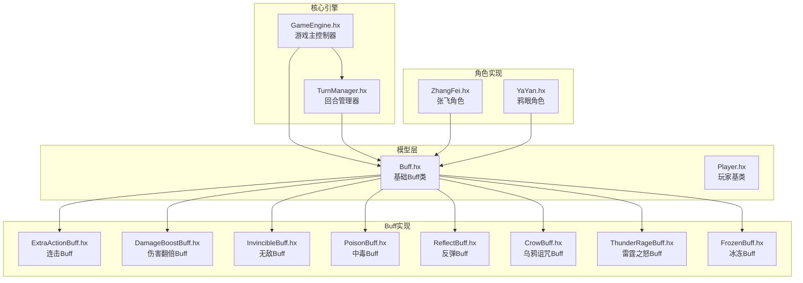
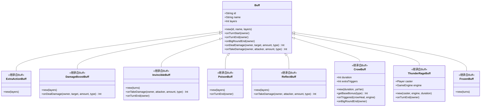
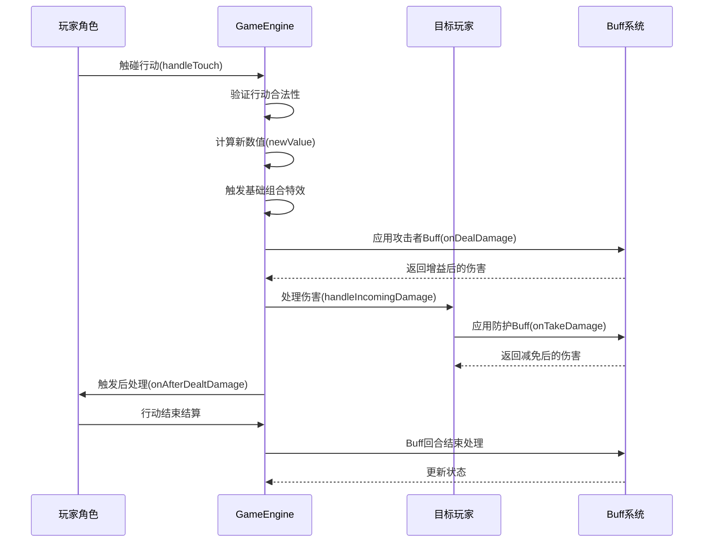
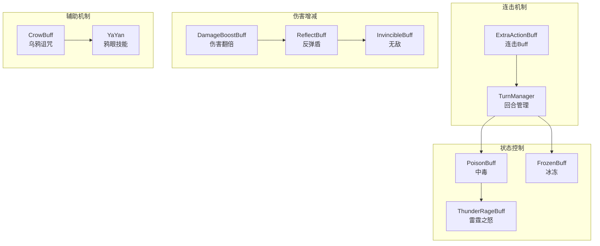
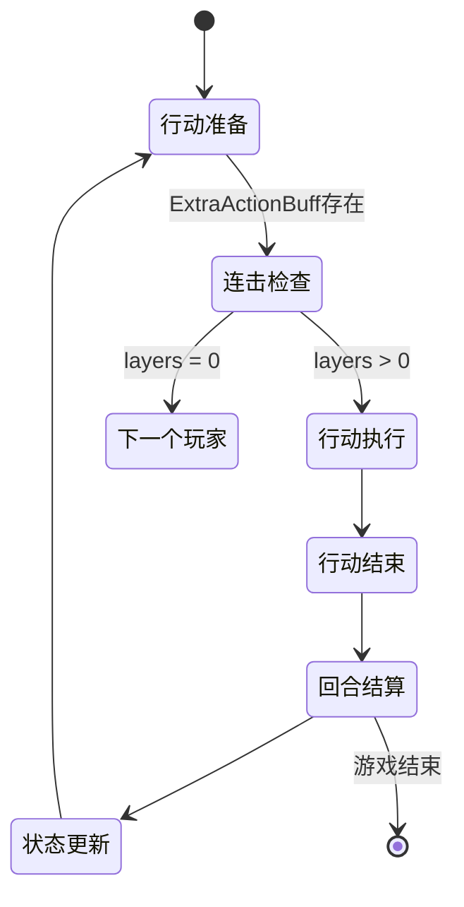
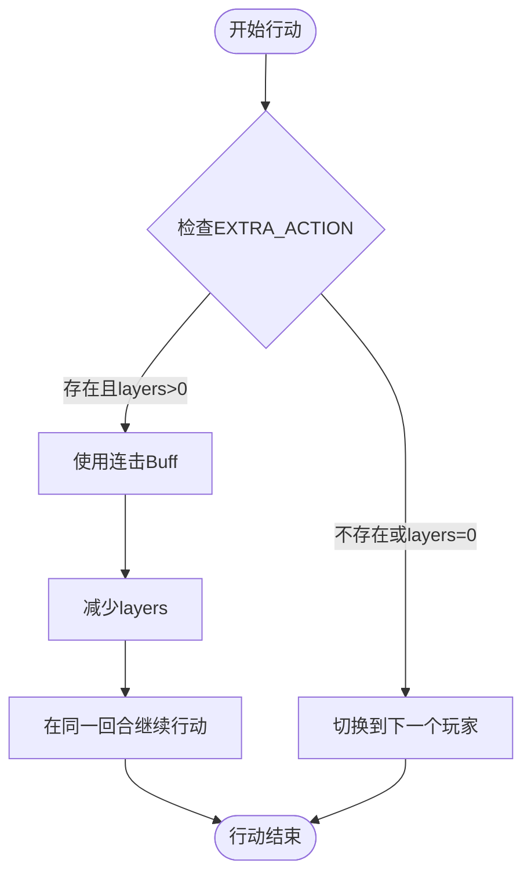
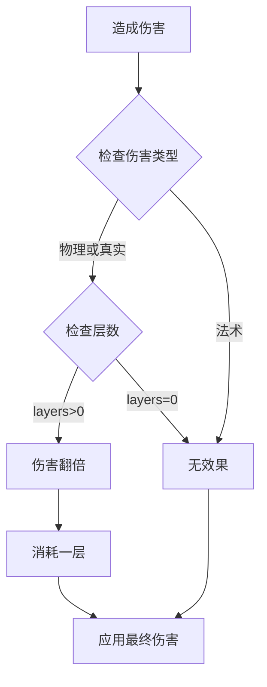
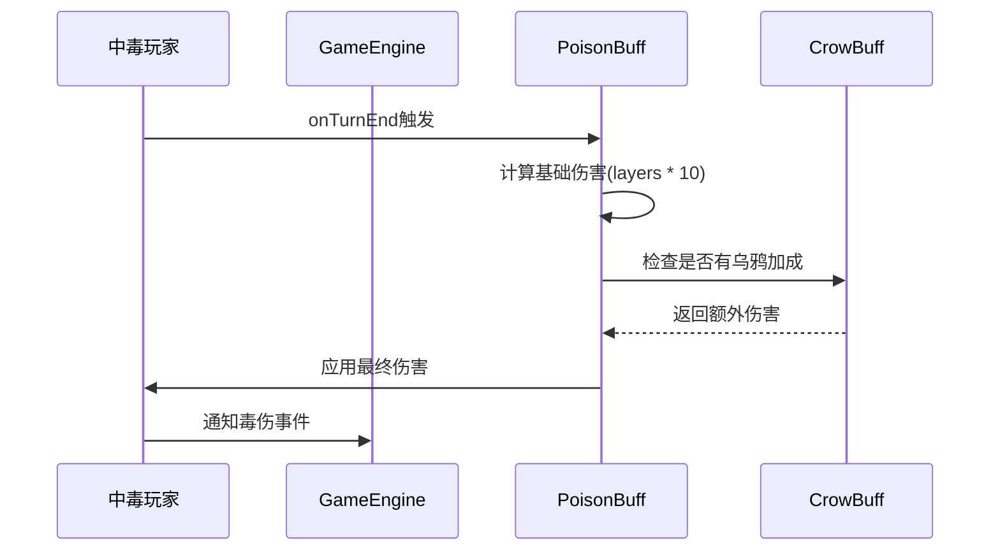
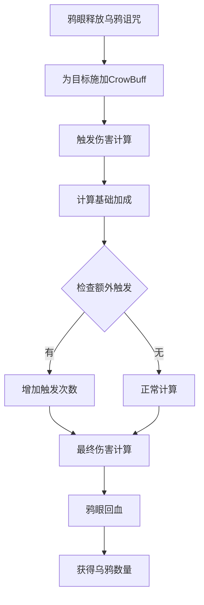
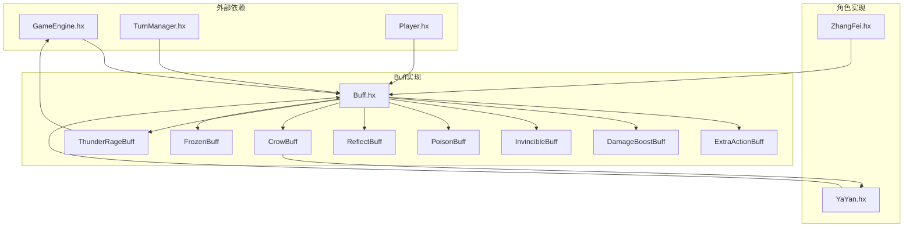

# 行动相关Buff

<cite>
**本文档引用的文件**
- [GameEngine.hx](file://GameEngine.hx)
- [TurnManager.hx](file://TurnManager.hx)
- [Buff.hx](file://model/Buff.hx)
- [ExtraActionBuff.hx](file://buffs/ExtraActionBuff.hx)
- [DamageBoostBuff.hx](file://buffs/DamageBoostBuff.hx)
- [InvincibleBuff.hx](file://buffs/InvincibleBuff.hx)
- [PoisonBuff.hx](file://buffs/PoisonBuff.hx)
- [ReflectBuff.hx](file://buffs/ReflectBuff.hx)
- [CrowBuff.hx](file://buffs/CrowBuff.hx)
- [ThunderRageBuff.hx](file://buffs/ThunderRageBuff.hx)
- [FrozenBuff.hx](file://buffs/FrozenBuff.hx)
- [ZhangFei.hx](file://character/ZhangFei.hx)
- [YaYan.hx](file://character/YaYan.hx)
</cite>

## 目录
1. [简介](#简介)
2. [项目结构](#项目结构)
3. [核心组件](#核心组件)
4. [架构概览](#架构概览)
5. [详细组件分析](#详细组件分析)
6. [依赖关系分析](#依赖关系分析)
7. [性能考虑](#性能考虑)
8. [故障排除指南](#故障排除指南)
9. [结论](#结论)

## 简介

本文档深入分析了游戏中的"行动相关Buff"系统，这是一个围绕角色行动机制设计的复杂Buff体系。该系统不仅包括传统的伤害增减Buff，还涵盖了行动限制、连击机制、状态控制等多种功能性的Buff类型。

系统的核心设计理念是通过Buff系统来增强游戏策略深度，让玩家能够通过不同的Buff组合来实现多样化的战斗策略。从简单的伤害翻倍到复杂的连击机制，从状态控制到环境互动，每个Buff都为游戏体验增添了独特的战术价值。

## 项目结构

该项目采用模块化架构设计，将Buff系统按照功能特性进行了清晰的分类组织：

**图表来源**
- [GameEngine.hx:1-725](file://GameEngine.hx#L1-L725)
- [TurnManager.hx:1-232](file://TurnManager.hx#L1-L232)
- [Buff.hx:1-30](file://model/Buff.hx#L1-L30)

**章节来源**
- [GameEngine.hx:1-725](file://GameEngine.hx#L1-L725)
- [TurnManager.hx:1-232](file://TurnManager.hx#L1-L232)

## 核心组件

### Buff基础架构

Buff系统基于统一的基础类设计，提供了完整的生命周期管理和事件钩子机制：

**图表来源**
- [Buff.hx:1-30](file://model/Buff.hx#L1-L30)
- [ExtraActionBuff.hx:1-12](file://buffs/ExtraActionBuff.hx#L1-L12)
- [DamageBoostBuff.hx:1-20](file://buffs/DamageBoostBuff.hx#L1-L20)
- [InvincibleBuff.hx:1-44](file://buffs/InvincibleBuff.hx#L1-L44)
- [PoisonBuff.hx:1-50](file://buffs/PoisonBuff.hx#L1-L50)
- [ReflectBuff.hx:1-43](file://buffs/ReflectBuff.hx#L1-L43)
- [CrowBuff.hx:1-64](file://buffs/CrowBuff.hx#L1-L64)
- [ThunderRageBuff.hx:1-104](file://buffs/ThunderRageBuff.hx#L1-L104)
- [FrozenBuff.hx:1-17](file://buffs/FrozenBuff.hx#L1-L17)

### 行动机制集成

游戏的核心行动系统通过GameEngine实现了Buff与行动的深度集成：

**图表来源**
- [GameEngine.hx:418-468](file://GameEngine.hx#L418-L468)
- [GameEngine.hx:137-233](file://GameEngine.hx#L137-L233)

**章节来源**
- [GameEngine.hx:137-233](file://GameEngine.hx#L137-L233)
- [GameEngine.hx:418-468](file://GameEngine.hx#L418-L468)

## 架构概览

### 行动Buff生态系统

系统中的行动相关Buff形成了一个完整的生态体系，每个Buff都有其特定的功能定位和交互方式：

**图表来源**
- [ExtraActionBuff.hx:1-12](file://buffs/ExtraActionBuff.hx#L1-L12)
- [TurnManager.hx:110-190](file://TurnManager.hx#L110-L190)
- [DamageBoostBuff.hx:1-20](file://buffs/DamageBoostBuff.hx#L1-L20)
- [ReflectBuff.hx:1-43](file://buffs/ReflectBuff.hx#L1-L43)
- [InvincibleBuff.hx:1-44](file://buffs/InvincibleBuff.hx#L1-L44)
- [PoisonBuff.hx:1-50](file://buffs/PoisonBuff.hx#L1-L50)
- [FrozenBuff.hx:1-17](file://buffs/FrozenBuff.hx#L1-L17)
- [ThunderRageBuff.hx:1-104](file://buffs/ThunderRageBuff.hx#L1-L104)
- [CrowBuff.hx:1-64](file://buffs/CrowBuff.hx#L1-L64)

### 状态流转机制

**图表来源**
- [TurnManager.hx:115-122](file://TurnManager.hx#L115-L122)
- [ExtraActionBuff.hx:1-12](file://buffs/ExtraActionBuff.hx#L1-L12)

**章节来源**
- [TurnManager.hx:110-190](file://TurnManager.hx#L110-L190)

## 详细组件分析

### 连击Buff系统

连击Buff是行动相关Buff的核心组件，它允许玩家在特定条件下获得额外的行动机会。

#### ExtraActionBuff实现分析

**图表来源**
- [ExtraActionBuff.hx:1-12](file://buffs/ExtraActionBuff.hx#L1-L12)
- [TurnManager.hx:115-122](file://TurnManager.hx#L115-L122)

#### 连击机制的工作原理

连击Buff通过TurnManager的nextTurn方法实现，当检测到玩家拥有EXTRA_ACTION类型的Buff且层数大于0时，系统会跳过正常的回合切换逻辑，让同一玩家在同一回合内再次行动。

**章节来源**
- [ExtraActionBuff.hx:1-12](file://buffs/ExtraActionBuff.hx#L1-L12)
- [TurnManager.hx:115-122](file://TurnManager.hx#L115-L122)

### 伤害增减Buff系统

伤害增减Buff系统提供了多种伤害调整机制，从简单的伤害翻倍到复杂的伤害减免。

#### DamageBoostBuff分析

DamageBoostBuff实现了伤害翻倍功能，专门针对物理和真实伤害类型：

**图表来源**
- [DamageBoostBuff.hx:11-19](file://buffs/DamageBoostBuff.hx#L11-L19)

#### InvincibleBuff分析

无敌Buff提供了完全的伤害免疫能力，但对真实伤害有特殊的穿透机制：

**章节来源**
- [DamageBoostBuff.hx:1-20](file://buffs/DamageBoostBuff.hx#L1-L20)
- [InvincibleBuff.hx:1-44](file://buffs/InvincibleBuff.hx#L1-L44)

### 状态控制Buff系统

状态控制Buff系统包含了多种影响玩家行动能力的状态效果。

#### PoisonBuff机制

中毒Buff通过回合结束时的自动伤害结算来影响玩家：

**图表来源**
- [PoisonBuff.hx:11-48](file://buffs/PoisonBuff.hx#L11-L48)

#### FrozenBuff分析

冰冻Buff提供了一种简单直接的行动限制机制：

**章节来源**
- [PoisonBuff.hx:1-50](file://buffs/PoisonBuff.hx#L1-L50)
- [FrozenBuff.hx:1-17](file://buffs/FrozenBuff.hx#L1-L17)

### 辅助机制Buff系统

辅助机制Buff系统为玩家提供了独特的战术优势。

#### CrowBuff与YaYan联动机制

乌鸦诅咒Buff与鸦眼角色形成了完美的技能联动：

**图表来源**
- [CrowBuff.hx:34-55](file://buffs/CrowBuff.hx#L34-L55)
- [YaYan.hx:107-129](file://character/YaYan.hx#L107-L129)

#### ThunderRageBuff分析

雷霆之怒Buff提供了一种独特的伤害输出机制：

**章节来源**
- [CrowBuff.hx:1-64](file://buffs/CrowBuff.hx#L1-L64)
- [YaYan.hx:1-174](file://character/YaYan.hx#L1-L174)
- [ThunderRageBuff.hx:1-104](file://buffs/ThunderRageBuff.hx#L1-L104)

### 角色特定Buff集成

不同角色对Buff系统的集成程度各不相同，体现了各自独特的玩法特色。

#### 张飞的Buff集成

张飞角色展示了如何将Buff系统深度融入角色机制中：

**章节来源**
- [ZhangFei.hx:1-273](file://character/ZhangFei.hx#L1-L273)

## 依赖关系分析

### Buff系统依赖图

**图表来源**
- [GameEngine.hx:1-725](file://GameEngine.hx#L1-L725)
- [TurnManager.hx:1-232](file://TurnManager.hx#L1-L232)
- [Buff.hx:1-30](file://model/Buff.hx#L1-L30)
- [ExtraActionBuff.hx:1-12](file://buffs/ExtraActionBuff.hx#L1-L12)
- [CrowBuff.hx:1-64](file://buffs/CrowBuff.hx#L1-L64)
- [ThunderRageBuff.hx:1-104](file://buffs/ThunderRageBuff.hx#L1-L104)

### 循环依赖检测

系统通过以下机制避免循环依赖问题：

1. **接口分离**：Buff类定义了清晰的接口契约，避免了具体的实现耦合
2. **动态类型**：某些组件使用Dynamic类型来打破编译时依赖
3. **运行时绑定**：通过GameEngine实例来协调不同组件间的交互

**章节来源**
- [CrowBuff.hx:26-32](file://buffs/CrowBuff.hx#L26-L32)
- [ThunderRageBuff.hx:22-25](file://buffs/ThunderRageBuff.hx#L22-L25)

## 性能考虑

### Buff系统优化策略

1. **延迟初始化**：Buff系统采用按需初始化策略，避免不必要的内存占用
2. **批量处理**：GameEngine对Buff的处理采用了批量化操作，减少了重复计算
3. **缓存机制**：系统利用GameEngine实例缓存常用的数据和状态

### 内存管理

- Buff对象的创建和销毁遵循统一的生命周期管理
- 大部分Buff使用整数类型的层数来表示持续时间，避免了复杂的对象管理
- 通过引用传递而非值传递来减少内存复制开销

## 故障排除指南

### 常见问题诊断

#### 连击Buff不生效

**症状**：玩家使用ExtraActionBuff后仍然切换到下一个玩家

**排查步骤**：
1. 检查Buff是否存在且层数大于0
2. 确认TurnManager的nextTurn方法被正确调用
3. 验证EXTRA_ACTION类型的Buff被正确识别

#### 伤害计算异常

**症状**：伤害值与预期不符

**排查步骤**：
1. 检查DamageBoostBuff的层数和类型匹配
2. 确认CrowBuff的基础加成计算正确
3. 验证组合倍率(currentComboMultiplier)的应用时机

#### 状态Buff失效

**症状**：PoisonBuff、FrozenBuff等状态效果不按预期工作

**排查步骤**：
1. 检查Buff的层数和持续时间设置
2. 确认onTurnEnd等生命周期方法被正确调用
3. 验证Buff的移除和添加逻辑

**章节来源**
- [TurnManager.hx:115-122](file://TurnManager.hx#L115-L122)
- [GameEngine.hx:166-180](file://GameEngine.hx#L166-L180)

## 结论

行动相关Buff系统展现了游戏设计中的复杂性和精妙之处。通过精心设计的Buff架构，系统不仅实现了丰富的战术可能性，还保持了良好的可维护性和扩展性。

该系统的主要优势包括：

1. **模块化设计**：每个Buff都是独立的模块，便于单独测试和调试
2. **生命周期完整性**：完整的生命周期钩子确保了Buff行为的一致性
3. **策略深度**：多样化的Buff组合为玩家提供了丰富的战术选择
4. **性能优化**：合理的内存管理和计算优化确保了系统的流畅运行

未来的发展方向可以包括：

- 扩展更多类型的行动相关Buff
- 增强Buff间的协同效应
- 优化用户界面以更好地展示Buff状态
- 添加更多的可视化反馈来提升用户体验