# 额外行动Buff（连击）技术文档

<cite>
**本文档引用的文件**
- [ExtraActionBuff.hx](file://buffs/ExtraActionBuff.hx)
- [Buff.hx](file://model/Buff.hx)
- [TurnManager.hx](file://TurnManager.hx)
- [GameEngine.hx](file://GameEngine.hx)
- [Player.hx](file://character/Player.hx)
- [SunWuKong.hx](file://character/SunWuKong.hx)
</cite>

## 目录
1. [简介](#简介)
2. [项目结构概览](#项目结构概览)
3. [核心组件分析](#核心组件分析)
4. [架构概览](#架构概览)
5. [详细组件分析](#详细组件分析)
6. [依赖关系分析](#依赖关系分析)
7. [性能考虑](#性能考虑)
8. [故障排除指南](#故障排除指南)
9. [结论](#结论)

## 简介

额外行动Buff（连击）是《双八》游戏中一个关键的战斗机制，实现了"每大回合最多触发2次"的限制机制。该Buff允许玩家在同一个回合内获得额外的行动机会，但通过层数管理和大回合计数来控制触发频率，确保游戏平衡性。

本文档深入分析了连击Buff的工作原理、实现细节以及与其他系统组件的交互关系，为开发者和玩家提供全面的技术参考。

## 项目结构概览

该项目采用模块化的Haxe架构设计，主要包含以下核心模块：

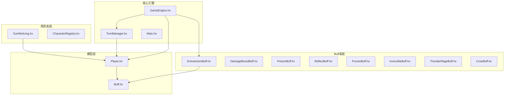

**图表来源**
- [GameEngine.hx:1-725](file://GameEngine.hx#L1-L725)
- [TurnManager.hx:1-232](file://TurnManager.hx#L1-L232)
- [Player.hx:1-375](file://character/Player.hx#L1-L375)

**章节来源**
- [GameEngine.hx:1-725](file://GameEngine.hx#L1-L725)
- [TurnManager.hx:1-232](file://TurnManager.hx#L1-L232)
- [Player.hx:1-375](file://character/Player.hx#L1-L375)

## 核心组件分析

### Buff基类系统

Buff系统采用统一的基类设计，提供了完整的生命周期管理：

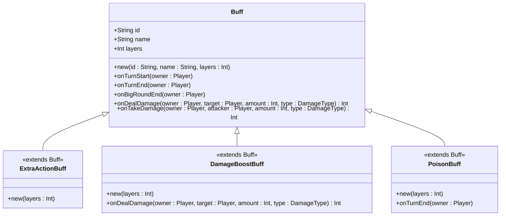

**图表来源**
- [Buff.hx:1-30](file://model/Buff.hx#L1-L30)
- [ExtraActionBuff.hx:1-12](file://buffs/ExtraActionBuff.hx#L1-L12)
- [DamageBoostBuff.hx:1-20](file://buffs/DamageBoostBuff.hx#L1-L20)
- [PoisonBuff.hx:1-50](file://buffs/PoisonBuff.hx#L1-L50)

### 连击Buff实现

ExtraActionBuff继承自Buff基类，实现了最小化的功能实现：

- **ID标识**: "EXTRA_ACTION"
- **名称**: "连击"
- **层数**: 默认1层
- **特殊机制**: 不需要重写生命周期方法

**章节来源**
- [ExtraActionBuff.hx:1-12](file://buffs/ExtraActionBuff.hx#L1-L12)
- [Buff.hx:1-30](file://model/Buff.hx#L1-L30)

## 架构概览

连击Buff在整个游戏系统中的位置和交互关系如下：

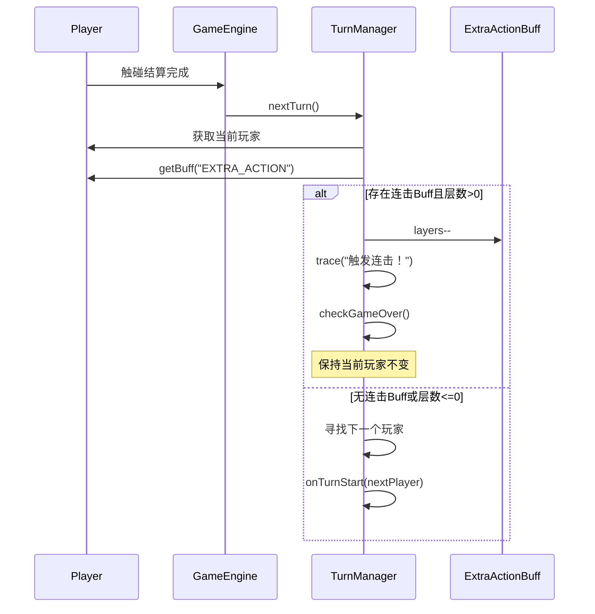

**图表来源**
- [TurnManager.hx:110-190](file://TurnManager.hx#L110-L190)
- [GameEngine.hx:418-468](file://GameEngine.hx#L418-L468)

## 详细组件分析

### 连击Buff工作机制

#### 层数管理机制

连击Buff通过简单的层数系统实现触发控制：

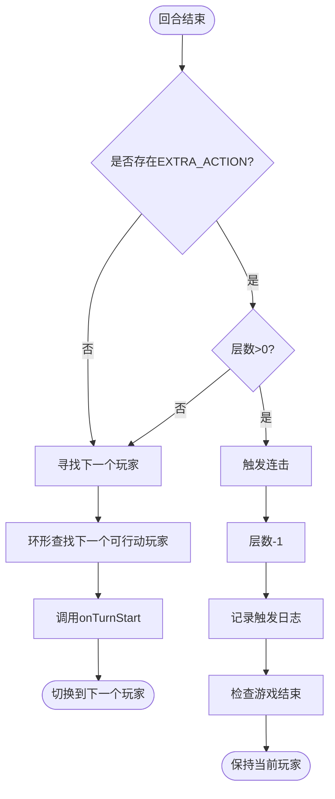

**图表来源**
- [TurnManager.hx:115-122](file://TurnManager.hx#L115-L122)

#### 大回合限制机制

连击Buff的"每大回合最多触发2次"限制通过以下机制实现：

1. **双八组合触发**: 当玩家凑齐双八时，系统会添加1层连击Buff
2. **层数递减**: 每次触发连击时，层数减少1
3. **回合切换**: 当层数降至0时，连击效果消失

**章节来源**
- [GameEngine.hx:506-514](file://GameEngine.hx#L506-L514)
- [TurnManager.hx:115-122](file://TurnManager.hx#L115-L122)

### 触发条件分析

#### 双八组合触发

双八组合（双手均为8）触发连击Buff的具体实现：

```mermaid
sequenceDiagram
participant Actor as 触碰玩家
participant GameEngine as GameEngine
participant Target as 目标玩家
participant Buff as ExtraActionBuff
Actor->>GameEngine : 触碰结算
GameEngine->>GameEngine : 检查双八组合
alt 双八组合成立
GameEngine->>Actor : bigRound88Used++
GameEngine->>Actor : addBuff(new ExtraActionBuff(1))
GameEngine->>Actor : applyShield(60点物法盾)
Note over Actor : 本大回合已触发次数+1
else 非双八组合
GameEngine->>GameEngine : 继续其他组合效果
end
```

**图表来源**
- [GameEngine.hx:506-514](file://GameEngine.hx#L506-L514)

#### 层数管理策略

连击Buff的层数管理遵循以下策略：

1. **初始层数**: 通过双八组合触发时获得1层
2. **触发消耗**: 每次连击触发消耗1层
3. **最大触发次数**: 由于层数限制，最多触发1次连击

**章节来源**
- [GameEngine.hx:506-514](file://GameEngine.hx#L506-L514)
- [TurnManager.hx:115-122](file://TurnManager.hx#L115-L122)

### 与TurnManager的集成

#### 回合切换逻辑

TurnManager在回合切换过程中对连击Buff的处理：

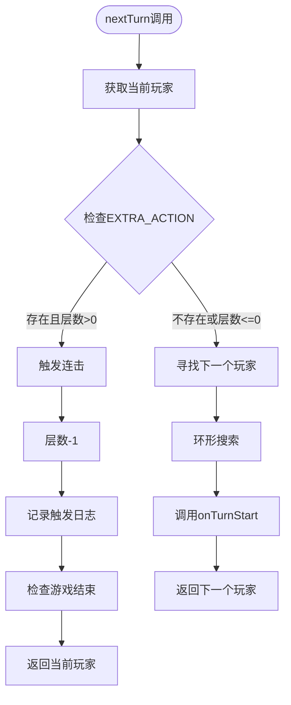

**图表来源**
- [TurnManager.hx:110-190](file://TurnManager.hx#L110-L190)

#### 大回合检测

TurnManager的大回合检测机制与连击Buff的关系：

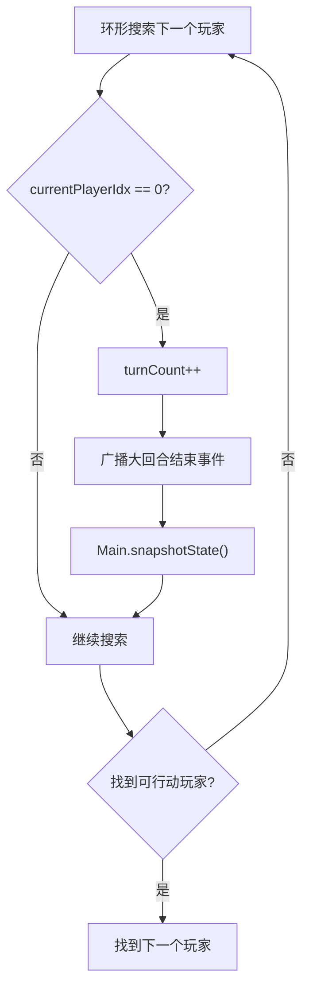

**图表来源**
- [TurnManager.hx:139-152](file://TurnManager.hx#L139-L152)

### 生命周期管理

#### Buff创建和添加

Player类的addBuff方法实现了Buff的统一管理：

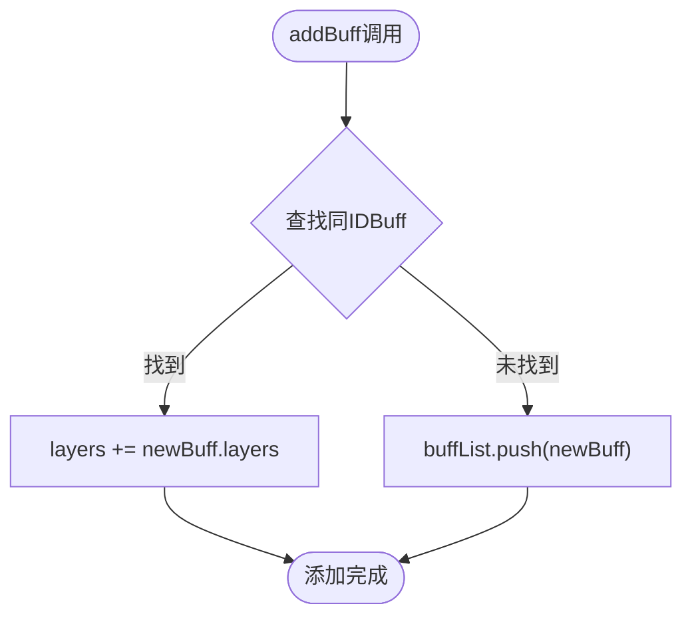

**图表来源**
- [Player.hx:195-203](file://character/Player.hx#L195-L203)

#### Buff清理机制

Player类的cleanEmptyBuffs方法负责自动清理无效Buff：

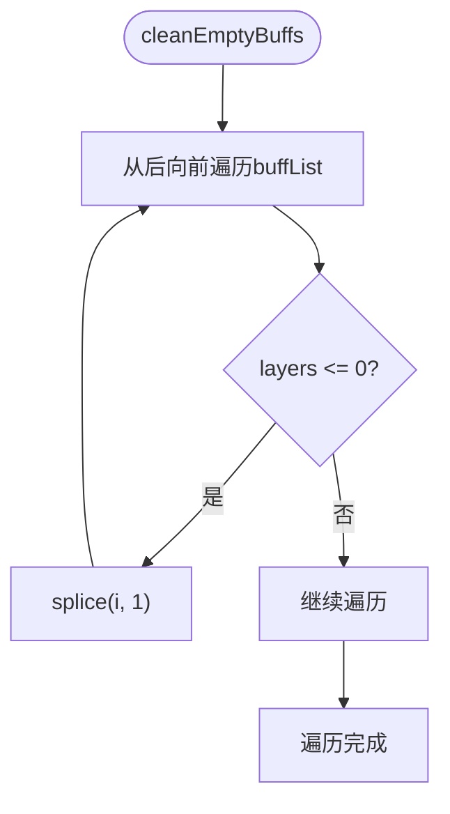

**图表来源**
- [Player.hx:338-344](file://character/Player.hx#L338-L344)

### 与其他Buff系统的交互

#### 与伤害翻倍Buff的协同

DamageBoostBuff和ExtraActionBuff可以在同一回合内协同工作：

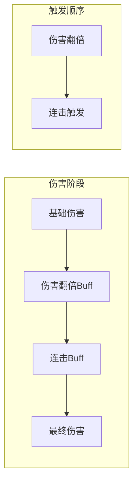

**图表来源**
- [DamageBoostBuff.hx:11-19](file://buffs/DamageBoostBuff.hx#L11-L19)
- [TurnManager.hx:115-122](file://TurnManager.hx#L115-L122)

#### 与中毒Buff的相互影响

PoisonBuff的回合结束结算不会影响连击Buff的状态：

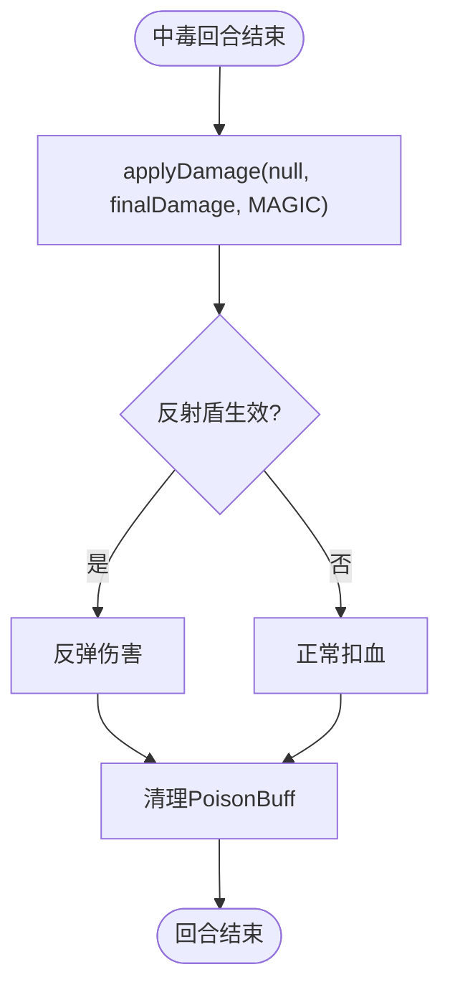

**图表来源**
- [PoisonBuff.hx:11-48](file://buffs/PoisonBuff.hx#L11-L48)

### 游戏平衡性分析

#### 触发频率控制

连击Buff通过以下机制确保游戏平衡：

1. **层数限制**: 每次触发消耗1层，最多触发1次
2. **大回合计数**: 双八组合每大回合最多触发2次
3. **触发条件**: 需要特定的双八组合才能触发

#### 与其他高爆发Buff的平衡

连击Buff与DamageBoostBuff、ThunderRageBuff等高爆发Buff形成平衡：

- **连击Buff**: 提供额外行动机会
- **伤害翻倍Buff**: 提供伤害倍增效果
- **雷霆之怒Buff**: 提供范围伤害效果

**章节来源**
- [GameEngine.hx:506-514](file://GameEngine.hx#L506-L514)
- [TurnManager.hx:143-152](file://TurnManager.hx#L143-L152)

## 依赖关系分析

### 组件间依赖图

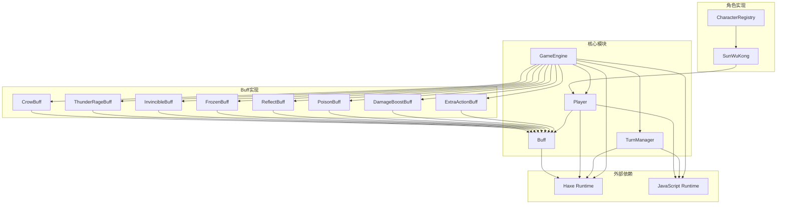

**图表来源**
- [GameEngine.hx:1-725](file://GameEngine.hx#L1-L725)
- [TurnManager.hx:1-232](file://TurnManager.hx#L1-L232)
- [Player.hx:1-375](file://character/Player.hx#L1-L375)

### 关键依赖关系

#### GameEngine与TurnManager的耦合

GameEngine通过setTurnManager方法与TurnManager建立关联，这种设计实现了：

1. **松耦合**: GameEngine不需要直接依赖TurnManager的具体实现
2. **可测试性**: 可以独立测试GameEngine的功能
3. **扩展性**: 可以轻松替换TurnManager的实现

#### Player与Buff系统的集成

Player类通过addBuff和getBuff方法与Buff系统深度集成：

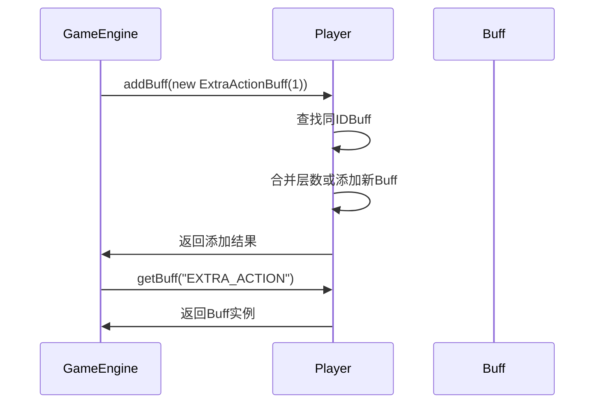

**图表来源**
- [Player.hx:195-210](file://character/Player.hx#L195-L210)

**章节来源**
- [GameEngine.hx:41-43](file://GameEngine.hx#L41-L43)
- [Player.hx:195-210](file://character/Player.hx#L195-L210)

## 性能考虑

### 时间复杂度分析

1. **Buff查找**: O(n) - 线性搜索buffList
2. **回合切换**: O(n) - n为玩家数量
3. **伤害计算**: O(b) - b为当前玩家Buff数量
4. **护盾处理**: O(s) - s为当前玩家护盾数量

### 空间复杂度分析

1. **Buff存储**: O(b) - b为Buff总数
2. **护盾存储**: O(s) - s为护盾总数
3. **玩家状态**: O(1) - 固定大小的状态信息

### 优化建议

1. **Buff缓存**: 可以考虑使用Map缓存常用Buff的查找
2. **批量处理**: 在回合结束时批量处理多个玩家的Buff
3. **延迟清理**: 延迟清理无效Buff，减少频繁的数组操作

## 故障排除指南

### 常见问题诊断

#### 连击Buff不触发

可能的原因和解决方案：

1. **Buff层数为0**: 检查是否已经触发过连击
   - 解决方案: 确认双八组合触发时正确添加了1层连击Buff

2. **回合切换逻辑错误**: 检查TurnManager的nextTurn方法
   - 解决方案: 验证getBuff调用和层数递减逻辑

3. **玩家状态异常**: 检查玩家的buffList状态
   - 解决方案: 使用snapshotState功能查看当前Buff状态

#### 触发频率异常

如果发现连击触发过于频繁：

1. **检查双八组合触发**: 确认bigRound88Used计数器正确更新
2. **验证层数管理**: 确保每次触发后层数正确递减
3. **检查大回合检测**: 验证turnCount的更新逻辑

**章节来源**
- [TurnManager.hx:115-122](file://TurnManager.hx#L115-L122)
- [GameEngine.hx:506-514](file://GameEngine.hx#L506-L514)

### 调试技巧

1. **日志追踪**: 利用trace函数查看详细的触发过程
2. **状态快照**: 使用Main.snapshotState()查看当前游戏状态
3. **单元测试**: 为关键逻辑编写单元测试确保正确性

## 结论

额外行动Buff（连击）作为《双八》游戏的核心机制之一，通过简洁而有效的实现方式为游戏增添了丰富的策略深度。其设计体现了以下特点：

1. **简洁性**: 通过最小化的实现提供了强大的功能
2. **平衡性**: 通过层数和大回合限制确保游戏平衡
3. **可扩展性**: 良好的架构设计便于未来功能扩展
4. **可维护性**: 清晰的代码结构和完善的注释

连击Buff的成功实现展示了如何通过简单的机制创造复杂的玩法体验，为游戏的整体平衡性和趣味性做出了重要贡献。其与GameEngine、TurnManager等核心系统的紧密集成，体现了现代游戏架构中"关注点分离"和"松耦合"的设计原则。