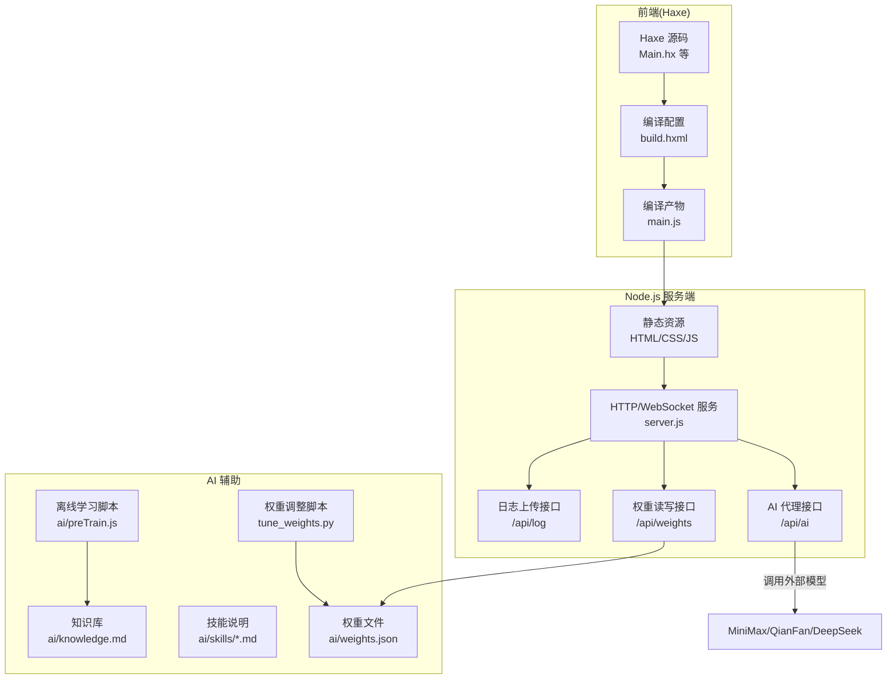
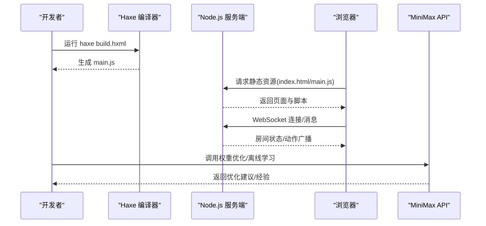
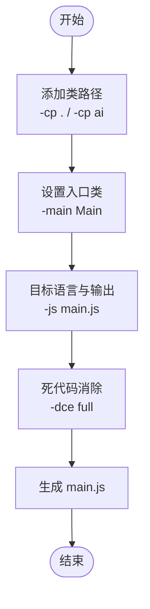
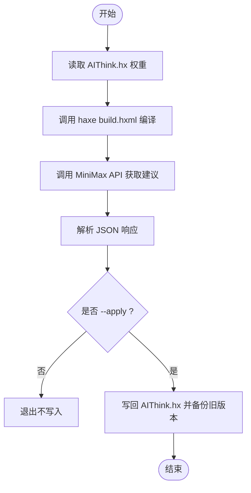
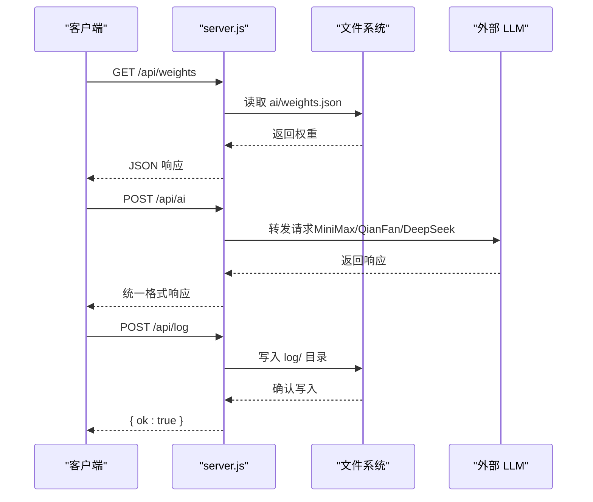
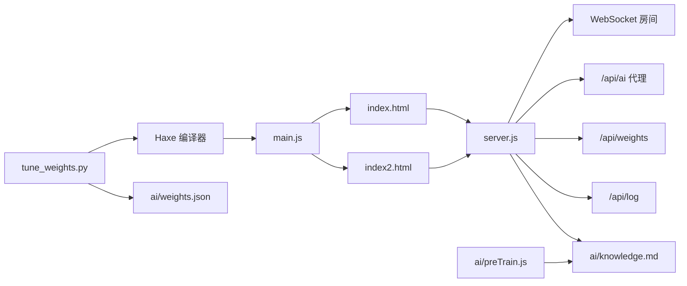

# 开发工具与构建

<cite>
**本文档引用的文件**
- [build.hxml](file://build.hxml)
- [package.json](file://package.json)
- [.settings.local.json](file://.claude/settings.local.json)
- [tune_weights.py](file://tune_weights.py)
- [Main.hx](file://Main.hx)
- [index.html](file://index.html)
- [server.js](file://server.js)
- [index2.html](file://index2.html)
- [ai/preTrain.js](file://ai/preTrain.js)
- [ai/weights.json](file://ai/weights.json)
</cite>

## 目录
1. [简介](#简介)
2. [项目结构](#项目结构)
3. [核心组件](#核心组件)
4. [架构总览](#架构总览)
5. [详细组件分析](#详细组件分析)
6. [依赖关系分析](#依赖关系分析)
7. [性能考虑](#性能考虑)
8. [故障排查指南](#故障排查指南)
9. [结论](#结论)
10. [附录](#附录)

## 简介
本文件面向开发工具与构建流程，系统性梳理以下内容：
- Haxe 编译配置 build.hxml 的设置与优化要点（编译选项、目标平台、输出目录管理）
- Node.js 项目配置 package.json 的依赖管理、脚本定义与开发工具集成
- Python 权重调整脚本 tune_weights.py 的使用方法与参数配置
- Claude AI 配置文件 .settings.local.json 的作用与设置方法
- 开发环境搭建指南（IDE 配置建议、调试工具、热重载）
- 构建优化技巧、打包策略与部署自动化流程
- 常见构建问题排查与解决方案

## 项目结构
该项目采用“Haxe 前端 + Node.js 后端 + AI 辅助”的混合架构：
- Haxe 源码位于根目录，编译产物输出至 main.js
- Node.js 服务端负责静态资源托管、WebSocket 联机、AI 代理与日志持久化
- AI 相关脚本与权重文件位于 ai/ 目录
- 前端页面 index.html 与 index2.html 分别支持 1v1 与 2v2 模式

图表来源
- [build.hxml](file://build.hxml)
- [server.js](file://server.js)
- [ai/preTrain.js](file://ai/preTrain.js)
- [tune_weights.py](file://tune_weights.py)
- [ai/weights.json](file://ai/weights.json)

章节来源
- [build.hxml](file://build.hxml)
- [package.json](file://package.json)
- [server.js](file://server.js)
- [index.html](file://index.html)
- [index2.html](file://index2.html)

## 核心组件
- Haxe 编译配置 build.hxml：定义源码路径、入口类、目标语言与优化开关
- Node.js 服务端 server.js：提供静态资源、WebSocket、AI 代理、权重与日志接口
- Python 权重调整脚本 tune_weights.py：读取当前权重、编译 Haxe、调用 MiniMax 获取优化建议并更新权重
- AI 离线学习脚本 ai/preTrain.js：解析历史日志、分批调用 LLM、追加知识库
- 前端页面 index.html/index2.html：1v1/2v2 对战界面，绑定 Haxe 编译产物 main.js

章节来源
- [build.hxml](file://build.hxml)
- [server.js](file://server.js)
- [tune_weights.py](file://tune_weights.py)
- [ai/preTrain.js](file://ai/preTrain.js)
- [index.html](file://index.html)
- [index2.html](file://index2.html)

## 架构总览
整体工作流如下：
- 开发阶段：Haxe 源码通过 build.hxml 编译为 main.js；前端页面引入 main.js 并与服务端交互
- AI 辅助：ai/preTrain.js 读取 log/ 下的历史对战日志，调用 LLM 提炼经验到 ai/knowledge.md；tune_weights.py 读取 ai/AIThink.hx 权重，编译后请求 MiniMax 获取优化建议并更新
- 服务端：server.js 提供静态资源、WebSocket 房间管理、AI 代理、权重与日志接口

图表来源
- [build.hxml](file://build.hxml)
- [server.js](file://server.js)
- [index.html](file://index.html)
- [tune_weights.py](file://tune_weights.py)
- [ai/preTrain.js](file://ai/preTrain.js)

## 详细组件分析

### Haxe 编译配置 build.hxml
- 源码路径与模块
  - -cp .：将当前目录加入类路径
  - -cp ai：将 ai 目录加入类路径，便于引用 AI 相关代码
- 入口与目标
  - -main Main：指定入口类为 Main
  - -js main.js：目标语言为 JavaScript，输出文件 main.js
- 优化选项
  - -dce full：启用全量死代码消除，减小产物体积
- 输出目录管理
  - 产物 main.js 输出到项目根目录，供前端页面引入

图表来源
- [build.hxml](file://build.hxml)

章节来源
- [build.hxml](file://build.hxml)

### Node.js 项目配置 package.json
- 项目元信息与入口
  - name/version/description：项目名称、版本与描述
  - main：服务端入口文件 server.js
- 脚本定义
  - scripts.start：启动命令 node server.js
- 依赖与运行时
  - dependencies.ws：WebSocket 依赖
  - engines.node：要求 Node.js >= 18.0.0
- 开发工具集成
  - 可扩展 scripts 脚本以集成构建、测试、部署流程

章节来源
- [package.json](file://package.json)

### Python 权重调整脚本 tune_weights.py
- 功能概述
  - 从 AIThink.hx 提取当前权重
  - 调用 Haxe 编译器编译项目，确保 main.js 最新
  - 调用 MiniMax API 获取优化建议
  - 将建议写回 AIThink.hx 并备份旧权重
- 使用方法与参数
  - python tune_weights.py：干跑（仅分析，不写入）
  - python tune_weights.py --apply：实际写入 AIThink.hx
  - python tune_weights.py --num-battles N：预留参数（当前实现未使用）
- API 配置
  - 从用户主目录文件 ~/.minimax_api_key 或环境变量 MINIMAX_API_KEY 读取密钥
  - 使用 MiniMax-Text-01 模型
- 权重提取与更新
  - 正则匹配 AIThink.hx 中的权重常量，更新后写回并生成带时间戳的备份文件

图表来源
- [tune_weights.py](file://tune_weights.py)
- [build.hxml](file://build.hxml)

章节来源
- [tune_weights.py](file://tune_weights.py)

### Claude AI 配置文件 .settings.local.json
- 作用
  - 作为 Claude 的本地配置文件，用于保存 API 密钥、模型偏好、编辑器行为等
- 设置方法
  - 在 .claude 目录下创建 settings.local.json
  - 配置项包括但不限于：API 密钥、模型选择、编辑器主题、自动保存等
- 注意事项
  - 本仓库中未提供该文件的具体内容，需按 Claude 官方文档进行配置

章节来源
- [.settings.local.json](file://.claude/settings.local.json)

### 前端页面与 Haxe 交互
- index.html（1v1）
  - 引入 main.js 并通过全局 Main 对象与 Haxe 交互
  - 包含两步点击状态机、日志面板、AI 对战按钮等
- index2.html（2v2）
  - 引入 main.js 以及一系列 AI/渲染/网络脚本
  - 支持 2v2 模式、联机、AI 训练、模型配置面板等高级功能
- Haxe 入口 Main.hx
  - 提供静态方法供前端调用（如 doTouch、invokeAction、render 等）
  - 重定向 trace 输出到前端日志面板

章节来源
- [index.html](file://index.html)
- [index2.html](file://index2.html)
- [Main.hx](file://Main.hx)

### Node.js 服务端 server.js
- 静态资源托管
  - 解析 URL 映射到本地文件，支持 HTML/JS/CSS/媒体等
- WebSocket 房间管理
  - 支持创建/加入房间、座位分配、广播房间状态
- AI 代理接口
  - /api/ai：代理 MiniMax/QianFan/DeepSeek，统一响应格式
- 权重与日志接口
  - /api/weights：读写 ai/weights.json
  - /api/log：接收并保存对战日志
- 音乐列表接口
  - /api/music：列出 music1 目录下的 MP3 文件

图表来源
- [server.js](file://server.js)
- [ai/weights.json](file://ai/weights.json)

章节来源
- [server.js](file://server.js)

### AI 离线学习脚本 ai/preTrain.js
- 功能概述
  - 扫描 log/ 下的历史日志，解析关键信息（阵容、回合数、关键事件）
  - 分批调用 LLM（MiniMax-M2.7）提炼经验，追加到 ai/knowledge.md
  - 支持重置知识库为初始版本
- 参数
  - --dir=path：指定日志目录
  - --reset：重置知识库为初始版本
  - --batch=N：每批发送的对局数量，默认 3

章节来源
- [ai/preTrain.js](file://ai/preTrain.js)

## 依赖关系分析
- Haxe 与 Node.js
  - Haxe 编译产物 main.js 由前端页面引入，服务端负责静态资源托管
- Python 与 Haxe
  - tune_weights.py 通过 subprocess 调用 haxe build.hxml，确保编译产物最新
- 服务端与 AI
  - server.js 提供 /api/ai 代理接口，ai/preTrain.js 直接调用 LLM
- 前端与服务端
  - index.html/index2.html 通过 WebSocket 与 server.js 通信，实现联机对战

图表来源
- [build.hxml](file://build.hxml)
- [server.js](file://server.js)
- [tune_weights.py](file://tune_weights.py)
- [ai/preTrain.js](file://ai/preTrain.js)
- [ai/weights.json](file://ai/weights.json)

章节来源
- [build.hxml](file://build.hxml)
- [server.js](file://server.js)
- [tune_weights.py](file://tune_weights.py)
- [ai/preTrain.js](file://ai/preTrain.js)

## 性能考虑
- Haxe 编译优化
  - 启用 -dce full 减少产物体积，提升前端加载速度
  - 合理组织 -cp 路径，避免冗余模块进入产物
- Node.js 服务端
  - 静态资源缓存与压缩（可结合中间件）
  - WebSocket 广播时过滤无效消息，减少网络负载
- AI 代理
  - 控制请求频率，避免触发速率限制
  - 对 LLM 响应进行缓存与去噪处理
- 前端渲染
  - 使用批量日志写入（index2.html 中的 _logQueue）降低 DOM 重绘开销

## 故障排查指南
- Haxe 编译失败
  - 检查 build.hxml 中的 -cp 路径与 -main 类是否存在
  - 确认 -js 输出路径可写
  - 查看编译器输出的错误信息定位问题
- main.js 未更新
  - 确认已执行 haxe build.hxml
  - 清理浏览器缓存或强制刷新页面
- WebSocket 连接异常
  - 检查 server.js 是否正常监听端口
  - 确认防火墙与反向代理配置
- AI 代理 401/403
  - 检查 MINIMAX_API_KEY 环境变量或 ~/.minimax_api_key 文件
  - 确认模型名称与请求体格式正确
- 权重文件读写失败
  - 检查 ai/weights.json 权限与格式
  - 确认 server.js 的路径解析逻辑（安全校验）

章节来源
- [build.hxml](file://build.hxml)
- [server.js](file://server.js)
- [tune_weights.py](file://tune_weights.py)

## 结论
本项目通过 Haxe 编译器与 Node.js 服务端实现了前后端协同的对战系统，配合 Python 脚本与 AI 代理实现了权重优化与知识库沉淀。遵循本文档的配置与优化建议，可显著提升开发效率与构建质量。

## 附录
- 开发环境搭建建议
  - IDE：推荐使用 VS Code，安装 Haxe 插件与 ESLint/Prettier
  - 调试工具：浏览器开发者工具、Node.js 调试器、Python 调试器
  - 热重载：前端可通过浏览器自动刷新；服务端可使用 nodemon
- 构建与部署
  - 构建：haxe build.hxml 生成 main.js
  - 部署：将 main.js 与静态资源部署到 Web 服务器，启动 node server.js
- 自动化流程
  - 可在 package.json scripts 中增加 lint、test、build、deploy 等脚本
  - CI/CD：在流水线中执行编译、测试与部署步骤