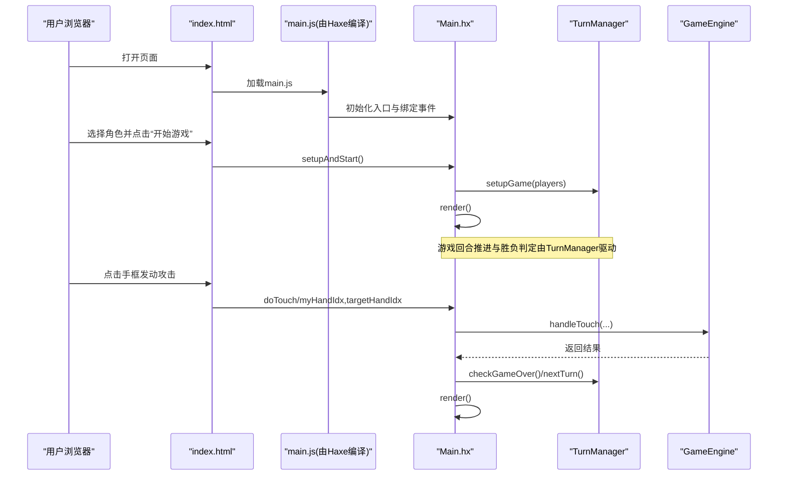
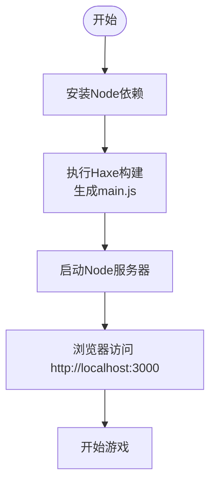
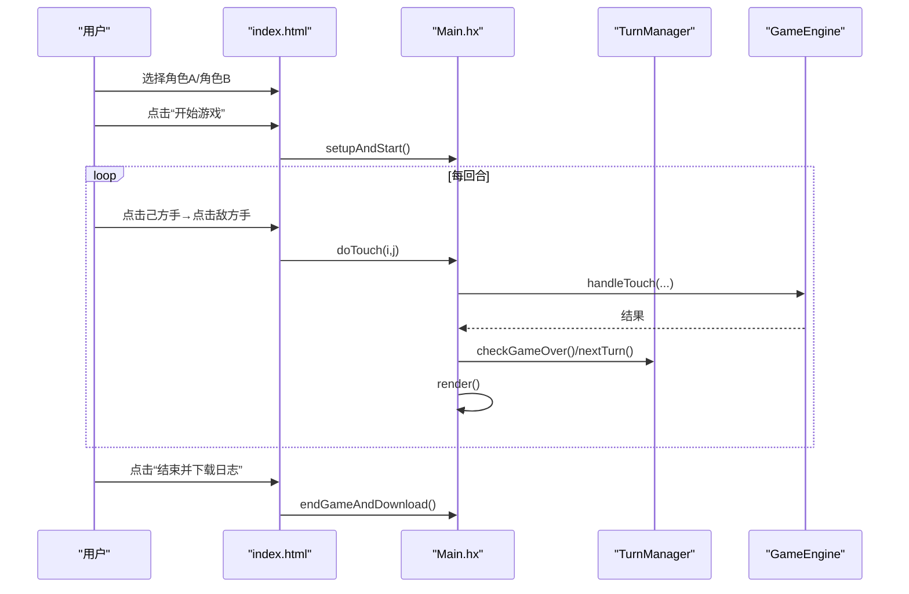
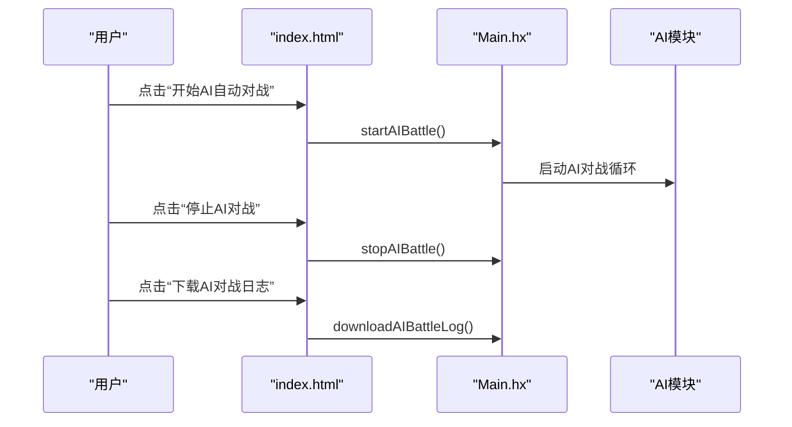
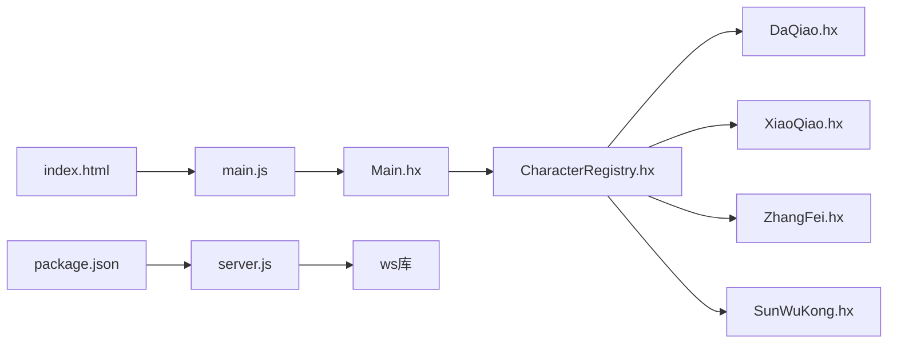

# 快速开始

<cite>
**本文档引用的文件**
- [package.json](file://package.json)
- [build.hxml](file://build.hxml)
- [Main.hx](file://Main.hx)
- [index.html](file://index.html)
- [server.js](file://server.js)
- [PROJECT_ONBOARDING.md](file://PROJECT_ONBOARDING.md)
- [character/CharacterRegistry.hx](file://character/CharacterRegistry.hx)
- [character/DaQiao.hx](file://character/DaQiao.hx)
- [character/XiaoQiao.hx](file://character/XiaoQiao.hx)
- [character/ZhangFei.hx](file://character/ZhangFei.hx)
- [character/SunWuKong.hx](file://character/SunWuKong.hx)
- [ai/preTrain.js](file://ai/preTrain.js)
- [ai/knowledge.md](file://ai/knowledge.md)
- [ai/skills/大乔.md](file://ai/skills/大乔.md)
- [ai/skills/小乔.md](file://ai/skills/小乔.md)
</cite>

## 目录
1. [简介](#简介)
2. [项目结构](#项目结构)
3. [核心组件](#核心组件)
4. [架构总览](#架构总览)
5. [详细组件分析](#详细组件分析)
6. [依赖关系分析](#依赖关系分析)
7. [性能考量](#性能考量)
8. [故障排除指南](#故障排除指南)
9. [结论](#结论)
10. [附录](#附录)

## 简介
本指南面向希望快速上手指尖博弈项目的开发者与玩家，提供从环境准备、编译构建、本地运行到多模式体验的全流程说明。你将在约30分钟内完成环境搭建、启动服务、编译前端、体验1v1单人对战、2v2多人对战以及AI对战模式，并掌握角色选择与基本规则。

## 项目结构
项目采用前后端一体化的单页应用架构：前端HTML/CSS/JS负责用户交互与渲染，Haxe后端负责核心游戏逻辑与AI评估；Node.js提供HTTP静态资源服务与WebSocket房间服务。

```mermaid
graph TB
subgraph "前端"
IDX["index.html<br/>1v1界面"]
JS["main.js<br/>Haxe编译产物"]
CSS["game2.css<br/>样式"]
end
subgraph "后端"
SVR["server.js<br/>HTTP+WS服务"]
PKG["package.json<br/>Node依赖与脚本"]
end
subgraph "核心逻辑(Haxe)"
MAIN["Main.hx<br/>入口与前端桥接"]
REG["CharacterRegistry.hx<br/>角色注册"]
DQ["DaQiao.hx<br/>大乔"]
XQ["XiaoQiao.hx<br/>小乔"]
ZF["ZhangFei.hx<br/>张飞"]
WK["SunWuKong.hx<br/>孙悟空"]
end
IDX --> JS
JS --> MAIN
MAIN --> REG
REG --> DQ
REG --> XQ
REG --> ZF
REG --> WK
SVR <- --> IDX
PKG --> SVR
```

**图表来源**
- [index.html](file://index.html)
- [main.js](file://main.js)
- [Main.hx](file://Main.hx)
- [character/CharacterRegistry.hx](file://character/CharacterRegistry.hx)
- [character/DaQiao.hx](file://character/DaQiao.hx)
- [character/XiaoQiao.hx](file://character/XiaoQiao.hx)
- [character/ZhangFei.hx](file://character/ZhangFei.hx)
- [character/SunWuKong.hx](file://character/SunWuKong.hx)
- [server.js](file://server.js)
- [package.json](file://package.json)

**章节来源**
- [PROJECT_ONBOARDING.md: 17-52:17-52](file://PROJECT_ONBOARDING.md#L17-L52)

## 核心组件
- Haxe编译配置：通过构建脚本将Haxe源码编译为JavaScript，供浏览器直接运行。
- 前端入口与桥接：Main.hx提供渲染、动作分发、日志导出等能力，并与浏览器DOM交互。
- 角色系统：CharacterRegistry集中注册角色，角色类实现各自的战斗机制与钩子。
- 服务器：提供静态资源托管、WebSocket房间管理、AI相关API代理与日志存储。

**章节来源**
- [build.hxml: 1-6:1-6](file://build.hxml#L1-L6)
- [Main.hx: 9-76:9-76](file://Main.hx#L9-L76)
- [character/CharacterRegistry.hx: 17-81:17-81](file://character/CharacterRegistry.hx#L17-L81)
- [server.js: 14-184:14-184](file://server.js#L14-L184)

## 架构总览
下面的序列图展示了从浏览器打开页面到游戏开始的核心流程，以及AI对战入口的调用路径。



**图表来源**
- [index.html: 170-317:170-317](file://index.html#L170-L317)
- [Main.hx: 25-76:25-76](file://Main.hx#L25-L76)
- [Main.hx: 170-192:170-192](file://Main.hx#L170-L192)
- [Main.hx: 274-293:274-293](file://Main.hx#L274-L293)
- [Main.hx: 298-396:298-396](file://Main.hx#L298-L396)

## 详细组件分析

### 环境与依赖准备
- Node.js版本要求：项目声明最低版本为18及以上。
- 依赖安装：使用npm安装运行时依赖（WebSocket服务端）。
- Haxe工具链：用于编译Haxe源码到JavaScript。

建议步骤
- 安装Node.js（版本≥18）
- 安装Haxe与Haxe编译器
- 在项目根目录执行依赖安装命令
- 使用构建脚本编译Haxe源码

**章节来源**
- [package.json: 12-14:12-14](file://package.json#L12-L14)
- [build.hxml: 1-6:1-6](file://build.hxml#L1-6)

### 本地编译与启动
- 编译Haxe：在项目根目录执行Haxe构建脚本，生成main.js供浏览器使用。
- 启动Node服务器：运行服务端脚本，提供静态资源与WebSocket房间服务。
- 访问地址：默认在本地3000端口提供页面。



**图表来源**
- [build.hxml: 1-6:1-6](file://build.hxml#L1-L6)
- [server.js: 310-312:310-312](file://server.js#L310-L312)

**章节来源**
- [build.hxml: 1-6:1-6](file://build.hxml#L1-L6)
- [server.js: 310-312:310-312](file://server.js#L310-L312)

### 1v1单人对战体验
- 角色选择：页面提供两个下拉框，分别选择双方阵营的角色。
- 开始游戏：点击“开始游戏”按钮，初始化双方角色并进入对战界面。
- 操作方式：先点击己方一只手，再点击敌方一只手发动攻击；系统会自动判断合法移动并结算。
- 日志与回放：可随时结束并下载本局日志，便于回顾与分析。



**图表来源**
- [index.html: 178-233:178-233](file://index.html#L178-L233)
- [Main.hx: 170-192:170-192](file://Main.hx#L170-L192)
- [Main.hx: 274-293:274-293](file://Main.hx#L274-L293)
- [Main.hx: 124-165:124-165](file://Main.hx#L124-L165)

**章节来源**
- [index.html: 64-74:64-74](file://index.html#L64-L74)
- [index.html: 178-233:178-233](file://index.html#L178-L233)
- [Main.hx: 170-192:170-192](file://Main.hx#L170-L192)
- [Main.hx: 274-293:274-293](file://Main.hx#L274-L293)

### 2v2多人对战（平台）
- 平台说明：项目文档指出2v2平台正在开发中，包含抗伤位切换、距离限制、帮抗机制等特性。
- 当前可用：可在现有1v1基础上扩展理解，关注角色在团队中的定位与配合。

**章节来源**
- [PROJECT_ONBOARDING.md: 183-188:183-188](file://PROJECT_ONBOARDING.md#L183-L188)

### AI对战模式
- AI入口：页面提供“开始AI自动对战/停止/下载日志”按钮，调用Main中的AI对战相关方法。
- AI系统：包含启发式评估、权重学习与自动对战循环，支持权重持久化与知识库提炼。



**图表来源**
- [index.html: 456-478:456-478](file://index.html#L456-L478)
- [Main.hx: 267-269:267-269](file://Main.hx#L267-L269)

**章节来源**
- [index.html: 152-159:152-159](file://index.html#L152-L159)
- [index.html: 456-478:456-478](file://index.html#L456-L478)
- [Main.hx: 267-269:267-269](file://Main.hx#L267-L269)

### 前端界面与操作说明
- 1v1界面：包含双方角色卡、手框点击交互、提示栏、日志面板与AI控制区域。
- 手框交互：合法移动时可点击，非法移动会提示；点击后自动推进回合。
- 特殊弹窗：如“释放草莓蛋糕”、“大乔抢夺”等，按提示完成操作。

**章节来源**
- [index.html: 76-122:76-122](file://index.html#L76-L122)
- [index.html: 127-147:127-147](file://index.html#L127-L147)
- [index.html: 325-378:325-378](file://index.html#L325-L378)
- [index.html: 386-451:386-451](file://index.html#L386-L451)

### 角色选择与基本规则
- 角色注册：通过CharacterRegistry集中注册，新增角色只需添加一行注册与实现角色类。
- 角色示例：小乔（半肉）、大乔（天后）、张飞（坦克）、孙悟空（半肉）等，各自具备独特的机制与优先级。
- 基本规则：0机制、伤害计算顺序、回血类型、护盾消耗顺序、组合优先级、大回合概念等。

**章节来源**
- [character/CharacterRegistry.hx: 22-60:22-60](file://character/CharacterRegistry.hx#L22-L60)
- [character/XiaoQiao.hx: 9-16:9-16](file://character/XiaoQiao.hx#L9-L16)
- [character/DaQiao.hx: 9-19:9-19](file://character/DaQiao.hx#L9-L19)
- [character/ZhangFei.hx: 8-21:8-21](file://character/ZhangFei.hx#L8-L21)
- [character/SunWuKong.hx: 9-16:9-16](file://character/SunWuKong.hx#L9-L16)
- [PROJECT_ONBOARDING.md: 112-146:112-146](file://PROJECT_ONBOARDING.md#L112-L146)

## 依赖关系分析
- 前端依赖：index.html引入main.js，Main.hx提供渲染与动作分发。
- 后端依赖：server.js依赖ws库提供WebSocket服务，同时托管静态资源。
- 角色依赖：Main.hx通过CharacterRegistry动态加载角色，角色类继承Player基类并实现钩子。



**图表来源**
- [index.html](file://index.html)
- [main.js](file://main.js)
- [Main.hx](file://Main.hx)
- [character/CharacterRegistry.hx](file://character/CharacterRegistry.hx)
- [character/DaQiao.hx](file://character/DaQiao.hx)
- [character/XiaoQiao.hx](file://character/XiaoQiao.hx)
- [character/ZhangFei.hx](file://character/ZhangFei.hx)
- [character/SunWuKong.hx](file://character/SunWuKong.hx)
- [server.js](file://server.js)
- [package.json](file://package.json)

**章节来源**
- [server.js: 5-11:5-11](file://server.js#L5-L11)
- [package.json: 9-11:9-11](file://package.json#L9-L11)

## 性能考量
- 前端渲染：Main.hx的render方法负责DOM更新，建议在回合变化时批量刷新，避免频繁重排。
- AI评估：权重与学习系统在后台进行，避免阻塞主线程；日志批处理与速率限制需合理配置。
- 服务器：WebSocket广播与房间状态更新应避免冗余消息，减少带宽与CPU占用。

## 故障排除指南
- Node版本不符
  - 现象：安装或启动时报错，提示Node版本过低。
  - 处理：升级至Node.js 18及以上版本。
  - 参考：[package.json: 12-14:12-14](file://package.json#L12-L14)
- Haxe编译失败
  - 现象：执行构建脚本报错或main.js未生成。
  - 处理：确认Haxe工具链安装正确，HXML配置无误；清理缓存后重试。
  - 参考：[build.hxml: 1-6:1-6](file://build.hxml#L1-L6)
- 服务器端口占用
  - 现象：启动服务器报端口冲突。
  - 处理：修改server.js中的端口或释放占用端口。
  - 参考：[server.js: 10](file://server.js#L10)
- WebSocket连接异常
  - 现象：页面无法进入房间或消息无法转发。
  - 处理：检查ws依赖安装与防火墙设置；查看服务端日志。
  - 参考：[server.js: 186-308:186-308](file://server.js#L186-L308)
- 角色未显示或选择异常
  - 现象：角色下拉框为空或选择无效。
  - 处理：确认CharacterRegistry注册项齐全；检查角色类构造参数与Camp枚举。
  - 参考：[character/CharacterRegistry.hx: 22-60:22-60](file://character/CharacterRegistry.hx#L22-L60)
- AI对战按钮无响应
  - 现象：点击AI按钮无反应。
  - 处理：刷新页面确保main.js加载完成；检查Main中AI方法是否存在。
  - 参考：[index.html: 456-478:456-478](file://index.html#L456-L478)
- 日志下载失败
  - 现象：点击“结束并下载日志”无文件下载。
  - 处理：确认浏览器允许下载；检查日志缓冲是否为空。
  - 参考：[Main.hx: 124-165:124-165](file://Main.hx#L124-L165)

**章节来源**
- [package.json: 12-14:12-14](file://package.json#L12-L14)
- [build.hxml: 1-6:1-6](file://build.hxml#L1-L6)
- [server.js: 10](file://server.js#L10)
- [server.js: 186-308:186-308](file://server.js#L186-L308)
- [character/CharacterRegistry.hx: 22-60:22-60](file://character/CharacterRegistry.hx#L22-L60)
- [index.html: 456-478:456-478](file://index.html#L456-L478)
- [Main.hx: 124-165:124-165](file://Main.hx#L124-L165)

## 结论
通过本快速开始指南，你已完成环境准备、Haxe编译与Node服务器启动，并掌握了1v1单人对战、2v2多人对战（平台）与AI对战的基本流程。建议进一步阅读角色攻略与知识库，加深对策略与权重的理解，逐步提升对战水平。

## 附录

### 常用命令与路径
- 安装依赖：在项目根目录执行依赖安装命令
- 编译Haxe：在项目根目录执行Haxe构建脚本
- 启动服务器：在项目根目录执行Node服务器脚本
- 访问页面：在浏览器打开本地服务地址

**章节来源**
- [package.json: 6-8:6-8](file://package.json#L6-L8)
- [build.hxml: 1-6:1-6](file://build.hxml#L1-L6)
- [server.js: 310-312:310-312](file://server.js#L310-L312)

### 角色与策略参考
- 大乔攻略与权重：了解抢夺机制、进化时机与优先级
- 小乔攻略与权重：掌握回血反伤与护盾升级机制
- AI知识库：通用原则、角色应对要点与2v2策略

**章节来源**
- [ai/skills/大乔.md: 1-34:1-34](file://ai/skills/大乔.md#L1-L34)
- [ai/skills/小乔.md: 1-44:1-44](file://ai/skills/小乔.md#L1-L44)
- [ai/knowledge.md: 1-44:1-44](file://ai/knowledge.md#L1-L44)