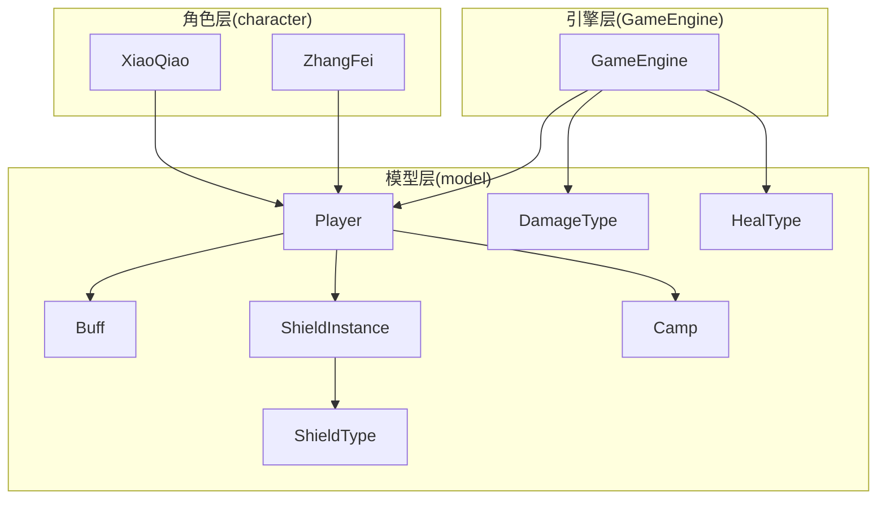
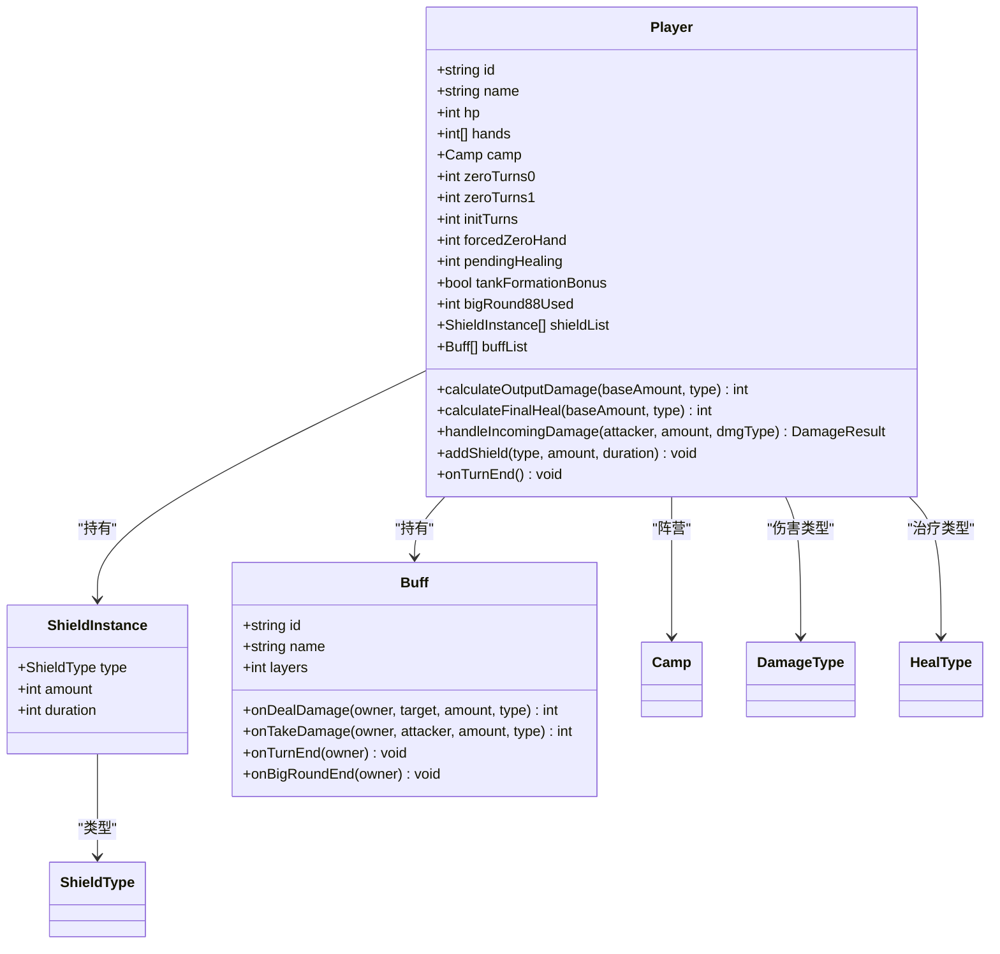
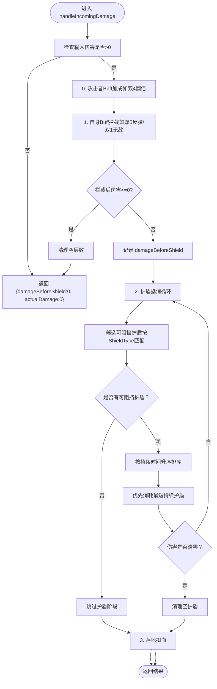
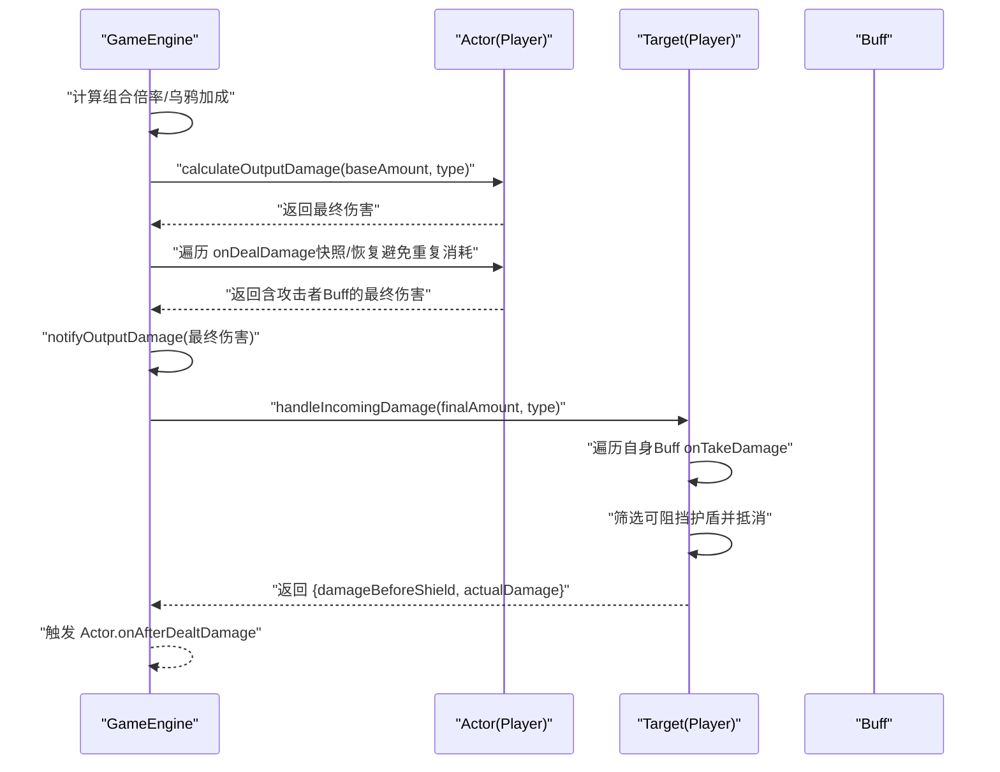
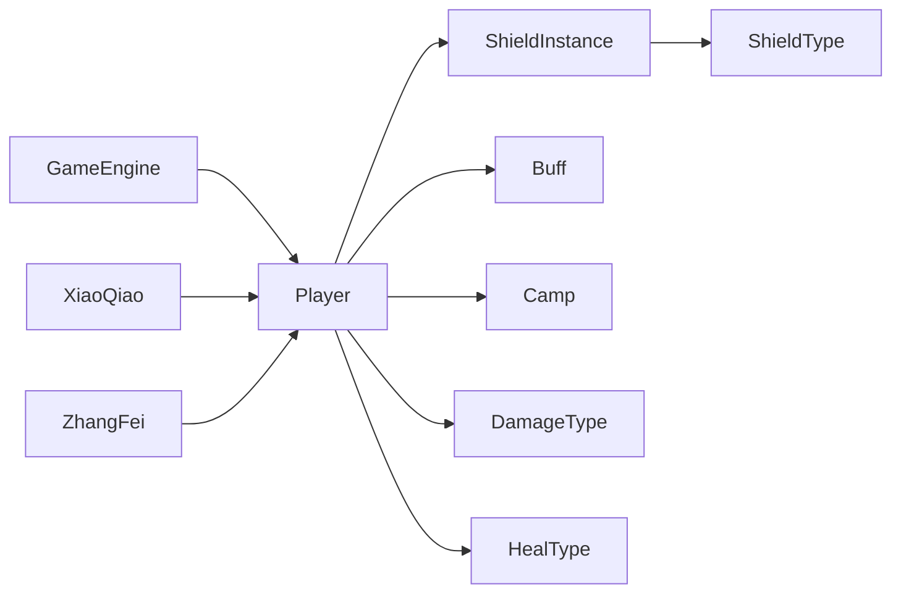

# 数据模型

<cite>
**本文引用的文件**
- [Player.hx](file://model/Player.hx)
- [Camp.hx](file://model/Camp.hx)
- [DamageType.hx](file://model/DamageType.hx)
- [HealType.hx](file://model/HealType.hx)
- [ShieldType.hx](file://model/ShieldType.hx)
- [ShieldInstance.hx](file://model/ShieldInstance.hx)
- [Buff.hx](file://model/Buff.hx)
- [GameEngine.hx](file://GameEngine.hx)
- [XiaoQiao.hx](file://character/XiaoQiao.hx)
- [ZhangFei.hx](file://character/ZhangFei.hx)
- [DamageBoostBuff.hx](file://buffs/DamageBoostBuff.hx)
- [InvincibleBuff.hx](file://buffs/InvincibleBuff.hx)
</cite>

## 目录
1. [简介](#简介)
2. [项目结构](#项目结构)
3. [核心组件](#核心组件)
4. [架构总览](#架构总览)
5. [详细组件分析](#详细组件分析)
6. [依赖关系分析](#依赖关系分析)
7. [性能考量](#性能考量)
8. [故障排查指南](#故障排查指南)
9. [结论](#结论)
10. [附录](#附录)

## 简介
本文件系统性梳理本项目的“数据模型”层，聚焦以下核心实体与关系：
- Player 角色模型：字段定义、钩子接口、伤害抗性与护盾系统、状态管理
- Camp 阵营枚举：HERO/REBEL/RENEGADE 的阵营语义与扩展空间
- DamageType 伤害类型：PHYSICAL/MAGIC/TRUE 的分类体系与抗性判定
- HealType 治疗类型：RECOVERY/SUPPLY 的实现差异与交互
- ShieldType 护盾类型：PHYSICAL/MAGIC/BOTH_PHYSICAL_MAGIC/TRUE 的抽象设计
- ShieldInstance 护盾实例：护盾值、持续时间、类型区分与合并策略
- Buff 护盾/伤害/状态系统：生命周期钩子与与 Player 的协作
- GameEngine 引擎：伤害/回血/护盾流程的编排与事件广播

通过对上述组件的结构、数据流、处理逻辑与扩展机制的深入分析，帮助开发者快速理解并安全地扩展数据模型。

## 项目结构
数据模型位于 model/ 目录，围绕 Player 为核心向外辐射：
- Player 作为角色基类，聚合 Buff 与 ShieldInstance，并提供伤害抗性与护盾处理逻辑
- Camp/DamageType/HealType/ShieldType 以枚举形式定义离散域
- ShieldInstance 作为轻量数据载体，承载护盾的类型、值与持续时间
- Buff 作为可叠加的状态效果，通过钩子参与伤害/回血/护盾的计算链
- GameEngine 作为流程编排者，协调 Player 的钩子与 Buff 的生命周期

图表来源
- [Player.hx](file://model/Player.hx)
- [ShieldInstance.hx](file://model/ShieldInstance.hx)
- [GameEngine.hx](file://GameEngine.hx)
- [XiaoQiao.hx](file://character/XiaoQiao.hx)
- [ZhangFei.hx](file://character/ZhangFei.hx)

章节来源
- [Player.hx:1-398](file://model/Player.hx#L1-L398)
- [GameEngine.hx:1-200](file://GameEngine.hx#L1-L200)

## 核心组件
本节概述各核心数据结构与职责边界，便于快速定位与扩展。

- Player
  - 字段：id/name/hp/hands/camp/zeroTurns*/initTurns/forcedZeroHand/pendingHealing/tankFormationBonus/bigRound88Used/shieldList/buffList
  - 能力：伤害/回血倍率钩子、事件监听钩子、护盾管理、伤害抗性与护盾抵消、回合结束清理与护盾衰减
- Camp
  - 枚举：HERO/REBEL/RENEGADE，支持未来扩展阵营
- DamageType
  - 枚举：PHYSICAL/MAGIC/TRUE，决定抗性与护盾阻挡判定
- HealType
  - 枚举：RECOVERY/SUPPLY，区分可否被拦截与是否解毒
- ShieldType
  - 枚举：PHYSICAL/MAGIC/BOTH_PHYSICAL_MAGIC/TRUE，定义护盾的阻挡范围
- ShieldInstance
  - 字段：type/amount/duration，表示单个护盾条目
- Buff
  - 字段：id/name/layers，钩子：onTurnStart/onTurnEnd/onBigRoundEnd/onDealDamage/onTakeDamage

章节来源
- [Player.hx:3-26](file://model/Player.hx#L3-L26)
- [Camp.hx:3-8](file://model/Camp.hx#L3-L8)
- [DamageType.hx:3-7](file://model/DamageType.hx#L3-L7)
- [HealType.hx:3-6](file://model/HealType.hx#L3-L6)
- [ShieldType.hx:3-8](file://model/ShieldType.hx#L3-L8)
- [ShieldInstance.hx:3-13](file://model/ShieldInstance.hx#L3-L13)
- [Buff.hx:3-30](file://model/Buff.hx#L3-L30)

## 架构总览
数据模型采用“角色基类 + 枚举域 + 轻量实例 + 生命周期钩子”的分层设计：
- 角色基类负责状态与流程编排
- 枚举域提供稳定的离散语义
- 实例类承载瞬态数据
- 钩子系统贯穿伤害/回血/护盾/状态的计算链

图表来源
- [Player.hx:3-398](file://model/Player.hx#L3-L398)
- [ShieldInstance.hx:3-13](file://model/ShieldInstance.hx#L3-L13)
- [Buff.hx:3-30](file://model/Buff.hx#L3-L30)
- [Camp.hx:3-8](file://model/Camp.hx#L3-L8)
- [DamageType.hx:3-7](file://model/DamageType.hx#L3-L7)
- [HealType.hx:3-6](file://model/HealType.hx#L3-L6)
- [ShieldType.hx:3-8](file://model/ShieldType.hx#L3-L8)

## 详细组件分析

### Player 角色模型
- 字段设计
  - 基础属性：id/name/hp/hands/camp
  - 零组合与回合相关：zeroTurns*/initTurns/forcedZeroHand/pendingHealing
  - 阵容流派：tankFormationBonus（如“坦脆流”加成）
  - 大回合限制：bigRound88Used
  - 聚合容器：shieldList/buffList
- 钩子接口
  - 伤害/回血倍率钩子：calculateOutputDamage/calculateFinalHeal
  - 事件监听钩子：onAnyHealHappened/onAnyShieldGained/onAnyOutputDamage/onAnyPoisonTick/onAnyPoisonCleared/onAnyThunderTick/onAnyTurnStart
  - 生命值归零时复活钩子：tryRevive
  - 自定义交互钩子：handleAction/tryOverrideComboEffect/getCustomDisplay/getCustomActions/getSnapshotExtras
  - 零组合上下文钩子：shouldSkipZeroTurnsDecrement/onAfterTouchResolved/onEnterZeroComboContext/onExitZeroComboContext
- 护盾与伤害抗性
  - addShield：同类型同持续时间合并，否则新增
  - handleIncomingDamage：顺序为“攻击者Buff→自身Buff→护盾→落血”，返回“减伤后但未被护盾前的伤害值”与“实际扣血额”
  - 护盾阻挡判定：依据 DamageType 与 ShieldType 的匹配关系
- Buff 管理
  - addBuff：同id叠加层数，否则新增
  - onTurnEnd：遍历执行 Buff 的 onTurnEnd/onBigRoundEnd，清理空层数，护盾衰减
- 触碰合法性预检
  - isValidTouch：基于另一只手是否为0且寿命耗尽的规则判断

章节来源
- [Player.hx:3-26](file://model/Player.hx#L3-L26)
- [Player.hx:328-398](file://model/Player.hx#L328-L398)

### 护盾系统：ShieldInstance 与 ShieldType
- ShieldInstance
  - 字段：type/amount/duration
  - 作用：承载单个护盾条目的类型、可抵消量与持续回合
- 护盾合并策略
  - addShield：同类型同持续时间的护盾合并，否则新建实例
- 护盾阻挡判定
  - handleIncomingDamage：按伤害类型筛选可阻挡的护盾，优先选择持续时间较短的护盾，直至伤害清零或无可用护盾
- 类型区分机制
  - ShieldType 与 DamageType 的匹配关系决定是否可阻挡
  - TRUE 伤害可穿透除 TRUE 外的所有护盾

图表来源
- [Player.hx:262-325](file://model/Player.hx#L262-L325)

章节来源
- [ShieldInstance.hx:3-13](file://model/ShieldInstance.hx#L3-L13)
- [Player.hx:240-252](file://model/Player.hx#L240-L252)
- [Player.hx:299-320](file://model/Player.hx#L299-L320)

### 伤害类型与计算逻辑：DamageType 与 Buff 协作
- DamageType 分类
  - PHYSICAL/MAGIC/TRUE 三种类型，决定抗性与护盾阻挡
- Buff 协作
  - onDealDamage：在伤害计算链早期应用（如双4翻倍），GameEngine 通过快照/恢复避免重复消耗
  - onTakeDamage：在自身承受伤害前拦截（如双5反弹/双1无敌）
- GameEngine 流程
  - applyDamage：标准化伤害流程，先角色加成，再攻击者Buff加成，通知“输出事件”，最后交由 Player.handleIncomingDamage

图表来源
- [GameEngine.hx:137-200](file://GameEngine.hx#L137-L200)
- [Player.hx:262-325](file://model/Player.hx#L262-L325)
- [Buff.hx:21-29](file://model/Buff.hx#L21-L29)

章节来源
- [GameEngine.hx:137-200](file://GameEngine.hx#L137-L200)
- [DamageBoostBuff.hx:11-19](file://buffs/DamageBoostBuff.hx#L11-L19)
- [InvincibleBuff.hx:19-28](file://buffs/InvincibleBuff.hx#L19-L28)

### 治疗类型：HealType 的实现机制
- HealType 区分
  - RECOVERY：可被拦截（如大乔“复活甲”）、可解毒
  - SUPPLY：纯加血、不解毒、不可被拦截
- Player 钩子
  - calculateFinalHeal：角色可对回血进行倍率加成（如小乔×1.5）
  - onAfterHeal：回血后触发（如小乔“回血时对敌方造成等量物伤”）

章节来源
- [HealType.hx:3-6](file://model/HealType.hx#L3-L6)
- [Player.hx:41-58](file://model/Player.hx#L41-L58)

### 阵营：Camp 的使用场景
- 枚举：HERO/REBEL/RENEGADE
- 使用场景：角色与目标的选择（如张飞模态2寻找非己方敌人的第二目标）、事件广播（GameEngine 对所有存活玩家广播）

章节来源
- [Camp.hx:3-8](file://model/Camp.hx#L3-L8)
- [ZhangFei.hx:126-136](file://character/ZhangFei.hx#L126-L136)

### 角色示例：小乔与张飞的数据模型应用
- 小乔
  - 伤害/回血倍率：物理伤害×1.5，回血×1.5
  - 护盾升级：所有物理护盾升级为“物法盾”，厚度×1.5，持续+1
  - 被动：造成物伤后给自己补给等量血；回血时对敌方造成等量物伤
- 张飞
  - 模态系统：模态1/2/3，分别对应不同伤害倍率与效果
  - 狂暴系统：≥24怒气进入狂暴，持续3回合，0使用回合数提升至3，免伤×2
  - 怒气机制：回血/受击/造伤均可叠加怒气，每大回合上限4层

章节来源
- [XiaoQiao.hx:17-96](file://character/XiaoQiao.hx#L17-L96)
- [ZhangFei.hx:22-273](file://character/ZhangFei.hx#L22-L273)

## 依赖关系分析
- Player 依赖
  - ShieldInstance：持有多个护盾实例
  - Buff：持有多个状态效果
  - 枚举：Camp/DamageType/HealType/ShieldType
- GameEngine 依赖
  - Player：伤害/回血/护盾流程的调用方
  - Buff：遍历执行生命周期钩子
  - 枚举：DamageType/HealType/ShieldType
- 角色扩展
  - XiaoQiao/ZhangFei 继承 Player，重写钩子与行为，体现多态与策略模式

图表来源
- [GameEngine.hx:1-200](file://GameEngine.hx#L1-L200)
- [Player.hx:16-24](file://model/Player.hx#L16-L24)
- [ShieldInstance.hx:3-13](file://model/ShieldInstance.hx#L3-L13)
- [XiaoQiao.hx:17-22](file://character/XiaoQiao.hx#L17-L22)
- [ZhangFei.hx:22-36](file://character/ZhangFei.hx#L22-L36)

章节来源
- [GameEngine.hx:1-200](file://GameEngine.hx#L1-L200)
- [Player.hx:16-24](file://model/Player.hx#L16-L24)

## 性能考量
- 护盾抵消循环
  - 每次抵消需筛选可阻挡护盾并排序，复杂度 O(n log n)，其中 n 为当前护盾数量
  - 建议：在高频场景下，尽量减少护盾种类与层数，避免过多类型混杂导致排序成本上升
- Buff 遍历
  - 每次伤害/回合均需遍历 Buff 列表，建议控制 Buff 数量与层数，避免线性增长带来的开销
- 清理策略
  - onTurnEnd 与 handleIncomingDamage 中的空层数/空护盾清理为逆序删除，时间复杂度 O(n)
- 事件广播
  - GameEngine 对所有存活玩家广播事件，注意在角色数量较多时的广播成本

章节来源
- [Player.hx:299-320](file://model/Player.hx#L299-L320)
- [Player.hx:361-377](file://model/Player.hx#L361-L377)
- [GameEngine.hx:56-118](file://GameEngine.hx#L56-L118)

## 故障排查指南
- 护盾未生效
  - 检查 ShieldType 与 DamageType 是否匹配（如物理伤害无法被魔法护盾阻挡）
  - 检查护盾 amount 是否被完全抵消或已清零
- 伤害倍率异常
  - 确认角色的 calculateOutputDamage 与 Buff 的 onDealDamage 是否被正确调用
  - 检查 GameEngine 的“组合倍率/乌鸦加成”是否覆盖了角色加成
- 回血被拦截
  - 确认 HealType 是否为 SUPPLY（不可被拦截）
  - 检查是否存在可拦截的 Buff 或角色能力
- 护盾合并问题
  - 确认 addShield 的类型与持续时间是否一致
  - 检查是否误用不同类型的护盾导致未合并

章节来源
- [Player.hx:240-252](file://model/Player.hx#L240-L252)
- [Player.hx:299-320](file://model/Player.hx#L299-L320)
- [GameEngine.hx:137-200](file://GameEngine.hx#L137-L200)

## 结论
本数据模型以 Player 为核心，通过枚举域与轻量实例定义清晰的离散语义，借助 Buff 钩子系统实现灵活的伤害/回血/护盾/状态计算链。ShieldInstance 与 ShieldType 的组合提供了强大的抗伤抽象，结合 GameEngine 的流程编排，形成了高内聚、低耦合的系统架构。角色扩展可通过继承 Player 并重写钩子实现，既保证了稳定性，也为功能演进提供了充足空间。

## 附录

### 数据验证规则
- 伤害输入校验
  - handleIncomingDamage 对 amount ≤ 0 的情况直接返回零伤害
- 护盾值与持续时间
  - amount/duration 应为非负整数；duration≤0 的护盾应在回合结束或抵消后清理
- Buff 层数
  - layers 应为非负整数；≤0 的 Buff 应在清理阶段移除
- 阵营与目标
  - Camp 仅限 HERO/REBEL/RENEGADE；角色间交互需遵循阵营判定（如张飞模态2的第二目标选择）

章节来源
- [Player.hx:262-264](file://model/Player.hx#L262-L264)
- [Player.hx:346-354](file://model/Player.hx#L346-L354)
- [Player.hx:361-367](file://model/Player.hx#L361-L367)

### 序列化方案
- JSON 序列化建议
  - Player：id/name/hp/hands/camp/zeroTurns*/initTurns/forcedZeroHand/pendingHealing/tankFormationBonus/bigRound88Used
  - ShieldInstance：type/amount/duration
  - Buff：id/name/layers
  - 枚举类型可序列化为字符串（如 "PHYSICAL"/"MAGIC"/"TRUE"）
- 注意事项
  - Buff 的生命周期钩子函数不可序列化，需在运行时重建
  - GameEngine 作为全局单例，不应随角色序列化

章节来源
- [Player.hx:3-26](file://model/Player.hx#L3-L26)
- [ShieldInstance.hx:3-13](file://model/ShieldInstance.hx#L3-L13)
- [Buff.hx:3-12](file://model/Buff.hx#L3-L12)

### 性能优化策略
- 护盾优化
  - 合并同类项：尽量使用相同类型与持续时间的护盾，减少排序与筛选成本
  - 类型精简：避免同时存在多种护盾类型，降低匹配复杂度
- Buff 优化
  - 控制 Buff 数量与层数，定期清理无效 Buff
  - 使用快照/恢复避免重复消耗（如 GameEngine 对攻击者 Buff 的处理）
- 清理策略
  - 逆序删除空护盾与空层数，减少数组移动成本

章节来源
- [Player.hx:240-252](file://model/Player.hx#L240-L252)
- [Player.hx:361-377](file://model/Player.hx#L361-L377)
- [GameEngine.hx:166-180](file://GameEngine.hx#L166-L180)

### 数据模型扩展指南
- 新增伤害类型
  - 在 DamageType 中添加新枚举值，并在 Player.handleIncomingDamage 与 ShieldType 的匹配逻辑中补充相应分支
- 新增治疗类型
  - 在 HealType 中添加新枚举值，并在角色回血钩子中处理新类型的行为差异
- 新增护盾类型
  - 在 ShieldType 中添加新枚举值，并在 Player.handleIncomingDamage 的护盾匹配逻辑中补充
- 新增 Buff 效果
  - 继承 Buff，实现所需钩子（如 onDealDamage/onTakeDamage），并在角色或 GameEngine 中注册
- 新增角色
  - 继承 Player，重写 calculateOutputDamage/calculateFinalHeal/onAfterDealtDamage/onAfterHeal 等钩子，必要时重写 addShield 以实现护盾升级/变形
- 新增阵营
  - 在 Camp 中添加新枚举值，并在 GameEngine 的事件广播与角色逻辑中处理新阵营的交互

章节来源
- [DamageType.hx:3-7](file://model/DamageType.hx#L3-L7)
- [HealType.hx:3-6](file://model/HealType.hx#L3-L6)
- [ShieldType.hx:3-8](file://model/ShieldType.hx#L3-L8)
- [Buff.hx:3-30](file://model/Buff.hx#L3-L30)
- [Player.hx:328-398](file://model/Player.hx#L328-L398)
- [Camp.hx:3-8](file://model/Camp.hx#L3-L8)