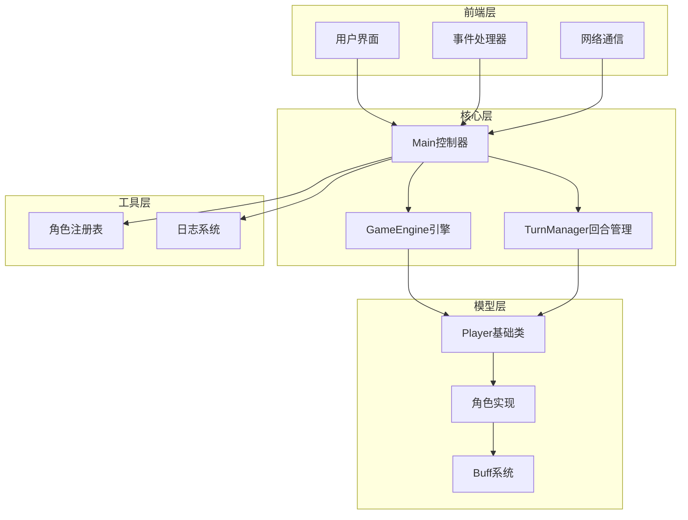
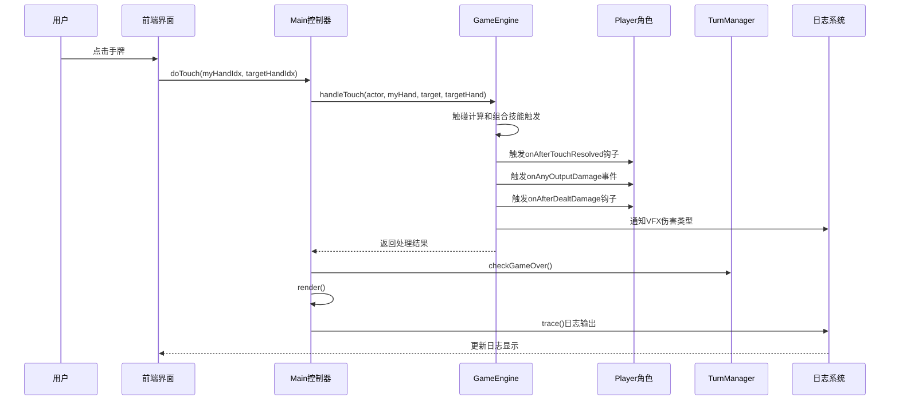
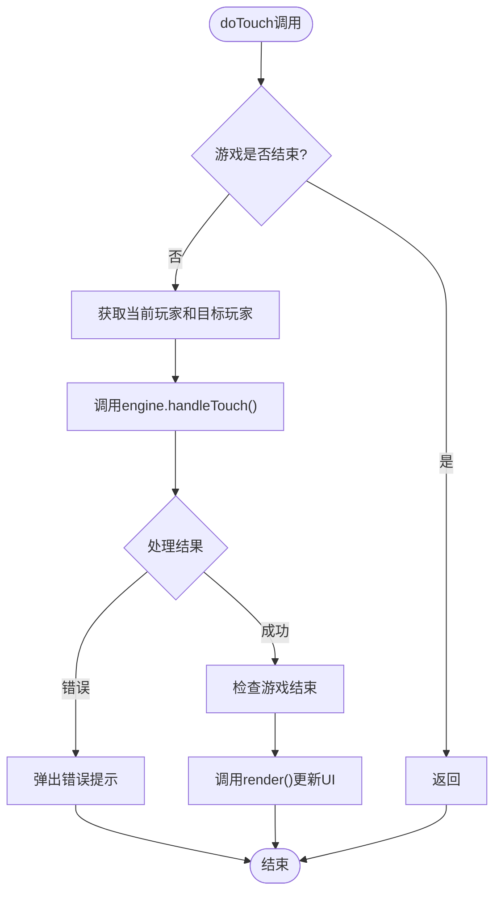
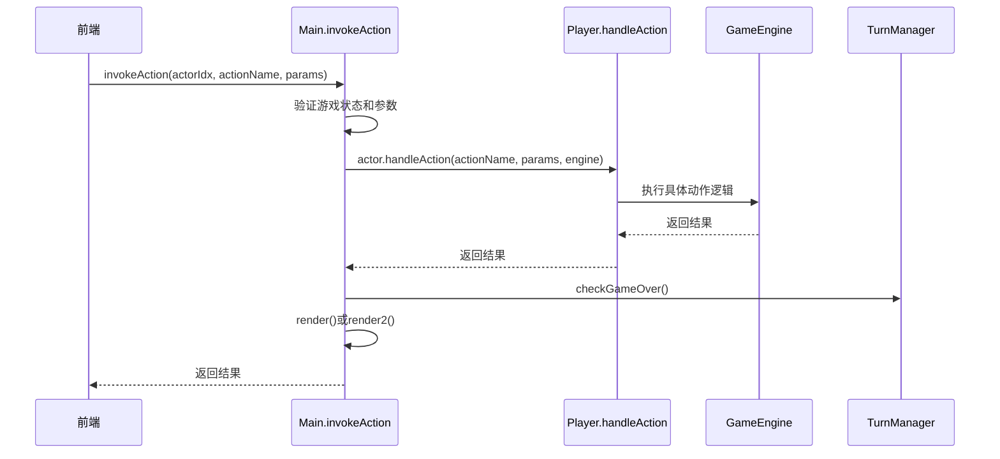
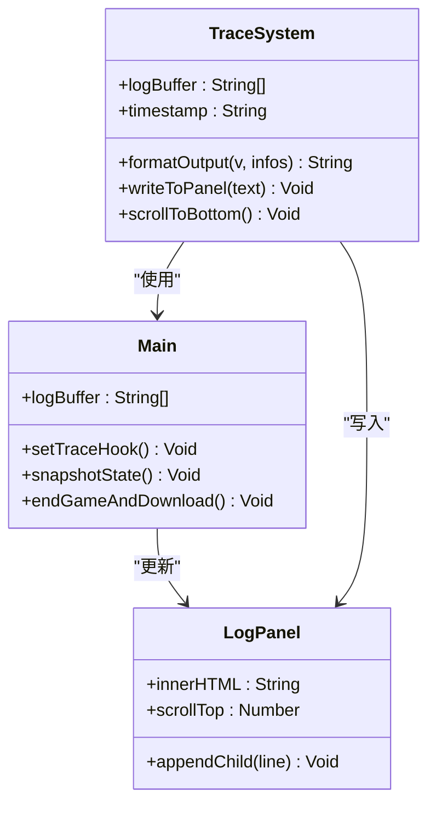
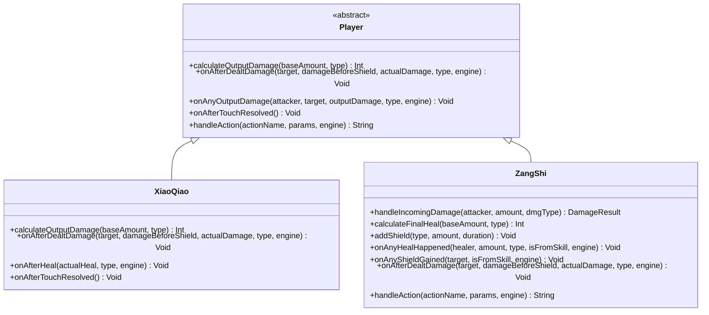
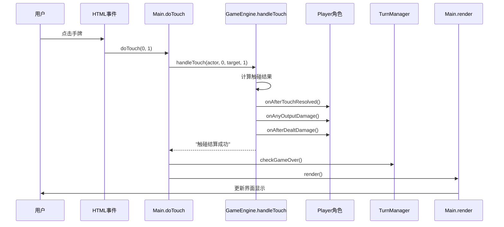
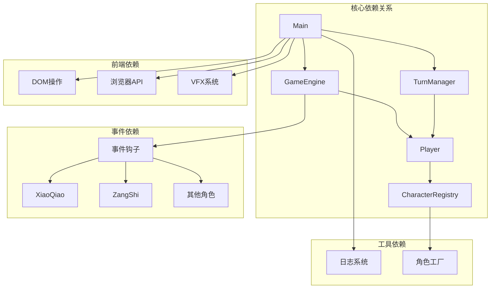

# 事件驱动架构

<cite>
**本文档引用的文件**
- [Main.hx](file://Main.hx)
- [GameEngine.hx](file://GameEngine.hx)
- [TurnManager.hx](file://TurnManager.hx)
- [Player.hx](file://character/Player.hx)
- [ZangShi.hx](file://character/ZangShi.hx)
- [XiaoQiao.hx](file://character/XiaoQiao.hx)
- [CharacterRegistry.hx](file://character/CharacterRegistry.hx)
- [game2-core.js](file://js/game2-core.js)
- [index.html](file://index.html)
- [index2.html](file://index2.html)
- [network.js](file://network.js)
</cite>

## 目录
1. [简介](#简介)
2. [项目结构](#项目结构)
3. [核心组件](#核心组件)
4. [架构概览](#架构概览)
5. [详细组件分析](#详细组件分析)
6. [依赖关系分析](#依赖关系分析)
7. [性能考虑](#性能考虑)
8. [故障排除指南](#故障排除指南)
9. [结论](#结论)

## 简介

指尖博弈采用事件驱动架构，通过松耦合的组件协作实现了复杂的实时对战系统。该架构以事件为核心驱动力，将用户交互事件、游戏逻辑事件和UI更新事件有机地串联起来，形成了完整的事件传播链路。

系统的核心设计理念是"事件总线 + 钩子机制"，通过GameEngine作为事件中枢，协调各个组件之间的通信。每个角色都可以通过钩子函数监听和响应特定的游戏事件，实现了高度的可扩展性和模块化设计。

## 项目结构

项目采用清晰的分层架构，主要分为以下几个层次：

**图表来源**
- [Main.hx:1-411](file://Main.hx#L1-L411)
- [GameEngine.hx:1-725](file://GameEngine.hx#L1-L725)
- [TurnManager.hx:1-232](file://TurnManager.hx#L1-L232)

**章节来源**
- [Main.hx:1-411](file://Main.hx#L1-L411)
- [GameEngine.hx:1-725](file://GameEngine.hx#L1-L725)
- [TurnManager.hx:1-232](file://TurnManager.hx#L1-L232)

## 核心组件

### Main控制器
Main类作为系统的中央控制器，承担着事件绑定、UI更新和系统协调的重要职责。

**事件绑定机制**：
- 用户交互事件：通过DOM事件监听器绑定按钮点击和触摸事件
- 游戏逻辑事件：通过invokeAction机制处理角色动作
- UI更新事件：通过render方法更新界面状态

**日志系统**：
- 重定向Haxe的trace系统，实现统一的日志输出
- 支持1v1和2v2两种日志显示模式
- 提供日志缓冲和批量刷新机制

**章节来源**
- [Main.hx:25-76](file://Main.hx#L25-L76)
- [Main.hx:274-293](file://Main.hx#L274-L293)
- [Main.hx:298-396](file://Main.hx#L298-L396)

### GameEngine引擎
GameEngine是系统的核心事件中枢，负责处理所有游戏逻辑和事件传播。

**事件通知系统**：
- notifyHealEvent：回血事件通知
- notifyShieldEvent：护盾事件通知  
- notifyOutputDamage：伤害输出事件通知
- notifyPoisonTick：毒伤事件通知
- notifyPoisonCleared：解毒事件通知
- notifyThunderTick：雷霆之怒事件通知

**伤害处理流程**：
1. 角色加成计算（calculateOutputDamage）
2. 攻击者Buff加成
3. 目标抗伤处理（handleIncomingDamage）
4. 触发攻击者钩子
5. 通知VFX系统

**章节来源**
- [GameEngine.hx:48-118](file://GameEngine.hx#L48-L118)
- [GameEngine.hx:137-233](file://GameEngine.hx#L137-L233)

### TurnManager回合管理器
TurnManager负责管理游戏回合流程和胜负判定。

**回合管理功能**：
- 回合开始检查（zeroTurns递减、强制手限制）
- 回合结束结算（毒伤、Buff衰减、护盾减少）
- 环形寻找下一个行动玩家
- 终局判定（单阵营胜利、平局）

**章节来源**
- [TurnManager.hx:15-25](file://TurnManager.hx#L15-L25)
- [TurnManager.hx:35-102](file://TurnManager.hx#L35-L102)
- [TurnManager.hx:110-190](file://TurnManager.hx#L110-L190)

### Player基础类
Player类定义了所有角色共享的事件钩子接口，是事件驱动架构的基础。

**钩子接口体系**：
- 出伤相关：calculateOutputDamage、onAfterDealtDamage
- 回血相关：calculateFinalHeal、onAfterHeal  
- 全场事件：onAnyHealHappened、onAnyShieldGained、onAnyOutputDamage
- 组合技能：tryOverrideComboEffect、onEnterZeroComboContext
- 生存机制：tryRevive、handleIncomingDamage

**章节来源**
- [Player.hx:30-182](file://character/Player.hx#L30-L182)
- [Player.hx:245-302](file://character/Player.hx#L245-L302)

## 架构概览

系统采用"事件驱动 + 策略模式"的设计，通过事件总线实现组件间的松耦合通信。

**图表来源**
- [Main.hx:274-293](file://Main.hx#L274-L293)
- [GameEngine.hx:418-468](file://GameEngine.hx#L418-L468)
- [TurnManager.hx:195-230](file://TurnManager.hx#L195-L230)

## 详细组件分析

### 事件绑定机制分析

#### doTouch触摸事件处理
doTouch方法是用户交互事件的核心入口，实现了完整的事件处理链路：

**图表来源**
- [Main.hx:274-293](file://Main.hx#L274-L293)

#### invokeAction通用动作派发机制
invokeAction提供了统一的动作处理入口，支持所有角色的主动技能：

**图表来源**
- [Main.hx:252-261](file://Main.hx#L252-L261)
- [Player.hx:180-182](file://character/Player.hx#L180-L182)

**章节来源**
- [Main.hx:252-261](file://Main.hx#L252-L261)
- [Main.hx:274-293](file://Main.hx#L274-L293)

### trace日志系统分析

trace日志系统作为事件传播的基础设施，实现了游戏状态的可视化追踪：

**图表来源**
- [Main.hx:56-75](file://Main.hx#L56-L75)
- [Main.hx:81-119](file://Main.hx#L81-L119)

**章节来源**
- [Main.hx:56-75](file://Main.hx#L56-L75)
- [Main.hx:81-119](file://Main.hx#L81-L119)

### 角色事件钩子系统

每个角色都可以通过重写Player类的钩子方法来响应特定的游戏事件：

**图表来源**
- [Player.hx:30-182](file://character/Player.hx#L30-L182)
- [XiaoQiao.hx:24-62](file://character/XiaoQiao.hx#L24-L62)
- [ZangShi.hx:38-165](file://character/ZangShi.hx#L38-L165)

**章节来源**
- [Player.hx:30-182](file://character/Player.hx#L30-L182)
- [XiaoQiao.hx:24-62](file://character/XiaoQiao.hx#L24-L62)
- [ZangShi.hx:38-165](file://character/ZangShi.hx#L38-L165)

### 事件传播流程示例

以下是一个完整的事件流转示例，展示了从用户输入到游戏响应的完整链路：

**图表来源**
- [index.html:178-223](file://index.html#L178-L223)
- [Main.hx:274-293](file://Main.hx#L274-L293)
- [GameEngine.hx:418-468](file://GameEngine.hx#L418-L468)

**章节来源**
- [index.html:178-223](file://index.html#L178-L223)
- [Main.hx:274-293](file://Main.hx#L274-L293)
- [GameEngine.hx:418-468](file://GameEngine.hx#L418-L468)

## 依赖关系分析

系统采用松耦合的设计原则，通过接口和抽象类实现组件间的解耦：

**图表来源**
- [Main.hx:11-12](file://Main.hx#L11-L12)
- [GameEngine.hx:18-43](file://GameEngine.hx#L18-L43)
- [TurnManager.hx:6-11](file://TurnManager.hx#L6-L11)

**章节来源**
- [Main.hx:11-12](file://Main.hx#L11-L12)
- [GameEngine.hx:18-43](file://GameEngine.hx#L18-L43)
- [TurnManager.hx:6-11](file://TurnManager.hx#L6-L11)

## 性能考虑

### 事件处理优化

1. **批量日志刷新**：通过logBuffer和requestAnimationFrame实现日志的批量刷新，避免频繁DOM操作
2. **事件钩子缓存**：角色的钩子方法在类级别定义，避免运行时查找开销
3. **条件检查优化**：在事件传播前进行必要的状态检查，避免不必要的计算

### 内存管理

1. **对象池模式**：使用数组和对象复用，减少垃圾回收压力
2. **事件监听器管理**：及时移除不需要的事件监听器，防止内存泄漏
3. **状态清理**：在回合结束时清理临时状态和事件记录

### 网络同步优化

1. **事件去重**：在网络传输中避免重复发送相同的事件
2. **延迟补偿**：通过时间戳和插值算法补偿网络延迟
3. **状态同步**：只传输必要的状态变更，而不是完整状态

## 故障排除指南

### 常见问题及解决方案

**问题1：事件不触发**
- 检查Main类中的事件绑定是否正确
- 确认GameEngine的事件通知方法调用
- 验证角色钩子方法的重写是否正确

**问题2：UI不更新**
- 检查render方法的调用时机
- 确认DOM元素的选择器是否正确
- 验证CSS样式是否影响显示

**问题3：日志异常**
- 检查trace系统的重定向配置
- 确认logBuffer的容量限制
- 验证日志面板的滚动机制

**章节来源**
- [Main.hx:56-75](file://Main.hx#L56-L75)
- [Main.hx:298-396](file://Main.hx#L298-L396)

## 结论

指尖博弈的事件驱动架构通过精心设计的事件系统，实现了高度模块化的游戏逻辑。该架构的主要优势包括：

1. **松耦合设计**：通过事件总线和钩子机制，各组件间保持低耦合
2. **可扩展性**：新的角色和功能可以通过钩子机制轻松集成
3. **可维护性**：清晰的事件流向和模块划分便于代码维护
4. **实时性**：高效的事件处理机制保证了游戏的流畅体验

该架构为实时对战游戏提供了一个优秀的参考模型，通过事件驱动的方式实现了复杂的交互逻辑，同时保持了系统的稳定性和可扩展性。对于类似的游戏开发项目，这种架构设计具有很高的借鉴价值。