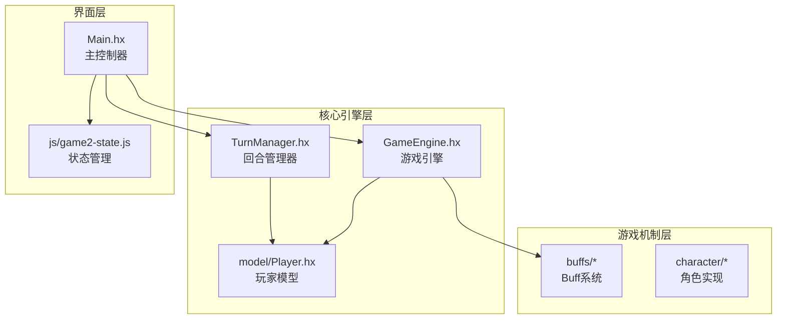
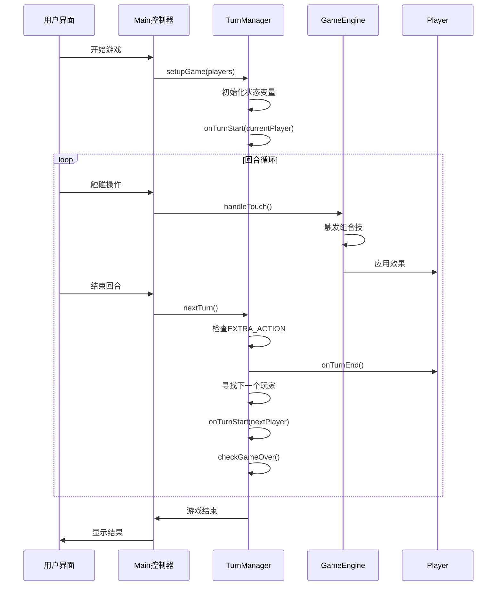
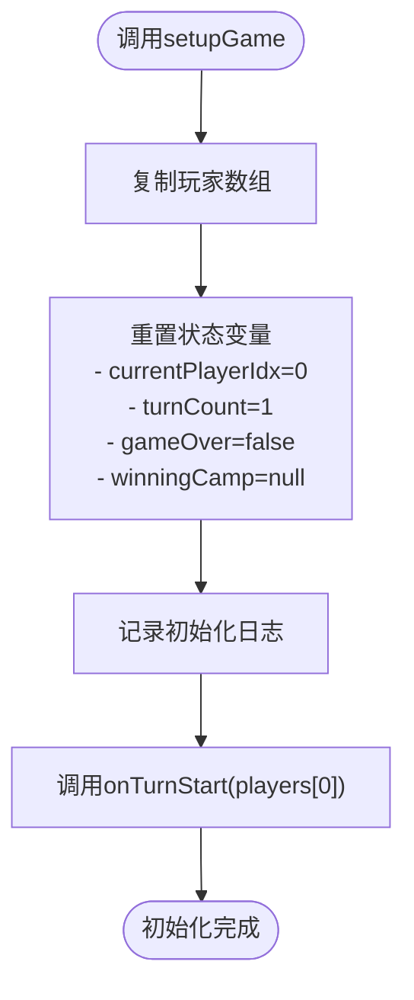
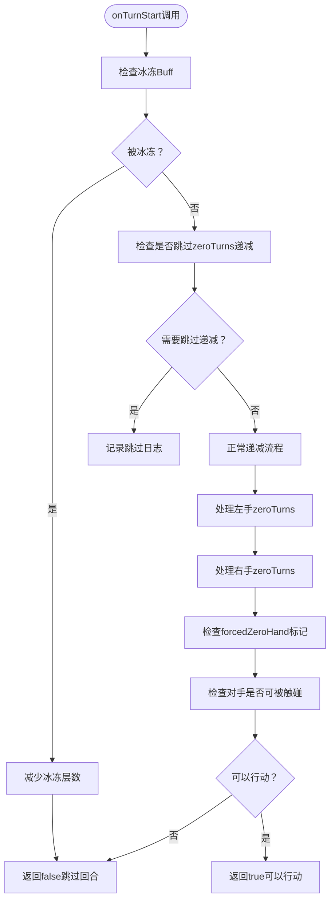
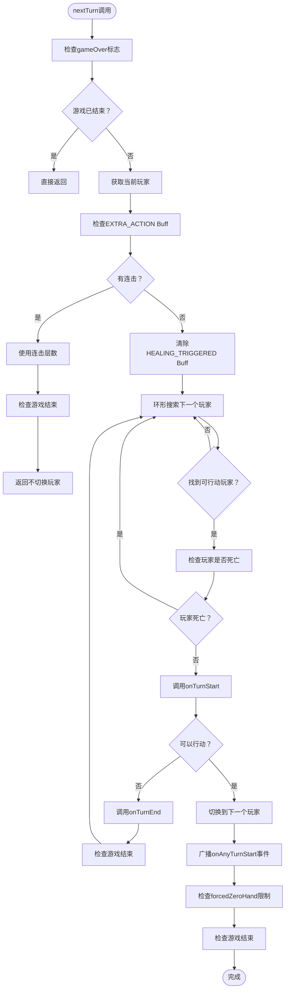
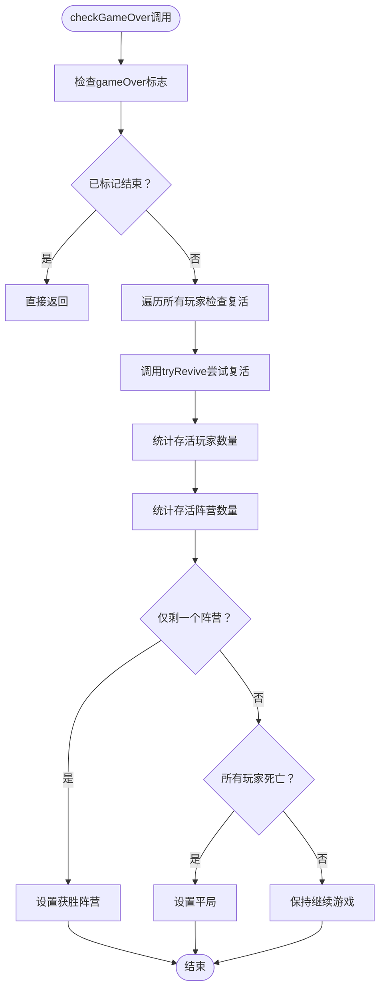
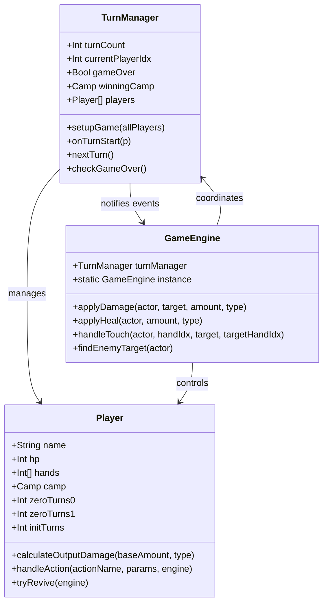
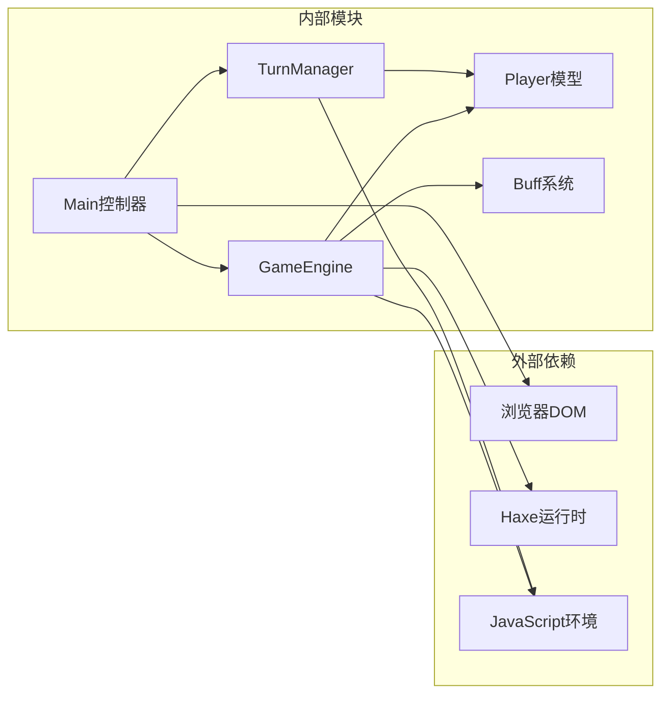

# 回合管理系统

<cite>
**本文档引用的文件**
- [TurnManager.hx](file://TurnManager.hx)
- [GameEngine.hx](file://GameEngine.hx)
- [Main.hx](file://Main.hx)
- [Player.hx](file://model/Player.hx)
- [ExtraActionBuff.hx](file://buffs/ExtraActionBuff.hx)
- [game2-state.js](file://js/game2-state.js)
</cite>

## 目录
1. [简介](#简介)
2. [项目结构](#项目结构)
3. [核心组件](#核心组件)
4. [架构概览](#架构概览)
5. [详细组件分析](#详细组件分析)
6. [依赖关系分析](#依赖关系分析)
7. [性能考量](#性能考量)
8. [故障排除指南](#故障排除指南)
9. [结论](#结论)

## 简介

指尖博弈的回合管理系统是一个精心设计的游戏机制核心，负责维护游戏的回合制对战体验。该系统通过TurnManager类实现了完整的回合管理功能，包括回合计数、当前玩家切换、游戏结束判定等核心机制。系统采用面向对象的设计模式，通过清晰的职责分离和事件驱动的方式，为玩家提供了公平、流畅的回合制对战体验。

## 项目结构

系统采用模块化架构，主要包含以下核心模块：

**图表来源**
- [TurnManager.hx:1-232](file://TurnManager.hx#L1-L232)
- [GameEngine.hx:1-725](file://GameEngine.hx#L1-L725)
- [Main.hx:1-411](file://Main.hx#L1-L411)

**章节来源**
- [TurnManager.hx:1-232](file://TurnManager.hx#L1-L232)
- [GameEngine.hx:1-725](file://GameEngine.hx#L1-L725)
- [Main.hx:1-411](file://Main.hx#L1-L411)

## 核心组件

### TurnManager类

TurnManager是回合管理系统的核心控制器，负责维护游戏状态和回合流程。其主要职责包括：

- **回合状态管理**：维护turnCount、currentPlayerIdx、gameOver等关键状态变量
- **玩家数组管理**：管理players数组，支持任意数量的玩家参与
- **回合流程控制**：协调回合开始、行动执行、回合结束的完整流程
- **终局判定**：检查游戏结束条件并确定获胜阵营

### GameEngine类

GameEngine作为游戏的核心引擎，提供战斗计算和效果处理能力：

- **伤害计算**：实现标准的伤害计算流程，包括角色加成、护盾抵消等
- **回血系统**：处理各种回血效果，包括解毒机制
- **组合技触发**：管理各种组合技能的效果触发
- **全局事件通知**：向所有玩家广播重要的游戏事件

### Player模型

Player类定义了游戏中所有角色的基础属性和行为：

- **基本属性**：HP、双手数值、阵营等
- **生命周期钩子**：提供多个生命周期事件的钩子函数
- **Buff管理**：维护Buff列表和护盾系统
- **行为接口**：定义角色行为的标准接口

**章节来源**
- [TurnManager.hx:6-13](file://TurnManager.hx#L6-L13)
- [GameEngine.hx:16-43](file://GameEngine.hx#L16-L43)
- [Player.hx:3-26](file://model/Player.hx#L3-L26)

## 架构概览

系统采用分层架构设计，各层职责明确，耦合度低：

**图表来源**
- [Main.hx:274-293](file://Main.hx#L274-L293)
- [TurnManager.hx:110-190](file://TurnManager.hx#L110-L190)
- [GameEngine.hx:418-468](file://GameEngine.hx#L418-L468)

## 详细组件分析

### TurnManager核心机制

#### 初始化流程（setupGame）

setupGame方法负责游戏的初始化，建立完整的回合管理系统：

**图表来源**
- [TurnManager.hx:15-25](file://TurnManager.hx#L15-L25)

#### 回合开始检查（onTurnStart）

onTurnStart方法在每个玩家回合开始时执行，确保回合的公平性和一致性：

**图表来源**
- [TurnManager.hx:35-102](file://TurnManager.hx#L35-L102)

#### 回合切换逻辑（nextTurn）

nextTurn方法实现了回合的自动切换，处理复杂的特殊情况：

**图表来源**
- [TurnManager.hx:110-190](file://TurnManager.hx#L110-L190)

#### 终局判定（checkGameOver）

checkGameOver方法实现了多阵营的终局判定逻辑：

**图表来源**
- [TurnManager.hx:195-230](file://TurnManager.hx#L195-L230)

### GameEngine协作关系

GameEngine与TurnManager通过紧密协作实现完整的战斗系统：

**图表来源**
- [TurnManager.hx:6-11](file://TurnManager.hx#L6-L11)
- [GameEngine.hx:16-43](file://GameEngine.hx#L16-L43)
- [Player.hx:3-26](file://model/Player.hx#L3-L26)

**章节来源**
- [TurnManager.hx:15-230](file://TurnManager.hx#L15-L230)
- [GameEngine.hx:418-591](file://GameEngine.hx#L418-L591)
- [Player.hx:328-350](file://model/Player.hx#L328-L350)

## 依赖关系分析

系统采用松耦合的设计，通过接口和事件实现模块间的通信：

**图表来源**
- [Main.hx:1-411](file://Main.hx#L1-L411)
- [TurnManager.hx:1-232](file://TurnManager.hx#L1-L232)
- [GameEngine.hx:1-725](file://GameEngine.hx#L1-L725)

### 关键依赖链

1. **Main → TurnManager**: 主控制器负责初始化和状态同步
2. **TurnManager → Player**: 管理玩家状态和行为
3. **GameEngine → Player**: 执行战斗计算和效果处理
4. **GameEngine → Buff**: 管理各种游戏效果
5. **TurnManager → GameEngine**: 获取游戏状态信息

**章节来源**
- [Main.hx:11-12](file://Main.hx#L11-L12)
- [TurnManager.hx:3-4](file://TurnManager.hx#L3-L4)
- [GameEngine.hx:3-14](file://GameEngine.hx#L3-L14)

## 性能考量

### 时间复杂度分析

- **setupGame**: O(n) - 复制玩家数组
- **onTurnStart**: O(n) - 检查对手可触碰状态
- **nextTurn**: O(n²) - 最坏情况下可能需要遍历所有玩家多次
- **checkGameOver**: O(n) - 统计存活玩家和阵营

### 内存优化策略

1. **对象池模式**: 通过重用Buff和Shield对象减少内存分配
2. **延迟初始化**: 只在需要时创建复杂的计算结构
3. **状态压缩**: 使用紧凑的数据结构存储玩家状态

### 缓存机制

- **玩家索引缓存**: Main类中缓存玩家索引以提高查找效率
- **组合技缓存**: GameEngine缓存组合技计算结果
- **UI状态缓存**: 避免重复的DOM操作

## 故障排除指南

### 常见问题诊断

#### 回合卡顿问题

**症状**: 回合切换缓慢或界面无响应

**可能原因**:
1. 玩家数量过多导致遍历开销增大
2. 复杂的Buff效果计算
3. UI渲染阻塞

**解决方案**:
- 优化onTurnStart中的对手检查逻辑
- 减少不必要的UI更新
- 实施异步处理机制

#### 游戏状态异常

**症状**: 游戏状态不一致或逻辑错误

**可能原因**:
1. Buff层数计算错误
2. 零手倒计时状态异常
3. 复活机制冲突

**解决方案**:
- 检查Buff的onTurnEnd实现
- 验证zeroTurns的递减逻辑
- 确保tryRevive的幂等性

#### 性能监控

建议使用以下监控指标：
- 回合切换时间
- UI渲染帧率
- 内存使用情况
- GC暂停时间

**章节来源**
- [TurnManager.hx:139-190](file://TurnManager.hx#L139-L190)
- [GameEngine.hx:137-233](file://GameEngine.hx#L137-L233)

## 结论

指尖博弈的回合管理系统展现了优秀的软件工程实践，通过清晰的架构设计和完善的机制实现，为玩家提供了流畅、公平的回合制对战体验。系统的主要优势包括：

1. **模块化设计**: 各组件职责明确，便于维护和扩展
2. **事件驱动**: 通过钩子和事件实现松耦合的组件交互
3. **可扩展性**: 支持多种角色和游戏机制的灵活组合
4. **性能优化**: 采用多种优化策略确保良好的用户体验

未来可以考虑的改进方向：
- 实现更智能的状态缓存机制
- 增强AI对战功能
- 优化移动端性能表现
- 扩展更多游戏模式

该系统为回合制游戏开发提供了优秀的参考范例，其设计理念和实现细节值得深入学习和借鉴。