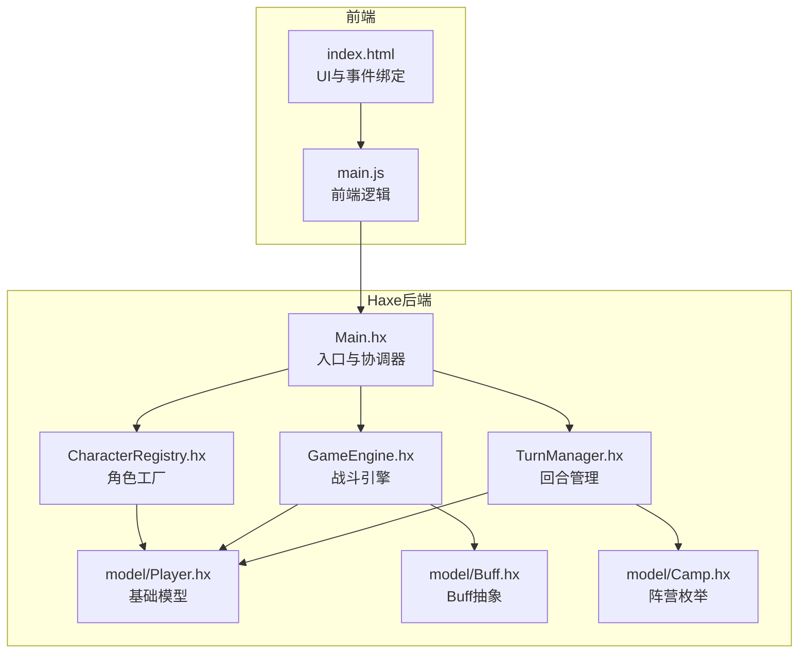
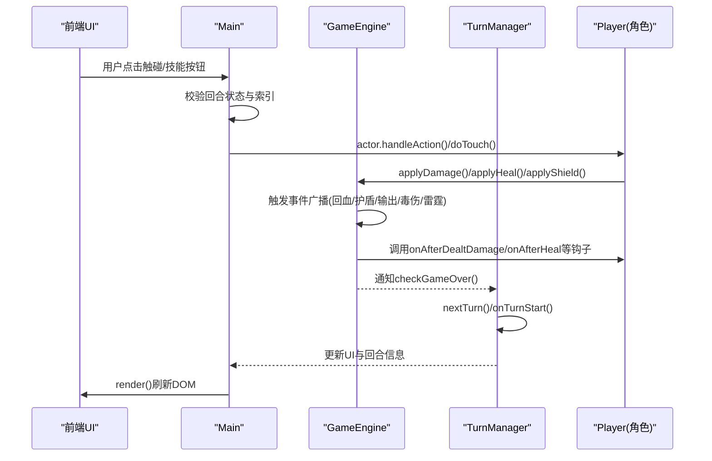
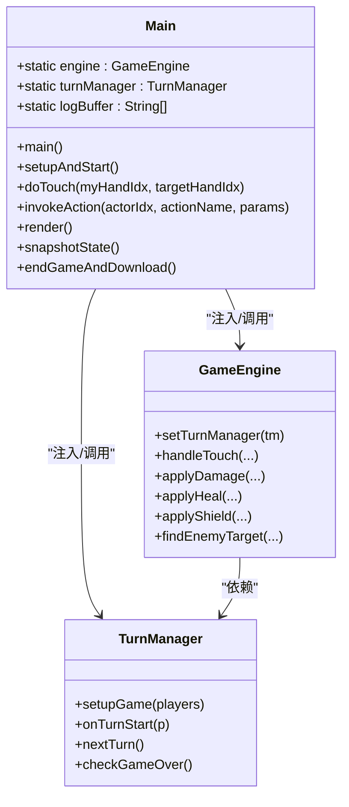
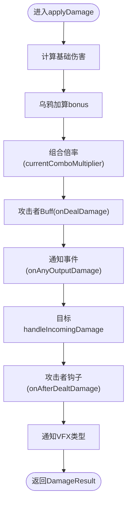
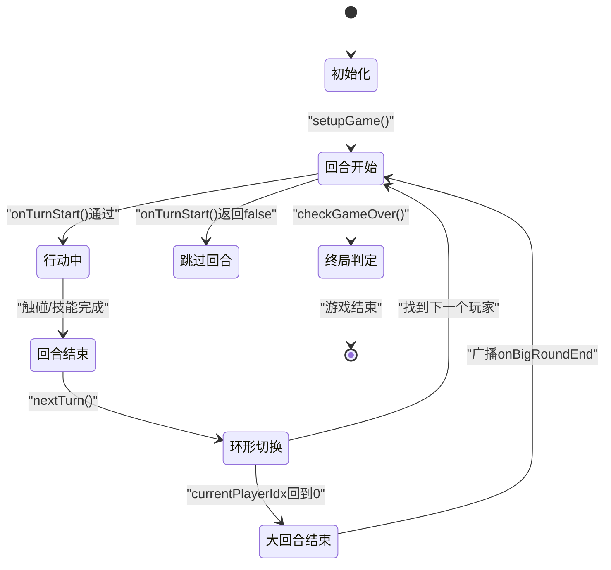
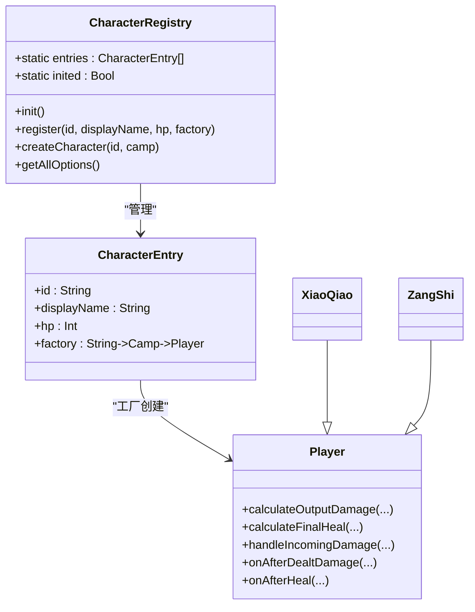
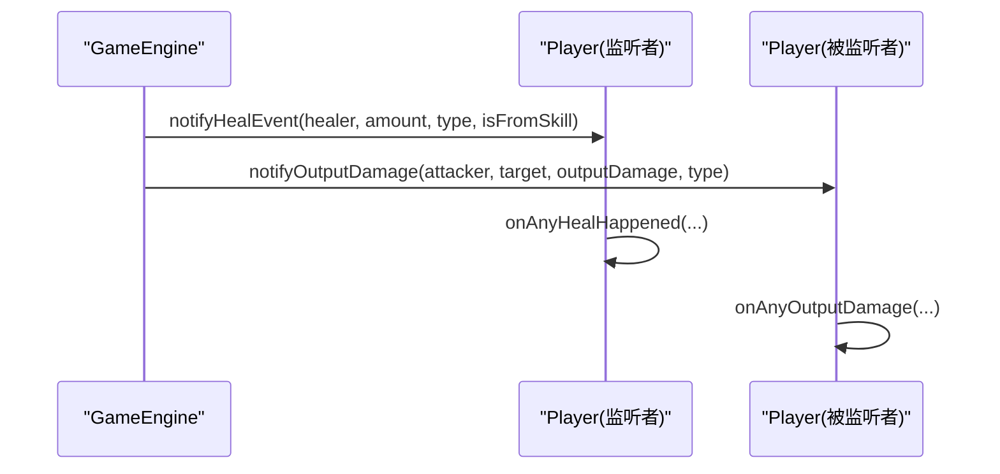
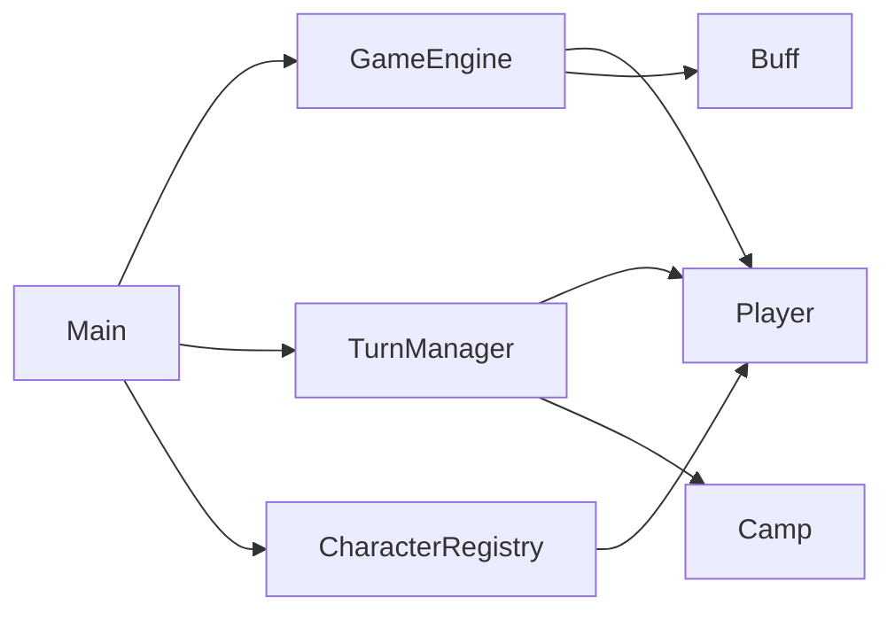

# 核心系统架构

<cite>
**本文档引用的文件**
- [Main.hx](file://Main.hx)
- [GameEngine.hx](file://GameEngine.hx)
- [TurnManager.hx](file://TurnManager.hx)
- [CharacterRegistry.hx](file://character/CharacterRegistry.hx)
- [Player.hx](file://model/Player.hx)
- [XiaoQiao.hx](file://character/XiaoQiao.hx)
- [ZangShi.hx](file://character/ZangShi.hx)
- [Buff.hx](file://model/Buff.hx)
- [Camp.hx](file://model/Camp.hx)
- [index.html](file://index.html)
</cite>

## 目录
1. [简介](#简介)
2. [项目结构](#项目结构)
3. [核心组件](#核心组件)
4. [架构总览](#架构总览)
5. [详细组件分析](#详细组件分析)
6. [依赖关系分析](#依赖关系分析)
7. [性能考虑](#性能考虑)
8. [故障排除指南](#故障排除指南)
9. [结论](#结论)

## 简介
本文件针对“指尖博弈”的核心系统架构进行全面技术文档化，重点阐释以下设计理念与实现机制：
- Main类作为应用入口与协调器，负责UI绑定、事件分发、渲染与日志管理
- GameEngine作为核心战斗引擎，负责伤害计算、回血、护盾、事件广播与组合技触发
- TurnManager负责回合管理、状态控制与胜负判定
- 角色工厂模式与CharacterRegistry的注册机制
- 事件驱动架构在用户交互、游戏逻辑与UI更新中的完整流程
- 三个核心组件之间的协作关系与数据流向

## 项目结构
项目采用模块化组织，围绕“模型-角色-引擎-界面”分层设计：
- model层：通用实体与类型（Player、Buff、Camp等）
- character层：具体角色实现（继承自Player）
- buffs层：各类Buff实现
- 核心引擎：GameEngine、TurnManager
- 应用入口：Main（Haxe）与前端HTML/JS（index.html、main.js）

**图表来源**
- [Main.hx:1-411](file://Main.hx#L1-L411)
- [GameEngine.hx:1-725](file://GameEngine.hx#L1-L725)
- [TurnManager.hx:1-232](file://TurnManager.hx#L1-L232)
- [CharacterRegistry.hx:1-82](file://character/CharacterRegistry.hx#L1-L82)
- [Player.hx:1-398](file://model/Player.hx#L1-L398)
- [Buff.hx:1-30](file://model/Buff.hx#L1-L30)
- [Camp.hx:1-8](file://model/Camp.hx#L1-L8)
- [index.html:1-200](file://index.html#L1-L200)

**章节来源**
- [Main.hx:25-76](file://Main.hx#L25-L76)
- [index.html:60-168](file://index.html#L60-L168)

## 核心组件
- Main：应用入口与协调器，负责：
  - 注入TurnManager到GameEngine
  - 动态填充角色下拉框
  - 绑定开始/结束回合/下载日志按钮
  - 日志追踪与UI渲染
  - 触碰事件与动作分发入口
- GameEngine：核心战斗引擎，负责：
  - 伤害/回血/护盾的标准流程
  - 事件广播（回血、护盾、输出、毒伤、雷霆）
  - 组合技触发与倍率计算
  - 帮抗快照与结算
  - 敌方目标查找与抗伤位解析器
- TurnManager：回合管理器，负责：
  - 初始化与回合开始检查
  - 零手倒计时与强制手限制
  - 回合结束结算与环形切换
  - 大回合事件广播与胜负判定
- CharacterRegistry：角色工厂，负责：
  - 角色注册与元数据管理
  - 工厂方法创建角色实例
  - 前端角色选项提供

**章节来源**
- [Main.hx:9-76](file://Main.hx#L9-L76)
- [GameEngine.hx:16-43](file://GameEngine.hx#L16-L43)
- [TurnManager.hx:6-25](file://TurnManager.hx#L6-L25)
- [CharacterRegistry.hx:17-80](file://character/CharacterRegistry.hx#L17-L80)

## 架构总览
系统采用“事件驱动 + 工厂模式 + 分层模型”的架构：
- 事件驱动：GameEngine提供事件广播接口，角色通过钩子订阅并响应
- 工厂模式：CharacterRegistry集中管理角色注册与创建
- 分层模型：Player为基类，各角色继承并重写特定钩子与行为
- 前后端分离：前端负责UI与交互，后端负责业务逻辑与状态管理

**图表来源**
- [Main.hx:252-293](file://Main.hx#L252-L293)
- [GameEngine.hx:137-233](file://GameEngine.hx#L137-L233)
- [TurnManager.hx:110-190](file://TurnManager.hx#L110-L190)
- [Player.hx:56-62](file://model/Player.hx#L56-L62)

## 详细组件分析

### Main类：应用入口与协调器
- 职责与设计要点：
  - 静态实例化GameEngine与TurnManager，并建立双向引用
  - 通过CharacterRegistry动态填充角色下拉框
  - 绑定开始游戏、结束回合、下载日志按钮事件
  - 重定向trace输出到UI日志面板
  - 提供invokeAction与doTouch统一入口，分发到角色与引擎
  - 提供render方法，将内存状态同步到DOM
- 关键交互：
  - setupAndStart：读取前端选择，通过工厂创建角色并初始化回合
  - doTouch：执行触碰计算，触发GameEngine.handleTouch并检查胜负
  - render：刷新双方状态、Buff、护盾、自定义显示与按钮

**图表来源**
- [Main.hx:9-76](file://Main.hx#L9-L76)
- [GameEngine.hx:41-43](file://GameEngine.hx#L41-L43)
- [TurnManager.hx:15-25](file://TurnManager.hx#L15-L25)

**章节来源**
- [Main.hx:25-192](file://Main.hx#L25-L192)
- [Main.hx:252-396](file://Main.hx#L252-L396)

### GameEngine：核心战斗引擎
- 职责与设计要点：
  - 标准伤害/回血/护盾流程，支持事件广播
  - 组合技触发（双九、双八、双七、双六、双五、双四、双二/三、双一、双零）
  - 帮抗机制：快照、捕获与结算
  - 敌方目标查找与抗伤位解析器
  - 攻击者/目标Buff钩子链路（onDealDamage/onTakeDamage）
- 关键流程：
  - applyDamage：角色加成→攻击者Buff→事件广播→目标抗伤→钩子回调→VFX通知
  - applyHeal：角色回血倍率→doHealing→onAfterHeal→事件广播→VFX通知
  - applyShield：坦克加成→角色override→事件广播
  - handleTouch：合法性校验→数学运算→0手倒计时→组合特效→钩子回调

**图表来源**
- [GameEngine.hx:137-233](file://GameEngine.hx#L137-L233)
- [GameEngine.hx:262-325](file://GameEngine.hx#L262-L325)

**章节来源**
- [GameEngine.hx:137-290](file://GameEngine.hx#L137-L290)
- [GameEngine.hx:418-468](file://GameEngine.hx#L418-L468)
- [GameEngine.hx:616-685](file://GameEngine.hx#L616-L685)

### TurnManager：回合管理与状态控制
- 职责与设计要点：
  - setupGame：初始化玩家、回合计数与阵营
  - onTurnStart：冰冻跳过、零手倒计时、强制手限制、对手可触碰性检查
  - nextTurn：双八再动、回合结束结算、环形寻找下一玩家、大回合事件广播
  - checkGameOver：复活检查、阵营存活统计、胜负判定
- 关键机制：
  - 零手倒计时与forcedZeroHand提示
  - EXTRA_ACTION与HEALING_TRIGGERED等临时状态的生命周期管理
  - 大回合事件广播（onBigRoundEnd）

**图表来源**
- [TurnManager.hx:15-25](file://TurnManager.hx#L15-L25)
- [TurnManager.hx:35-102](file://TurnManager.hx#L35-L102)
- [TurnManager.hx:110-190](file://TurnManager.hx#L110-L190)
- [TurnManager.hx:195-230](file://TurnManager.hx#L195-L230)

**章节来源**
- [TurnManager.hx:35-190](file://TurnManager.hx#L35-L190)
- [TurnManager.hx:195-230](file://TurnManager.hx#L195-L230)

### 角色工厂模式与CharacterRegistry
- 设计理念：
  - 通过CharacterEntry集中管理角色元数据（id、displayName、hp、factory）
  - init()中注册所有角色，register()统一注册入口
  - createCharacter()根据id选择对应factory创建实例
  - getAllOptions()为前端提供下拉选项
- 角色实现示例：
  - XiaoQiao：物伤/回血×1.5、回血反伤、护盾升级、被动护盾
  - ZangShi：物伤减半、反弹、回血×2.5、护盾×2、草莓蛋糕机制

**图表来源**
- [CharacterRegistry.hx:17-80](file://character/CharacterRegistry.hx#L17-L80)
- [Player.hx:34-62](file://model/Player.hx#L34-L62)
- [XiaoQiao.hx:17-96](file://character/XiaoQiao.hx#L17-L96)
- [ZangShi.hx:19-202](file://character/ZangShi.hx#L19-L202)

**章节来源**
- [CharacterRegistry.hx:22-80](file://character/CharacterRegistry.hx#L22-L80)
- [XiaoQiao.hx:17-96](file://character/XiaoQiao.hx#L17-L96)
- [ZangShi.hx:19-202](file://character/ZangShi.hx#L19-L202)

### 事件驱动架构在游戏中的应用
- 事件类型与广播：
  - 回血事件：notifyHealEvent（含isFromSkill过滤）
  - 护盾事件：notifyShieldEvent
  - 输出事件：notifyOutputDamage（用于孙悟空x值更新）
  - 毒伤事件：notifyPoisonTick/notifyPoisonCleared
  - 雷霆事件：notifyThunderTick
- 角色钩子：
  - onAnyHealHappened/onAnyShieldGained/onAnyOutputDamage/onAnyPoisonTick/onAnyPoisonCleared/onAnyThunderTick/onAnyTurnStart
- 典型流程：
  - GameEngine.applyDamage/applyHeal/applyShield内部触发相应事件
  - 各角色通过钩子订阅并执行自定义逻辑（如小乔回血反伤、藏师蛋糕计数）

**图表来源**
- [GameEngine.hx:56-118](file://GameEngine.hx#L56-L118)
- [Player.hx:84-119](file://model/Player.hx#L84-L119)

**章节来源**
- [GameEngine.hx:56-118](file://GameEngine.hx#L56-L118)
- [Player.hx:84-129](file://model/Player.hx#L84-L129)

## 依赖关系分析
- Main依赖：
  - GameEngine：注入与调用
  - TurnManager：注入与调用
  - CharacterRegistry：角色创建与选项
- GameEngine依赖：
  - Player：伤害/回血/护盾核心逻辑
  - Buff：攻击者/目标Buff钩子链
  - TurnManager：事件广播与目标查找
- TurnManager依赖：
  - Player：回合开始/结束钩子与状态
  - Camp：阵营判定

**图表来源**
- [Main.hx:11-12](file://Main.hx#L11-L12)
- [GameEngine.hx:16-18](file://GameEngine.hx#L16-L18)
- [TurnManager.hx:6-11](file://TurnManager.hx#L6-L11)
- [CharacterRegistry.hx:17-20](file://character/CharacterRegistry.hx#L17-L20)

**章节来源**
- [Main.hx:11-12](file://Main.hx#L11-L12)
- [GameEngine.hx:16-18](file://GameEngine.hx#L16-L18)
- [TurnManager.hx:6-11](file://TurnManager.hx#L6-L11)

## 性能考虑
- 事件广播优化：GameEngine在applyDamage/applyHeal中仅对存活玩家广播，避免无效调用
- Buff链路：在applyDamage中对攻击者Buff使用快照/还原策略，避免重复消耗
- 护盾排序：按持续时间排序优先抵消，减少遍历成本
- UI渲染：Main.render按需更新DOM，避免全量重绘
- 帮抗快照：仅在必要时启用_damageRecording，降低额外开销

[本节为通用指导，无需特定文件分析]

## 故障排除指南
- 触碰失败：
  - 检查目标是否阵亡或手为0
  - 核对角色isValidTouch合法性（如另一只手0且寿命耗尽）
- 回合跳过：
  - 确认对手是否存在非0手可触碰
  - 检查冰冻等异常状态
- 胜负判定异常：
  - 确认checkGameOver是否被正确调用
  - 检查复活机制与阵营存活统计
- UI不更新：
  - 确认render()是否被调用
  - 检查logBuffer与DOM节点是否存在

**章节来源**
- [Main.hx:420-426](file://Main.hx#L420-L426)
- [TurnManager.hx:78-99](file://TurnManager.hx#L78-L99)
- [TurnManager.hx:195-230](file://TurnManager.hx#L195-L230)
- [Main.hx:298-396](file://Main.hx#L298-L396)

## 结论
本系统通过清晰的分层与职责划分，实现了高度可扩展的角色系统与稳定的战斗机制。Main作为协调器连接前后端，GameEngine提供统一的战斗逻辑与事件体系，TurnManager保障回合与状态的正确流转。角色工厂模式与事件驱动架构使得新增角色与功能的成本极低，便于长期演进与扩展。