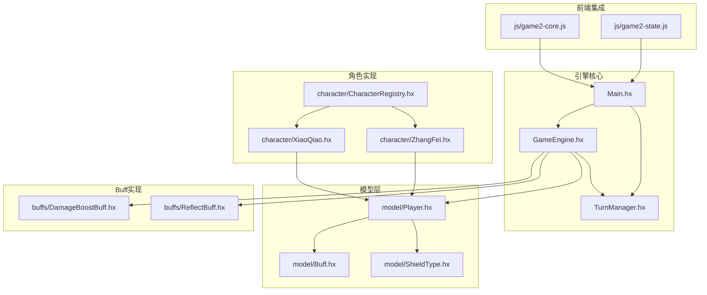
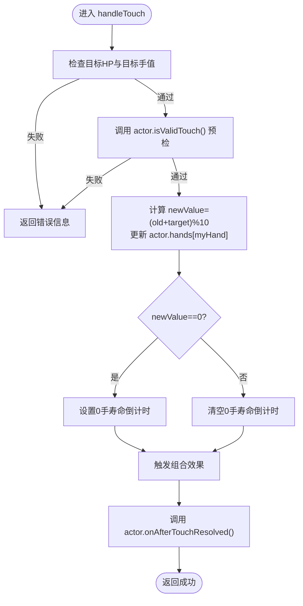
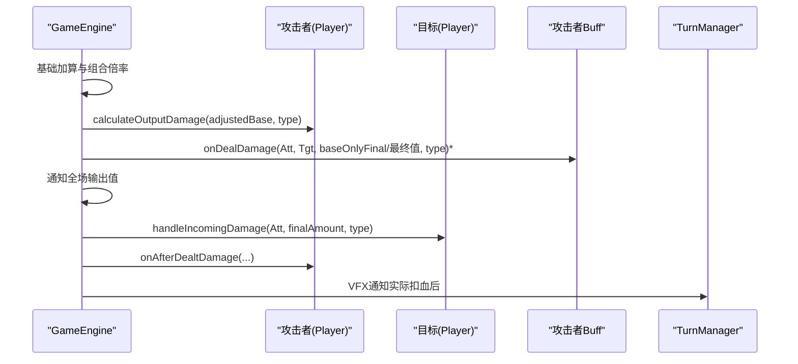
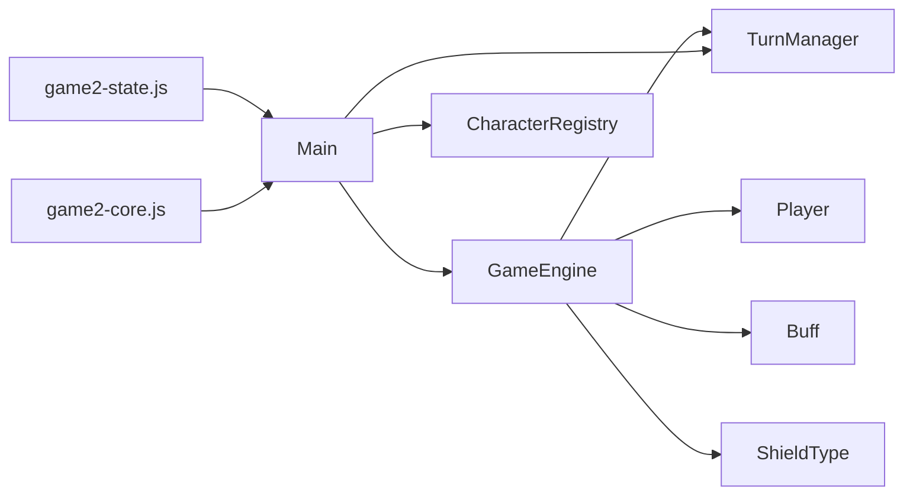

# 游戏引擎核心

<cite>
**本文档引用的文件**
- [GameEngine.hx](file://GameEngine.hx)
- [TurnManager.hx](file://TurnManager.hx)
- [Main.hx](file://Main.hx)
- [model/Player.hx](file://model/Player.hx)
- [character/ZhangFei.hx](file://character/ZhangFei.hx)
- [character/XiaoQiao.hx](file://character/XiaoQiao.hx)
- [character/CharacterRegistry.hx](file://character/CharacterRegistry.hx)
- [model/Buff.hx](file://model/Buff.hx)
- [model/ShieldType.hx](file://model/ShieldType.hx)
- [buffs/DamageBoostBuff.hx](file://buffs/DamageBoostBuff.hx)
- [buffs/ReflectBuff.hx](file://buffs/ReflectBuff.hx)
- [js/game2-state.js](file://js/game2-state.js)
- [js/game2-core.js](file://js/game2-core.js)
</cite>

## 目录
1. [简介](#简介)
2. [项目结构](#项目结构)
3. [核心组件](#核心组件)
4. [架构总览](#架构总览)
5. [详细组件分析](#详细组件分析)
6. [依赖关系分析](#依赖关系分析)
7. [性能考虑](#性能考虑)
8. [故障排除指南](#故障排除指南)
9. [结论](#结论)

## 简介
本文件为“指尖博弈”的游戏引擎核心技术文档，重点围绕 GameEngine 类作为核心战斗引擎的设计理念与实现机制展开，涵盖以下关键主题：
- handleTouch 方法的指尖碰撞算法与参数处理
- 数字相加取模10的战斗原理与组合效果触发机制
- engine.handleTouch 的参数处理、碰撞验证逻辑、伤害计算流程与特殊效果判定
- tankResolver 抗伤位解析器的作用与配置方式
- 与 TurnManager 的协作关系及角色技能统一调度
- 性能优化建议与常见问题解决方案

## 项目结构
该项目采用模块化组织，核心文件分布如下：
- 引擎核心：GameEngine.hx（战斗引擎）、TurnManager.hx（回合管理）、Main.hx（入口与桥接）
- 模型层：model/Player.hx（角色模型）、model/Buff.hx（通用Buff基类）、model/ShieldType.hx（护盾类型枚举）
- 角色实现：character/*（角色子类，如张飞、小乔等）
- Buff实现：buffs/*（具体Buff，如伤害翻倍、反弹盾等）
- 前端集成：js/*（2v2状态与核心逻辑、在线对战等）



图表来源
- [GameEngine.hx:16-725](file://GameEngine.hx#L16-L725)
- [TurnManager.hx:6-232](file://TurnManager.hx#L6-L232)
- [Main.hx:9-411](file://Main.hx#L9-L411)
- [model/Player.hx:3-398](file://model/Player.hx#L3-L398)
- [character/ZhangFei.hx:22-273](file://character/ZhangFei.hx#L22-L273)
- [character/XiaoQiao.hx:17-96](file://character/XiaoQiao.hx#L17-L96)
- [character/CharacterRegistry.hx:17-82](file://character/CharacterRegistry.hx#L17-L82)
- [model/Buff.hx:3-30](file://model/Buff.hx#L3-L30)
- [model/ShieldType.hx:3-8](file://model/ShieldType.hx#L3-L8)
- [buffs/DamageBoostBuff.hx:6-20](file://buffs/DamageBoostBuff.hx#L6-L20)
- [buffs/ReflectBuff.hx:16-43](file://buffs/ReflectBuff.hx#L16-L43)
- [js/game2-state.js:222-241](file://js/game2-state.js#L222-L241)
- [js/game2-core.js:76-107](file://js/game2-core.js#L76-L107)

章节来源
- [GameEngine.hx:16-725](file://GameEngine.hx#L16-L725)
- [TurnManager.hx:6-232](file://TurnManager.hx#L6-L232)
- [Main.hx:9-411](file://Main.hx#L9-L411)

## 核心组件
本节概述引擎的关键组件及其职责：
- GameEngine：核心战斗引擎，负责触碰计算、伤害与回血流程、护盾处理、组合效果触发、事件广播、帮抗系统、抗伤位解析器集成。
- TurnManager：回合管理器，负责回合开始/结束、跳过判定、大回合事件、胜负判定。
- Main：前端桥接入口，负责角色工厂、动作分发、渲染、日志输出、2v2抗伤位解析器注入。
- Player 及其子类：角色抽象与具体实现，提供伤害倍率、回血倍率、组合效果覆盖、钩子接口等。
- Buff 系列：通用增益/减益效果，提供造成伤害前/承受伤害前的钩子。
- ShieldType：护盾类型枚举，决定护盾对不同伤害类型的阻挡能力。

章节来源
- [GameEngine.hx:16-725](file://GameEngine.hx#L16-L725)
- [TurnManager.hx:6-232](file://TurnManager.hx#L6-L232)
- [Main.hx:9-411](file://Main.hx#L9-L411)
- [model/Player.hx:3-398](file://model/Player.hx#L3-L398)
- [model/Buff.hx:3-30](file://model/Buff.hx#L3-L30)
- [model/ShieldType.hx:3-8](file://model/ShieldType.hx#L3-L8)

## 架构总览
引擎采用“面向对象 + 钩子 + 事件广播”的设计模式：
- GameEngine 作为中央协调者，封装标准伤害/回血/护盾流程，并在关键节点触发角色钩子与全局事件。
- Player 抽象出角色行为，子类通过重写钩子实现差异化玩法（如小乔的回血反伤、张飞的模态切换）。
- TurnManager 负责回合节奏控制与胜负判定，与 GameEngine 协作推进游戏进程。
- 前端通过 Main 暴露的动作入口与渲染接口，配合 JS 层实现2v2抗伤位解析器注入与在线对战。

```mermaid
sequenceDiagram
participant UI as "前端界面"
participant Main as "Main"
participant Engine as "GameEngine"
participant TM as "TurnManager"
participant Actor as "攻击者(Player)"
participant Target as "目标(Player)"
UI->>Main : 用户点击触碰
Main->>Engine : handleTouch(actor, myHand, target, targetHand, damageTarget?)
Engine->>Actor : isValidTouch() 预检
Engine->>Engine : 计算 newValue=(old+target)%10<br/>更新 actor.hands[myHand]=newValue
Engine->>Engine : 触发组合效果(processBasicEffect)
Engine->>Actor : onAfterTouchResolved()
Engine->>TM : checkGameOver()
Main->>UI : render()
Note over Engine,Actor : 伤害计算与事件广播在 applyDamage/applyHeal/applyShield 中完成
```

图表来源
- [Main.hx:274-293](file://Main.hx#L274-L293)
- [GameEngine.hx:418-468](file://GameEngine.hx#L418-L468)
- [TurnManager.hx:195-230](file://TurnManager.hx#L195-L230)

## 详细组件分析

### GameEngine：核心战斗引擎
GameEngine 是引擎的心脏，负责：
- 触碰计算与组合效果触发：handleTouch、processBasicEffect、triggerDoubleStar、triggerZeroCombo
- 标准伤害/回血/护盾流程：applyDamage、applyRawDamage、applyHeal、applyRawHeal、applyShield
- 事件广播：notifyOutputDamage、notifyHealEvent、notifyShieldEvent、notifyPoisonTick、notifyPoisonCleared、notifyThunderTick
- 帮抗系统：snapshotHelpTankVictim、captureHelpTankDamage、resolveHelpTank
- 抗伤位解析器：tankResolver 静态注入、findEnemyTarget

#### handleTouch：指尖碰撞算法与组合触发
- 参数处理
  - actor：攻击者
  - handIdx：攻击者手索引（0左/1右）
  - target：目标玩家
  - targetHandIdx：目标手索引（0左/1右）
  - damageTarget：伤害承受者（2v2抗伤位，1v1默认与target相同）
- 碰撞验证逻辑
  - 目标HP<=0或目标手为0则拒绝
  - 调用 actor.isValidTouch() 进行通用预检（角色可重写以实现策略，如孙悟空的[0,2]补偿）
- 数学公式与手位更新
  - newValue = (oldValue + targetValue) % 10
  - 更新 actor.hands[handIdx]，并记录0手寿命倒计时
- 组合效果判定
  - 双子星：双手相等时触发（如双九、双八等）
  - 零组合：任一手为0时触发（如[0,6]、[0,4]、[0,7]、[0,x]破军、御守等）
  - 特殊组合：如6出现且旧值非6时触发回血
- 碰手结算钩子
  - 触发 actor.onAfterTouchResolved()，用于角色清理状态或重置计数



图表来源
- [GameEngine.hx:418-468](file://GameEngine.hx#L418-L468)
- [GameEngine.hx:470-591](file://GameEngine.hx#L470-L591)

章节来源
- [GameEngine.hx:418-468](file://GameEngine.hx#L418-L468)
- [GameEngine.hx:470-591](file://GameEngine.hx#L470-L591)

#### applyDamage：标准伤害流程与事件广播
- 基础加算与组合倍率
  - 先处理目标身上的“基础加算buff”（如乌鸦+20），再应用 currentComboMultiplier（如双九1.5^N）
- 角色加成与攻击者增伤Buff
  - actor.calculateOutputDamage 计算最终伤害
  - 攻击者 onDealDamage Buff 提前应用（用快照/还原避免重复消耗），并在最终伤害上真正消耗
- 事件广播
  - 通知场上所有玩家本次“输出”最终值（用于孙悟空根据全场输出更新x）
- 乌鸦回血
  - 计算 finalAmount 与 baseOnlyFinal 差值，触发乌鸦回血
- 帮抗记录
  - 若当前正在记录，将本次伤害类型与数值加入 lastTouchDamageLog
- 抗伤结算
  - 调用 target.handleIncomingDamage，返回 damageBeforeShield 与 actualDamage
- 攻击者钩子
  - 触发 actor.onAfterDealtDamage，传递 damageBeforeShield 与 actualDamage
- VFX通知
  - 仅在实际扣血后通知伤害类型



图表来源
- [GameEngine.hx:137-233](file://GameEngine.hx#L137-L233)

章节来源
- [GameEngine.hx:137-233](file://GameEngine.hx#L137-L233)

#### applyHeal / applyRawHeal：回血流程与解毒机制
- 标准回血
  - actor.calculateFinalHeal 计算最终回血量
  - doHealing 执行回血落地，含解毒逻辑（RECOVERY类型）
- 解毒机制
  - RECOVERY 类型读取 pendingHealing 并累计溢出
  - 每20点回血可解一层毒，最多解至0层
  - 溢出部分存储到 pendingHealing，下次回血继续抵消
- SUPPLY 类型
  - 直接落地，不解毒、不读溢出
- 事件广播与VFX通知
  - 通知场上回血事件，区分 SUPPLY 与 RECOVERY 类型

章节来源
- [GameEngine.hx:295-320](file://GameEngine.hx#L295-L320)
- [GameEngine.hx:364-409](file://GameEngine.hx#L364-L409)

#### applyShield：护盾获取与坦克加成
- 坦脆流坦克护盾加成
  - 若 actor.tankFormationBonus 为真：
    - 物理/法术盾升级为物法盾，厚度×1.5，持续+1
- 统一 addShield 接口
  - 子类可重写 addShield 改变厚度/持续时间
- 事件广播
  - 通知场上“获取护盾”事件

章节来源
- [GameEngine.hx:327-346](file://GameEngine.hx#L327-L346)

#### 帮抗系统：snapshot/capture/resolve
- snapshotHelpTankVictim
  - 快照 victim 的 HP 与护盾列表，用于“被接管伤害”后恢复
- captureHelpTankDamage
  - 冻结本次 handleTouch 记录的伤害快照，避免后续触碰清空
- resolveHelpTank
  - 恢复 victim 到攻击前状态
  - 将快照中每笔伤害×1.5打给 helper（仅走 helper 自身抗伤）
  - 清理快照

章节来源
- [GameEngine.hx:616-685](file://GameEngine.hx#L616-L685)

#### tankResolver 抗伤位解析器
- 作用
  - 2v2场景下，JS 层注入函数，将默认目标（第一个存活敌人）重定向到抗伤位
- 配置方式
  - 通过 Main.setTankResolver(fn) 注入（@:keep 暴露）
  - JS 层在 game2-state.js 中定义并调用 Main.setTankResolver(fn)
- 查找逻辑
  - GameEngine.findEnemyTarget 优先返回默认目标
  - 若存在 tankResolver，则以 (actorIdx, defaultIdx) 调用，返回有效且存活的目标索引

章节来源
- [GameEngine.hx:687-723](file://GameEngine.hx#L687-L723)
- [Main.hx:21-23](file://Main.hx#L21-L23)
- [js/game2-state.js:222-241](file://js/game2-state.js#L222-L241)

### TurnManager：回合管理与胜负判定
- onTurnStart
  - 递减0手寿命倒计时（可被角色跳过，如孙悟空[0,2]延寿）
  - 检查是否因对手全0而跳过回合
  - 清理上回合 [x,6] 回血触发标记
- nextTurn
  - 双八再动（EXTRA_ACTION）判定
  - 回合结束结算：毒伤、Buff流逝、护盾衰减
  - 环形寻找下一个可行动玩家，广播“某玩家开始行动”
  - 大回合检测：每回到0即为新大回合，触发 onBigRoundEnd
- checkGameOver
  - 复活检查（如大乔复活甲）
  - 多人阵营终局判定：单阵营存活或无人存活

章节来源
- [TurnManager.hx:35-102](file://TurnManager.hx#L35-L102)
- [TurnManager.hx:110-190](file://TurnManager.hx#L110-L190)
- [TurnManager.hx:195-230](file://TurnManager.hx#L195-L230)

### Player 与角色：钩子与组合效果覆盖
- isValidTouch：通用触碰预检（基类默认规则：另一只0手寿命耗尽且本回合未动过则禁止）
- calculateOutputDamage / calculateFinalHeal：角色加成（如小乔物伤×1.5、回血×1.5）
- onAfterDealtDamage / onAfterHeal：造伤/回血后触发（如小乔回血反伤、张飞模态2第二刀）
- tryOverrideComboEffect：角色覆盖默认组合效果（如孙悟空[0,2]）
- onEnterZeroComboContext / onExitZeroComboContext：零组合上下文标记（如法师在[0,x]时翻倍）
- handleIncomingDamage：完整抗伤逻辑（攻击者增伤→自身拦截→护盾→落血）

章节来源
- [model/Player.hx:340-350](file://model/Player.hx#L340-L350)
- [model/Player.hx:322-325](file://model/Player.hx#L322-L325)
- [character/XiaoQiao.hx:25-62](file://character/XiaoQiao.hx#L25-L62)
- [character/ZhangFei.hx:95-159](file://character/ZhangFei.hx#L95-L159)

### Buff 与护盾：增益/减益与抗伤
- Buff 基类：提供 onDealDamage、onTakeDamage 等钩子
- DamageBoostBuff：造成伤害前翻倍（物理/真实）
- ReflectBuff：承受物理伤害时反弹一半给攻击者，自身免疫本次伤害（用 GameEngine.isReflecting 防止无限反弹）

章节来源
- [model/Buff.hx:3-30](file://model/Buff.hx#L3-L30)
- [buffs/DamageBoostBuff.hx:6-20](file://buffs/DamageBoostBuff.hx#L6-L20)
- [buffs/ReflectBuff.hx:16-43](file://buffs/ReflectBuff.hx#L16-L43)
- [model/ShieldType.hx:3-8](file://model/ShieldType.hx#L3-L8)

## 依赖关系分析
- GameEngine 依赖
  - TurnManager：回合推进、胜负判定
  - Player：角色行为与钩子
  - Buff：攻击者增伤与目标拦截
  - ShieldType：护盾类型判定
- Main 依赖
  - CharacterRegistry：角色工厂
  - GameEngine/TurnManager：动作分发与渲染
- 前端依赖
  - game2-state.js：2v2抗伤位解析器注入
  - game2-core.js：触碰流程、帮抗检测、在线对战



图表来源
- [GameEngine.hx:18-43](file://GameEngine.hx#L18-L43)
- [Main.hx:11-27](file://Main.hx#L11-L27)
- [character/CharacterRegistry.hx:66-72](file://character/CharacterRegistry.hx#L66-L72)
- [js/game2-state.js:222-241](file://js/game2-state.js#L222-L241)
- [js/game2-core.js:76-107](file://js/game2-core.js#L76-L107)

章节来源
- [GameEngine.hx:18-43](file://GameEngine.hx#L18-L43)
- [Main.hx:11-27](file://Main.hx#L11-L27)
- [character/CharacterRegistry.hx:66-72](file://character/CharacterRegistry.hx#L66-L72)

## 性能考虑
- 事件广播与钩子链
  - applyDamage 中对每个角色广播“输出”事件，注意避免在监听器中再次触发重型计算
- 护盾排序与清理
  - Player.handleIncomingDamage 对可用护盾按持续时间排序，建议在护盾数量较多时保持有序插入/删除，减少排序成本
- 组合倍率与快照
  - currentComboMultiplier 与 _skipAttackerDealBuffs 快照/还原机制避免重复消耗，提升性能稳定性
- 帮抗快照
  - resolveHelpTank 对快照逐笔伤害×1.5，建议在大量伤害时合并计算，减少多次调用

[本节为一般性指导，不直接分析具体文件]

## 故障排除指南
- 触碰被拒绝
  - 目标已阵亡或目标手为0：检查目标状态与输入参数
  - isValidTouch 预检失败：角色可能处于0手寿命耗尽且本回合未动过另一只手
- 组合效果未触发
  - 双子星/零组合需满足特定条件（如双手相等、任一手为0、6出现等）
  - 角色覆盖默认组合效果：检查 tryOverrideComboEffect 是否返回 true
- 回血异常
  - RECOVERY 类型解毒逻辑：每20点回血解一层毒，不足时溢出累计
  - SUPPLY 类型不解毒：直接落地
- 护盾无效
  - 护盾类型与伤害类型匹配：物理/法术/物法/真实护盾对不同伤害类型有不同的阻挡能力
- 反弹无限循环
  - 使用 GameEngine.isReflecting 守卫，确保反弹造成的伤害不会再次触发反弹
- 2v2抗伤位不生效
  - 确认 Main.setTankResolver(fn) 已正确注入，且 JS 层函数返回有效索引

章节来源
- [GameEngine.hx:418-468](file://GameEngine.hx#L418-L468)
- [GameEngine.hx:137-233](file://GameEngine.hx#L137-L233)
- [GameEngine.hx:364-409](file://GameEngine.hx#L364-L409)
- [model/Player.hx:294-325](file://model/Player.hx#L294-L325)
- [buffs/ReflectBuff.hx:22-41](file://buffs/ReflectBuff.hx#L22-L41)
- [js/game2-state.js:222-241](file://js/game2-state.js#L222-L241)

## 结论
GameEngine 通过“面向对象 + 钩子 + 事件广播”的架构，实现了高度可扩展的战斗系统。handleTouch 将指尖碰撞与组合效果统一到清晰的算法框架中，结合 TurnManager 的回合节奏与胜负判定，形成完整的对战体验。tankResolver 为2v2抗伤位提供了灵活的解析器注入机制，便于前端与引擎协同工作。通过对 Buff、护盾与角色钩子的精心设计，引擎既保证了规则一致性，又为角色差异化玩法提供了充分空间。