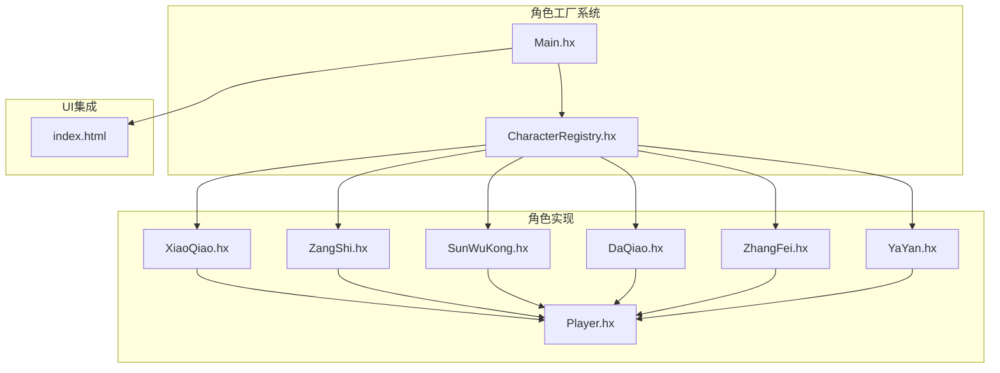
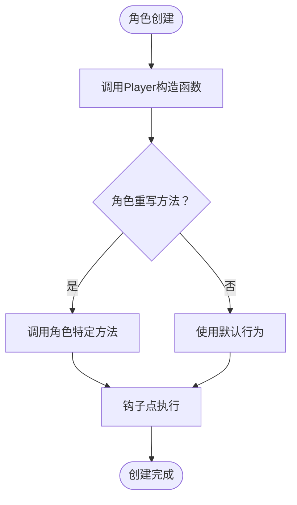
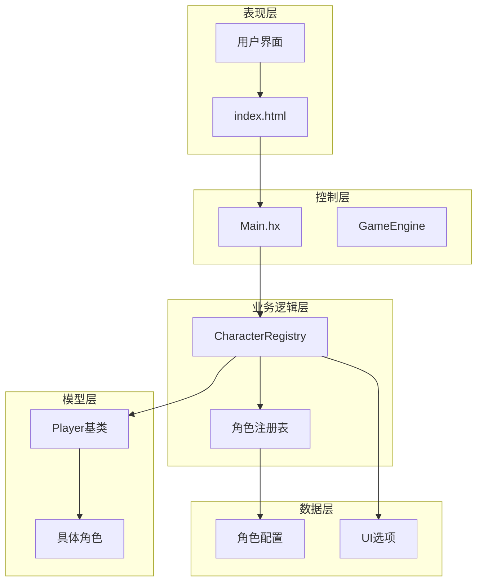
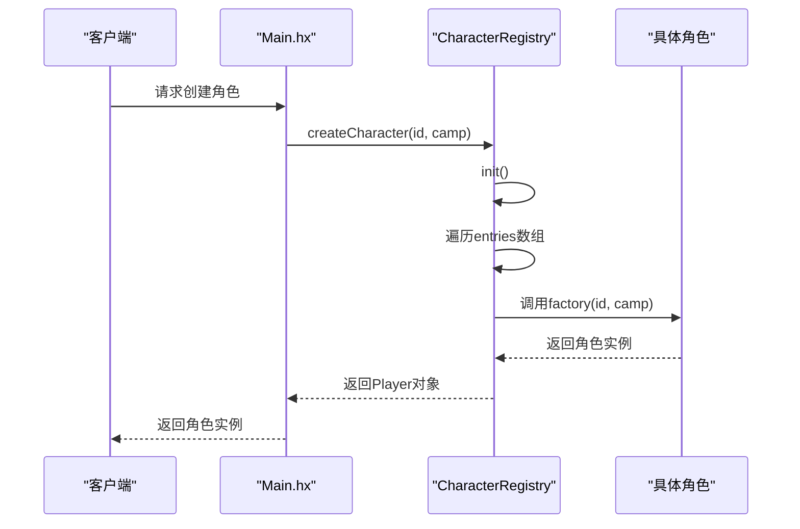
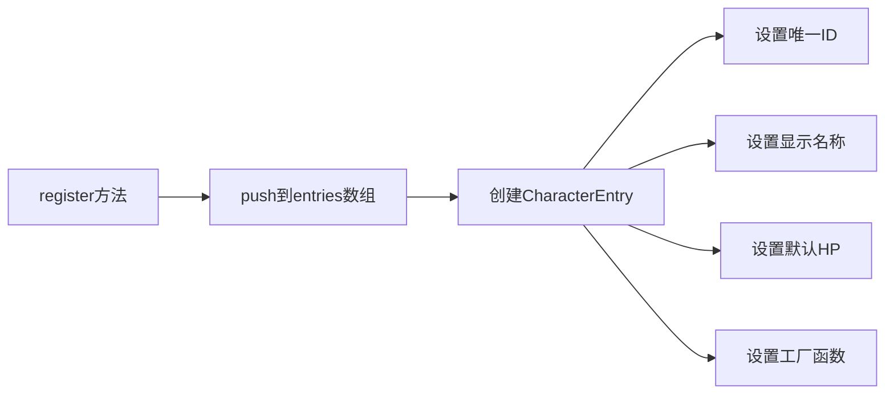
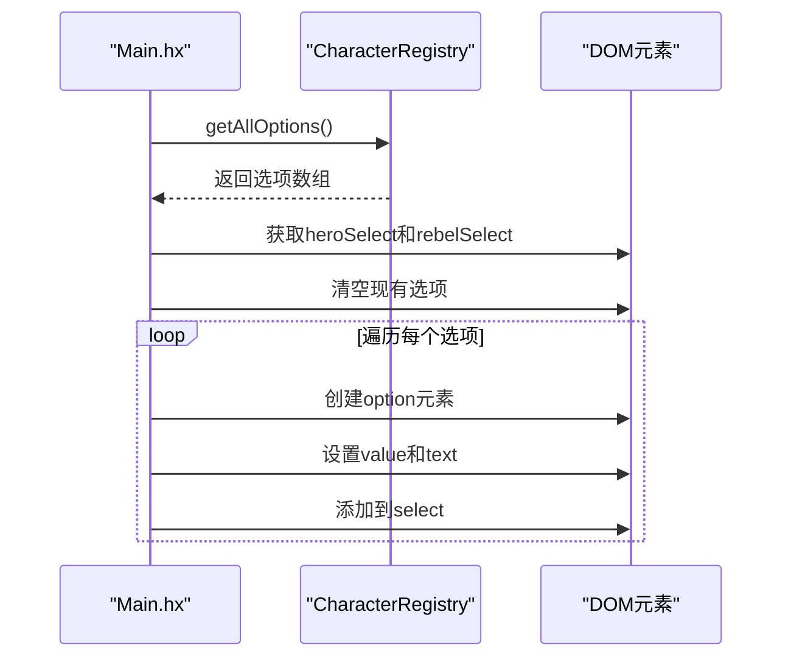
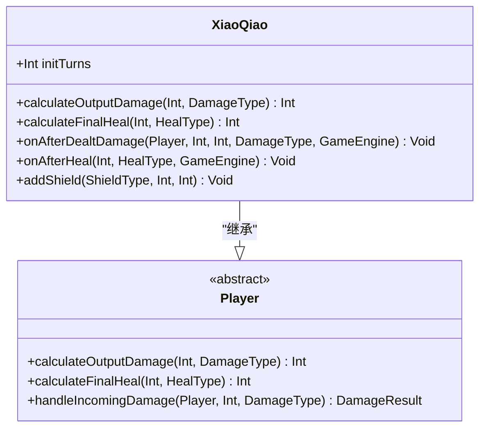
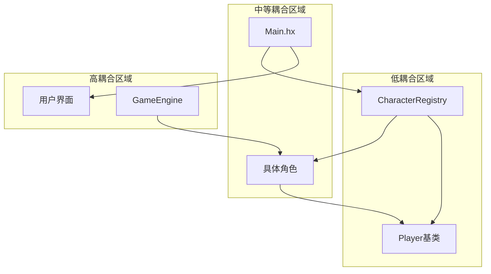

# 角色工厂系统

<cite>
**本文档引用的文件**
- [CharacterRegistry.hx](file://character/CharacterRegistry.hx)
- [Main.hx](file://Main.hx)
- [Player.hx](file://model/Player.hx)
- [XiaoQiao.hx](file://character/XiaoQiao.hx)
- [ZangShi.hx](file://character/ZangShi.hx)
- [SunWuKong.hx](file://character/SunWuKong.hx)
- [DaQiao.hx](file://character/DaQiao.hx)
- [ZhangFei.hx](file://character/ZhangFei.hx)
- [YaYan.hx](file://character/YaYan.hx)
- [index.html](file://index.html)
</cite>

## 目录
1. [简介](#简介)
2. [项目结构](#项目结构)
3. [核心组件](#核心组件)
4. [架构概览](#架构概览)
5. [详细组件分析](#详细组件分析)
6. [依赖关系分析](#依赖关系分析)
7. [性能考虑](#性能考虑)
8. [故障排除指南](#故障排除指南)
9. [结论](#结论)

## 简介

指尖博弈的角色工厂系统是一个基于工厂模式设计的游戏架构组件，负责统一管理11种不同角色的创建和配置。该系统通过CharacterRegistry类实现了角色注册机制、动态角色创建和UI选项管理，为游戏提供了高度可扩展的角色管理系统。

该工厂系统的核心优势在于：
- **统一管理**：所有角色通过单一注册中心进行管理
- **动态创建**：支持通过字符串ID动态创建角色实例
- **配置分离**：角色元数据与具体实现分离
- **易于扩展**：新增角色只需一行注册代码
- **类型安全**：编译时类型检查确保系统稳定性

## 项目结构

角色工厂系统主要分布在以下目录结构中：



**图表来源**
- [CharacterRegistry.hx:1-82](file://character/CharacterRegistry.hx#L1-L82)
- [Main.hx:1-411](file://Main.hx#L1-L411)

**章节来源**
- [CharacterRegistry.hx:1-82](file://character/CharacterRegistry.hx#L1-L82)
- [Main.hx:1-411](file://Main.hx#L1-L411)

## 核心组件

### CharacterRegistry类

CharacterRegistry是整个角色工厂系统的核心，实现了工厂模式的标准实现：

#### 数据结构设计

```mermaid
classDiagram
class CharacterEntry {
+String id
+String displayName
+Int hp
+factory(String, Camp) -> Player
}
class CharacterRegistry {
-CharacterEntry[] entries
-Bool inited
+init() void
+register(String, String, Int, String->Camp->Player) void
+createCharacter(String, Camp) Player
+getAllOptions() {id, displayName}[]
}
CharacterRegistry --> CharacterEntry : "管理"
```

**图表来源**
- [CharacterRegistry.hx:10-15](file://character/CharacterRegistry.hx#L10-L15)
- [CharacterRegistry.hx:17-82](file://character/CharacterRegistry.hx#L17-L82)

#### 工厂模式实现

CharacterRegistry采用静态工厂模式，通过以下关键方法实现：

1. **注册机制** (`register`方法)：将角色元数据注册到entries数组
2. **初始化控制** (`init`方法)：确保只初始化一次
3. **动态创建** (`createCharacter`方法)：根据ID创建角色实例
4. **选项管理** (`getAllOptions`方法)：提供UI下拉框选项

**章节来源**
- [CharacterRegistry.hx:17-82](file://character/CharacterRegistry.hx#L17-L82)

### Player基类

所有角色都继承自Player基类，提供了统一的接口和钩子机制：

#### 钩子接口设计



**图表来源**
- [Player.hx:21-26](file://model/Player.hx#L21-L26)
- [Player.hx:36-47](file://model/Player.hx#L36-L47)

**章节来源**
- [Player.hx:1-398](file://model/Player.hx#L1-L398)

## 架构概览

角色工厂系统的整体架构采用分层设计，实现了关注点分离：



**图表来源**
- [Main.hx:25-31](file://Main.hx#L25-L31)
- [CharacterRegistry.hx:22-60](file://character/CharacterRegistry.hx#L22-L60)

### 角色ID映射关系

系统维护了11种角色的ID映射关系：

| 角色ID | 显示名称 | 类型 | 默认HP |
|--------|----------|------|--------|
| xiaoqiao | 🌸 小乔 (半肉 360HP) | 半肉 | 360 |
| zangshi | 🛡️ 藏师 (坦克 660HP) | 坦克 | 660 |
| fashi | ⚡ 法师 (攻击 160HP) | 攻击 | 160 |
| sunwukong | 🐒 孙悟空 (半肉 260HP) | 半肉 | 260 |
| daqiao | 🌸 大乔 (半肉 120HP) | 半肉 | 120 |
| renzhe | 🥷 忍者 (半肉 300HP) | 半肉 | 300 |
| zhangfei | 🐗 张飞 (坦克 560HP) | 坦克 | 560 |
| yinyangshi | ☯️ 阴阳师 (半肉 240HP) | 半肉 | 240 |
| yangdali | 💪 杨大力 (沙包 1000HP) | 沙包 | 1000 |
| yayan | 🦅 鸦眼 (输出 140HP) | 输出 | 140 |
| zhaoyun | 🐉 赵云 (半肉 200HP) | 半肉 | 200 |

**章节来源**
- [CharacterRegistry.hx:26-57](file://character/CharacterRegistry.hx#L26-L57)

## 详细组件分析

### CharacterRegistry工厂实现

#### 初始化流程



**图表来源**
- [CharacterRegistry.hx:66-72](file://character/CharacterRegistry.hx#L66-L72)
- [Main.hx:197-199](file://Main.hx#L197-L199)

#### 角色注册机制

每个角色通过register方法注册到工厂系统中：



**图表来源**
- [CharacterRegistry.hx:62-64](file://character/CharacterRegistry.hx#L62-L64)

**章节来源**
- [CharacterRegistry.hx:22-60](file://character/CharacterRegistry.hx#L22-L60)

### 角色创建流程

#### createCharacter方法分析

createCharacter方法实现了完整的角色创建流程：

1. **初始化检查**：确保工厂已初始化
2. **ID匹配**：遍历entries查找匹配的ID
3. **工厂调用**：调用对应的工厂函数创建实例
4. **默认回退**：如果ID不存在，返回默认角色

#### getAllOptions方法

getAllOptions方法为UI提供下拉框选项：

```mermaid
flowchart TD
Start([调用getAllOptions]) --> Init[init()确保初始化]
Init --> Map[遍历entries数组]
Map --> Extract[提取{id, displayName}]
Extract --> Return[返回选项数组]
Return --> End([完成])
```

**图表来源**
- [CharacterRegistry.hx:77-80](file://character/CharacterRegistry.hx#L77-L80)

**章节来源**
- [CharacterRegistry.hx:66-80](file://character/CharacterRegistry.hx#L66-L80)

### 角色工厂与Main类的集成

#### populateCharacterSelects方法

populateCharacterSelects方法展示了工厂系统如何与UI集成：



**图表来源**
- [Main.hx:227-240](file://Main.hx#L227-L240)

#### setupAndStart方法

setupAndStart方法演示了工厂在游戏启动时的应用：

```mermaid
flowchart TD
Start([setupAndStart调用]) --> GetSelects[获取heroSelect和rebelSelect]
GetSelects --> CreateHero[createCharacter(heroSelect.value, HERO)]
CreateHero --> CreateRebel[createCharacter(rebelSelect.value, REBEL)]
CreateRebel --> SetupGame[setupGame([p1, p2])]
SetupGame --> Render[render()]
Render --> End([游戏开始])
```

**图表来源**
- [Main.hx:170-192](file://Main.hx#L170-L192)

**章节来源**
- [Main.hx:227-240](file://Main.hx#L227-L240)
- [Main.hx:170-192](file://Main.hx#L170-L192)

### 具体角色实现分析

#### 小乔 (XiaoQiao) - 半肉角色

小乔展示了工厂模式如何支持角色特定功能：



**图表来源**
- [XiaoQiao.hx:17-96](file://character/XiaoQiao.hx#L17-L96)
- [Player.hx:36-62](file://model/Player.hx#L36-L62)

#### 藏师 (ZangShi) - 坦克角色

藏师展示了复杂的工厂模式应用：

```mermaid
flowchart TD
FactoryCall[工厂调用] --> NewPlayer[new ZangShi(id, name, camp)]
NewPlayer --> SuperCall[super(id, name, 660, camp)]
SuperCall --> Instance[返回ZangShi实例]
Instance --> Methods[重写方法]
Methods --> HandleDamage[handleIncomingDamage]
Methods --> CalculateHeal[calculateFinalHeal]
Methods --> AddShield[addShield]
Methods --> CustomLogic[自定义逻辑]
```

**图表来源**
- [ZangShi.hx:24-26](file://character/ZangShi.hx#L24-L26)

**章节来源**
- [XiaoQiao.hx:17-96](file://character/XiaoQiao.hx#L17-L96)
- [ZangShi.hx:19-202](file://character/ZangShi.hx#L19-L202)

## 依赖关系分析

### 组件耦合度分析



**图表来源**
- [CharacterRegistry.hx:3-4](file://character/CharacterRegistry.hx#L3-L4)
- [Main.hx:3-4](file://Main.hx#L3-L4)

### 依赖注入模式

系统采用了依赖注入的设计模式：

1. **工厂注入**：Main.hx通过CharacterRegistry.createCharacter注入角色创建能力
2. **UI注入**：populateCharacterSelects方法注入UI选项
3. **引擎注入**：GameEngine通过静态变量注入全局状态

**章节来源**
- [CharacterRegistry.hx:3-4](file://character/CharacterRegistry.hx#L3-L4)
- [Main.hx:3-4](file://Main.hx#L3-L4)

## 性能考虑

### 工厂模式性能特性

1. **延迟初始化**：init()方法确保只有在需要时才初始化
2. **缓存策略**：entries数组在内存中缓存所有角色元数据
3. **时间复杂度**：createCharacter为O(n)查找，getAllOptions为O(n)遍历
4. **空间复杂度**：存储所有角色元数据，空间复杂度为O(n)

### 优化建议

1. **ID索引优化**：可以考虑使用Map<String, CharacterEntry>替代Array提高查找效率
2. **懒加载**：可以实现按需加载角色工厂函数
3. **对象池**：对于频繁创建销毁的角色实例，可以考虑对象池模式

## 故障排除指南

### 常见问题及解决方案

#### 角色ID不存在

**问题**：createCharacter返回默认角色而非期望角色
**原因**：传入的ID不在注册表中
**解决方案**：检查角色ID拼写，确保在init()中正确注册

#### UI选项不显示

**问题**：角色下拉框为空
**原因**：populateCharacterSelects方法未正确调用
**解决方案**：检查main()方法中的populateCharacterSelects调用

#### 角色创建失败

**问题**：角色实例创建异常
**原因**：工厂函数实现错误或参数传递问题
**解决方案**：检查register方法中的工厂函数实现

**章节来源**
- [CharacterRegistry.hx:66-72](file://character/CharacterRegistry.hx#L66-L72)
- [Main.hx:227-240](file://Main.hx#L227-L240)

## 结论

角色工厂系统通过工厂模式成功实现了游戏架构中的角色管理需求。该系统具有以下显著优势：

1. **高度可扩展性**：新增角色只需一行注册代码
2. **统一接口**：所有角色通过相同的接口进行创建和管理
3. **类型安全**：编译时类型检查确保系统稳定性
4. **清晰分离**：角色配置与具体实现分离
5. **易于维护**：集中化的角色管理便于维护和调试

该系统为指尖博弈项目提供了坚实的基础，支持11种不同角色的统一管理，并为未来的角色扩展奠定了良好的架构基础。通过工厂模式的应用，系统实现了关注点分离，提高了代码的可维护性和可扩展性。