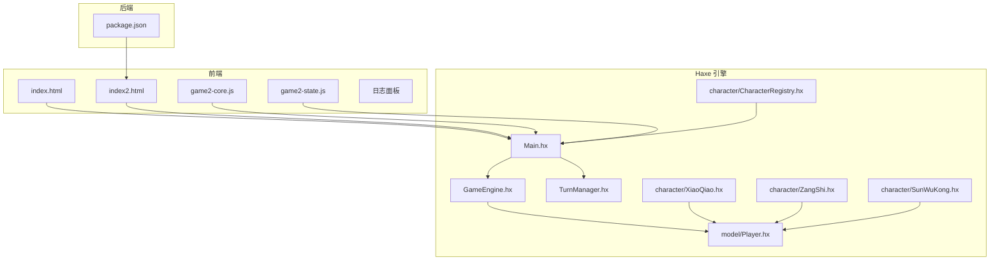
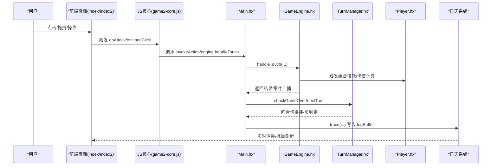
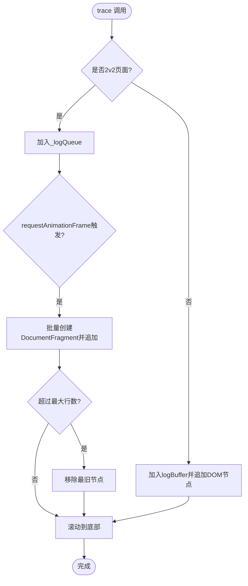
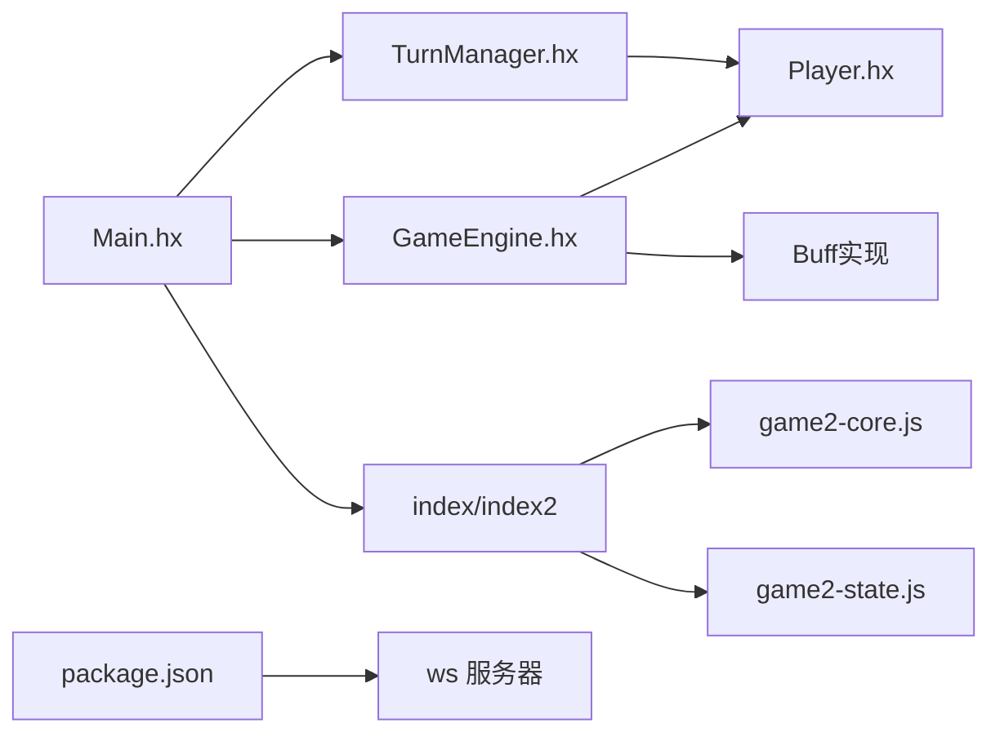

# 测试与调试

<cite>
**本文引用的文件**
- [Main.hx](file://Main.hx)
- [GameEngine.hx](file://GameEngine.hx)
- [TurnManager.hx](file://TurnManager.hx)
- [Player.hx](file://model/Player.hx)
- [CharacterRegistry.hx](file://character/CharacterRegistry.hx)
- [XiaoQiao.hx](file://character/XiaoQiao.hx)
- [ZangShi.hx](file://character/ZangShi.hx)
- [SunWuKong.hx](file://character/SunWuKong.hx)
- [game2-core.js](file://js/game2-core.js)
- [game2-state.js](file://js/game2-state.js)
- [index.html](file://index.html)
- [index2.html](file://index2.html)
- [log_小乔_vs_忍者_vs_法师_vs_孙悟空_2026-06-06_11-49-30.txt](file://log/log_小乔_vs_忍者_vs_法师_vs_孙悟空_2026-06-06_11-49-30.txt)
- [package.json](file://package.json)
</cite>

## 目录
1. [简介](#简介)
2. [项目结构](#项目结构)
3. [核心组件](#核心组件)
4. [架构总览](#架构总览)
5. [详细组件分析](#详细组件分析)
6. [依赖关系分析](#依赖关系分析)
7. [性能考量](#性能考量)
8. [故障排查指南](#故障排查指南)
9. [结论](#结论)
10. [附录](#附录)

## 简介
本指南聚焦于测试与调试领域，围绕日志系统设计与使用、对战日志结构与内容、调试技巧与最佳实践、单元与集成测试策略、常见问题诊断与自动化测试脚本使用展开。通过对 Haxe 游戏引擎的 trace 重定向、日志缓冲区管理、格式化输出策略进行深入剖析，结合回合状态快照、角色行动记录与战斗结果统计，帮助开发者高效定位问题、验证逻辑正确性并提升整体质量。

## 项目结构
该项目采用前后端分离的前端页面 + Haxe 引擎 + JavaScript 交互的架构。前端通过 HTML 页面与 JS 脚本驱动，Haxe 编译产物在浏览器中运行，核心逻辑集中在 GameEngine、TurnManager、Player 及角色实现中。日志系统贯穿前端与后端，既支持浏览器端的实时日志展示，也支持游戏结束时的日志导出。

图示来源
- [index.html](file://index.html)
- [index2.html](file://index2.html)
- [Main.hx](file://Main.hx)
- [GameEngine.hx](file://GameEngine.hx)
- [TurnManager.hx](file://TurnManager.hx)
- [Player.hx](file://model/Player.hx)
- [CharacterRegistry.hx](file://character/CharacterRegistry.hx)
- [XiaoQiao.hx](file://character/XiaoQiao.hx)
- [ZangShi.hx](file://character/ZangShi.hx)
- [SunWuKong.hx](file://character/SunWuKong.hx)
- [game2-core.js](file://js/game2-core.js)
- [game2-state.js](file://js/game2-state.js)
- [package.json](file://package.json)

章节来源
- [index.html](file://index.html)
- [index2.html](file://index2.html)
- [Main.hx](file://Main.hx)
- [GameEngine.hx](file://GameEngine.hx)
- [TurnManager.hx](file://TurnManager.hx)
- [Player.hx](file://model/Player.hx)
- [CharacterRegistry.hx](file://character/CharacterRegistry.hx)
- [XiaoQiao.hx](file://character/XiaoQiao.hx)
- [ZangShi.hx](file://character/ZangShi.hx)
- [SunWuKong.hx](file://character/SunWuKong.hx)
- [game2-core.js](file://js/game2-core.js)
- [game2-state.js](file://js/game2-state.js)
- [package.json](file://package.json)

## 核心组件
- 日志系统与 trace 重定向：前端通过劫持 haxe.Log.trace，将日志写入 logBuffer 并实时渲染到 UI；2v2 模式下采用批量队列 + requestAnimationFrame 刷新，避免频繁重排。
- 回合状态快照：Main.snapshotState 输出回合结束时的全局状态，包含 HP、双手、0手倒计时、Buff、护盾及角色自定义字段。
- 战斗引擎：GameEngine 负责伤害/回血/护盾/事件广播与组合技能触发，支持“帮抗”快照与结算。
- 轮次管理：TurnManager 管理回合切换、跳过条件、大回合结束事件与胜负判定。
- 角色系统：Player 抽象类定义钩子接口，角色通过重写实现特定行为；CharacterRegistry 提供角色工厂与元数据。

章节来源
- [Main.hx](file://Main.hx)
- [GameEngine.hx](file://GameEngine.hx)
- [TurnManager.hx](file://TurnManager.hx)
- [Player.hx](file://model/Player.hx)
- [CharacterRegistry.hx](file://character/CharacterRegistry.hx)

## 架构总览
下面的序列图展示了从用户点击到日志输出的关键流程，涵盖 1v1 与 2v2 的 trace 重定向差异。

图示来源
- [index.html](file://index.html)
- [index2.html](file://index2.html)
- [game2-core.js](file://js/game2-core.js)
- [Main.hx](file://Main.hx)
- [GameEngine.hx](file://GameEngine.hx)
- [TurnManager.hx](file://TurnManager.hx)
- [Player.hx](file://model/Player.hx)

## 详细组件分析

### 日志系统与 trace 重定向
- 1v1 模式：Main.hx 在 main() 中重写 haxe.Log.trace，将文本加入 logBuffer，并追加到 logPanel；支持“重要日志”高亮。
- 2v2 模式：index2.html 内联脚本在 DOMContentLoaded 后再次劫持 haxe.Log.trace，采用队列 + requestAnimationFrame 批量刷新，限制最大行数，避免 UI 卡顿。
- 日志缓冲区管理：Main.logBuffer 作为完整日志缓存，用于结束时生成文件并下载；2v2 模式下同样写入 Main.logBuffer 以便统一导出。
- 格式化输出策略：trace 文本统一带有回合前缀 [Tn]，便于定位事件发生时点；重要事件（胜利、失败、关键技能）使用特殊标记，前端自动高亮。

图示来源
- [Main.hx](file://Main.hx)
- [index2.html](file://index2.html)

章节来源
- [Main.hx](file://Main.hx)
- [index.html](file://index.html)
- [index2.html](file://index2.html)

### 对战日志结构与内容
- 回合状态快照：snapshotState 输出“全场状态”标题、每名玩家的阵营/姓名、HP、双手、0手剩余回合、Buff 列表、护盾列表，以及角色自定义字段（如小乔的 x/y、孙猴子的 [0,2] 计数、藏师的蛋糕数）。
- 结束日志：在游戏结束时追加“🏁 游戏结束”标题、最终全场状态快照与获胜阵营信息。
- 示例日志片段展示了回合末快照与最终结果的格式。

章节来源
- [Main.hx](file://Main.hx)
- [log_小乔_vs_忍者_vs_法师_vs_孙悟空_2026-06-06_11-49-30.txt](file://log/log_小乔_vs_忍者_vs_法师_vs_孙悟空_2026-06-06_11-49-30.txt)

### 调试技巧与最佳实践
- 断点设置
  - Haxe 侧：在 GameEngine.applyDamage、applyHeal、applyShield、Player.handleIncomingDamage 等关键方法中设置断点，观察伤害倍率、护盾抵消、中毒/反弹等逻辑。
  - 角色侧：在角色重写的钩子（如 XiaoQiao.onAfterDealtDamage、ZangShi.useCake、SunWuKong.tryOverrideComboEffect）中设置断点，验证技能触发与参数传递。
  - TurnManager 侧：在 onTurnStart、nextTurn、checkGameOver 中断点，检查跳过条件、回合结束结算与胜负判定。
- 变量检查
  - 使用浏览器开发者工具查看 Main.logBuffer、TurnManager.players、GameEngine.lastTouchDamageLog 等关键变量，核对回合状态与伤害快照。
  - 2v2 模式下通过 game2-state.js 的 G 全局状态（tankIdx、formation、tankTarget 等）验证抗伤位与目标选择。
- 性能分析
  - 2v2 trace 采用批量刷新与最大行数限制，避免高频 DOM 操作导致卡顿；建议在大量回合时关注日志面板滚动性能。
  - 在 GameEngine.applyDamage 中注意 Buff 层叠与事件广播次数，避免不必要的重复计算。
- 内存泄漏检测
  - 检查 DOM 节点是否正确移除（如弹窗、对话框）；确认定时器（如倒计时）在游戏结束或重启时被清理。
  - 2v2 模式下确保 setupTrace2v2 仅在需要时启用，避免重复劫持导致内存占用上升。

章节来源
- [GameEngine.hx](file://GameEngine.hx)
- [TurnManager.hx](file://TurnManager.hx)
- [Player.hx](file://model/Player.hx)
- [XiaoQiao.hx](file://character/XiaoQiao.hx)
- [ZangShi.hx](file://character/ZangShi.hx)
- [SunWuKong.hx](file://character/SunWuKong.hx)
- [game2-state.js](file://js/game2-state.js)
- [index2.html](file://index2.html)

### 单元测试与集成测试策略
- 核心逻辑测试
  - GameEngine.applyDamage：构造不同伤害类型、Buff 层叠、护盾组合场景，断言最终伤害与实际扣血。
  - Player.handleIncomingDamage：验证护盾抵消顺序、真实伤害穿透、Buff 拦截与反弹。
  - TurnManager.nextTurn：覆盖回合结束结算、跳过条件、大回合事件广播与胜负判定。
- UI 交互测试
  - 1v1：模拟 onHandClick 点击流程，验证 isValidTouch 校验、提示信息与 UI 样式切换。
  - 2v2：模拟 onHandClick2 两步点击状态机、帮抗弹窗、抗伤位切换与目标选择。
- 网络功能测试（联机）
  - 通过 game2-state.js 的 ONLINE/NET 通道，验证角色配置广播、控制者变更、AI 模型同步与在线对战流程。
  - 使用 package.json 中的 ws 依赖启动 WebSocket 服务，验证房间创建/加入与消息同步。

章节来源
- [GameEngine.hx](file://GameEngine.hx)
- [TurnManager.hx](file://TurnManager.hx)
- [Player.hx](file://model/Player.hx)
- [index.html](file://index.html)
- [index2.html](file://index2.html)
- [game2-core.js](file://js/game2-core.js)
- [game2-state.js](file://js/game2-state.js)
- [package.json](file://package.json)

### 常见问题诊断
- 编译错误
  - Haxe 编译：检查 build.hxml 与依赖版本；确保 js.Browser、haxe.Log 等命名空间可用。
  - 前端打包：确认 main.js、game2-core.js 等脚本加载顺序正确，避免 haxe.Log 未就绪导致 trace 劫持失败。
- 运行时异常
  - trace 劫持失效：确认在 DOMContentLoaded 后再次劫持；2v2 模式需调用 setupTrace2v2。
  - 角色工厂：CharacterRegistry.createCharacter 返回默认角色时，检查 id 是否匹配。
- 网络连接问题
  - WebSocket 服务：检查 package.json 中 ws 版本与 Node.js 版本要求；确认 server.js 正确监听端口。
  - 联机状态：验证 ONLINE.active、NET.roomState 与 charControl 同步，避免控制者丢失导致 AI 接管。
- 性能瓶颈分析
  - trace 刷新：2v2 模式下日志过多导致滚动卡顿，可通过减少日志密度或增加最大行数阈值优化。
  - 事件广播：GameEngine.notify* 系列广播次数过多时，评估是否可合并或延迟处理。

章节来源
- [Main.hx](file://Main.hx)
- [CharacterRegistry.hx](file://character/CharacterRegistry.hx)
- [index2.html](file://index2.html)
- [package.json](file://package.json)

### 测试数据准备与模拟环境
- 测试数据准备
  - 使用 CharacterRegistry 生成固定角色组合，构造不同初始状态（HP、双手、Buff、护盾）以覆盖边界场景。
  - 通过 TurnManager.setupGame 直接注入玩家数组，绕过前端选择，提高测试效率。
- 模拟环境搭建
  - 本地开发：使用浏览器打开 index.html 或 index2.html，配合断点与 console 输出进行调试。
  - 联机测试：启动 WebSocket 服务，使用多个浏览器窗口模拟房间，验证广播与同步。
- 自动化测试脚本
  - 前端：基于 game2-core.js 的状态机，编写点击序列脚本模拟对战流程，断言回合状态与日志输出。
  - 后端：基于 package.json 的脚本，启动/停止 WebSocket 服务，验证连接与消息收发。

章节来源
- [CharacterRegistry.hx](file://character/CharacterRegistry.hx)
- [TurnManager.hx](file://TurnManager.hx)
- [index.html](file://index.html)
- [index2.html](file://index2.html)
- [game2-core.js](file://js/game2-core.js)
- [package.json](file://package.json)

## 依赖关系分析
- 组件耦合
  - Main 依赖 GameEngine 与 TurnManager，负责 UI 交互与日志输出；GameEngine 依赖 Player 及 Buff 实现；TurnManager 依赖 Player 列表进行胜负判定。
  - 2v2 模式通过 game2-state.js 注入抗伤位解析器，GameEngine.tankResolver 与 Main.setTankResolver 形成桥接。
- 外部依赖
  - 前端：浏览器 DOM API、WebSocket（联机）、Blob 下载。
  - 后端：ws WebSocket 服务器，Node.js ≥ 18。

图示来源
- [Main.hx](file://Main.hx)
- [GameEngine.hx](file://GameEngine.hx)
- [TurnManager.hx](file://TurnManager.hx)
- [Player.hx](file://model/Player.hx)
- [index.html](file://index.html)
- [index2.html](file://index2.html)
- [game2-core.js](file://js/game2-core.js)
- [game2-state.js](file://js/game2-state.js)
- [package.json](file://package.json)

章节来源
- [Main.hx](file://Main.hx)
- [GameEngine.hx](file://GameEngine.hx)
- [TurnManager.hx](file://TurnManager.hx)
- [Player.hx](file://model/Player.hx)
- [index.html](file://index.html)
- [index2.html](file://index2.html)
- [game2-core.js](file://js/game2-core.js)
- [game2-state.js](file://js/game2-state.js)
- [package.json](file://package.json)

## 性能考量
- trace 刷新策略：2v2 模式采用批量队列 + requestAnimationFrame，避免每条 trace 都触发重排；建议根据设备性能调整最大行数阈值。
- 事件广播：GameEngine.notify* 系列广播应避免在高频回合中过度使用，必要时合并事件或延迟处理。
- DOM 操作：日志面板滚动与样式切换应尽量批量进行，减少布局抖动。

## 故障排查指南
- trace 未输出或输出错位
  - 检查 haxe.Log.trace 是否被多次劫持；确认 DOMContentLoaded 事件后再次劫持。
- 2v2 抗伤位不生效
  - 确认 setupTankResolver 已调用，GameEngine.tankResolver 是否被正确注入；检查 G.tankIdx 与阵容配置。
- 联机对战异常
  - 核查 ONLINE.active、NET.roomState 与 charControl；确认广播消息类型与接收端处理逻辑一致。

章节来源
- [Main.hx](file://Main.hx)
- [game2-state.js](file://js/game2-state.js)
- [index2.html](file://index2.html)

## 结论
本指南系统梳理了日志系统设计、对战日志结构、调试技巧与测试策略。通过 trace 重定向与批量刷新、回合状态快照与统一导出、角色钩子与事件广播，开发者能够快速定位问题、验证逻辑并提升整体质量。建议在开发与回归测试中充分利用这些机制，结合联机与自动化脚本，构建稳定可靠的测试体系。

## 附录
- 角色钩子参考
  - XiaoQiao：onAfterDealtDamage、onAfterHeal、addShield、onAfterTouchResolved
  - ZangShi：handleIncomingDamage、calculateFinalHeal、onAnyHealHappened、onAnyShieldGained、onAfterDealtDamage、handleAction
  - SunWuKong：calculateOutputDamage、onAnyOutputDamage、onAnyHealHappened、calculateFinalHeal、tryOverrideComboEffect、shouldSkipZeroTurnsDecrement、onAfterTouchResolved

章节来源
- [XiaoQiao.hx](file://character/XiaoQiao.hx)
- [ZangShi.hx](file://character/ZangShi.hx)
- [SunWuKong.hx](file://character/SunWuKong.hx)