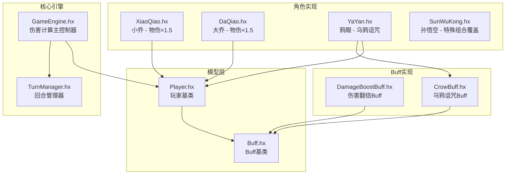
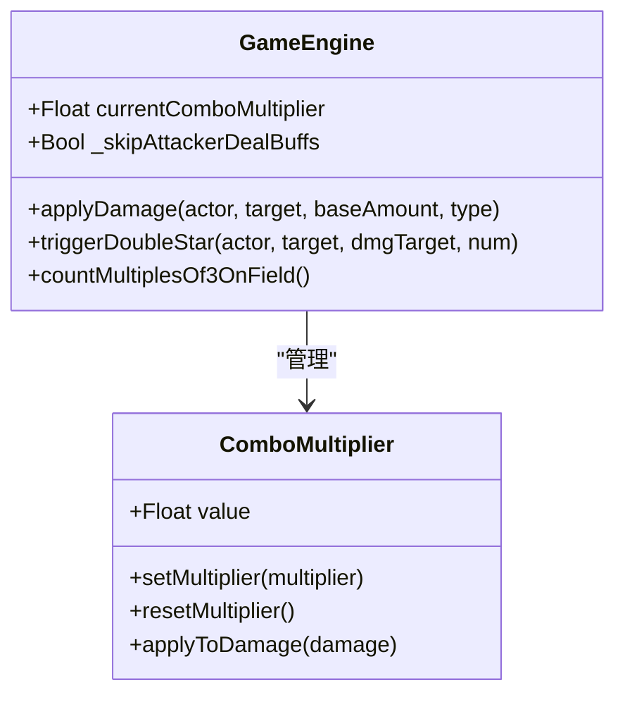
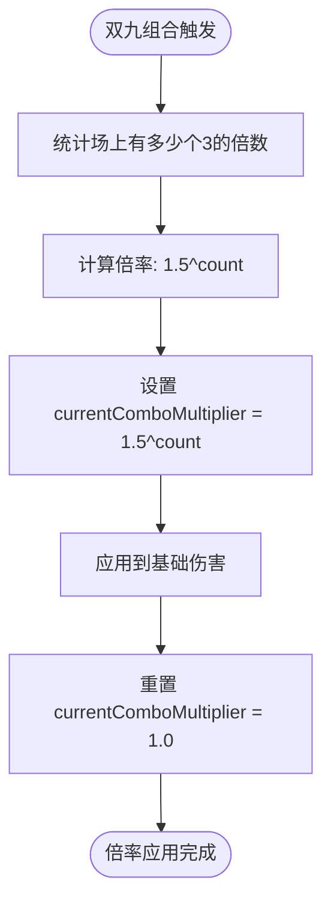
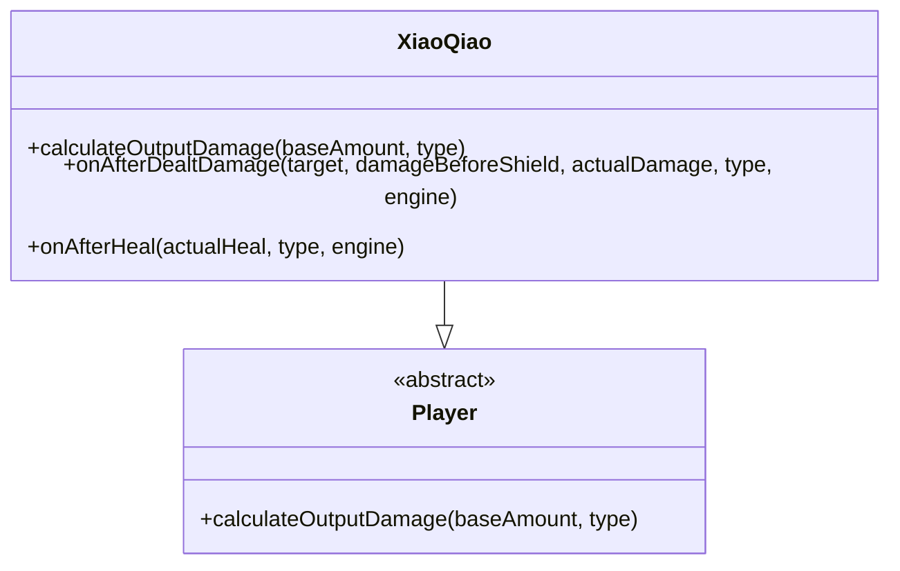
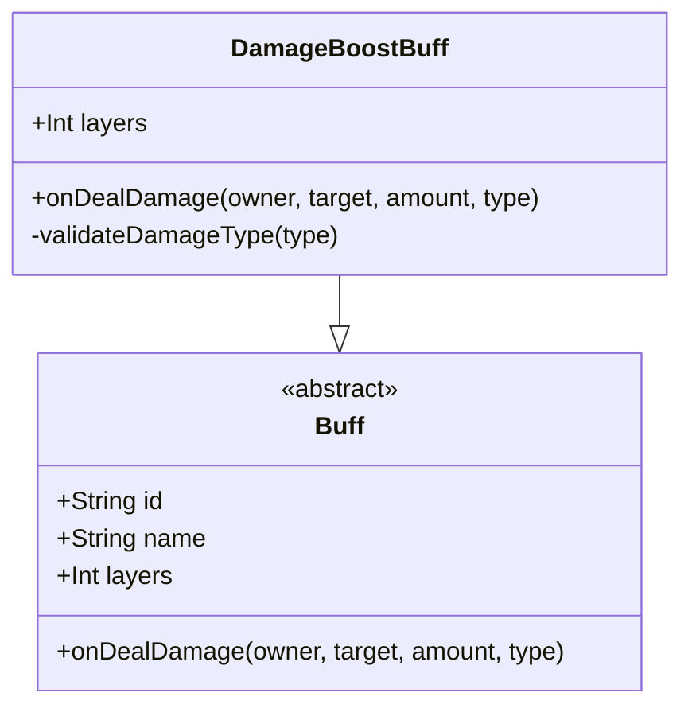
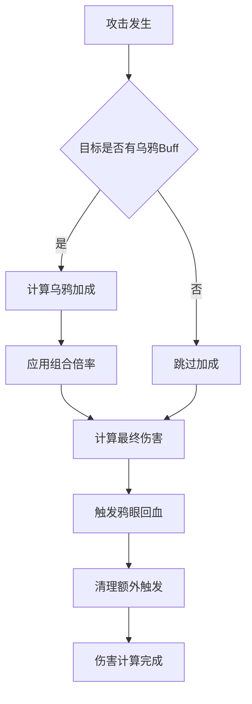
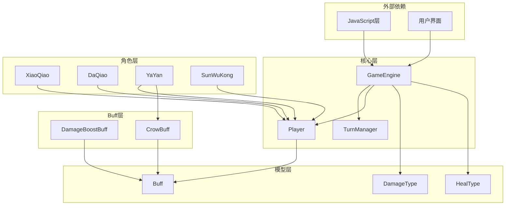

# 伤害倍率系统

<cite>
**本文档引用的文件**
- [GameEngine.hx](file://GameEngine.hx)
- [TurnManager.hx](file://TurnManager.hx)
- [Player.hx](file://model/Player.hx)
- [Buff.hx](file://model/Buff.hx)
- [DamageBoostBuff.hx](file://buffs/DamageBoostBuff.hx)
- [CrowBuff.hx](file://buffs/CrowBuff.hx)
- [XiaoQiao.hx](file://character/XiaoQiao.hx)
- [DaQiao.hx](file://character/DaQiao.hx)
- [YaYan.hx](file://character/YaYan.hx)
- [SunWuKong.hx](file://character/SunWuKong.hx)
</cite>

## 目录
1. [简介](#简介)
2. [项目结构](#项目结构)
3. [核心组件](#核心组件)
4. [架构概览](#架构概览)
5. [详细组件分析](#详细组件分析)
6. [依赖关系分析](#依赖关系分析)
7. [性能考虑](#性能考虑)
8. [故障排除指南](#故障排除指南)
9. [结论](#结论)

## 简介

伤害倍率系统是游戏的核心机制之一，负责计算和应用各种伤害加成效果。本系统实现了复杂的倍率计算逻辑，包括角色技能加成、Buff效果叠加、组合效果倍率等多重机制。系统的关键特性包括：

- **currentComboMultiplier**：用于管理组合技能产生的倍率效果
- **多层倍率叠加**：支持角色技能、Buff、组合效果的多重叠加
- **特殊倍率效果**：如双九的指数倍率、双四的倍率Buff等
- **攻击者增伤Buff**：实现伤害翻倍等增益效果
- **性能优化**：通过合理的数据结构和算法设计确保高效运行

## 项目结构

伤害倍率系统主要分布在以下几个核心文件中：



**图表来源**
- [GameEngine.hx:1-725](file://GameEngine.hx#L1-L725)
- [Player.hx:1-398](file://model/Player.hx#L1-L398)

**章节来源**
- [GameEngine.hx:1-725](file://GameEngine.hx#L1-L725)
- [TurnManager.hx:1-232](file://TurnManager.hx#L1-L232)

## 核心组件

### GameEngine - 伤害计算主控制器

GameEngine是伤害倍率系统的核心控制器，负责协调整个伤害计算流程。其关键功能包括：

- **currentComboMultiplier**：全局组合倍率控制变量
- **applyDamage**：标准伤害计算流程
- **applyRawDamage**：原始伤害计算（绕过钩子）
- **组合技能触发**：处理双九、双四等特殊组合效果

### Player - 角色基类

Player类提供了伤害倍率计算的基础接口：

- **calculateOutputDamage**：角色技能加成计算
- **onAfterDealtDamage**：伤害后触发的技能效果
- **handleIncomingDamage**：承受伤害时的减伤逻辑

### Buff - Buff系统基类

Buff系统实现了可叠加的效果机制：

- **onDealDamage**：造成伤害前的增益效果
- **onTakeDamage**：承受伤害前的减伤效果
- **layers**：Buff层数管理

**章节来源**
- [GameEngine.hx:16-43](file://GameEngine.hx#L16-L43)
- [Player.hx:36-47](file://model/Player.hx#L36-L47)
- [Buff.hx:21-29](file://model/Buff.hx#L21-L29)

## 架构概览

伤害倍率系统的整体架构采用分层设计，确保了模块间的清晰分离和高内聚低耦合：

```mermaid
sequenceDiagram
participant Actor as 攻击者
participant Engine as GameEngine
participant Target as 目标玩家
participant Buffs as Buff系统
Actor->>Engine : applyDamage(baseAmount, type)
Engine->>Engine : 计算乌鸦加成
Engine->>Engine : 应用组合倍率(currentComboMultiplier)
Engine->>Actor : calculateOutputDamage(基础伤害)
Actor-->>Engine : 角色加成后的伤害
Engine->>Buffs : 应用攻击者增伤Buff
Buffs-->>Engine : 最终伤害值
Engine->>Target : handleIncomingDamage(最终伤害)
Target-->>Engine : 抗伤后的结果
Engine->>Actor : onAfterDealtDamage回调
Engine-->>Actor : 返回伤害结果
```

**图表来源**
- [GameEngine.hx:137-233](file://GameEngine.hx#L137-L233)
- [Player.hx:262-325](file://model/Player.hx#L262-L325)

## 详细组件分析

### currentComboMultiplier - 组合倍率控制

currentComboMultiplier是伤害倍率系统的核心变量，用于管理组合技能产生的倍率效果：

#### 数据结构和作用



**图表来源**
- [GameEngine.hx:25-26](file://GameEngine.hx#L25-L26)
- [GameEngine.hx:495-552](file://GameEngine.hx#L495-L552)

#### 计算方式和应用时机

currentComboMultiplier的计算和应用遵循严格的时序：

1. **触发时机**：在双九组合触发时设置
2. **计算逻辑**：基于场上有多少个3的倍数（不含0）
3. **应用位置**：在乌鸦加成之后、角色乘算之前
4. **清理机制**：伤害计算完成后立即重置为1.0

#### 特殊倍率效果实现

##### 双九指数倍率

双九组合实现了一个指数倍率机制：



**图表来源**
- [GameEngine.hx:498-503](file://GameEngine.hx#L498-L503)
- [GameEngine.hx:594-605](file://GameEngine.hx#L594-L605)

**章节来源**
- [GameEngine.hx:495-552](file://GameEngine.hx#L495-L552)
- [GameEngine.hx:594-605](file://GameEngine.hx#L594-L605)

### 角色技能加成

不同角色实现了不同的伤害加成机制：

#### 小乔的物伤加成

小乔实现了1.5倍的物理伤害加成：



**图表来源**
- [XiaoQiao.hx:25-32](file://character/XiaoQiao.hx#L25-L32)
- [XiaoQiao.hx:45-62](file://character/XiaoQiao.hx#L45-L62)

#### 大乔的物伤加成

大乔在特定形态下提供1.5倍的物理伤害加成：

**章节来源**
- [XiaoQiao.hx:25-32](file://character/XiaoQiao.hx#L25-L32)
- [DaQiao.hx:83-90](file://character/DaQiao.hx#L83-L90)

### Buff效果叠加

Buff系统实现了复杂的叠加和应用机制：

#### 伤害翻倍Buff (DamageBoostBuff)

DamageBoostBuff实现了伤害翻倍效果，仅对物理和真实伤害生效：



**图表来源**
- [DamageBoostBuff.hx:6-19](file://buffs/DamageBoostBuff.hx#L6-L19)

#### 乌鸦诅咒Buff (CrowBuff)

乌鸦诅咒实现了独特的伤害加成机制：



**图表来源**
- [CrowBuff.hx:34-55](file://buffs/CrowBuff.hx#L34-L55)

**章节来源**
- [DamageBoostBuff.hx:6-19](file://buffs/DamageBoostBuff.hx#L6-L19)
- [CrowBuff.hx:34-55](file://buffs/CrowBuff.hx#L34-L55)

### 组合效果倍率

系统支持多种组合技能的倍率效果：

#### 双四倍率Buff

双四组合提供2次伤害翻倍的机会：

#### 双八再动效果

双八组合提供额外行动机会和护盾效果：

#### 其他组合效果

系统还支持双七、双六、双五等多种组合效果，每种都有独特的倍率或效果。

**章节来源**
- [GameEngine.hx:495-552](file://GameEngine.hx#L495-L552)

### 攻击者增伤Buff实现

攻击者增伤Buff通过特殊的处理机制确保正确的应用顺序：

```mermaid
sequenceDiagram
participant Engine as GameEngine
participant Actor as 攻击者
participant Buffs as Buff系统
participant Target as 目标
Engine->>Actor : calculateOutputDamage(基础伤害)
Actor-->>Engine : 角色加成后的伤害
Engine->>Engine : 备份Buff层数
loop 遍历所有Buff
Engine->>Buffs : onDealDamage(伤害, 类型)
Buffs-->>Engine : 应用Buff后的伤害
end
Engine->>Engine : 恢复Buff层数
Engine->>Buffs : 应用Buff真正消耗层数
Buffs-->>Engine : 最终伤害值
Engine->>Target : handleIncomingDamage(最终伤害)
```

**图表来源**
- [GameEngine.hx:166-180](file://GameEngine.hx#L166-L180)

**章节来源**
- [GameEngine.hx:166-180](file://GameEngine.hx#L166-L180)

## 依赖关系分析

伤害倍率系统的依赖关系体现了清晰的分层架构：



**图表来源**
- [GameEngine.hx:1-15](file://GameEngine.hx#L1-L15)
- [Player.hx:1-9](file://model/Player.hx#L1-L9)

**章节来源**
- [GameEngine.hx:1-15](file://GameEngine.hx#L1-L15)
- [Player.hx:1-9](file://model/Player.hx#L1-L9)

## 性能考虑

伤害倍率系统在设计时充分考虑了性能优化：

### 时间复杂度分析

- **单次伤害计算**：O(n) 其中n为Buff数量
- **组合倍率计算**：O(k) 其中k为场上有多少个3的倍数
- **Buff遍历**：每个伤害事件最多遍历所有Buff一次

### 空间复杂度优化

- **Buff层数管理**：使用整数计数而非复杂数据结构
- **临时变量复用**：避免不必要的内存分配
- **延迟计算**：组合倍率仅在需要时计算

### 性能优化策略

1. **早期退出优化**：当倍率为1.0时跳过计算
2. **缓存机制**：复用计算结果避免重复计算
3. **批量处理**：Buff应用采用批处理模式
4. **内存池**：减少垃圾回收压力

## 故障排除指南

### 常见问题和解决方案

#### 倍率计算异常

**问题**：伤害倍率计算结果不符合预期
**可能原因**：
- Buff层数计算错误
- 组合倍率应用时机不当
- 角色技能加成未正确应用

**解决方法**：
1. 检查Buff层数是否正确递减
2. 验证组合倍率的应用顺序
3. 确认角色技能加成的类型判断

#### 特殊倍率效果失效

**问题**：双九、双四等特殊效果不生效
**可能原因**：
- currentComboMultiplier未正确设置
- Buff应用顺序错误
- 角色覆盖机制冲突

**解决方法**：
1. 验证组合触发逻辑
2. 检查Buff应用的优先级
3. 确认角色覆盖机制的正确性

**章节来源**
- [GameEngine.hx:146-183](file://GameEngine.hx#L146-L183)
- [GameEngine.hx:495-552](file://GameEngine.hx#L495-L552)

## 结论

伤害倍率系统通过精心设计的架构实现了复杂而高效的伤害计算机制。系统的主要特点包括：

1. **模块化设计**：清晰的分层架构便于维护和扩展
2. **灵活的倍率机制**：支持多种类型的倍率效果和叠加方式
3. **性能优化**：通过合理的算法设计确保高效运行
4. **可扩展性**：易于添加新的角色技能和Buff效果

该系统为游戏提供了坚实的伤害计算基础，能够支持各种复杂的战斗机制和策略玩法。通过持续的优化和改进，系统将继续为玩家提供丰富而平衡的游戏体验。