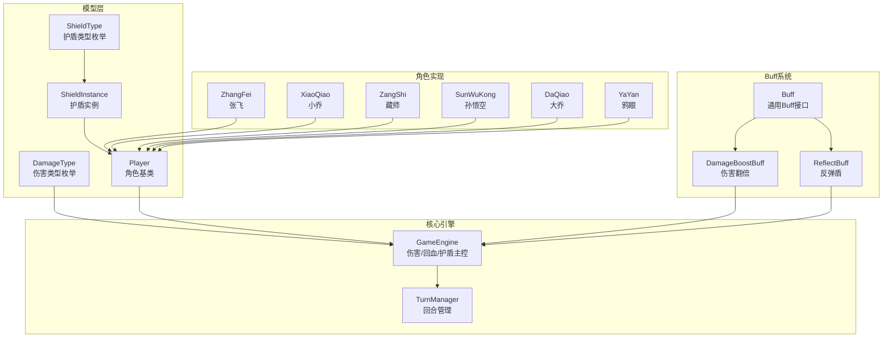
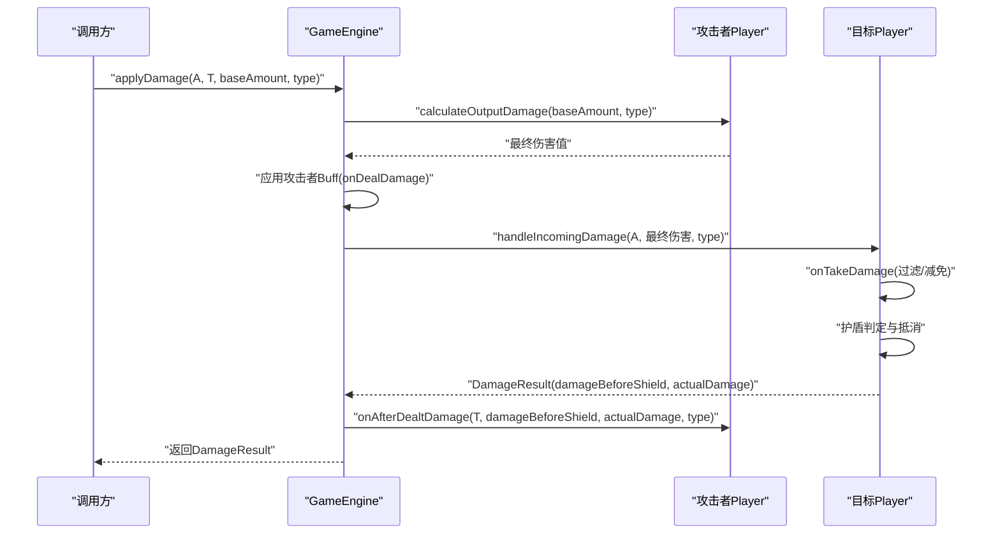
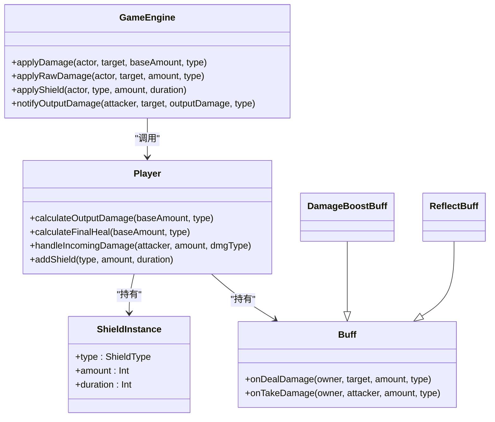

# 伤害类型系统

<cite>
**本文档引用的文件**
- [DamageType.hx](file://model/DamageType.hx)
- [ShieldType.hx](file://model/ShieldType.hx)
- [ShieldInstance.hx](file://model/ShieldInstance.hx)
- [Player.hx](file://model/Player.hx)
- [GameEngine.hx](file://GameEngine.hx)
- [TurnManager.hx](file://TurnManager.hx)
- [Buff.hx](file://model/Buff.hx)
- [DamageBoostBuff.hx](file://buffs/DamageBoostBuff.hx)
- [ReflectBuff.hx](file://buffs/ReflectBuff.hx)
- [ZhangFei.hx](file://character/ZhangFei.hx)
- [XiaoQiao.hx](file://character/XiaoQiao.hx)
- [ZangShi.hx](file://character/ZangShi.hx)
- [SunWuKong.hx](file://character/SunWuKong.hx)
- [DaQiao.hx](file://character/DaQiao.hx)
- [YaYan.hx](file://character/YaYan.hx)
</cite>

## 目录
1. [简介](#简介)
2. [项目结构](#项目结构)
3. [核心组件](#核心组件)
4. [架构概览](#架构概览)
5. [详细组件分析](#详细组件分析)
6. [依赖关系分析](#依赖关系分析)
7. [性能考量](#性能考量)
8. [故障排除指南](#故障排除指南)
9. [结论](#结论)

## 简介
本文件系统性阐述伤害类型系统的设计理念与实现机制，涵盖三种伤害类型（物理、法术、真实）的计算方式与适用角色、法术伤害的平衡考虑、真实伤害的穿透特性与使用场景，以及伤害类型在护盾系统中的作用。文档还提供了伤害类型转换与伤害减免计算的具体实现路径与使用示例，帮助开发者与设计者准确理解并扩展该系统。

## 项目结构
伤害类型系统主要由以下模块构成：
- 模型层：定义伤害类型枚举、护盾类型枚举与护盾实例数据结构
- 核心引擎：集中处理伤害流程、回血流程、护盾获取与事件广播
- 角色层：各角色基于钩子接口实现特定的伤害类型加成、减免与转换
- Buff层：提供伤害翻倍、反弹等通用机制，支持伤害类型过滤

**图表来源**
- [GameEngine.hx:16-725](file://GameEngine.hx#L16-L725)
- [TurnManager.hx:6-232](file://TurnManager.hx#L6-L232)
- [Player.hx:3-375](file://model/Player.hx#L3-L375)
- [DamageType.hx:3-7](file://model/DamageType.hx#L3-L7)
- [ShieldType.hx:3-8](file://model/ShieldType.hx#L3-L8)
- [ShieldInstance.hx:3-13](file://model/ShieldInstance.hx#L3-L13)
- [Buff.hx:3-30](file://model/Buff.hx#L3-L30)
- [DamageBoostBuff.hx:6-20](file://buffs/DamageBoostBuff.hx#L6-L20)
- [ReflectBuff.hx:16-43](file://buffs/ReflectBuff.hx#L16-L43)

**章节来源**
- [GameEngine.hx:16-725](file://GameEngine.hx#L16-L725)
- [TurnManager.hx:6-232](file://TurnManager.hx#L6-L232)
- [Player.hx:3-375](file://model/Player.hx#L3-L375)
- [DamageType.hx:3-7](file://model/DamageType.hx#L3-L7)
- [ShieldType.hx:3-8](file://model/ShieldType.hx#L3-L8)
- [ShieldInstance.hx:3-13](file://model/ShieldInstance.hx#L3-L13)
- [Buff.hx:3-30](file://model/Buff.hx#L3-L30)

## 核心组件
- 伤害类型枚举：定义物理、法术、真实三种伤害类型，贯穿伤害计算与护盾判定
- 护盾类型枚举：定义物理、法术、物法双防、真实四种护盾类型，决定护盾对不同伤害类型的阻挡能力
- 护盾实例：包含护盾类型、厚度与持续时间，支持合并与排序
- 核心伤害流程：applyDamage/applyRawDamage负责伤害计算、事件广播与结果返回
- 角色钩子：calculateOutputDamage/calculateFinalHeal/onAfterDealtDamage等提供伤害类型加成与转换
- Buff系统：onDealDamage/onTakeDamage提供伤害类型过滤的通用机制

**章节来源**
- [DamageType.hx:3-7](file://model/DamageType.hx#L3-L7)
- [ShieldType.hx:3-8](file://model/ShieldType.hx#L3-L8)
- [ShieldInstance.hx:3-13](file://model/ShieldInstance.hx#L3-L13)
- [GameEngine.hx:137-290](file://GameEngine.hx#L137-L290)
- [Player.hx:34-53](file://model/Player.hx#L34-L53)
- [Buff.hx:22-29](file://model/Buff.hx#L22-L29)

## 架构概览
伤害类型系统采用“模型-引擎-角色-Buff”的分层架构：
- 模型层提供类型与数据结构的稳定契约
- 引擎层统一调度伤害、回血与护盾逻辑，负责事件广播与回合管理
- 角色层通过钩子实现差异化伤害类型处理
- Buff层提供可叠加的伤害类型过滤机制

**图表来源**
- [GameEngine.hx:137-233](file://GameEngine.hx#L137-L233)
- [Player.hx:245-302](file://model/Player.hx#L245-L302)
- [Buff.hx:22-29](file://model/Buff.hx#L22-L29)

**章节来源**
- [GameEngine.hx:137-233](file://GameEngine.hx#L137-L233)
- [Player.hx:245-302](file://model/Player.hx#L245-L302)

## 详细组件分析

### 物理伤害
设计理念
- 物理伤害是近战/普攻伤害的主要类型，强调与角色手牌数值的直接关联
- 通过角色钩子与Buff系统实现加成、减免与转换，兼顾策略深度与平衡

实现机制
- 角色加成：calculateOutputDamage对物理伤害进行乘算加成（如小乔1.5倍）
- Buff加成：DamageBoostBuff对物理与真实伤害翻倍（伤害翻倍Buff）
- 护盾穿透：物理伤害可被物理、物法双防、真实护盾抵消
- 角色特化：张飞对物理伤害有固定减免（双手差值×10，狂暴时×2）

典型角色与实现
- 小乔：物理伤害×1.5，回血×1.5，回血时对敌方造成等量物理伤害
- 张飞：物理伤害×1.5（模态1）、0.75倍打两个敌人（模态2）、物理伤害减半（被动）
- 藏师：物理伤害减半，反弹实际扣血量50%（上限200），回复×2.5，护盾厚度×2

伤害减免与转换示例（路径）
- 物理伤害加成：[XiaoQiao.calculateOutputDamage:25-32](file://character/XiaoQiao.hx#L25-L32)
- 物理伤害翻倍：[DamageBoostBuff.onDealDamage:11-19](file://buffs/DamageBoostBuff.hx#L11-L19)
- 物理伤害减免（张飞）：[ZhangFei.handleIncomingDamage:67-90](file://character/ZhangFei.hx#L67-L90)
- 物理伤害反弹（藏师）：[ZangShi.handleIncomingDamage:39-69](file://character/ZangShi.hx#L39-L69)

**章节来源**
- [XiaoQiao.hx:25-32](file://character/XiaoQiao.hx#L25-L32)
- [DamageBoostBuff.hx:11-19](file://buffs/DamageBoostBuff.hx#L11-L19)
- [ZhangFei.hx:67-90](file://character/ZhangFei.hx#L67-L90)
- [ZangShi.hx:39-69](file://character/ZangShi.hx#L39-L69)

### 法术伤害
设计理念
- 法术伤害强调策略性与平衡性，通常用于远程/技能伤害
- 通过角色钩子与护盾系统实现差异化处理，避免过度泛滥

实现机制
- 角色加成：小乔对法术伤害无加成（保持平衡），藏师通过技能释放法术伤害
- Buff加成：法术伤害不受伤害翻倍Buff影响（仅物理/真实翻倍）
- 护盾穿透：法术伤害可被法术、物法双防、真实护盾抵消
- 角色特化：藏师的草莓蛋糕技能对目标造成法术伤害并回血

典型角色与实现
- 藏师：技能释放法术伤害（10×groupCount），自身回血（10×groupCount）
- 孙悟空：[0,2]组合覆盖为70法伤+回血+冻结，法术伤害不参与物理伤害加成

伤害减免与转换示例（路径）
- 法术伤害技能：[ZangShi.useCake:146-165](file://character/ZangShi.hx#L146-L165)
- [0,2]法术伤害覆盖：[SunWuKong.tryOverrideComboEffect:136-166](file://character/SunWuKong.hx#L136-L166)

**章节来源**
- [ZangShi.hx:146-165](file://character/ZangShi.hx#L146-L165)
- [SunWuKong.hx:136-166](file://character/SunWuKong.hx#L136-L166)

### 真实伤害
设计理念
- 真实伤害无视护盾与减免，直接对生命值造成伤害，强调终结能力与战术价值
- 通过角色钩子与Buff系统实现加成与转换，避免滥用

实现机制
- 角色加成：张飞对真实伤害无加成（保持平衡），小乔对真实伤害无加成
- Buff加成：伤害翻倍Buff对真实伤害生效（物理/真实翻倍）
- 护盾穿透：真实伤害仅能被真实护盾抵消
- 角色特化：双零组合触发真实伤害（150点）

典型角色与实现
- 张飞：真实伤害无加成（保持平衡）
- 藏师：真实伤害无加成（保持平衡）
- 小乔：真实伤害无加成（保持平衡）
- 双零组合：[0,0]与[双0]触发150点真实伤害

伤害减免与转换示例（路径）
- 真实伤害触发：[GameEngine.triggerDoubleStar:545-548](file://GameEngine.hx#L545-L548)
- 真实伤害触发：[GameEngine.triggerZeroCombo:583-585](file://GameEngine.hx#L583-L585)

**章节来源**
- [GameEngine.hx:545-548](file://GameEngine.hx#L545-L548)
- [GameEngine.hx:583-585](file://GameEngine.hx#L583-L585)

### 护盾系统与伤害类型的关系
护盾类型与伤害类型匹配规则
- 物理护盾：仅抵消物理伤害
- 法术护盾：仅抵消法术伤害
- 物法双防护盾：抵消物理与法术伤害
- 真实护盾：抵消真实伤害

实现细节
- 护盾抵消顺序：按持续时间升序抵消，优先消耗即将到期的护盾
- 护盾合并：同类型同持续时间的护盾厚度累加
- 护盾衰减：回合结束时护盾持续时间-1，归零则移除

典型角色与实现
- 小乔：获得物理护盾时升级为物法双防护盾，厚度×1.5，持续+1
- 藏师：获得物理护盾时附加一半厚度的法术护盾

**章节来源**
- [Player.hx:270-297](file://model/Player.hx#L270-L297)
- [Player.hx:223-235](file://model/Player.hx#L223-L235)
- [XiaoQiao.hx:65-70](file://character/XiaoQiao.hx#L65-L70)
- [ZangShi.hx:80-90](file://character/ZangShi.hx#L80-L90)

### 伤害类型转换与减免计算
通用流程
- 攻击者阶段：calculateOutputDamage进行角色加成，Buff系统onDealDamage进行伤害翻倍/转换
- 目标阶段：onTakeDamage进行减免/反弹，护盾抵消，最终扣血

具体实现路径
- 伤害翻倍（物理/真实）：[DamageBoostBuff.onDealDamage:11-19](file://buffs/DamageBoostBuff.hx#L11-L19)
- 反弹（物理）：[ReflectBuff.onTakeDamage:22-41](file://buffs/ReflectBuff.hx#L22-L41)
- 物理伤害减半（藏师）：[ZangShi.handleIncomingDamage:39-69](file://character/ZangShi.hx#L39-L69)
- 物理伤害固定减免（张飞）：[ZhangFei.handleIncomingDamage:67-90](file://character/ZhangFei.hx#L67-L90)
- 护盾抵消：[Player.handleIncomingDamage:270-297](file://model/Player.hx#L270-L297)

**章节来源**
- [DamageBoostBuff.hx:11-19](file://buffs/DamageBoostBuff.hx#L11-L19)
- [ReflectBuff.hx:22-41](file://buffs/ReflectBuff.hx#L22-L41)
- [ZangShi.hx:39-69](file://character/ZangShi.hx#L39-L69)
- [ZhangFei.hx:67-90](file://character/ZhangFei.hx#L67-L90)
- [Player.hx:270-297](file://model/Player.hx#L270-L297)

## 依赖关系分析
- GameEngine依赖Player、ShieldType、ShieldInstance、Buff等模型与角色实现
- 角色类通过继承Player实现钩子，扩展伤害类型处理
- Buff系统通过onDealDamage/onTakeDamage与GameEngine协作
- TurnManager负责回合状态与伤害触发的时机控制

**图表来源**
- [GameEngine.hx:137-346](file://GameEngine.hx#L137-L346)
- [Player.hx:34-302](file://model/Player.hx#L34-L302)
- [ShieldInstance.hx:3-13](file://model/ShieldInstance.hx#L3-L13)
- [Buff.hx:22-29](file://model/Buff.hx#L22-L29)
- [DamageBoostBuff.hx:6-20](file://buffs/DamageBoostBuff.hx#L6-L20)
- [ReflectBuff.hx:16-43](file://buffs/ReflectBuff.hx#L16-L43)

**章节来源**
- [GameEngine.hx:137-346](file://GameEngine.hx#L137-L346)
- [Player.hx:34-302](file://model/Player.hx#L34-L302)
- [ShieldInstance.hx:3-13](file://model/ShieldInstance.hx#L3-L13)
- [Buff.hx:22-29](file://model/Buff.hx#L22-L29)

## 性能考量
- 护盾抵消排序：按持续时间升序抵消，避免频繁扫描与排序开销
- Buff清理：回合结束清理空层数的Buff，减少迭代成本
- 事件广播：仅在必要时广播，避免冗余UI更新
- 角色钩子：尽量在钩子中进行轻量计算，复杂逻辑交由引擎统一调度

## 故障排除指南
常见问题与定位
- 伤害未生效：检查角色钩子是否正确返回最终伤害值
- 护盾未抵消：确认护盾类型与伤害类型匹配，且护盾厚度大于等于伤害
- Buff异常：检查Buff层数与生命周期，确保回合结束正确清理
- 事件未触发：确认GameEngine的事件广播调用位置与参数

排查路径
- 伤害流程：[GameEngine.applyDamage:137-233](file://GameEngine.hx#L137-L233)
- 护盾抵消：[Player.handleIncomingDamage:270-297](file://model/Player.hx#L270-L297)
- Buff清理：[Player.cleanEmptyBuffs:338-344](file://model/Player.hx#L338-L344)
- 护盾衰减：[Player.decreaseShieldDuration:346-354](file://model/Player.hx#L346-L354)

**章节来源**
- [GameEngine.hx:137-233](file://GameEngine.hx#L137-L233)
- [Player.hx:270-297](file://model/Player.hx#L270-L297)
- [Player.hx:338-344](file://model/Player.hx#L338-L344)
- [Player.hx:346-354](file://model/Player.hx#L346-L354)

## 结论
伤害类型系统通过清晰的类型定义、灵活的角色钩子与通用的Buff机制，实现了物理、法术、真实三种伤害类型的差异化处理。护盾系统与伤害类型紧密耦合，既保证了策略深度，又维持了游戏平衡。通过对典型角色的实现分析，可以看出系统在扩展性与可维护性方面具备良好基础，便于进一步引入新角色与新机制。