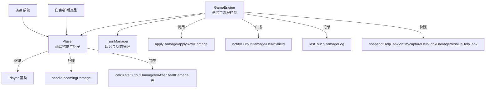
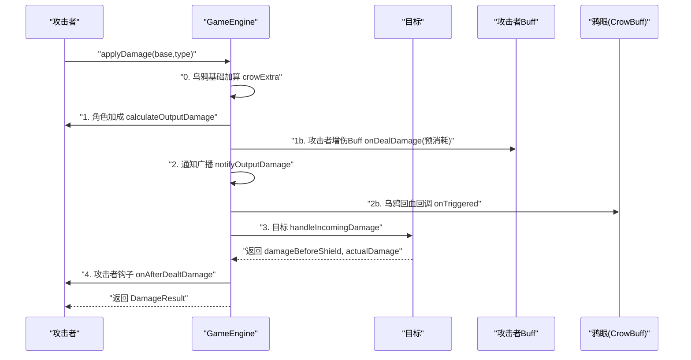
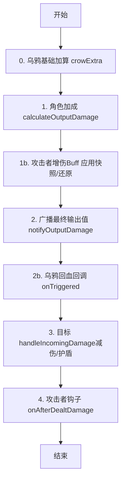
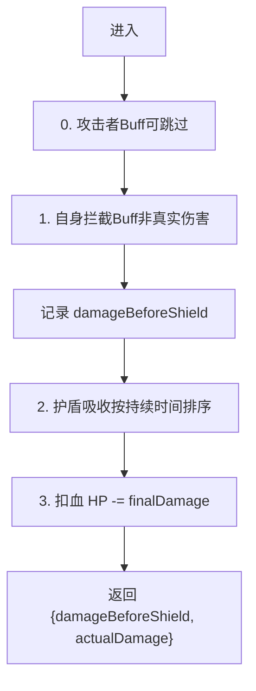
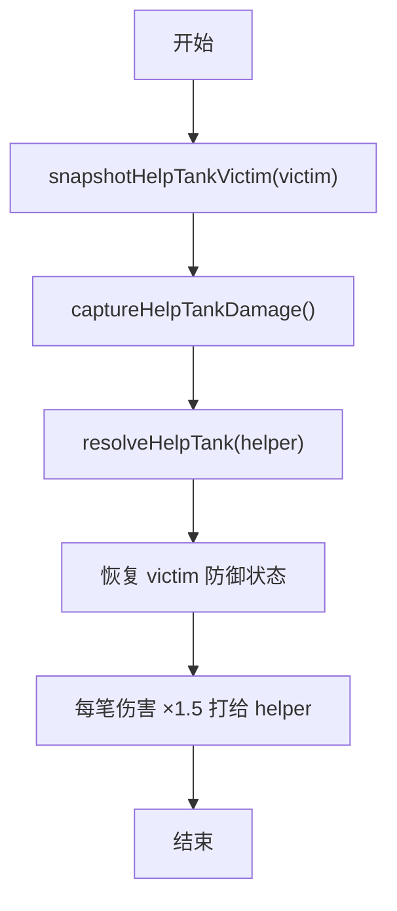
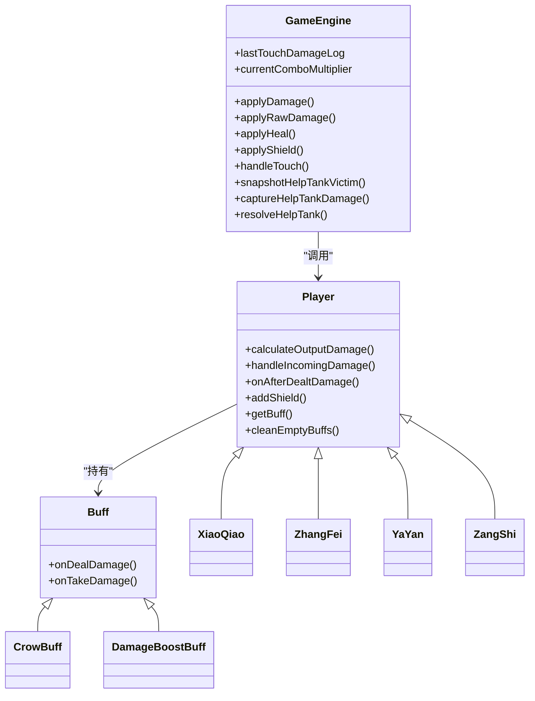

# 伤害计算系统

<cite>
**本文档引用的文件**
- [GameEngine.hx](file://GameEngine.hx)
- [TurnManager.hx](file://TurnManager.hx)
- [Player.hx](file://character/Player.hx)
- [DamageType.hx](file://model/DamageType.hx)
- [ShieldType.hx](file://model/ShieldType.hx)
- [ShieldInstance.hx](file://model/ShieldInstance.hx)
- [Buff.hx](file://model/Buff.hx)
- [CrowBuff.hx](file://buffs/CrowBuff.hx)
- [DamageBoostBuff.hx](file://buffs/DamageBoostBuff.hx)
- [YaYan.hx](file://character/YaYan.hx)
- [ZhangFei.hx](file://character/ZhangFei.hx)
- [XiaoQiao.hx](file://character/XiaoQiao.hx)
- [ZangShi.hx](file://character/ZangShi.hx)
</cite>

## 目录
1. [简介](#简介)
2. [项目结构](#项目结构)
3. [核心组件](#核心组件)
4. [架构总览](#架构总览)
5. [详细组件分析](#详细组件分析)
6. [依赖关系分析](#依赖关系分析)
7. [性能考量](#性能考量)
8. [故障排除指南](#故障排除指南)
9. [结论](#结论)
10. [附录](#附录)

## 简介
本文件系统化梳理伤害计算系统的完整流程与设计，涵盖基础伤害确定、角色加成、攻击者增伤Buff应用、目标减伤与护盾吸收、乌鸦Buff的特殊机制，以及伤害类型系统（物理/法术/真实）与伤害记录（lastTouchDamageLog）、伤害快照（帮抗系统）的实现原理。文档提供算法流程图、序列图与类图，帮助读者快速理解并扩展该系统。

## 项目结构
伤害系统围绕 GameEngine 与 Player 两大核心模块展开，辅以 Buff、伤害类型与护盾类型枚举，以及多个角色对伤害流程的钩子扩展。

图表来源
- [GameEngine.hx:137-233](file://GameEngine.hx#L137-L233)
- [character/Player.hx:245-302](file://character/Player.hx#L245-L302)
- [TurnManager.hx:15-102](file://TurnManager.hx#L15-L102)

章节来源
- [GameEngine.hx:137-233](file://GameEngine.hx#L137-L233)
- [character/Player.hx:245-302](file://character/Player.hx#L245-L302)
- [TurnManager.hx:15-102](file://TurnManager.hx#L15-L102)

## 核心组件
- GameEngine：负责标准伤害流程、原始伤害流程、回血流程、护盾流程、事件广播、伤害记录与帮抗快照。
- Player：提供伤害计算钩子（calculateOutputDamage）、伤害接收处理（handleIncomingDamage）、护盾管理、Buff管理与回合结束结算。
- Buff：提供 onDealDamage/onTakeDamage 等钩子，支撑伤害增减与拦截。
- 伤害类型与护盾类型：定义伤害/护盾分类，决定抗伤与吸收规则。
- 角色扩展：如小乔、张飞、鸦眼等通过钩子扩展伤害倍率、回血反伤、护盾升级、乌鸦机制等。

章节来源
- [GameEngine.hx:137-233](file://GameEngine.hx#L137-L233)
- [character/Player.hx:34-53](file://character/Player.hx#L34-L53)
- [character/Player.hx:245-302](file://character/Player.hx#L245-L302)
- [model/Buff.hx:21-29](file://model/Buff.hx#L21-L29)
- [model/DamageType.hx:3-6](file://model/DamageType.hx#L3-L6)
- [model/ShieldType.hx:3-7](file://model/ShieldType.hx#L3-L7)

## 架构总览
伤害计算遵循“基础伤害 → 角色加成 → 攻击者增伤Buff → 通知广播 → 乌鸦回血 → 记录 → 目标减伤/护盾 → 回响钩子”的顺序。GameEngine 统一调度，Player 负责具体抗伤与 Buff 处理，角色通过钩子参与流程。

图表来源
- [GameEngine.hx:137-233](file://GameEngine.hx#L137-L233)
- [character/Player.hx:245-302](file://character/Player.hx#L245-L302)
- [buffs/CrowBuff.hx:44-55](file://buffs/CrowBuff.hx#L44-L55)

章节来源
- [GameEngine.hx:137-233](file://GameEngine.hx#L137-L233)
- [character/Player.hx:245-302](file://character/Player.hx#L245-L302)
- [buffs/CrowBuff.hx:44-55](file://buffs/CrowBuff.hx#L44-L55)

## 详细组件分析

### 伤害类型系统
- 物理伤害：可被物理/物法护盾、真实护盾吸收；可被反弹/无敌等拦截Buff处理。
- 法术伤害：可被法术/物法护盾、真实护盾吸收；可被反弹/无敌等拦截Buff处理。
- 真实伤害：穿透所有防御性拦截（包括无敌/反弹），但仍受攻击者增伤Buff影响。

章节来源
- [model/DamageType.hx:3-6](file://model/DamageType.hx#L3-L6)
- [model/ShieldType.hx:3-7](file://model/ShieldType.hx#L3-L7)
- [character/Player.hx:276-283](file://character/Player.hx#L276-L283)

### 基础伤害确定与角色加成
- 基础伤害由外部传入（如触碰组合触发的固定数值）。
- 角色可通过 calculateOutputDamage 对物理/真实伤害进行加成（如小乔物伤×1.5、张飞模态加成）。
- 乌鸦Buff在角色乘算前对基础伤害进行加算（物理/真实+20×触发次数，法/毒+10×触发次数）。

章节来源
- [GameEngine.hx:140-162](file://GameEngine.hx#L140-L162)
- [character/XiaoQiao.hx:25-32](file://character/XiaoQiao.hx#L25-L32)
- [character/ZhangFei.hx:95-114](file://character/ZhangFei.hx#L95-L114)
- [buffs/CrowBuff.hx:35-42](file://buffs/CrowBuff.hx#L35-L42)

### 攻击者增伤Buff应用
- 在角色乘算后、目标减伤前，对攻击者Buff进行一次性应用（避免重复消耗）。
- 通过快照/还原机制确保Buff层不被重复消耗，随后在目标抗伤阶段跳过重复应用。

章节来源
- [GameEngine.hx:164-180](file://GameEngine.hx#L164-L180)
- [character/Player.hx:267-276](file://character/Player.hx#L267-L276)

### 目标减伤与护盾吸收
- 目标侧先处理攻击者Buff（如双4翻倍），再处理自身拦截（如双5反弹、双1无敌）。
- 记录“减伤后但未被护盾抵挡前”的伤害值 damageBeforeShield。
- 护盾按持续时间排序优先抵消，支持物理/法术/物法/真实护盾的吸收规则。

章节来源
- [character/Player.hx:245-302](file://character/Player.hx#L245-L302)
- [model/ShieldInstance.hx:3-12](file://model/ShieldInstance.hx#L3-L12)

### 乌鸦Buff的特殊机制
- 乌鸦在基础伤害阶段加算（物理/真实+20×触发次数，法/毒+10×触发次数）。
- 乘算后增量通过 onTriggered 回调鸦眼，使其获得等量 RECOVERY 回血与触发次数只乌鸦。
- extraTriggers 由鸦眼技能注入（灼燃箭+2，魔王剑再+2），并在触发后重置。

章节来源
- [buffs/CrowBuff.hx:8-20](file://buffs/CrowBuff.hx#L8-L20)
- [buffs/CrowBuff.hx:35-42](file://buffs/CrowBuff.hx#L35-L42)
- [buffs/CrowBuff.hx:44-55](file://buffs/CrowBuff.hx#L44-L55)
- [character/YaYan.hx:151-164](file://character/YaYan.hx#L151-L164)

### 伤害记录与伤害快照（帮抗系统）
- lastTouchDamageLog 记录对 lastTouchDamageTarget 造成的每笔输出伤害（类型+数值），用于帮抗确认。
- snapshotHelpTankVictim 快照目标攻击前的 HP 与护盾。
- captureHelpTankDamage 冻结本次触碰记录的伤害快照。
- resolveHelpTank 将快照伤害×1.5打给辅助者（helper），仅走其减伤/护盾，不触发攻击者副作用。

章节来源
- [GameEngine.hx:22-29](file://GameEngine.hx#L22-L29)
- [GameEngine.hx:616-685](file://GameEngine.hx#L616-L685)

### 组合倍率与双九机制
- 双九组合根据场上“3的倍数（不含0）”数量计算倍率 1.5^N，先加后乘，再与角色加成、攻击者增伤共同作用。

章节来源
- [GameEngine.hx:498-503](file://GameEngine.hx#L498-L503)
- [GameEngine.hx:153-158](file://GameEngine.hx#L153-L158)

### 回响钩子与广播
- 通知广播：notifyOutputDamage 在攻击者侧加成完成后广播最终输出值，供孙悟空等角色监听。
- 攻击者钩子：onAfterDealtDamage 在目标减伤/护盾后触发，支持小乔“打人补给”等机制。
- 回血/护盾事件广播：用于角色监听（如藏师草莓蛋糕）。

章节来源
- [GameEngine.hx:79-85](file://GameEngine.hx#L79-L85)
- [character/Player.hx:53](file://character/Player.hx#L53-L53)
- [character/XiaoQiao.hx:45-62](file://character/XiaoQiao.hx#L45-L62)

### 角色特化伤害机制示例

#### 小乔（物理伤害×1.5、回血×1.5、回血反伤、护盾升级）
- 物理伤害×1.5、回血×1.5、回血时对敌方造成等量物理伤害、护盾升级为物法盾×1.5。
- 回响钩子：onAfterDealtDamage（补给）、onAfterHeal（反伤）。

章节来源
- [character/XiaoQiao.hx:25-40](file://character/XiaoQiao.hx#L25-L40)
- [character/XiaoQiao.hx:45-62](file://character/XiaoQiao.hx#L45-L62)
- [character/XiaoQiao.hx:65-70](file://character/XiaoQiao.hx#L65-L70)

#### 张飞（模态加成、模态2第二刀、模态3回血、怒气与狂暴）
- 模态1：物理伤害×1.5；模态2：0.75倍伤害打两个敌人；模态3：造成物伤一半回血。
- onAfterDealtDamage 中处理模态2第二刀与模态3回血。
- 狂暴期间0使用回合数增加、受击免疫提升、回血翻倍。

章节来源
- [character/ZhangFei.hx:95-114](file://character/ZhangFei.hx#L95-L114)
- [character/ZhangFei.hx:122-159](file://character/ZhangFei.hx#L122-L159)
- [character/ZhangFei.hx:44-62](file://character/ZhangFei.hx#L44-L62)

#### 藏师（物伤减半、反弹、回血×2.5、护盾×2）
- 受到物理伤害减半，实际扣血量50%反弹（上限200），回血×2.5，护盾厚度×2，物理盾附加一半法术盾。
- 回响钩子：onAnyHealHappened/onAnyShieldGained/onAfterDealtDamage 监听事件计数草莓蛋糕。

章节来源
- [character/ZangShi.hx:39-69](file://character/ZangShi.hx#L39-L69)
- [character/ZangShi.hx:72-90](file://character/ZangShi.hx#L72-L90)
- [character/ZangShi.hx:112-129](file://character/ZangShi.hx#L112-L129)

#### 鸦眼（乌鸦诅咒、灼燃箭、魔王剑）
- 乌鸦诅咒：对目标阵营施加CrowBuff，物理/真实基础+20×触发次数，法/毒+10×触发次数。
- 灼燃箭：开启后攻击时注入 extraTriggers，造成法伤并自补等量血，随后自耗物理伤害。
- 魔王剑：消耗6只乌鸦，额外法伤×2、回血×2。

章节来源
- [character/YaYan.hx:37-60](file://character/YaYan.hx#L37-L60)
- [character/YaYan.hx:105-164](file://character/YaYan.hx#L105-L164)
- [buffs/CrowBuff.hx:8-20](file://buffs/CrowBuff.hx#L8-L20)

### 伤害计算算法与流程图

#### 标准伤害流程（applyDamage）

图表来源
- [GameEngine.hx:137-233](file://GameEngine.hx#L137-L233)
- [character/Player.hx:245-302](file://character/Player.hx#L245-L302)

#### 目标抗伤与护盾吸收（handleIncomingDamage）

图表来源
- [character/Player.hx:245-302](file://character/Player.hx#L245-L302)

#### 帮抗快照与转移

图表来源
- [GameEngine.hx:616-685](file://GameEngine.hx#L616-L685)

## 依赖关系分析
- GameEngine 依赖 Player、TurnManager、Buff、伤害/护盾类型枚举。
- Player 依赖 Buff、伤害/护盾类型、DamageResult 结构体。
- 角色类（如小乔、张飞、鸦眼、藏师）继承 Player 并重写钩子，扩展伤害倍率、回血、护盾与特殊机制。
- Buff 系统通过 onDealDamage/onTakeDamage 与 GameEngine 的快照/还原配合，避免重复消耗。

图表来源
- [GameEngine.hx:137-233](file://GameEngine.hx#L137-L233)
- [character/Player.hx:34-53](file://character/Player.hx#L34-L53)
- [character/Player.hx:245-302](file://character/Player.hx#L245-L302)
- [model/Buff.hx:21-29](file://model/Buff.hx#L21-L29)
- [character/XiaoQiao.hx:25-40](file://character/XiaoQiao.hx#L25-L40)
- [character/ZhangFei.hx:95-114](file://character/ZhangFei.hx#L95-L114)
- [character/YaYan.hx:37-60](file://character/YaYan.hx#L37-L60)
- [character/ZangShi.hx:39-69](file://character/ZangShi.hx#L39-L69)
- [buffs/CrowBuff.hx:44-55](file://buffs/CrowBuff.hx#L44-L55)
- [buffs/DamageBoostBuff.hx:11-19](file://buffs/DamageBoostBuff.hx#L11-L19)

章节来源
- [GameEngine.hx:137-233](file://GameEngine.hx#L137-L233)
- [character/Player.hx:34-53](file://character/Player.hx#L34-L53)
- [character/Player.hx:245-302](file://character/Player.hx#L245-L302)
- [model/Buff.hx:21-29](file://model/Buff.hx#L21-L29)

## 性能考量
- Buff 应用采用单次快照/还原策略，避免重复消耗与多次遍历，降低复杂度。
- 护盾吸收按持续时间排序，减少无效比较；空护盾与空Buff及时清理，保持线性扫描效率。
- 伤害记录与快照在触碰阶段启用/关闭，避免全局常驻开销。

## 故障排除指南
- 乌鸦回血异常：检查 onTriggered 是否在乘算后调用，extraTriggers 是否在触发后重置。
- 双4翻倍重复：确认 GameEngine 中快照/还原与 _skipAttackerDealBuffs 的配合。
- 真伤未穿透：确认目标拦截Buff未对真实伤害生效，且攻击者增伤仍可作用。
- 帮抗无效：确认 snapshot/capture/resolve 三步是否完整执行，helper 是否存活且目标一致。

章节来源
- [buffs/CrowBuff.hx:44-55](file://buffs/CrowBuff.hx#L44-L55)
- [GameEngine.hx:164-180](file://GameEngine.hx#L164-L180)
- [character/Player.hx:278-288](file://character/Player.hx#L278-L288)
- [GameEngine.hx:616-685](file://GameEngine.hx#L616-L685)

## 结论
该伤害系统通过清晰的阶段划分与钩子扩展，实现了高可定制的角色机制与稳定的抗伤/护盾吸收流程。乌鸦、双4、小乔、张飞、鸦眼、藏师等角色通过统一的钩子与Buff体系无缝接入，既保证了平衡性，也为未来扩展提供了良好基础。

## 附录

### 伤害类型与护盾吸收对照表
- 物理伤害可被：物理护盾、物法护盾、真实护盾吸收。
- 法术伤害可被：法术护盾、物法护盾、真实护盾吸收。
- 真实伤害不可被防御性拦截（无敌/反弹）吸收，但可被真实护盾吸收。

章节来源
- [model/ShieldType.hx:3-7](file://model/ShieldType.hx#L3-L7)
- [character/Player.hx:299-306](file://character/Player.hx#L299-L306)