# 帮抗系统

<cite>
**本文档引用的文件**
- [GameEngine.hx](file://GameEngine.hx)
- [TurnManager.hx](file://TurnManager.hx)
- [Player.hx](file://model/Player.hx)
- [game2-core.js](file://js/game2-core.js)
- [game2-dialogs.js](file://js/game2-dialogs.js)
- [game2-state.js](file://js/game2-state.js)
- [main.js](file://main.js)
- [XiaoQiao.hx](file://character/XiaoQiao.hx)
- [DaQiao.hx](file://character/DaQiao.hx)
- [ZhangFei.hx](file://character/ZhangFei.hx)
</cite>

## 目录
1. [简介](#简介)
2. [项目结构](#项目结构)
3. [核心组件](#核心组件)
4. [架构概览](#架构概览)
5. [详细组件分析](#详细组件分析)
6. [依赖关系分析](#依赖关系分析)
7. [性能考虑](#性能考虑)
8. [故障排除指南](#故障排除指南)
9. [结论](#结论)

## 简介

帮抗系统是本游戏中的核心机制之一，允许队伍中的辅助角色在队友即将阵亡时接管伤害，保护队友生存。该系统实现了完整的伤害快照、受害者状态恢复和辅助承受伤害的全流程管理。

## 项目结构

游戏采用Haxe开发，前端使用JavaScript，整体架构分为三层：

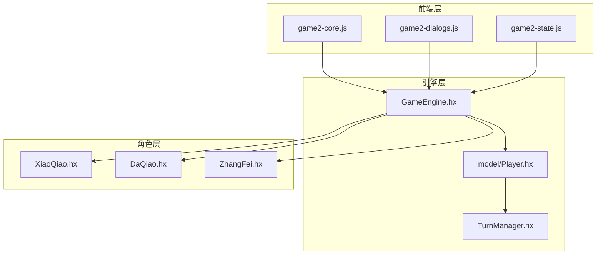

**图表来源**
- [GameEngine.hx:16-725](file://GameEngine.hx#L16-L725)
- [Player.hx:1-398](file://model/Player.hx#L1-L398)

**章节来源**
- [GameEngine.hx:1-725](file://GameEngine.hx#L1-L725)
- [TurnManager.hx:1-232](file://TurnManager.hx#L1-L232)

## 核心组件

帮抗系统主要由以下核心组件构成：

### 1. GameEngine（游戏引擎）
- 负责整个帮抗流程的协调和管理
- 维护伤害快照和受害者状态
- 处理辅助承受伤害的计算逻辑

### 2. Player（玩家基类）
- 提供伤害抗性计算的基础框架
- 实现护盾和减伤的完整逻辑
- 支持角色特定的伤害处理

### 3. 前端交互层
- game2-core.js：核心游戏逻辑和帮抗检测
- game2-dialogs.js：帮抗弹窗和用户交互
- game2-state.js：2v2模式下的抗伤位解析

**章节来源**
- [GameEngine.hx:616-685](file://GameEngine.hx#L616-L685)
- [Player.hx:262-325](file://model/Player.hx#L262-L325)

## 架构概览

帮抗系统采用"快照-冻结-接管"的三阶段设计：

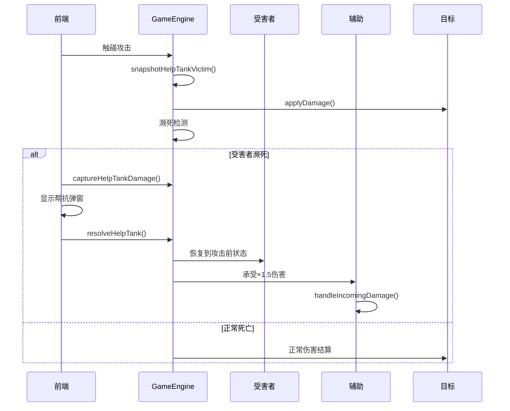

**图表来源**
- [GameEngine.hx:616-685](file://GameEngine.hx#L616-L685)
- [game2-core.js:85-163](file://js/game2-core.js#L85-L163)

## 详细组件分析

### 1. 帮抗快照机制

#### snapshotHelpTankVictim方法
负责在攻击前快照受害者的防御状态：

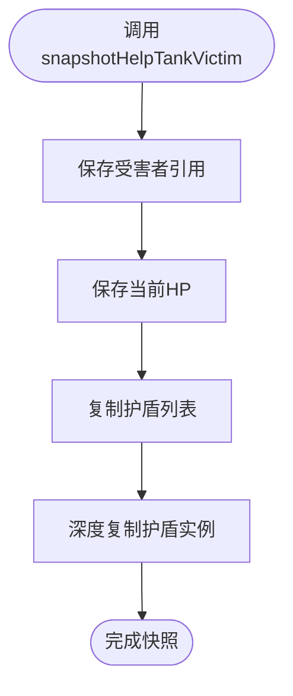

**图表来源**
- [GameEngine.hx:616-625](file://GameEngine.hx#L616-L625)

#### captureHelpTankDamage方法
冻结本次触碰产生的伤害记录：

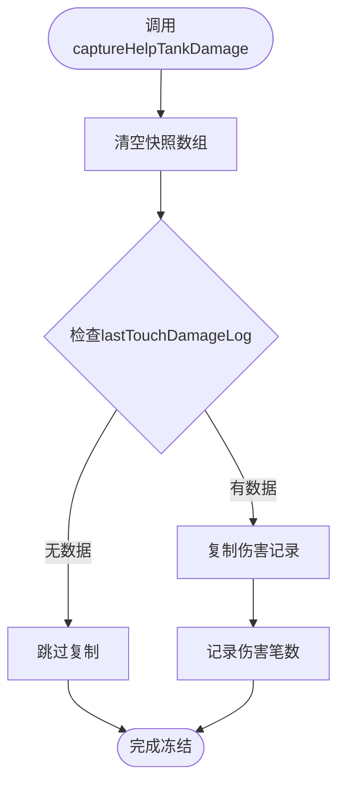

**图表来源**
- [GameEngine.hx:631-639](file://GameEngine.hx#L631-L639)

#### resolveHelpTank方法
执行帮抗接管和伤害计算：

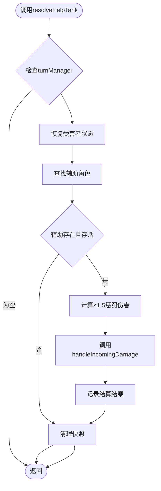

**图表来源**
- [GameEngine.hx:647-685](file://GameEngine.hx#L647-L685)

**章节来源**
- [GameEngine.hx:616-685](file://GameEngine.hx#L616-L685)

### 2. 伤害快照数据结构

帮抗系统维护以下关键数据：

| 数据成员 | 类型 | 描述 | 作用 |
|---------|------|------|------|
| `_htVictim` | Player | 受害者引用 | 保存攻击前的受害者状态 |
| `_htVictimHp` | Int | 受害者HP | 用于恢复到攻击前的血量 |
| `_htVictimShields` | Array<ShieldInstance> | 护盾快照 | 恢复到攻击前的护盾状态 |
| `_htDamageSnapshot` | Array<Object> | 伤害快照 | 冻结本次触碰的伤害记录 |

**章节来源**
- [GameEngine.hx:32-35](file://GameEngine.hx#L32-L35)

### 3. 前端集成机制

#### 濒死检测流程
前端负责检测受害者是否濒死并触发帮抗弹窗：

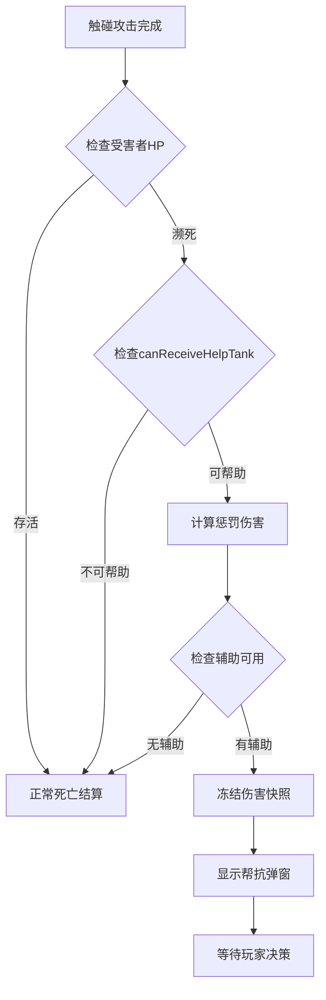

**图表来源**
- [game2-core.js:114-163](file://js/game2-core.js#L114-L163)

#### 弹窗交互
前端弹窗提供帮抗确认/取消功能：

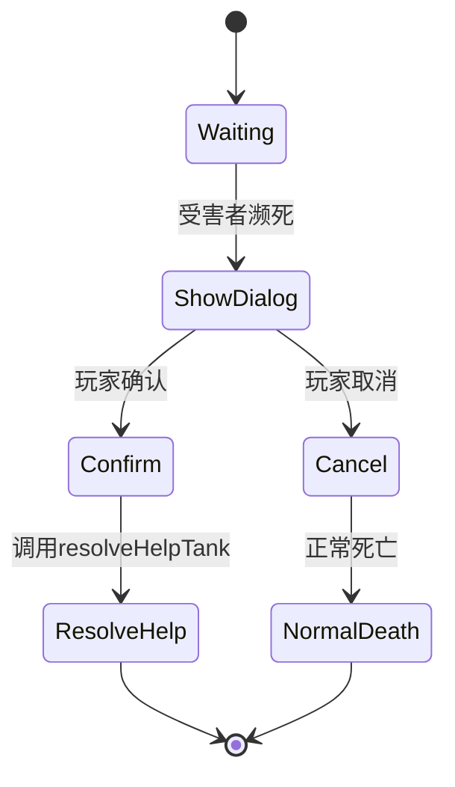

**图表来源**
- [game2-dialogs.js:6-49](file://js/game2-dialogs.js#L6-L49)

**章节来源**
- [game2-core.js:85-163](file://js/game2-core.js#L85-L163)
- [game2-dialogs.js:51-88](file://js/game2-dialogs.js#L51-L88)

### 4. 角色特化支持

#### 大乔的复活甲机制
大乔具有特殊的复活甲机制，会影响帮抗的触发：

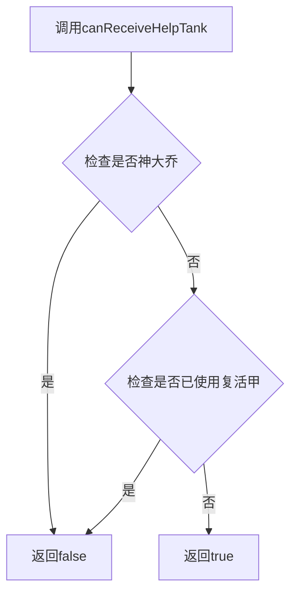

**图表来源**
- [DaQiao.hx:108-110](file://character/DaQiao.hx#L108-L110)

#### 小乔的伤害倍率
小乔的1.5倍伤害加成会影响帮抗惩罚的计算：

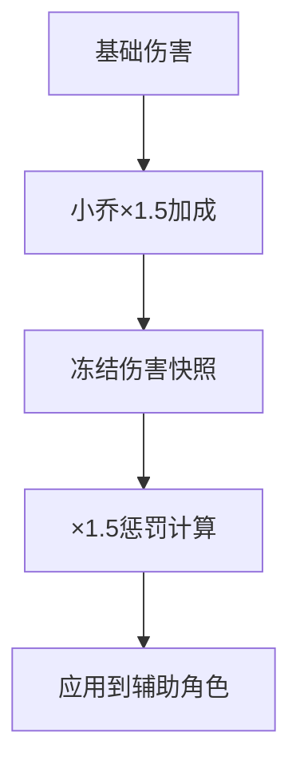

**图表来源**
- [XiaoQiao.hx:25-32](file://character/XiaoQiao.hx#L25-L32)

**章节来源**
- [DaQiao.hx:108-110](file://character/DaQiao.hx#L108-L110)
- [XiaoQiao.hx:25-32](file://character/XiaoQiao.hx#L25-L32)

### 5. 2v2模式战术价值

#### 抗伤位解析器
2v2模式下，抗伤位可以通过`tankResolver`进行动态解析：

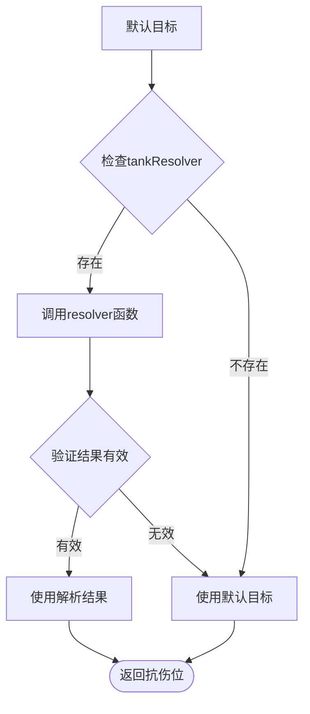

**图表来源**
- [game2-state.js:222-241](file://js/game2-state.js#L222-L241)

#### 战术应用场景
- **保护核心输出**：辅助角色保护主要伤害输出者
- **团队配合**：通过抗伤位实现团队战术配合
- **资源分配**：合理分配队伍中的生存资源

**章节来源**
- [game2-state.js:222-241](file://js/game2-state.js#L222-L241)

## 依赖关系分析

帮抗系统的关键依赖关系如下：

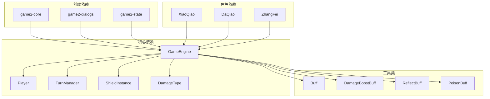

**图表来源**
- [GameEngine.hx:1-15](file://GameEngine.hx#L1-L15)
- [Player.hx:1-20](file://model/Player.hx#L1-L20)

**章节来源**
- [GameEngine.hx:1-15](file://GameEngine.hx#L1-L15)
- [Player.hx:1-20](file://model/Player.hx#L1-L20)

## 性能考虑

### 1. 内存管理
- 快照数据在每次帮抗后自动清理，避免内存泄漏
- 深度复制护盾实例确保状态隔离
- 伤害记录数组在冻结后立即清空

### 2. 计算优化
- 帮抗惩罚计算使用`Math.ceil()`确保伤害值为整数
- 仅在必要时创建新的护盾实例
- 避免重复计算相同的伤害值

### 3. 前端响应性
- 帮抗弹窗异步显示，不影响游戏主流程
- 联机模式下等待其他玩家决策
- 及时清理定时器和事件监听器

## 故障排除指南

### 1. 常见问题及解决方案

#### 问题：帮抗弹窗不显示
**可能原因**：
- 受害者HP未达到濒死状态
- 辅助角色不存在或已阵亡
- 角色重写了`canReceiveHelpTank`方法

**解决方法**：
- 检查`tryHelpTankOrPause`函数的逻辑
- 验证辅助角色的存活状态
- 确认角色的`canReceiveHelpTank`返回值

#### 问题：帮抗后受害者仍然死亡
**可能原因**：
- 帮助者无法承受×1.5的伤害
- 伤害快照被后续操作清空
- 角色拥有复活机制（如大乔复活甲）

**解决方法**：
- 检查`captureHelpTankDamage`是否正确执行
- 验证`resolveHelpTank`的调用时机
- 确认角色的复活机制优先级

#### 问题：联机模式下帮抗不同步
**可能原因**：
- 辅助玩家不是当前控制者
- 网络延迟导致决策不同步
- 前端状态不同步

**解决方法**：
- 检查`ONLINE.charControl`映射
- 验证`waitingRemoteHelpTank`标志
- 确认前后端状态同步机制

**章节来源**
- [game2-core.js:114-163](file://js/game2-core.js#L114-L163)
- [game2-dialogs.js:51-88](file://js/game2-dialogs.js#L51-L88)

### 2. 调试技巧

#### 日志追踪
- 使用`trace`函数记录关键步骤
- 检查`lastTouchDamageLog`的内容
- 监控快照数据的变化

#### 状态检查
- 验证`_htVictim`是否正确设置
- 检查`_htDamageSnapshot`的完整性
- 确认`_skipAttackerDealBuffs`标记的状态

## 结论

帮抗系统通过精心设计的快照机制和严格的流程控制，实现了团队协作中的生存保护功能。系统的主要特点包括：

1. **完整性**：实现了从快照到接管的完整流程
2. **灵活性**：支持多种角色特化和2v2模式
3. **可靠性**：通过深拷贝确保状态隔离
4. **用户体验**：提供直观的弹窗交互和超时机制

该系统为游戏提供了重要的战术深度，使得玩家需要考虑团队配合和资源分配，增强了游戏的战略性和可玩性。通过合理的实现和优化，帮抗系统能够在保持性能的同时提供流畅的游戏体验。