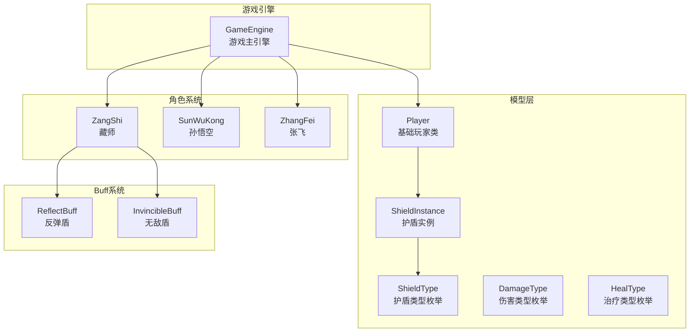
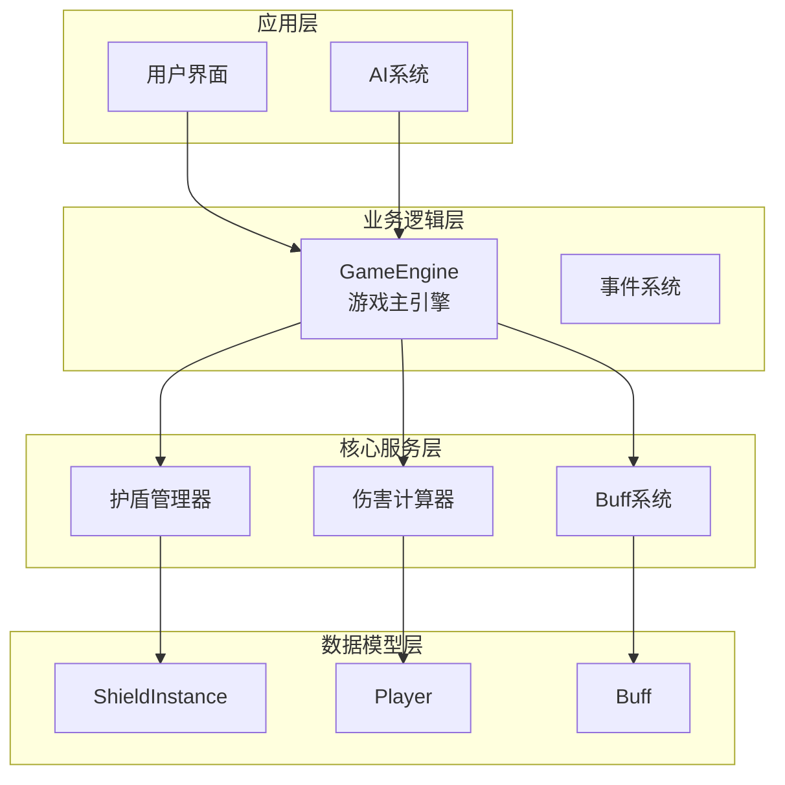
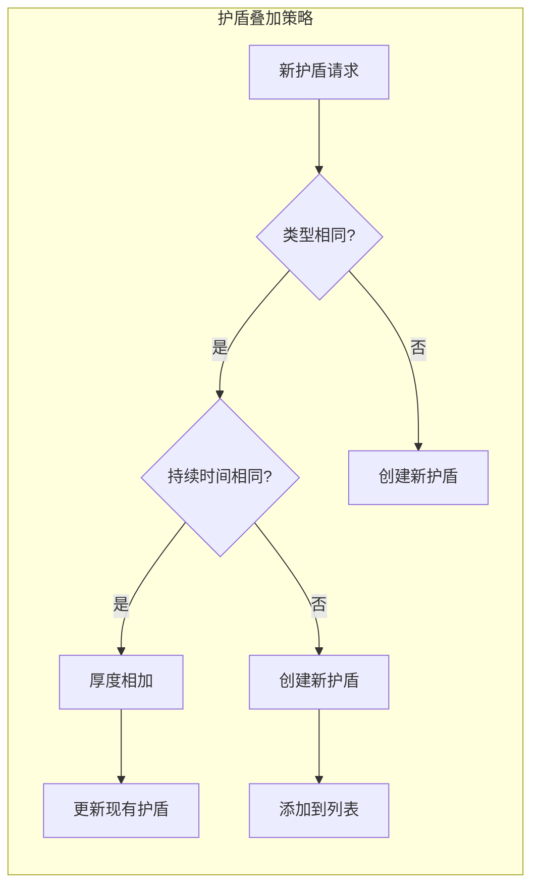
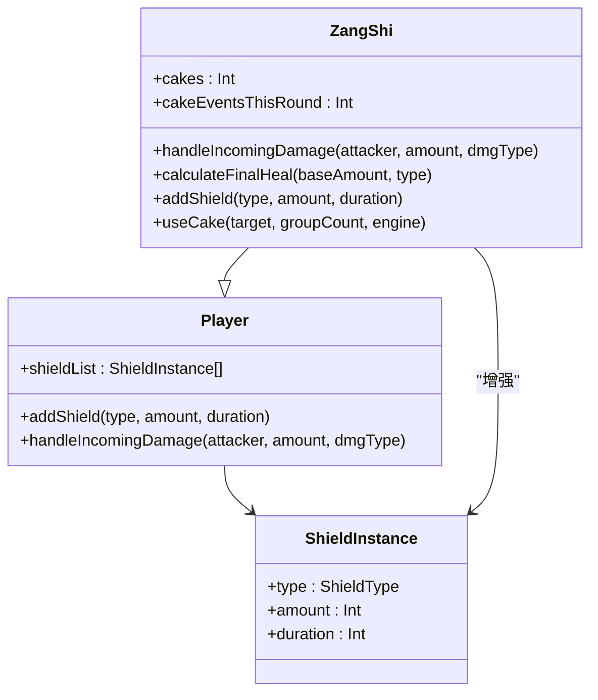
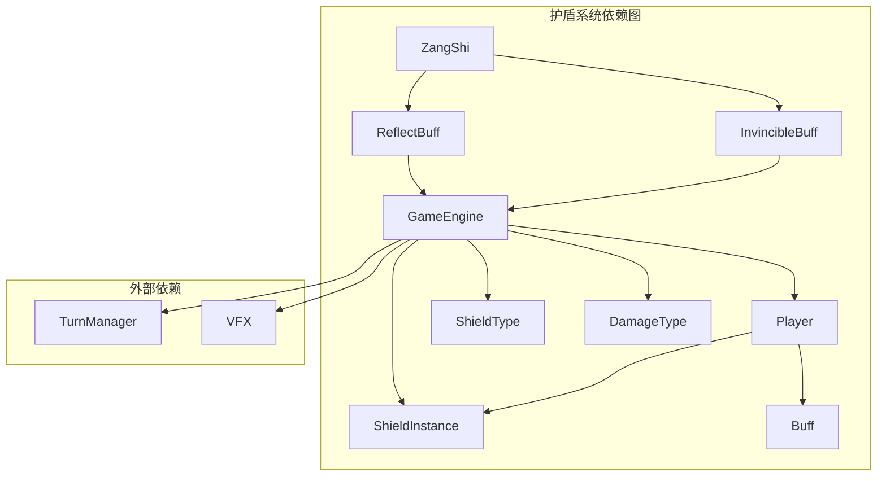

# 护盾防护系统

<cite>
**本文档引用的文件**
- [GameEngine.hx](file://GameEngine.hx)
- [Player.hx](file://model/Player.hx)
- [ShieldInstance.hx](file://model/ShieldInstance.hx)
- [ShieldType.hx](file://model/ShieldType.hx)
- [DamageType.hx](file://model/DamageType.hx)
- [HealType.hx](file://model/HealType.hx)
- [ZangShi.hx](file://character/ZangShi.hx)
- [SunWuKong.hx](file://character/SunWuKong.hx)
- [ZhangFei.hx](file://character/ZhangFei.hx)
- [ReflectBuff.hx](file://buffs/ReflectBuff.hx)
- [InvincibleBuff.hx](file://buffs/InvincibleBuff.hx)
</cite>

## 目录
1. [简介](#简介)
2. [项目结构](#项目结构)
3. [核心组件](#核心组件)
4. [架构概览](#架构概览)
5. [详细组件分析](#详细组件分析)
6. [依赖关系分析](#依赖关系分析)
7. [性能考虑](#性能考虑)
8. [故障排除指南](#故障排除指南)
9. [结论](#结论)

## 简介

护盾防护系统是游戏引擎中的核心防御机制，负责管理角色的护盾生成、厚度计算、持续时间管理和吸收机制。该系统采用模块化设计，支持多种护盾类型和复杂的叠加规则，为游戏提供了丰富的战术深度。

系统的核心特点包括：
- 多层次护盾类型支持（物理、法术、物法盾、真实护盾）
- 智能护盾叠加和优先级管理
- 坦脆流坦克特殊护盾加成机制
- 完整的伤害分摊和护盾破碎处理
- 与角色技能和buff系统的无缝集成

## 项目结构

护盾系统采用分层架构设计，主要文件组织如下：



**图表来源**
- [GameEngine.hx:1-725](file://GameEngine.hx#L1-L725)
- [Player.hx:1-375](file://model/Player.hx#L1-L375)
- [ShieldInstance.hx:1-13](file://model/ShieldInstance.hx#L1-L13)

**章节来源**
- [GameEngine.hx:1-725](file://GameEngine.hx#L1-L725)
- [Player.hx:1-375](file://model/Player.hx#L1-L375)

## 核心组件

### 护盾数据模型

护盾系统的核心数据结构由三个主要组件构成：

#### ShieldInstance - 护盾实例
- **类型属性**: `type: ShieldType` - 护盾类型
- **厚度属性**: `amount: Int` - 护盾剩余厚度
- **持续属性**: `duration: Int` - 护盾剩余持续时间

#### ShieldType - 护盾类型枚举
系统支持四种基本护盾类型：
- `PHYSICAL`: 仅抵挡物理伤害
- `MAGIC`: 仅抵挡法术伤害  
- `BOTH_PHYSICAL_MAGIC`: 抵挡物理和法术伤害（物法盾）
- `TRUE`: 抵挡真实伤害

#### DamageType - 伤害类型枚举
与护盾系统紧密配合的伤害类型系统：
- `PHYSICAL`: 物理伤害
- `MAGIC`: 法术伤害
- `TRUE`: 真实伤害

**章节来源**
- [ShieldInstance.hx:1-13](file://model/ShieldInstance.hx#L1-L13)
- [ShieldType.hx:1-8](file://model/ShieldType.hx#L1-L8)
- [DamageType.hx:1-7](file://model/DamageType.hx#L1-L7)

### 核心算法

#### 护盾吸收算法
护盾吸收采用"最优匹配"策略，确保伤害能够最大化地被护盾吸收：

```mermaid
flowchart TD
Start([伤害进入]) --> CheckAmount{"finalDamage > 0?"}
CheckAmount --> |否| ReturnZero[返回 {0, 0}]
CheckAmount --> |是| FindValid[查找可用护盾]
FindValid --> FilterByType[按伤害类型过滤护盾]
FilterByType --> SortByDuration[按持续时间排序]
SortByDuration --> HasShield{"有可用护盾?"}
HasShield --> |否| NoShield[无护盾可挡]
HasShield --> |是| ApplyShield[应用最佳护盾]
ApplyShield --> Enough{"护盾厚度足够?"}
Enough --> |是| ReduceAmount[减少护盾厚度]
Enough --> |否| ClearShield[清空护盾]
ReduceAmount --> CheckAgain{"finalDamage > 0?"}
ClearShield --> CheckAgain
CheckAgain --> |是| FindValid
CheckAgain --> |否| DeductHP[扣除剩余伤害]
NoShield --> DeductHP
DeductHP --> ReturnResult[返回结果]
ReturnZero --> End([结束])
ReturnResult --> End
```

**图表来源**
- [Player.hx:293-320](file://model/Player.hx#L293-L320)

**章节来源**
- [Player.hx:293-320](file://model/Player.hx#L293-L320)

## 架构概览

护盾系统采用"引擎-角色-护盾"三层架构，实现了高度的模块化和可扩展性：



**图表来源**
- [GameEngine.hx:16-40](file://GameEngine.hx#L16-L40)
- [Player.hx:3-24](file://model/Player.hx#L3-L24)

**章节来源**
- [GameEngine.hx:16-40](file://GameEngine.hx#L16-L40)
- [Player.hx:3-24](file://model/Player.hx#L3-L24)

## 详细组件分析

### GameEngine - 护盾管理核心

#### 护盾生成机制
GameEngine提供统一的护盾生成接口，支持角色特定的护盾增强：

```mermaid
sequenceDiagram
participant Actor as 角色
participant Engine as GameEngine
participant Target as 目标玩家
Actor->>Engine : applyShield(type, amount, duration)
Engine->>Engine : 检查坦脆流加成
alt 坦脆流坦克
Engine->>Engine : 物法盾升级
Engine->>Engine : 厚度×1.5
end
Engine->>Target : addShield(finalType, finalAmount, finalDuration)
Engine->>Engine : notifyShieldEvent()
```

**图表来源**
- [GameEngine.hx:327-346](file://GameEngine.hx#L327-L346)

#### 坦脆流特殊加成机制
坦脆流坦克享有独特的护盾增强效果：

| 护盾类型 | 原始效果 | 坦脆流加成 |
|---------|---------|-----------|
| 物理护盾 | 厚度N，持续D回合 | 升级为物法盾，厚度×1.5，持续+1 |
| 法术护盾 | 厚度N，持续D回合 | 升级为物法盾，厚度×1.5，持续+1 |
| 物法护盾 | 厚度N，持续D回合 | 厚度×1.5，持续保持 |

**章节来源**
- [GameEngine.hx:332-342](file://GameEngine.hx#L332-L342)

### Player - 护盾核心逻辑

#### 护盾叠加规则
Player类实现了智能的护盾叠加机制：



**图表来源**
- [Player.hx:240-252](file://model/Player.hx#L240-L252)

#### 伤害吸收流程
完整的伤害吸收流程包括多个阶段：

1. **攻击者Buff处理**: 应用攻击者的增益效果
2. **目标Buff拦截**: 应用目标的防御性Buff
3. **护盾吸收**: 按优先级使用护盾
4. **最终扣血**: 扣除剩余伤害

**章节来源**
- [Player.hx:245-302](file://model/Player.hx#L245-L302)

### 角色特殊护盾机制

#### 藏师 - 护盾增强与反弹
藏师拥有独特的护盾增强机制：



**图表来源**
- [ZangShi.hx:19-202](file://character/ZangShi.hx#L19-L202)
- [Player.hx:223-235](file://model/Player.hx#L223-L235)

#### 孙悟空 - 护盾触发机制
孙悟空通过组合技能触发护盾效果：

**章节来源**
- [ZangShi.hx:79-90](file://character/ZangShi.hx#L79-L90)
- [SunWuKong.hx:136-166](file://character/SunWuKong.hx#L136-L166)

#### 张飞 - 模态与护盾
张飞的模态系统与护盾机制协同工作：

**章节来源**
- [ZhangFei.hx:95-114](file://character/ZhangFei.hx#L95-L114)

## 依赖关系分析

护盾系统与其他游戏组件存在密切的依赖关系：



**图表来源**
- [GameEngine.hx:16-15](file://GameEngine.hx#L16-L15)
- [Player.hx:3-17](file://model/Player.hx#L3-L17)

**章节来源**
- [GameEngine.hx:16-15](file://GameEngine.hx#L16-L15)
- [Player.hx:3-17](file://model/Player.hx#L3-L17)

## 性能考虑

### 时间复杂度分析
- **护盾查找**: O(n) - 线性扫描可用护盾
- **护盾排序**: O(k log k) - k为可用护盾数量
- **整体复杂度**: O(n) - 护盾系统的主要瓶颈

### 空间复杂度分析
- **护盾存储**: O(n) - n为当前活跃护盾数量
- **临时缓冲**: O(k) - k为单次伤害的护盾数量

### 优化建议
1. **护盾索引优化**: 为常用护盾类型建立索引
2. **批量处理**: 合并相似护盾请求
3. **缓存机制**: 缓存护盾有效性检查结果

## 故障排除指南

### 常见问题诊断

#### 护盾不生效
1. **检查护盾类型匹配**
   - 确认伤害类型与护盾类型兼容
   - 验证物法盾对物理和法术伤害的支持

2. **验证护盾厚度**
   - 检查护盾剩余厚度是否大于0
   - 确认护盾持续时间未到期

#### 护盾叠加异常
1. **检查叠加规则**
   - 确认相同类型和持续时间的护盾正确合并
   - 验证不同类型的护盾独立存储

2. **调试信息**
   ```javascript
   // 在GameEngine中启用详细日志
   trace('护盾状态:', JSON.stringify(player.shieldList));
   ```

**章节来源**
- [Player.hx:329-335](file://model/Player.hx#L329-L335)

### 调试技巧

#### 日志追踪
- 启用GameEngine的详细追踪功能
- 监控护盾生成和消耗事件
- 跟踪伤害分摊过程

#### 性能监控
- 监控护盾数量增长趋势
- 分析护盾吸收效率
- 识别潜在的内存泄漏

## 结论

护盾防护系统通过精心设计的架构和算法，为游戏提供了强大而灵活的防御机制。系统的主要优势包括：

1. **模块化设计**: 清晰的分层架构便于维护和扩展
2. **智能算法**: 优化的护盾吸收策略确保公平的游戏体验
3. **角色特色**: 各角色独特的护盾机制增加了战术深度
4. **性能优化**: 高效的数据结构和算法保证了良好的运行性能

未来可以考虑的改进方向：
- 实现更复杂的护盾交互机制
- 添加护盾可视化效果
- 优化大规模战斗中的性能表现