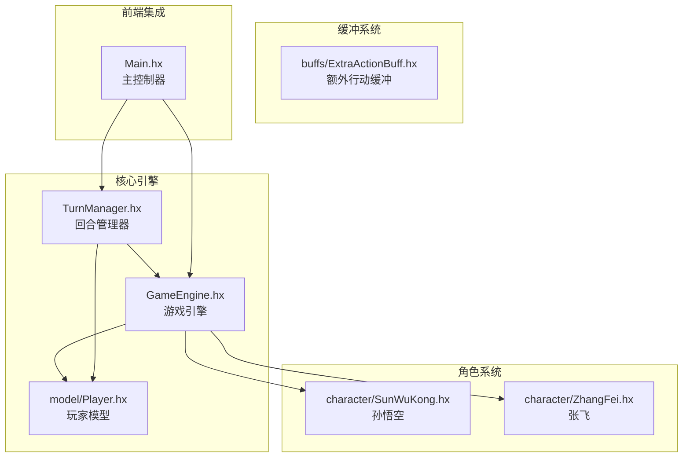
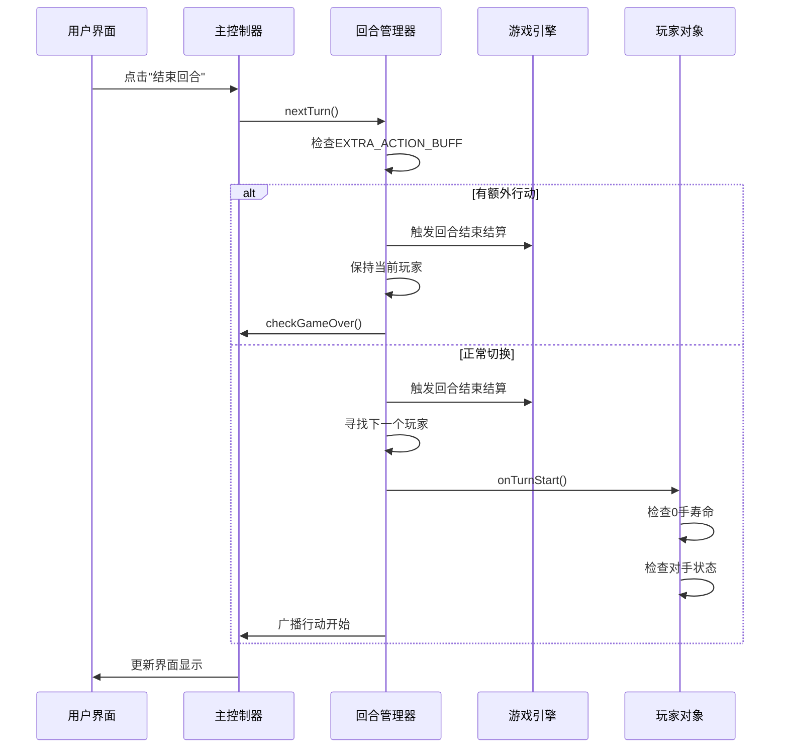
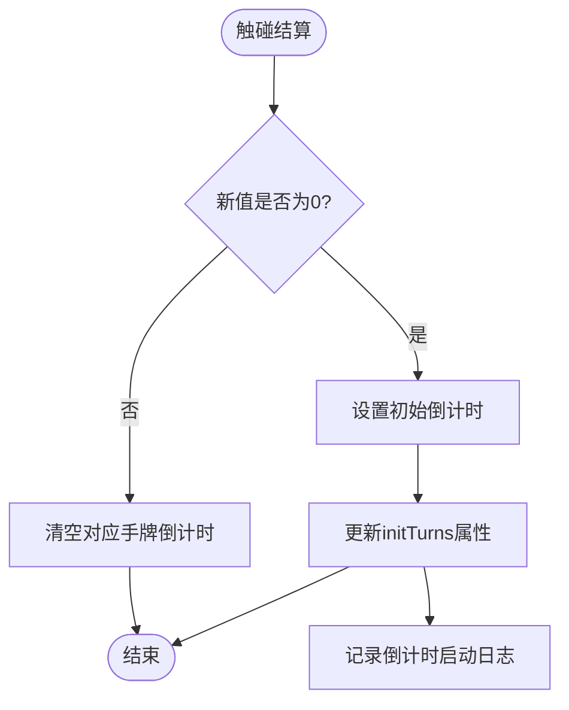
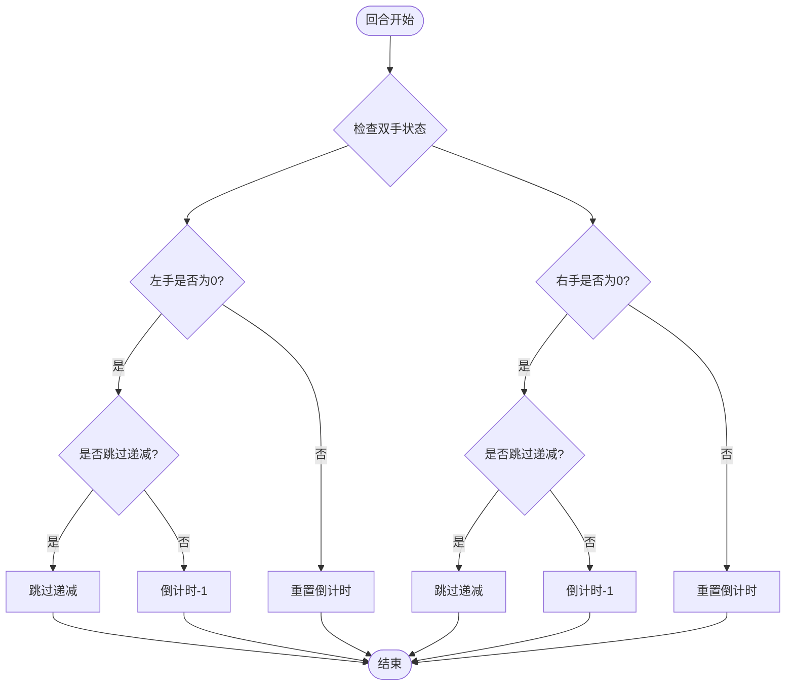
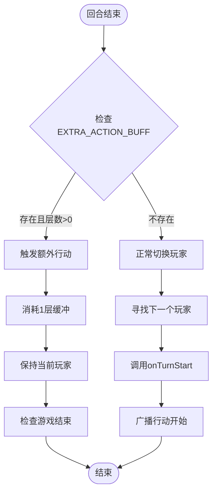
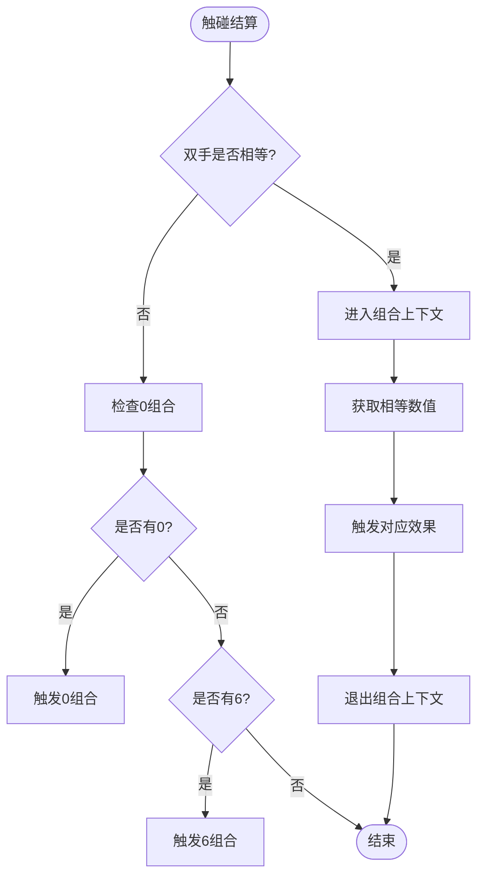
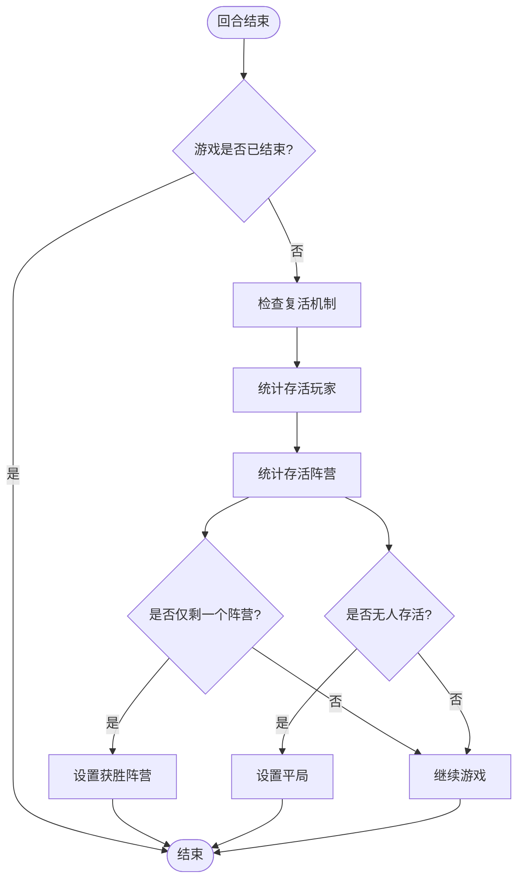
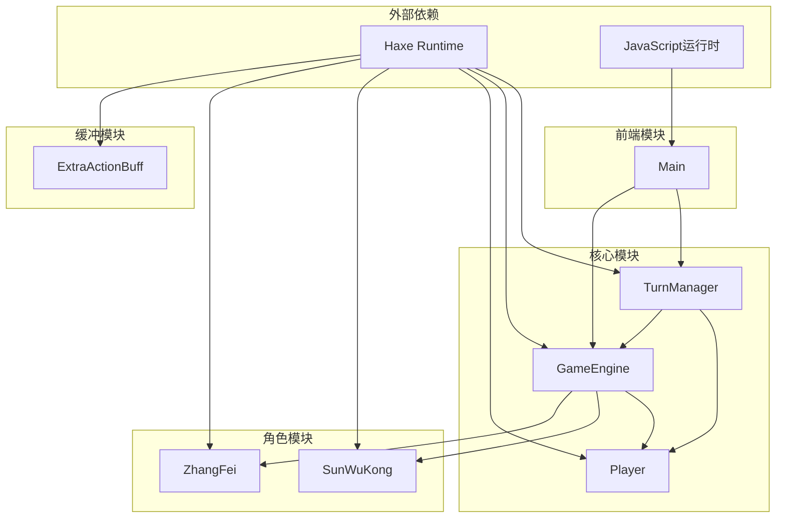

# 回合管理系统

<cite>
**本文档引用的文件**
- [TurnManager.hx](file://TurnManager.hx)
- [GameEngine.hx](file://GameEngine.hx)
- [Main.hx](file://Main.hx)
- [Player.hx](file://model/Player.hx)
- [ExtraActionBuff.hx](file://buffs/ExtraActionBuff.hx)
- [SunWuKong.hx](file://character/SunWuKong.hx)
- [ZhangFei.hx](file://character/ZhangFei.hx)
</cite>

## 目录
1. [简介](#简介)
2. [项目结构](#项目结构)
3. [核心组件](#核心组件)
4. [架构概览](#架构概览)
5. [详细组件分析](#详细组件分析)
6. [依赖关系分析](#依赖关系分析)
7. [性能考虑](#性能考虑)
8. [故障排除指南](#故障排除指南)
9. [结论](#结论)

## 简介

回合管理系统是基于Haxe开发的回合制战斗游戏的核心引擎，实现了完整的回合制战斗机制。该系统支持1v1和2v2等多种对战模式，包含行动顺序管理、回合开始和结束处理、玩家状态切换等功能。

系统的核心特色包括：
- **0手寿命机制**：实现手牌寿命倒计时、手牌锁定状态、回合结束清理
- **额外行动系统**：支持EXTRA_ACTION_BUFF的连击机制
- **组合技触发**：支持双九、双八、双七等组合技效果
- **状态跟踪**：完整的玩家状态管理和回合信息记录

## 项目结构

该项目采用模块化设计，主要分为以下几个核心模块：



**图表来源**
- [TurnManager.hx:1-232](file://TurnManager.hx#L1-L232)
- [GameEngine.hx:1-725](file://GameEngine.hx#L1-L725)
- [Main.hx:1-411](file://Main.hx#L1-L411)

**章节来源**
- [TurnManager.hx:1-232](file://TurnManager.hx#L1-L232)
- [GameEngine.hx:1-725](file://GameEngine.hx#L1-L725)
- [Main.hx:1-411](file://Main.hx#L1-L411)

## 核心组件

### 回合管理器 (TurnManager)

TurnManager是整个回合制战斗系统的核心控制器，负责管理游戏的回合流程和玩家行动顺序。

**主要职责**：
- 管理玩家数组和当前行动玩家索引
- 控制回合计数和游戏状态
- 处理回合开始和结束逻辑
- 实现额外行动机制
- 执行游戏结束判定

**关键属性**：
- `turnCount`: 当前回合数
- `currentPlayerIdx`: 当前行动玩家索引
- `gameOver`: 游戏结束标志
- `winningCamp`: 获胜阵营
- `players`: 玩家数组

**章节来源**
- [TurnManager.hx:6-13](file://TurnManager.hx#L6-L13)
- [TurnManager.hx:15-25](file://TurnManager.hx#L15-L25)

### 游戏引擎 (GameEngine)

GameEngine作为游戏的核心逻辑引擎，提供了完整的战斗系统实现。

**主要功能**：
- 标准伤害计算流程
- 回血和护盾处理
- 组合技触发机制
- 全场事件通知系统
- 帮抗系统实现

**核心方法**：
- `applyDamage()`: 标准伤害计算
- `applyHeal()`: 回血处理
- `handleTouch()`: 触碰交互处理
- `findEnemyTarget()`: 敌方目标查找

**章节来源**
- [GameEngine.hx:16-43](file://GameEngine.hx#L16-L43)
- [GameEngine.hx:137-233](file://GameEngine.hx#L137-L233)
- [GameEngine.hx:418-468](file://GameEngine.hx#L418-L468)

### 玩家模型 (Player)

Player类定义了所有角色的基础属性和行为接口。

**核心属性**：
- `hands`: 双手数值数组
- `zeroTurns0/zeroTurns1`: 左右手寿命倒计时
- `initTurns`: 初始寿命回合数
- `forcedZeroHand`: 强制使用的手牌
- `pendingHealing`: 待处理回血

**钩子接口**：
- `calculateOutputDamage()`: 伤害计算
- `onAfterDealtDamage()`: 伤害后处理
- `onTurnEnd()`: 回合结束处理
- `tryOverrideComboEffect()`: 组合技覆盖

**章节来源**
- [Player.hx:3-26](file://Player.hx#L3-L26)
- [Player.hx:329-350](file://Player.hx#L329-L350)

## 架构概览

系统采用分层架构设计，各组件职责明确，耦合度低：



**图表来源**
- [TurnManager.hx:110-190](file://TurnManager.hx#L110-L190)
- [Main.hx:40-46](file://Main.hx#L40-L46)

## 详细组件分析

### 0手寿命机制详解

0手寿命机制是系统的核心特色之一，实现了手牌寿命的智能管理。

#### 寿命倒计时触发



**图表来源**
- [GameEngine.hx:448-456](file://GameEngine.hx#L448-L456)

#### 倒计时递减逻辑



**图表来源**
- [TurnManager.hx:53-63](file://TurnManager.hx#L53-L63)

#### 手牌锁定状态管理

系统实现了灵活的手牌锁定机制，支持多种锁定策略：

**锁定状态类型**：
- `forcedZeroHand = -1`: 无锁定（默认状态）
- `forcedZeroHand = 0`: 锁定左手
- `forcedZeroHand = 1`: 锁定右手

**锁定触发条件**：
- 当某只手的寿命倒计时归零且该手为0时
- 系统发出"寿命告急"警告日志
- 仅在日志中提示，不强制锁定手牌

**章节来源**
- [TurnManager.hx:68-76](file://TurnManager.hx#L68-L76)
- [TurnManager.hx:183-186](file://TurnManager.hx#L183-L186)

### 额外行动机制

额外行动机制通过EXTRA_ACTION_BUFF实现，允许玩家在同一回合内多次行动。

#### ExtraActionBuff实现

```mermaid
classDiagram
class Buff {
+String id
+String name
+Int layers
+onTurnEnd(player) void
+onDealDamage(attacker, target, amount, type) int
+onTakeDamage(defender, attacker, amount, type) int
+onBigRoundEnd(player) void
}
class ExtraActionBuff {
+new(layers)
+layers : Int
}
Buff <|-- ExtraActionBuff
note for ExtraActionBuff "额外行动缓冲\n- id : \"EXTRA_ACTION\"\n- name : \"连击\"\n- layers : 1\n- 触发后立即消耗"
```

**图表来源**
- [ExtraActionBuff.hx:4-12](file://buffs/ExtraActionBuff.hx#L4-L12)

#### 额外行动判定流程



**图表来源**
- [TurnManager.hx:115-122](file://TurnManager.hx#L115-L122)
- [TurnManager.hx:165-174](file://TurnManager.hx#L165-L174)

**章节来源**
- [TurnManager.hx:115-122](file://TurnManager.hx#L115-L122)
- [ExtraActionBuff.hx:4-12](file://buffs/ExtraActionBuff.hx#L4-L12)

### 组合技触发系统

系统实现了丰富的组合技触发机制，支持多种特殊效果。

#### 双子星组合触发



**图表来源**
- [GameEngine.hx:470-493](file://GameEngine.hx#L470-L493)

#### 组合技效果实现

| 组合类型 | 触发条件 | 效果 |
|---------|---------|------|
| 双九 | 双手均为9 | 场上3的倍数数量×1.5倍伤害，最高60×1.5^N |
| 双八 | 双手均为8 | 获得1次额外行动+60点物法盾（每大回合最多2次） |
| 双七 | 双手均为7 | 30点物伤+3层中毒 |
| 双六 | 双手均为6 | 恢复90血 |
| 双五 | 双手均为5 | 获得2层反弹盾 |
| 双四 | 双手均为4 | 获得2次伤害翻倍 |
| 双二 | 双手均为2 | 30点物法盾，持续3回合 |
| 双一 | 双手均为1 | 获得无敌2回合 |
| 双零 | 双手均为0 | 对目标造成150点真伤 |

**章节来源**
- [GameEngine.hx:495-552](file://GameEngine.hx#L495-L552)

### 回合结束判定机制

系统实现了完善的回合结束判定和游戏终止条件。

#### 终局判定流程



**图表来源**
- [TurnManager.hx:195-230](file://TurnManager.hx#L195-L230)

#### 复活机制

系统支持玩家的复活/假死机制，为特定角色提供生存保障：

**复活触发条件**：
- 玩家HP≤0
- 角色实现`tryRevive()`方法返回true
- 复活后HP重置为1（或其他指定值）

**章节来源**
- [TurnManager.hx:198-206](file://TurnManager.hx#L198-L206)
- [Player.hx:202-207](file://Player.hx#L202-L207)

### 角色特化实现

#### 孙悟空的0手寿命优化

孙悟空实现了独特的0手寿命管理机制：

**后果预判系统**：
- 在0手寿命即将耗尽时，预测触碰后的双手状态
- 如果能合成[0,2]组合且使用次数未满，允许此次触碰
- 支持最多3次[0,2]使用，不消耗0使用次数

**章节来源**
- [SunWuKong.hx:48-70](file://character/SunWuKong.hx#L48-L70)
- [SunWuKong.hx:136-166](file://character/SunWuKong.hx#L136-L166)

#### 张飞的模态系统

张飞实现了复杂的模态切换系统：

**模态类型**：
- 模态1：物理伤害×1.5
- 模态2：0.75倍伤害打两个敌人
- 模态3：造成物理伤害的一半回血

**狂暴机制**：
- 需要24层怒气才能进入
- 持续3回合，期间0手寿命延长至3回合
- 免伤能力翻倍，伤害加成叠加

**章节来源**
- [ZhangFei.hx:95-114](file://character/ZhangFei.hx#L95-L114)
- [ZhangFei.hx:197-208](file://character/ZhangFei.hx#L197-L208)

## 依赖关系分析

系统采用清晰的依赖层次结构：



**图表来源**
- [TurnManager.hx:3-4](file://TurnManager.hx#L3-L4)
- [GameEngine.hx:10-14](file://GameEngine.hx#L10-L14)
- [Main.hx:11-12](file://Main.hx#L11-L12)

**章节来源**
- [TurnManager.hx:3-4](file://TurnManager.hx#L3-L4)
- [GameEngine.hx:10-14](file://GameEngine.hx#L10-L14)
- [Main.hx:11-12](file://Main.hx#L11-L12)

## 性能考虑

系统在设计时充分考虑了性能优化：

### 时间复杂度分析

- **回合切换**：O(n)，其中n为玩家数量
- **回合结束结算**：O(n+b)，其中b为玩家buff数量
- **组合技触发**：O(1)基本操作，可能涉及额外的技能处理
- **目标查找**：O(n)最坏情况

### 内存管理

- 使用数组存储玩家状态，避免频繁内存分配
- Buff系统采用延迟清理机制，减少垃圾回收压力
- 护盾系统支持合并同类项，降低内存占用

### 优化建议

1. **批量操作**：在大回合结束时统一处理所有玩家的状态
2. **缓存机制**：缓存常用的计算结果，如组合技倍率
3. **事件过滤**：优化事件广播，避免不必要的重复处理

## 故障排除指南

### 常见问题及解决方案

**问题1：回合切换异常**
- 检查`currentPlayerIdx`是否正确更新
- 确认所有玩家都已正确注册到`players`数组
- 验证`gameOver`标志是否意外设置

**问题2：0手寿命显示错误**
- 检查`zeroTurns0`和`zeroTurns1`属性的更新逻辑
- 确认`shouldSkipZeroTurnsDecrement()`钩子的正确实现
- 验证`initTurns`属性的设置

**问题3：组合技触发失败**
- 检查`tryOverrideComboEffect()`方法的实现
- 确认组合键格式是否正确（如"0_2"）
- 验证角色的特殊条件是否满足

**问题4：额外行动不生效**
- 检查EXTRA_ACTION_BUFF的创建和添加
- 确认`nextTurn()`方法中的额外行动检查逻辑
- 验证缓冲层数是否正确消耗

**章节来源**
- [TurnManager.hx:110-190](file://TurnManager.hx#L110-L190)
- [GameEngine.hx:418-468](file://GameEngine.hx#L418-L468)

## 结论

回合管理系统展现了优秀的软件工程实践，具有以下特点：

**设计优势**：
- 清晰的分层架构，职责分离明确
- 灵活的钩子系统，支持角色特化
- 完善的状态管理机制
- 可扩展的组合技系统

**技术亮点**：
- 智能的0手寿命管理
- 灵活的额外行动机制
- 丰富的组合技效果
- 完善的回合结束判定

**扩展性**：
系统的设计为未来的功能扩展提供了良好的基础，包括新的角色、组合技、游戏模式等都可以相对容易地集成到现有架构中。