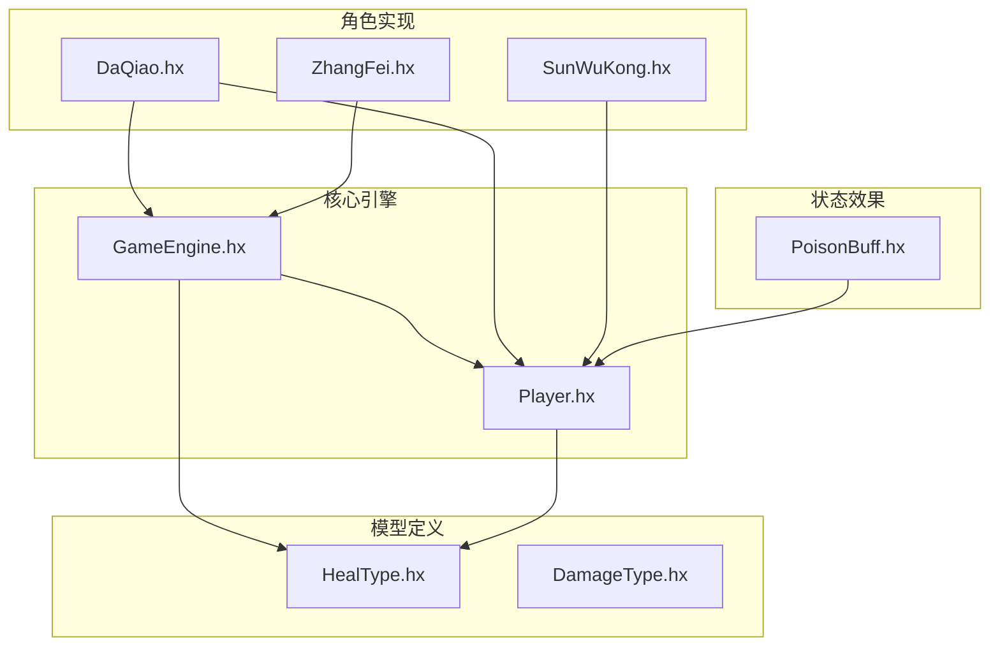
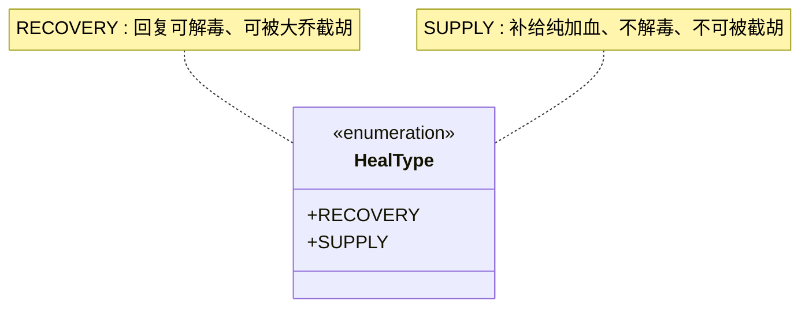
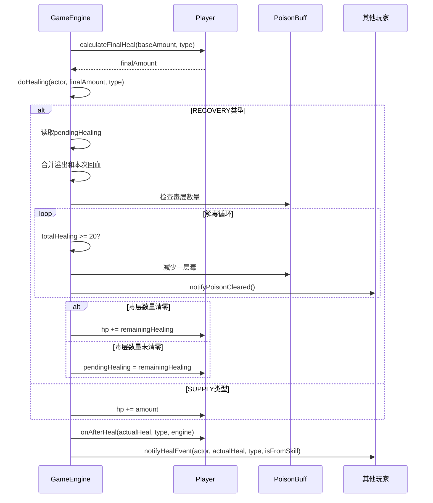
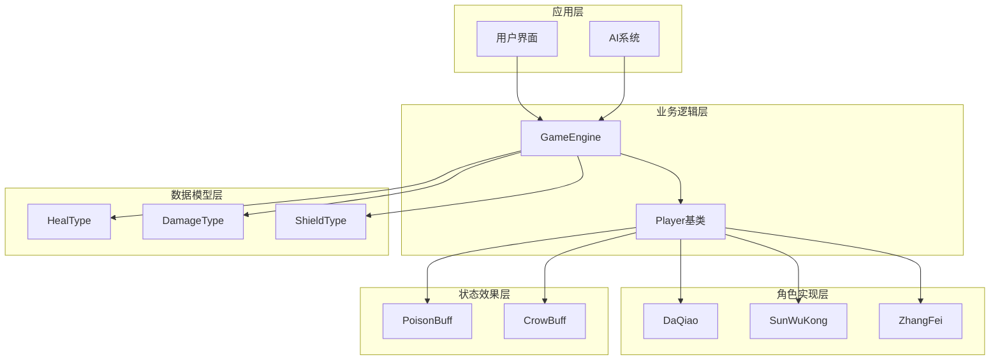
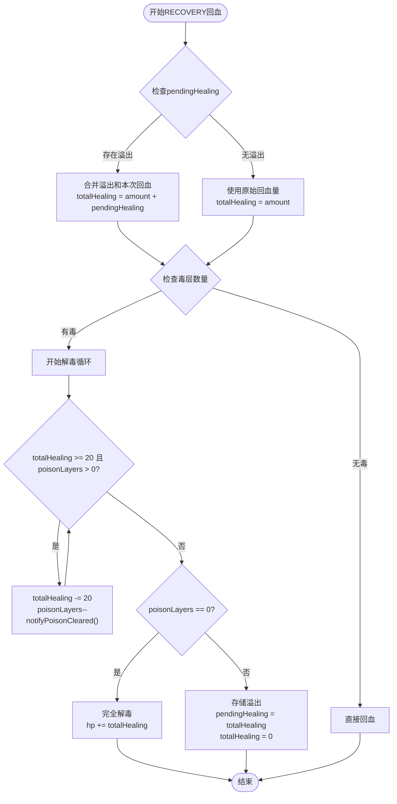
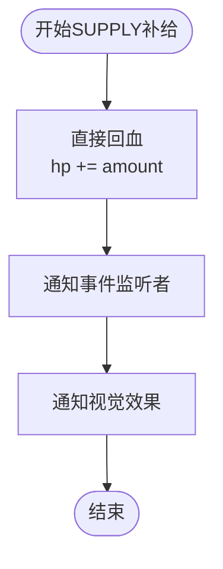
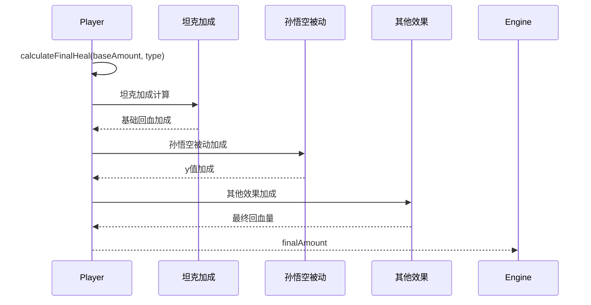
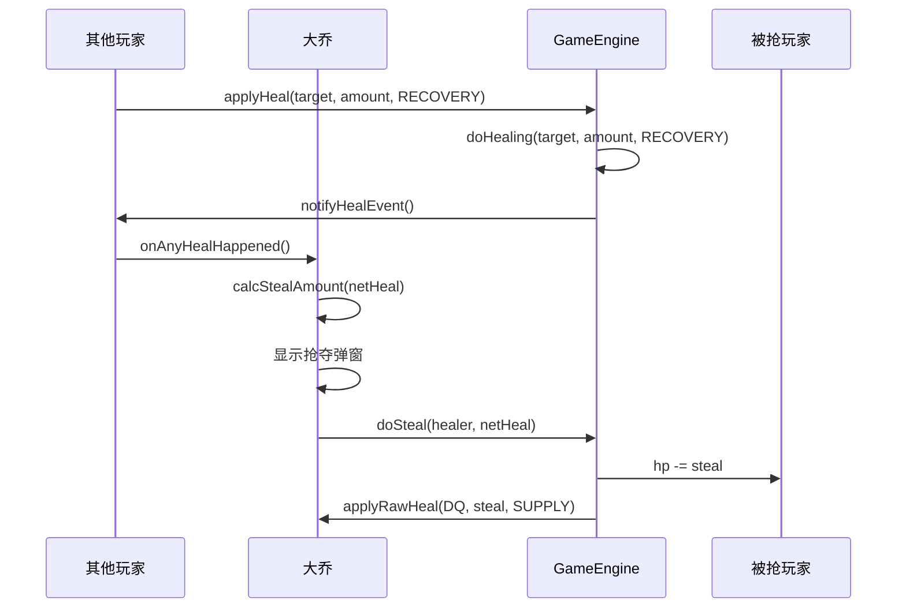
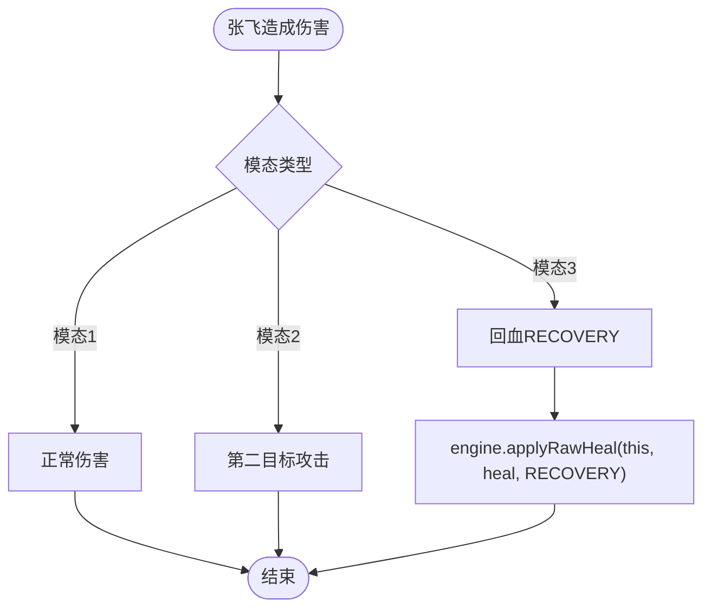
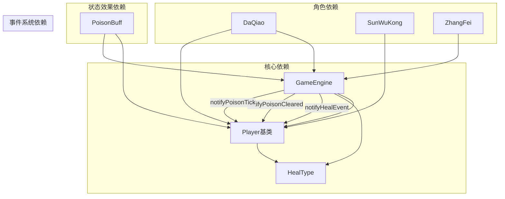

# 回复系统

<cite>
**本文档引用的文件**
- [GameEngine.hx](file://GameEngine.hx)
- [HealType.hx](file://model/HealType.hx)
- [Player.hx](file://character/Player.hx)
- [DaQiao.hx](file://character/DaQiao.hx)
- [SunWuKong.hx](file://character/SunWuKong.hx)
- [ZhangFei.hx](file://character/ZhangFei.hx)
- [PoisonBuff.hx](file://buffs/PoisonBuff.hx)
- [DamageType.hx](file://model/DamageType.hx)
</cite>

## 目录
1. [简介](#简介)
2. [项目结构](#项目结构)
3. [核心组件](#核心组件)
4. [架构概览](#架构概览)
5. [详细组件分析](#详细组件分析)
6. [依赖分析](#依赖分析)
7. [性能考虑](#性能考虑)
8. [故障排除指南](#故障排除指南)
9. [结论](#结论)

## 简介

回复系统是游戏中的核心机制之一，负责处理角色的治疗和补给效果。本文档深入分析了回复系统的两种类型：RECOVERY类型的回血（含溢出累积、解毒机制）和SUPPLY类型的补给（直接落地、不解毒）。系统实现了复杂的溢出处理机制，包括pendingHealing的累积和下次回血的合并计算，以及解毒机制，包括毒层数量与回血量的对应关系、解毒事件的触发和通知。

## 项目结构

回复系统主要分布在以下文件中：

**图表来源**
- [GameEngine.hx:1-725](file://GameEngine.hx#L1-L725)
- [Player.hx:1-375](file://character/Player.hx#L1-L375)

**章节来源**
- [GameEngine.hx:1-725](file://GameEngine.hx#L1-L725)
- [Player.hx:1-375](file://character/Player.hx#L1-L375)

## 核心组件

### 回复类型枚举

回复系统定义了两种基本的回复类型：

**图表来源**
- [HealType.hx:1-6](file://model/HealType.hx#L1-L6)

### 核心回血流程

GameEngine实现了完整的回血处理流程，包括基础回血、原始回血和解毒逻辑：

**图表来源**
- [GameEngine.hx:295-409](file://GameEngine.hx#L295-L409)

**章节来源**
- [GameEngine.hx:295-409](file://GameEngine.hx#L295-L409)
- [HealType.hx:1-6](file://model/HealType.hx#L1-L6)

## 架构概览

回复系统采用分层架构设计，实现了清晰的职责分离：

**图表来源**
- [GameEngine.hx:1-725](file://GameEngine.hx#L1-L725)
- [Player.hx:1-375](file://character/Player.hx#L1-L375)

## 详细组件分析

### RECOVERY类型回血机制

RECOVERY类型的回血是最复杂的机制，包含了溢出累积和解毒功能：

#### 溢出累积机制

**图表来源**
- [GameEngine.hx:364-409](file://GameEngine.hx#L364-L409)

#### 解毒机制详解

解毒机制的核心逻辑是每层毒需要20点回血来清除一层：

| 毒层数量 | 需要回血量 | 解毒结果 |
|---------|-----------|---------|
| 1层     | ≥20点     | 清除1层，剩余0层 |
| 2层     | ≥40点     | 清除2层，剩余0层 |
| 3层     | ≥60点     | 清除3层，剩余0层 |
| n层     | ≥20n点   | 清除n层，剩余0层 |

**章节来源**
- [GameEngine.hx:364-409](file://GameEngine.hx#L364-L409)

### SUPPLY类型补给机制

SUPPLY类型的补给是最简单的机制，直接增加角色生命值，不参与解毒过程：

**图表来源**
- [GameEngine.hx:400-403](file://GameEngine.hx#L400-L403)

**章节来源**
- [GameEngine.hx:400-403](file://GameEngine.hx#L400-L403)

### 回复效果计算流程

回复效果的计算包含多个层次的加成和修正：

**图表来源**
- [Player.hx:41-43](file://character/Player.hx#L41-L43)
- [SunWuKong.hx:122-131](file://character/SunWuKong.hx#L122-L131)

**章节来源**
- [Player.hx:41-43](file://character/Player.hx#L41-L43)
- [SunWuKong.hx:122-131](file://character/SunWuKong.hx#L122-L131)

### 大乔抢夺机制

大乔的抢夺机制是一个重要的RECOVERY类型应用：

**图表来源**
- [DaQiao.hx:36-198](file://character/DaQiao.hx#L36-L198)

**章节来源**
- [DaQiao.hx:36-198](file://character/DaQiao.hx#L36-L198)

### 张飞模态机制

张飞的模态机制展示了不同回复类型的实际应用场景：

**图表来源**
- [ZhangFei.hx:116-155](file://character/ZhangFei.hx#L116-L155)

**章节来源**
- [ZhangFei.hx:116-155](file://character/ZhangFei.hx#L116-L155)

## 依赖分析

回复系统的关键依赖关系如下：

**图表来源**
- [GameEngine.hx:1-725](file://GameEngine.hx#L1-L725)
- [Player.hx:1-375](file://character/Player.hx#L1-L375)

**章节来源**
- [GameEngine.hx:1-725](file://GameEngine.hx#L1-L725)
- [Player.hx:1-375](file://character/Player.hx#L1-L375)

## 性能考虑

回复系统的性能优化主要体现在以下几个方面：

1. **事件通知优化**：使用批量通知机制，避免重复遍历玩家列表
2. **溢出处理优化**：通过pendingHealing避免频繁的毒层数量检查
3. **内存管理**：及时清理冷却状态和临时变量
4. **计算优化**：在calculateFinalHeal中合并多个加成计算

## 故障排除指南

### 常见问题及解决方案

#### 回血量异常
- **症状**：回血量与预期不符
- **原因**：可能受到坦克加成、孙大圣被动或其他角色效果影响
- **解决**：检查角色的calculateFinalHeal重写方法

#### 解毒失败
- **症状**：毒层数量无法清除
- **原因**：回血量不足（每层需要20点）
- **解决**：确保回血量达到每层20点的要求

#### 大乔抢夺无效
- **症状**：大乔无法抢夺其他角色的回复
- **原因**：冷却状态或角色自身回血
- **解决**：检查冷却状态和角色ID匹配

**章节来源**
- [GameEngine.hx:364-409](file://GameEngine.hx#L364-L409)
- [DaQiao.hx:36-198](file://character/DaQiao.hx#L36-L198)

## 结论

回复系统通过RECOVERY和SUPPLY两种类型的巧妙设计，实现了复杂而平衡的游戏机制。RECOVERY类型的溢出累积和解毒机制为游戏增加了策略深度，而SUPPLY类型的直接回血确保了简单明确的效果。系统通过事件驱动的设计模式，实现了良好的扩展性和维护性。大乔的抢夺机制进一步丰富了游戏的互动性，而张飞等角色的模态机制展示了回复系统在不同场景下的多样化应用。

该系统的设计充分体现了游戏机制的平衡性考虑，既保证了策略深度，又保持了游戏体验的流畅性。通过合理的事件通知和状态管理，系统能够支持复杂的连携效果和角色特有能力。