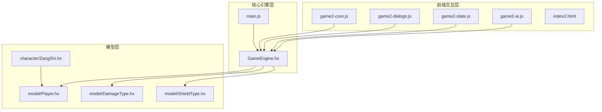
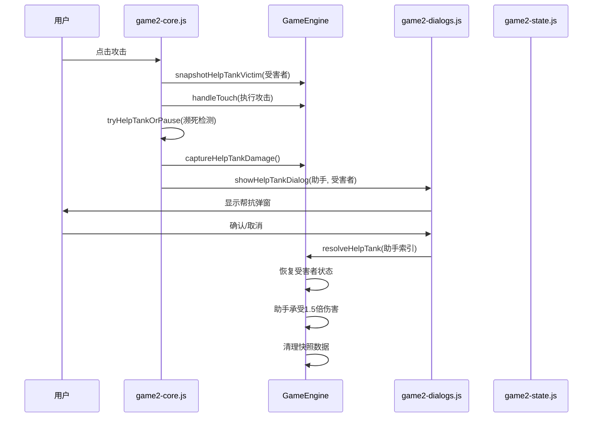
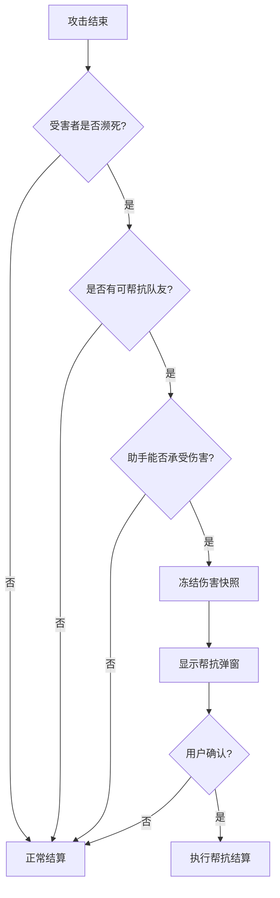
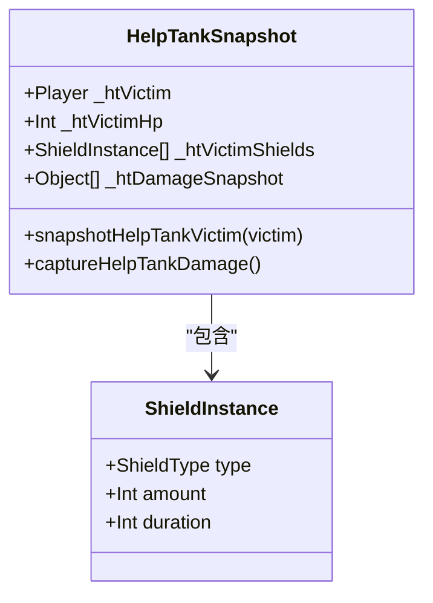
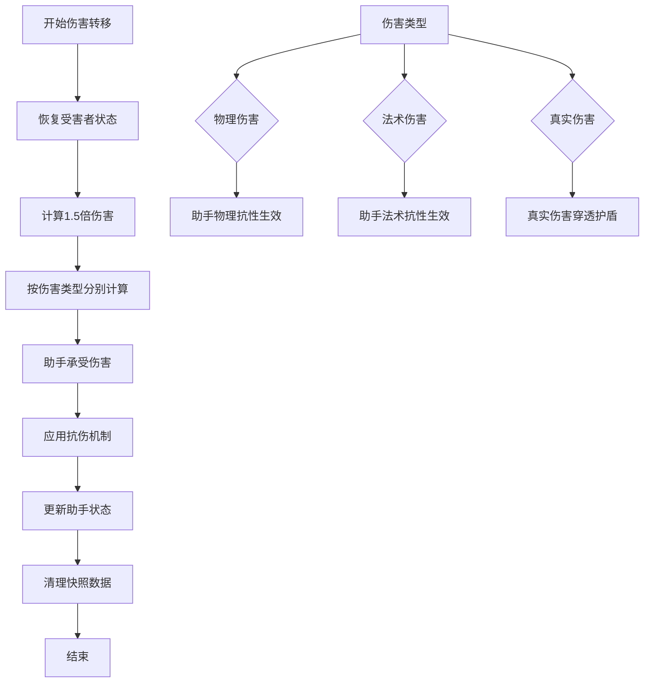
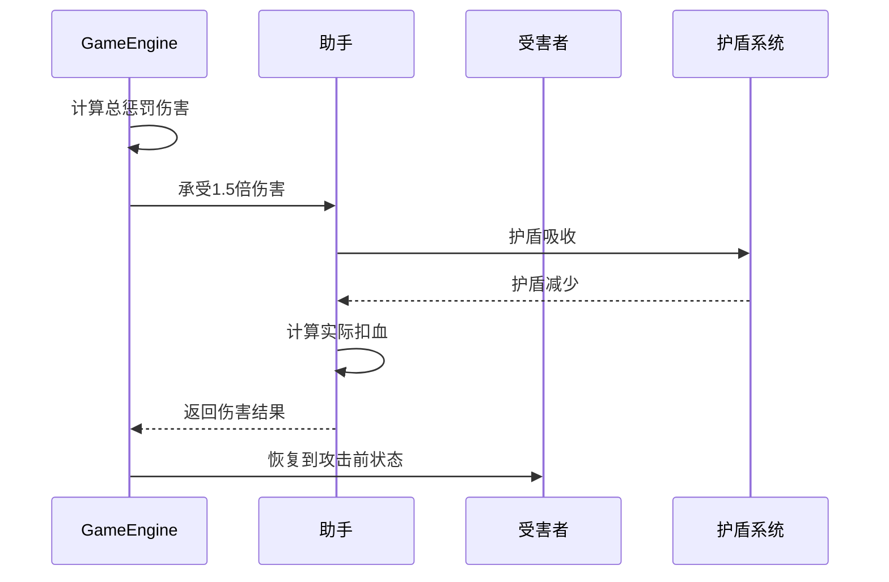
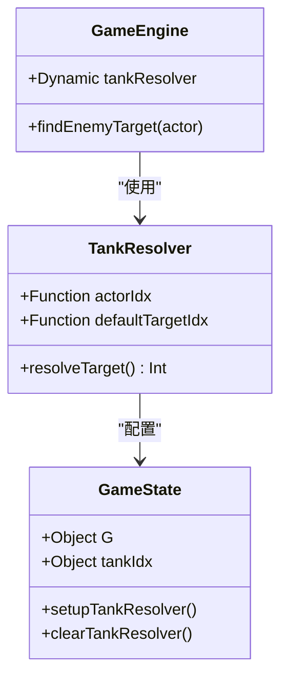
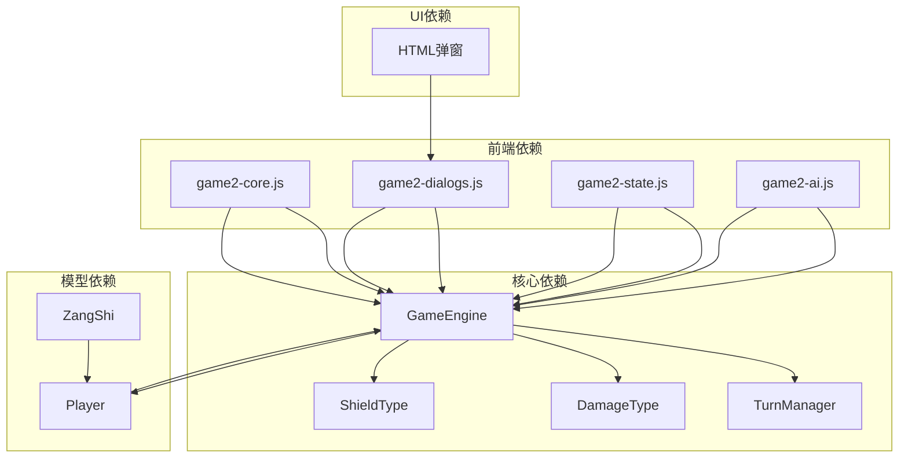

# 帮抗系统

<cite>
**本文档引用的文件**
- [GameEngine.hx](file://GameEngine.hx)
- [main.js](file://main.js)
- [game2-core.js](file://js/game2-core.js)
- [game2-dialogs.js](file://js/game2-dialogs.js)
- [game2-state.js](file://js/game2-state.js)
- [game2-ai.js](file://js/game2-ai.js)
- [Player.hx](file://model/Player.hx)
- [ZangShi.hx](file://character/ZangShi.hx)
- [index2.html](file://index2.html)
- [DamageType.hx](file://model/DamageType.hx)
- [ShieldType.hx](file://model/ShieldType.hx)
</cite>

## 目录
1. [简介](#简介)
2. [项目结构](#项目结构)
3. [核心组件](#核心组件)
4. [架构概览](#架构概览)
5. [详细组件分析](#详细组件分析)
6. [依赖关系分析](#依赖关系分析)
7. [性能考虑](#性能考虑)
8. [故障排除指南](#故障排除指南)
9. [结论](#结论)
10. [附录](#附录)

## 简介

帮抗系统是《指尖博弈》游戏中的一项重要机制，旨在平衡游戏体验，防止队伍中脆弱成员被瞬间击杀。该系统通过三个关键步骤实现：防御状态快照、伤害记录和伤害转移结算。系统的核心设计理念是在保证游戏公平性的前提下，为玩家提供策略选择空间。

帮抗系统的主要特点包括：
- **1.5倍伤害惩罚机制**：帮助队友承受伤害时，助手需要承受1.5倍的伤害
- **实时防御状态保护**：在帮抗确认前保护被帮助玩家的防御状态
- **智能目标选择**：基于阵容和角色特性自动选择合适的助手
- **完整的伤害转移流程**：从快照到结算的完整生命周期管理

## 项目结构

帮抗系统涉及多个层次的文件组织：

**图表来源**
- [GameEngine.hx:1-725](file://GameEngine.hx#L1-L725)
- [game2-core.js:1-223](file://js/game2-core.js#L1-L223)
- [game2-dialogs.js:1-372](file://js/game2-dialogs.js#L1-L372)

**章节来源**
- [GameEngine.hx:1-725](file://GameEngine.hx#L1-L725)
- [js/game2-core.js:1-223](file://js/game2-core.js#L1-L223)

## 核心组件

帮抗系统由以下核心组件构成：

### 1. GameEngine 帮抗管理器
- **snapshotHelpTankVictim**: 快照受害者防御状态
- **captureHelpTankDamage**: 冻结本次伤害记录
- **resolveHelpTank**: 执行伤害转移和结算

### 2. 前端交互组件
- **game2-core.js**: 攻击流程控制和帮抗检测
- **game2-dialogs.js**: 帮抗弹窗和用户交互
- **game2-state.js**: 2v2模式下的抗伤位解析

### 3. 模型层支持
- **Player.hx**: 核心抗伤逻辑和伤害处理
- **DamageType.hx**: 伤害类型枚举
- **ShieldType.hx**: 护盾类型定义

**章节来源**
- [GameEngine.hx:615-685](file://GameEngine.hx#L615-L685)
- [js/game2-core.js:109-163](file://js/game2-core.js#L109-L163)
- [js/game2-dialogs.js:5-88](file://js/game2-dialogs.js#L5-L88)

## 架构概览

帮抗系统采用分层架构设计，确保逻辑清晰和职责分离：

**图表来源**
- [game2-core.js:69-163](file://js/game2-core.js#L69-L163)
- [GameEngine.hx:615-685](file://GameEngine.hx#L615-L685)
- [game2-dialogs.js:51-75](file://js/game2-dialogs.js#L51-L75)

## 详细组件分析

### 帮抗触发条件分析

帮抗系统在以下条件下触发：

**图表来源**
- [game2-core.js:114-163](file://js/game2-core.js#L114-L163)
- [game2-core.js:134-142](file://js/game2-core.js#L134-L142)

#### 触发条件详解

1. **濒死检测**：攻击后检查目标生命值是否降至0或以下
2. **队友可用性**：在同一阵营中寻找存活的队友
3. **伤害承受能力**：计算总惩罚伤害与助手当前生命值的关系
4. **角色特殊限制**：某些角色可能拒绝接受帮抗（如拥有复活甲的角色）

**章节来源**
- [js/game2-core.js:114-163](file://js/game2-core.js#L114-L163)
- [js/game2-core.js:134-142](file://js/game2-core.js#L134-L142)

### 伤害快照机制

伤害快照机制确保帮抗过程中的数据完整性：

**图表来源**
- [GameEngine.hx:32-35](file://GameEngine.hx#L32-L35)
- [GameEngine.hx:616-639](file://GameEngine.hx#L616-L639)

#### 快照内容

1. **受害者状态快照**：
   - 当前生命值
   - 完整的护盾列表（类型、数量、持续时间）
   - 用于在帮抗失败时恢复原状

2. **伤害记录快照**：
   - 每笔伤害的类型和数值
   - 保持独立于后续操作的影响
   - 支持1.5倍伤害惩罚计算

**章节来源**
- [GameEngine.hx:616-639](file://GameEngine.hx#L616-L639)
- [main.js:581-590](file://main.js#L581-L590)

### 伤害转移计算

伤害转移计算遵循严格的数学规则：

**图表来源**
- [GameEngine.hx:647-685](file://GameEngine.hx#L647-L685)
- [Player.hx:262-325](file://model/Player.hx#L262-L325)

#### 计算规则

1. **基础伤害计算**：每笔伤害乘以1.5（向上取整）
2. **类型区分处理**：不同伤害类型走不同的抗伤路径
3. **护盾优先原则**：助手的护盾优先吸收伤害
4. **真实伤害特殊性**：真实伤害不受护盾阻挡

**章节来源**
- [GameEngine.hx:665-675](file://GameEngine.hx#L665-L675)
- [Player.hx:294-320](file://model/Player.hx#L294-L320)

### 1.5倍伤害惩罚机制

#### 伤害计算流程

**图表来源**
- [GameEngine.hx:665-675](file://GameEngine.hx#L665-L675)
- [Player.hx:294-325](file://model/Player.hx#L294-L325)

#### 目标选择算法

1. **阵营匹配**：寻找同一阵营的存活队友
2. **位置优先**：优先选择辅助位置的队友
3. **生存概率**：确保助手在承受伤害后仍能存活
4. **阵容适配**：考虑当前战斗阵容的战术需求

**章节来源**
- [js/game2-core.js:134-142](file://js/game2-core.js#L134-L142)

### 帮抗系统与2v2模式集成

#### tankResolver的作用

2v2模式通过`tankResolver`实现抗伤位的动态解析：

**图表来源**
- [game2-state.js:222-241](file://js/game2-state.js#L222-L241)
- [GameEngine.hx:687-723](file://GameEngine.hx#L687-L723)

#### 抗伤位解析逻辑

1. **默认目标**：按照常规规则选择第一个存活敌人
2. **2v2重定向**：通过`tankResolver`获取实际目标
3. **有效性验证**：确保重定向后的目标仍然有效
4. **动态切换**：支持在战斗中动态调整抗伤位

**章节来源**
- [game2-state.js:225-236](file://js/game2-state.js#L225-L236)
- [GameEngine.hx:709-720](file://GameEngine.hx#L709-L720)

## 依赖关系分析

帮抗系统涉及复杂的组件间依赖关系：

**图表来源**
- [GameEngine.hx:16-39](file://GameEngine.hx#L16-L39)
- [js/game2-core.js:1-10](file://js/game2-core.js#L1-L10)
- [js/game2-dialogs.js:1-10](file://js/game2-dialogs.js#L1-L10)

### 关键依赖链

1. **GameEngine → Player**: 核心伤害处理逻辑
2. **game2-core.js → GameEngine**: 攻击流程控制
3. **game2-dialogs.js → GameEngine**: 用户交互处理
4. **game2-state.js → GameEngine**: 2v2模式集成
5. **game2-ai.js → GameEngine**: AI决策支持

**章节来源**
- [GameEngine.hx:16-39](file://GameEngine.hx#L16-L39)
- [js/game2-core.js:1-10](file://js/game2-core.js#L1-L10)

## 性能考虑

帮抗系统在设计时充分考虑了性能优化：

### 时间复杂度分析

1. **快照操作**: O(n) - n为护盾数量
2. **伤害计算**: O(m) - m为伤害记录数量
3. **目标查找**: O(k) - k为同阵营玩家数量
4. **整体流程**: O(n+m+k)

### 内存使用优化

1. **快照数据结构**: 使用轻量级对象存储
2. **临时数组管理**: 及时清理不需要的数据
3. **增量计算**: 避免重复计算相同数据

### 并发处理

1. **联机模式**: 通过网络消息同步帮抗状态
2. **AI模式**: 自动决策减少用户等待时间
3. **异步弹窗**: 不阻塞主线程执行

## 故障排除指南

### 常见问题及解决方案

#### 帮抗弹窗不显示

**可能原因**：
1. 助手控制器权限不足
2. 网络延迟导致状态不同步
3. 助手HP不足以承受伤害

**解决方法**：
1. 检查联机模式下的角色控制权
2. 确认网络连接稳定性
3. 验证助手的生存能力

#### 伤害计算异常

**可能原因**：
1. 伤害快照数据损坏
2. 护盾状态不一致
3. 类型转换错误

**解决方法**：
1. 重新触发伤害快照
2. 检查护盾列表完整性
3. 验证伤害类型识别

#### 2v2模式目标选择错误

**可能原因**：
1. tankResolver配置错误
2. 抗伤位状态异常
3. 阵容规则冲突

**解决方法**：
1. 重新设置tankResolver
2. 重置抗伤位状态
3. 检查阵容配置

**章节来源**
- [js/game2-dialogs.js:51-88](file://js/game2-dialogs.js#L51-L88)
- [js/game2-state.js:222-241](file://js/game2-state.js#L222-L241)

## 结论

帮抗系统通过精心设计的三阶段流程实现了游戏平衡与策略深度的完美结合。系统不仅提供了完整的伤害转移机制，还通过AI集成和2v2模式支持展现了高度的智能化水平。

### 系统优势

1. **完整性**: 从触发到结算的全流程覆盖
2. **灵活性**: 支持多种阵容和角色组合
3. **可扩展性**: 模块化设计便于功能扩展
4. **用户体验**: 直观的弹窗交互和实时反馈

### 技术亮点

1. **数据一致性**: 通过快照机制确保数据完整性
2. **性能优化**: 采用增量计算和内存管理策略
3. **智能决策**: AI驱动的自动化帮抗判断
4. **模式兼容**: 支持单人和多人游戏模式

## 附录

### 调试示例

#### 基础调试流程

1. **启用日志追踪**
   - 在浏览器控制台查看帮抗相关日志
   - 监控伤害快照和结算过程

2. **验证数据完整性**
   - 检查快照中的护盾信息
   - 确认伤害计算的准确性

3. **测试边界条件**
   - 极限伤害值的处理
   - 多次帮抗的累积效果

#### 高级调试技巧

1. **性能监控**: 使用浏览器性能工具分析帮抗流程
2. **网络调试**: 检查联机模式下的状态同步
3. **AI验证**: 测试不同阵容下的帮抗决策

**章节来源**
- [index2.html:329-340](file://index2.html#L329-L340)
- [js/game2-ai.js:625-671](file://js/game2-ai.js#L625-L671)