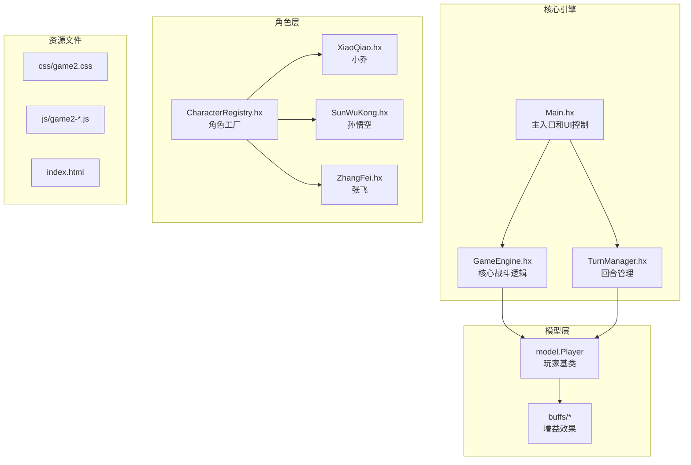
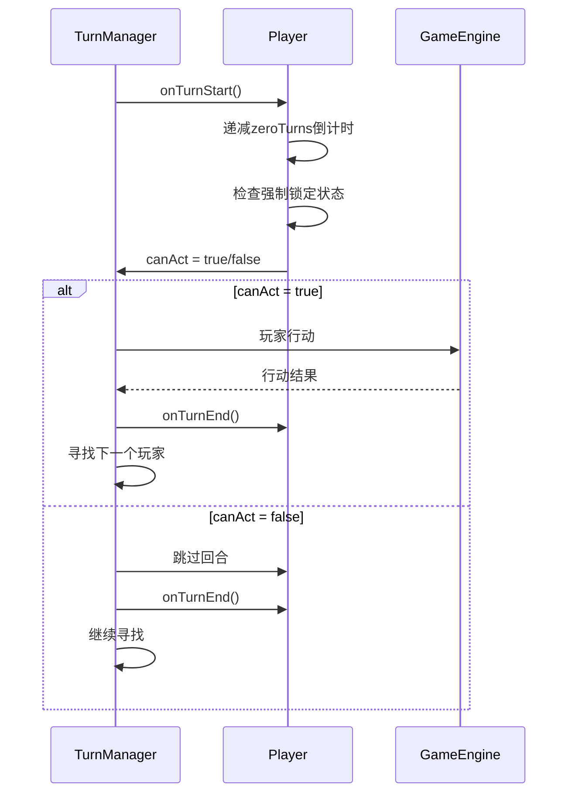
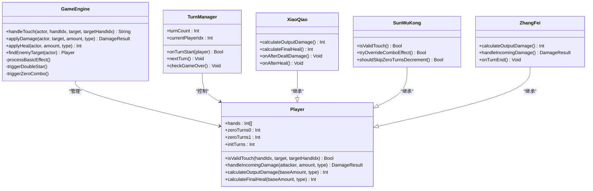
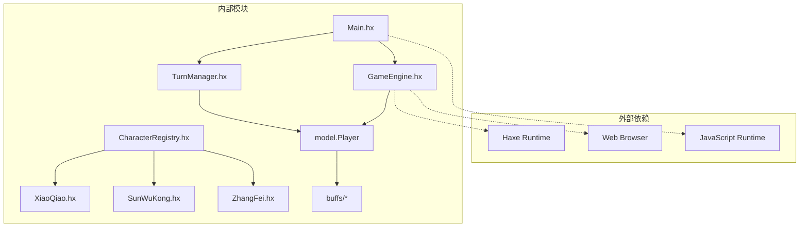

# 指尖碰撞系统

<cite>
**本文档引用的文件**
- [Main.hx](file://Main.hx)
- [GameEngine.hx](file://GameEngine.hx)
- [TurnManager.hx](file://TurnManager.hx)
- [Player.hx](file://model/Player.hx)
- [CharacterRegistry.hx](file://character/CharacterRegistry.hx)
- [XiaoQiao.hx](file://character/XiaoQiao.hx)
- [SunWuKong.hx](file://character/SunWuKong.hx)
- [ZhangFei.hx](file://character/ZhangFei.hx)
- [DamageBoostBuff.hx](file://buffs/DamageBoostBuff.hx)
- [PoisonBuff.hx](file://buffs/PoisonBuff.hx)
</cite>

## 目录
1. [简介](#简介)
2. [项目结构](#项目结构)
3. [核心组件](#核心组件)
4. [架构概览](#架构概览)
5. [详细组件分析](#详细组件分析)
6. [依赖关系分析](#依赖关系分析)
7. [性能考虑](#性能考虑)
8. [故障排除指南](#故障排除指南)
9. [结论](#结论)

## 简介

指尖碰撞系统是一个基于Haxe开发的策略战斗游戏系统，其核心机制围绕"两个数字相加取模10"的数学公式构建。该系统通过简单的数学规则创造出丰富的战术深度，包括：

- **核心数学公式**：两个手牌数字相加后对10取模，产生新的手牌值
- **0手寿命机制**：数字0具有有限的使用回合数，增加了策略考量
- **组合特效系统**：不同数字组合触发独特的战斗效果
- **状态管理系统**：复杂的手牌状态变化和回合制控制

系统支持1v1和2v2等多种对战模式，每个角色都有独特的技能和策略深度。

## 项目结构



**图表来源**
- [Main.hx:1-50](file://Main.hx#L1-L50)
- [GameEngine.hx:1-50](file://GameEngine.hx#L1-L50)
- [TurnManager.hx:1-30](file://TurnManager.hx#L1-L30)

**章节来源**
- [Main.hx:1-100](file://Main.hx#L1-L100)
- [GameEngine.hx:1-100](file://GameEngine.hx#L1-L100)
- [TurnManager.hx:1-50](file://TurnManager.hx#L1-L50)

## 核心组件

### GameEngine - 核心战斗引擎

GameEngine是整个系统的核心，负责处理所有战斗逻辑和状态管理：

**主要职责**：
- 手牌碰撞计算和验证
- 组合特效触发机制
- 伤害计算和抗伤处理
- 帮抗系统（团队协助）
- 全场事件通知

**核心算法**：
```mermaid
flowchart TD
Start[开始碰撞] --> Validate[验证手牌有效性]
Validate --> CheckDeath{目标是否阵亡?}
CheckDeath --> |是| Error1[返回错误]
CheckDeath --> |否| CheckZero{目标手牌是否为0?}
CheckZero --> |是| Error2[返回错误]
CheckZero --> |否| CheckTouch{角色触摸验证}
CheckTouch --> |失败| Error3[返回错误]
CheckTouch --> |成功| CalcMod[计算(oldValue + targetValue) % 10]
CalcMod --> UpdateHand[更新手牌值]
UpdateHand --> CheckZeroNew{新值是否为0?}
CheckZeroNew --> |是| SetTimer[启动0手倒计时]
CheckZeroNew --> |否| ClearTimer[清除倒计时]
SetTimer --> TriggerEffects[触发组合特效]
ClearTimer --> TriggerEffects
TriggerEffects --> End[碰撞完成]
Error1 --> End
Error2 --> End
Error3 --> End
```

**图表来源**
- [GameEngine.hx:418-468](file://GameEngine.hx#L418-L468)

### Player - 玩家基类

Player类定义了所有角色的基础属性和行为：

**关键属性**：
- `hands`: 双手牌数组，初始值为[1, 1]
- `zeroTurns0/zeroTurns1`: 左右手中0手的剩余回合数
- `initTurns`: 0手的初始倒计时回合数
- `forcedZeroHand`: 强制锁定的手牌索引

**核心方法**：
- `isValidTouch()`: 触碰合法性验证
- `handleIncomingDamage()`: 抗伤计算
- `calculateOutputDamage()`: 伤害倍率计算
- `calculateFinalHeal()`: 回血倍率计算

**章节来源**
- [Player.hx:1-100](file://model/Player.hx#L1-L100)
- [Player.hx:340-350](file://model/Player.hx#L340-L350)

### TurnManager - 回合管理系统

TurnManager负责整个游戏的回合流程控制：

**主要功能**：
- 回合开始和结束处理
- 0手倒计时管理
- 强制跳过回合检测
- 终局判定

**回合流程**：


**图表来源**
- [TurnManager.hx:35-102](file://TurnManager.hx#L35-L102)
- [TurnManager.hx:110-190](file://TurnManager.hx#L110-L190)

## 架构概览



**图表来源**
- [GameEngine.hx:16-43](file://GameEngine.hx#L16-L43)
- [TurnManager.hx:6-13](file://TurnManager.hx#L6-L13)
- [Player.hx:3-26](file://model/Player.hx#L3-L26)
- [XiaoQiao.hx:17-22](file://character/XiaoQiao.hx#L17-L22)
- [SunWuKong.hx:17-34](file://character/SunWuKong.hx#L17-L34)
- [ZhangFei.hx:22-36](file://character/ZhangFei.hx#L22-L36)

## 详细组件分析

### 碰撞验证系统

碰撞验证系统是确保游戏平衡性和策略深度的关键机制：

**验证流程**：
1. **目标状态检查**：确认目标玩家未阵亡
2. **手牌有效性检查**：确保目标手牌不是0
3. **角色触摸验证**：调用角色的isValidTouch()方法
4. **0手寿命机制**：检查0手剩余回合数

**角色特定验证**：
- **基类规则**：如果另一只手是0且寿命已尽，禁止触碰
- **孙悟空特殊规则**：预测碰撞后能否形成[0,2]组合，允许在特定条件下触碰
- **小乔规则**：无特殊限制，但0手可停留3回合

**章节来源**
- [GameEngine.hx:418-426](file://GameEngine.hx#L418-L426)
- [Player.hx:340-350](file://model/Player.hx#L340-L350)
- [SunWuKong.hx:48-70](file://character/SunWuKong.hx#L48-L70)

### 状态管理系统

系统通过多种状态变量管理复杂的战斗状态：

**手牌状态**：
- `hands[0]/hands[1]`: 当前左右手牌值
- `zeroTurns0/zeroTurns1`: 0手剩余回合数
- `initTurns`: 0手初始倒计时（不同角色不同）

**角色状态**：
- `forcedZeroHand`: 强制锁定的手牌（已移除强制锁定，改为提示）
- `pendingHealing`: 回血溢出累积
- `bigRound88Used`: 大回合内[8,8]使用次数

**回合状态**：
- `turnCount`: 当前回合数
- `currentPlayerIdx`: 当前行动玩家索引
- `gameOver`: 游戏结束标志

**章节来源**
- [Player.hx:7-16](file://model/Player.hx#L7-L16)
- [TurnManager.hx:7-11](file://TurnManager.hx#L7-L11)
- [TurnManager.hx:35-102](file://TurnManager.hx#L35-L102)

### 组合特效系统

系统实现了丰富的组合特效，每个数字组合都有独特的战斗效果：

**双子星组合**（双手相同）：
- `9`: 场上有n个3的倍数(不含0)时，基础60×1.5^n
- `8`: 获得1次额外行动 + 60点物法盾（每大回合最多2次）
- `7`: 30点物伤 + 3层中毒
- `6`: 90点回血
- `5`: 2层反弹盾
- `4`: 2次伤害翻倍
- `2/3`: 30点物法盾，3回合
- `1`: 无敌2回合
- `0`: 150点真伤

**0组合**（其中一只手为0）：
- `0_6/0_4`: 30点回血
- `0_7`: 10点物伤 + 1层中毒
- `0_1/0_5/0_8/0_9`: 40点物伤
- `0_2/0_3`: 20点物法盾，3回合
- `0_0`: 150点真伤

**章节来源**
- [GameEngine.hx:495-552](file://GameEngine.hx#L495-L552)
- [GameEngine.hx:554-591](file://GameEngine.hx#L554-L591)

### 角色特殊机制

#### 小乔的被动机制
小乔拥有独特的双重被动系统：

**回血反伤**：回血时对敌方造成等量物理伤害
**打人补给**：造成物伤时给自己补给等量生命
**护盾升级**：所有护盾升级为物法盾，厚度×1.5，持续+1回合

#### 孙悟空的[0,2]大招
孙悟空实现了复杂的[0,2]组合机制：

**后果预判**：在触碰前预测能否形成[0,2]组合
**使用限制**：同一次0增益期间最多3次
**补偿机制**：使用后下回合跳过zeroTurns递减
**效果内容**：70法伤 + 70回血 + 冻结目标1回合

#### 张飞的三模态系统
张飞提供了完整的三模态战斗系统：

**模态1**：物伤×1.5，行动结束补给10血
**模态2**：0.75倍伤害打两个敌人，第二刀独立计算
**模态3**：造成物伤的一半回血到自己
**狂暴系统**：≥24层怒气可进入狂暴，持续3回合

**章节来源**
- [XiaoQiao.hx:42-70](file://character/XiaoQiao.hx#L42-L70)
- [SunWuKong.hx:136-166](file://character/SunWuKong.hx#L136-L166)
- [ZhangFei.hx:95-159](file://character/ZhangFei.hx#L95-L159)

## 依赖关系分析



**图表来源**
- [Main.hx:3-6](file://Main.hx#L3-L6)
- [GameEngine.hx:3-15](file://GameEngine.hx#L3-L15)
- [CharacterRegistry.hx:3-5](file://character/CharacterRegistry.hx#L3-L5)

**章节来源**
- [Main.hx:1-25](file://Main.hx#L1-L25)
- [GameEngine.hx:1-20](file://GameEngine.hx#L1-L20)
- [CharacterRegistry.hx:1-20](file://character/CharacterRegistry.hx#L1-L20)

## 性能考虑

### 时间复杂度分析

**碰撞计算**：O(1) - 基本数学运算和数组访问
**伤害计算**：O(n) - n为有效护盾数量，通常很小
**回合管理**：O(p) - p为玩家数量
**组合检测**：O(p×h) - p为玩家数，h为每玩家手牌数

### 空间复杂度
- **玩家状态**：O(p) - p为玩家数量
- **护盾列表**：O(s) - s为有效护盾数量
- **伤害记录**：O(d) - d为本次碰撞产生的伤害记录数

### 优化策略

1. **早期验证**：在碰撞前进行快速验证，避免不必要的计算
2. **缓存机制**：缓存角色的倍率计算结果
3. **批量处理**：在回合结束时批量处理状态衰减
4. **内存回收**：及时清理失效的buff和护盾

## 故障排除指南

### 常见问题及解决方案

**问题1：无法触碰目标**
- 检查目标是否阵亡
- 确认目标手牌不是0
- 验证角色的isValidTouch()返回值
- 查看0手寿命是否已耗尽

**问题2：组合特效未触发**
- 确认双手牌值是否正确
- 检查是否有角色覆盖了默认效果
- 验证组合键格式是否正确

**问题3：回合卡住**
- 检查是否有玩家被冰冻
- 确认对手是否还有可用手牌
- 验证强制锁定状态

**问题4：伤害计算异常**
- 检查buff的层数和持续时间
- 确认护盾的类型匹配
- 验证伤害类型是否正确

**章节来源**
- [GameEngine.hx:418-468](file://GameEngine.hx#L418-L468)
- [TurnManager.hx:78-99](file://TurnManager.hx#L78-L99)

## 结论

指尖碰撞系统通过简洁的数学规则创造了丰富的战术深度。核心设计亮点包括：

1. **数学简洁性**：两个数字相加取模10的规则简单易懂，但蕴含无限策略可能
2. **生命周期管理**：0手寿命机制为游戏增添了时间压力和资源管理要素
3. **角色差异化**：每个角色都有独特的技能和策略深度
4. **状态系统**：复杂的状态管理为战术决策提供了丰富维度

系统架构采用清晰的分层设计，核心逻辑集中在GameEngine中，通过Player基类和具体角色实现差异化功能。这种设计既保证了代码的可维护性，又为未来的扩展提供了良好的基础。