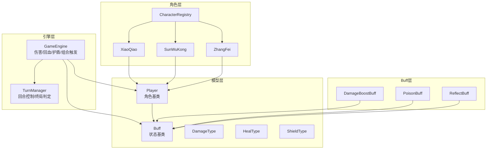
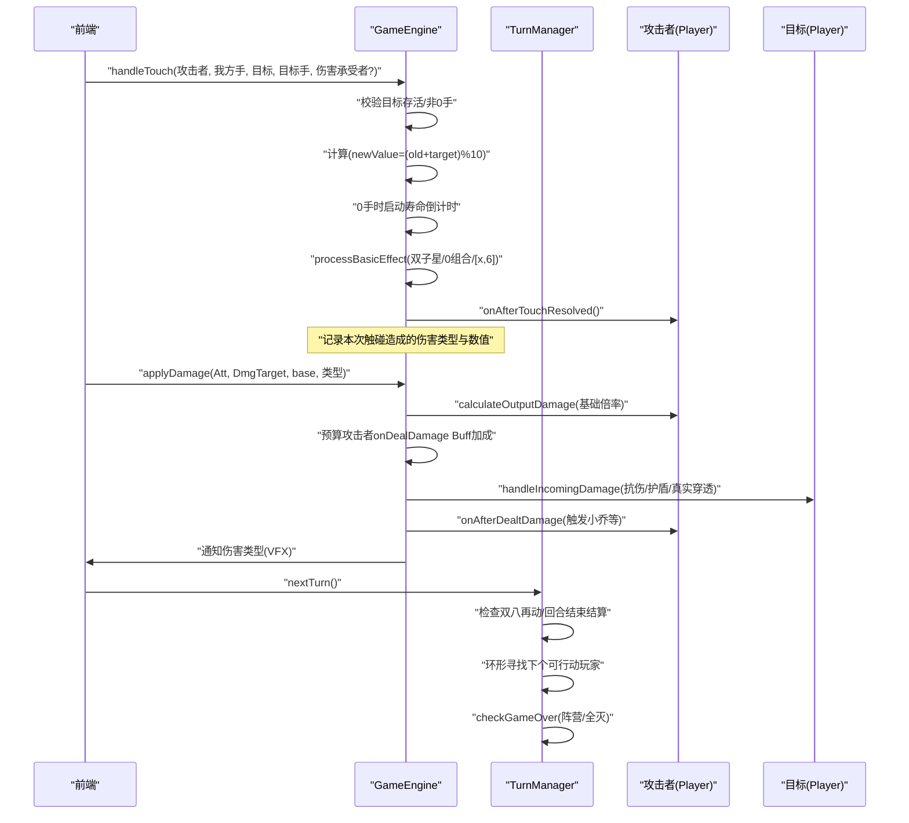
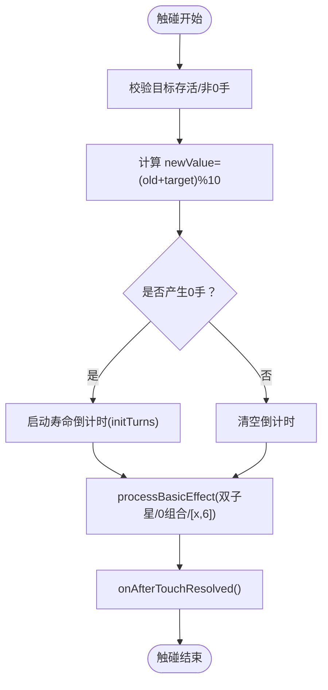
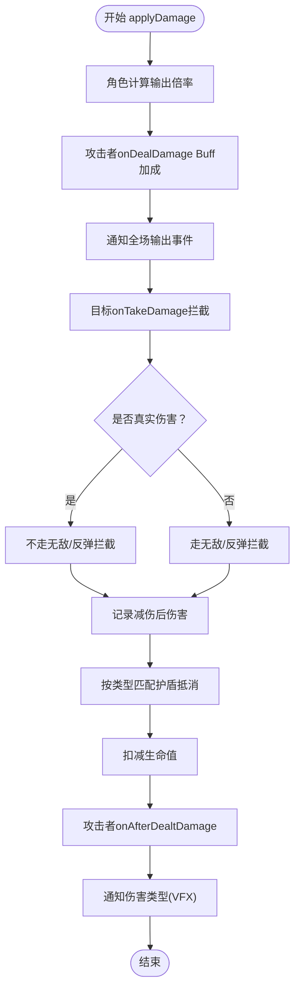
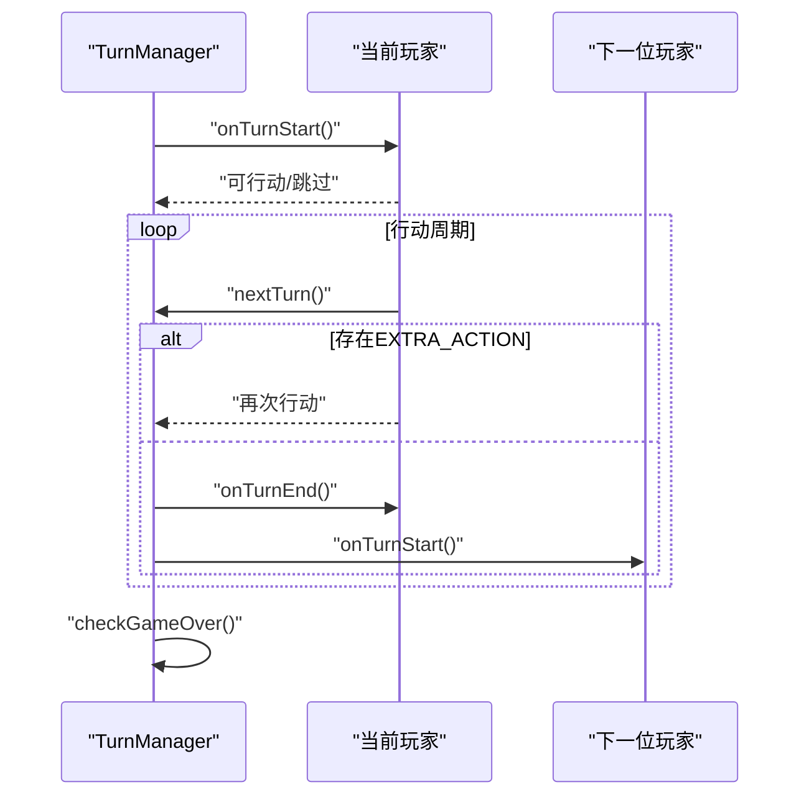
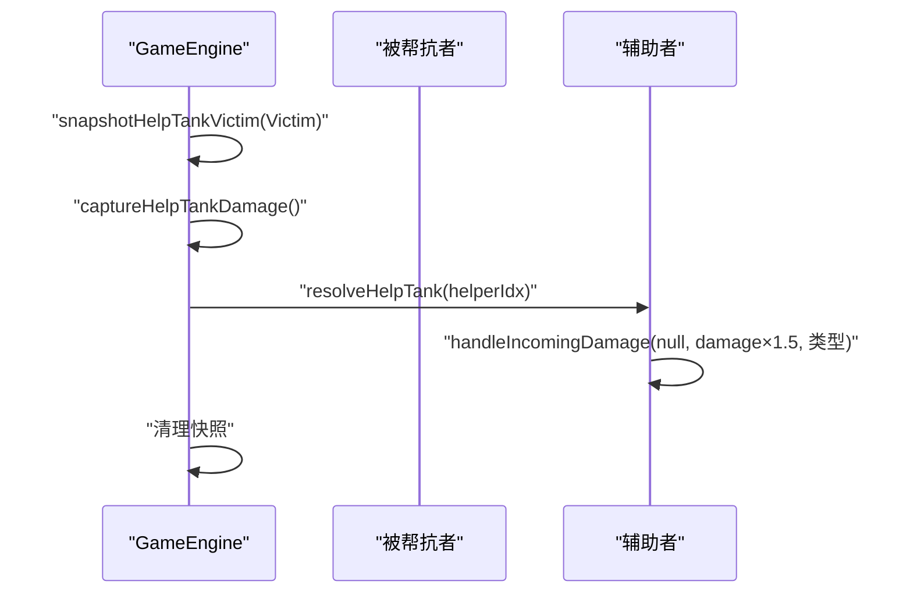
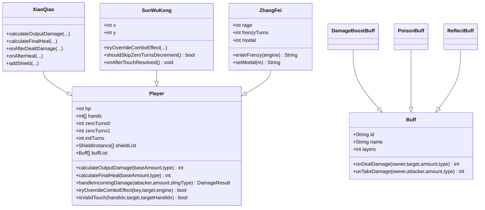
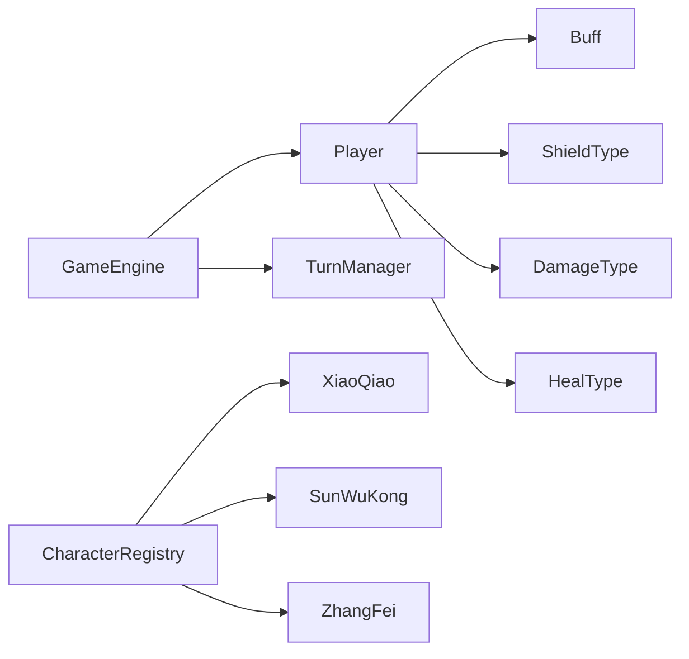
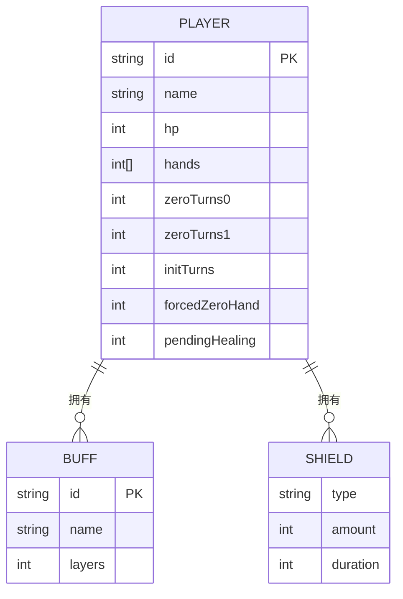

# 游戏机制详解

<cite>
**本文引用的文件**
- [GameEngine.hx](file://GameEngine.hx)
- [TurnManager.hx](file://TurnManager.hx)
- [Player.hx](file://model/Player.hx)
- [DamageType.hx](file://model/DamageType.hx)
- [HealType.hx](file://model/HealType.hx)
- [ShieldType.hx](file://model/ShieldType.hx)
- [Buff.hx](file://model/Buff.hx)
- [CharacterRegistry.hx](file://character/CharacterRegistry.hx)
- [XiaoQiao.hx](file://character/XiaoQiao.hx)
- [SunWuKong.hx](file://character/SunWuKong.hx)
- [ZhangFei.hx](file://character/ZhangFei.hx)
- [DamageBoostBuff.hx](file://buffs/DamageBoostBuff.hx)
- [PoisonBuff.hx](file://buffs/PoisonBuff.hx)
- [ReflectBuff.hx](file://buffs/ReflectBuff.hx)
</cite>

## 目录
1. [简介](#简介)
2. [项目结构](#项目结构)
3. [核心组件](#核心组件)
4. [架构总览](#架构总览)
5. [详细组件分析](#详细组件分析)
6. [依赖关系分析](#依赖关系分析)
7. [性能考量](#性能考量)
8. [故障排查指南](#故障排查指南)
9. [结论](#结论)
10. [附录](#附录)

## 简介
本文件面向开发者与策划，系统化梳理“指尖博弈”游戏机制，重点覆盖：
- 指尖碰撞系统：数字相加取模10的战斗计算、组合效果触发与特殊规则、伤害计算全流程
- 回合制战斗系统：行动阶段划分、技能使用限制、终局判定规则
- 角色状态管理：生命值系统、手牌管理、特殊状态标记
- 伤害类型系统：物理、法术、真实伤害的区别与应用
- 代码级实现要点与算法细节，帮助快速定位与扩展

## 项目结构
项目采用模块化分层组织：
- 引擎层：GameEngine（伤害/回血/护盾/组合触发）、TurnManager（回合控制/终局判定）
- 模型层：Player（角色基类）、Buff（状态基类）、DamageType/HealType/ShieldType（枚举）
- 角色层：character/*（具体英雄实现，继承Player并重写钩子）
- Buff层：buffs/*（具体状态效果，继承Buff）

图示来源
- [GameEngine.hx:1-725](file://GameEngine.hx#L1-L725)
- [TurnManager.hx:1-232](file://TurnManager.hx#L1-L232)
- [Player.hx:1-398](file://model/Player.hx#L1-L398)
- [Buff.hx:1-30](file://model/Buff.hx#L1-L30)
- [CharacterRegistry.hx:1-82](file://character/CharacterRegistry.hx#L1-L82)
- [XiaoQiao.hx:1-96](file://character/XiaoQiao.hx#L1-L96)
- [SunWuKong.hx:1-207](file://character/SunWuKong.hx#L1-L207)
- [ZhangFei.hx:1-273](file://character/ZhangFei.hx#L1-L273)
- [DamageBoostBuff.hx:1-20](file://buffs/DamageBoostBuff.hx#L1-L20)
- [PoisonBuff.hx:1-50](file://buffs/PoisonBuff.hx#L1-L50)
- [ReflectBuff.hx:1-43](file://buffs/ReflectBuff.hx#L1-L43)

章节来源
- [GameEngine.hx:1-725](file://GameEngine.hx#L1-L725)
- [TurnManager.hx:1-232](file://TurnManager.hx#L1-L232)
- [Player.hx:1-398](file://model/Player.hx#L1-L398)
- [CharacterRegistry.hx:1-82](file://character/CharacterRegistry.hx#L1-L82)

## 核心组件
- GameEngine：统一的伤害/回血/护盾入口，负责组合触发、伤害广播、帮抗快照与结算、伤害类型通知
- TurnManager：回合生命周期管理、行动切换、终局判定、大回合事件广播
- Player：角色基类，提供伤害计算钩子、回血计算钩子、抗伤主流程、Buff/护盾管理、组合覆盖与状态拦截
- Buff：状态基类，提供回合开始/结束、造成伤害前/承受伤害前钩子
- 具体角色：XiaoQiao（小乔）、SunWuKong（孙悟空）、ZhangFei（张飞）等，重写钩子实现特有机制
- Buff实现：DamageBoostBuff（伤害翻倍）、PoisonBuff（回合结束毒伤）、ReflectBuff（反弹盾）

章节来源
- [GameEngine.hx:137-233](file://GameEngine.hx#L137-L233)
- [TurnManager.hx:35-190](file://TurnManager.hx#L35-L190)
- [Player.hx:34-325](file://model/Player.hx#L34-L325)
- [Buff.hx:14-29](file://model/Buff.hx#L14-L29)
- [XiaoQiao.hx:24-62](file://character/XiaoQiao.hx#L24-L62)
- [SunWuKong.hx:77-101](file://character/SunWuKong.hx#L77-L101)
- [ZhangFei.hx:95-159](file://character/ZhangFei.hx#L95-L159)

## 架构总览
下面以“触碰-组合-伤害-回合推进”的主线流程展示系统交互。

图示来源
- [GameEngine.hx:418-468](file://GameEngine.hx#L418-L468)
- [GameEngine.hx:137-233](file://GameEngine.hx#L137-L233)
- [Player.hx:262-325](file://model/Player.hx#L262-L325)
- [TurnManager.hx:110-190](file://TurnManager.hx#L110-L190)

## 详细组件分析

### 指尖碰撞系统与组合效果
- 数学公式：两手指相加取模10，0手出现时启动寿命倒计时，回合开始时递减，归零则强制不可再动该手
- 组合判定优先级：
  - 双子星：双手数字相等时触发，按数字种类执行不同效果（如双九：场上有n个3的倍数(不含0)时，倍率1.5^n）
  - 0组合：任一只手为0时，根据另一只手数字触发（如[0,6]/[0,7]/[0,4]/破军/御守/[0,0]等）
  - 特殊覆盖：如孙悟空[0,2]覆盖为70法伤+回血+冻结，且同回合最多3次，不消耗0使用次数
- 触碰合法性：若另一只手为0且寿命归零，本次触碰被禁止（除非能合成[0,2]且处于0增益期间）

图示来源
- [GameEngine.hx:418-468](file://GameEngine.hx#L418-L468)
- [GameEngine.hx:470-591](file://GameEngine.hx#L470-L591)
- [Player.hx:340-350](file://model/Player.hx#L340-L350)
- [SunWuKong.hx:48-70](file://character/SunWuKong.hx#L48-L70)

章节来源
- [GameEngine.hx:418-591](file://GameEngine.hx#L418-L591)
- [Player.hx:340-350](file://model/Player.hx#L340-L350)
- [SunWuKong.hx:48-70](file://character/SunWuKong.hx#L48-L70)

### 伤害计算全流程（含抗伤与护盾）
- 伤害路径：
  1) 角色计算输出倍率（如小乔物伤×1.5、孙悟空合并x）
  2) 攻击者Buff加成（如双4翻倍）
  3) 目标Buff拦截（如双5反弹、双1无敌）
  4) 护盾抵消（按类型匹配与持续时间排序）
  5) 扣减生命值
- 真实伤害特性：穿透所有防御性拦截（无敌/反弹），但仍受攻击者增伤影响
- 伤害广播：通知全场“输出”事件，供孙悟空等监听更新

图示来源
- [GameEngine.hx:137-233](file://GameEngine.hx#L137-L233)
- [Player.hx:262-325](file://model/Player.hx#L262-L325)
- [ReflectBuff.hx:22-41](file://buffs/ReflectBuff.hx#L22-L41)
- [DamageBoostBuff.hx:11-19](file://buffs/DamageBoostBuff.hx#L11-L19)

章节来源
- [GameEngine.hx:137-233](file://GameEngine.hx#L137-L233)
- [Player.hx:262-325](file://model/Player.hx#L262-L325)

### 回合制战斗系统与终局判定
- 行动阶段：
  - 回合开始：清零[x,6]触发标记、递减0手寿命、检查是否被迫跳过（对手全0）
  - 行动中：触碰、组合触发、伤害结算、状态结算
  - 回合结束：毒伤等回合结束Buff结算、护盾衰减、检查终局
- 双八再动：若持有EXTRA_ACTION，同一回合可再次行动
- 终局判定：仅剩一个阵营或无人存活

图示来源
- [TurnManager.hx:35-190](file://TurnManager.hx#L35-L190)
- [TurnManager.hx:195-230](file://TurnManager.hx#L195-L230)

章节来源
- [TurnManager.hx:35-190](file://TurnManager.hx#L35-L190)
- [TurnManager.hx:195-230](file://TurnManager.hx#L195-L230)

### 角色状态管理
- 生命值系统：handleIncomingDamage统一扣血，支持真实伤害穿透防御
- 手牌管理：hands[2]，0手寿命倒计时与强制锁定逻辑
- 特殊状态：Buff（层数）、护盾（类型/厚度/持续）、pendingHealing（溢出回血）
- 角色特化：
  - 小乔：回血×1.5、物伤×1.5、回血反伤、护盾升级为物法盾×1.5
  - 孙悟空：x/y动态增长、[0,2]覆盖（70法伤+回血+冻结）、0增益期间延寿
  - 张飞：模态切换（1/2/3）、怒气系统、狂暴（0使用回合+1、免伤翻倍、补给翻倍）

章节来源
- [Player.hx:10-26](file://model/Player.hx#L10-L26)
- [Player.hx:262-325](file://model/Player.hx#L262-L325)
- [XiaoQiao.hx:24-70](file://character/XiaoQiao.hx#L24-L70)
- [SunWuKong.hx:77-166](file://character/SunWuKong.hx#L77-L166)
- [ZhangFei.hx:95-208](file://character/ZhangFei.hx#L95-L208)

### 伤害类型系统
- 物理伤害：可被物理/物法盾、反弹、无敌等拦截
- 法术伤害：可被法术/物法盾、真实盾拦截
- 真实伤害：穿透所有防御性拦截，但受攻击者增伤影响
- 应用场景举例：
  - 小乔：回血时对敌方造成等量物理伤害
  - 孙悟空：[0,2]覆盖为70法伤
  - 反弹盾：仅对物理伤害生效，上限200

章节来源
- [DamageType.hx:3-7](file://model/DamageType.hx#L3-L7)
- [Player.hx:299-306](file://model/Player.hx#L299-L306)
- [ReflectBuff.hx:22-41](file://buffs/ReflectBuff.hx#L22-L41)
- [XiaoQiao.hx:54-62](file://character/XiaoQiao.hx#L54-L62)
- [SunWuKong.hx:148-158](file://character/SunWuKong.hx#L148-L158)

### 回血与护盾机制
- 回血：
  - RECOVERY：可解毒、可溢出累计、可被监听（如大乔截胡）
  - SUPPLY：纯加血、不解毒、不可被截胡
- 护盾：
  - 类型：物理/法术/物法/真实
  - 抵挡顺序：按持续时间升序，优先消耗最短持续的护盾
  - 小乔护盾升级：厚度×1.5、持续+1、统一升级为物法盾
  - 坦脆流坦克：护盾厚度×1.5、物法盾升级

章节来源
- [GameEngine.hx:295-320](file://GameEngine.hx#L295-L320)
- [GameEngine.hx:327-346](file://GameEngine.hx#L327-L346)
- [Player.hx:240-252](file://model/Player.hx#L240-L252)
- [XiaoQiao.hx:65-70](file://character/XiaoQiao.hx#L65-L70)

### 帮抗系统（2v2抗伤位接管）
- 步骤：
  1) 攻击前快照：记录受害者HP与护盾
  2) 攻击后冻结：冻结本次触碰记录的伤害快照
  3) 确认接管：将伤害×1.5打给辅助者，不触发攻击者副作用
- 适用：2v2时由JS层注入tankResolver重定向伤害目标

图示来源
- [GameEngine.hx:616-685](file://GameEngine.hx#L616-L685)

章节来源
- [GameEngine.hx:616-685](file://GameEngine.hx#L616-L685)

### 角色类关系与职责

图示来源
- [Player.hx:3-398](file://model/Player.hx#L3-L398)
- [XiaoQiao.hx:17-96](file://character/XiaoQiao.hx#L17-L96)
- [SunWuKong.hx:17-207](file://character/SunWuKong.hx#L17-L207)
- [ZhangFei.hx:22-273](file://character/ZhangFei.hx#L22-L273)
- [Buff.hx:3-30](file://model/Buff.hx#L3-L30)
- [DamageBoostBuff.hx:6-20](file://buffs/DamageBoostBuff.hx#L6-L20)
- [PoisonBuff.hx:6-50](file://buffs/PoisonBuff.hx#L6-L50)
- [ReflectBuff.hx:16-43](file://buffs/ReflectBuff.hx#L16-L43)

章节来源
- [Player.hx:3-398](file://model/Player.hx#L3-L398)
- [XiaoQiao.hx:17-96](file://character/XiaoQiao.hx#L17-L96)
- [SunWuKong.hx:17-207](file://character/SunWuKong.hx#L17-L207)
- [ZhangFei.hx:22-273](file://character/ZhangFei.hx#L22-L273)
- [Buff.hx:3-30](file://model/Buff.hx#L3-L30)

## 依赖关系分析
- GameEngine依赖：
  - Player：调用calculateOutputDamage、handleIncomingDamage、onAfterDealtDamage
  - Buff：遍历onDealDamage/onTakeDamage
  - TurnManager：回合切换、终局判定
- Player依赖：
  - Buff：状态管理与生命周期
  - ShieldType/DamageType/HealType：类型判定与计算
- 角色依赖：
  - CharacterRegistry：角色工厂与元数据
  - 具体角色重写钩子以实现差异化机制

图示来源
- [GameEngine.hx:1-39](file://GameEngine.hx#L1-L39)
- [Player.hx:1-26](file://model/Player.hx#L1-L26)
- [CharacterRegistry.hx:22-64](file://character/CharacterRegistry.hx#L22-L64)

章节来源
- [GameEngine.hx:1-39](file://GameEngine.hx#L1-L39)
- [Player.hx:1-26](file://model/Player.hx#L1-L26)
- [CharacterRegistry.hx:22-64](file://character/CharacterRegistry.hx#L22-L64)

## 性能考量
- 伤害计算复杂度：O(N_b + N_s)，其中N_b为攻击者Buff数量，N_s为有效护盾数量（按持续时间排序）
- 组合判定：O(1)常数分支，按数字组合映射
- 回合推进：每次nextTurn遍历玩家列表，最坏O(P)
- 建议优化方向：
  - 护盾抵消前缓存有效护盾集合，减少重复筛选
  - 将组合键映射表放入哈希表以降低switch开销
  - 将回合结束结算批量化，避免频繁广播

## 故障排查指南
- “目标已阵亡/不能碰撞0手”：检查目标hp与手牌状态，确认isValidTouch逻辑
- “0手寿命归零导致无法行动”：确认zeroTurns递减与forcedZeroHand提示
- “伤害未命中护盾”：核对ShieldType匹配与持续时间排序
- “反弹无限循环”：确认GameEngine.isReflecting守卫与applyRawDamage使用
- “毒伤未解毒”：确认RECOVERY回血溢出与层数消耗逻辑

章节来源
- [GameEngine.hx:418-468](file://GameEngine.hx#L418-L468)
- [Player.hx:262-325](file://model/Player.hx#L262-L325)
- [ReflectBuff.hx:26-38](file://buffs/ReflectBuff.hx#L26-L38)
- [PoisonBuff.hx:11-48](file://buffs/PoisonBuff.hx#L11-L48)

## 结论
本系统以GameEngine为核心，围绕“触碰-组合-伤害-回合”的闭环构建，通过Player钩子与Buff系统实现高度可扩展的角色机制。伤害类型与护盾体系清晰区分物理/法术/真实伤害，结合回合制与终局判定形成稳定的对战节奏。建议在保持现有钩子契约的前提下，逐步引入更高效的查找与排序策略，以支撑更高并发与更复杂策略。

## 附录
- 数据模型概览

图示来源
- [Player.hx:3-398](file://model/Player.hx#L3-L398)
- [Buff.hx:3-30](file://model/Buff.hx#L3-L30)
- [ShieldType.hx:3-8](file://model/ShieldType.hx#L3-L8)