# 0组合效果

<cite>
**本文引用的文件**
- [GameEngine.hx](file://GameEngine.hx)
- [Player.hx](file://character/Player.hx)
- [SunWuKong.hx](file://character/SunWuKong.hx)
- [ZhaoYun.hx](file://character/ZhaoYun.hx)
- [PoisonBuff.hx](file://buffs/PoisonBuff.hx)
- [FrozenBuff.hx](file://buffs/FrozenBuff.hx)
- [ShieldInstance.hx](file://model/ShieldInstance.hx)
- [FaShi.hx](file://character/FaShi.hx)
</cite>

## 目录
1. [简介](#简介)
2. [项目结构](#项目结构)
3. [核心组件](#核心组件)
4. [架构概览](#架构概览)
5. [详细组件分析](#详细组件分析)
6. [依赖关系分析](#依赖关系分析)
7. [性能考虑](#性能考虑)
8. [故障排除指南](#故障排除指南)
9. [结论](#结论)

## 简介
本文档深入解析游戏中的0组合效果系统，这是一个基于角色碰手机制的核心战斗系统。当玩家的双手数字相加等于10的倍数时，会产生0组合效果，触发各种独特的战斗效果。本文将详细分析各类0组合的实现机制，包括回复机制、伤害计算、护盾效果和真伤效果，并重点阐述角色技能覆盖机制和上下文管理。

## 项目结构
0组合效果系统主要分布在以下几个核心文件中：

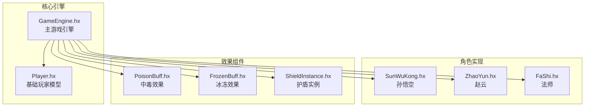

**图表来源**
- [GameEngine.hx:16-43](file://GameEngine.hx#L16-L43)
- [Player.hx:3-24](file://character/Player.hx#L3-L24)

**章节来源**
- [GameEngine.hx:1-725](file://GameEngine.hx#L1-L725)
- [Player.hx:1-375](file://character/Player.hx#L1-L375)

## 核心组件
0组合效果系统由多个相互协作的组件构成，每个组件都有特定的职责和功能。

### 组合效果分类体系
系统将0组合分为五大类别，每类都有独特的机制和实现方式：

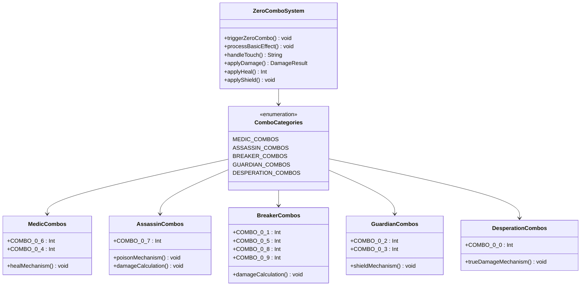

**图表来源**
- [GameEngine.hx:554-591](file://GameEngine.hx#L554-L591)
- [GameEngine.hx:566-588](file://GameEngine.hx#L566-L588)

### 角色技能覆盖机制
每个角色都可以通过`tryOverrideComboEffect`方法来覆盖默认的0组合效果，实现个性化的战斗体验：

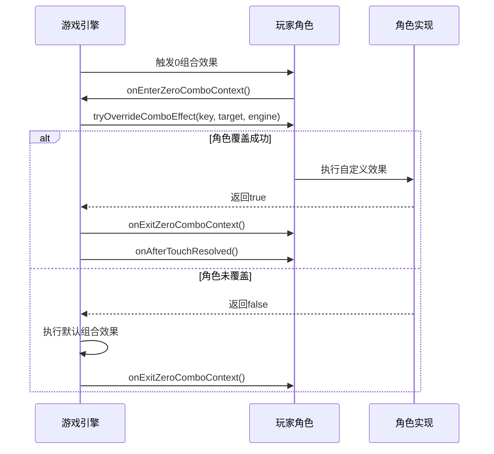

**图表来源**
- [GameEngine.hx:554-564](file://GameEngine.hx#L554-L564)
- [Player.hx:143-147](file://character/Player.hx#L143-L147)

**章节来源**
- [GameEngine.hx:554-591](file://GameEngine.hx#L554-L591)
- [Player.hx:143-170](file://character/Player.hx#L143-L170)

## 架构概览
0组合效果系统采用模块化设计，通过清晰的接口分离关注点，实现了高度的可扩展性和可维护性。

### 系统架构图
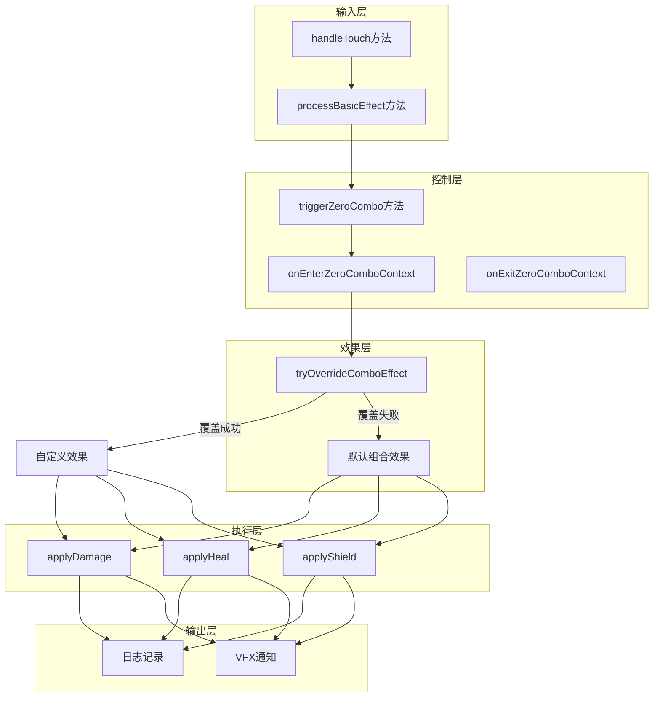

**图表来源**
- [GameEngine.hx:418-468](file://GameEngine.hx#L418-L468)
- [GameEngine.hx:470-493](file://GameEngine.hx#L470-L493)
- [GameEngine.hx:554-591](file://GameEngine.hx#L554-L591)

### 数据流分析
系统采用流水线式的数据处理模式，确保每个阶段的职责明确：

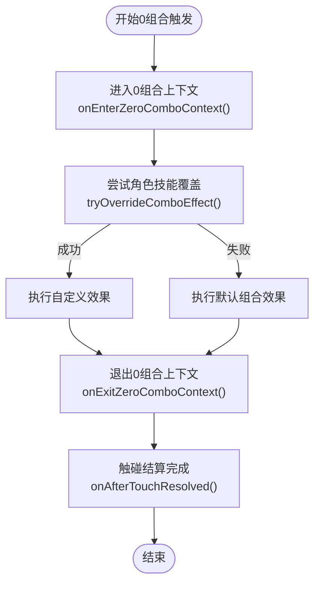

**图表来源**
- [GameEngine.hx:554-564](file://GameEngine.hx#L554-L564)
- [GameEngine.hx:589-591](file://GameEngine.hx#L589-L591)

**章节来源**
- [GameEngine.hx:418-591](file://GameEngine.hx#L418-L591)

## 详细组件分析

### 医术组合（[0,6]、[0,4]）
医术组合是最基础的回复型0组合，为角色提供稳定的治疗效果。

#### 实现机制
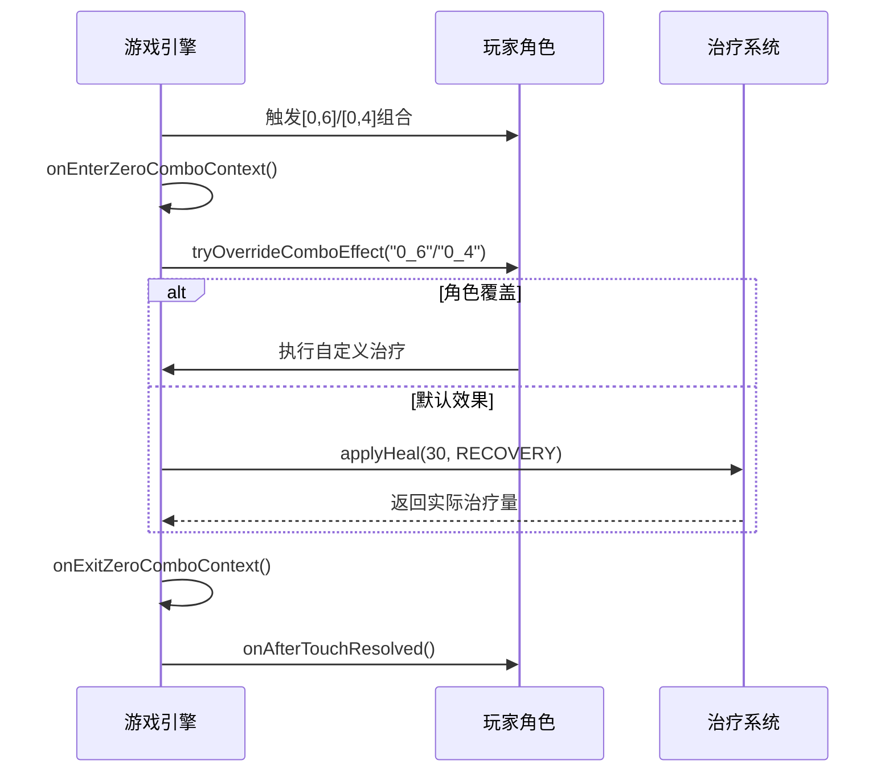

**图表来源**
- [GameEngine.hx:567-572](file://GameEngine.hx#L567-L572)
- [GameEngine.hx:560-564](file://GameEngine.hx#L560-L564)

#### 效果特点
- **治疗量**: 固定30点治疗
- **治疗类型**: RECOVERY（普通回复）
- **触发条件**: 手牌为0且另一手为6或4
- **冷却机制**: 无特殊冷却限制

**章节来源**
- [GameEngine.hx:567-572](file://GameEngine.hx#L567-L572)

### 刺客组合（[0,7]）
刺客组合提供高爆发伤害和持续伤害效果，是典型的刺客型0组合。

#### 实现机制
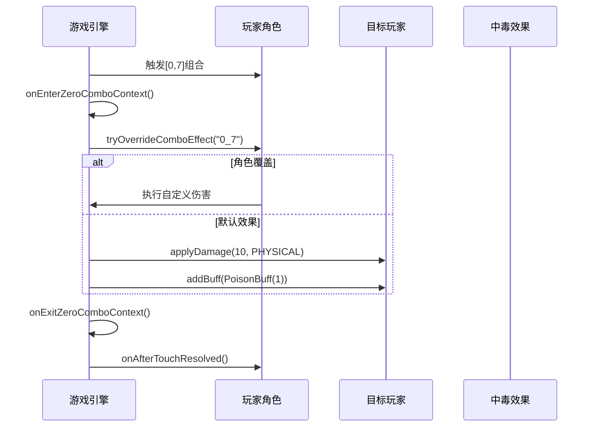

**图表来源**
- [GameEngine.hx:573-576](file://GameEngine.hx#L573-L576)
- [GameEngine.hx:560-564](file://GameEngine.hx#L560-L564)

#### 效果特点
- **伤害**: 10点物理伤害
- **中毒效果**: 1层PoisonBuff
- **触发条件**: 手牌为0且另一手为7
- **持续时间**: 中毒层数随时间自然消退

**章节来源**
- [GameEngine.hx:573-576](file://GameEngine.hx#L573-L576)
- [PoisonBuff.hx:1-50](file://buffs/PoisonBuff.hx#L1-L50)

### 破军组合（[0,1]、[0,5]、[0,8]、[0,9]）
破军组合专注于高伤害输出，是典型的战士型0组合。

#### 实现机制
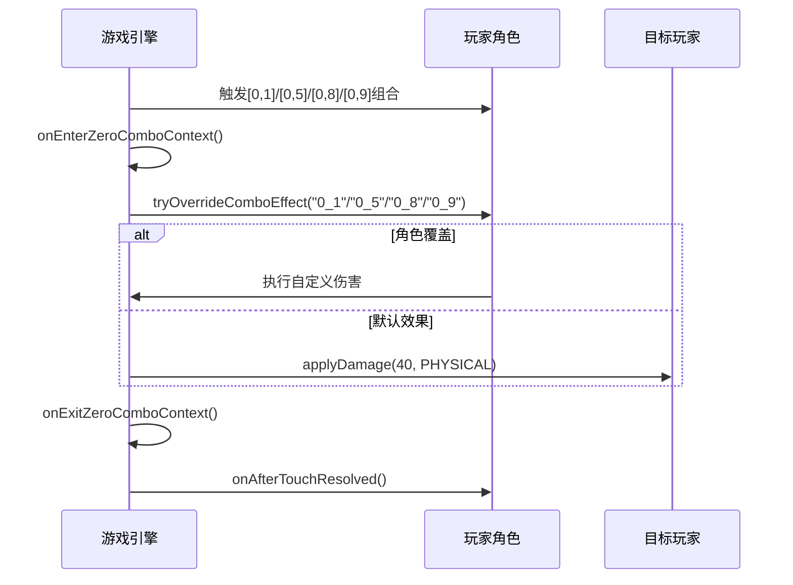

**图表来源**
- [GameEngine.hx:577-579](file://GameEngine.hx#L577-L579)
- [GameEngine.hx:560-564](file://GameEngine.hx#L560-L564)

#### 效果特点
- **伤害**: 固定40点物理伤害
- **触发条件**: 手牌为0且另一手为1、5、8或9
- **伤害类型**: 物理伤害
- **适用场景**: 高血量目标的有效打击

**章节来源**
- [GameEngine.hx:577-579](file://GameEngine.hx#L577-L579)

### 御守组合（[0,2]、[0,3]）
御守组合提供护盾保护，是典型的辅助型0组合。

#### 实现机制
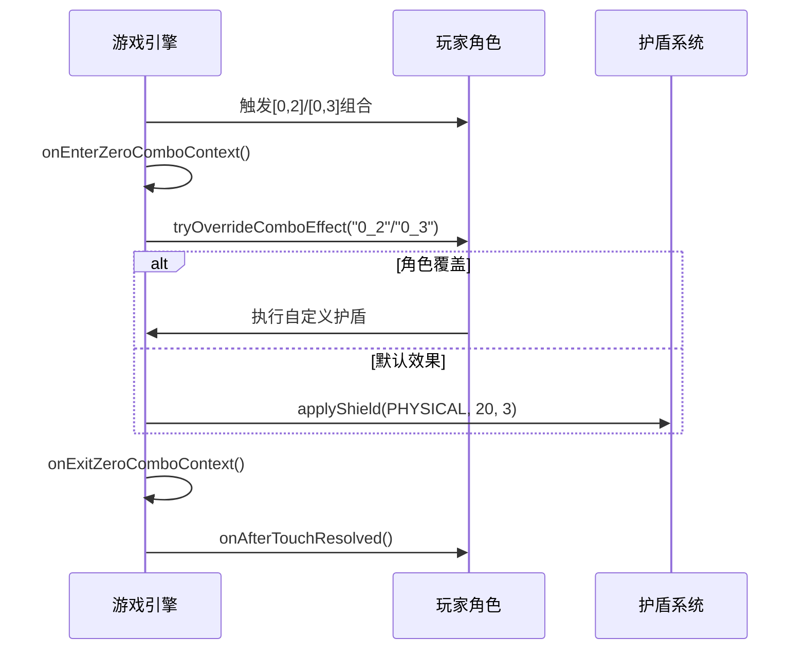

**图表来源**
- [GameEngine.hx:580-582](file://GameEngine.hx#L580-L582)
- [GameEngine.hx:560-564](file://GameEngine.hx#L560-L564)

#### 效果特点
- **护盾量**: 20点护盾
- **护盾类型**: 物理护盾
- **持续时间**: 3回合
- **触发条件**: 手牌为0且另一手为2或3
- **特殊机制**: 可与其他护盾叠加

**章节来源**
- [GameEngine.hx:580-582](file://GameEngine.hx#L580-L582)
- [ShieldInstance.hx:1-13](file://model/ShieldInstance.hx#L1-L13)

### 绝境组合（[0,0]）
绝境组合是最强大的真伤效果，无视目标的所有防御。

#### 实现机制
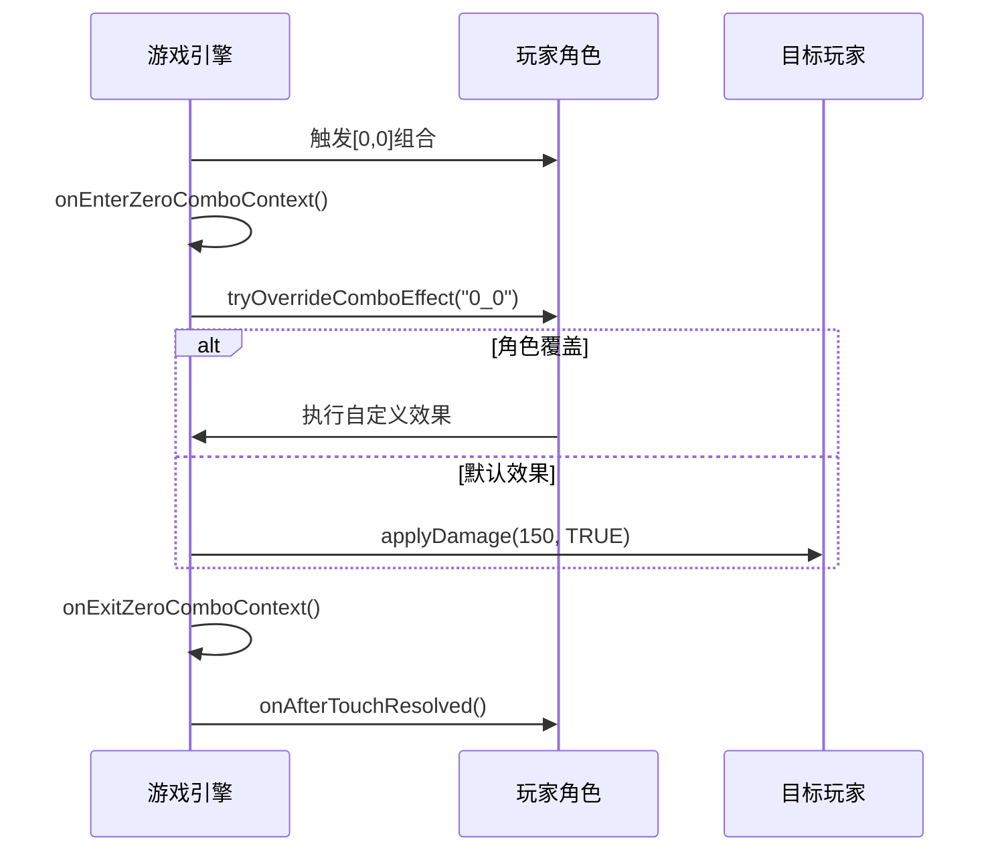

**图表来源**
- [GameEngine.hx:583-585](file://GameEngine.hx#L583-L585)
- [GameEngine.hx:560-564](file://GameEngine.hx#L560-L564)

#### 效果特点
- **伤害**: 150点真实伤害
- **伤害类型**: 真实伤害（无视护盾和减伤）
- **触发条件**: 双手均为0
- **致命性**: 通常能快速击杀低血量目标

**章节来源**
- [GameEngine.hx:583-585](file://GameEngine.hx#L583-L585)

### 角色技能覆盖机制详解
角色可以通过重写`tryOverrideComboEffect`方法来实现自定义的0组合效果。

#### 覆盖机制流程
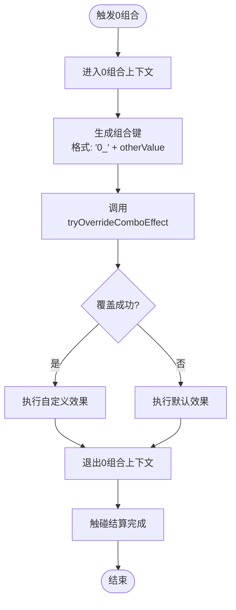

**图表来源**
- [GameEngine.hx:559-564](file://GameEngine.hx#L559-L564)
- [Player.hx:143-147](file://character/Player.hx#L143-L147)

#### 典型覆盖实现示例
以孙悟空的[0,2]组合为例，展示高级覆盖机制：

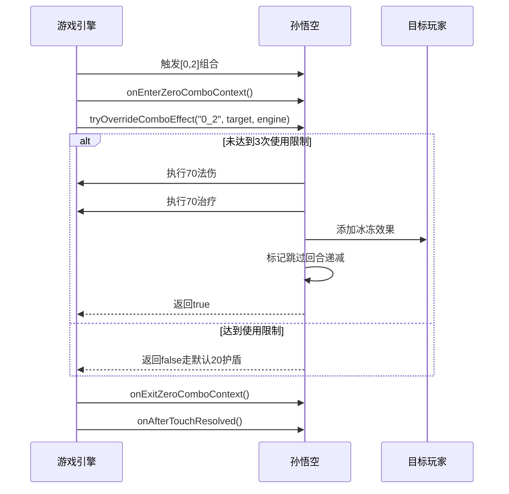

**图表来源**
- [SunWuKong.hx:136-166](file://character/SunWuKong.hx#L136-L166)
- [GameEngine.hx:559-564](file://GameEngine.hx#L559-L564)

**章节来源**
- [SunWuKong.hx:136-166](file://character/SunWuKong.hx#L136-L166)
- [Player.hx:143-147](file://character/Player.hx#L143-L147)

### 上下文管理机制
0组合系统通过上下文管理确保技能效果的正确执行和资源的合理分配。

#### 上下文生命周期
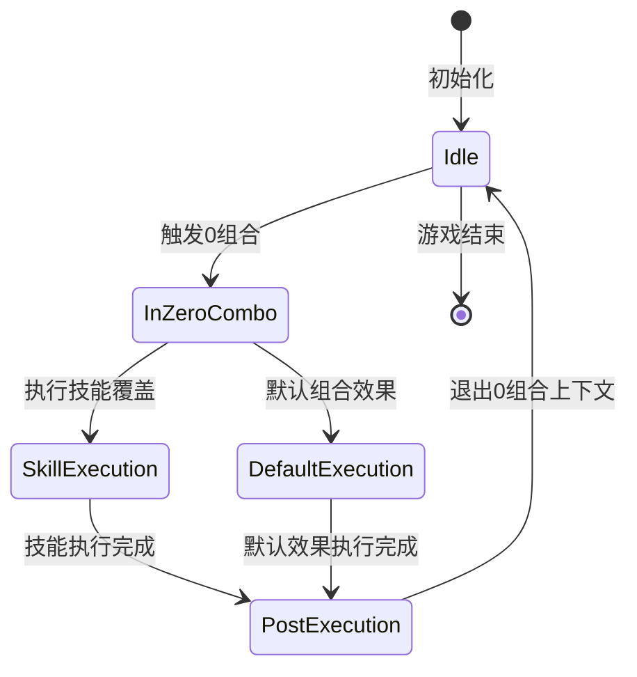

**图表来源**
- [GameEngine.hx:555-556](file://GameEngine.hx#L555-L556)
- [GameEngine.hx:590-591](file://GameEngine.hx#L590-L591)

#### 上下文钩子实现
不同角色可以利用上下文钩子实现特殊的机制：

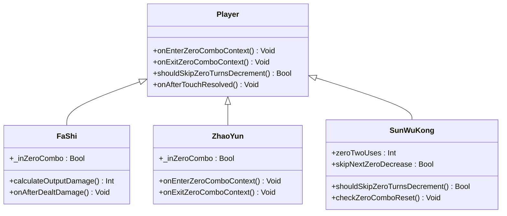

**图表来源**
- [Player.hx:162-170](file://character/Player.hx#L162-L170)
- [FaShi.hx:42-65](file://character/FaShi.hx#L42-L65)
- [ZhaoYun.hx:92-98](file://character/ZhaoYun.hx#L92-L98)
- [SunWuKong.hx:171-177](file://character/SunWuKong.hx#L171-L177)

**章节来源**
- [Player.hx:162-170](file://character/Player.hx#L162-L170)
- [FaShi.hx:42-65](file://character/FaShi.hx#L42-L65)
- [ZhaoYun.hx:92-98](file://character/ZhaoYun.hx#L92-L98)
- [SunWuKong.hx:171-177](file://character/SunWuKong.hx#L171-L177)

## 依赖关系分析
0组合效果系统的依赖关系体现了清晰的层次结构和模块化设计。

### 核心依赖图
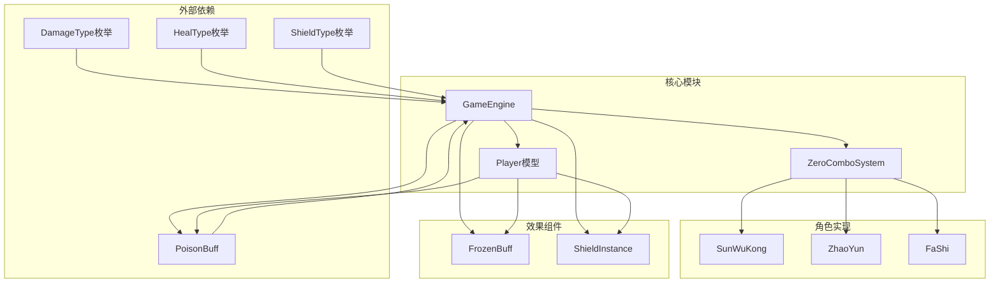

**图表来源**
- [GameEngine.hx:3-15](file://GameEngine.hx#L3-L15)
- [Player.hx:3-18](file://character/Player.hx#L3-L18)

### 耦合度分析
系统采用了松耦合的设计原则，通过接口和抽象类降低模块间的依赖：

- **向上依赖**: 子类依赖于Player基类的接口
- **向下依赖**: GameEngine依赖于具体角色实现
- **横向依赖**: 角色之间无直接依赖，通过GameEngine协调

**章节来源**
- [GameEngine.hx:1-725](file://GameEngine.hx#L1-L725)
- [Player.hx:1-375](file://character/Player.hx#L1-L375)

## 性能考虑
0组合效果系统在设计时充分考虑了性能优化，采用多种策略确保游戏运行的流畅性。

### 性能优化策略
1. **延迟初始化**: 只在需要时创建和销毁效果实例
2. **对象池**: 重用Buff和Shield实例减少GC压力
3. **条件检查**: 通过isValidTouch预检查避免无效计算
4. **批量处理**: 同类效果统一处理减少分支判断

### 复杂度分析
- **时间复杂度**: O(1) - 每个0组合效果的处理都是常数时间
- **空间复杂度**: O(n) - n为当前场上的玩家数量
- **内存使用**: 通过对象复用和及时清理减少内存占用

## 故障排除指南
常见问题及解决方案：

### 组合效果未触发
**症状**: 触碰0组合但无任何效果
**排查步骤**:
1. 检查角色的`tryOverrideComboEffect`是否正确实现
2. 确认`onEnterZeroComboContext`和`onExitZeroComboContext`是否正确调用
3. 验证组合键格式是否为"0_X"

### 效果异常
**症状**: 组合效果数值不正确
**排查步骤**:
1. 检查`calculateOutputDamage`和`calculateFinalHeal`的重写实现
2. 确认伤害类型和治疗类型的正确使用
3. 验证Buff的层数和持续时间设置

### 性能问题
**症状**: 游戏运行卡顿
**排查步骤**:
1. 检查是否有过多的全局事件监听
2. 确认Buff和Shield的及时清理
3. 优化复杂的计算逻辑

**章节来源**
- [GameEngine.hx:554-591](file://GameEngine.hx#L554-L591)
- [Player.hx:143-170](file://character/Player.hx#L143-L170)

## 结论
0组合效果系统展现了优秀的软件工程实践，通过模块化设计、清晰的接口定义和灵活的扩展机制，实现了高度可定制的游戏体验。系统的主要优势包括：

1. **高度可扩展**: 通过`tryOverrideComboEffect`机制，任何角色都可以实现独特的0组合效果
2. **清晰的架构**: 分层设计使得代码易于理解和维护
3. **性能优化**: 采用多种优化策略确保游戏运行流畅
4. **强类型安全**: 通过枚举和类型检查减少运行时错误

该系统为类似的游戏提供了优秀的参考实现，展示了如何在保持代码简洁的同时实现丰富的游戏机制。通过深入理解这些实现细节，开发者可以更好地扩展和定制自己的游戏系统。