# 双子星组合

<cite>
**本文引用的文件**
- [GameEngine.hx](file://GameEngine.hx)
- [TurnManager.hx](file://TurnManager.hx)
- [Player.hx](file://character/Player.hx)
- [Buff.hx](file://model/Buff.hx)
- [DamageBoostBuff.hx](file://buffs/DamageBoostBuff.hx)
- [ExtraActionBuff.hx](file://buffs/ExtraActionBuff.hx)
- [PoisonBuff.hx](file://buffs/PoisonBuff.hx)
- [ReflectBuff.hx](file://buffs/ReflectBuff.hx)
- [InvincibleBuff.hx](file://buffs/InvincibleBuff.hx)
- [XiaoQiao.hx](file://character/XiaoQiao.hx)
- [SunWuKong.hx](file://character/SunWuKong.hx)
- [DamageType.hx](file://model/DamageType.hx)
- [HealType.hx](file://model/HealType.hx)
- [ShieldType.hx](file://model/ShieldType.hx)
</cite>

## 目录
1. [简介](#简介)
2. [项目结构](#项目结构)
3. [核心组件](#核心组件)
4. [架构概览](#架构概览)
5. [详细组件分析](#详细组件分析)
6. [依赖分析](#依赖分析)
7. [性能考虑](#性能考虑)
8. [故障排除指南](#故障排除指南)
9. [结论](#结论)

## 简介
本文件详细阐述双子星组合效果的技术实现，涵盖各类双子星组合的触发条件、效果实现与交互关系。重点包括：
- 双九：基于场上有多少个3的倍数（不含0）计算倍率 1.5^N
- 双八：本大回合最多触发2次，每次触发获得1次额外行动与60点物法盾
- 双七：造成30点物理伤害并叠加3层中毒
- 双六：恢复90点生命
- 双五：获得2层反弹护盾
- 双四：获得2次伤害翻倍（物理与真实伤害生效）
- 双二/双三：各获得30点物法护盾，持续3回合
- 双一：获得2回合无敌
- 双零：造成150点真实伤害

同时，文档提供组合倍率计算公式、使用次数限制、与其他效果的交互关系，以及具体代码实现与算法细节，包括 countMultiplesOf3OnField 函数的工作原理。

## 项目结构
双子星组合位于游戏引擎的核心逻辑中，主要涉及以下模块：
- GameEngine：负责触碰结算、组合触发、伤害与回血流程、护盾发放与事件广播
- TurnManager：负责回合管理、大回合切换、额外行动判定与回合结束结算
- Player：角色基类，提供伤害抗性、护盾管理、Buff 生命周期与钩子接口
- Buff 系列：各类增益/减益效果的实现（伤害翻倍、额外行动、中毒、反弹护盾、无敌等）
- 角色特化：如小乔（物伤×1.5、回血×1.5、护盾升级）、孙悟空（x/y增益、[0,2]大招覆盖）

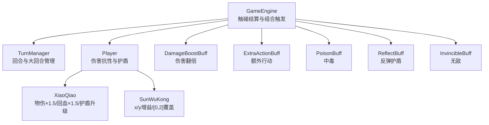

图表来源
- [GameEngine.hx:418-591](file://GameEngine.hx#L418-L591)
- [TurnManager.hx:110-190](file://TurnManager.hx#L110-L190)
- [Player.hx:245-302](file://character/Player.hx#L245-L302)
- [DamageBoostBuff.hx:6-20](file://buffs/DamageBoostBuff.hx#L6-L20)
- [ExtraActionBuff.hx:4-12](file://buffs/ExtraActionBuff.hx#L4-L12)
- [PoisonBuff.hx:6-50](file://buffs/PoisonBuff.hx#L6-L50)
- [ReflectBuff.hx:16-43](file://buffs/ReflectBuff.hx#L16-L43)
- [InvincibleBuff.hx:11-44](file://buffs/InvincibleBuff.hx#L11-L44)
- [XiaoQiao.hx:17-96](file://character/XiaoQiao.hx#L17-L96)
- [SunWuKong.hx:17-207](file://character/SunWuKong.hx#L17-L207)

章节来源
- [GameEngine.hx:418-591](file://GameEngine.hx#L418-L591)
- [TurnManager.hx:110-190](file://TurnManager.hx#L110-L190)
- [Player.hx:245-302](file://character/Player.hx#L245-L302)

## 核心组件
- 触碰与组合触发：handleTouch 负责触碰结算，processBasicEffect 判断双子星、零组合与[x,6]回血；triggerDoubleStar 根据双子星数字触发对应效果。
- 组合倍率：双九通过 countMultiplesOf3OnField 计算场上有多少个3的倍数（不含0），倍率为 1.5^N。
- 回合与大回合：TurnManager 控制额外行动、回合结束结算与大回合事件广播。
- 护盾与伤害：applyShield 与 Player.handleIncomingDamage 统一护盾抗伤逻辑；applyDamage/applyHeal 统一伤害与回血流程。
- 角色钩子：Player 提供 onAfterDealtDamage/onAfterHeal/onAnyOutputDamage/onAnyHealHappened 等钩子，供角色扩展效果。

章节来源
- [GameEngine.hx:418-591](file://GameEngine.hx#L418-L591)
- [GameEngine.hx:594-605](file://GameEngine.hx#L594-L605)
- [TurnManager.hx:110-190](file://TurnManager.hx#L110-L190)
- [Player.hx:245-302](file://character/Player.hx#L245-L302)

## 架构概览
双子星组合的触发与执行遵循以下流程：触碰 → 判断双子星 → 计算倍率/限制 → 应用效果 → 广播事件 → 回合管理。

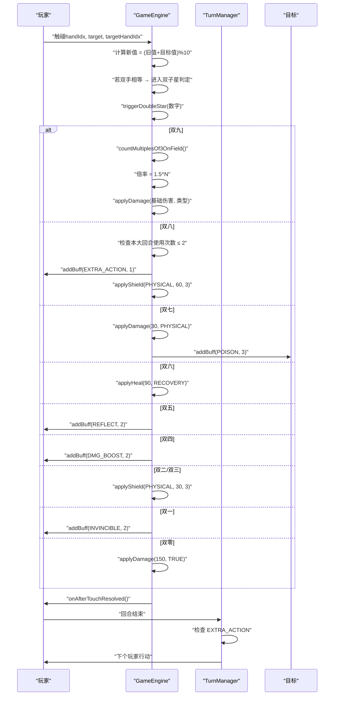

图表来源
- [GameEngine.hx:418-591](file://GameEngine.hx#L418-L591)
- [TurnManager.hx:110-190](file://TurnManager.hx#L110-L190)

## 详细组件分析

### 双九：倍率计算（1.5^N）
- 触发条件：双手相等且数值为9
- 倍率计算：统计场地上所有存活角色手中“非0且能被3整除”的数量 N，倍率为 1.5^N
- 应用时机：在角色乘算之前、攻击者 Buff 乘算之后应用组合倍率
- 与小乔的关系：小乔物伤×1.5在倍率之前生效，因此最终伤害为 (基础×1.5)×(1.5^N)

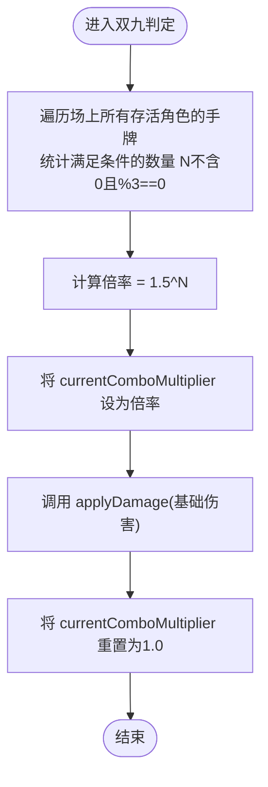

图表来源
- [GameEngine.hx:496-504](file://GameEngine.hx#L496-L504)
- [GameEngine.hx:594-605](file://GameEngine.hx#L594-L605)

章节来源
- [GameEngine.hx:496-504](file://GameEngine.hx#L496-L504)
- [GameEngine.hx:594-605](file://GameEngine.hx#L594-L605)

### 双八：额外行动与护盾（本大回合最多2次）
- 触发条件：双手相等且数值为8
- 使用限制：同一“大回合”内最多触发2次，超过则跳过
- 效果：获得1次额外行动（EXTRA_ACTION 层数=1），本回合结束后生效；同时获得60点物法盾，持续3回合
- 与回合管理交互：TurnManager 在切换玩家时检查 EXTRA_ACTION 层数，若>0则立即再次行动

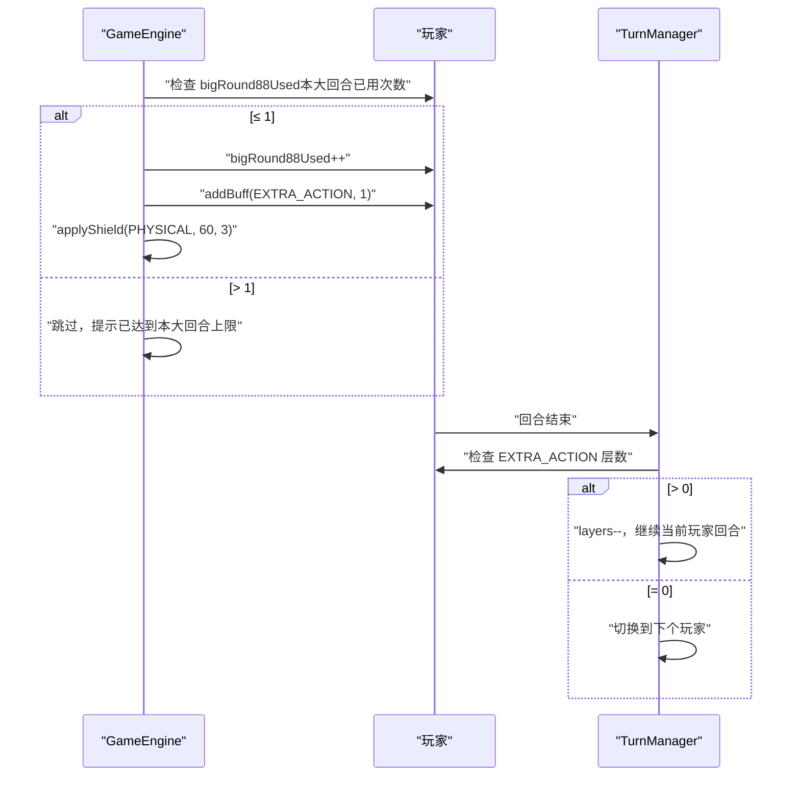

图表来源
- [GameEngine.hx:506-514](file://GameEngine.hx#L506-L514)
- [TurnManager.hx:115-122](file://TurnManager.hx#L115-L122)
- [ExtraActionBuff.hx:4-12](file://buffs/ExtraActionBuff.hx#L4-L12)

章节来源
- [GameEngine.hx:506-514](file://GameEngine.hx#L506-L514)
- [TurnManager.hx:115-122](file://TurnManager.hx#L115-L122)
- [ExtraActionBuff.hx:4-12](file://buffs/ExtraActionBuff.hx#L4-L12)

### 双七：伤害与中毒
- 触发条件：双手相等且数值为7
- 效果：对目标造成30点物理伤害，并叠加3层中毒（PoisonBuff）
- 中毒结算：每层中毒在回合结束造成10点魔法伤害，可被乌鸦加成固定+10

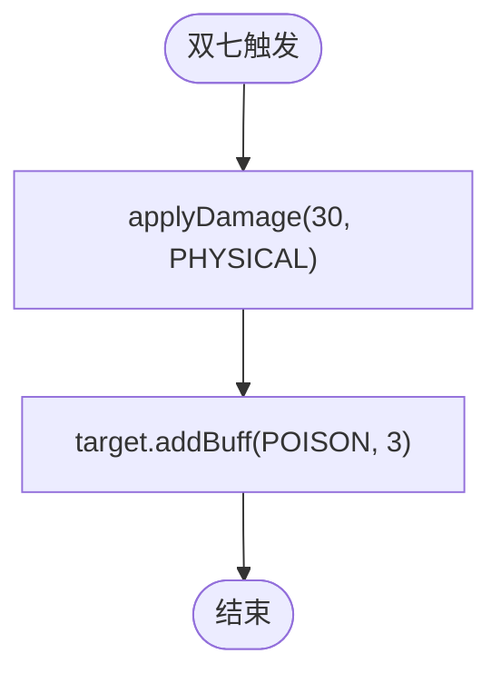

图表来源
- [GameEngine.hx:516-519](file://GameEngine.hx#L516-L519)
- [PoisonBuff.hx:11-48](file://buffs/PoisonBuff.hx#L11-L48)

章节来源
- [GameEngine.hx:516-519](file://GameEngine.hx#L516-L519)
- [PoisonBuff.hx:11-48](file://buffs/PoisonBuff.hx#L11-L48)

### 双六：回复效果
- 触发条件：双手相等且数值为6
- 效果：恢复90点生命（RECOVERY，可解毒）
- 与[x,6]回血：GameEngine 会在特定条件下触发[x,6]回血（例如新出现的6），此处为双六组合的独立回血

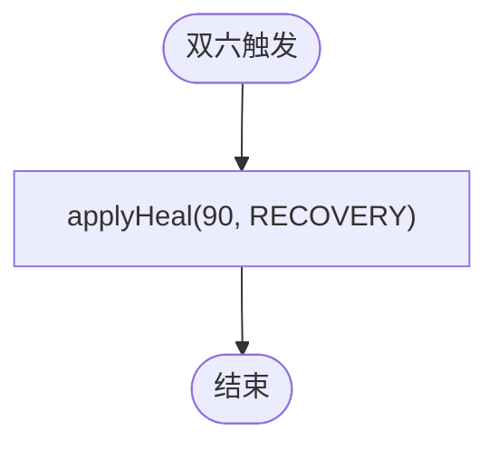

图表来源
- [GameEngine.hx:521-523](file://GameEngine.hx#L521-L523)

章节来源
- [GameEngine.hx:521-523](file://GameEngine.hx#L521-L523)

### 双五：反弹护盾
- 触发条件：双手相等且数值为5
- 效果：获得2层反弹护盾（ReflectBuff）
- 抗伤机制：受到物理伤害时反弹一半给攻击者（上限200），自身免疫本次伤害；通过 GameEngine.isReflecting 防止无限反弹

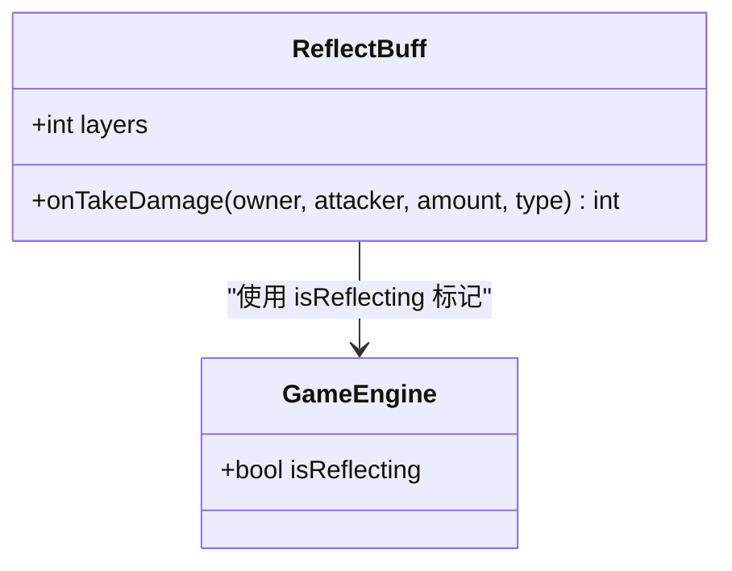

图表来源
- [ReflectBuff.hx:16-43](file://buffs/ReflectBuff.hx#L16-L43)
- [GameEngine.hx:20](file://GameEngine.hx#L20)

章节来源
- [GameEngine.hx:20](file://GameEngine.hx#L20)
- [ReflectBuff.hx:16-43](file://buffs/ReflectBuff.hx#L16-L43)

### 双四：伤害倍率
- 触发条件：双手相等且数值为4
- 效果：获得2次伤害翻倍（DamageBoostBuff，层数=2）
- 生效范围：仅对物理与真实伤害生效，法术伤害不受影响

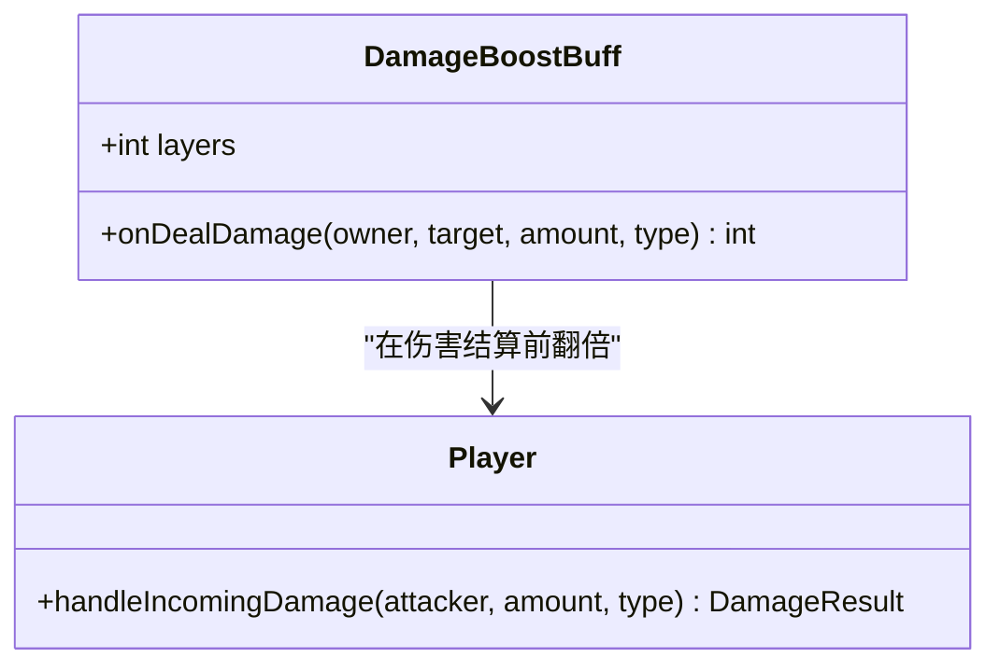

图表来源
- [DamageBoostBuff.hx:6-20](file://buffs/DamageBoostBuff.hx#L6-L20)
- [Player.hx:245-302](file://character/Player.hx#L245-L302)

章节来源
- [DamageBoostBuff.hx:6-20](file://buffs/DamageBoostBuff.hx#L6-L20)
- [Player.hx:245-302](file://character/Player.hx#L245-L302)

### 双二/双三：护盾效果
- 触发条件：双手相等且数值为2或3
- 效果：获得30点物理护盾，持续3回合；经小乔护盾升级后变为物法盾，厚度×1.5，持续+1回合

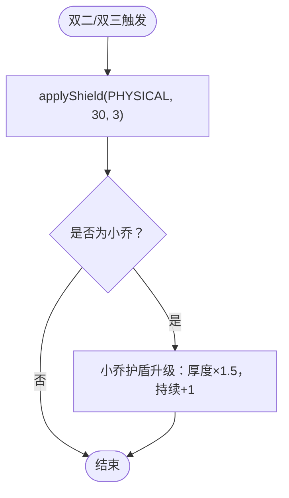

图表来源
- [GameEngine.hx:533-539](file://GameEngine.hx#L533-L539)
- [XiaoQiao.hx:65-70](file://character/XiaoQiao.hx#L65-L70)

章节来源
- [GameEngine.hx:533-539](file://GameEngine.hx#L533-L539)
- [XiaoQiao.hx:65-70](file://character/XiaoQiao.hx#L65-L70)

### 双一：无敌效果
- 触发条件：双手相等且数值为1
- 效果：获得2回合无敌（InvincibleBuff）
- 抗性：免疫物理与法术伤害，真实伤害仍可穿透

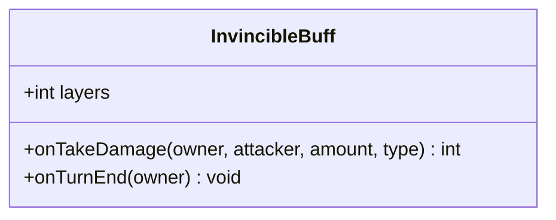

图表来源
- [InvincibleBuff.hx:11-44](file://buffs/InvincibleBuff.hx#L11-L44)

章节来源
- [InvincibleBuff.hx:11-44](file://buffs/InvincibleBuff.hx#L11-L44)

### 双零：真伤效果
- 触发条件：双手相等且数值为0
- 效果：对目标造成150点真实伤害（穿透护盾与无敌）
- 与零组合：零组合中也有[0,0]绝境（150点真伤），此处为双零组合的独立效果

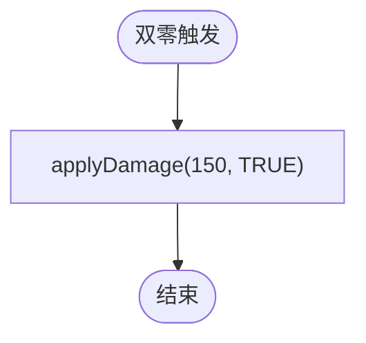

图表来源
- [GameEngine.hx:545-547](file://GameEngine.hx#L545-L547)

章节来源
- [GameEngine.hx:545-547](file://GameEngine.hx#L545-L547)

## 依赖分析
- 组合触发依赖 GameEngine 的触碰结算与双子星判定
- 倍率与回合限制依赖 TurnManager 的大回合与额外行动判定
- 护盾与伤害抗性依赖 Player 的统一抗伤逻辑
- 角色特化效果（如小乔、孙悟空）通过钩子扩展组合效果

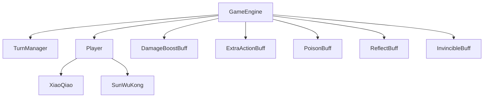

图表来源
- [GameEngine.hx:418-591](file://GameEngine.hx#L418-L591)
- [TurnManager.hx:110-190](file://TurnManager.hx#L110-L190)
- [Player.hx:245-302](file://character/Player.hx#L245-L302)
- [DamageBoostBuff.hx:6-20](file://buffs/DamageBoostBuff.hx#L6-L20)
- [ExtraActionBuff.hx:4-12](file://buffs/ExtraActionBuff.hx#L4-L12)
- [PoisonBuff.hx:6-50](file://buffs/PoisonBuff.hx#L6-L50)
- [ReflectBuff.hx:16-43](file://buffs/ReflectBuff.hx#L16-L43)
- [InvincibleBuff.hx:11-44](file://buffs/InvincibleBuff.hx#L11-L44)
- [XiaoQiao.hx:17-96](file://character/XiaoQiao.hx#L17-L96)
- [SunWuKong.hx:17-207](file://character/SunWuKong.hx#L17-L207)

章节来源
- [GameEngine.hx:418-591](file://GameEngine.hx#L418-L591)
- [TurnManager.hx:110-190](file://TurnManager.hx#L110-L190)
- [Player.hx:245-302](file://character/Player.hx#L245-L302)

## 性能考虑
- 双九倍率计算：countMultiplesOf3OnField 遍历所有存活角色的手牌，时间复杂度 O(C×H)，其中 C 为角色数，H 为每角色手槽数（通常为2）
- 伤害翻倍与反弹：DamageBoostBuff 与 ReflectBuff 在伤害结算阶段按需生效，避免重复计算
- 回合管理：TurnManager 仅在回合切换时检查 EXTRA_ACTION，减少不必要的遍历

## 故障排除指南
- 双八触发次数异常：检查 bigRound88Used 是否在大回合结束时被正确重置，以及是否在回合结束时被清零
- 双四翻倍无效：确认伤害类型为 PHYSICAL 或 TRUE，且 DamageBoostBuff 层数>0
- 双五反弹无限：确保 GameEngine.isReflecting 标记在反弹过程中被正确设置与复位
- 双九倍率不正确：核对 countMultiplesOf3OnField 的统计逻辑，确保仅统计非0且能被3整除的数字
- 双七中毒不掉血：确认回合结束结算中 PoisonBuff.onTurnEnd 是否被调用

章节来源
- [GameEngine.hx:506-514](file://GameEngine.hx#L506-L514)
- [TurnManager.hx:115-122](file://TurnManager.hx#L115-L122)
- [ReflectBuff.hx:22-41](file://buffs/ReflectBuff.hx#L22-L41)
- [PoisonBuff.hx:11-48](file://buffs/PoisonBuff.hx#L11-L48)
- [GameEngine.hx:594-605](file://GameEngine.hx#L594-L605)

## 结论
双子星组合通过 GameEngine 的集中控制与 TurnManager 的回合管理，实现了多样化的战斗效果。双九的倍率计算、双八的使用次数限制、双七的伤害与中毒、双六的回复、双五的反弹护盾、双四的伤害翻倍、双二/双三的护盾、双一的无敌与双零的真伤共同构成了丰富的策略深度。通过 Buff 系统与角色钩子，这些效果既可独立生效，也可与角色特化能力协同，形成复杂的战术组合。