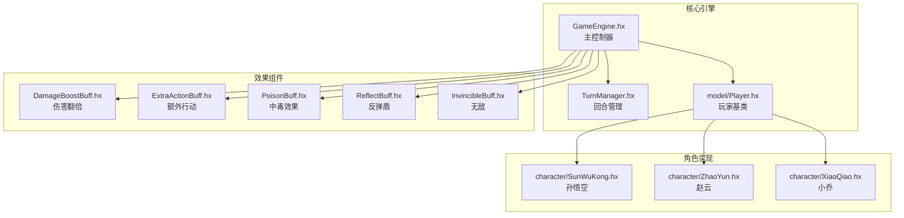
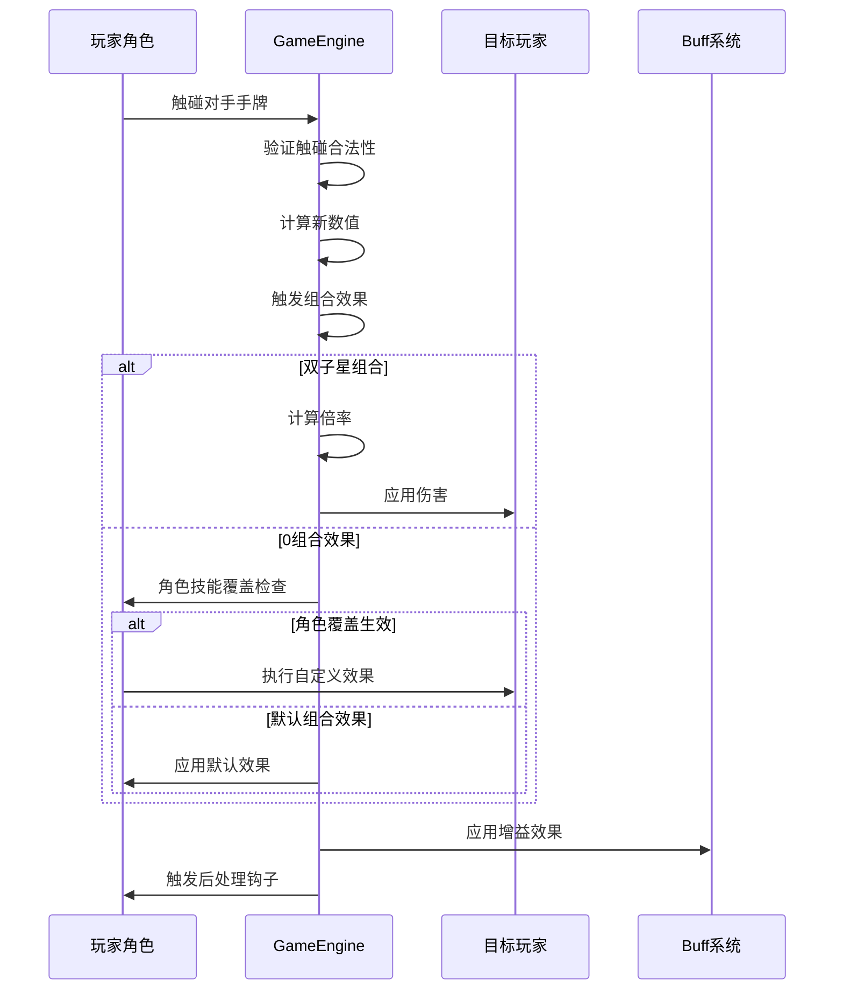
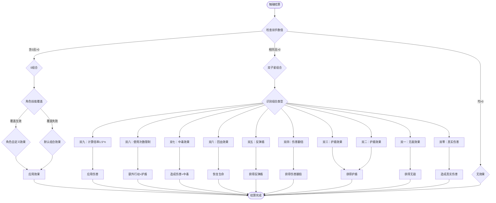
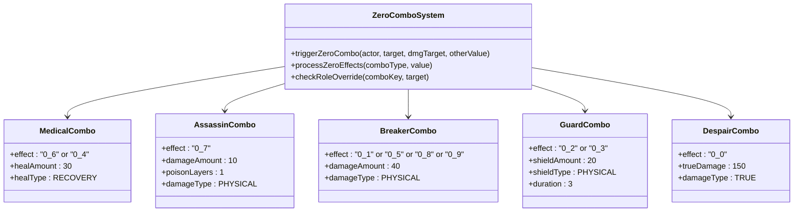
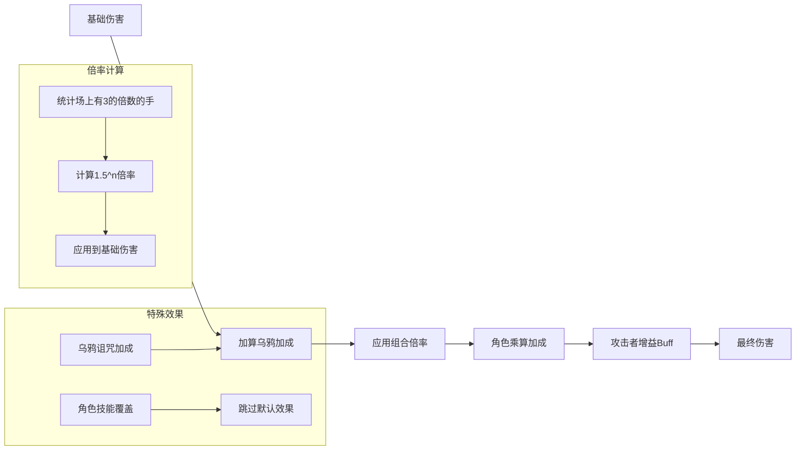
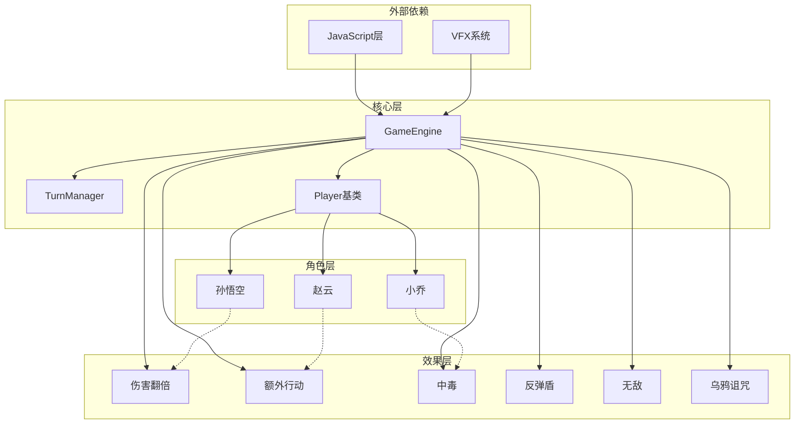

# 组合效果系统

<cite>
**本文档引用的文件**
- [GameEngine.hx](file://GameEngine.hx)
- [TurnManager.hx](file://TurnManager.hx)
- [Player.hx](file://model/Player.hx)
- [SunWuKong.hx](file://character/SunWuKong.hx)
- [ZhaoYun.hx](file://character/ZhaoYun.hx)
- [XiaoQiao.hx](file://character/XiaoQiao.hx)
- [DamageBoostBuff.hx](file://buffs/DamageBoostBuff.hx)
- [ExtraActionBuff.hx](file://buffs/ExtraActionBuff.hx)
- [PoisonBuff.hx](file://buffs/PoisonBuff.hx)
- [ReflectBuff.hx](file://buffs/ReflectBuff.hx)
- [InvincibleBuff.hx](file://buffs/InvincibleBuff.hx)
</cite>

## 目录
1. [简介](#简介)
2. [项目结构](#项目结构)
3. [核心组件](#核心组件)
4. [架构概览](#架构概览)
5. [详细组件分析](#详细组件分析)
6. [依赖关系分析](#依赖关系分析)
7. [性能考虑](#性能考虑)
8. [故障排除指南](#故障排除指南)
9. [结论](#结论)

## 简介

组合效果系统是游戏中的核心机制，负责处理角色在触碰对手手牌时产生的各种组合效果。该系统实现了双子星组合（双九、双八、双七等）和0组合效果（[0,6]、[0,4]、[0,7]等）的完整逻辑，包括倍率计算、特殊限制条件、回合使用次数限制等功能。

系统采用模块化设计，通过GameEngine作为中央协调器，结合角色特定的技能覆盖机制，实现了高度灵活的组合效果处理。每个角色都可以通过重写Player基类的方法来实现独特的组合效果，同时保持与其他角色的兼容性。

## 项目结构

组合效果系统主要分布在以下几个关键文件中：



**图表来源**
- [GameEngine.hx:1-725](file://GameEngine.hx#L1-L725)
- [TurnManager.hx:1-232](file://TurnManager.hx#L1-L232)
- [Player.hx:1-398](file://model/Player.hx#L1-L398)

**章节来源**
- [GameEngine.hx:1-725](file://GameEngine.hx#L1-L725)
- [TurnManager.hx:1-232](file://TurnManager.hx#L1-L232)
- [Player.hx:1-398](file://model/Player.hx#L1-L398)

## 核心组件

### GameEngine - 组合效果主控制器

GameEngine是整个组合效果系统的核心控制器，负责协调所有组合效果的触发和执行。其主要职责包括：

- **组合效果触发管理**：处理双子星组合和0组合效果的识别和执行
- **倍率计算系统**：实现组合倍率的动态计算和应用
- **回合限制控制**：管理双八等组合的使用次数限制
- **角色技能覆盖**：支持角色特定的组合效果覆盖机制

### Player - 角色基类

Player基类定义了所有角色共享的基础功能和钩子方法，包括：

- **组合效果钩子**：`tryOverrideComboEffect`、`onEnterZeroComboContext`等
- **伤害计算接口**：`calculateOutputDamage`、`calculateFinalHeal`
- **回合管理属性**：`bigRound88Used`、`zeroTurns0`、`zeroTurns1`

### 角色特定实现

每个角色通过继承Player基类来实现独特的组合效果：

- **孙悟空**：实现[0,2]大招覆盖，支持3次使用限制
- **赵云**：实现单手被动效果，0组合期间禁用
- **小乔**：实现物伤和回血1.5倍加成

**章节来源**
- [GameEngine.hx:16-725](file://GameEngine.hx#L16-L725)
- [Player.hx:36-187](file://model/Player.hx#L36-L187)
- [SunWuKong.hx:136-166](file://character/SunWuKong.hx#L136-L166)
- [ZhaoYun.hx:92-98](file://character/ZhaoYun.hx#L92-L98)
- [XiaoQiao.hx:25-40](file://character/XiaoQiao.hx#L25-L40)

## 架构概览

组合效果系统采用分层架构设计，确保了良好的模块化和可扩展性：



**图表来源**
- [GameEngine.hx:418-468](file://GameEngine.hx#L418-L468)
- [GameEngine.hx:470-591](file://GameEngine.hx#L470-L591)

系统的核心流程包括：

1. **触碰验证**：检查触碰的合法性和0手寿命限制
2. **数值计算**：执行模10加法运算
3. **组合识别**：识别双子星或0组合类型
4. **效果执行**：按优先级执行角色覆盖或默认效果
5. **倍率应用**：应用组合倍率和增益效果

**章节来源**
- [GameEngine.hx:418-591](file://GameEngine.hx#L418-L591)

## 详细组件分析

### 双子星组合系统

双子星组合是指玩家两手数字相同的组合效果，系统支持以下组合：

#### 双九组合（双九）
- **触发条件**：两手均为9
- **效果机制**：计算场上有多少个3的倍数（不含0），基础伤害60乘以1.5的n次方
- **倍率计算**：`倍率 = 1.5^n`，其中n为场上有3的倍数的数量
- **特殊处理**：乌鸦诅咒效果会在加算后、乘算前应用

#### 双八组合（双八）
- **触发条件**：两手均为8
- **使用限制**：每大回合最多触发2次
- **效果**：获得1次额外行动机会和60点物法盾
- **计数管理**：通过`bigRound88Used`属性管理使用次数

#### 双七组合（双七）
- **触发条件**：两手均为7
- **效果**：造成30点物理伤害并给目标叠加3层中毒
- **中毒机制**：每层中毒每回合造成10点魔法伤害

#### 双六组合（双六）
- **触发条件**：两手均为6
- **效果**：直接恢复90点生命值
- **回血类型**：使用RECOVERY类型的回血

#### 双五组合（双五）
- **触发条件**：两手均为5
- **效果**：获得2层反弹盾
- **反弹机制**：反弹一半物理伤害给攻击者，上限200点

#### 双四组合（双四）
- **触发条件**：两手均为4
- **效果**：获得2次伤害翻倍机会
- **翻倍类型**：物理和真实伤害翻倍

#### 双三组合（双三）
- **触发条件**：两手均为3
- **效果**：获得30点物理护盾，持续3回合

#### 双二组合（双二）
- **触发条件**：两手均为2
- **效果**：获得30点物理护盾，持续3回合

#### 双一组合（双一）
- **触发条件**：两手均为1
- **效果**：获得2回合无敌效果
- **无敌机制**：免疫物理和法术伤害，真实伤害仍有效

#### 双零组合（双零）
- **触发条件**：两手均为0
- **效果**：对目标造成150点真实伤害
- **真实伤害**：穿透所有防御效果



**图表来源**
- [GameEngine.hx:495-552](file://GameEngine.hx#L495-L552)
- [GameEngine.hx:554-591](file://GameEngine.hx#L554-L591)

**章节来源**
- [GameEngine.hx:495-552](file://GameEngine.hx#L495-L552)
- [GameEngine.hx:554-591](file://GameEngine.hx#L554-L591)

### 0组合效果系统

0组合是指玩家一只手为0时触发的组合效果，系统按效果类型分为以下几类：

#### 医术组合
- **[0,6]组合**：恢复30点生命值
- **[0,4]组合**：恢复30点生命值
- **触发条件**：另一只手为6或4
- **效果类型**：RECOVERY类型的回血

#### 刺客组合
- **[0,7]组合**：造成10点物理伤害并叠加1层中毒
- **触发条件**：另一只手为7
- **效果机制**：立即造成伤害并叠加中毒效果

#### 破军组合
- **[0,1]组合**：造成40点物理伤害
- **[0,5]组合**：造成40点物理伤害  
- **[0,8]组合**：造成40点物理伤害
- **[0,9]组合**：造成40点物理伤害
- **触发条件**：另一只手为1、5、8或9
- **效果类型**：物理伤害

#### 御守组合
- **[0,2]组合**：获得20点物理护盾，持续3回合
- **[0,3]组合**：获得20点物理护盾，持续3回合
- **触发条件**：另一只手为2或3
- **效果类型**：护盾效果

#### 绝境组合
- **[0,0]组合**：造成150点真实伤害
- **触发条件**：另一只手也为0
- **效果类型**：真实伤害



**图表来源**
- [GameEngine.hx:554-591](file://GameEngine.hx#L554-L591)
- [GameEngine.hx:566-588](file://GameEngine.hx#L566-L588)

**章节来源**
- [GameEngine.hx:554-591](file://GameEngine.hx#L554-L591)
- [GameEngine.hx:566-588](file://GameEngine.hx#L566-L588)

### 角色技能覆盖机制

系统支持角色特定的组合效果覆盖，通过`tryOverrideComboEffect`方法实现：

#### 孙悟空[0,2]大招覆盖
- **覆盖条件**：comboKey为"0_2"且使用次数小于3次
- **覆盖效果**：70点法伤 + 70点回血 + 冻结目标1回合
- **使用限制**：同一次0增益期间最多3次
- **特殊机制**：使用后下回合跳过zeroTurns递减

#### 赵云单手被动
- **触发条件**：0组合期间不触发，避免重复计算
- **被动效果**：
  - 手变为4或8：回复10+y点生命
  - 手变为1、5、9：造成20+x点物理伤害
- **禁用机制**：通过_onEnterZeroComboContext/_onExitZeroComboContext控制

#### 小乔护盾被动
- **触发条件**：单手2或3新变出时触发
- **效果**：获得20点护盾（经小乔升级后变为物法盾×1.5）
- **持续时间**：3回合

```mermaid
sequenceDiagram
participant Actor as 触碰角色
participant Engine as GameEngine
participant Target as 目标角色
participant Role as 角色实例
Actor->>Engine : 触发0组合效果
Engine->>Engine : 生成comboKey = "0_" + otherValue
Engine->>Role : tryOverrideComboEffect(comboKey, target)
alt 角色覆盖生效
Role->>Engine : 执行自定义效果
Engine->>Target : 应用伤害/效果
Engine->>Actor : 应用回血/增益
Engine->>Target : 添加负面效果
else 默认组合效果
Engine->>Engine : 执行默认组合逻辑
Engine->>Actor : 应用默认效果
end
Engine->>Engine : 清理组合上下文
Engine->>Actor : 触发onAfterTouchResolved
```

**图表来源**
- [GameEngine.hx:554-591](file://GameEngine.hx#L554-L591)
- [SunWuKong.hx:136-166](file://character/SunWuKong.hx#L136-L166)
- [ZhaoYun.hx:105-136](file://character/ZhaoYun.hx#L105-L136)

**章节来源**
- [GameEngine.hx:554-591](file://GameEngine.hx#L554-L591)
- [SunWuKong.hx:136-166](file://character/SunWuKong.hx#L136-L166)
- [ZhaoYun.hx:105-136](file://character/ZhaoYun.hx#L105-L136)

### 组合倍率计算系统

系统实现了复杂的倍率计算机制，确保不同组合效果的平衡性：

#### 倍率应用时机
- **应用顺序**：基础加算 → 组合倍率 → 角色乘算 → 攻击者增益Buff
- **保护机制**：使用currentComboMultiplier临时存储倍率，避免重复应用

#### 双九倍率计算
- **计算公式**：`倍率 = 1.5^n`，其中n为场上有3的倍数的数量
- **统计范围**：排除0手，统计所有存活角色的非零手
- **应用场景**：双九组合的基础伤害60乘以计算得到的倍率

#### 乌鸦诅咒加成
- **加成时机**：在组合倍率应用之前加算
- **加成效果**：为所有打到目标的伤害增加固定数值
- **回血机制**：通过crowHeal计算差值，触发鸦眼回血



**图表来源**
- [GameEngine.hx:153-158](file://GameEngine.hx#L153-L158)
- [GameEngine.hx:498-503](file://GameEngine.hx#L498-L503)
- [GameEngine.hx:142-158](file://GameEngine.hx#L142-L158)

**章节来源**
- [GameEngine.hx:153-158](file://GameEngine.hx#L153-L158)
- [GameEngine.hx:498-503](file://GameEngine.hx#L498-L503)
- [GameEngine.hx:142-158](file://GameEngine.hx#L142-L158)

## 依赖关系分析

组合效果系统具有清晰的依赖层次结构：



**图表来源**
- [GameEngine.hx:1-39](file://GameEngine.hx#L1-L39)
- [TurnManager.hx:1-11](file://TurnManager.hx#L1-L11)
- [Player.hx:1-26](file://model/Player.hx#L1-L26)

系统的关键依赖关系：

1. **GameEngine依赖**：依赖TurnManager进行回合管理，依赖Player基类进行角色交互
2. **角色依赖**：每个角色都依赖Player基类提供的钩子接口
3. **效果依赖**：所有Buff效果都依赖GameEngine进行伤害应用和效果触发
4. **外部依赖**：通过JavaScript层和VFX系统进行用户界面交互

**章节来源**
- [GameEngine.hx:1-39](file://GameEngine.hx#L1-L39)
- [TurnManager.hx:1-11](file://TurnManager.hx#L1-L11)
- [Player.hx:1-26](file://model/Player.hx#L1-L26)

## 性能考虑

组合效果系统在设计时充分考虑了性能优化：

### 时间复杂度优化
- **组合识别**：O(1)时间复杂度，通过简单的数值比较实现
- **倍率计算**：O(n)时间复杂度，n为场上的角色数量
- **效果应用**：O(m)时间复杂度，m为角色身上的Buff数量

### 空间复杂度优化
- **临时变量**：使用局部变量避免全局状态污染
- **缓存机制**：通过currentComboMultiplier等变量减少重复计算
- **内存管理**：及时清理无效的Buff和护盾实例

### 执行效率优化
- **早期退出**：在条件不满足时立即返回，避免不必要的计算
- **批量处理**：将相似的效果合并处理，减少重复代码
- **延迟计算**：将复杂的计算推迟到真正需要时执行

## 故障排除指南

### 常见问题及解决方案

#### 组合效果未触发
**可能原因**：
- 0手寿命已耗尽，无法进行触碰
- 角色技能覆盖机制生效
- 组合条件不满足

**解决方法**：
- 检查角色的zeroTurns属性
- 验证comboKey格式是否正确
- 确认角色的isValidTouch方法逻辑

#### 倍率计算异常
**可能原因**：
- 组合倍率应用顺序错误
- 乌鸦诅咒加成计算错误
- 角色乘算加成重复应用

**解决方法**：
- 检查倍率应用时机
- 验证countMultiplesOf3OnField方法
- 确认currentComboMultiplier的重置

#### 角色覆盖失效
**可能原因**：
- comboKey格式不匹配
- 角色tryOverrideComboEffect方法未正确实现
- 使用次数限制导致覆盖失败

**解决方法**：
- 确认comboKey生成格式
- 检查角色覆盖逻辑
- 验证使用次数管理

**章节来源**
- [GameEngine.hx:418-468](file://GameEngine.hx#L418-L468)
- [GameEngine.hx:554-591](file://GameEngine.hx#L554-L591)

## 结论

组合效果系统通过精心设计的架构和实现，成功实现了复杂的游戏机制。系统的主要特点包括：

1. **模块化设计**：清晰的分层架构确保了良好的可维护性和扩展性
2. **灵活的覆盖机制**：支持角色特定的组合效果覆盖，增加了游戏策略深度
3. **精确的倍率计算**：实现了复杂的倍率计算和应用逻辑
4. **完善的回合管理**：通过TurnManager实现了精确的使用次数限制
5. **优秀的性能表现**：通过多种优化技术确保了高效的执行性能

该系统为游戏提供了丰富的策略选择和深度的玩法体验，同时保持了良好的代码质量和可扩展性。未来可以进一步扩展支持更多的组合效果类型，并优化现有的性能瓶颈。