# CSS样式系统

<cite>
**本文档引用的文件**
- [css/game2.css](file://css/game2.css)
- [js/game2.css](file://js/game2.css)
- [index.html](file://index.html)
- [index2.html](file://index2.html)
- [js/game2-state.js](file://js/game2-state.js)
- [js/game2-render.js](file://js/game2-render.js)
- [js/game2-dialogs.js](file://js/game2-dialogs.js)
</cite>

## 目录
1. [简介](#简介)
2. [项目结构](#项目结构)
3. [核心组件](#核心组件)
4. [架构概览](#架构概览)
5. [详细组件分析](#详细组件分析)
6. [依赖关系分析](#依赖关系分析)
7. [性能考虑](#性能考虑)
8. [故障排除指南](#故障排除指南)
9. [结论](#结论)

## 简介

这是一个基于HTML5和CSS3的游戏界面样式系统，专为多英雄对战游戏设计。系统采用现代化的CSS架构，实现了响应式布局、主题化设计和丰富的交互效果。该样式系统支持桌面端和移动端适配，提供了完整的UI组件库，包括角色卡片、手牌系统、弹窗对话框和状态指示器。

## 项目结构

该项目采用模块化的CSS架构，主要包含以下核心文件：

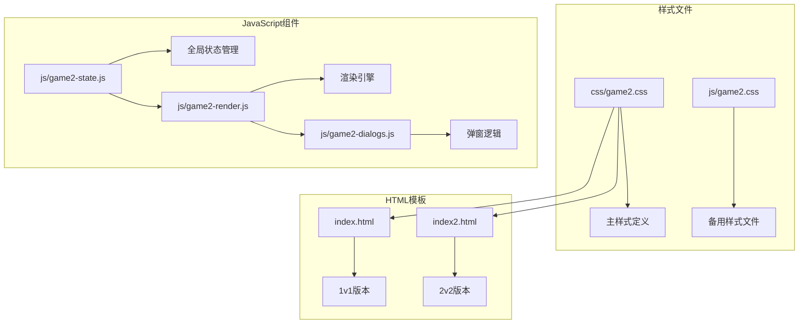

**图表来源**
- [css/game2.css:1-50](file://css/game2.css#L1-L50)
- [index2.html:7](file://index2.html#L7)

**章节来源**
- [css/game2.css:1-100](file://css/game2.css#L1-L100)
- [index2.html:1-50](file://index2.html#L1-L50)

## 核心组件

### 颜色方案系统

系统采用统一的颜色设计语言，建立了完整的色彩体系：

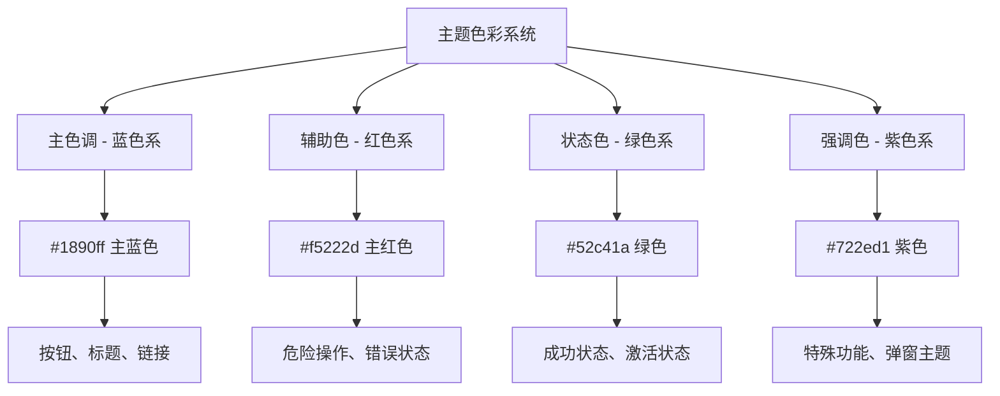

**图表来源**
- [css/game2.css:37-64](file://css/game2.css#L37-L64)

### 字体系统

系统采用渐进式字体缩放策略，确保在不同设备上的最佳显示效果：

| 字体级别 | 基础尺寸 | 缩放倍数 | 适用场景 |
|---------|---------|---------|----------|
| 标题1 | 20px | 1.0x | 页面主标题 |
| 标题2 | 15px | 0.75x | 设置面板标题 |
| 标题3 | 13px | 0.65x | 团队头部、标签 |
| 正文 | 13px | 0.65x | 卡片内容、说明文字 |
| 手牌数字 | 24px | 1.2x | 手牌数值显示 |
| 强调文字 | 11px | 0.55x | 状态提示、小字说明 |

**章节来源**
- [css/game2.css:22-29](file://css/game2.css#L22-L29)
- [css/game2.css:61-68](file://css/game2.css#L61-L68)

### 间距规范

采用12px基准网格系统，确保界面元素的一致性和可预测性：

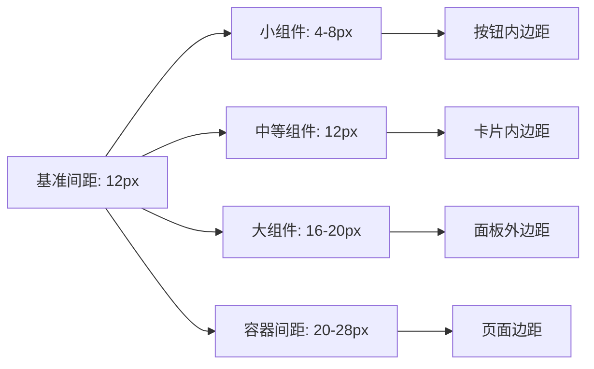

**图表来源**
- [css/game2.css:22-31](file://css/game2.css#L22-L31)

**章节来源**
- [css/game2.css:34-40](file://css/game2.css#L34-L40)

## 架构概览

### 响应式设计架构

系统采用"移动优先"的设计理念，通过灵活的布局系统适应不同屏幕尺寸：

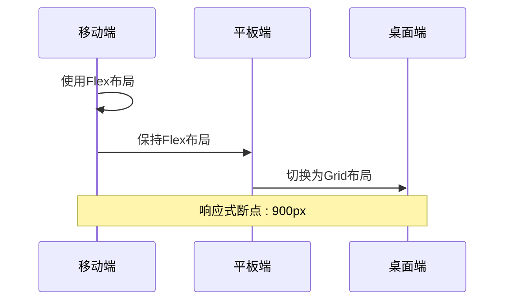

**图表来源**
- [css/game2.css:3](file://css/game2.css#L3)
- [css/game2.css:34](file://css/game2.css#L34)

### 弹性布局系统

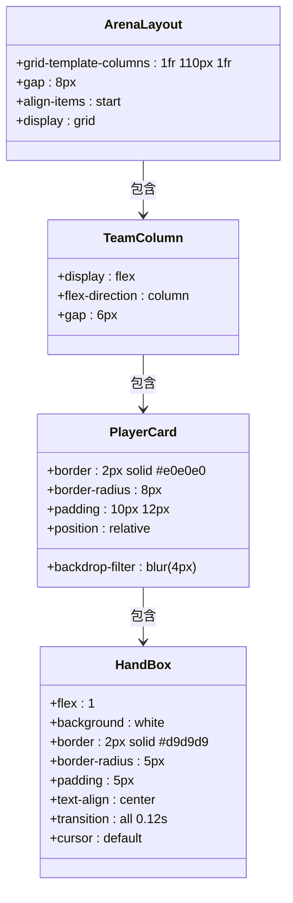

**图表来源**
- [css/game2.css:34-40](file://css/game2.css#L34-L40)
- [css/game2.css:69-80](file://css/game2.css#L69-L80)

**章节来源**
- [css/game2.css:33-80](file://css/game2.css#L33-L80)

## 详细组件分析

### 手牌样式系统

手牌系统采用"正方形锁定"设计，确保在不同设备上的视觉一致性：

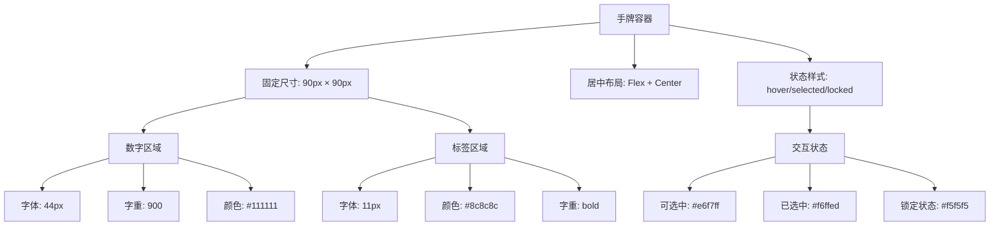

**图表来源**
- [css/game2.css:317-348](file://css/game2.css#L317-L348)

#### 手牌交互状态

| 状态 | 样式类 | 触发条件 | 视觉效果 |
|------|--------|----------|----------|
| 悬停 | `.hand-box2:hover` | 鼠标悬停 | 背景色变化 + 1.05倍缩放 |
| 选中 | `.hand-box2.selected-mine` | 点击选中 | 绿色边框 + 1.07倍缩放 |
| 锁定 | `.hand-box2.locked` | 无法选择 | 低透明度 + 禁用光标 |
| 死亡倒计时 | `.hand-box2.death-clock` | 生命值归零 | 红色边框背景 |

**章节来源**
- [css/game2.css:70-80](file://css/game2.css#L70-L80)

### 角色卡片系统

角色卡片采用"内外分层"设计，提供丰富的视觉层次：

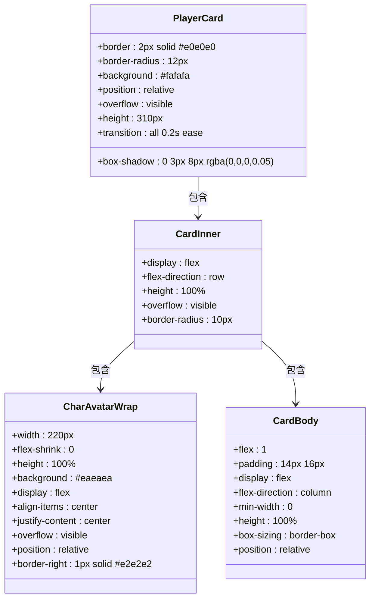

**图表来源**
- [css/game2.css:194-266](file://css/game2.css#L194-L266)

#### 卡片状态系统

| 状态 | 样式类 | 触发条件 | 视觉效果 |
|------|--------|----------|----------|
| 活跃 | `.player-card2.active` | 当前回合行动 | 绿色边框 + 绿色阴影 |
| 死亡 | `.player-card2.dead` | 生命值 ≤ 0 | 低透明度 + 灰色背景 |
| 行动中标签 | `::before`伪元素 | 活跃状态 | 绿色"👉 行动中"标签 |

**章节来源**
- [css/game2.css:42-52](file://css/game2.css#L42-L52)
- [css/game2.css:361-375](file://css/game2.css#L361-L375)

### 弹窗系统

弹窗系统采用统一的遮罩层设计，提供一致的用户体验：

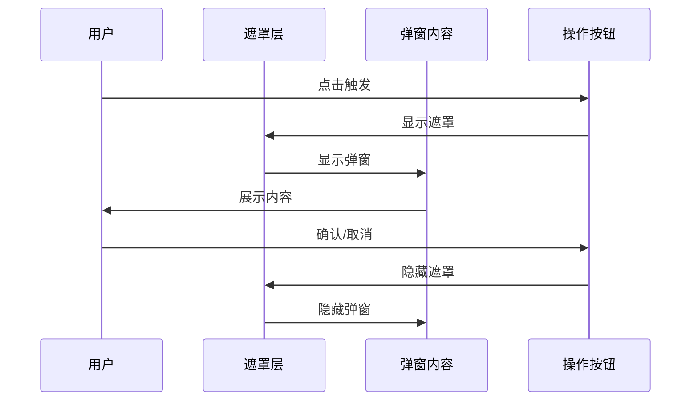

**图表来源**
- [css/game2.css:102-110](file://css/game2.css#L102-L110)

#### 弹窗变体

| 弹窗类型 | 主题色 | 容器类 | 特殊功能 |
|----------|--------|--------|----------|
| 帮抗弹窗 | 红色系 | `.overlay` | 倒计时 + 确认机制 |
| 孙悟空目标选择 | 紫色系 | `.overlay` | 目标列表 + 选择确认 |
| 蛋糕释放 | 粉色系 | `.overlay` | 组数调节 + 目标选择 |
| 帮助抗伤 | 粉色系 | `#helpTankDialog` | 伤害计算 + 帮抗确认 |

**章节来源**
- [css/game2.css:101-114](file://css/game2.css#L101-L114)
- [js/game2-dialogs.js:6-88](file://js/game2-dialogs.js#L6-L88)

### 状态指示器系统

系统提供多层次的状态反馈机制：

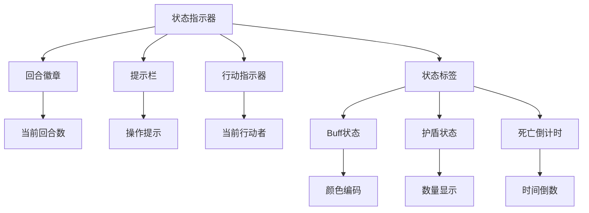

**图表来源**
- [css/game2.css:89](file://css/game2.css#L89)
- [css/game2.css:361-375](file://css/game2.css#L361-L375)

**章节来源**
- [css/game2.css:88-90](file://css/game2.css#L88-L90)
- [css/game2.css:64-68](file://css/game2.css#L64-L68)

## 依赖关系分析

### 样式依赖图

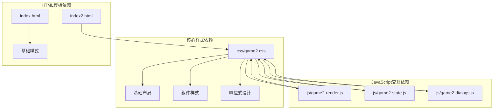

**图表来源**
- [index2.html:7](file://index2.html#L7)
- [js/game2-render.js:35-51](file://js/game2-render.js#L35-L51)

### 组件耦合分析

系统采用松耦合设计，各组件间通过CSS类名和JavaScript事件进行通信：

| 组件 | 依赖关系 | 解耦方式 |
|------|----------|----------|
| 角色卡片 | 手牌系统 | 通过CSS类名关联 |
| 手牌系统 | 渲染引擎 | 通过数据绑定更新 |
| 弹窗系统 | 全局状态 | 通过事件驱动显示 |
| 状态指示器 | 游戏逻辑 | 通过回调函数更新 |

**章节来源**
- [js/game2-render.js:67-140](file://js/game2-render.js#L67-L140)
- [js/game2-state.js:5-21](file://js/game2-state.js#L5-L21)

## 性能考虑

### 渲染优化策略

系统采用了多项性能优化技术：

1. **requestAnimationFrame批处理**：所有DOM更新通过rAF进行批处理，避免重复渲染
2. **CSS过渡优化**：使用transform和opacity属性进行动画，避免触发布局重排
3. **backdrop-filter缓存**：合理使用模糊效果，避免过度重绘
4. **Flexbox布局**：采用现代布局技术，减少JavaScript计算

### 内存管理

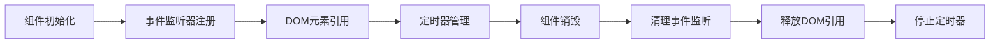

**图表来源**
- [js/game2-dialogs.js:40-48](file://js/game2-dialogs.js#L40-L48)

**章节来源**
- [js/game2-render.js:31-51](file://js/game2-render.js#L31-L51)

## 故障排除指南

### 常见问题及解决方案

| 问题类型 | 症状 | 可能原因 | 解决方案 |
|----------|------|----------|----------|
| 样式不生效 | 元素显示异常 | CSS优先级冲突 | 检查选择器特异性 |
| 响应式失效 | 移动端显示错乱 | 断点设置问题 | 验证媒体查询 |
| 动画卡顿 | 过渡效果不流畅 | GPU加速不足 | 检查transform属性 |
| 性能问题 | 页面滚动卡顿 | 过多DOM操作 | 使用rAF批处理 |

### 调试工具建议

1. **浏览器开发者工具**：检查CSS计算值和盒模型
2. **性能面板**：监控渲染性能和内存使用
3. **网络面板**：验证CSS文件加载情况
4. **响应式工具**：测试不同设备适配效果

**章节来源**
- [js/game2-dialogs.js:77-88](file://js/game2-dialogs.js#L77-L88)

## 结论

该CSS样式系统展现了现代前端开发的最佳实践，通过模块化设计、响应式架构和性能优化，为游戏界面提供了完整而优雅的视觉解决方案。系统的核心优势包括：

1. **统一的设计语言**：完整的色彩、字体和间距系统
2. **灵活的布局架构**：支持多种屏幕尺寸的自适应设计
3. **丰富的交互体验**：流畅的动画效果和状态反馈
4. **优秀的性能表现**：优化的渲染策略和内存管理

该系统为后续的功能扩展和定制化需求奠定了坚实的基础，是一个值得参考的CSS架构范例。