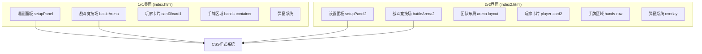
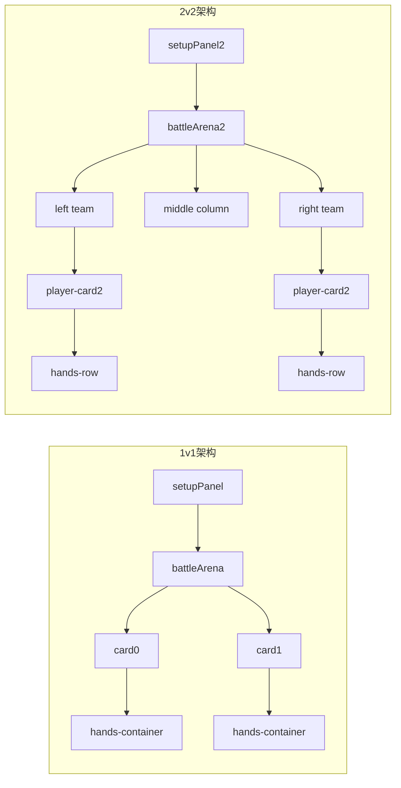
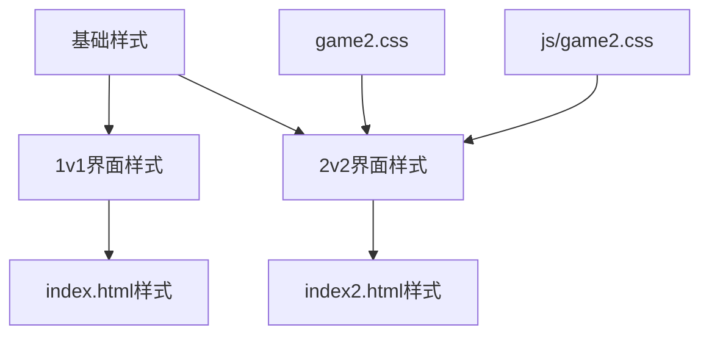
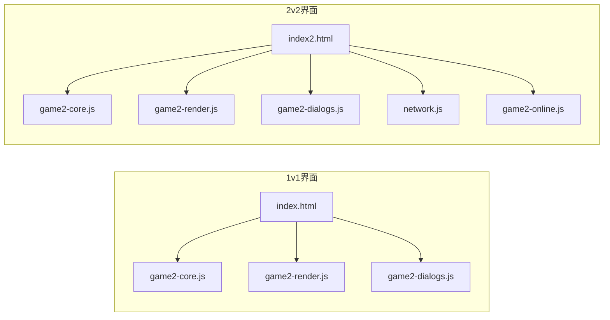

# HTML页面结构

<cite>
**本文档引用的文件**
- [index.html](file://index.html)
- [index2.html](file://index2.html)
- [game2.css](file://css/game2.css)
- [game2.css](file://js/game2.css)
- [game2-core.js](file://js/game2-core.js)
- [game2-render.js](file://js/game2-render.js)
- [game2-dialogs.js](file://js/game2-dialogs.js)
- [network.js](file://network.js)
- [game2-online.js](file://js/game2-online.js)
</cite>

## 目录
1. [简介](#简介)
2. [项目结构](#项目结构)
3. [核心组件](#核心组件)
4. [架构概览](#架构概览)
5. [详细组件分析](#详细组件分析)
6. [依赖关系分析](#依赖关系分析)
7. [性能考虑](#性能考虑)
8. [故障排除指南](#故障排除指南)
9. [结论](#结论)

## 简介

本文档深入分析了HTML页面结构设计，重点比较1v1和2v2两种游戏界面的HTML结构差异。通过对DOM元素布局、ID命名规范、类名系统、游戏设置面板、战斗竞技场、玩家卡片、手牌区域等核心容器的设计思路进行详细解析，帮助开发者理解和扩展游戏界面。

## 项目结构

该项目包含两个主要的游戏界面文件：
- `index.html` - 1v1游戏界面
- `index2.html` - 2v2游戏界面

两个界面共享相似的CSS样式系统，但2v2界面具有更复杂的布局和功能。



**图表来源**
- [index.html:64-122](file://index.html#L64-L122)
- [index2.html:22-325](file://index2.html#L22-L325)

**章节来源**
- [index.html:1-482](file://index.html#L1-L482)
- [index2.html:1-988](file://index2.html#L1-L988)

## 核心组件

### 1v1界面核心组件

1v1界面采用简洁的双栏布局，包含以下核心组件：

- **设置面板** (`setupPanel`): 包含阵营选择和开始游戏按钮
- **战斗竞技场** (`battleArena`): 主要的游戏战斗区域
- **玩家卡片** (`card0`, `card1`): 每个玩家的完整信息展示
- **手牌区域** (`hands-container`): 玩家的左右手显示
- **提示栏** (`hintBar`): 实时游戏提示信息

### 2v2界面核心组件

2v2界面采用复杂的三列网格布局，包含以下核心组件：

- **设置面板** (`setupPanel2`): 支持四人对战和联机功能
- **战斗竞技场** (`battleArena2`): 采用CSS Grid布局的大型战斗区域
- **团队布局** (`arena-layout`): 三列布局（左队HERO - 中间 - 右队REBEL）
- **玩家卡片** (`player-card2`): 每个玩家的详细信息卡片
- **手牌区域** (`hands-row`): 每个玩家的左右手显示
- **弹窗系统** (`overlay`): 全屏遮罩式弹窗

**章节来源**
- [index.html:64-122](file://index.html#L64-L122)
- [index2.html:170-325](file://index2.html#L170-L325)

## 架构概览

两个界面都遵循相同的架构模式，但在复杂度和功能上存在显著差异。



**图表来源**
- [index.html:78-122](file://index.html#L78-L122)
- [index2.html:170-318](file://index2.html#L170-L318)

## 详细组件分析

### ID命名规范分析

#### 1v1界面ID命名规范
- **玩家标识**: `card0`, `card1` (玩家卡片)
- **玩家属性**: `name0`, `camp0`, `hp0` (玩家姓名、阵营、血量)
- **手牌标识**: `h0_0`, `h0_1`, `h1_0`, `h1_1` (格式: 玩家索引_手索引)
- **手牌容器**: `h0_0_box`, `h0_1_box`, `h1_0_box`, `h1_1_box`
- **特殊状态**: `dt0_0`, `dt0_1`, `dt1_0`, `dt1_1` (死亡倒计时)

#### 2v2界面ID命名规范
- **玩家标识**: `card2v_0`, `card2v_1`, `card2v_2`, `card2v_3`
- **玩家属性**: `name2v_0`, `hp2v_0`, `h2v_0_0`, `h2v_0_1`
- **手牌标识**: `h2v_0_0`, `h2v_0_1`, `h2v_1_0`, `h2v_1_1`
- **特殊状态**: `dt2v_0_0`, `dt2v_0_1`, `dt2v_1_0`, `dt2v_1_1`
- **自定义显示**: `custom2v_0`, `custom2v_1`, `custom2v_2`, `custom2v_3`

### 类名系统分析

#### 1v1界面类名系统
- **通用类**: `player-card`, `hand-box`, `hands-container`
- **状态类**: `active`, `clickable-mine`, `clickable-enemy`, `selected-mine`, `locked`
- **特殊状态**: `death-clock`
- **阵营类**: `camp-HERO`, `camp-REBEL`

#### 2v2界面类名系统
- **通用类**: `player-card2`, `hand-box2`, `hands-row`, `arena-layout`
- **状态类**: `active`, `clickable-mine`, `clickable-enemy`, `selected-mine`, `locked`, `dead`
- **特殊状态**: `death-clock`, `custom-display2`, `custom-actions2`
- **阵营类**: `team-header.hero`, `team-header.rebel`
- **弹窗类**: `overlay`, `dialog-box`

### 游戏设置面板设计

#### 1v1设置面板
```html
<div class="setup-panel" id="setupPanel">
    <div>
        <label><b>阵营 A (HERO)：</b></label>
        <select id="heroSelect"></select>
    </div>
    <button id="startBtn">⚔️ 激活角色·开始游戏</button>
    <div>
        <label><b>阵营 B (REBEL)：</b></label>
        <select id="rebelSelect"></select>
    </div>
</div>
```

#### 2v2设置面板
```html
<div id="setupPanel2">
    <!-- 模式选择 -->
    <div id="modePanel">
        <button class="mode-btn active" id="btnLocal">👥 本地对战</button>
        <button class="mode-btn" id="btnOnline">🌐 联机对战</button>
    </div>
    <!-- 联机面板 -->
    <div id="onlinePanel" style="display:none">
        <div style="display:flex;align-items:center;gap:8px;flex-wrap:wrap">
            <input id="playerName" placeholder="你的昵称（必填）" maxlength="12">
            <button class="online-btn" onclick="onlineCreate()">🏠 创建房间</button>
            <span style="color:#999">或</span>
            <input id="roomCodeInput" placeholder="输入房间码" maxlength="5" style="width:130px;text-transform:uppercase">
            <button class="online-btn" onclick="onlineJoin()">🚪 加入房间</button>
        </div>
    </div>
    <!-- 角色选择 -->
    <div class="setup-teams">
        <div class="setup-team">
            <b style="color:#1890ff">🔵 HERO 队（1号、3号）</b>
            <div id="heroTankWho" style="display:none" class="tank-who">
                <span>坦克：</span>
                <label><input type="radio" name="heroTank" value="0" checked> 1号位</label>
                <label><input type="radio" name="heroTank" value="2"> 3号位</label>
            </div>
            <label>1号位</label>
            <div class="char-row"><select id="heroSelect1"></select></div>
            <label>3号位</label>
            <div class="char-row"><select id="heroSelect3"></select></div>
        </div>
        <div class="setup-team rebel">
            <b style="color:#f5222d">🔴 REBEL 队（2号、4号）</b>
            <div id="rebelTankWho" style="display:none" class="tank-who">
                <span>坦克：</span>
                <label><input type="radio" name="rebelTank" value="1" checked> 2号位</label>
                <label><input type="radio" name="rebelTank" value="3"> 4号位</label>
            </div>
            <label>2号位</label>
            <div class="char-row"><select id="rebelSelect2"></select></div>
            <label>4号位</label>
            <div class="char-row"><select id="rebelSelect4"></select></div>
        </div>
    </div>
</div>
```

### 战斗竞技场设计

#### 1v1竞技场
采用简单的双栏布局，每个玩家占据一侧：
- 左侧：玩家0的卡片和手牌
- 右侧：玩家1的卡片和手牌
- 中间：提示信息区域

#### 2v2竞技场
采用CSS Grid布局的复杂三列设计：
- **左侧列**: HERO队的两个玩家卡片
- **中间列**: 回合信息和提示栏
- **右侧列**: REBEL队的两个玩家卡片

```css
.arena-layout {
    display: grid;
    grid-template-columns: 1fr 110px 1fr;
    gap: 8px;
    align-items: start;
}
```

### 玩家卡片结构

#### 1v1玩家卡片
```html
<div class="player-card" id="card0">
    <div class="player-name" id="name0">-</div>
    <div class="player-camp camp-HERO" id="camp0">HERO</div>
    <div class="hp-bar">HP: <span id="hp0">350</span></div>
    <div class="hands-container">
        <div class="hand-box" id="h0_0_box" onclick="onHandClick(0,0)">
            <div>左手 (0)</div>
            <div class="hand-value" id="h0_0">1</div>
            <div class="death-turns" id="dt0_0"></div>
        </div>
        <div class="hand-box" id="h0_1_box" onclick="onHandClick(0,1)">
            <div>右手 (1)</div>
            <div class="hand-value" id="h0_1">1</div>
            <div class="death-turns" id="dt0_1"></div>
        </div>
    </div>
</div>
```

#### 2v2玩家卡片
```html
<div class="player-card2" id="card2v_0">
    <button class="tank-btn" id="tankBtn0">🛡 抗伤</button>
    <div class="card-inner">
        <div class="char-avatar-wrap">
            
            <div class="char-avatar-placeholder" id="avatar_ph_0">👤</div>
        </div>
        <div class="card-body">
            <div class="card-top">
                <div class="player-name2" id="name2v_0">-</div>
            </div>
            <div class="hp-bar2">HP: <span id="hp2v_0">-</span></div>
            <div class="hands-row">
                <div class="hand-box2" id="h2v_0_0_box">
                    <div class="hand-label">左手</div>
                    <div class="hand-val" id="h2v_0_0">1</div>
                    <div class="death-turns2" id="dt2v_0_0"></div>
                </div>
                <div class="hand-box2" id="h2v_0_1_box">
                    <div class="hand-label">右手</div>
                    <div class="hand-val" id="h2v_0_1">1</div>
                    <div class="death-turns2" id="dt2v_0_1"></div>
                </div>
            </div>
            <div class="card-info">Buff: <span id="buffs2v_0">无</span></div>
            <div class="card-info">护盾: <span id="shields2v_0">无</span></div>
            <div class="custom-display2" id="custom2v_0"></div>
            <div class="custom-actions2" id="actions2v_0"></div>
        </div>
    </div>
</div>
```

### 手牌区域设计

#### 1v1手牌区域
- 使用`hands-container`容器
- 每个手牌使用`hand-box`类
- 支持点击事件绑定
- 包含手牌值和死亡倒计时

#### 2v2手牌区域
- 使用`hands-row`容器
- 每个手牌使用`hand-box2`类
- 更大的手牌尺寸（90px正方形）
- 支持更丰富的状态指示
- 包含手牌标签和死亡倒计时

### 弹窗系统实现

#### 1v1弹窗系统
- **蛋糕弹窗**: 固定在页面中的弹窗
- **大乔抢夺弹窗**: 动态插入到大乔卡片下方
- 使用内联样式和JavaScript动态控制

#### 2v2弹窗系统
- **通用遮罩**: 使用`overlay`类的全屏遮罩
- **对话框**: 使用`dialog-box`类的标准对话框
- **多种弹窗类型**: 帮抗弹窗、孙悟空选目标弹窗、蛋糕弹窗等

```html
<!-- 通用弹窗结构 -->
<div class="overlay" id="helpTankDialog">
    <div class="dialog-box" style="max-width:380px">
        <h3 style="color:#cf1322">🛡️ 队友濒死！是否帮抗？</h3>
        <div id="helpTankMsg" style="font-size:13px;color:#444;line-height:1.6;margin-bottom:8px;"></div>
        <div id="helpTankCountdown" style="font-size:28px;font-weight:bold;color:#ff4d4f;text-align:center;margin:8px 0">10</div>
        <div style="display:flex;gap:10px;justify-content:center;margin-top:12px">
            <button onclick="onHelpTankConfirm()" style="background:#52c41a;color:white;padding:8px 22px;font-size:13px;font-weight:bold;border:none;border-radius:5px;cursor:pointer">✅ 帮抗！</button>
            <button onclick="onHelpTankCancel()" style="background:#ff4d4f;color:white;padding:8px 22px;font-size:13px;font-weight:bold;border:none;border-radius:5px;cursor:pointer">❌ 放弃</button>
        </div>
    </div>
</div>
```

### 事件绑定策略

#### 1v1界面事件绑定
- **内联事件处理器**: 在HTML中直接绑定`onclick`事件
- **全局事件监听器**: 使用`DOMContentLoaded`事件
- **状态机管理**: JavaScript实现两步点击状态机

#### 2v2界面事件绑定
- **分离的事件处理**: 通过独立的JavaScript文件管理事件
- **联机支持**: 网络事件处理和同步
- **AI集成**: AI行动的事件绑定和处理

```javascript
// 1v1事件绑定示例
function onHandClick(playerIdx, handIdx) {
    // 事件处理逻辑
}

// 2v2事件绑定示例
function onHandClick2(playerIdx, handIdx) {
    // 事件处理逻辑
}
```

## 依赖关系分析

### CSS样式依赖

两个界面共享相似的CSS架构，但2v2界面具有更复杂的样式系统：



**图表来源**
- [game2.css:1-439](file://css/game2.css#L1-L439)
- [game2.css:1-418](file://js/game2.css#L1-L418)

### JavaScript模块依赖



**图表来源**
- [index.html:171-479](file://index.html#L171-L479)
- [index2.html:435-784](file://index2.html#L435-L784)

**章节来源**
- [game2-core.js:1-223](file://js/game2-core.js#L1-L223)
- [game2-render.js:1-304](file://js/game2-render.js#L1-L304)
- [game2-dialogs.js:1-372](file://js/game2-dialogs.js#L1-L372)

## 性能考虑

### DOM操作优化

1. **批量更新**: 使用requestAnimationFrame进行批量DOM更新
2. **状态缓存**: 缓存DOM查询结果，避免重复查找
3. **样式更新**: 使用类名切换而非内联样式修改

### 渲染性能

1. **虚拟DOM**: 通过状态机管理减少不必要的DOM重绘
2. **事件委托**: 合理使用事件委托减少事件监听器数量
3. **懒加载**: 图片资源的懒加载和错误处理

## 故障排除指南

### 常见问题及解决方案

#### 1. 弹窗无法显示
- 检查CSS类名是否正确
- 确认JavaScript函数是否正确调用
- 验证DOM元素是否存在

#### 2. 手牌点击无响应
- 检查事件绑定是否正确
- 验证状态机逻辑
- 确认CSS样式是否影响点击区域

#### 3. 联机功能异常
- 检查WebSocket连接状态
- 验证消息序列化和反序列化
- 确认房间状态同步

**章节来源**
- [network.js:1-113](file://network.js#L1-L113)
- [game2-online.js:1-169](file://js/game2-online.js#L1-L169)

## 结论

通过对1v1和2v2两种游戏界面的深入分析，可以看出：

1. **设计演进**: 2v2界面相比1v1界面在复杂度和功能上都有显著提升
2. **架构一致性**: 两个界面都遵循相似的架构模式，便于维护和扩展
3. **模块化设计**: 清晰的模块划分使得代码易于理解和修改
4. **性能优化**: 通过合理的事件处理和DOM操作优化提升了用户体验

这种设计为后续的功能扩展和新游戏模式的添加提供了良好的基础架构。