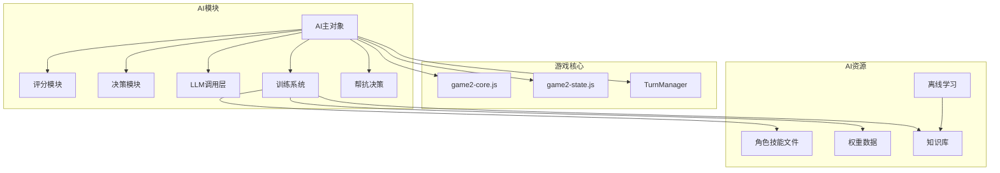
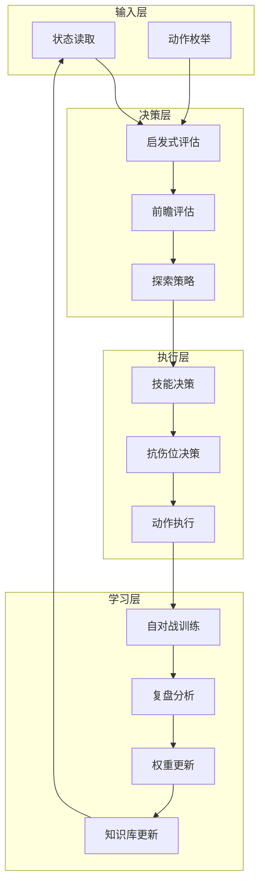
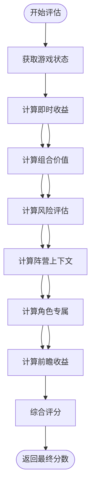
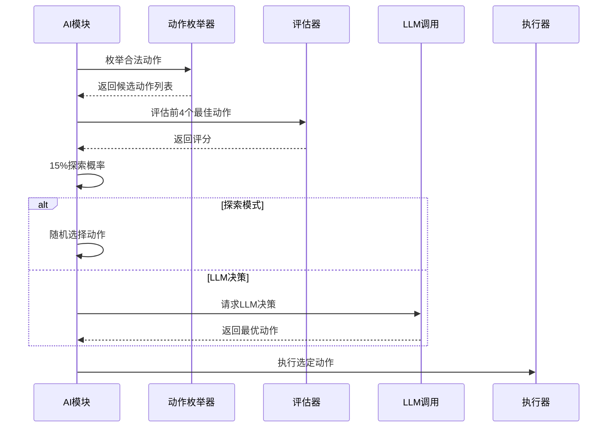
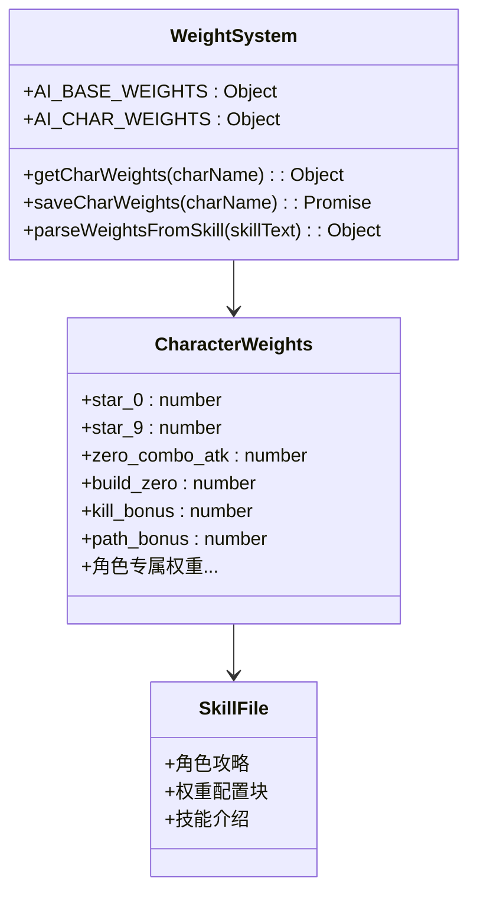
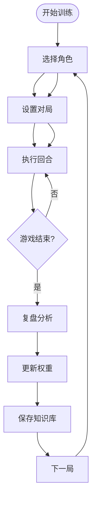
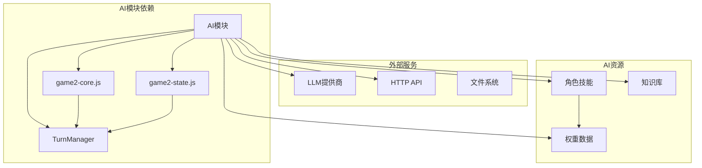

# AI智能模块 (game2-ai.js)

<cite>
**本文档引用的文件**
- [game2-ai.js](file://js/game2-ai.js)
- [game2-core.js](file://js/game2-core.js)
- [game2-state.js](file://js/game2-state.js)
- [preTrain.js](file://ai/preTrain.js)
- [weights.json](file://ai/weights.json)
- [tune_weights.py](file://tune_weights.py)
- [knowledge.md](file://ai/knowledge.md)
- [大乔.md](file://ai/skills/大乔.md)
- [小乔.md](file://ai/skills/小乔.md)
- [张飞.md](file://ai/skills/张飞.md)
- [阴阳师.md](file://ai/skills/阴阳师.md)
</cite>

## 目录
1. [简介](#简介)
2. [项目结构](#项目结构)
3. [核心组件](#核心组件)
4. [架构概览](#架构概览)
5. [详细组件分析](#详细组件分析)
6. [依赖关系分析](#依赖关系分析)
7. [性能考量](#性能考量)
8. [故障排除指南](#故障排除指南)
9. [结论](#结论)
10. [附录](#附录)

## 简介

AI智能模块是指尖博弈游戏的核心决策引擎，采用混合AI架构，结合启发式评估函数、深度搜索策略和大型语言模型（LLM）推理能力。该模块实现了完整的AI决策流水线，包括状态读取、合法动作枚举、启发式打分、搜索策略、LLM决策融合以及自学习训练系统。

模块特点：
- **权重驱动的启发式评估**：基于角色专属权重的评分系统
- **多层搜索策略**：包含即时评估和前瞻评估
- **LLM决策融合**：15%探索概率的随机探索与95%的LLM决策
- **自学习训练系统**：支持自对战训练和离线学习
- **动态权重调整**：基于对局结果的自适应学习

## 项目结构

AI模块位于js目录下的game2-ai.js文件中，与游戏核心系统紧密集成：

**图表来源**
- [game2-ai.js:75-125](file://js/game2-ai.js#L75-L125)
- [game2-core.js:1-223](file://js/game2-core.js#L1-L223)
- [game2-state.js:5-242](file://js/game2-state.js#L5-L242)

**章节来源**
- [game2-ai.js:1-100](file://js/game2-ai.js#L1-L100)
- [game2-core.js:1-50](file://js/game2-core.js#L1-L50)
- [game2-state.js:1-30](file://js/game2-state.js#L1-L30)

## 核心组件

### AI主对象
AI主对象是整个AI系统的入口点，负责初始化、状态管理和核心决策流程。

**关键功能**：
- AI启动/停止控制
- 角色控制管理
- Provider配置管理
- 知识库缓存管理

### 评分模块 (AI.score)
实现基于权重的启发式评估函数，包含即时评估和前瞻评估两部分。

**评估维度**：
- 组合价值评估（双子星、0组合、6组合）
- 角色专属策略
- 阵营上下文动态调整
- 前瞻性伤害估算

### 决策模块 (AI.decide)
处理角色主动技能使用和抗伤位选择。

**技能决策**：
- 鸦眼：灼燃箭、魔王剑、乌鸦诅咒
- 张飞：模态切换策略
- 阴阳师：模态切换规则
- 藏师：蛋糕使用策略
- 大乔：进化时机判断

### LLM调用层 (AI.llm)
集成多种AI提供商，实现决策融合。

**支持的提供商**：
- MiniMax（蓝色）
- DeepSeek（绿色）
- QianFan（橙色）

### 训练系统 (AI.train)
完整的自学习训练框架，支持自对战和离线学习。

**训练流程**：
- 随机角色选择
- 自对战对局
- 复盘分析
- 权重更新
- 知识库增强

**章节来源**
- [game2-ai.js:75-102](file://js/game2-ai.js#L75-L102)
- [game2-ai.js:292-470](file://js/game2-ai.js#L292-L470)
- [game2-ai.js:475-575](file://js/game2-ai.js#L475-L575)
- [game2-ai.js:640-690](file://js/game2-ai.js#L640-L690)
- [game2-ai.js:707-812](file://js/game2-ai.js#L707-L812)

## 架构概览

AI模块采用分层架构设计，确保各个组件的职责清晰分离：

**图表来源**
- [game2-ai.js:180-246](file://js/game2-ai.js#L180-L246)
- [game2-ai.js:786-805](file://js/game2-ai.js#L786-L805)

## 详细组件分析

### 启发式评估算法

AI采用多维度的启发式评估函数，结合即时收益和前瞻性收益：

**图表来源**
- [game2-ai.js:294-406](file://js/game2-ai.js#L294-L406)
- [game2-ai.js:408-470](file://js/game2-ai.js#L408-L470)

**评估函数复杂度分析**：
- 时间复杂度：O(A × C)，其中A为合法动作数量，C为评估维度数
- 空间复杂度：O(A)，存储候选动作及其分数

**章节来源**
- [game2-ai.js:294-470](file://js/game2-ai.js#L294-L470)

### 搜索策略实现

AI采用混合搜索策略，结合确定性搜索和随机探索：

**图表来源**
- [game2-ai.js:204-246](file://js/game2-ai.js#L204-L246)
- [game2-ai.js:223-239](file://js/game2-ai.js#L223-L239)

**搜索策略特性**：
- Top-4动作评估，平衡性能与质量
- 15%探索概率确保策略多样性
- LLM决策提供更强的推理能力

**章节来源**
- [game2-ai.js:195-246](file://js/game2-ai.js#L195-L246)

### 权重系统设计

AI采用角色专属权重系统，每个角色都有独立的权重配置：

**图表来源**
- [game2-ai.js:42-70](file://js/game2-ai.js#L42-L70)
- [game2-ai.js:162-175](file://js/game2-ai.js#L162-L175)

**权重系统特性**：
- 基础权重兜底机制
- 角色专属权重覆盖
- 热更新支持
- JSON配置格式

**章节来源**
- [game2-ai.js:42-70](file://js/game2-ai.js#L42-L70)
- [game2-ai.js:129-175](file://js/game2-ai.js#L129-L175)

### 训练系统架构

AI训练系统支持完全自动化的自对战训练：

**图表来源**
- [game2-ai.js:786-805](file://js/game2-ai.js#L786-L805)
- [game2-ai.js:892-1003](file://js/game2-ai.js#L892-L1003)

**训练系统特性**：
- 自动角色选择和阵容平衡
- 完全自动化的对战流程
- 智能复盘和权重更新
- 知识库持续增强

**章节来源**
- [game2-ai.js:786-1003](file://js/game2-ai.js#L786-L1003)

## 依赖关系分析

AI模块与游戏核心系统存在紧密的依赖关系：

**图表来源**
- [game2-ai.js:180-246](file://js/game2-ai.js#L180-L246)
- [game2-core.js:69-107](file://js/game2-core.js#L69-L107)
- [game2-state.js:116-162](file://js/game2-state.js#L116-L162)

**依赖关系分析**：
- **强耦合**：AI直接依赖TurnManager和全局状态
- **弱耦合**：通过HTTP API与外部服务交互
- **数据耦合**：权重系统与角色技能文件绑定

**章节来源**
- [game2-ai.js:180-246](file://js/game2-ai.js#L180-L246)
- [game2-core.js:69-107](file://js/game2-core.js#L69-L107)
- [game2-state.js:116-162](file://js/game2-state.js#L116-L162)

## 性能考量

### 时间复杂度优化

AI模块在性能方面采用了多项优化策略：

1. **动作枚举剪枝**：跳过无效目标和死亡玩家
2. **评分缓存**：角色技能文档的内存缓存
3. **异步处理**：LLM调用和文件I/O的异步化
4. **批量操作**：权重和知识库的批量保存

### 内存管理

- **缓存策略**：技能文档和权重的LRU缓存
- **垃圾回收**：及时清理临时对象和Promise
- **状态管理**：最小化全局状态污染

### 并发控制

- **思考锁定**：防止并发的AI思考过程
- **网络请求限制**：避免过度的API调用
- **UI更新节流**：减少频繁的DOM操作

## 故障排除指南

### 常见问题诊断

**AI不响应问题**：
1. 检查AI.enabled标志位
2. 验证当前玩家是否为AI控制
3. 确认TurnManager状态正常

**LLM调用失败**：
1. 检查网络连接
2. 验证API密钥配置
3. 查看超时设置

**权重更新失败**：
1. 检查文件权限
2. 验证JSON格式正确性
3. 确认服务器端API可用

### 调试技巧

1. **启用详细日志**：监控AI决策过程
2. **性能分析**：使用浏览器开发者工具
3. **状态检查**：定期验证游戏状态一致性

**章节来源**
- [game2-ai.js:180-125](file://js/game2-ai.js#L180-L125)
- [game2-ai.js:642-690](file://js/game2-ai.js#L642-L690)

## 结论

AI智能模块展现了现代游戏AI系统的最佳实践，成功地将传统的启发式方法与现代的大语言模型技术相结合。模块具有以下优势：

1. **模块化设计**：清晰的组件分离便于维护和扩展
2. **自适应学习**：支持在线和离线学习，持续优化性能
3. **可解释性**：基于权重的决策过程相对透明
4. **可扩展性**：支持新的角色和策略添加

未来改进方向：
- 增强机器学习算法集成
- 优化性能和响应速度
- 扩展多模态输入处理
- 增强对抗性训练机制

## 附录

### AI模块扩展指南

#### 实现新的AI策略

1. **添加权重配置**：在角色技能文件中添加新的权重项
2. **实现评估逻辑**：在AI.score模块中添加相应的评估函数
3. **集成决策逻辑**：在AI.decide模块中添加策略决策
4. **测试验证**：编写单元测试和集成测试

#### 调整评估参数

1. **权重微调**：使用tune_weights.py工具进行参数优化
2. **离线学习**：运行preTrain.js脚本进行经验提炼
3. **A/B测试**：对比不同参数组合的效果
4. **性能监控**：跟踪参数调整对性能的影响

#### 集成机器学习算法

1. **模型训练**：使用历史对局数据训练ML模型
2. **API集成**：通过HTTP API调用ML服务
3. **特征工程**：设计合适的输入特征
4. **模型部署**：确保模型的可靠性和性能

#### AI性能优化技巧

1. **算法优化**：减少不必要的计算和内存分配
2. **缓存策略**：合理使用缓存提高响应速度
3. **并发处理**：利用异步编程提升吞吐量
4. **资源管理**：优化CPU和内存使用效率

**章节来源**
- [tune_weights.py:1-292](file://tune_weights.py#L1-L292)
- [preTrain.js:1-180](file://ai/preTrain.js#L1-L180)