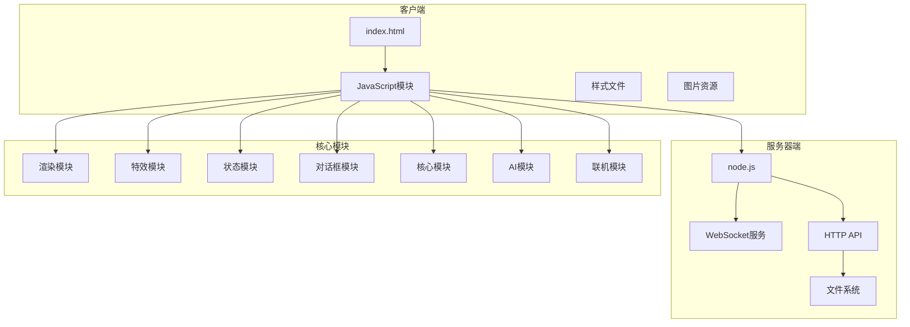
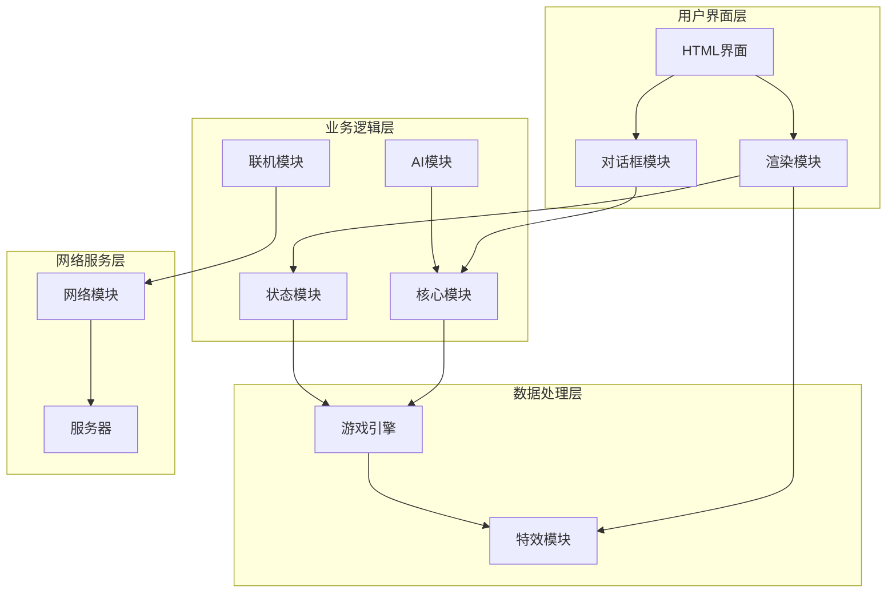
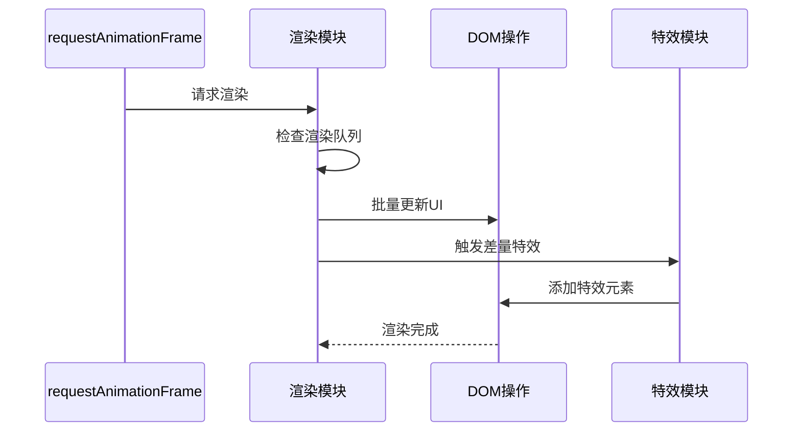
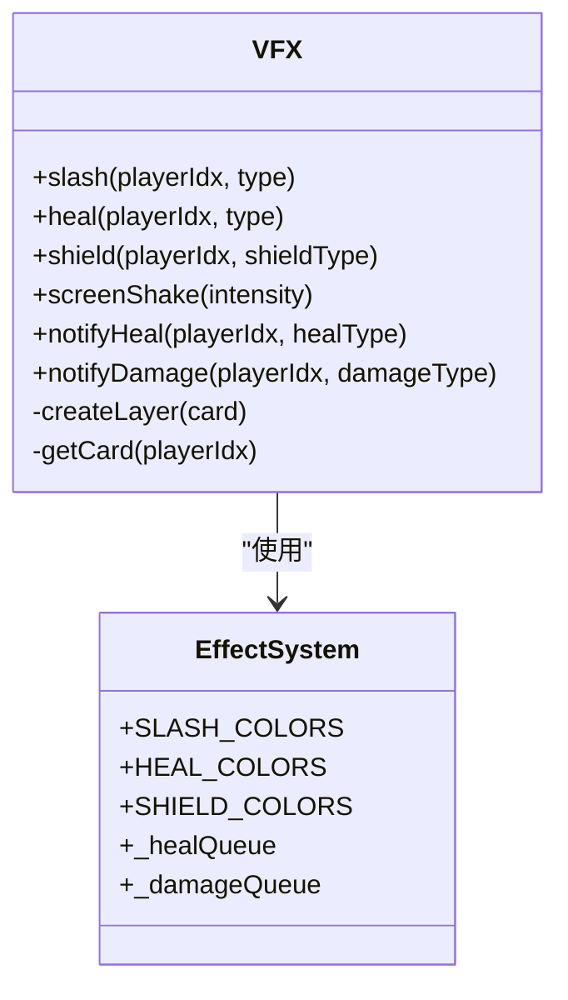
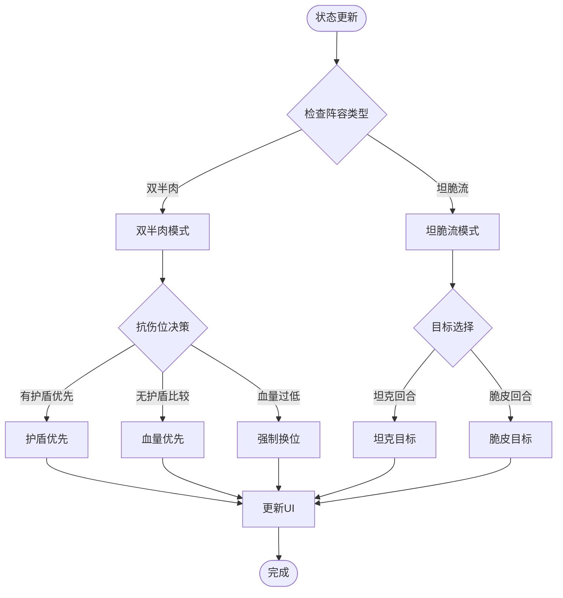
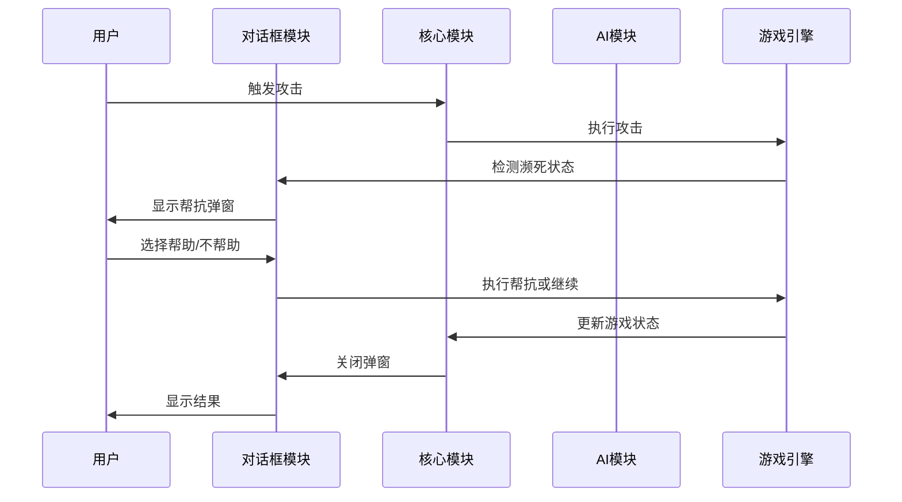
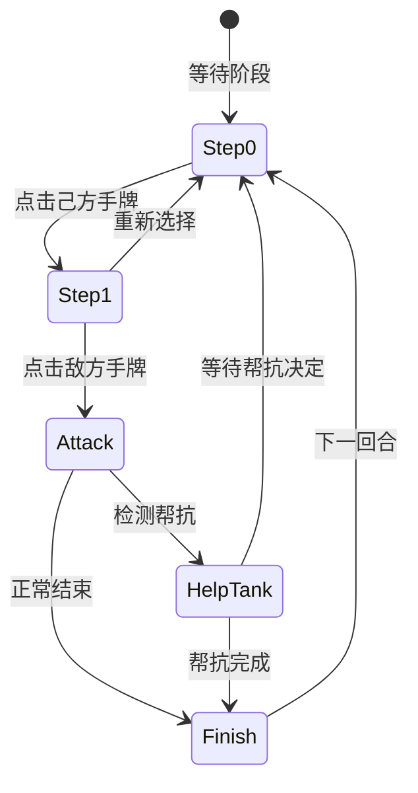
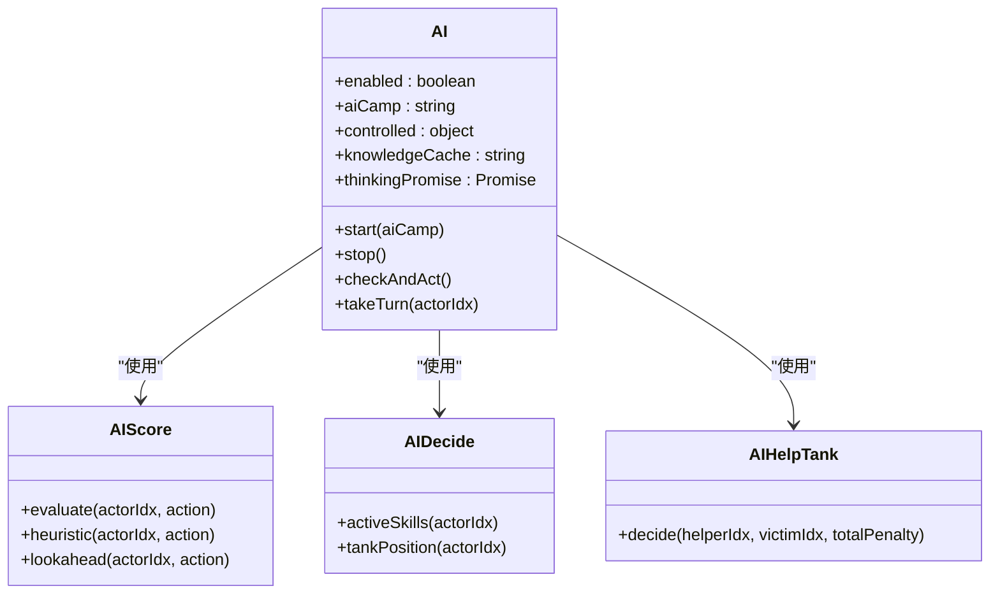
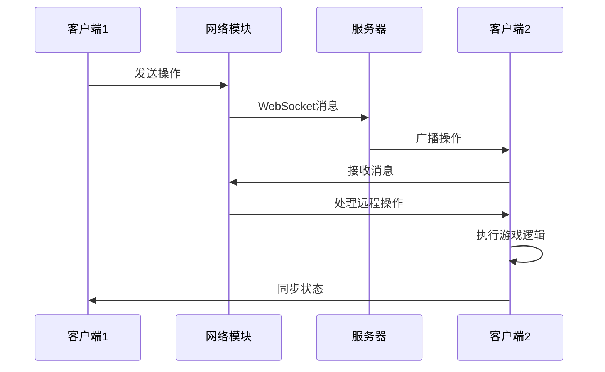
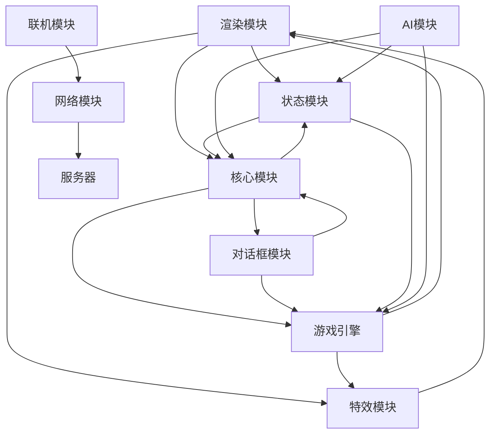

# JavaScript模块架构

<cite>
**本文档引用的文件**
- [game2-render.js](file://js/game2-render.js)
- [game2-vfx.js](file://js/game2-vfx.js)
- [game2-state.js](file://js/game2-state.js)
- [game2-dialogs.js](file://js/game2-dialogs.js)
- [game2-core.js](file://js/game2-core.js)
- [game2-ai.js](file://js/game2-ai.js)
- [game2-online.js](file://js/game2-online.js)
- [network.js](file://network.js)
- [server.js](file://js/server.js)
- [main.js](file://main.js)
- [index.html](file://index.html)
- [package.json](file://package.json)
</cite>

## 目录
1. [简介](#简介)
2. [项目结构](#项目结构)
3. [核心模块](#核心模块)
4. [架构概览](#架构概览)
5. [详细组件分析](#详细组件分析)
6. [依赖分析](#依赖分析)
7. [性能考虑](#性能考虑)
8. [故障排除指南](#故障排除指南)
9. [结论](#结论)

## 简介

这是一个基于JavaScript的多英雄对战游戏项目，采用模块化架构设计。项目实现了完整的回合制战斗系统，包含六个核心模块：渲染模块、特效模块、状态模块、对话框模块、核心模块和AI模块。系统支持单人游戏、多人联机和AI对战等多种模式。

## 项目结构

项目采用前后端分离的架构设计，主要分为客户端JavaScript模块和服务器端Node.js服务：

**图表来源**
- [index.html:1-482](file://index.html#L1-L482)
- [game2-render.js:1-304](file://js/game2-render.js#L1-L304)
- [server.js:1-344](file://js/server.js#L1-L344)

**章节来源**
- [index.html:1-482](file://index.html#L1-L482)
- [package.json:1-16](file://package.json#L1-L16)

## 核心模块

### 渲染模块 (game2-render.js)
负责游戏界面的实时更新和用户界面渲染。主要功能包括：
- 角色头像加载和显示
- 手牌状态的视觉反馈
- 实时血量、护盾、Buff显示
- 特效触发和视觉反馈
- 响应式UI更新机制

### 特效模块 (game2-vfx.js)
专门处理战斗中的视觉特效，提供沉浸式的战斗体验：
- 伤害斩击特效（物理、法术、真实伤害）
- 回复浮动特效
- 护盾出现动画
- 屏幕震动效果
- 基于SVG的矢量图形特效

### 状态模块 (game2-state.js)
管理游戏的核心状态数据和规则逻辑：
- 阵容配置和抗伤位管理
- 目标选择算法
- 快照和回滚机制
- 阵营转换和目标锁定
- 角色行为规则

### 对话框模块 (game2-dialogs.js)
处理各种用户交互弹窗和确认对话框：
- 帮抗确认弹窗
- 孙悟空目标选择弹窗
- 大乔抢夺弹窗
- 蛋糕使用弹窗
- 乌鸦诅咒阵营选择

### 核心模块 (game2-core.js)
实现游戏的核心逻辑和两步点击状态机：
- 攻击判定和执行
- 目标选择和验证
- 回合推进机制
- 帮抗检测和处理
- 错误处理和提示

### AI模块 (game2-ai.js)
提供智能决策和自动化对战功能：
- 启发式打分系统
- LLM集成和决策
- 自战训练系统
- 权重学习和优化
- 角色专属策略

**章节来源**
- [game2-render.js:1-304](file://js/game2-render.js#L1-L304)
- [game2-vfx.js:1-305](file://js/game2-vfx.js#L1-L305)
- [game2-state.js:1-242](file://js/game2-state.js#L1-L242)
- [game2-dialogs.js:1-372](file://js/game2-dialogs.js#L1-L372)
- [game2-core.js:1-223](file://js/game2-core.js#L1-L223)
- [game2-ai.js:1-1101](file://js/game2-ai.js#L1-L1101)

## 架构概览

系统采用模块化设计，各模块通过清晰的接口进行通信：

**图表来源**
- [game2-render.js:67-210](file://js/game2-render.js#L67-L210)
- [game2-core.js:69-107](file://js/game2-core.js#L69-L107)
- [game2-ai.js:180-246](file://js/game2-ai.js#L180-L246)
- [network.js:1-113](file://network.js#L1-L113)

## 详细组件分析

### 渲染模块详细分析

渲染模块采用批处理机制避免重复DOM操作：

**图表来源**
- [game2-render.js:35-51](file://js/game2-render.js#L35-L51)
- [game2-render.js:67-210](file://js/game2-render.js#L67-L210)

渲染模块的关键特性：
- **批量渲染**：使用requestAnimationFrame避免重复渲染
- **差量对比**：通过_vfxSnapshot记录状态变化
- **响应式更新**：根据游戏状态动态调整UI样式
- **头像管理**：动态加载和显示角色头像

**章节来源**
- [game2-render.js:1-304](file://js/game2-render.js#L1-L304)

### 特效模块详细分析

特效模块提供丰富的视觉反馈：

**图表来源**
- [game2-vfx.js:11-304](file://js/game2-vfx.js#L11-L304)

特效系统的核心功能：
- **伤害特效**：基于SVG的斩击线条动画
- **回复特效**：浮动加号粒子效果
- **护盾特效**：动态盾牌图标动画
- **屏幕特效**：震动和闪烁效果
- **队列管理**：避免多帧竞态冲突

**章节来源**
- [game2-vfx.js:1-305](file://js/game2-vfx.js#L1-L305)

### 状态模块详细分析

状态模块实现复杂的阵营和目标管理：

**图表来源**
- [game2-state.js:118-162](file://js/game2-state.js#L118-L162)
- [game2-state.js:577-652](file://js/game2-state.js#L577-L652)

状态管理的关键算法：
- **抗伤位切换**：基于护盾数量和血量比例
- **目标选择**：根据阵容类型和当前回合状态
- **快照机制**：支持游戏状态的保存和恢复
- **阵营转换**：动态调整目标选择策略

**章节来源**
- [game2-state.js:1-242](file://js/game2-state.js#L1-L242)

### 对话框模块详细分析

对话框模块处理复杂的用户交互场景：

**图表来源**
- [game2-core.js:114-163](file://js/game2-core.js#L114-L163)
- [game2-dialogs.js:6-88](file://js/game2-dialogs.js#L6-L88)

对话框系统的交互流程：
- **帮抗检测**：自动检测濒死状态并弹出确认
- **角色选择**：支持孙悟空等特殊角色的目标选择
- **大乔抢夺**：动态计算抢夺收益并提供确认
- **蛋糕使用**：支持多目标和多组使用的弹窗
- **乌鸦诅咒**：阵营选择的弹窗处理

**章节来源**
- [game2-dialogs.js:1-372](file://js/game2-dialogs.js#L1-L372)

### 核心模块详细分析

核心模块实现两步点击状态机和攻击逻辑：

**图表来源**
- [game2-core.js:5-66](file://js/game2-core.js#L5-L66)

核心逻辑的关键实现：
- **两步点击**：确保正确的攻击顺序
- **有效性验证**：检查手牌状态和角色限制
- **攻击执行**：调用游戏引擎处理战斗
- **回合管理**：自动推进和状态清理
- **错误处理**：友好的错误提示和状态恢复

**章节来源**
- [game2-core.js:1-223](file://js/game2-core.js#L1-L223)

### AI模块详细分析

AI模块提供完整的智能决策系统：

**图表来源**
- [game2-ai.js:75-85](file://js/game2-ai.js#L75-L85)
- [game2-ai.js:292-470](file://js/game2-ai.js#L292-L470)
- [game2-ai.js:475-617](file://js/game2-ai.js#L475-L617)

AI系统的核心能力：
- **启发式评分**：基于权重的打分系统
- **角色策略**：针对不同角色的专用策略
- **LLM集成**：支持多种AI提供商
- **自学习**：通过训练系统优化策略
- **实时决策**：在回合时间内做出最佳选择

**章节来源**
- [game2-ai.js:1-1101](file://js/game2-ai.js#L1-L1101)

### 联机模块详细分析

联机模块实现4-slot角色控制和消息同步：

**图表来源**
- [network.js:26-100](file://network.js#L26-L100)
- [server.js:300-319](file://js/server.js#L300-L319)

联机系统的设计特点：
- **4-slot控制**：每个角色独立的控制权管理
- **消息路由**：基于WebSocket的消息转发
- **状态同步**：房间状态和游戏状态的实时同步
- **断线处理**：自动接管离线玩家的角色
- **权限管理**：房主权限和角色配置

**章节来源**
- [game2-online.js:1-169](file://js/game2-online.js#L1-L169)
- [network.js:1-113](file://network.js#L1-L113)
- [server.js:217-344](file://js/server.js#L217-L344)

## 依赖分析

系统模块间的依赖关系：

**图表来源**
- [game2-render.js:67-210](file://js/game2-render.js#L67-L210)
- [game2-core.js:69-107](file://js/game2-core.js#L69-L107)
- [game2-ai.js:180-246](file://js/game2-ai.js#L180-L246)

模块耦合度分析：
- **低耦合设计**：各模块通过明确定义的接口交互
- **数据流向**：状态从引擎流向渲染，控制从用户输入流向核心
- **事件驱动**：通过回调和事件机制实现松散耦合
- **可测试性**：模块独立，便于单元测试和集成测试

**章节来源**
- [main.js:1-800](file://main.js#L1-L800)

## 性能考虑

系统在性能方面的优化策略：

### 渲染性能优化
- **批处理渲染**：使用requestAnimationFrame避免重复DOM操作
- **差量更新**：通过_vfxSnapshot减少不必要的UI更新
- **懒加载**：头像和特效按需加载，减少初始开销

### 内存管理
- **对象池**：特效和弹窗元素的复用机制
- **定时器清理**：及时清理定时器和事件监听器
- **状态清理**：回合结束时清理临时状态

### 网络性能
- **消息压缩**：WebSocket消息的最小化传输
- **广播优化**：房间级别的消息广播
- **连接复用**：单WebSocket连接承载多种消息类型

## 故障排除指南

### 常见问题诊断

**渲染问题**
- 检查_vfxSnapshot数组是否正确初始化
- 验证DOM元素是否存在且可访问
- 确认requestAnimationFrame回调是否正常执行

**AI决策异常**
- 检查权重系统是否正确加载
- 验证角色策略配置
- 确认LLM API调用是否成功

**联机同步问题**
- 检查WebSocket连接状态
- 验证消息序列化和反序列化
- 确认房间状态一致性

**章节来源**
- [game2-render.js:67-210](file://js/game2-render.js#L67-L210)
- [game2-ai.js:130-175](file://js/game2-ai.js#L130-L175)
- [network.js:13-36](file://network.js#L13-L36)

## 结论

该项目展现了优秀的JavaScript模块化架构设计，六个核心模块各司其职，通过清晰的接口实现松耦合的协作关系。系统具有以下优势：

1. **模块化设计**：每个模块职责明确，便于维护和扩展
2. **性能优化**：采用批处理和差量更新等技术提升性能
3. **用户体验**：丰富的视觉特效和流畅的交互体验
4. **可扩展性**：支持AI集成、联机功能和自定义扩展
5. **稳定性**：完善的错误处理和状态管理机制

该架构为类似的游戏项目提供了良好的参考模板，特别是在模块划分、数据流管理和性能优化方面都有很好的借鉴价值。