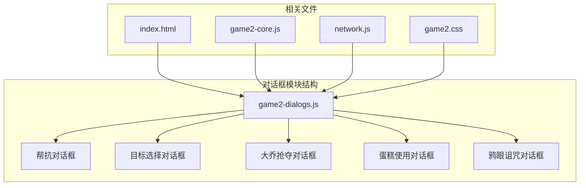
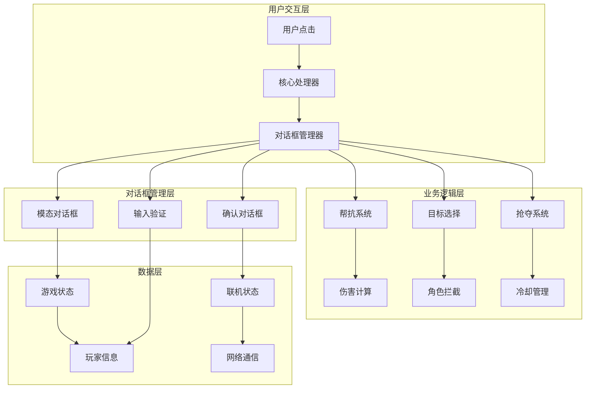
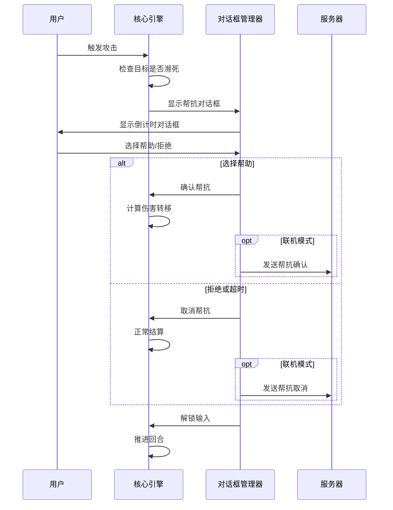
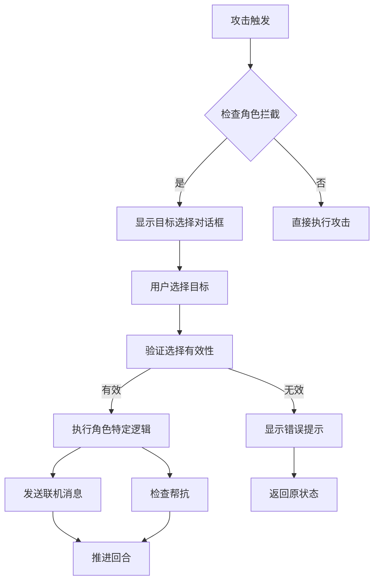
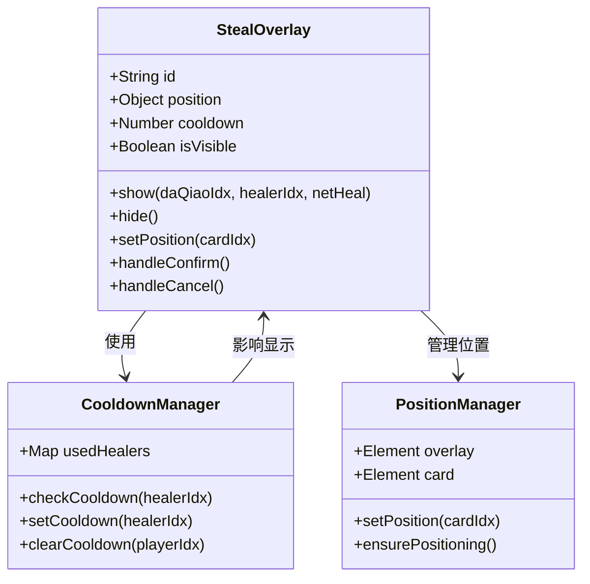
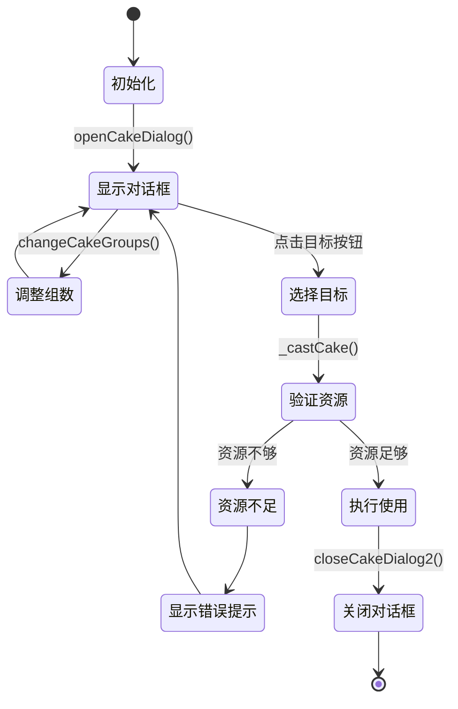
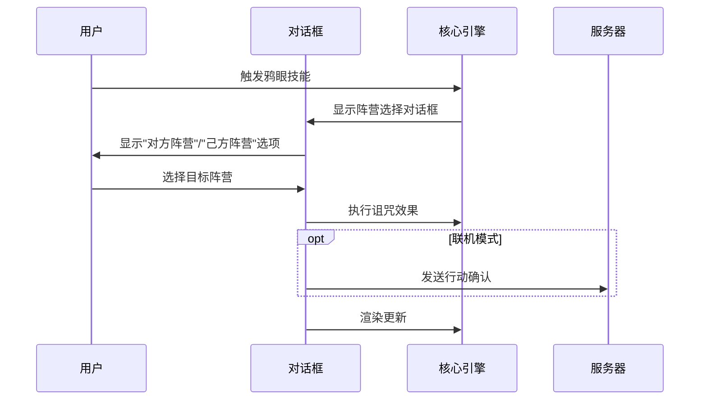
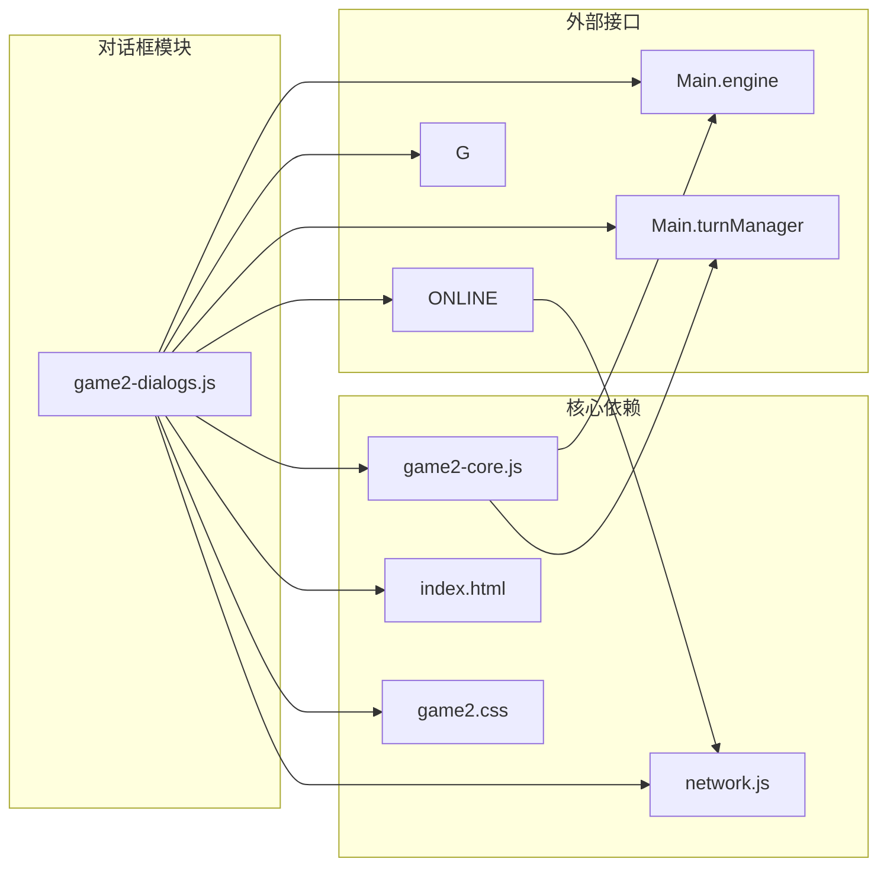

# 对话框模块 (game2-dialogs.js) 技术文档

<cite>
**本文档引用的文件**
- [game2-dialogs.js](file://js/game2-dialogs.js)
- [index.html](file://index.html)
- [game2-core.js](file://js/game2-core.js)
- [network.js](file://network.js)
- [game2.css](file://css/game2.css)
</cite>

## 目录
1. [简介](#简介)
2. [项目结构](#项目结构)
3. [核心组件](#核心组件)
4. [架构概览](#架构概览)
5. [详细组件分析](#详细组件分析)
6. [依赖关系分析](#依赖关系分析)
7. [性能考虑](#性能考虑)
8. [故障排除指南](#故障排除指南)
9. [结论](#结论)
10. [附录](#附录)

## 简介

对话框模块是游戏中的重要交互组件，负责处理各种用户交互场景，包括模态对话框管理、确认对话框、输入验证和错误提示系统。该模块实现了多种特殊对话框功能，如帮抗弹窗、目标选择弹窗、大乔抢夺弹窗、蛋糕使用弹窗和鸦眼诅咒弹窗等。

## 项目结构

对话框模块主要位于 `js/game2-dialogs.js` 文件中，与核心游戏逻辑紧密集成：

**图表来源**
- [game2-dialogs.js:1-372](file://js/game2-dialogs.js#L1-L372)
- [index.html:1-482](file://index.html#L1-L482)

**章节来源**
- [game2-dialogs.js:1-372](file://js/game2-dialogs.js#L1-L372)
- [index.html:1-482](file://index.html#L1-L482)

## 核心组件

对话框模块包含以下主要组件：

### 1. 帮抗对话框系统
- **功能**：处理濒死角色的帮抗请求
- **特点**：倒计时机制、模态显示、联机支持
- **实现**：`showHelpTankDialog()`、`onHelpTankConfirm()`、`onHelpTankCancel()`

### 2. 目标选择对话框
- **功能**：为特定角色提供目标选择界面
- **示例**：孙悟空的[0,2]目标选择
- **实现**：`showWukongTargetDialog()`、`executeWukong02()`

### 3. 大乔抢夺对话框
- **功能**：处理大乔抢夺治疗效果的确认
- **特点**：动态创建DOM、位置定位、冷却机制
- **实现**：`showStealPrompt()`、`_doShowSteal()`

### 4. 蛋糕使用对话框
- **功能**：控制蛋糕使用的组数和目标
- **特点**：数量调节、成本计算、目标选择
- **实现**：`openCakeDialog()`、`changeCakeGroups2()`

### 5. 鸦眼诅咒对话框
- **功能**：选择鸦眼乌鸦诅咒的目标阵营
- **特点**：动态创建、简单界面、即时执行
- **实现**：`showCrowCurseDialog()`、`castCrowCurse()`

**章节来源**
- [game2-dialogs.js:6-88](file://js/game2-dialogs.js#L6-L88)
- [game2-dialogs.js:102-148](file://js/game2-dialogs.js#L102-L148)
- [game2-dialogs.js:204-282](file://js/game2-dialogs.js#L204-L282)
- [game2-dialogs.js:290-337](file://js/game2-dialogs.js#L290-L337)
- [game2-dialogs.js:342-371](file://js/game2-dialogs.js#L342-L371)

## 架构概览

对话框模块采用分层架构设计，与游戏核心逻辑和网络通信紧密集成：

**图表来源**
- [game2-dialogs.js:1-372](file://js/game2-dialogs.js#L1-L372)
- [game2-core.js:1-200](file://js/game2-core.js#L1-L200)
- [network.js:1-113](file://network.js#L1-L113)

## 详细组件分析

### 帮抗对话框系统

帮抗系统是对话框模块的核心功能之一，负责处理濒死角色的求救请求：

**图表来源**
- [game2-dialogs.js:6-88](file://js/game2-dialogs.js#L6-L88)
- [game2-core.js:114-163](file://js/game2-core.js#L114-L163)

#### 关键特性

1. **倒计时机制**：5秒倒计时，超时自动取消
2. **模态显示**：阻止其他交互直到做出选择
3. **伤害计算**：基于1.5倍惩罚系数
4. **联机支持**：仅控制帮抗者的座位能弹窗

**章节来源**
- [game2-dialogs.js:6-88](file://js/game2-dialogs.js#L6-L88)
- [game2-core.js:114-163](file://js/game2-core.js#L114-L163)

### 目标选择对话框

目标选择对话框为特定角色提供额外的交互选项：

**图表来源**
- [game2-dialogs.js:102-148](file://js/game2-dialogs.js#L102-L148)
- [game2-core.js:47-58](file://js/game2-core.js#L47-L58)

#### 实现细节

1. **动态列表生成**：根据当前阵营过滤可用目标
2. **样式定制**：紫色主题，符合孙悟空角色特色
3. **事件处理**：一次性点击处理，避免重复触发

**章节来源**
- [game2-dialogs.js:102-148](file://js/game2-dialogs.js#L102-L148)
- [game2-core.js:47-58](file://js/game2-core.js#L47-L58)

### 大乔抢夺对话框

大乔抢夺系统是最复杂的对话框实现，具有独特的技术特性：

**图表来源**
- [game2-dialogs.js:156-282](file://js/game2-dialogs.js#L156-L282)

#### 技术创新

1. **DOM复用策略**：固定ID的DOM节点避免重复创建
2. **绝对定位系统**：通过`position:absolute`实现弹窗嵌入
3. **冷却管理系统**：每回合清理，防止重复弹窗
4. **AI集成**：自动处理AI控制角色的抢夺决策

**章节来源**
- [game2-dialogs.js:156-282](file://js/game2-dialogs.js#L156-L282)

### 蛋糕使用对话框

蛋糕系统提供了资源管理和目标选择的完整解决方案：

**图表来源**
- [game2-dialogs.js:290-337](file://js/game2-dialogs.js#L290-L337)

#### 功能特性

1. **动态组数计算**：基于3个蛋糕=1组的规则
2. **实时成本更新**：组数变化时即时更新提示
3. **目标过滤**：排除己方和死亡角色
4. **样式定制**：粉色主题，符合角色特色

**章节来源**
- [game2-dialogs.js:290-337](file://js/game2-dialogs.js#L290-L337)

### 鸦眼诅咒对话框

鸦眼诅咒对话框展示了简洁而有效的对话框设计：

**图表来源**
- [game2-dialogs.js:342-371](file://js/game2-dialogs.js#L342-L371)

**章节来源**
- [game2-dialogs.js:342-371](file://js/game2-dialogs.js#L342-L371)

## 依赖关系分析

对话框模块与多个系统存在紧密依赖关系：

**图表来源**
- [game2-dialogs.js:1-372](file://js/game2-dialogs.js#L1-L372)
- [game2-core.js:1-200](file://js/game2-core.js#L1-L200)
- [network.js:1-113](file://network.js#L1-L113)

### 关键依赖点

1. **游戏引擎集成**：通过`Main.engine`调用核心逻辑
2. **状态管理**：依赖`Main.turnManager`维护游戏状态
3. **网络通信**：通过`ONLINE`对象处理联机消息
4. **DOM操作**：直接操作HTML元素实现界面更新

**章节来源**
- [game2-dialogs.js:1-372](file://js/game2-dialogs.js#L1-L372)
- [game2-core.js:1-200](file://js/game2-core.js#L1-L200)

## 性能考虑

对话框模块在性能方面采用了多项优化策略：

### DOM操作优化
- **固定节点复用**：大乔抢夺弹窗使用固定ID避免重复创建
- **事件委托**：使用事件冒泡减少事件监听器数量
- **批量更新**：一次性更新多个DOM属性

### 内存管理
- **定时器清理**：及时清理所有setInterval和setTimeout
- **事件克隆**：动态按钮通过cloneNode避免事件泄漏
- **状态清理**：对话框关闭时清理相关状态变量

### 渲染优化
- **条件渲染**：仅在需要时创建和显示对话框
- **样式缓存**：复用CSS类名避免动态样式计算
- **最小化重绘**：批量修改DOM属性减少浏览器重绘

## 故障排除指南

### 常见问题及解决方案

#### 对话框无法显示
1. **检查DOM元素是否存在**
   - 确保相关HTML元素已正确加载
   - 验证CSS样式未隐藏对话框

2. **验证状态变量**
   - 检查全局状态变量是否正确初始化
   - 确认`G.inputLocked`状态符合预期

#### 联机功能异常
1. **检查网络连接**
   - 验证WebSocket连接状态
   - 确认房间状态同步正常

2. **调试消息处理**
   - 检查`ONLINE.sendAction()`调用
   - 验证远程动作处理逻辑

#### 性能问题
1. **内存泄漏排查**
   - 检查定时器是否正确清理
   - 验证事件监听器是否移除

2. **DOM操作优化**
   - 减少不必要的DOM查询
   - 批量更新DOM属性

**章节来源**
- [game2-dialogs.js:1-372](file://js/game2-dialogs.js#L1-L372)
- [network.js:1-113](file://network.js#L1-L113)

## 结论

对话框模块展现了优秀的前端架构设计，通过模块化的方式实现了复杂的游戏交互功能。该模块的主要优势包括：

1. **模块化设计**：每个对话框功能独立封装，便于维护和扩展
2. **性能优化**：采用多种优化策略确保流畅的用户体验
3. **联机支持**：完整的网络通信集成，支持多人游戏
4. **错误处理**：完善的错误处理和状态管理机制

该模块为游戏提供了丰富的交互体验，是整个游戏系统的重要组成部分。

## 附录

### 扩展指南

#### 创建自定义对话框类型
1. **复制现有模板**：参考现有的对话框实现模式
2. **定义DOM结构**：在HTML中添加必要的DOM元素
3. **实现JavaScript逻辑**：编写显示、隐藏和事件处理函数
4. **集成到核心系统**：通过`Main.invokeAction()`调用新对话框

#### 集成第三方UI组件
1. **样式兼容性**：确保第三方组件样式与游戏主题一致
2. **事件处理**：正确处理第三方组件的事件回调
3. **响应式设计**：适配不同屏幕尺寸和设备

#### 国际化支持
1. **文本提取**：将所有用户可见文本提取到配置文件
2. **语言切换**：实现动态语言切换机制
3. **RTL支持**：考虑从右到左语言的布局调整