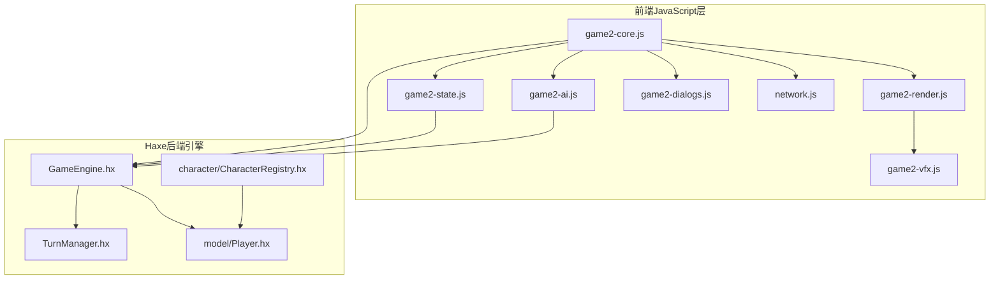
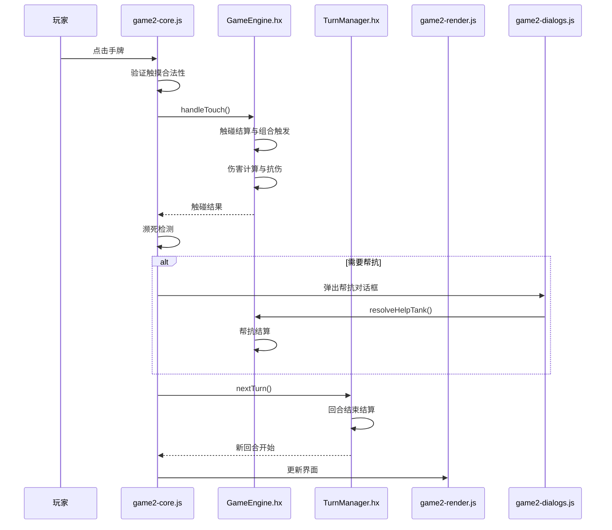
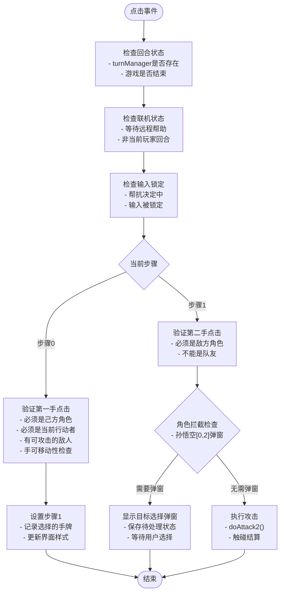
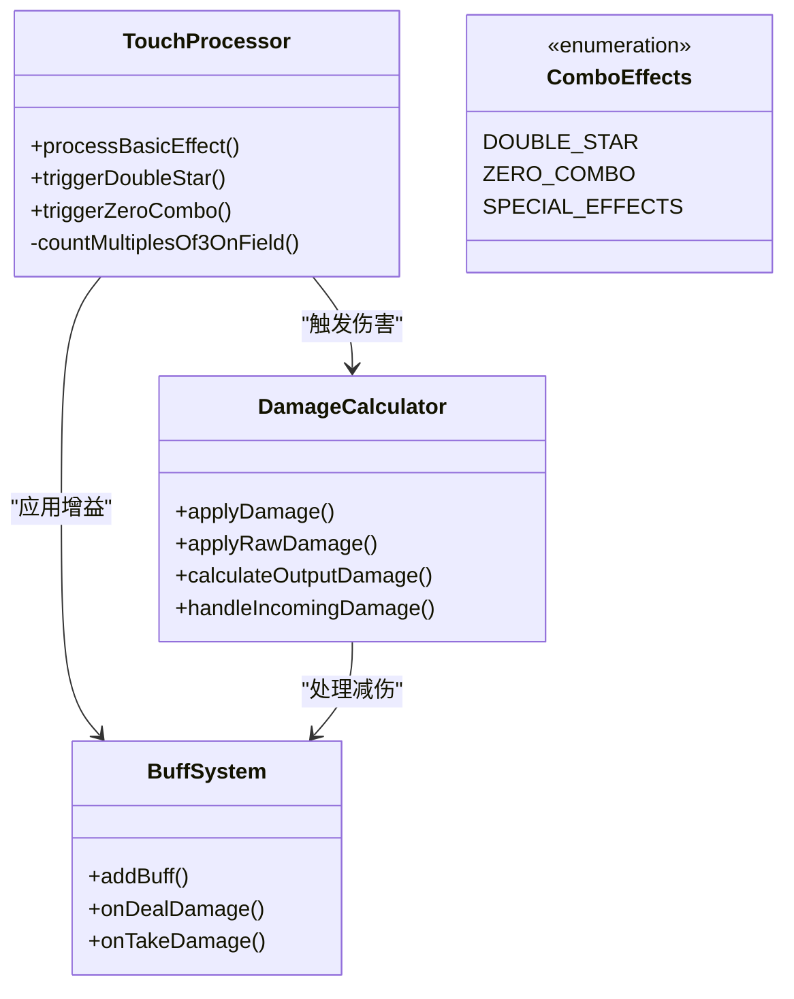
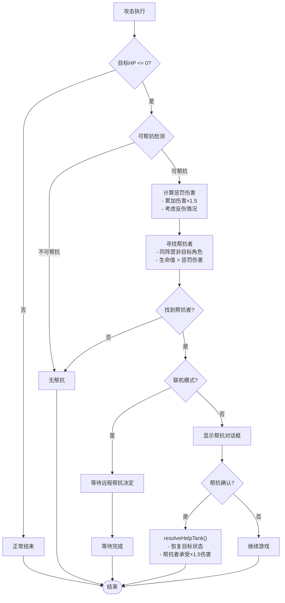
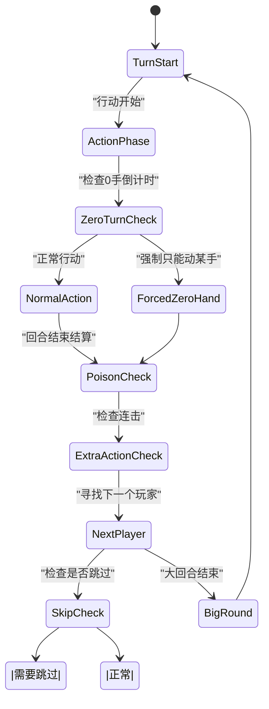
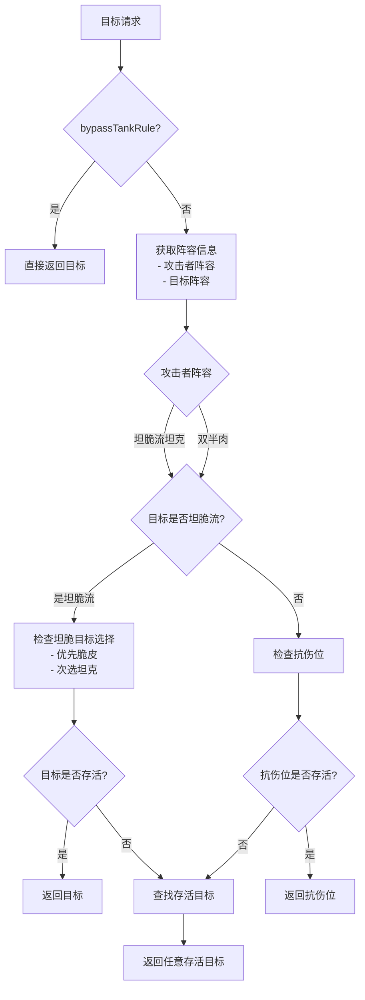
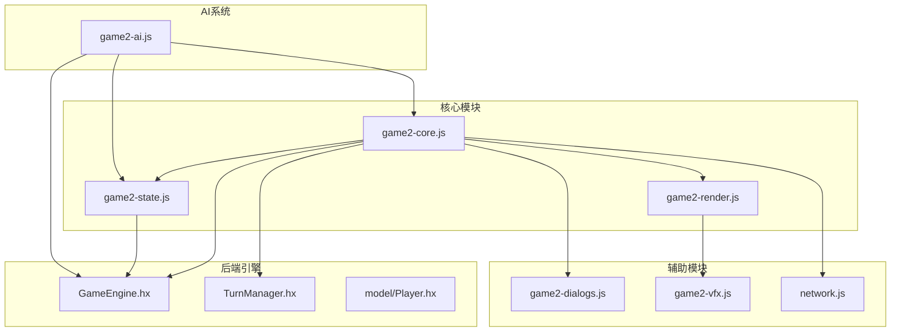

# 核心逻辑模块 (game2-core.js)

<cite>
**本文档引用的文件**
- [game2-core.js](file://js/game2-core.js)
- [game2-state.js](file://js/game2-state.js)
- [game2-render.js](file://js/game2-render.js)
- [game2-ai.js](file://js/game2-ai.js)
- [game2-dialogs.js](file://js/game2-dialogs.js)
- [game2-vfx.js](file://js/game2-vfx.js)
- [TurnManager.hx](file://TurnManager.hx)
- [GameEngine.hx](file://GameEngine.hx)
- [Player.hx](file://model/Player.hx)
- [CharacterRegistry.hx](file://character/CharacterRegistry.hx)
- [network.js](file://network.js)
</cite>

## 目录
1. [简介](#简介)
2. [项目结构](#项目结构)
3. [核心组件](#核心组件)
4. [架构概览](#架构概览)
5. [详细组件分析](#详细组件分析)
6. [依赖关系分析](#依赖关系分析)
7. [性能考虑](#性能考虑)
8. [故障排查指南](#故障排查指南)
9. [结论](#结论)
10. [附录](#附录)

## 简介
本文件针对核心逻辑模块 game2-core.js 进行全面技术文档化，深入解释游戏核心业务逻辑的实现，包括触摸验证、移动合法性检查、伤害计算、回合推进机制。详细分析核心算法，包括指尖碰撞规则、组合效果触发、阵营判断、胜负判定。阐述模块间的协调机制，包括与渲染模块的数据交换、与状态模块的通信、与AI模块的集成。提供核心逻辑扩展指南，包括添加新的游戏规则、修改现有算法、集成自定义功能的最佳实践。

## 项目结构
该项目采用前后端分离的JavaScript架构，结合Haxe后端引擎，形成完整的指尖博弈系统。核心逻辑模块位于 js 目录，包含以下关键文件：
- game2-core.js：核心业务逻辑（触摸验证、攻击执行、回合推进）
- game2-state.js：全局状态管理（阵营、抗伤位、目标选择）
- game2-render.js：渲染与UI更新（手牌样式、提示栏、特效）
- game2-ai.js：AI决策与训练系统
- game2-dialogs.js：弹窗对话框管理
- game2-vfx.js：视觉特效系统
- TurnManager.hx：回合管理（Haxe后端）
- GameEngine.hx：游戏引擎（Haxe后端）
- Player.hx：角色模型（Haxe后端）
- CharacterRegistry.hx：角色注册中心（Haxe后端）

**图表来源**
- [game2-core.js:1-223](file://js/game2-core.js#L1-L223)
- [game2-state.js:1-242](file://js/game2-state.js#L1-L242)
- [TurnManager.hx:1-232](file://TurnManager.hx#L1-L232)
- [GameEngine.hx:1-725](file://GameEngine.hx#L1-L725)

**章节来源**
- [game2-core.js:1-223](file://js/game2-core.js#L1-L223)
- [game2-state.js:1-242](file://js/game2-state.js#L1-L242)
- [TurnManager.hx:1-232](file://TurnManager.hx#L1-L232)
- [GameEngine.hx:1-725](file://GameEngine.hx#L1-L725)

## 核心组件
核心逻辑模块主要包含以下关键组件：

### 触摸验证与攻击执行
- `onHandClick2()`：两步点击状态机，处理玩家点击事件
- `doAttack2()`：执行攻击动作，包含伤害计算和帮抗检测
- `tryHelpTankOrPause()`：濒死检测与帮抗决策

### 回合管理与推进
- `finishTurn2()`：回合结束处理，包含毒伤结算和新死亡检测
- `endTurn2()`：强制结束回合
- `endGame2()`：游戏结束处理

### 目标选择与阵营逻辑
- `getActualTarget()`：根据阵容规则获取实际受伤目标
- `findAnyEnemy()`：查找任意存活敌人
- `campOf()`：阵营判断函数

**章节来源**
- [game2-core.js:5-223](file://js/game2-core.js#L5-L223)
- [game2-state.js:23-162](file://js/game2-state.js#L23-L162)

## 架构概览
核心逻辑模块采用分层架构设计，通过明确的职责分离实现松耦合：

**图表来源**
- [game2-core.js:69-107](file://js/game2-core.js#L69-L107)
- [GameEngine.hx:418-468](file://GameEngine.hx#L418-L468)
- [TurnManager.hx:110-190](file://TurnManager.hx#L110-L190)

## 详细组件分析

### 触摸验证与两步点击状态机
触摸验证系统实现了严格的合法性检查，确保游戏平衡性：

**图表来源**
- [game2-core.js:5-66](file://js/game2-core.js#L5-L66)
- [game2-core.js:47-58](file://js/game2-core.js#L47-L58)

#### 触摸合法性检查算法
触摸合法性检查基于以下规则：
1. **阵营验证**：点击必须是当前行动者所属阵营
2. **角色验证**：必须是当前行动者本人（不能点击队友）
3. **手牌验证**：目标手牌数字必须大于0
4. **移动验证**：角色的isValidTouch方法检查移动合法性
5. **环境验证**：游戏状态、联机状态、输入锁定状态

**章节来源**
- [game2-core.js:17-27](file://js/game2-core.js#L17-L27)
- [Player.hx:340-350](file://model/Player.hx#L340-L350)

### 伤害计算与组合效果触发
伤害计算系统实现了复杂的组合效果触发机制：

**图表来源**
- [GameEngine.hx:470-591](file://GameEngine.hx#L470-L591)
- [GameEngine.hx:137-233](file://GameEngine.hx#L137-L233)

#### 组合效果触发规则
组合效果根据不同的手牌组合触发特定效果：

**双子星组合（双手相同数字）**：
- 双九：根据场上有3的倍数数量计算倍率，造成物理伤害
- 双八：获得额外行动机会和护盾
- 双七：造成物理伤害并施加中毒
- 双六：恢复生命值
- 双五：获得反弹护盾
- 双四：获得伤害翻倍增益
- 双二/双三：获得护盾
- 双一：获得无敌状态
- 双零：造成真实伤害

**[0,x]组合**：
- [0,6]：恢复生命值
- [0,4]：恢复生命值
- [0,7]：造成物理伤害并施加中毒
- [0,1]、[0,5]、[0,8]、[0,9]：造成物理伤害
- [0,2]、[0,3]：获得护盾
- [0,0]：造成真实伤害

**章节来源**
- [GameEngine.hx:495-591](file://GameEngine.hx#L495-L591)

### 濒死检测与帮抗机制
帮抗机制是游戏的核心平衡系统，确保不会出现单人被围攻的情况：

**图表来源**
- [game2-core.js:114-163](file://js/game2-core.js#L114-L163)
- [GameEngine.hx:647-685](file://GameEngine.hx#L647-L685)

#### 帮抗计算算法
帮抗惩罚伤害计算遵循以下规则：
1. **基础计算**：将本次攻击造成的每笔伤害乘以1.5
2. **反伤处理**：反伤致死时传入实际死亡伤害量
3. **帮抗者筛选**：选择能够承受惩罚伤害的同阵营角色
4. **联机处理**：由控制帮抗者的玩家决定是否帮抗

**章节来源**
- [game2-core.js:125-132](file://js/game2-core.js#L125-L132)
- [GameEngine.hx:664-676](file://GameEngine.hx#L664-L676)

### 回合推进机制
回合管理系统实现了复杂的回合逻辑，包括跳过机制、连击判定和终局判定：

**图表来源**
- [TurnManager.hx:35-102](file://TurnManager.hx#L35-L102)
- [TurnManager.hx:110-190](file://TurnManager.hx#L110-L190)

#### 回合推进算法
回合推进包含以下关键步骤：
1. **回合开始**：检查冰冻状态、递减0手倒计时、强制手锁定
2. **行动阶段**：玩家执行攻击动作
3. **回合结束**：结算毒伤、连击判定、护盾衰减
4. **玩家切换**：寻找下一个可行动玩家
5. **终局检查**：检查游戏是否结束

**章节来源**
- [TurnManager.hx:115-122](file://TurnManager.hx#L115-L122)
- [TurnManager.hx:134-187](file://TurnManager.hx#L134-L187)

### 阵营判断与目标选择
阵营系统实现了灵活的目标选择机制，支持多种阵容配置：

**图表来源**
- [game2-state.js:118-162](file://js/game2-state.js#L118-L162)

#### 阵容系统规则
阵容系统支持以下配置：
1. **双半肉阵容**：攻击者可自由选择目标，优先抗伤位
2. **坦脆流阵容**：攻击者必须遵守目标选择规则
3. **抗伤位切换**：支持动态切换抗伤位
4. **目标锁定**：坦脆流坦克可锁定脆皮或坦克为目标

**章节来源**
- [game2-state.js:129-151](file://js/game2-state.js#L129-L151)
- [game2-state.js:32-43](file://js/game2-state.js#L32-L43)

## 依赖关系分析

### 模块间依赖关系
核心逻辑模块与其他模块存在以下依赖关系：

**图表来源**
- [game2-core.js:1-223](file://js/game2-core.js#L1-L223)
- [game2-ai.js:177-246](file://js/game2-ai.js#L177-L246)

### 数据流向分析
核心逻辑模块的数据流遵循以下模式：

1. **输入处理**：玩家点击事件 → 核心验证 → 攻击执行
2. **状态更新**：攻击结果 → 状态变更 → UI更新
3. **回合推进**：回合结束 → 状态检查 → 新回合开始
4. **AI集成**：AI决策 → 合法动作枚举 → 自动执行

**章节来源**
- [game2-core.js:69-107](file://js/game2-core.js#L69-L107)
- [game2-ai.js:251-268](file://js/game2-ai.js#L251-L268)

## 性能考虑
核心逻辑模块在性能方面采用了多项优化策略：

### 渲染优化
- **批量渲染**：使用requestAnimationFrame避免重复DOM操作
- **样式缓存**：手牌样式更新采用批处理机制
- **条件渲染**：仅在必要时更新UI状态

### 算法优化
- **早期返回**：大量使用早期返回避免不必要的计算
- **缓存机制**：全局状态G对象减少重复计算
- **事件节流**：输入锁定机制防止重复操作

### 内存管理
- **对象复用**：避免频繁创建临时对象
- **及时清理**：弹窗和对话框使用后及时清理
- **状态重置**：回合切换时重置相关状态

## 故障排查指南

### 常见问题诊断
1. **点击无效**：检查G.inputLocked状态和当前回合状态
2. **攻击失败**：验证isValidTouch返回值和目标手牌状态
3. **帮抗异常**：检查lastTouchDamageLog和帮抗者可用性
4. **回合卡死**：确认TurnManager.gameOver状态和玩家存活情况

### 调试建议
- 使用浏览器开发者工具监控状态变化
- 检查控制台日志输出
- 验证网络连接状态（联机模式）
- 测试不同阵容配置下的行为

**章节来源**
- [game2-core.js:89-92](file://js/game2-core.js#L89-L92)
- [game2-core.js:168-173](file://js/game2-core.js#L168-L173)

## 结论
核心逻辑模块 game2-core.js 实现了指尖博弈游戏的完整业务逻辑，通过严谨的状态管理和算法设计，确保了游戏的平衡性和可玩性。模块采用分层架构设计，职责清晰，便于维护和扩展。与渲染、状态、AI等模块的协作机制完善，形成了完整的游戏生态系统。

模块的主要优势包括：
- **严格的合法性检查**：确保游戏平衡性
- **灵活的目标选择**：支持多种阵容配置
- **完善的帮抗机制**：防止单人被围攻
- **可扩展的组合系统**：支持丰富的游戏策略
- **高效的性能优化**：保证流畅的游戏体验

## 附录

### 扩展指南
新增游戏规则的推荐步骤：
1. **定义规则**：在GameEngine.hx中添加新的组合效果
2. **更新验证**：在Player.hx中实现相应的isValidTouch逻辑
3. **集成UI**：在game2-render.js中添加相应的界面反馈
4. **测试验证**：编写单元测试确保规则正确性
5. **性能评估**：监控新规则对性能的影响

### 最佳实践
- **保持状态一致性**：所有状态变更必须通过统一接口
- **错误处理**：为所有异步操作添加适当的错误处理
- **日志记录**：为关键操作添加详细的日志输出
- **边界检查**：对所有输入进行严格的边界检查
- **内存管理**：及时清理不需要的对象和事件监听器