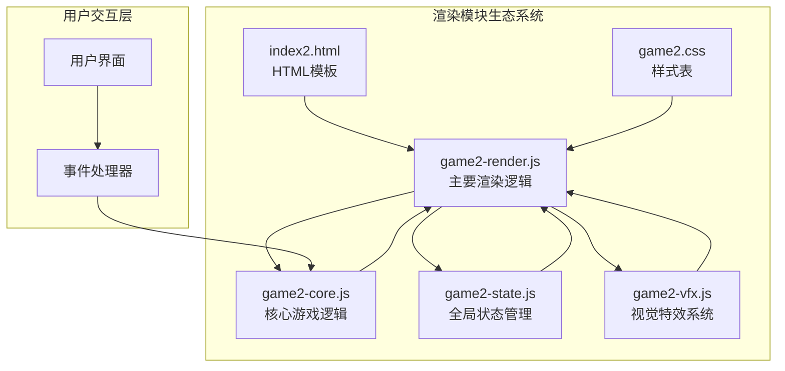
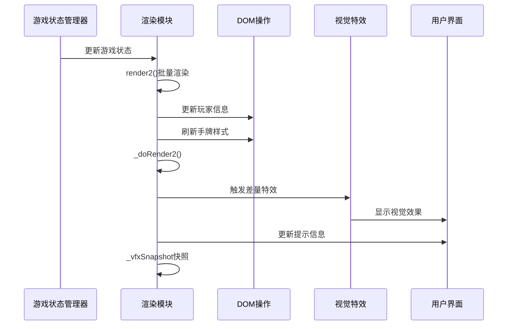
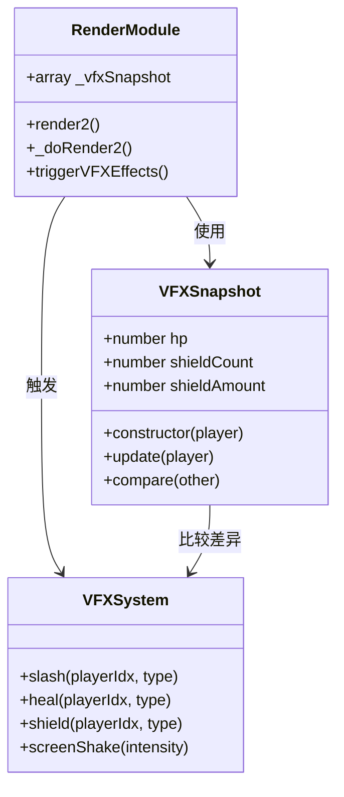
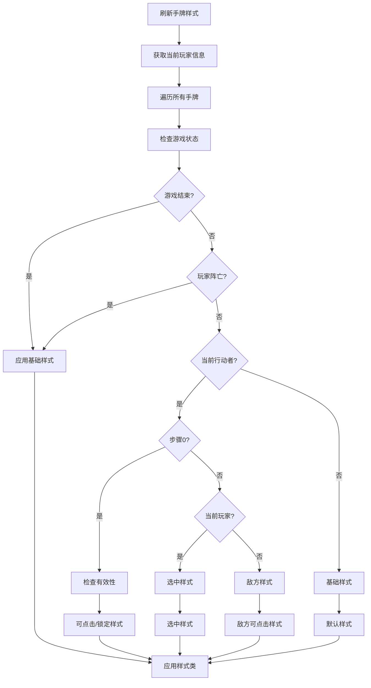
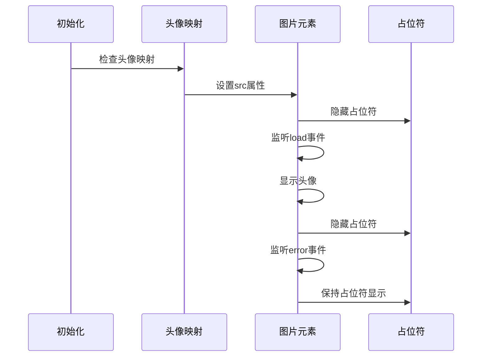
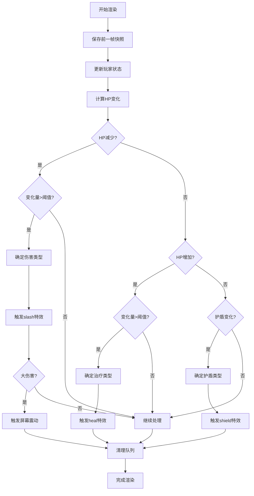
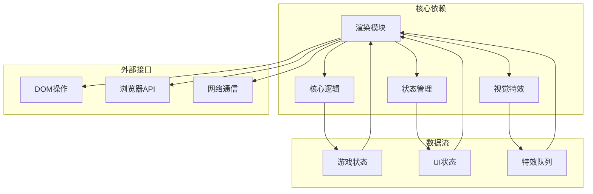
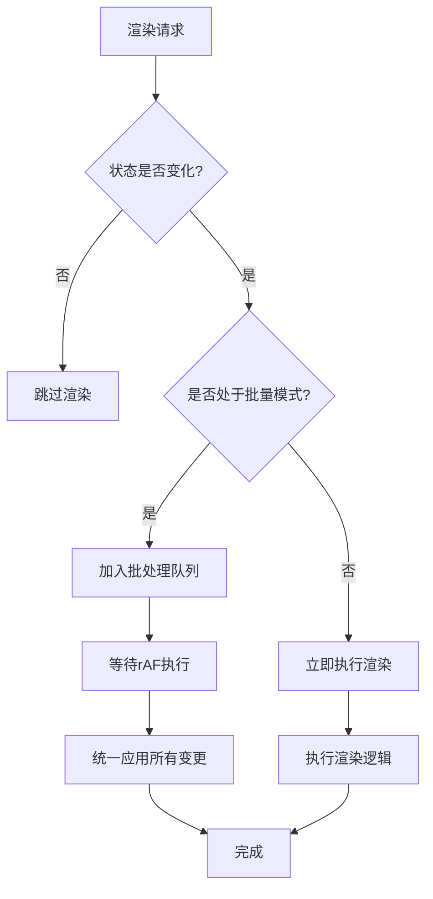

# 渲染模块 (game2-render.js)

<cite>
**本文档引用的文件**
- [game2-render.js](file://js/game2-render.js)
- [game2-core.js](file://js/game2-core.js)
- [game2-state.js](file://js/game2-state.js)
- [game2-vfx.js](file://js/game2-vfx.js)
- [index2.html](file://index2.html)
- [game2.css](file://css/game2.css)
</cite>

## 目录
1. [简介](#简介)
2. [项目结构](#项目结构)
3. [核心组件](#核心组件)
4. [架构概览](#架构概览)
5. [详细组件分析](#详细组件分析)
6. [依赖关系分析](#依赖关系分析)
7. [性能考虑](#性能考虑)
8. [故障排除指南](#故障排除指南)
9. [结论](#结论)

## 简介

渲染模块是游戏2v2对战系统的核心视觉呈现组件，负责将游戏状态转换为用户界面。该模块实现了完整的UI更新机制，包括角色头像加载、手牌样式管理、特效触发机制以及批量渲染优化策略。本文档深入分析了渲染模块的设计架构、实现细节和性能优化策略。

## 项目结构

渲染模块位于JavaScript目录中，与核心逻辑、状态管理和视觉特效模块协同工作：



**图表来源**
- [game2-render.js:1-304](file://js/game2-render.js#L1-L304)
- [game2-core.js:1-223](file://js/game2-core.js#L1-L223)
- [game2-state.js:1-242](file://js/game2-state.js#L1-L242)
- [game2-vfx.js:1-305](file://js/game2-vfx.js#L1-L305)

**章节来源**
- [game2-render.js:1-304](file://js/game2-render.js#L1-L304)
- [index2.html:169-988](file://index2.html#L169-L988)
- [game2.css:1-439](file://css/game2.css#L1-L439)

## 核心组件

渲染模块包含以下关键组件：

### 1. 批量渲染优化器
- **requestAnimationFrame去重机制**：防止同一帧内多次渲染导致的DOM操作冲突
- **状态快照系统**：记录渲染前后的状态差异，实现精准特效触发

### 2. 手牌样式管理系统
- **动态样式切换**：根据游戏状态实时更新手牌样式
- **交互状态指示**：清晰显示可点击、锁定、选中等状态

### 3. 角色头像加载器
- **懒加载机制**：按需加载角色头像，提升初始加载速度
- **占位符管理**：头像加载失败时的优雅降级

### 4. 特效触发器
- **差量对比算法**：基于状态快照的精确特效触发
- **多类型特效支持**：伤害斩击、回复加号、护盾出现、屏幕震动

**章节来源**
- [game2-render.js:31-51](file://js/game2-render.js#L31-L51)
- [game2-render.js:64-65](file://js/game2-render.js#L64-L65)
- [game2-render.js:223-271](file://js/game2-render.js#L223-L271)

## 架构概览

渲染模块采用分层架构设计，确保职责分离和模块化：



**图表来源**
- [game2-render.js:35-210](file://js/game2-render.js#L35-L210)
- [game2-vfx.js:11-305](file://js/game2-vfx.js#L11-L305)

## 详细组件分析

### 批量渲染优化策略

#### requestAnimationFrame去重机制

渲染模块实现了高效的批量渲染优化，通过双重去重机制避免重复DOM操作：

```mermaid
flowchart TD
A[render2()调用] --> B{_renderPending检查}
B --> |true| C[直接返回]
B --> |false| D[_renderPending = true]
D --> E[requestAnimationFrame]
E --> F[_doRender2()执行]
F --> G[_renderPending = false]
H[refreshHandStyles2()调用] --> I{_stylesPending检查}
I --> |true| J[直接返回]
I --> |false| K[_stylesPending = true]
K --> L[requestAnimationFrame]
L --> M[_doRefreshHandStyles2()执行]
M --> N[_stylesPending = false]
```

**图表来源**
- [game2-render.js:35-51](file://js/game2-render.js#L35-L51)

这种设计确保：
- **单帧去重**：同一帧内多次调用只执行一次
- **独立优化**：渲染和样式刷新分别独立优化
- **性能稳定**：避免频繁的DOM查询和修改

#### 状态快照机制（_vfxSnapshot）

渲染模块使用状态快照系统实现精确的特效触发：



**图表来源**
- [game2-render.js:64-65](file://js/game2-render.js#L64-L65)
- [game2-render.js:72-86](file://js/game2-render.js#L72-L86)
- [game2-render.js:156-209](file://js/game2-render.js#L156-L209)

**章节来源**
- [game2-render.js:64-209](file://js/game2-render.js#L64-L209)

### 手牌样式管理系统

#### 动态样式切换算法

手牌样式管理系统根据游戏状态动态切换样式类：



**图表来源**
- [game2-render.js:223-271](file://js/game2-render.js#L223-L271)

#### 交互状态指示系统

手牌系统支持多种交互状态的可视化：

| 状态类别 | 样式类 | 描述 | 触发条件 |
|---------|--------|------|----------|
| 基础状态 | `hand-box2` | 默认样式 | 任何情况 |
| 死亡时钟 | `death-clock` | 显示剩余回合 | 手牌为0且有剩余回合 |
| 可点击我方 | `clickable-mine` | 我方可点击 | 步骤0且有效移动 |
| 选中我方 | `selected-mine` | 当前选中 | 步骤1且当前玩家 |
| 可点击敌方 | `clickable-enemy` | 敌方可点击 | 敌方手牌非0 |
| 锁定状态 | `locked` | 不可点击 | 其他情况 |

**章节来源**
- [game2-render.js:212-221](file://js/game2-render.js#L212-L221)
- [game2-render.js:223-271](file://js/game2-render.js#L223-L271)

### 角色头像加载系统

#### 懒加载机制

头像加载系统采用懒加载策略，提升初始性能：



**图表来源**
- [game2-render.js:10-29](file://js/game2-render.js#L10-L29)

**章节来源**
- [game2-render.js:10-29](file://js/game2-render.js#L10-L29)

### 特效触发机制

#### 差量对比算法

渲染模块通过差量对比实现精确的特效触发：



**图表来源**
- [game2-render.js:156-209](file://js/game2-render.js#L156-L209)

#### 多类型特效系统

渲染模块支持多种类型的视觉特效：

| 特效类型 | 触发条件 | 参数 | 视觉表现 |
|---------|----------|------|----------|
| slash | HP大幅减少 | `PHYSICAL/MAGIC/TRUE/POISON` | 斜斩线条动画 |
| heal | HP小幅增加 | `RECOVERY/SUPPLY` | 浮动加号粒子 |
| shield | 护盾添加 | `PHYSICAL/MAGIC/BOTH/TRUE` | 盾牌出现动画 |
| screenShake | 大伤害 | 强度级别 | 屏幕震动效果 |

**章节来源**
- [game2-render.js:164-209](file://js/game2-render.js#L164-L209)
- [game2-vfx.js:14-34](file://js/game2-vfx.js#L14-L34)

## 依赖关系分析

渲染模块与多个系统存在紧密的依赖关系：



**图表来源**
- [game2-render.js:1-304](file://js/game2-render.js#L1-L304)
- [game2-core.js:1-223](file://js/game2-core.js#L1-L223)
- [game2-state.js:1-242](file://js/game2-state.js#L1-L242)
- [game2-vfx.js:1-305](file://js/game2-vfx.js#L1-L305)

**章节来源**
- [game2-render.js:1-304](file://js/game2-render.js#L1-L304)
- [game2-core.js:1-223](file://js/game2-core.js#L1-L223)
- [game2-state.js:1-242](file://js/game2-state.js#L1-L242)
- [game2-vfx.js:1-305](file://js/game2-vfx.js#L1-L305)

## 性能考虑

### 批处理策略

渲染模块采用了多层次的批处理优化：

#### 1. requestAnimationFrame批处理
- **单帧去重**：同一帧内的多次调用合并为一次执行
- **异步调度**：利用浏览器的合成器优化渲染时机
- **内存管理**：及时清理临时状态，避免内存泄漏

#### 2. DOM操作优化
- **批量更新**：在同一帧内收集所有DOM变更后再统一应用
- **最小化重排**：避免强制同步布局操作
- **样式分离**：将样式变更与布局变更分离

#### 3. 事件处理优化
- **事件委托**：使用事件冒泡减少事件监听器数量
- **防抖节流**：对高频事件进行适当的节流处理

### 条件渲染策略

渲染模块实现了智能的条件渲染机制：



### 内存管理最佳实践

#### 1. 对象池模式
- **特效对象复用**：特效元素在使用后立即回收
- **字符串缓存**：常用字符串进行缓存避免重复创建
- **数组复用**：使用数组复用减少垃圾回收压力

#### 2. 生命周期管理
- **资源清理**：组件销毁时清理所有定时器和事件监听器
- **循环引用避免**：使用弱引用避免内存泄漏
- **超时保护**：长时间运行的任务进行超时检查

## 故障排除指南

### 常见问题及解决方案

#### 1. 渲染延迟问题
**症状**：界面更新滞后，操作反馈不及时
**原因**：过多的DOM查询或样式计算
**解决方案**：
- 检查是否有不必要的DOM查询
- 确认批处理机制正常工作
- 避免在渲染过程中进行复杂的计算

#### 2. 特效不触发问题
**症状**：伤害、治疗或护盾特效不显示
**原因**：状态快照不正确或特效队列阻塞
**解决方案**：
- 验证_vfxSnapshot的正确性
- 检查VFX队列是否被意外清空
- 确认特效类型映射正确

#### 3. 头像加载失败
**症状**：角色头像显示占位符而非实际图片
**原因**：图片路径错误或网络问题
**解决方案**：
- 检查头像映射表中的文件名
- 验证图片文件是否存在
- 确认网络连接正常

**章节来源**
- [game2-render.js:10-29](file://js/game2-render.js#L10-L29)
- [game2-render.js:156-209](file://js/game2-render.js#L156-L209)

### 调试技巧

#### 1. 状态监控
- 使用浏览器开发者工具监控DOM变更
- 检查requestAnimationFrame的执行频率
- 监控内存使用情况避免泄漏

#### 2. 性能分析
- 使用Chrome DevTools的Performance面板
- 分析渲染瓶颈和重排重绘
- 监控FPS和渲染时间

#### 3. 错误追踪
- 设置断点检查关键变量状态
- 验证事件处理函数的执行顺序
- 检查异步操作的完成状态

## 结论

渲染模块通过精心设计的架构和多项优化策略，成功实现了高性能的2v2对战游戏界面。其核心优势包括：

1. **高效的批处理机制**：通过requestAnimationFrame去重和状态快照，确保渲染性能最优
2. **智能的状态管理**：精确的差量对比算法实现恰到好处的特效触发
3. **灵活的样式系统**：动态样式切换支持复杂的游戏状态变化
4. **完善的错误处理**：健壮的异常处理和降级机制保证用户体验

该模块为整个游戏系统的视觉呈现提供了坚实的基础，其设计理念和实现方案值得在其他类似项目中借鉴和应用。