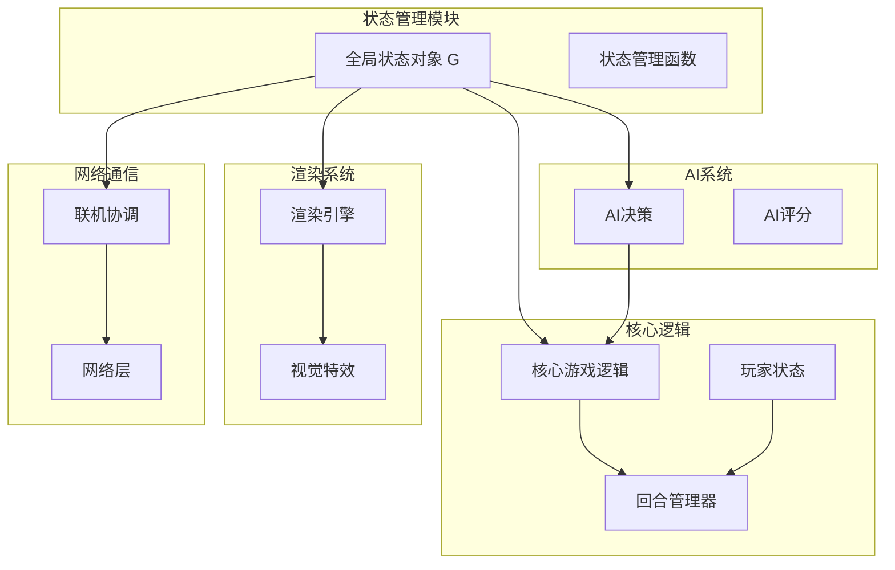
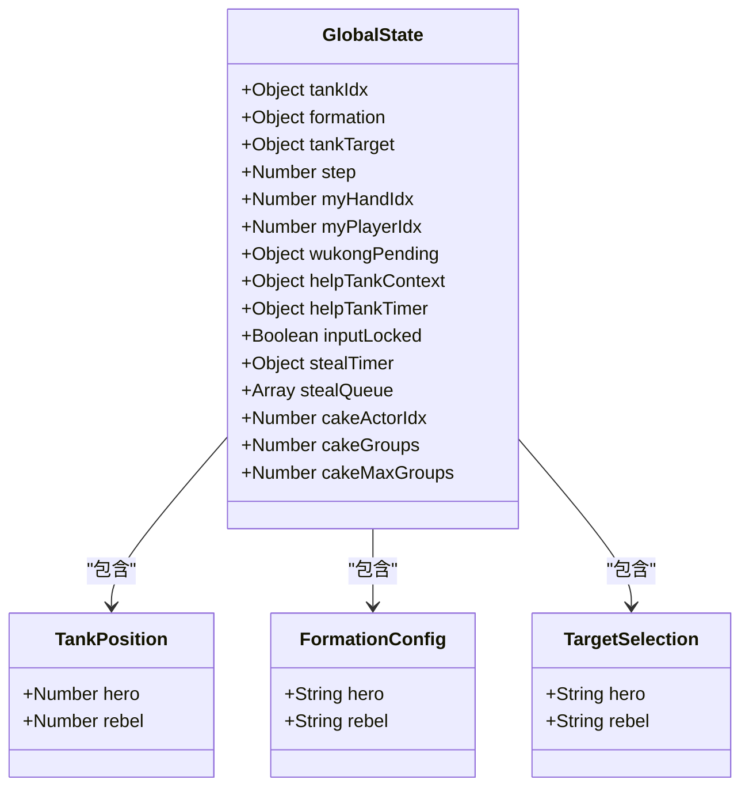
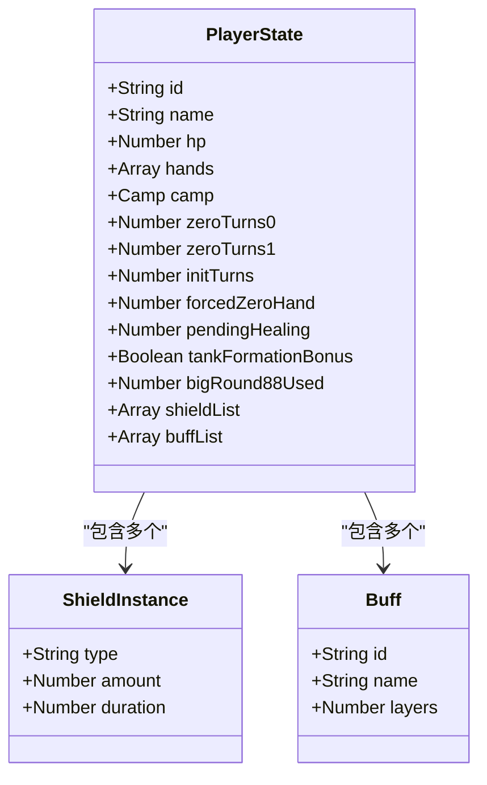
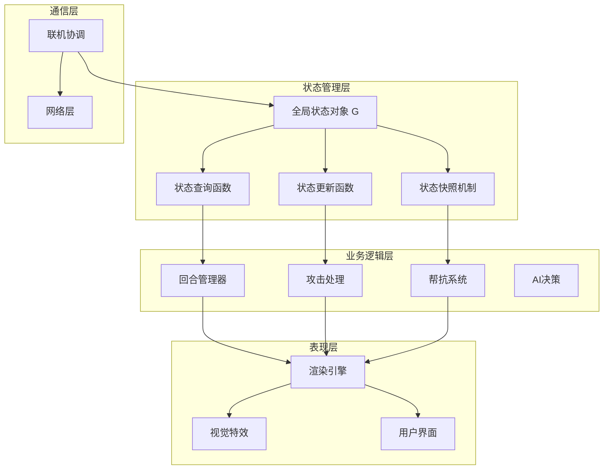
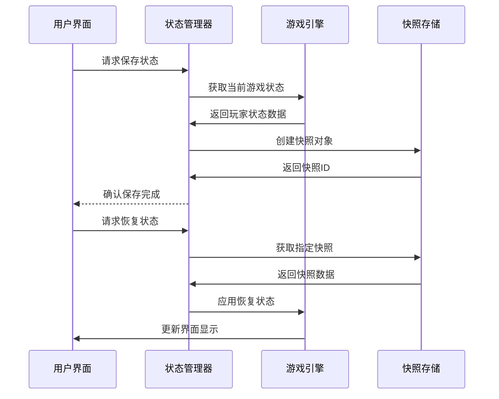
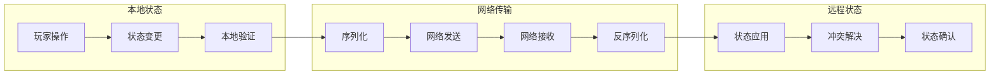
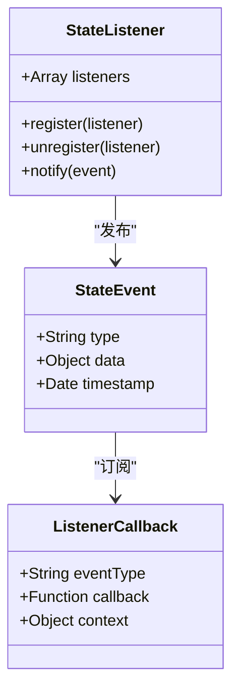
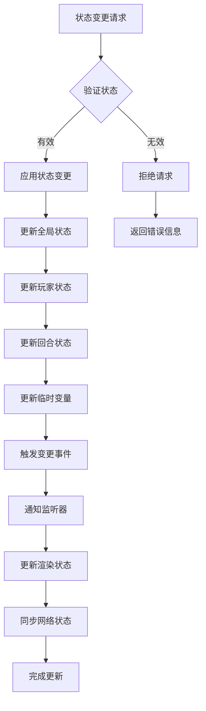
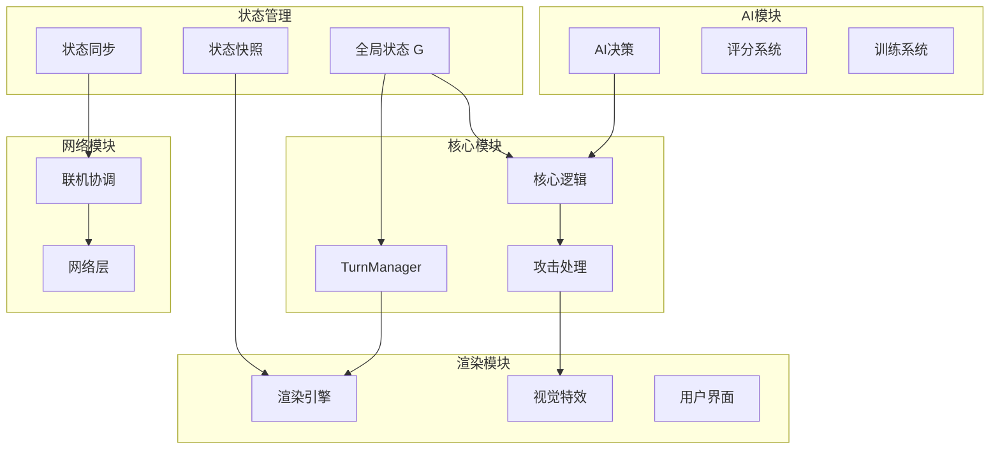
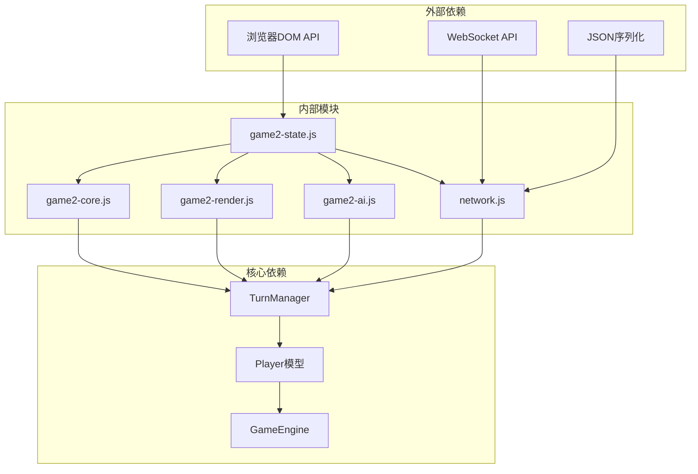

# 状态管理模块 (game2-state.js)

<cite>
**本文档引用的文件**
- [game2-state.js](file://js/game2-state.js)
- [game2-core.js](file://js/game2-core.js)
- [game2-render.js](file://js/game2-render.js)
- [game2-ai.js](file://js/game2-ai.js)
- [network.js](file://network.js)
- [game2-online.js](file://js/game2-online.js)
- [TurnManager.hx](file://TurnManager.hx)
- [Player.hx](file://model/Player.hx)
</cite>

## 目录
1. [简介](#简介)
2. [项目结构](#项目结构)
3. [核心组件](#核心组件)
4. [架构概览](#架构概览)
5. [详细组件分析](#详细组件分析)
6. [依赖关系分析](#依赖关系分析)
7. [性能考虑](#性能考虑)
8. [故障排除指南](#故障排除指南)
9. [结论](#结论)

## 简介

状态管理模块是游戏2的核心基础设施，负责维护和协调整个游戏系统的运行状态。该模块实现了完整的状态管理系统，包括玩家状态、回合状态、游戏配置和临时变量管理，并提供了状态持久化、状态同步和状态变更监听等高级功能。

本模块采用"全局状态对象 + 局部状态函数"的设计模式，通过集中式的状态存储和统一的状态更新机制，确保游戏状态的一致性和完整性。模块还集成了联机同步、AI决策、渲染更新等多个子系统的状态协调功能。

## 项目结构

状态管理模块位于JavaScript目录中，与核心游戏逻辑、渲染系统、AI模块和网络通信模块协同工作：

**图表来源**
- [game2-state.js:1-242](file://js/game2-state.js#L1-L242)
- [game2-core.js:1-223](file://js/game2-core.js#L1-L223)
- [game2-render.js:1-304](file://js/game2-render.js#L1-L304)

**章节来源**
- [game2-state.js:1-242](file://js/game2-state.js#L1-L242)
- [TurnManager.hx:1-25](file://TurnManager.hx#L1-L25)

## 核心组件

### 全局状态对象 G

全局状态对象是整个状态管理系统的核心，包含了游戏中所有需要持久化的状态信息：

**图表来源**
- [game2-state.js:5-21](file://js/game2-state.js#L5-L21)

### 玩家状态管理

玩家状态管理涵盖了角色的基本属性、战斗状态和特殊能力：

**图表来源**
- [Player.hx:3-26](file://model/Player.hx#L3-L26)
- [Player.hx:18-20](file://model/Player.hx#L18-L20)

**章节来源**
- [game2-state.js:5-21](file://js/game2-state.js#L5-L21)
- [Player.hx:3-398](file://model/Player.hx#L3-L398)

## 架构概览

状态管理模块采用了分层架构设计，确保了模块间的松耦合和高内聚：

**图表来源**
- [game2-state.js:179-242](file://js/game2-state.js#L179-L242)
- [game2-core.js:5-66](file://js/game2-core.js#L5-L66)
- [game2-render.js:35-51](file://js/game2-render.js#L35-L51)

## 详细组件分析

### 状态持久化机制

状态持久化是状态管理的核心功能之一，通过快照机制实现状态的保存和恢复：

**图表来源**
- [game2-state.js:179-220](file://js/game2-state.js#L179-L220)

状态持久化机制的关键特性：

1. **选择性快照**：只保存指定玩家的状态，减少内存占用
2. **深度复制**：确保快照的独立性，避免引用污染
3. **增量更新**：支持部分状态的恢复，提高灵活性
4. **版本兼容**：支持不同版本状态的兼容性处理

**章节来源**
- [game2-state.js:179-220](file://js/game2-state.js#L179-L220)

### 状态同步策略

状态同步是联机游戏的核心需求，通过网络层实现多客户端间的状态一致性：

**图表来源**
- [game2-online.js:63-94](file://js/game2-online.js#L63-L94)
- [network.js:56-100](file://network.js#L56-L100)

状态同步的关键机制：

1. **操作封装**：将用户操作封装为标准化的消息格式
2. **时序保证**：通过消息队列确保操作的执行顺序
3. **冲突检测**：检测并处理并发操作产生的状态冲突
4. **回滚机制**：支持状态的撤销和重放

**章节来源**
- [game2-online.js:1-94](file://js/game2-online.js#L1-L94)
- [network.js:1-113](file://network.js#L1-L113)

### 状态变更监听系统

状态变更监听系统提供了事件驱动的状态管理能力，支持多种类型的变更通知：

**图表来源**
- [game2-state.js:1-242](file://js/game2-state.js#L1-L242)

监听系统的实现特点：

1. **事件分类**：支持不同类型的状态变更事件
2. **异步通知**：采用异步机制避免阻塞主线程
3. **上下文传递**：支持携带操作上下文的事件数据
4. **生命周期管理**：提供监听器的注册和注销机制

**章节来源**
- [game2-state.js:1-242](file://js/game2-state.js#L1-L242)

### 状态更新流程

状态更新流程确保了游戏状态变更的正确性和一致性：

**图表来源**
- [game2-core.js:5-66](file://js/game2-core.js#L5-L66)
- [game2-state.js:33-43](file://js/game2-state.js#L33-L43)

状态更新的关键步骤：

1. **状态验证**：检查新状态的有效性和合法性
2. **原子操作**：确保状态变更的原子性
3. **依赖检查**：验证状态变更的前置条件
4. **副作用处理**：处理状态变更带来的副作用
5. **一致性保证**：维护多处状态的一致性

**章节来源**
- [game2-core.js:5-107](file://js/game2-core.js#L5-L107)
- [game2-state.js:33-66](file://js/game2-state.js#L33-L66)

### 与其他模块的状态交互

状态管理模块与各个子系统之间建立了紧密的状态交互关系：

**图表来源**
- [game2-state.js:222-242](file://js/game2-state.js#L222-L242)
- [game2-render.js:67-145](file://js/game2-render.js#L67-L145)
- [game2-ai.js:180-246](file://js/game2-ai.js#L180-L246)

**章节来源**
- [game2-state.js:222-242](file://js/game2-state.js#L222-L242)
- [game2-render.js:67-210](file://js/game2-render.js#L67-L210)
- [game2-ai.js:180-246](file://js/game2-ai.js#L180-L246)

## 依赖关系分析

状态管理模块的依赖关系体现了清晰的分层架构：

**图表来源**
- [game2-state.js:1-242](file://js/game2-state.js#L1-L242)
- [TurnManager.hx:1-25](file://TurnManager.hx#L1-L25)
- [Player.hx:1-398](file://model/Player.hx#L1-L398)

**章节来源**
- [game2-state.js:1-242](file://js/game2-state.js#L1-L242)
- [TurnManager.hx:1-25](file://TurnManager.hx#L1-L25)
- [Player.hx:1-398](file://model/Player.hx#L1-L398)

## 性能考虑

状态管理模块在设计时充分考虑了性能优化：

### 内存优化策略

1. **延迟初始化**：状态对象按需创建，避免不必要的内存占用
2. **对象池**：复用临时对象，减少垃圾回收压力
3. **增量更新**：只更新发生变化的状态部分
4. **弱引用**：对大型对象使用弱引用避免内存泄漏

### 计算优化

1. **缓存机制**：缓存常用的状态计算结果
2. **批量处理**：合并多个状态变更操作
3. **异步处理**：将耗时的状态计算放到后台线程
4. **懒加载**：延迟加载非必要的状态数据

### 网络优化

1. **压缩传输**：对状态数据进行压缩传输
2. **增量同步**：只同步变化的状态部分
3. **去重机制**：避免重复的状态同步
4. **背压处理**：处理网络拥塞情况下的状态同步

## 故障排除指南

### 常见问题及解决方案

#### 状态不一致问题

**症状**：不同客户端显示不同的游戏状态

**诊断步骤**：
1. 检查网络连接稳定性
2. 验证状态同步的时间戳
3. 确认操作执行顺序
4. 检查冲突解决机制

**解决方案**：
- 实现更强的时序保证机制
- 增加重放机制
- 添加状态校验和

#### 内存泄漏问题

**症状**：长时间运行后内存持续增长

**诊断步骤**：
1. 检查监听器的注册和注销
2. 验证定时器的清理
3. 确认DOM元素的释放
4. 检查闭包引用

**解决方案**：
- 实现自动清理机制
- 使用WeakMap存储弱引用
- 定期清理无用状态

#### 性能瓶颈问题

**症状**：状态更新响应缓慢

**诊断步骤**：
1. 分析状态更新的复杂度
2. 检查渲染更新频率
3. 验证网络同步开销
4. 监控内存使用情况

**解决方案**：
- 实现状态变更的批量处理
- 优化渲染更新机制
- 实现状态缓存机制

**章节来源**
- [game2-state.js:1-242](file://js/game2-state.js#L1-L242)
- [network.js:1-113](file://network.js#L1-L113)

## 结论

状态管理模块作为游戏2的核心基础设施，成功实现了复杂的游戏状态管理需求。通过精心设计的架构和完善的机制，该模块为整个游戏系统提供了稳定可靠的状态管理服务。

模块的主要优势包括：

1. **完整性**：覆盖了游戏状态的所有方面，从玩家状态到回合状态
2. **一致性**：通过严格的验证和同步机制确保状态一致性
3. **扩展性**：模块化设计便于功能扩展和维护
4. **性能**：优化的算法和数据结构保证了良好的性能表现
5. **可靠性**：完善的错误处理和故障恢复机制

未来可以考虑的改进方向：

1. **状态版本管理**：实现更精细的状态版本控制
2. **增量同步优化**：进一步优化网络同步效率
3. **状态压缩**：实现更高效的状态数据压缩
4. **监控增强**：增加更全面的状态监控和调试功能

该模块为游戏2的成功运行奠定了坚实的基础，是整个游戏系统的重要组成部分。