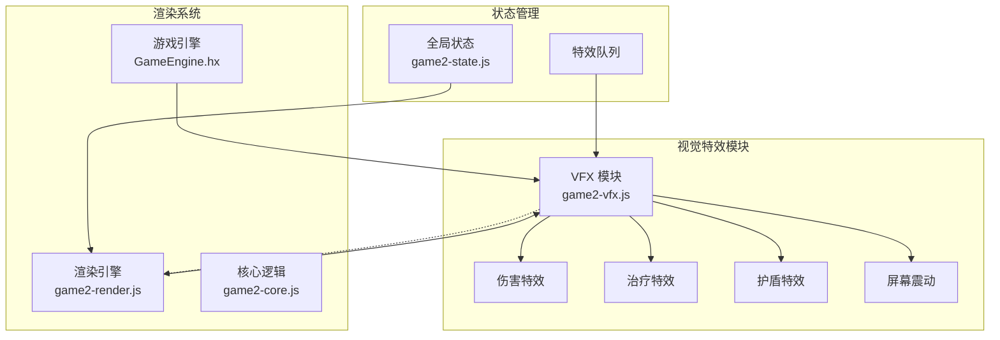
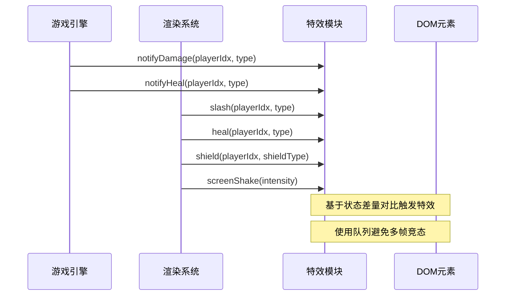
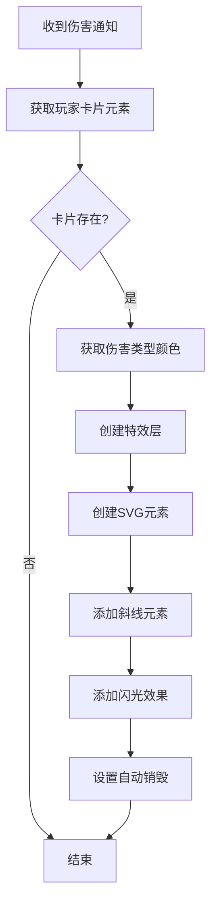
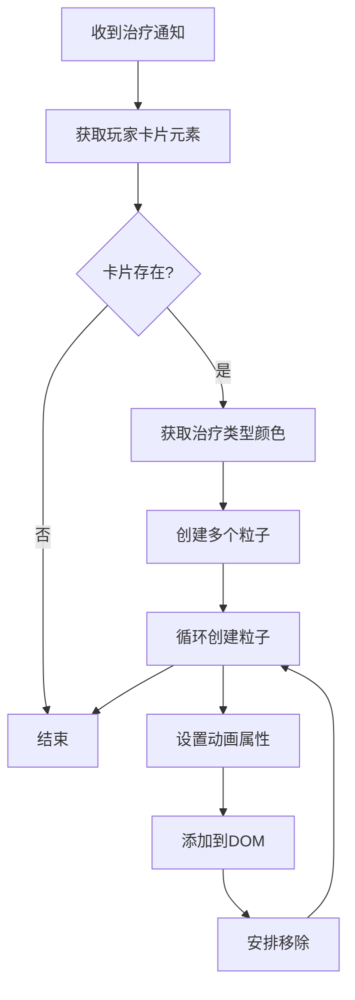
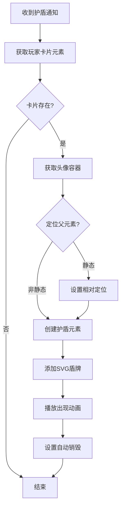
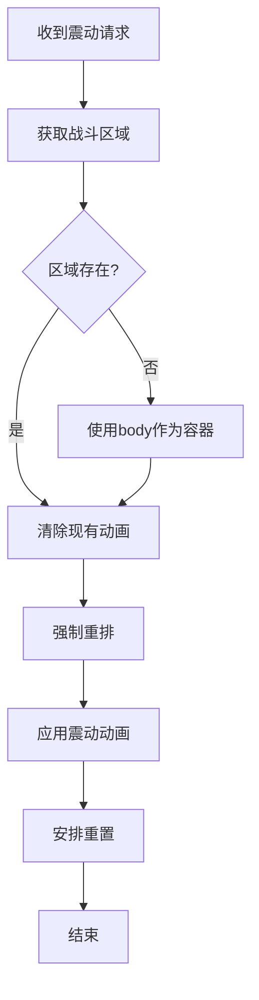
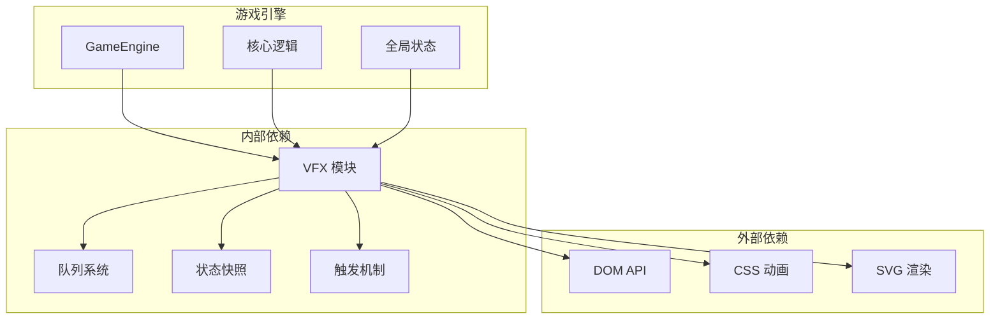
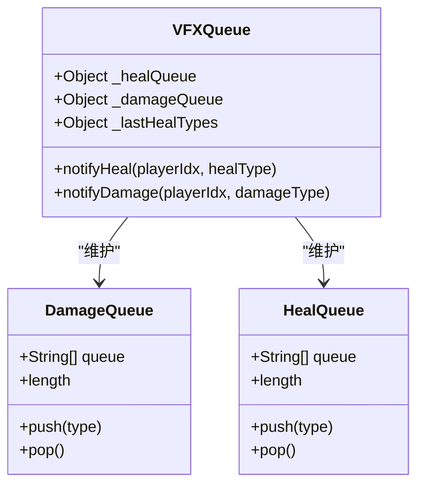
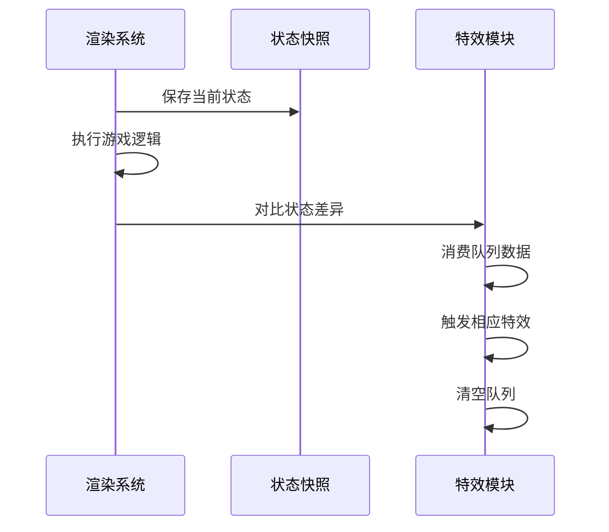

# 视觉特效模块 (game2-vfx.js)

<cite>
**本文档引用的文件**
- [game2-vfx.js](file://js/game2-vfx.js)
- [game2-render.js](file://js/game2-render.js)
- [GameEngine.hx](file://GameEngine.hx)
- [main.js](file://main.js)
- [game2-core.js](file://js/game2-core.js)
- [game2-state.js](file://js/game2-state.js)
</cite>

## 目录
1. [简介](#简介)
2. [项目结构](#项目结构)
3. [核心组件](#核心组件)
4. [架构概览](#架构概览)
5. [详细组件分析](#详细组件分析)
6. [依赖关系分析](#依赖关系分析)
7. [性能考虑](#性能考虑)
8. [故障排除指南](#故障排除指南)
9. [结论](#结论)
10. [附录](#附录)

## 简介

视觉特效模块 (game2-vfx.js) 是一个专为战斗系统设计的前端特效引擎，负责在游戏界面中呈现各种视觉反馈效果。该模块实现了完整的伤害特效、治疗特效、护盾特效和屏幕震动等核心特效类型，并通过智能的触发机制确保特效与游戏状态保持同步。

该模块采用"状态差量对比"的触发机制，通过队列系统避免多帧竞态条件，确保特效播放的准确性和一致性。模块支持多种伤害类型（物理、法术、真实、毒性）和治疗类型（回复、补给），并提供了灵活的颜色配置和动画参数定制能力。

## 项目结构

视觉特效模块位于项目的 JavaScript 目录中，与游戏核心渲染系统紧密集成：

**图表来源**
- [game2-vfx.js:1-305](file://js/game2-vfx.js#L1-L305)
- [game2-render.js:1-304](file://js/game2-render.js#L1-L304)
- [GameEngine.hx:1-200](file://GameEngine.hx#L1-L200)

**章节来源**
- [game2-vfx.js:1-305](file://js/game2-vfx.js#L1-L305)
- [game2-render.js:1-304](file://js/game2-render.js#L1-L304)

## 核心组件

视觉特效模块包含四个主要的特效组件，每个组件都有独特的视觉表现和触发逻辑：

### 伤害特效 (Slash)
伤害特效通过 SVG 斜线动画展示物理伤害效果，支持四种伤害类型：
- 物理伤害：红色渐变效果
- 法术伤害：紫色渐变效果  
- 真实伤害：白色高亮效果
- 毒性伤害：绿色渐变效果

### 治疗特效 (Heal)
治疗特效以浮动的"+"符号呈现，模拟治疗效果的上升动画，支持两种治疗类型：
- 回复治疗：绿色 "+" 符号
- 补给治疗：黄色 "+" 符号

### 护盾特效 (Shield)
护盾特效通过精美的 SVG 盾牌图标展示护盾的出现和消失，支持四种护盾类型：
- 物理护盾：蓝色系配色
- 法术护盾：紫色系配色
- 物法护盾：红色系配色
- 真实护盾：绿色系配色

### 屏幕震动 (Screen Shake)
屏幕震动特效通过 CSS 动画实现屏幕的轻微抖动，强度与伤害量成正比。

**章节来源**
- [game2-vfx.js:14-34](file://js/game2-vfx.js#L14-L34)
- [game2-vfx.js:54-119](file://js/game2-vfx.js#L54-L119)
- [game2-vfx.js:124-159](file://js/game2-vfx.js#L124-L159)
- [game2-vfx.js:164-224](file://js/game2-vfx.js#L164-L224)
- [game2-vfx.js:229-236](file://js/game2-vfx.js#L229-L236)

## 架构概览

视觉特效模块采用分层架构设计，实现了清晰的职责分离和松耦合的组件交互：

**图表来源**
- [game2-render.js:164-209](file://js/game2-render.js#L164-L209)
- [game2-vfx.js:242-255](file://js/game2-vfx.js#L242-L255)

### 触发机制架构

特效触发采用"状态差量对比"机制，通过以下步骤实现：

1. **状态快照**：渲染前保存当前游戏状态
2. **状态对比**：渲染后与快照进行对比
3. **差量检测**：识别 HP 变化、护盾增减等状态变化
4. **队列消费**：使用队列中的精确类型信息
5. **特效播放**：根据检测结果触发相应特效

**章节来源**
- [game2-render.js:64-86](file://js/game2-render.js#L64-L86)
- [game2-render.js:156-209](file://js/game2-render.js#L156-L209)

## 详细组件分析

### 伤害特效系统

伤害特效系统通过 SVG 线条动画实现，具有以下特点：

**图表来源**
- [game2-vfx.js:54-119](file://js/game2-vfx.js#L54-L119)

#### 颜色配置系统
伤害特效支持四种伤害类型的专属颜色配置：
- 物理伤害：深红到浅红的渐变效果
- 法术伤害：紫罗兰到淡紫的渐变效果
- 真实伤害：灰白到纯白的高亮效果
- 毒性伤害：深绿到浅绿的自然效果

#### 动画时序管理
伤害特效包含两个主要动画：
1. **斜线绘制动画**：使用虚线和描边动画实现斜线绘制效果
2. **闪光动画**：短暂的全屏闪光增强视觉冲击力

**章节来源**
- [game2-vfx.js:14-20](file://js/game2-vfx.js#L14-L20)
- [game2-vfx.js:54-119](file://js/game2-vfx.js#L54-L119)

### 治疗特效系统

治疗特效系统通过浮动的 "+" 符号实现，具有以下特性：

**图表来源**
- [game2-vfx.js:124-159](file://js/game2-vfx.js#L124-L159)

#### 粒子系统设计
治疗特效采用粒子系统设计，每个 "+" 符号都有独特的动画参数：
- **数量控制**：随机生成 7-9 个 "+" 符号
- **位置随机**：在头像区域内随机分布
- **尺寸变化**：14-22px 的字体大小范围
- **动画时长**：900-1300ms 的浮动时间
- **移动轨迹**：向上浮动并伴随缩放效果

#### 治疗类型区分
- **回复治疗**：绿色 "+" 符号，表示常规回血效果
- **补给治疗**：黄色 "+" 符号，表示特殊资源回复

**章节来源**
- [game2-vfx.js:23-26](file://js/game2-vfx.js#L23-L26)
- [game2-vfx.js:124-159](file://js/game2-vfx.js#L124-L159)

### 护盾特效系统

护盾特效系统通过精美的 SVG 盾牌图标实现，具有以下特点：

**图表来源**
- [game2-vfx.js:164-224](file://js/game2-vfx.js#L164-L224)

#### 护盾类型系统
护盾特效支持四种护盾类型的专属视觉风格：
- **物理护盾**：蓝色系配色，代表物理防护
- **法术护盾**：紫色系配色，代表魔法防护
- **物法护盾**：红色系配色，代表双重防护
- **真实护盾**：绿色系配色，代表无属性防护

#### SVG 渲染优化
护盾特效使用 SVG 渲染，具有以下优势：
- **矢量图形**：无损缩放，适配不同屏幕尺寸
- **滤镜效果**：发光、阴影等高级视觉效果
- **渐变填充**：丰富的色彩层次表现

**章节来源**
- [game2-vfx.js:29-34](file://js/game2-vfx.js#L29-L34)
- [game2-vfx.js:164-224](file://js/game2-vfx.js#L164-L224)

### 屏幕震动系统

屏幕震动系统通过 CSS 动画实现，具有以下特性：

**图表来源**
- [game2-vfx.js:229-236](file://js/game2-vfx.js#L229-L236)

#### 震动强度控制
屏幕震动的强度与伤害量成正比关系：
- **小伤害**：轻微震动 (0.3s)
- **中等伤害**：中等震动 (0.4s)
- **大伤害**：强烈震动 (0.5s)
- **极强伤害**：最大震动 (0.6s)

#### 动画参数优化
震动动画采用精心设计的关键帧序列，确保视觉效果自然流畅。

**章节来源**
- [game2-vfx.js:229-236](file://js/game2-vfx.js#L229-L236)

## 依赖关系分析

视觉特效模块与游戏系统的依赖关系如下：

**图表来源**
- [game2-vfx.js:11-305](file://js/game2-vfx.js#L11-L305)
- [GameEngine.hx:137-233](file://GameEngine.hx#L137-L233)

### 队列系统设计

特效模块实现了完整的队列系统来避免多帧竞态条件：

**图表来源**
- [game2-vfx.js:242-255](file://js/game2-vfx.js#L242-L255)

### 状态快照机制

渲染系统实现了状态快照机制来支持差量对比：

**图表来源**
- [game2-render.js:64-86](file://js/game2-render.js#L64-L86)
- [game2-render.js:156-209](file://js/game2-render.js#L156-L209)

**章节来源**
- [game2-vfx.js:242-255](file://js/game2-vfx.js#L242-L255)
- [game2-render.js:64-86](file://js/game2-render.js#L64-L86)

## 性能考虑

视觉特效模块在设计时充分考虑了性能优化：

### DOM 操作优化
- **批量创建**：一次性创建特效元素，减少 DOM 操作次数
- **自动清理**：特效完成后自动移除元素，避免内存泄漏
- **层级管理**：使用 z-index 控制特效层级，避免不必要的重绘

### 动画性能优化
- **GPU 加速**：使用 CSS transform 和 opacity 实现硬件加速
- **关键帧优化**：精心设计的关键帧减少计算开销
- **动画时长控制**：合理设置动画时长避免长时间运行

### 内存管理
- **队列限制**：队列长度有限，避免内存累积
- **定时清理**：使用 setTimeout 确保元素及时清理
- **事件监听**：特效完成后移除事件监听器

## 故障排除指南

### 常见问题及解决方案

#### 特效不显示
**症状**：点击后没有看到任何特效
**可能原因**：
- 玩家卡片元素不存在
- 队列数据为空
- CSS 动画未正确加载

**解决方法**：
1. 检查 HTML 结构中是否存在对应的卡片元素
2. 确认特效通知已经正确发送到队列
3. 验证 CSS 样式表是否正确加载

#### 特效颜色异常
**症状**：特效颜色不符合预期
**可能原因**：
- 伤害类型配置错误
- 颜色映射表损坏
- 浏览器兼容性问题

**解决方法**：
1. 检查伤害类型枚举值
2. 验证颜色配置数组
3. 测试不同浏览器的兼容性

#### 动画卡顿
**症状**：特效动画播放不流畅
**可能原因**：
- DOM 操作过多
- CSS 动画复杂度过高
- 设备性能不足

**解决方法**：
1. 减少同时播放的特效数量
2. 简化动画效果
3. 优化 CSS 选择器

**章节来源**
- [game2-vfx.js:36-49](file://js/game2-vfx.js#L36-L49)
- [game2-vfx.js:260-300](file://js/game2-vfx.js#L260-L300)

## 结论

视觉特效模块通过精心设计的架构和优化的实现方案，成功地为游戏提供了丰富而流畅的视觉反馈体验。模块的核心优势包括：

1. **智能触发机制**：基于状态差量对比的精确触发，避免了竞态条件
2. **类型化队列系统**：确保特效类型信息的准确性传递
3. **性能优化设计**：通过多种技术手段保证特效的流畅播放
4. **可扩展架构**：模块化的组件设计便于功能扩展

该模块不仅满足了当前游戏的需求，还为未来的功能扩展奠定了良好的基础。通过合理的抽象和清晰的接口设计，开发者可以轻松地添加新的特效类型或修改现有特效的行为。

## 附录

### 扩展指南

#### 添加新特效类型
1. 在颜色配置中添加新类型的配色方案
2. 实现新的特效函数
3. 在触发机制中注册新特效
4. 添加相应的 CSS 动画定义

#### 自定义动画参数
1. 修改现有的 CSS 关键帧定义
2. 调整动画时长和缓动函数
3. 优化动画性能参数
4. 测试不同设备上的表现

#### 集成第三方动画库
1. 评估第三方库的功能需求
2. 设计适配层封装第三方 API
3. 维护现有特效的兼容性
4. 测试集成后的性能影响