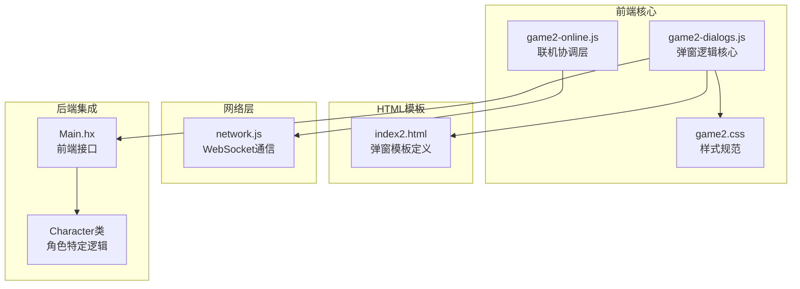
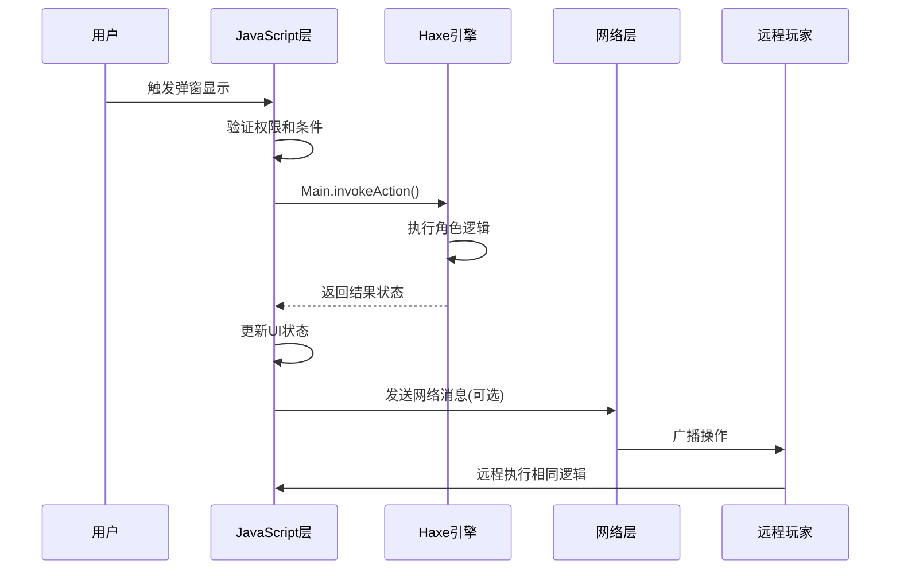
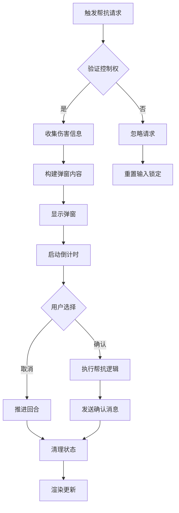
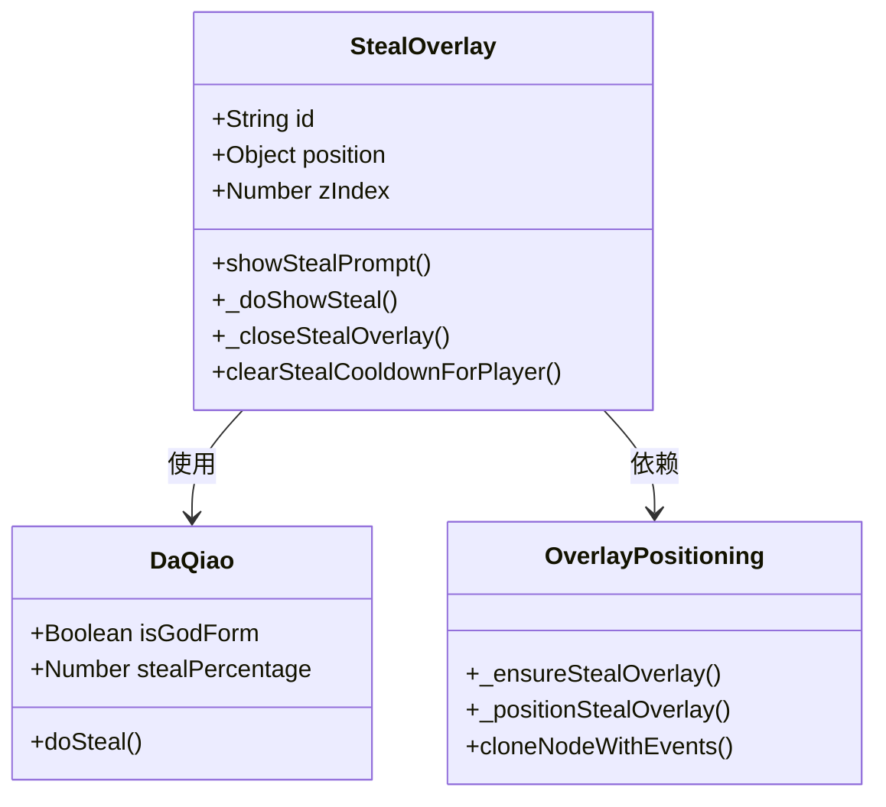
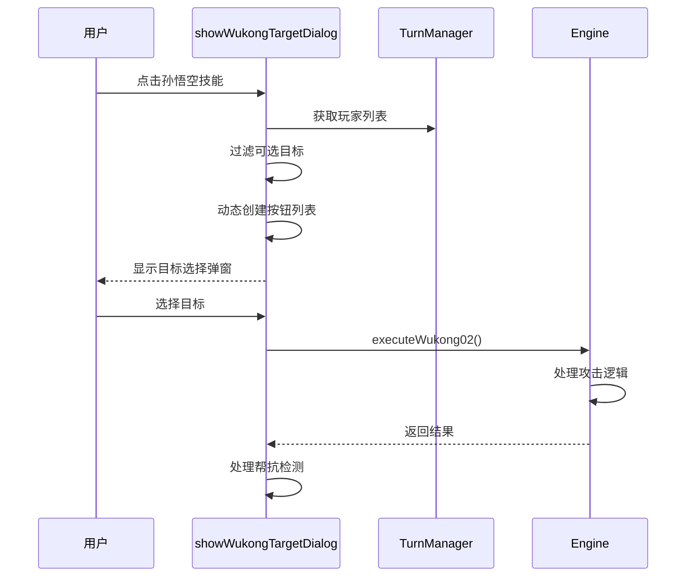
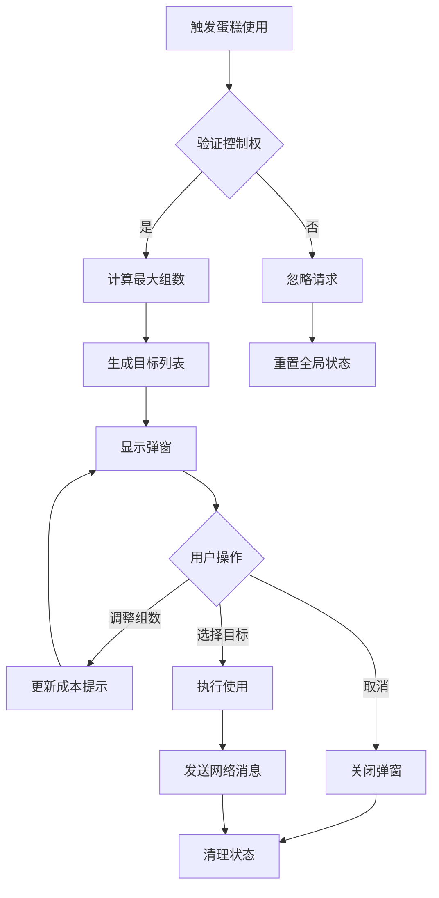
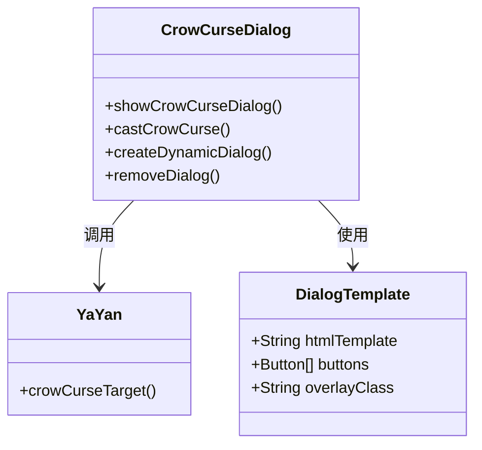
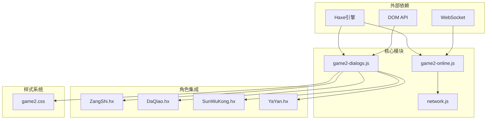

# 对话框系统

<cite>
**本文档引用的文件**
- [game2-dialogs.js](file://js/game2-dialogs.js)
- [game2-online.js](file://js/game2-online.js)
- [game2.css](file://css/game2.css)
- [index2.html](file://index2.html)
- [network.js](file://network.js)
- [PROJECT_ONBOARDING.md](file://PROJECT_ONBOARDING.md)
- [ZangShi.hx](file://character/ZangShi.hx)
- [DaQiao.hx](file://character/DaQiao.hx)
- [SunWuKong.hx](file://character/SunWuKong.hx)
- [YaYan.hx](file://character/YaYan.hx)
</cite>

## 目录
1. [简介](#简介)
2. [项目结构](#项目结构)
3. [核心组件](#核心组件)
4. [架构概览](#架构概览)
5. [详细组件分析](#详细组件分析)
6. [依赖关系分析](#依赖关系分析)
7. [性能考虑](#性能考虑)
8. [故障排除指南](#故障排除指南)
9. [结论](#结论)

## 简介

对话框系统是指尖博弈2v2游戏中的重要交互组件，负责处理各种用户交互场景，包括但不限于帮抗确认、目标选择、技能使用、阵营选择等。该系统采用模块化设计，通过统一的JavaScript接口与Haxe后端引擎进行交互，实现了灵活的弹窗管理和丰富的用户界面体验。

系统支持本地模式和联机模式两种运行环境，能够根据玩家控制权和游戏状态动态显示相应的弹窗。所有弹窗都遵循统一的样式规范，确保视觉一致性和良好的用户体验。

## 项目结构

对话框系统主要分布在以下文件中：

**图表来源**
- [game2-dialogs.js:1-372](file://js/game2-dialogs.js#L1-L372)
- [index2.html:327-370](file://index2.html#L327-L370)
- [game2-online.js:1-169](file://js/game2-online.js#L1-L169)

**章节来源**
- [game2-dialogs.js:1-372](file://js/game2-dialogs.js#L1-L372)
- [index2.html:327-370](file://index2.html#L327-L370)

## 核心组件

### 弹窗管理系统

对话框系统采用统一的管理机制，通过以下核心函数实现弹窗的创建、显示和销毁：

- `showHelpTankDialog()`: 帮助坦克弹窗，处理濒死保护请求
- `showWukongTargetDialog()`: 孙悟空目标选择弹窗
- `showStealPrompt()`: 大乔抢夺弹窗
- `openCakeDialog()`: 蛋糕使用弹窗
- `showCrowCurseDialog()`: 鸦眼诅咒弹窗

### 联机协调机制

系统集成了完整的联机功能，通过以下机制确保多玩家间的同步：

- 控制权管理：`ONLINE.charControl` 数组跟踪每个角色的控制者
- 消息传递：通过WebSocket传输弹窗相关的用户操作
- 状态同步：远程玩家的操作通过`NET.onRemoteAction`处理

### 样式系统

采用CSS模块化设计，确保弹窗的一致性和可定制性：

- 通用样式：`.overlay` 和 `.dialog-box` 类
- 角色特定样式：针对不同角色的弹窗颜色主题
- 响应式设计：适配不同屏幕尺寸

**章节来源**
- [game2-dialogs.js:6-88](file://js/game2-dialogs.js#L6-L88)
- [game2-dialogs.js:102-148](file://js/game2-dialogs.js#L102-L148)
- [game2-dialogs.js:204-282](file://js/game2-dialogs.js#L204-L282)
- [game2-dialogs.js:290-371](file://js/game2-dialogs.js#L290-L371)

## 架构概览

对话框系统采用分层架构设计，实现了清晰的关注点分离：

**图表来源**
- [game2-dialogs.js:126-147](file://js/game2-dialogs.js#L126-L147)
- [game2-online.js:63-121](file://js/game2-online.js#L63-L121)
- [PROJECT_ONBOARDING.md:158-159](file://PROJECT_ONBOARDING.md#L158-L159)

系统架构的关键特性：

1. **权限控制**：基于`ONLINE.charControl`确保只有当前控制者能看到相关弹窗
2. **状态管理**：使用全局变量`G`存储弹窗状态和上下文信息
3. **事件驱动**：通过回调函数处理用户交互和系统事件
4. **错误处理**：统一的异常捕获和错误提示机制

## 详细组件分析

### 帮抗弹窗系统

帮抗弹窗是系统中最复杂的交互之一，涉及多个角色的状态管理和时间限制：

**图表来源**
- [game2-dialogs.js:6-88](file://js/game2-dialogs.js#L6-L88)
- [game2-dialogs.js:51-88](file://js/game2-dialogs.js#L51-L88)

帮抗弹窗的特点：

- **实时计算**：动态计算伤害倍率和总惩罚值
- **时间压力**：10秒倒计时增加紧迫感
- **状态同步**：与游戏引擎的伤害日志保持同步
- **联机支持**：支持多玩家间的帮抗确认

### 大乔抢夺弹窗

大乔抢夺弹窗采用独特的定位策略，直接嵌入到角色卡片内部：

**图表来源**
- [game2-dialogs.js:162-282](file://js/game2-dialogs.js#L162-L282)
- [DaQiao.hx:1-200](file://character/DaQiao.hx#L1-L200)

抢夺弹窗的独特设计：

- **绝对定位**：使用`position:absolute`相对于角色卡片定位
- **动态创建**：首次使用时才创建DOM节点，避免内存浪费
- **冷却机制**：每回合每个治疗者只能触发一次抢夺
- **AI集成**：智能AI自动选择最优的抢夺时机

### 孙悟空目标选择弹窗

目标选择弹窗采用动态列表生成方式：

**图表来源**
- [game2-dialogs.js:102-148](file://js/game2-dialogs.js#L102-L148)
- [SunWuKong.hx:1-200](file://character/SunWuKong.hx#L1-L200)

目标选择的业务逻辑：

- **阵营过滤**：排除己方和死亡玩家
- **动态生成**：根据当前游戏状态实时生成可选列表
- **事件绑定**：为每个按钮绑定相应的点击处理函数
- **状态快照**：在执行前保存目标的防御状态

### 蛋糕使用弹窗

蛋糕弹窗提供了复杂的参数配置功能：

**图表来源**
- [game2-dialogs.js:290-337](file://js/game2-dialogs.js#L290-L337)
- [ZangShi.hx:172-201](file://character/ZangShi.hx#L172-L201)

蛋糕弹窗的功能特性：

- **组数配置**：支持1-3组的灵活配置
- **成本计算**：实时计算消耗的蛋糕数量和产生的效果
- **目标筛选**：自动过滤不可选的目标
- **联机同步**：完整的网络消息传递机制

### 鸦眼诅咒弹窗

鸦眼诅咒弹窗是最简单的弹窗类型，采用动态创建和销毁策略：

**图表来源**
- [game2-dialogs.js:342-371](file://js/game2-dialogs.js#L342-L371)
- [YaYan.hx:1-200](file://character/YaYan.hx#L1-L200)

鸦眼弹窗的设计理念：

- **最小实现**：仅包含必要的HTML结构
- **动态生命周期**：每次使用时创建，关闭时销毁
- **简洁交互**：提供明确的阵营选择选项
- **即时反馈**：用户选择后立即执行相应逻辑

**章节来源**
- [game2-dialogs.js:6-88](file://js/game2-dialogs.js#L6-L88)
- [game2-dialogs.js:102-148](file://js/game2-dialogs.js#L102-L148)
- [game2-dialogs.js:162-282](file://js/game2-dialogs.js#L162-L282)
- [game2-dialogs.js:290-371](file://js/game2-dialogs.js#L290-L371)

## 依赖关系分析

对话框系统的依赖关系呈现清晰的层次结构：

**图表来源**
- [game2-dialogs.js:1-372](file://js/game2-dialogs.js#L1-L372)
- [game2-online.js:1-169](file://js/game2-online.js#L1-L169)
- [network.js:1-113](file://network.js#L1-L113)

系统的关键依赖特性：

1. **松耦合设计**：各模块间通过明确定义的接口交互
2. **角色特定集成**：每个角色类都实现了相应的弹窗逻辑
3. **网络透明性**：网络层对弹窗逻辑完全透明
4. **样式独立性**：CSS样式与JavaScript逻辑完全分离

**章节来源**
- [game2-dialogs.js:1-372](file://js/game2-dialogs.js#L1-L372)
- [game2-online.js:1-169](file://js/game2-online.js#L1-L169)
- [network.js:1-113](file://network.js#L1-L113)

## 性能考虑

对话框系统在设计时充分考虑了性能优化：

### 内存管理
- **动态创建**：仅在需要时创建弹窗DOM节点
- **及时销毁**：弹窗关闭时立即移除DOM节点
- **状态清理**：使用全局变量存储状态，避免内存泄漏

### 渲染优化
- **批量更新**：使用DocumentFragment减少DOM重绘
- **延迟加载**：弹窗内容按需生成，避免不必要的计算
- **事件委托**：合理使用事件委托减少事件处理器数量

### 网络效率
- **消息压缩**：仅传输必要的操作数据
- **去重机制**：防止重复的弹窗请求
- **超时处理**：合理的超时机制避免资源占用

## 故障排除指南

### 常见问题及解决方案

**弹窗无法显示**
1. 检查DOM元素是否存在
2. 验证用户是否有操作权限
3. 确认全局状态变量正确设置

**联机功能异常**
1. 检查WebSocket连接状态
2. 验证角色控制权配置
3. 确认网络消息格式正确

**性能问题**
1. 检查是否有过多的DOM节点
2. 验证事件处理器是否正确清理
3. 监控内存使用情况

**章节来源**
- [game2-dialogs.js:26-27](file://js/game2-dialogs.js#L26-L27)
- [game2-online.js:147-158](file://js/game2-online.js#L147-L158)

## 结论

对话框系统展现了优秀的软件工程实践，通过模块化设计、清晰的职责分离和完善的错误处理机制，实现了功能丰富且易于维护的弹窗管理方案。

系统的主要优势包括：

1. **架构清晰**：分层设计使得各模块职责明确，便于维护和扩展
2. **用户体验**：多样化的弹窗类型满足不同的游戏交互需求
3. **性能优化**：合理的内存管理和渲染优化确保系统流畅运行
4. **可扩展性**：标准化的接口设计为添加新的弹窗类型提供了便利

未来可以考虑的改进方向：

1. **组件化重构**：将弹窗系统重构为可复用的React/Vue组件
2. **动画增强**：添加更丰富的过渡动画效果提升用户体验
3. **无障碍支持**：增加键盘导航和屏幕阅读器支持
4. **移动端优化**：针对触摸设备优化弹窗交互体验